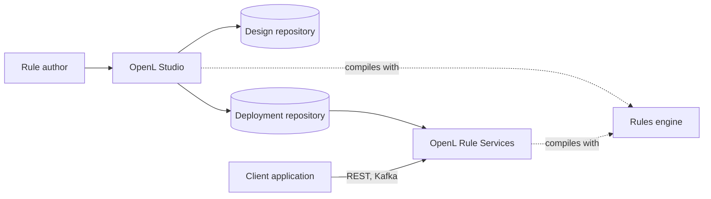
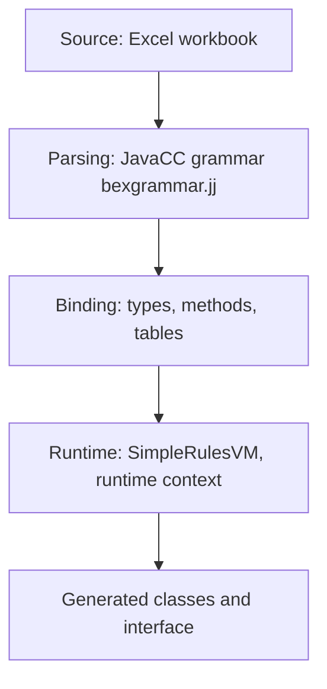
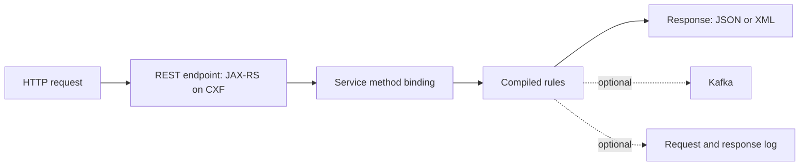

# Architecture

OpenL Tablets compiles Excel workbooks into Java classes at run time. Three products share one rules engine:

- **Rules engine** (`DEV/`) — parses and binds the tables of a workbook, generates the classes, and runs the rules.
- **OpenL Studio** (`STUDIO/`) — a web application to author, test, trace and deploy rules projects.
- **OpenL Rule Services** (`WSFrontend/`) — an application that runs deployed rules projects as services.

- **Design repository** — holds the rules projects under development. It is a Git repository by default.
- **Deployment repository** — holds the deployed projects. Rule Services read their services from it.
- **Repository types** — Git, a database (JDBC or JNDI), AWS S3 and Azure Blob storage, for both kinds.

The module list is in [Codebase Tour](onboarding/codebase-tour.md), and the module dependencies are in
[Dependencies](architecture/dependencies.md).

## Rules Engine

The layers of the engine, from the source to the generated classes:

- **Entry point** — `RulesEngineFactory` compiles a workbook into an instance of a Java interface. A whole project,
  with its modules and dependencies, is compiled through `SimpleProjectEngineFactory`.
- **Type system** — `IOpenClass`, `IOpenMethod` and `IOpenField` parallel the Java reflection types. A table can define
  a type, for example a Datatype table.
- **Binding and execution are separate** — type checking and method resolution happen at compile time and never at
  run time.
- **Generated code** — the interface of the rules and the classes of the Datatype tables are generated as bytecode
  with ASM.
- **Runtime context** — `IRulesRuntimeContext` carries the values, such as a date or a region, that select the version
  of a table to run.
- **Function libraries** — the functions that rules call are Java classes registered with
  `LibrariesRegistry.addJavalib`; `org.openl.rules.util` holds the built-in ones.
- **Gap and overlap check** — `org.openl.ie.constrainer` checks the conditions of a decision table.

[Decision Table Condition Indexing](architecture/decision-table-condition-indexing.md) describes how decision tables
look up their rules.

## OpenL Studio

The server renders no page. A Spring backend answers the REST API under `/rest` and the WebSocket handshake under
`/ws`; every other address gets the one page of the React application, which draws every screen in the browser.

- **Frontend** — `STUDIO/studio-ui`: React, TypeScript and Ant Design, built with Vite.
- **Backend** — `STUDIO/studio-backend`: controllers in `org.openl.studio.**.rest.controller`, services,
  security, and the OpenAPI description of the API at `/rest/openapi.json`.
- **Repositories** — `org.openl.rules.repository` and its Git, AWS S3 and Azure Blob variants; the JDBC repositories
  are in the base module. A project of a user is copied into a workspace
  ([Workspace Metainfo Registry](architecture/workspace-metainfo-registry.md)). `GitRepository` checks a branch name or
  a revision it is given against the Git reference-name rules before it looks them up, so a name such as
  `../../config` fails with an `IOException`. A commit id is a valid revision as it is.
- **Branches** — a project can live in several Git branches
  ([Cross-Branch Projects](architecture/cross-branch-projects.md)).
- **Editing** — a table write locks the project ([Project Editing Lock](architecture/project-editing-lock.md)) and
  compiles only the module that changed.
- **Live updates** — the server pushes changes of projects and compile states over the WebSocket
  ([WebSocket Change Notifications](architecture/websocket-change-notifications.md)).
- **Clients** — state of one client is kept per client, not per HTTP session
  ([Client Sessions](architecture/client-sessions.md)).
- **User guides** — the guides in `Docs/user-guides` are packed into the war and shown at `/docs`
  ([Embedded User Guides](architecture/embedded-user-guides.md)).
- **Database** — users, groups, access rights and personal access tokens are stored in a database; Flyway scripts in
  `STUDIO/studio-backend/resources/db/flyway/` create and migrate it. The database is used unless
  `user.mode` is `single`, and the default one is an embedded H2 database.

The REST API is described in [API](api/README.md).

## OpenL Rule Services

- **Core** — `org.openl.rules.ruleservice` loads the rules from a repository (`RuleServiceLoader`), compiles them and
  publishes them as services.
- **Web layer** — `org.openl.rules.ruleservice.ws`: the REST endpoints, the admin API, the Kafka integration, and the
  Spring configuration.
- **Deployment** — rules deploy without stopping the application; the deployer module deploys artifacts.
- **Logging** — the `storelogdata` modules store requests and responses; the database storage is a separate module.
- **Variants** — the "all" WAR adds the Git, AWS S3 and Azure Blob repositories and the database log storage.

## Extension Points

- **Function libraries** — see the rules engine above.
- **Rule Services configuration** — a Spring bean definition file `META-INF/openl/extension-*.xml` on the classpath
  is loaded by Rule Services ([Spring Integration](integration-guides/spring.md)).
- **Service settings** — `rules-deploy.xml` of a project ([rules-deploy.xml](ref/rules-deploy.xml.md)).
- **Security of Rule Services** — [Security](configuration/security.md) and the
  [production example](examples/production/README.md).

## Security

- **Authentication of OpenL Studio** — the `user.mode` property selects `single` (no authentication, one user with
  administrative privileges), `multi` (users in the database), `ad` (LDAP and Active Directory), `saml` or `oauth2`.
- **Clients of the REST API** — a request can carry a bearer token, a personal access token or Basic credentials
  ([Personal Access Tokens](api/personal-access-token-architecture.md)).
- **Authorization** — access control lists give users and groups their permissions on projects and repositories.

## Deployment

OpenL Studio and Rule Services are delivered as WAR files and Docker images; see [Deployment](DEPLOYMENT.md) and
[Supported Platforms](supported-platforms.md).
