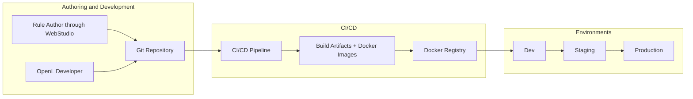
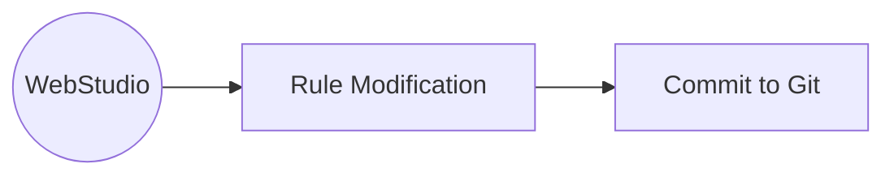
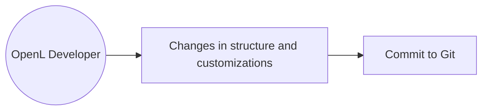
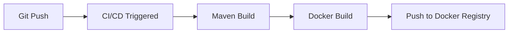
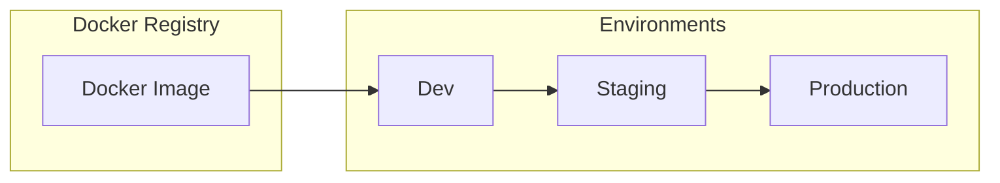

# OpenL Tablets: Deployment in a Product Environment

## What This Is

This document outlines one practical way to structure OpenL Tablets for use in a modern software delivery environment. It’s not the only way, but it’s a reliable recipe designed to:

- Separate rule **authoring** from **deployment**
- Keep rules **version-controlled**, **reviewable**, and **testable**
- Enable **automation**, **repeatability**, and **promotion** across environments
- Support advanced **OpenL customization** through a dedicated developer role

The architecture builds on familiar patterns from Java and microservice development — using Git, Maven, Docker, and CI/CD — and adapts them to the unique needs of OpenL Tablets.

---

## System Architecture at a Glance

The system consists of **five key roles**:

- **Rule Author** – edits business rules using WebStudio
- **OpenL Developer** – configures, extends, and customizes the rule platform 
- **DevOps Engineer** – maintains CI/CD pipelines and environment promotion
- **CI/CD System** – builds and packages artifacts and containers
- **Environments** – runtime environments like Dev, Staging, and Production

These roles interact through four core stages:

1. **Authoring** – users write rules via WebStudio, backed by Git
2. **Development** – OpenL developers maintain project structure, extensions, Groovy/Java functions, and configuration
3. **Build & Package** – CI/CD turns rules into artifacts and containers
4. **Deployment & Promotion** – artifacts are deployed into Dev → Staging → Production

```mermaid
graph LR
    subgraph Authoring and Development
        A[Rule Author through WebStudio]
        A --> B[Git Repository]
        C[OpenL Developer]
        C --> B
    end

    subgraph CI/CD
        B --> D[CI/CD Pipeline]
        D --> E[Build Artifacts + Docker Images]
        E --> F[Docker Registry]
    end

    subgraph Environments
        F --> G[Dev]
        G --> H[Staging]
        H --> I[Production]
    end
```

## Why This Setup Works

- **WebStudio** is for rule editing, not runtime execution
- **Git** is the source of truth for both rules and platform extensions
- **OpenL Developers** maintain and extend project structure, extensions, and custom code
- **CI/CD** automates everything from build to deployment
- **Environments** are isolated and changes are promoted upward

## Roles and Responsibilities

### Rule Author (WebStudio User)
- Modifies rule tables using WebStudio
- Tests rule logic interactively
- Commits changes to Git

### OpenL Developer

- Maintains structure of rules project 
- Adds or modifies custom code if needed
- Manages extensions
- Configures Maven build and project setup
- Collaborates with Rule Authors but focuses on technical aspects

### DevOps Engineer
- Manages CI/CD tools (e.g. Jenkins, GitHub Actions)
- Configures pipelines for builds, packaging, and promotion
- Ensures environment consistency and infrastructure automation

## Rule Authoring Process

```mermaid
flowchart LR
A((WebStudio)) --> B[Rule Modification]
B --> C[Commit to Git]
```

WebStudio is deployed in a dedicated Tooling Environment, which connects to a central Git repository. This allows rule authors to work safely, while all changes are version-controlled.

## OpenL Development Process

```mermaid
flowchart LR
A((OpenL Developer)) --> B[Changes in structure and customizations]
B --> C[Commit to Git]
```
Generally only needed when some customizations are required or major structure changes

## CI/CD Build and Packaging

```mermaid
flowchart LR
A[Git Push] --> B[CI/CD Triggered]
B --> C[Maven Build]
C --> D[Docker Build]
D --> F[Push to Docker Registry]
```

This automated process packages the rules and any supporting logic into a consistent Docker image for deployment.

Could be triggered manually, periodically (for instance, nightly), or after every commit.

## 🚀 Deployment & Promotion

Artifacts are deployed progressively:

| Environment |  Purpose | Changes                                       | 	Deployment      |
|-----------| --- |-----------------------------------------------|------------------|
| Tooling	  | Rule editing & testing	| Rules only, through WebStudio	                | CI job           |
| Development |	Internal testing | 	Everything, through access to Git repository | 	CI job          |
| Staging   |	Pre-production validation | No | Controlled promo |
| Production |	Live rule execution	| No | Manual approval  |

```mermaid
graph LR
subgraph Docker Registry
I[Docker Image]
end

    subgraph Environments
        I --> Dev[Dev]
        Dev --> Staging
        Staging --> Prod[Production]
    end
```
##  🧪 Configuration Examples
 📂 See also:
- production-deployment/webstudio-config/ – Sample WebStudio configuration
- production-deployment/rules-project-example/ – Minimal working rules project with pom.xml and Dockerfile
## Summary of Benefits

- Clear role separation: Rule Authors, OpenL Developers, DevOps
- Git-based versioning of both rules and code
- Fully automated CI/CD pipeline
- Environment isolation and promotion control
- Custom extensions supported via Java/Groovy