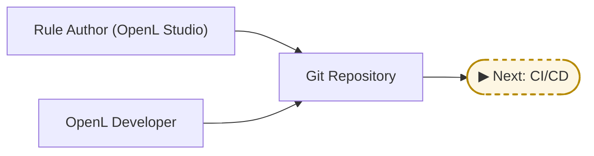
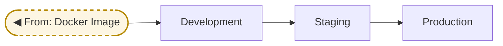
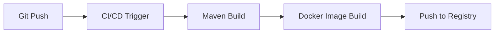
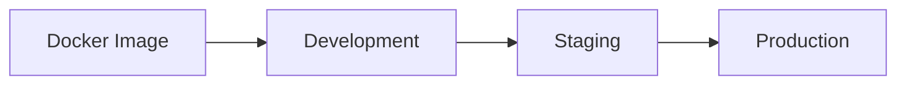

# OpenL Tablets: Production Deployment Guide

## Overview

This document describes a structured approach for deploying OpenL Tablets rule services in production environments. It provides a recommended setup based on modern software development practices such as Git-based version control, Maven builds, containerization, and CI/CD pipelines.

This setup is applicable for production usage and can serve as a base for operational rule platforms within organizations. It separates rule authoring, development, deployment, and runtime responsibilities to ensure quality, traceability, and automation.

---

## System Architecture

The system is built around five roles and four workflow stages:

### Key Roles

- **Rule Author** – edits business rules using OpenL Studio
- **OpenL Developer** – extends, configures, or customizes the platform (e.g., Java, Groovy, extensions)
- **DevOps Engineer** – manages build pipelines and environment deployments
- **CI/CD System** – builds artifacts and creates container images
- **Environments** – multiple isolated targets: tooling, dev, staging, production

### Workflow Stages

This setup divides the delivery pipeline into four distinct stages. Each is illustrated below with a focused diagram and logical handoff to the next stage.

1. **Authoring** – Rule authors modify rules through OpenL Studio.
2. **Development** – OpenL developers customize project structure or logic.
3. **Build & Package** – CI/CD builds artifacts and Docker images from Git.
4. **Deploy & Promote** – Images are promoted from development to production environments.

---

#### Authoring and Development

---

#### Build and Package

---

#### Deploy and Promote

---

## Rationale

- OpenL Studio is used for editing, not execution
- Git serves as the single source of truth for rules and custom code
- OpenL Developers manage reusable logic and structure
- CI/CD provides traceability, automation, and artifact reproducibility
- Deployment is gated and environment-specific

---

## Role Responsibilities

### Rule Author

- Uses OpenL Studio to edit and test rules
- Commits changes to the Git repository

### OpenL Developer

- Designs module structure, datatypes, interfaces
- Implements or maintains Java/Groovy extensions
- Configures the Maven project and dependencies

### DevOps Engineer

- Maintains CI/CD tools (e.g., Jenkins, GitHub Actions)
- Configures pipeline triggers and promotion logic
- Ensures environment parity and automation

---

## CI/CD Pipeline

CI/CD may be triggered on every commit, periodically (e.g., nightly), or manually.

---

## Deployment and Promotion

Artifacts are deployed progressively across isolated environments.

| Environment     | Purpose                   | Editable | Deployment Method     |
|-----------------|---------------------------|----------|------------------------|
| Tooling         | Rule editing and testing  | Rules only (via OpenL Studio) | CI-triggered            |
| Development     | Integration testing       | No       | CI/CD automatic        |
| Staging         | Pre-production validation | No       | Manual or gated promo  |
| Production      | Live execution            | No       | Manual approval        |

---

## Configuration Examples

- [OpenL Studio Docker Compose Setup](production-deployment/studio-config/)
- [Minimal Rule Project with Maven and Docker](production-deployment/example/)

---

## Summary of Benefits

- Separation of responsibilities: rule authors, platform developers, and infrastructure engineers
- Centralized version control for all rule logic and customizations
- Automated builds and repeatable deployment processes
- Custom extension support via Java and Groovy
- Clean promotion pipeline with environment isolation
