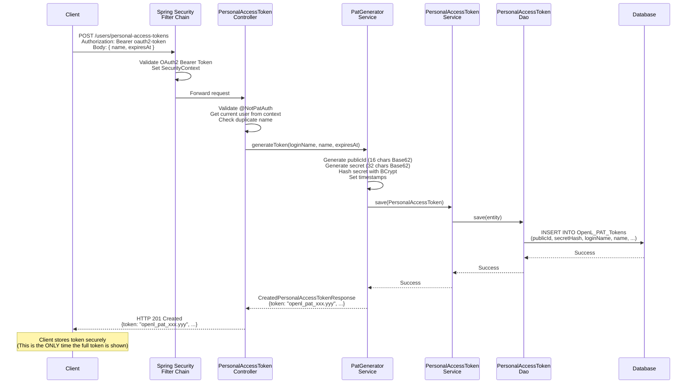
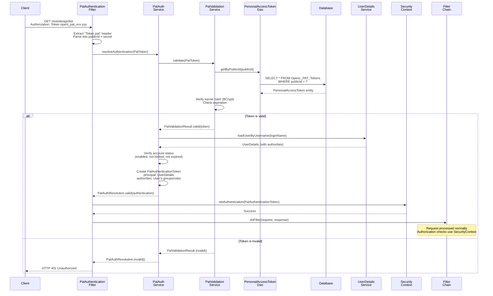

# Personal Access Token (PAT) Architecture

**Version**: 6.0.0-SNAPSHOT
**Module**: STUDIO
**Feature**: EPBDS-15458
**Last Updated**: 2025-12-23

---

## Table of Contents

- [Overview](#overview)
- [Architecture Design](#architecture-design)
- [Component Details](#component-details)
- [Security Architecture](#security-architecture)
- [Data Flow](#data-flow)
- [Database Design](#database-design)
- [Integration Points](#integration-points)
- [Design Decisions](#design-decisions)
- [Implementation Guidelines](#implementation-guidelines)
- [Testing Strategy](#testing-strategy)

---

## Overview

### Purpose

The Personal Access Token (PAT) feature provides a secure, token-based authentication mechanism for programmatic access to OpenL Tablets Studio. It enables service-to-service communication and API integrations without requiring interactive OAuth2/SAML authentication.

### Design Goals

1. **Security**: Cryptographically secure token generation and validation
2. **Performance**: Efficient token validation with minimal database overhead
3. **Usability**: Simple token management through REST API
4. **Integration**: Seamless integration with existing Spring Security infrastructure
5. **Compliance**: Protection against timing attacks, injection attacks, and information disclosure

### Key Features

- **Token Lifecycle Management**: Create, list, retrieve, and delete tokens
- **Expiration Support**: Optional token expiration for time-limited access
- **User Isolation**: Users manage only their own tokens
- **Audit Trail**: Creation and expiration timestamps for all tokens
- **Security Hardening**: Multiple layers of protection against common attacks

---

## Architecture Design

### High-Level Architecture

```mermaid
flowchart TB
    Client[Client Layer<br/>OAuth2/SAML or PAT Authentication]

    subgraph SecurityFilter[Security Filter Chain]
        PatFilter[PatAuthenticationFilter<br/>Before OAuth2 Filter<br/>- Checks Authorization: Token header<br/>- Validates using PatAuthService<br/>- Sets SecurityContext if valid]
        OAuth2Filter[OAuth2/SAML Filter<br/>Standard Spring Security]
    end

    subgraph Controller[REST Controller Layer]
        PatController[PersonalAccessTokenController<br/>@NotPatAuth - Prevents PAT from managing PATs<br/>POST /users/personal-access-tokens Create<br/>GET /users/personal-access-tokens List<br/>GET /users/personal-access-tokens/:id Get<br/>DELETE /users/personal-access-tokens/:id Delete]
    end

    subgraph Service[Service Layer]
        PatGenerator[PatGeneratorService<br/>generateToken]
        PatAuth[PatAuthService<br/>resolveAuth]
        PatValidation[PatValidationService<br/>validate]
        PatCRUD[PersonalAccessTokenService<br/>CRUD operations]
    end

    subgraph DAO[DAO Layer]
        PatDAO[PersonalAccessTokenDao<br/>Hibernate Implementation<br/>getByPublicId<br/>getByLoginName<br/>save, delete, etc.]
    end

    subgraph Database[Database Layer]
        PatTable[(OpenL_PAT_Tokens Table<br/>publicId PK<br/>secretHash<br/>loginName FK<br/>name, createdAt, expiresAt)]
    end

    Client --> SecurityFilter
    SecurityFilter --> Controller
    Controller --> Service
    Service --> DAO
    DAO --> Database
```

### Layer Responsibilities

| Layer | Responsibilities | Key Components |
|-------|------------------|----------------|
| **Security Filter** | Token extraction, validation, SecurityContext setup | `PatAuthenticationFilter` |
| **Controller** | Request handling, validation, authorization | `PersonalAccessTokenController` |
| **Service** | Business logic, token generation, validation | `PatGeneratorService`, `PatAuthService`, `PatValidationService` |
| **DAO** | Database operations | `PersonalAccessTokenDao` |
| **Persistence** | Entity mapping | `PersonalAccessToken` entity |

---

## Component Details

### 1. Security Layer

#### PatAuthenticationFilter

**Location**: `org.openl.studio.security.pat.filter.PatAuthenticationFilter`

**Purpose**: Intercepts HTTP requests and authenticates users via Personal Access Tokens.

**Key Responsibilities**:
- Extract PAT from `Authorization: Token <pat>` header
- Parse and validate token format
- Delegate validation to `PatAuthService`
- Set `SecurityContext` with `PatAuthenticationToken` on success
- Return 401 on authentication failure

**Implementation Details**:

```java
public class PatAuthenticationFilter extends OncePerRequestFilter {

    @Override
    protected void doFilterInternal(HttpServletRequest request,
                                    HttpServletResponse response,
                                    FilterChain filterChain) {
        // 1. Extract "Authorization: Token <pat>" header
        String header = request.getHeader(HttpHeaders.AUTHORIZATION);
        if (header == null || !header.startsWith("Token ")) {
            filterChain.doFilter(request, response);
            return;
        }

        // 2. Parse token
        PatToken patToken = PatToken.parse(tokenValue);

        // 3. Validate and resolve authentication
        PatAuthResolution resolution = patAuthService.resolveAuthentication(patToken);

        // 4. Set SecurityContext if valid
        if (resolution.valid()) {
            SecurityContext context = securityContextHolderStrategy.createEmptyContext();
            context.setAuthentication(resolution.authentication());
            securityContextHolderStrategy.setContext(context);
        }

        filterChain.doFilter(request, response);
    }
}
```

**Security Features**:
- Runs **once per request** (prevents double execution)
- Returns generic 401 without revealing failure reasons
- Integrates with Spring Security's `SecurityContextHolderStrategy`

**Filter Chain Position**:
```java
http.addFilterBefore(patAuthenticationFilter,
                     BearerTokenAuthenticationFilter.class)
```

Placed **before** OAuth2 bearer token filter to prioritize PAT authentication.

---

#### PatAuthenticationToken

**Location**: `org.openl.studio.security.pat.model.PatAuthenticationToken`

**Purpose**: Custom Spring Security authentication token for PAT-authenticated users.

**Design**:
```java
public class PatAuthenticationToken extends UsernamePasswordAuthenticationToken {

    public PatAuthenticationToken(Object principal,
                                  Object credentials,
                                  Collection<? extends GrantedAuthority> authorities) {
        super(principal, credentials, authorities);
    }
}
```

**Why a Custom Token?**
- Distinguishes PAT authentication from OAuth2/password authentication
- Enables security rules like `@NotPatAuth` to detect PAT-based access
- Maintains compatibility with Spring Security's `Authentication` interface

---

#### @NotPatAuth Annotation

**Location**: `org.openl.studio.security.NotPatAuth`

**Purpose**: Prevents PAT-authenticated users from accessing certain endpoints.

**Implementation**:
```java
@Target({ElementType.METHOD, ElementType.TYPE})
@Retention(RetentionPolicy.RUNTIME)
@PreAuthorize("@authz.isNotPat(authentication)")
public @interface NotPatAuth {
}
```

**Usage**:
```java
@RestController
@NotPatAuth  // Applied to entire controller
public class PersonalAccessTokenController {
    // All methods require non-PAT authentication
}
```

**Authorization Logic**:
```java
@Component("authz")
public class AuthorizationExpressions {

    public boolean isNotPat(Authentication authentication) {
        return !(authentication instanceof PatAuthenticationToken);
    }
}
```

**Rationale**: PATs should not be used to manage PATs (prevents token proliferation attacks).

---

### 2. REST Controller Layer

#### PersonalAccessTokenController

**Location**: `org.openl.studio.users.rest.controller.PersonalAccessTokenController`

**Conditional Activation**:
```java
@ConditionalOnExpression("'${user.mode}' == 'oauth2' || '${user.mode}' == 'saml'")
```

Only active when `user.mode` is `oauth2` or `saml`.

**Endpoint Summary**:

| Endpoint | Method | Purpose | Security |
|----------|--------|---------|----------|
| `/users/personal-access-tokens` | POST | Create token | `@NotPatAuth` |
| `/users/personal-access-tokens` | GET | List user's tokens | `@NotPatAuth` |
| `/users/personal-access-tokens/{id}` | GET | Get token details | `@NotPatAuth` |
| `/users/personal-access-tokens/{id}` | DELETE | Delete token | `@NotPatAuth` |

**Key Features**:
- Uses `CurrentUserInfo` to get authenticated user
- Validates requests with Jakarta Validation (`@Valid`)
- Returns appropriate HTTP status codes (201, 200, 204, 404, 400)
- Delegates business logic to service layer

**Example Implementation**:

```java
@PostMapping
@ResponseStatus(HttpStatus.CREATED)
public CreatedPersonalAccessTokenResponse createToken(
        @Valid @RequestBody CreatePersonalAccessTokenRequest request) {

    String loginName = currentUserInfo.getUserName();

    // Check for duplicate name
    if (crudService.existsByLoginNameAndName(loginName, request.name())) {
        throw new BadRequestException("pat.duplicate.name.message");
    }

    // Generate token
    return generatorService.generateToken(loginName,
                                         request.name(),
                                         request.expiresAt());
}
```

---

### 3. Service Layer

#### PatGeneratorService

**Location**: `org.openl.studio.security.pat.service.PatGeneratorServiceImpl`

**Purpose**: Generates cryptographically secure Personal Access Tokens.

**Token Structure**:
```
openl_pat_<publicId>.<secret>
           ^^^^^^^^   ^^^^^^
           16 chars   32 chars
           Base62     Base62
```

**Generation Process**:

1. **Validate Expiration**:
   ```java
   if (expiresAt != null && expiresAt.isBefore(Instant.now(clock))) {
       throw new IllegalArgumentException("expiresAt must be in the future");
   }
   ```

2. **Generate Unique Public ID**:
   ```java
   String publicId;
   do {
       publicId = Base62Generator.generate(16);
   } while (crudService.existsByPublicId(publicId));
   ```
   - Uses `SecureRandom` for cryptographic strength
   - Handles collisions (extremely rare with 95 bits of entropy)

3. **Generate Secret**:
   ```java
   String secret = Base62Generator.generate(32);  // 190 bits of entropy
   String secretHash = passwordEncoder.encode(secret);
   ```
   - Uses BCrypt (default) or configured `PasswordEncoder`

4. **Persist Token**:
   ```java
   PersonalAccessToken token = new PersonalAccessToken();
   token.setPublicId(publicId);
   token.setSecretHash(secretHash);  // Only hash is stored
   token.setLoginName(loginName);
   token.setName(name);
   token.setCreatedAt(Instant.now(clock));
   token.setExpiresAt(expiresAt);

   crudService.save(token);
   ```

5. **Return Token** (only time full token is available):
   ```java
   PatToken pat = new PatToken(publicId, secret);
   return CreatedPersonalAccessTokenResponse.builder()
           .publicId(publicId)
           .token(pat.asTokenValue())  // openl_pat_xxx.yyy
           .build();
   ```

**Security Considerations**:
- **Entropy**: Public ID (95 bits) + Secret (190 bits) = 285 bits total
- **Storage**: Only hash stored, never plaintext secret
- **Uniqueness**: Collision detection for public IDs
- **Timing**: Uses injectable `Clock` for testability and consistency

---

#### PatValidationService

**Location**: `org.openl.studio.security.pat.service.PatValidationServiceImpl`

**Purpose**: Validates Personal Access Tokens against stored hashes.

**Validation Process**:

```java
public PatValidationResult validate(PatToken pat) {
    try {
        // 1. Retrieve stored token
        PersonalAccessToken stored = tokenDao.getByPublicId(pat.publicId());

        // 2. Verify secret (ALWAYS check to prevent timing attacks)
        String hashToCheck = stored != null ? stored.getSecretHash() : dummyHash;
        boolean secretMatches = passwordEncoder.matches(pat.secret(), hashToCheck);

        if (!secretMatches) {
            return PatValidationResult.invalid();
        }

        // 3. Verify token exists (matching dummy hash is virtually impossible)
        if (stored == null) {
            return PatValidationResult.invalid();
        }

        // 4. Check expiration
        if (isExpired(stored)) {
            return PatValidationResult.invalid();
        }

        return PatValidationResult.valid(stored);

    } catch (Exception ignored) {
        // Prevent information disclosure through exceptions
        return PatValidationResult.invalid();
    }
}
```

**Security Features**:

1. **Timing Attack Prevention**:
   - Always performs password check, even for non-existent tokens
   - Uses pre-generated `dummyHash` for consistent timing
   - No branching based on token existence before hash check

2. **Information Disclosure Prevention**:
   - Returns only `VALID` or `INVALID` (never specific failure reason)
   - Catches all exceptions and returns `INVALID`
   - No logging of sensitive data

3. **Constant-Time Comparison**:
   ```java
   boolean secretMatches = passwordEncoder.matches(pat.secret(), hashToCheck);
   ```
   BCrypt's `matches()` uses constant-time comparison internally.

4. **Dummy Hash Generation**:
   ```java
   // Constructor
   this.dummyHash = passwordEncoder.encode(
       "$2a$10$dummyHashToPreventTimingAttack1234567890123456789012");
   ```
   Ensures dummy hash has valid BCrypt format for consistent timing.

---

#### PatAuthService

**Location**: `org.openl.studio.security.pat.service.PatAuthServiceImpl`

**Purpose**: Converts validated PATs into Spring Security authentication objects.

**Authentication Resolution**:

```java
public PatAuthResolution resolveAuthentication(PatToken pat) {
    // 1. Validate token
    PatValidationResult result = validator.validate(pat);
    if (!result.valid()) {
        return PatAuthResolution.invalid();
    }

    // 2. Load user details
    PersonalAccessToken token = result.token();
    UserDetails user = userDetailsService.loadUserByUsername(token.getLoginName());

    // 3. Verify account status
    if (!user.isEnabled() || !user.isAccountNonLocked()
            || !user.isAccountNonExpired() || !user.isCredentialsNonExpired()) {
        return PatAuthResolution.invalid();
    }

    // 4. Create authentication token
    PatAuthenticationToken auth = new PatAuthenticationToken(
        user, null, user.getAuthorities()
    );

    return PatAuthResolution.valid(auth);
}
```

**Integration with User Management**:
- Uses existing `UserDetailsService` (OAuth2-aware implementation)
- Loads user authorities (groups, roles) from identity provider
- Respects account status flags (enabled, locked, expired)

---

#### PersonalAccessTokenService

**Location**: `org.openl.studio.users.service.pat.PersonalAccessTokenServiceImpl`

**Purpose**: CRUD operations for Personal Access Tokens.

**Key Methods**:

| Method | Purpose | Transaction |
|--------|---------|-------------|
| `getTokensByUser(loginName)` | List all tokens for user | Read-only |
| `getTokenForUser(publicId, loginName)` | Get specific token (with ownership check) | Read-only |
| `existsByLoginNameAndName(loginName, name)` | Check name uniqueness | Read-only |
| `save(token)` | Persist new token | Read-write |
| `deleteByPublicId(publicId)` | Delete token | Read-write |
| `deleteAllByUser(loginName)` | Delete all user tokens | Read-write |
| `existsByPublicId(publicId)` | Check token existence | Read-only |

**Security Features**:
- **Ownership Verification**: `getTokenForUser()` checks `loginName` matches
- **Public ID Validation**: Uses `PatToken.isValidPublicId()` to prevent injection
- **No Secret Exposure**: Converts entities to DTOs without `secretHash`

**Example - Ownership Check**:
```java
public PersonalAccessTokenResponse getTokenForUser(String publicId, String loginName) {
    if (!PatToken.isValidPublicId(publicId)) {
        return null;  // Invalid format
    }

    PersonalAccessToken token = tokenDao.getByPublicId(publicId);

    // Verify ownership
    if (token == null || !loginName.equals(token.getLoginName())) {
        return null;  // Not found or not owned by user
    }

    return toTokenResponse(token);
}
```

---

### 4. DAO Layer

#### PersonalAccessTokenDao

**Location**: `org.openl.rules.security.standalone.dao.PersonalAccessTokenDaoImpl`

**Purpose**: Database access for Personal Access Token entities.

**Key Operations**:

```java
public interface PersonalAccessTokenDao {
    PersonalAccessToken getByPublicId(String publicId);
    List<PersonalAccessToken> getByLoginName(String loginName);
    PersonalAccessToken getByLoginNameAndName(String loginName, String name);
    void save(PersonalAccessToken token);
    void deleteByPublicId(String publicId);
    void deleteAllByLoginName(String loginName);
    boolean existsByPublicId(String publicId);
}
```

**Implementation** (Hibernate-based):
- Uses JPA `EntityManager` for database operations
- Supports all major databases (PostgreSQL, MySQL, Oracle, SQL Server, H2)
- Leverages database indexes for performance

---

### 5. Model Layer

#### PatToken (Value Object)

**Location**: `org.openl.studio.security.pat.model.PatToken`

**Purpose**: Structured representation of a PAT value.

**Design**:
```java
public record PatToken(
    @NotBlank String publicId,
    @NotBlank String secret
) {
    public static final String PREFIX = "openl_pat_";
    private static final int PUBLIC_ID_LENGTH = 16;
    private static final int SECRET_LENGTH = 32;

    public static PatToken parse(String token) {
        // Format validation
        // Component extraction
        // Security checks
    }

    public String asTokenValue() {
        return PREFIX + publicId + '.' + secret;
    }
}
```

**Security Features**:
1. **Format Validation**:
   ```java
   if (token.length() > MAX_TOKEN_LENGTH || !token.startsWith(PREFIX)) {
       throw new IllegalArgumentException("Invalid PAT token format");
   }
   ```
   Prevents DoS with excessively long tokens (max 256 chars).

2. **Component Validation**:
   ```java
   if (!isValidPublicId(publicId)) {
       throw new IllegalArgumentException("Invalid PAT token format");
   }
   ```
   Ensures Base62 character set and exact length.

3. **Injection Prevention**:
   ```java
   return publicId.matches("^[0-9a-zA-Z]+$");  // Base62 only
   ```

---

#### PersonalAccessToken (Entity)

**Location**: `org.openl.rules.security.standalone.persistence.PersonalAccessToken`

**Mapping**:
```java
@Entity
@Table(name = "OpenL_PAT_Tokens")
public class PersonalAccessToken implements Serializable {

    @Id
    @Column(name = "publicId", length = 16, nullable = false, unique = true)
    private String publicId;

    @Column(name = "secretHash", nullable = false)
    private String secretHash;

    @Column(name = "createdAt", nullable = false)
    private Instant createdAt;

    @Column(name = "expiresAt")
    private Instant expiresAt;

    @Column(name = "loginName", length = 50, nullable = false)
    private String loginName;

    @Column(name = "name", length = 100, nullable = false)
    private String name;
}
```

**Entity Relationships**:
- **Foreign Key**: `loginName` references `OpenL_Users(loginName)`
- **Cascade**: `ON DELETE CASCADE` - deleting user deletes all tokens
- **Unique Constraint**: `(loginName, name)` - token names unique per user

---

### 6. Utility Layer

#### Base62Generator

**Location**: `org.openl.studio.security.pat.Base62Generator`

**Purpose**: Generate cryptographically secure Base62-encoded random strings.

**Implementation**:
```java
public final class Base62Generator {

    private static final char[] ALPHABET =
        "0123456789abcdefghijklmnopqrstuvwxyzABCDEFGHIJKLMNOPQRSTUVWXYZ".toCharArray();

    private static final SecureRandom SECURE_RANDOM = new SecureRandom();

    public static String generate(int length) {
        char[] out = new char[length];
        for (int i = 0; i < length; i++) {
            out[i] = ALPHABET[SECURE_RANDOM.nextInt(ALPHABET.length)];
        }
        return new String(out);
    }
}
```

**Entropy Analysis**:
- Base62: 62 possible characters per position
- 16-character public ID: 62^16 ≈ 2^95 combinations (~95 bits of entropy)
- 32-character secret: 62^32 ≈ 2^190 combinations (~190 bits of entropy)

**Why Base62?**
- URL-safe (no special characters)
- Human-readable (unlike Base64 with +, /, =)
- Efficient storage (better than hex)
- Standard character set (0-9, a-z, A-Z)

---

## Security Architecture

### Threat Model

#### Threats Addressed

| Threat | Mitigation | Implementation |
|--------|------------|----------------|
| **Timing Attacks** | Constant-time validation | Dummy hash, always verify |
| **Token Guessing** | High entropy generation | 190 bits for secret |
| **SQL Injection** | Parameterized queries | JPA/Hibernate |
| **DoS via Long Tokens** | Length validation | Max 256 chars |
| **Information Disclosure** | Generic error messages | Return only VALID/INVALID |
| **Replay Attacks** | Optional expiration | `expiresAt` field |
| **Token Proliferation** | `@NotPatAuth` | PATs can't create PATs |
| **Credential Stuffing** | Secure hash storage | BCrypt with salt |

#### Attack Scenarios & Defenses

**Scenario 1: Attacker Tries to Guess Token**
- **Attack**: Brute-force token generation
- **Defense**:
  - 285 bits total entropy (public ID + secret)
  - Rate limiting (application-level, not in PAT code)

**Scenario 2: Timing Attack to Determine Valid Public IDs**
- **Attack**: Measure validation time to infer if public ID exists
- **Defense**:
  ```java
  // ALWAYS perform password check, even if token doesn't exist
  String hashToCheck = stored != null ? stored.getSecretHash() : dummyHash;
  boolean secretMatches = passwordEncoder.matches(pat.secret(), hashToCheck);
  ```
  - Constant-time password comparison
  - Dummy hash ensures consistent BCrypt execution time

**Scenario 3: SQL Injection via Public ID**
- **Attack**: Inject SQL through public ID parameter
- **Defense**:
  - Parameterized JPA queries
  - Public ID validation (Base62, fixed length)
  ```java
  if (!PatToken.isValidPublicId(publicId)) {
      return null;  // Reject invalid format
  }
  ```

**Scenario 4: Token Stolen from Logs**
- **Attack**: Extract tokens from application logs
- **Defense**:
  - Never log token values
  - Log only public IDs (non-sensitive)
  - Secure log storage and access controls

**Scenario 5: Compromised Database**
- **Attack**: Access database to extract secrets
- **Defense**:
  - Secrets stored as BCrypt hashes (irreversible)
  - Salted hashing (unique salt per token)
  - No plaintext secrets in database

---

### Security Best Practices

#### For Implementers

1. **Never Log Secrets**:
   ```java
   // GOOD
   log.info("Created PAT with publicId={}", publicId);

   // BAD - NEVER DO THIS
   log.info("Created PAT: {}", token.asTokenValue());
   ```

2. **Use Constant-Time Comparisons**:
   ```java
   // GOOD (BCrypt does this internally)
   boolean matches = passwordEncoder.matches(secret, hash);

   // BAD (vulnerable to timing attacks)
   boolean matches = hash.equals(secret);
   ```

3. **Validate Input Format**:
   ```java
   // GOOD
   if (!PatToken.isValidPublicId(publicId)) {
       throw new IllegalArgumentException("Invalid public ID");
   }

   // BAD (allows injection)
   String query = "SELECT * FROM tokens WHERE publicId = '" + publicId + "'";
   ```

4. **Handle Exceptions Securely**:
   ```java
   // GOOD
   try {
       // validation logic
   } catch (Exception ignored) {
       return PatValidationResult.invalid();
   }

   // BAD (information disclosure)
   catch (ExpiredTokenException e) {
       throw new BadRequestException("Token expired");
   }
   ```

#### For Users

1. **Store Tokens Securely**:
   - Use environment variables or secret managers
   - Never commit to version control
   - Rotate tokens periodically

2. **Use Token Expiration**:
   - Set reasonable expiration dates
   - Delete tokens when no longer needed
   - Use separate tokens per integration

3. **Monitor Token Usage**:
   - Review active tokens regularly
   - Delete unused tokens immediately
   - Investigate unexpected token usage

---

## Data Flow

### Token Creation Flow



---

### Token Authentication Flow



---

## Database Design

### Schema

```sql
CREATE TABLE OpenL_PAT_Tokens (
    publicId   VARCHAR(16) NOT NULL PRIMARY KEY,
    secretHash VARCHAR(255) NOT NULL,
    createdAt  TIMESTAMP NOT NULL,
    expiresAt  TIMESTAMP,
    loginName  VARCHAR(50) NOT NULL,
    name       VARCHAR(100) NOT NULL,

    CONSTRAINT fk_OpenL_PAT_Tokens_user
        FOREIGN KEY (loginName)
        REFERENCES OpenL_Users(loginName)
        ON DELETE CASCADE,

    CONSTRAINT uq_OpenL_PAT_Tokens_user_name
        UNIQUE (loginName, name),

    CONSTRAINT ck_OpenL_PAT_Tokens_expires
        CHECK (expiresAt IS NULL OR expiresAt > createdAt)
);

CREATE INDEX ix_OpenL_PAT_Tokens_loginName
    ON OpenL_PAT_Tokens (loginName);
```

### Design Rationale

| Feature | Rationale |
|---------|-----------|
| **publicId as PK** | Natural primary key, globally unique, fixed length |
| **secretHash VARCHAR(255)** | BCrypt hashes are ~60 chars, allows for future hash algorithms |
| **Foreign Key with CASCADE** | Deleting user automatically revokes all tokens |
| **Unique (loginName, name)** | Prevents duplicate token names per user |
| **Check expiresAt > createdAt** | Ensures valid expiration dates |
| **Index on loginName** | Optimizes `getByLoginName()` queries |

### Migration Strategy

**Flyway Migration**: `V15__Create_PAT_Tokens.sql`

**Backward Compatibility**:
- New table, no schema changes to existing tables
- Uses database-agnostic syntax with placeholders: `${varchar}`, `${timestamp}`
- Supports all databases: PostgreSQL, MySQL, Oracle, SQL Server, H2

**Rollback Considerations**:
```sql
-- If needed for rollback
DROP INDEX ix_OpenL_PAT_Tokens_loginName;
DROP TABLE OpenL_PAT_Tokens;
```

---

## Integration Points

### Spring Security Integration

#### Security Configuration

```java
@Configuration
public class PatSecurityConfiguration {

    @Bean
    @ConditionalOnExpression("'${user.mode}' == 'oauth2' || '${user.mode}' == 'saml'")
    public PatAuthenticationFilter patAuthenticationFilter(PatAuthService patAuthService) {
        return new PatAuthenticationFilter(patAuthService);
    }
}
```

#### Filter Chain Integration

```java
@Bean
public SecurityFilterChain filterChain(HttpSecurity http,
                                       PatAuthenticationFilter patAuthFilter) {
    http
        // ... other config ...
        .addFilterBefore(patAuthFilter, BearerTokenAuthenticationFilter.class)
        // ... more config ...

    return http.build();
}
```

**Execution Order**:
1. `PatAuthenticationFilter` (checks "Token" header)
2. `BearerTokenAuthenticationFilter` (checks "Bearer" header)
3. Other filters...

---

### User Management Integration

**UserDetailsService Integration**:
```java
PatAuthenticationToken auth = new PatAuthenticationToken(
    user,           // UserDetails from OAuth2/SAML provider
    null,           // No credentials
    user.getAuthorities()  // Mapped from external groups
);
```

**User Deletion Cascade**:
- When user is deleted from `OpenL_Users`, all PATs are automatically deleted
- Foreign key constraint: `ON DELETE CASCADE`

---

### OAuth2/SAML Integration

**Requirement**: PAT management endpoints **require** OAuth2/SAML authentication.

**Why?**
- PATs are an alternative to OAuth2/SAML for API access
- Management operations require interactive authentication
- Prevents token proliferation (PATs can't create PATs)

**Configuration Check**:
```java
@ConditionalOnExpression("'${user.mode}' == 'oauth2' || '${user.mode}' == 'saml'")
```

Controller and services only active in OAuth2/SAML modes.

---

## Design Decisions

### 1. Token Format: `openl_pat_<publicId>.<secret>`

**Decision**: Use structured token with prefix, public ID, and secret separated by dot.

**Rationale**:
- **Prefix (`openl_pat_`)**:
  - Identifies token type
  - Prevents accidental use in wrong context
  - Follows industry standards (e.g., GitHub's `ghp_`, GitLab's `glpat-`)

- **Public ID (16 chars)**:
  - Serves as primary key (no autoincrement needed)
  - 95 bits of entropy (sufficient for global uniqueness)
  - Enables fast lookups without exposing secret

- **Secret (32 chars)**:
  - 190 bits of entropy (cryptographically secure)
  - Stored as hash only
  - Verified using password encoder

- **Separator (`.`)**:
  - Clear component separation
  - URL-safe character
  - Easy to parse

**Alternatives Considered**:
- **Opaque UUID**: Less transparent, no structure
- **JWT**: Requires signature validation, larger size, stateless (harder to revoke)
- **Longer single string**: No public/secret separation, harder to manage

---

### 2. Base62 Encoding

**Decision**: Use Base62 (0-9, a-z, A-Z) for token components.

**Rationale**:
- **URL-safe**: No special characters requiring encoding
- **Human-friendly**: No ambiguous characters (unlike Base64's +, /, =)
- **Efficient**: Better than hex (Base16), almost as good as Base64
- **Standard**: Widely used for token generation

**Comparison**:

| Encoding | Chars/Bit | URL-Safe | Human-Friendly | Example |
|----------|-----------|----------|----------------|---------|
| Hex (Base16) | 4.00 | Yes | Yes | `a1b2c3d4` |
| Base62 | 5.95 | Yes | Yes | `aB1cD2eF3` |
| Base64 | 6.00 | No | No | `aB1+cD2/eF3=` |
| Base64URL | 6.00 | Yes | No | `aB1-cD2_eF3` |

---

### 3. BCrypt for Secret Hashing

**Decision**: Use `PasswordEncoder` (default BCrypt) for hashing secrets.

**Rationale**:
- **Adaptive**: Configurable work factor (default 10 rounds)
- **Salted**: Unique salt per hash (prevents rainbow tables)
- **Constant-time**: `matches()` method resists timing attacks
- **Industry-standard**: Widely used and vetted
- **Future-proof**: Can upgrade to Argon2 by changing `PasswordEncoder` bean

**Alternative Considered**:
- **SHA-256 with salt**: Faster but vulnerable to GPU attacks
- **Argon2**: Better resistance to GPU attacks, but higher complexity

---

### 4. Separate Public ID and Secret

**Decision**: Store public ID separately from secret hash.

**Rationale**:
- **Performance**: Fast lookups using public ID without revealing secret
- **Security**: Public ID can be logged, used in URLs (non-sensitive)
- **Management**: Delete/list tokens using public ID
- **Collision Detection**: Check public ID uniqueness before generation

**Data Flow**:
```
Client Request → publicId → Database Lookup → Retrieve Hash → Verify Secret
```

Without separation:
```
Client Request → Full Token → Hash Full Token → Database Lookup
```
(Slower, no public identifier for management operations)

---

### 5. Optional Expiration

**Decision**: Allow tokens without expiration (`expiresAt = null`).

**Rationale**:
- **Flexibility**: Different use cases have different lifespans
  - CI/CD pipelines: Long-lived tokens
  - Temporary integrations: Short-lived tokens

- **User Choice**: Let users decide based on security/convenience trade-off

- **Database Design**: Nullable column with CHECK constraint
  ```sql
  CHECK (expiresAt IS NULL OR expiresAt > createdAt)
  ```

**Security Note**: Recommend expiration for production environments, but don't enforce.

---

### 6. @NotPatAuth Restriction

**Decision**: Prevent PAT-authenticated users from managing PATs.

**Rationale**:
- **Security**: Prevents token proliferation attacks
  - Attacker compromises one PAT
  - Creates more PATs to maintain access
  - Harder to revoke all access

- **Auditability**: Management operations require interactive authentication
  - OAuth2/SAML provides user identity
  - Audit logs show who created/deleted tokens

- **Usability**: Users manage tokens through web UI (requires OAuth2/SAML)

**Implementation**:
```java
@NotPatAuth  // Annotation on controller
public class PersonalAccessTokenController {
    // All methods require non-PAT authentication
}
```

---

### 7. Timing Attack Mitigation with Dummy Hash

**Decision**: Always perform password hash verification, even for non-existent tokens.

**Rationale**:
- **Constant-Time Execution**:
  - Attacker can't measure response time to infer token existence
  - Both cases (token exists / doesn't exist) take similar time

- **Implementation**:
  ```java
  String hashToCheck = stored != null ? stored.getSecretHash() : dummyHash;
  boolean secretMatches = passwordEncoder.matches(pat.secret(), hashToCheck);
  ```

- **Dummy Hash Generation**:
  - Pre-generated in constructor
  - Valid BCrypt format ensures consistent execution path
  - Secret matching dummy hash is virtually impossible

**Why This Works**:
- BCrypt comparison takes ~100ms regardless of hash content
- Attacker can't distinguish "token not found" from "secret mismatch"

---

### 8. Single Response Type: VALID or INVALID

**Decision**: Validation returns only `VALID` or `INVALID`, never specific failure reason.

**Rationale**:
- **Information Disclosure Prevention**:
  - Don't reveal if public ID exists
  - Don't reveal if token is expired vs wrong secret
  - Don't reveal user account status

- **Security Through Obscurity**:
  - Attacker gains no information from failed attempts
  - Harder to enumerate valid public IDs
  - Harder to identify expired tokens

**Example - What We DON'T Do**:
```java
// BAD - Information disclosure
if (stored == null) {
    throw new NotFoundException("Token not found");
}
if (isExpired(stored)) {
    throw new ExpiredException("Token expired");
}
if (!secretMatches) {
    throw new UnauthorizedException("Invalid secret");
}
```

**What We DO**:
```java
// GOOD - Generic failure
if (!secretMatches || stored == null || isExpired(stored)) {
    return PatValidationResult.invalid();
}
```

---

## Implementation Guidelines

### Adding New Features

#### Example: Add Token Usage Tracking

1. **Database Schema**:
   ```sql
   ALTER TABLE OpenL_PAT_Tokens ADD COLUMN lastUsedAt TIMESTAMP;
   ```

2. **Entity Update**:
   ```java
   @Column(name = "lastUsedAt")
   private Instant lastUsedAt;
   ```

3. **Service Update**:
   ```java
   @Transactional
   public PatAuthResolution resolveAuthentication(PatToken pat) {
       // ... existing validation ...

       // Update last used timestamp
       token.setLastUsedAt(Instant.now(clock));
       tokenDao.save(token);

       // ... return authentication ...
   }
   ```

4. **Response Update**:
   ```java
   public record PersonalAccessTokenResponse(
       // ... existing fields ...
       Instant lastUsedAt
   ) {}
   ```

---

#### Example: Add Token Scopes/Permissions

1. **Database Schema**:
   ```sql
   ALTER TABLE OpenL_PAT_Tokens ADD COLUMN scopes VARCHAR(500);
   ```

2. **Entity Update**:
   ```java
   @Column(name = "scopes", length = 500)
   private String scopes;  // JSON or comma-separated
   ```

3. **Request Update**:
   ```java
   public record CreatePersonalAccessTokenRequest(
       String name,
       Instant expiresAt,
       List<String> scopes  // e.g., ["read:projects", "write:tables"]
   ) {}
   ```

4. **Authorization Logic**:
   ```java
   @PreAuthorize("@authz.hasTokenScope('write:projects')")
   public void createProject() {
       // ...
   }
   ```

---

### Configuration Properties

**Relevant Properties**:

| Property | Values | Default | Description |
|----------|--------|---------|-------------|
| `user.mode` | `oauth2`, `saml`, `standalone` | `standalone` | Authentication mode |
| `security.password.encoder.strength` | `4-31` | `10` | BCrypt work factor |

**Example Configuration**:
```properties
# application.properties
user.mode=oauth2
security.password.encoder.strength=12
```

---

### Testing Guidelines

See [Testing Strategy](#testing-strategy) section for comprehensive testing approach.

---

## Testing Strategy

### Unit Tests

#### Test Coverage

| Component | Test Class | Coverage |
|-----------|------------|----------|
| Token Parsing | `PatTokenTest` | Format validation, component extraction |
| Base62 Generation | `Base62GeneratorTest` | Length, character set, entropy |
| Token Generation | `PatGeneratorServiceImplTest` | Uniqueness, hashing, expiration |
| Token Validation | `PatValidationServiceImplTest` | Hash matching, expiration, timing |
| Authentication | `PatAuthServiceImplTest` | User loading, account status |
| Filter | `PatAuthenticationFilterTest` | Header extraction, SecurityContext setup |
| Service Layer | `PersonalAccessTokenServiceImplTest` | CRUD operations, ownership |

#### Example: Token Validation Test

```java
@Test
void validate_validToken_returnsValid() {
    // Arrange
    String publicId = "abc123";
    String secret = "secretValue";
    String secretHash = passwordEncoder.encode(secret);

    PersonalAccessToken stored = new PersonalAccessToken();
    stored.setPublicId(publicId);
    stored.setSecretHash(secretHash);
    stored.setExpiresAt(null);  // Never expires

    when(tokenDao.getByPublicId(publicId)).thenReturn(stored);

    PatToken pat = new PatToken(publicId, secret);

    // Act
    PatValidationResult result = validationService.validate(pat);

    // Assert
    assertTrue(result.valid());
    assertEquals(stored, result.token());
}

@Test
void validate_wrongSecret_returnsInvalid() {
    // Arrange
    String publicId = "abc123";
    String correctSecret = "correctSecret";
    String wrongSecret = "wrongSecret";
    String secretHash = passwordEncoder.encode(correctSecret);

    PersonalAccessToken stored = new PersonalAccessToken();
    stored.setPublicId(publicId);
    stored.setSecretHash(secretHash);

    when(tokenDao.getByPublicId(publicId)).thenReturn(stored);

    PatToken pat = new PatToken(publicId, wrongSecret);

    // Act
    PatValidationResult result = validationService.validate(pat);

    // Assert
    assertFalse(result.valid());
    assertNull(result.token());
}

@Test
void validate_nonExistentToken_performsHashCheckForTimingConsistency() {
    // Arrange
    String publicId = "nonexistent";
    String secret = "anySecret";

    when(tokenDao.getByPublicId(publicId)).thenReturn(null);

    PatToken pat = new PatToken(publicId, secret);

    // Act
    long startTime = System.nanoTime();
    PatValidationResult result = validationService.validate(pat);
    long duration = System.nanoTime() - startTime;

    // Assert
    assertFalse(result.valid());

    // Should take at least BCrypt time (not instant failure)
    assertTrue(duration > 1_000_000);  // > 1ms (BCrypt takes ~100ms)
}
```

---

### Integration Tests

**Location**: `ITEST/itest.webstudio/test-resources-pat/`

**Test Scenarios**:

1. **Setup (000-setup/)**:
   - Configure OAuth2 authentication
   - Create test users (admin, user1, guest)
   - Import ACL configuration

2. **Token Management (600-get-pats/)**:
   - Create tokens for each user
   - List tokens
   - Get specific token
   - Delete token
   - Verify token removed after deletion

3. **API Access (200-projects/, 400-users/)**:
   - Use PAT to access project APIs
   - Use PAT to access user APIs
   - Verify authorization checks work with PAT

4. **Validation (500-pat-validation/)**:
   - Invalid token format
   - Non-existent token
   - Wrong secret
   - Expired token (if implemented)

5. **MCP Integration (300-smoke-mcp/)**:
   - MCP server authentication with PAT
   - MCP tool execution with PAT

**Example Test Files**:

`600-get-pats/admin/020-get-pat-list.req`:
```http
GET /rest/users/personal-access-tokens HTTP/1.1
Authorization: Bearer ${ADMIN_ACCESS_TOKEN}
Cookie: NO_JSESSIONID=noAuth
```

`600-get-pats/admin/020-get-pat-list.resp`:
```http
HTTP/1.1 200
Content-Type: application/json

[
  {
    "publicId": "*",
    "name": "admin-pat",
    "loginName": "admin",
    "createdAt": "*",
    "expiresAt": "*"
  }
]
```

**Test Execution**:
```bash
cd ITEST/itest.webstudio
mvn clean verify -Dtest=KeycloakTest
```

---

### Security Tests

**Timing Attack Test**:
```java
@Test
void validate_timingAttackPrevention() {
    String publicId = "existingId";
    String secret = "secret";

    PersonalAccessToken stored = new PersonalAccessToken();
    stored.setPublicId(publicId);
    stored.setSecretHash(passwordEncoder.encode(secret));

    when(tokenDao.getByPublicId(publicId)).thenReturn(stored);
    when(tokenDao.getByPublicId("nonexistent")).thenReturn(null);

    // Measure timing for existing token with wrong secret
    long existingTime = measureValidationTime(publicId, "wrongSecret");

    // Measure timing for non-existent token
    long nonExistentTime = measureValidationTime("nonexistent", "anySecret");

    // Times should be similar (within 10% tolerance)
    double ratio = (double) existingTime / nonExistentTime;
    assertTrue(ratio > 0.9 && ratio < 1.1,
               "Timing difference reveals token existence");
}
```

**Injection Attack Test**:
```java
@Test
void parse_sqlInjectionAttempt_throwsException() {
    String maliciousToken = "openl_pat_xxx'; DROP TABLE---.yyy";

    assertThrows(IllegalArgumentException.class, () -> {
        PatToken.parse(maliciousToken);
    });
}
```

---

## Related Documentation

- [Personal Access Token API Reference](./personal-access-token-api.md)
- [OpenL Tablets Architecture](../ARCHITECTURE.md)
- [Security Guide](../developer-guide/security.md)
- [OAuth2 Configuration](../configuration/oauth2.md)

---

## Future Enhancements

### Potential Improvements

1. **Token Scopes**:
   - Fine-grained permissions (read:projects, write:tables, etc.)
   - Limit token access to specific resources

2. **Token Usage Tracking**:
   - `lastUsedAt` timestamp
   - Usage statistics
   - Anomaly detection

3. **Token Rotation**:
   - Automatic rotation before expiration
   - Rotation reminders

4. **Rate Limiting**:
   - Per-token rate limits
   - Prevent abuse

5. **IP Restrictions**:
   - Bind tokens to IP ranges
   - Enhanced security for sensitive environments

6. **Audit Logging**:
   - Token creation/deletion events
   - Token usage logs
   - Failed authentication attempts

7. **Admin Management**:
   - Admin API to list/revoke all tokens
   - Organization-wide token policies

---

## Appendix

### Entropy Calculations

**Public ID (16 characters, Base62)**:
- Characters: `0-9, a-z, A-Z` = 62 options
- Combinations: 62^16 = 47,672,401,706,823,533,450,263,330,816
- Entropy: log₂(62^16) ≈ 95.3 bits

**Secret (32 characters, Base62)**:
- Combinations: 62^32 ≈ 2.27 × 10^57
- Entropy: log₂(62^32) ≈ 190.6 bits

**Total Entropy**: 95.3 + 190.6 = 285.9 bits

**Comparison to Other Tokens**:
- UUID v4: 122 bits
- GitHub PAT: ~256 bits
- JWT: Variable (typically 128-256 bits)
- OpenL PAT: **286 bits** ✅

---

### BCrypt Performance

**Work Factor Analysis**:

| Work Factor | Hashing Time | Security Level |
|-------------|--------------|----------------|
| 10 (default) | ~100ms | Good for most use cases |
| 12 | ~400ms | Higher security, slower |
| 14 | ~1.6s | Very high security, impacts UX |

**Recommendation**: Use default (10) for PAT validation to balance security and performance.

---

### Database Indexes

**Current Indexes**:
1. **Primary Key**: `publicId` (automatic)
2. **Index**: `ix_OpenL_PAT_Tokens_loginName`

**Query Performance**:
- `getByPublicId(publicId)`: O(log n) via primary key
- `getByLoginName(loginName)`: O(log n) via index
- `getByLoginNameAndName(loginName, name)`: O(log n) via unique constraint index

**Future Index Considerations**:
- If adding `lastUsedAt` tracking, consider index for cleanup queries
- If adding scopes, consider composite index `(loginName, scopes)`

---

## Changelog

### Version 6.0.0 (EPBDS-15458)

**Initial Implementation**:
- Personal Access Token generation and management
- Spring Security filter integration
- Base62 token encoding
- BCrypt secret hashing
- Timing attack prevention
- Optional expiration support
- OAuth2/SAML authentication requirement
- Comprehensive test suite
- Database migration with Flyway

**Components Added**:
- `PatAuthenticationFilter`
- `PatAuthService` and implementations
- `PatValidationService` and implementations
- `PatGeneratorService` and implementations
- `PersonalAccessTokenController`
- `PersonalAccessTokenService` and implementations
- `PersonalAccessTokenDao` and implementations
- `PatToken`, `PatAuthenticationToken` models
- `Base62Generator` utility
- Database schema `OpenL_PAT_Tokens`

---

**Document Version**: 1.0
**Last Updated**: 2025-12-23
**Maintained By**: OpenL Tablets Development Team
