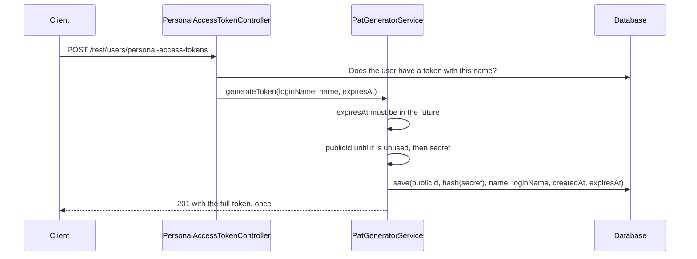
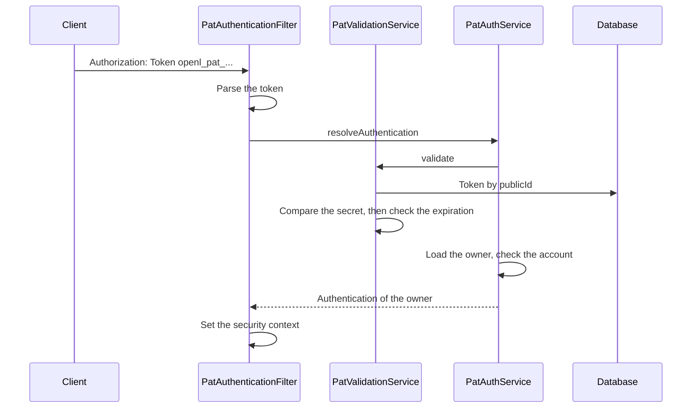

# Personal Access Token Architecture

A personal access token (PAT) lets a program call the REST API of OpenL Studio as a user, without the password of the
user and without an interactive sign-in. This page describes how the feature is built. The endpoints are in
[Personal Access Token API](personal-access-token-api.md).

## Goals

- **No password in a program** — a token is made for one purpose, can expire, and is revoked alone.
- **Same permissions as the owner** — a request with a token is authorized like a request of its owner.
- **No new privileges** — a token cannot manage tokens and cannot use the administrator privilege.
- **No leak** — the database does not hold a usable token, and a rejected token does not say why.

## Components

All the code is in `STUDIO/studio-backend`.

- **`PatAuthenticationFilter`** (`org.openl.studio.security.pat.filter`) — reads the `Authorization: Token ...` header
  of a REST request, and sets the authentication of the owner.
- **`PatToken`** (`org.openl.studio.security.pat.model`) — a record of the `publicId` and the `secret`. It parses and
  validates the text of a token.
- **`PatValidationService`** — checks the secret and the expiration against the stored token.
- **`PatAuthService`** — turns a valid token into the authentication of its owner, and refuses a disabled or locked user.
- **`PatUserInfoUserDetailsServiceImpl`** — loads the owner with the privileges of the external groups, so a token has the
  same authorities as an interactive sign-in.
- **`PatGeneratorService`** — creates a token: the identifiers, the secret, and the hash.
- **`Base62Generator`** — builds random Base62 strings with `SecureRandom`.
- **`PatSecurityConfiguration`** — defines the beans above, when `user.mode` is not `single`.
- **`PersonalAccessTokenController`** (`org.openl.studio.users.rest.controller`) — the endpoints for the owner.
- **`PersonalAccessTokenService`** (`org.openl.studio.users.service.pat`) — reads and deletes the tokens of a user.
- **`PersonalAccessTokenDao`**, **`PersonalAccessToken`** (`org.openl.rules.security.standalone`) — the storage and the
  entity of the table `OpenL_PAT_Tokens`.
- **`PasswordEncoder`** — hashes the secret. `security.password.encoder` selects it, and it is `bcrypt` by default.

## Token

```
openl_pat_<publicId>.<secret>
```

- **`publicId`** — 16 characters of Base62. It is the key of the stored token, so a lookup does not compare secrets.
- **`secret`** — 32 characters of Base62. The database keeps only its hash.
- **Limits** — a token has at most 256 characters, and `PatToken.parse` accepts only the prefix, the dot, and the two
  Base62 parts of the exact lengths.

## Creating a Token


```mermaid
sequenceDiagram
    participant C as Client
    participant K as PersonalAccessTokenController
    participant G as PatGeneratorService
    participant D as Database
    C->>K: POST /rest/users/personal-access-tokens
    K->>D: Does the user have a token with this name?
    K->>G: generateToken(loginName, name, expiresAt)
    G->>G: expiresAt must be in the future
    G->>G: publicId until it is unused, then secret
    G->>D: save(publicId, hash(secret), name, loginName, createdAt, expiresAt)
    G-->>C: 201 with the full token, once
```

## Authenticating with a Token


```mermaid
sequenceDiagram
    participant C as Client
    participant F as PatAuthenticationFilter
    participant V as PatValidationService
    participant A as PatAuthService
    participant D as Database
    C->>F: Authorization: Token openl_pat_...
    F->>F: Parse the token
    F->>A: resolveAuthentication
    A->>V: validate
    V->>D: Token by publicId
    V->>V: Compare the secret, then check the expiration
    A->>A: Load the owner, check the account
    A-->>F: Authentication of the owner
    F->>F: Set the security context
```

- **Header** — a request without the `Token ` prefix passes to the next filter untouched.
- **Failure** — a malformed token and a token that fails validation answer `401 Unauthorized` with no reason.
- **Context** — the filter sets the authentication unless the request already carries one for the same user.
- **Chain** — the filter belongs to the chain of the REST endpoints and the WebSocket handshake in the modes `ad`, `multi`,
  `saml`, and `oauth2`. In `ad` and `multi` it runs before the HTTP Basic filter. It is not in the chain of the pages, and
  it does not exist in `single` mode.
- **Client sessions** — a request with a token that does not belong to a browser session of the same user is a client
  of its own. The server keeps its state under `user|pat:<publicId>`; see
  [Client Sessions](../architecture/client-sessions.md).

## Design

- **Prefix `openl_pat_`** — `PatToken.parse` refuses a text without it.
- **Base62** — the characters are `0-9`, `a-z`, and `A-Z`.
- **Hash of the secret** — the password encoder hashes the secret, the same one as for the passwords of users. The
  table does not hold a usable token.
- **`publicId` apart from the secret** — the token is found by a key, and exactly one hash is compared. Without it the
  service would test every stored hash.
- **Expiration is optional** — a token without `expiresAt` lives until it is deleted.
- **One answer for a failure** — validation returns valid or invalid. An unknown token, a wrong secret, an expired
  token, and a disabled user look the same to a client.
- **Constant work for an unknown token** — the secret of a token with an unknown `publicId` is checked against a
  placeholder hash, so the time does not tell whether the token exists.
- **No self-service by token** — `@NotPatAuth` on the controller refuses a PAT, so a leaked token cannot create a
  longer-lived token.
- **No administrator by token** — `@AdminPrivilege` and the administrator branch of `@OwnerOrAdminPrivilege` refuse a PAT,
  so a leaked token of an administrator cannot configure the server.

## Database

The Flyway script `db/flyway/common/V15__Create_PAT_Tokens.sql` creates the table:

```sql
CREATE TABLE OpenL_PAT_Tokens
(
    publicId   varchar(16)  NOT NULL,
    secretHash varchar(255) NOT NULL,
    createdAt  timestamp    NOT NULL,
    expiresAt  timestamp,
    loginName  varchar(50)  NOT NULL,
    name       varchar(100) NOT NULL,

    PRIMARY KEY (publicId),
    FOREIGN KEY (loginName) REFERENCES OpenL_Users(loginName) ON DELETE CASCADE,
    UNIQUE (loginName, name),
    CHECK (expiresAt IS NULL OR expiresAt > createdAt)
);

CREATE INDEX ix_OpenL_PAT_Tokens_loginName ON OpenL_PAT_Tokens (loginName);
```

The column types are placeholders in the script (`${varchar}`, `${timestamp}`) that Flyway fills in for each database.
The constraints are named in the script; they are left out above for brevity.

- **Owner** — deleting a user deletes the tokens of the user.
- **Name** — a user cannot have two tokens with the same name.
- **Expiration** — a token that expires does so after it is created.
