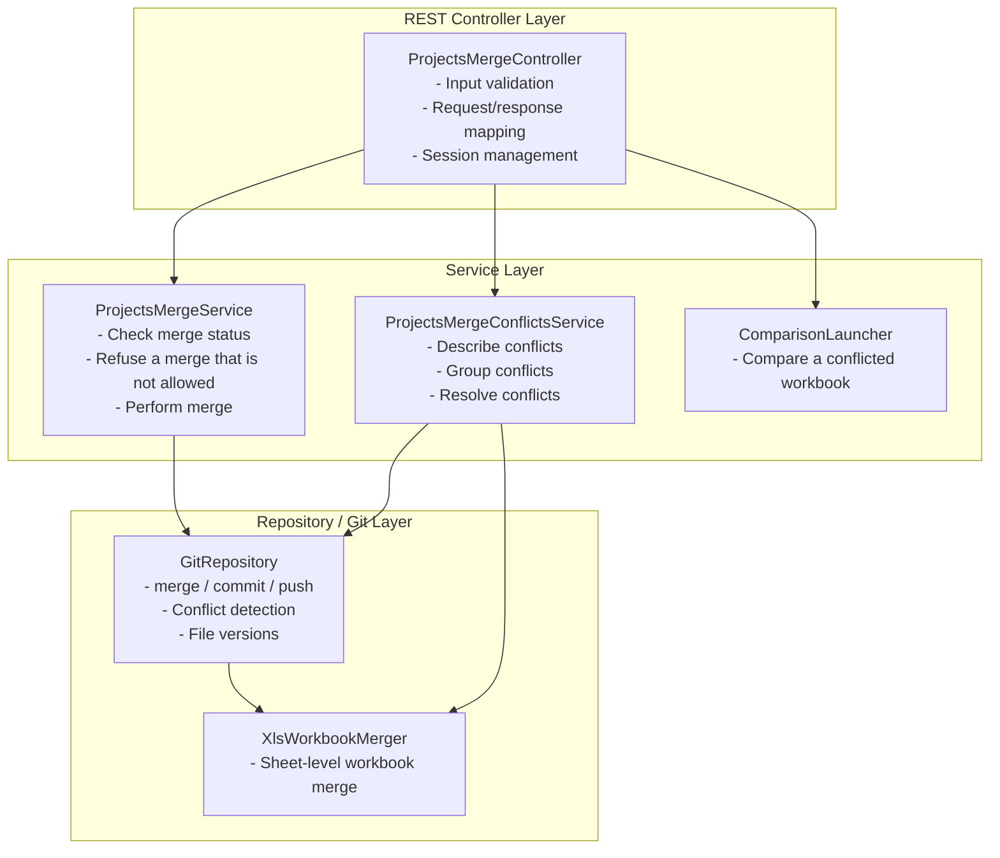
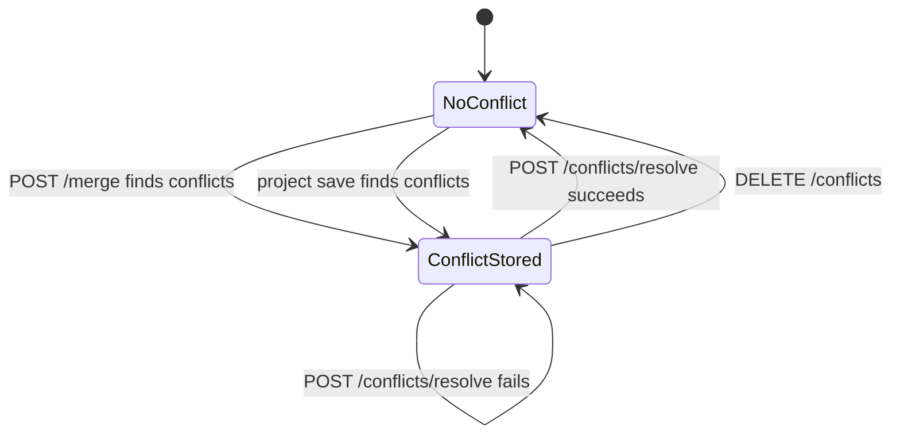

# Projects Merge API Documentation

**Status**: BETA — the endpoints form the **Projects: Merge (BETA)** group of the OpenAPI spec (`/rest/openapi.json`)
**Base Path**: `/rest/projects/{projectId}/merge`

`{projectId}` is the project id the API hands out, or the project name. A name that matches several projects answers
`409 Conflict` (`project.identifier.ambiguous.message`) and lists the candidates.

---

## Table of Contents

1. [Overview](#overview)
2. [API Architecture](#api-architecture)
3. [API Reference](#api-reference)
4. [Data Models](#data-models)
5. [Workflows](#workflows)
6. [Error Handling](#error-handling)
7. [Examples](#examples)
8. [Best Practices](#best-practices)
9. [Technical Implementation Notes](#technical-implementation-notes)
10. [Related APIs](#related-apis)

---

## Overview

The Projects Merge API provides a REST interface for merging the Git branches of an OpenL Studio project. It reports
whether there is anything to merge and whether the user may merge, performs the merge, lists the conflicts the merge
finds, lets a client download or compare the conflicting versions, and resolves the conflicts with a chosen version
or an uploaded file.

### Key Features

- **Pre-merge Check**: Reports whether the target branch already holds every change of the source branch, and
  whether the current user may perform the merge
- **Bidirectional Merging**: Support for both receiving changes from other branches and sending changes to other
  branches
- **Workbook Auto-resolution**: A conflicted Excel file whose sheets were each changed in one branch only is merged
  sheet by sheet without a decision from the user
- **Conflict Detection**: Automatic detection of merge conflicts with detailed file-level information
- **Conflict Resolution**: Multiple strategies for resolving conflicts (BASE, OURS, THEIRS, CUSTOM)
- **Conflict Comparison**: The two versions of a conflicted workbook are compared through the Compare API
- **Protected Branches**: A merge into a protected branch takes an explicit bypass confirmation (`force=true`)
- **Session Management**: Maintains conflict state across multiple API calls
- **Excel File Prioritization**: Excel files come first in conflict lists
- **Project State Management**: An opened project is reopened after the merge; a closed project is merged without
  being opened

### Architecture Overview



---

## API Architecture

### Component Architecture

#### 1. **ProjectsMergeController**
**Location**: `org.openl.studio.projects.rest.controller.ProjectsMergeController`

**Responsibilities**:
- Expose REST endpoints for merge operations
- Validate incoming requests
- Manage conflict session lifecycle
- Pause the compilation of an opened project for the length of a merge or a resolution, and reopen the project
  afterwards
- Hand the two versions of a conflicted workbook to the Compare API
- Coordinate with service layer

**Dependencies**:
- `ProjectsMergeService`: Core merge logic
- `ProjectsMergeConflictsService`: Conflict analysis and resolution
- `WorkspaceProjectService`: Project lifecycle management
- `ProjectsMergeConflictsSessionHolder`: Session-based conflict storage
- `ProjectIdentifierMapper`: The project id a stored conflict is kept under
- `ComparisonLauncher`: Starts the comparison of a conflicted workbook

#### 2. **ProjectsMergeService**
**Location**: `org.openl.studio.projects.service.merge.ProjectsMergeServiceImpl`

**Responsibilities**:
- Check where the branches stand and what prevents the user from merging them
- Refuse a merge that must not be performed
- Execute merge operations
- Detect merge conflicts

#### 3. **ProjectsMergeConflictsService**
**Location**: `org.openl.studio.projects.service.merge.ProjectsMergeConflictsServiceImpl`

**Responsibilities**:
- Describe merge conflicts: revisions, file availability, default merge message
- Group conflicts by project
- Retrieve conflict file versions
- Apply resolution strategies and merge the workbooks that resolve automatically
- Generate conflict resolution results

#### 4. **ProjectsMergeConflictsSessionHolder**
**Location**: `org.openl.studio.projects.service.merge.ProjectsMergeConflictsSessionHolder`

**Responsibilities**:
- Store the unresolved conflict of one client: the HTTP session of a browser, or the state kept for a credential
  (see [Client Sessions](../architecture/client-sessions.md))
- Maintain state between merge and resolution
- Clean up resolved and canceled conflicts

The holder keeps one conflict at a time. A conflict stored for another project replaces it.

### Session Management

The API uses session-based storage for conflict information:

```
1. User calls POST /merge, or saves the project (PATCH /rest/projects/{projectId}) → Conflicts detected
2. Conflict stored as MergeConflictInfo → SessionHolder
3. User calls /conflicts, /conflicts/files or /conflicts/compare → Reads the stored conflict
4. User calls /conflicts/resolve → Applies resolutions
5. On success, or on DELETE /conflicts → Clears session data
```

**Session Key**: The project id (`ProjectIdModel`, the repository id and the project name)

### State Machine



While a conflict of the project is stored, `POST /merge/check` and `POST /merge` answer `409 Conflict`.

---

## API Reference

### 1. Check Merge Status

**Endpoint**: `POST /rest/projects/{projectId}/merge/check`

**Description**: Reports where two branches stand and whether the current user may merge them. Does not modify any
data and does not look for conflicts: only the merge itself finds them.

**HTTP Method**: POST

**Path Parameters**:
- `projectId` (string, required): Project identifier

**Request Body**:
```json
{
  "mode": "receive|send",
  "otherBranch": "branch-name"
}
```

**Response**: `200 OK`
```json
{
  "sourceBranch": "feature-pricing",
  "targetBranch": "main",
  "status": "mergeable",
  "canMerge": false,
  "blockedBy": "bypass-required"
}
```

**Possible Statuses**:
- `mergeable`: The target branch does not hold every change of the source branch yet
- `up-to-date`: Target branch is already up-to-date

**What Blocks the Merge** (`blockedBy`, absent when `canMerge` is `true`):
- `bypass-required`: The target branch is protected; the user may merge with `force=true`
- `protected-branch`: The target branch is protected and the user cannot bypass the protection
- `locked`: The project is locked on the target branch by another user

The status is reported whatever `blockedBy` says.

**Errors**:
- `409 Conflict`: Project has unresolved merge conflicts from a previous operation, the project cannot take a merge,
  `otherBranch` is the current branch or does not exist
- `403 Forbidden`: The user may not write to the project
- `404 Not Found`: Project not found
- `400 Bad Request`: The request body is invalid

---

### 2. Perform Merge

**Endpoint**: `POST /rest/projects/{projectId}/merge`

**Description**: Executes a merge operation between two branches. If conflicts are detected, they are stored in session
for later resolution.

**HTTP Method**: POST

**Path Parameters**:
- `projectId` (string, required): Project identifier

**Query Parameters**:
- `force` (boolean, optional, default `false`): Confirms the bypass of the target branch protection. Ignored when the
  target branch is not protected

**Request Body**:
```json
{
  "mode": "receive|send",
  "otherBranch": "branch-name"
}
```

**Merge Modes**:
- `receive`: Merge changes FROM `otherBranch` INTO current branch
- `send`: Merge changes FROM current branch INTO `otherBranch`

**Response**: `200 OK`

**Success (no conflicts)**:
```json
{
  "status": "success"
}
```

The API omits empty values, so a successful merge has no `conflictGroups`.

**Conflicts detected**:
```json
{
  "status": "conflicts",
  "conflictGroups": [
    {
      "projectName": "MyProject",
      "projectPath": "MyProject",
      "files": [
        "MyProject/rules/Main.xlsx",
        "MyProject/rules.xml"
      ]
    }
  ]
}
```

A merge whose conflicted files are all workbooks that resolve automatically answers `success`. Its commit message
lists those workbooks and their sheets under `Automatically resolved conflicts`.

**Errors**:
- `409 Conflict`: Every refusal of the check, plus: an eligible user merges into a protected branch without
  `force=true`, the project is locked on the target branch, or there is nothing to merge
- `403 Forbidden`: The user may not write to the project, or the target branch is protected and the user cannot
  bypass the protection
- `404 Not Found`: Project not found
- `500 Internal Server Error`: Git operation failed

**Side Effects**:
- On success: The merge is committed to the target branch. An opened project is closed, the workspace refreshed and
  the project reopened on its current branch; a project the merge deleted stays closed. A closed project stays closed
- On conflicts: Conflict information stored in session, the target branch keeps its commit from before the merge
- A merge that is refused is refused before the compilation of the project is paused

---

### 3. Get Merge Conflicts

**Endpoint**: `GET /rest/projects/{projectId}/merge/conflicts`

**Description**: Retrieves detailed information about the stored conflict, including revision metadata for all
three sides (OURS, THEIRS, BASE) and a default merge message. Requires a previous merge or save that detected
conflicts.

**HTTP Method**: GET

**Path Parameters**:
- `projectId` (string, required): Project identifier

**Response**: `200 OK`
```json
{
  "conflictGroups": [
    {
      "projectName": "MyProject",
      "projectPath": "MyProject",
      "files": [
        "MyProject/rules/Main.xlsx"
      ]
    }
  ],
  "fileAvailability": {
    "MyProject/rules/Main.xlsx": {
      "ours": false,
      "theirs": true,
      "base": true
    }
  },
  "oursRevision": {
    "commit": "4f0c2d9a7b1e3c5d8f6a2b4c6d8e0f1a3b5c7d9e",
    "branch": "main",
    "exists": false
  },
  "theirsRevision": {
    "commit": "9e7d5c3b1a0f8e6d4c2b0a9f7e5d3c1b9a8f6e4d",
    "branch": "feature-pricing",
    "author": "Jane Smith",
    "modifiedAt": "2026-09-17T14:22:00Z",
    "exists": true
  },
  "baseRevision": {
    "commit": "1a3c5e7b9d2f4a6c8e0b1d3f5a7c9e2b4d6f8a0c",
    "author": "John Doe",
    "modifiedAt": "2026-09-10T09:00:00Z",
    "exists": true
  },
  "defaultMessage": "Merge with commit 9e7d5c3b1a0f8e6d4c2b0a9f7e5d3c1b9a8f6e4d\nConflicts:\n\tMyProject/rules/Main.xlsx"
}
```

**Revision Information**:
- `oursRevision`: Metadata about the current branch version
- `theirsRevision`: Metadata about the merging branch version
- `baseRevision`: Metadata about the common ancestor version; it names no branch
- `fileAvailability`: Whether each conflicted file exists in the current, merging, and base revisions
- `defaultMessage`: Auto-generated merge commit message (can be overridden during resolution)

**RevisionDetails Fields**:
- `commit`: Full commit hash, or the name of the tag that marks the commit
- `branch`: Branch name; absent for the base revision and for every revision of a save conflict
- `author`: Commit author name
- `modifiedAt`: ISO 8601 timestamp of the commit
- `exists`: Boolean indicating if the revision contains at least one conflicted file

A revision that holds none of the conflicted files has no `author` and no `modifiedAt`.

The `ours`, `theirs`, and `base` fields under each `fileAvailability` entry provide the per-file state. Clients must
use these fields, rather than the revision-level `exists` field, to decide whether a particular version can be
downloaded.

**Default Message**: `Merge with commit <their commit>`, then the conflicted files under `Conflicts:`, and the
workbooks that resolve automatically, with their changed sheets and branches, under `Automatically resolved
conflicts:`.

**File Ordering**:
- Excel files (`.xls`, `.xlsx`, `.xlsm`) appear first
- Other files sorted alphabetically (case-insensitive)

**Errors**:
- `404 Not Found`: No conflict information found in session

---

### 4. Get Conflicted File

**Endpoint**: `GET /rest/projects/{projectId}/merge/conflicts/files`

**Description**: Downloads a specific version of a conflicted file.

**HTTP Method**: GET

**Path Parameters**:
- `projectId` (string, required): Project identifier

**Query Parameters**:
- `file` (string, required): Path of the conflicted file exactly as `conflictGroups[].files` lists it
- `side` (enum, required): Version to retrieve: `BASE`, `OURS`, or `THEIRS`

**Side Definitions**:
- `BASE`: Common ancestor version (before branches diverged)
- `OURS`: Version from the current branch; in a save conflict, the version being saved
- `THEIRS`: Version from the merging branch; in a save conflict, the version another user saved first

**Response**: `200 OK`
- Content-Type: Determined by file name (e.g.,
  `application/vnd.openxmlformats-officedocument.spreadsheetml.sheet` for `.xlsx`), `application/octet-stream` when
  the name tells nothing
- Content-Disposition: `attachment; filename=Main.xlsx; filename*=UTF-8''Main.xlsx`
- Body: Binary file content

If the file does not exist on the requested side of the conflict, the endpoint returns `404 Not Found`. Clients can
avoid requesting missing versions by checking `fileAvailability` in the conflict-details response.

**Example**:
```bash
GET /rest/projects/MyProject/merge/conflicts/files?file=MyProject%2Frules%2FMain.xlsx&side=OURS
```

**Errors**:
- `404 Not Found`: No conflict information found, file not in conflict list, or file missing in the requested revision
- `400 Bad Request`: Missing or invalid side parameter

---

### 5. Compare Conflicted File Versions

**Endpoint**: `POST /rest/projects/{projectId}/merge/conflicts/compare`

**Description**: Starts a comparison of the two versions of a conflicted workbook — the THEIRS version against the
OURS version. The comparison itself is read through the Compare API, so this endpoint only starts it.

**HTTP Method**: POST

**Path Parameters**:
- `projectId` (string, required): Project identifier

**Query Parameters**:
- `file` (string, required): Path of the conflicted file exactly as `conflictGroups[].files` lists it

**Response**: `202 Accepted`
```json
{
  "id": "b1b0c2e0-0a3f-4e52-9f0a-7a1d7d6a0f11"
}
```

The identifier names the comparison: `/topic/compare/{id}/status` reports how it is going (a client subscribes to
`/user/topic/compare/{id}/status` over the `/ws` WebSocket), `GET /rest/compare/{id}` reads what the two versions
hold, and `DELETE /rest/compare/{id}` releases it. A session holds one comparison at a time, so starting another one
releases this one.

Only Excel files are compared this way. A conflicted file of any other format is read line by line by the client
through `GET /rest/projects/{projectId}/merge/conflicts/files`, which is why this endpoint refuses it.

**Example**:
```bash
POST /rest/projects/MyProject/merge/conflicts/compare?file=MyProject%2Frules%2FMain.xlsx
```

**Errors**:
- `400 Bad Request`: The file is not an Excel file; this is checked before the stored conflict is read
- `404 Not Found`: No conflict information found, file not in conflict list, or file missing in one of the
  two versions

---

### 6. Resolve Conflicts

**Endpoint**: `POST /rest/projects/{projectId}/merge/conflicts/resolve`

**Description**: Resolves merge conflicts using specified strategies. Can upload custom files for custom resolution.

**HTTP Method**: POST

**Content-Type**: `multipart/form-data`

**Path Parameters**:
- `projectId` (string, required): Project identifier

**Form Fields**:
- `resolutions[i].filePath` (string, required): Path of the conflicted file exactly as `conflictGroups[].files`
  lists it
- `resolutions[i].strategy` (enum, required): `BASE`, `OURS`, `THEIRS`, or `CUSTOM`
- `resolutions[i].file` (file, conditional): The resolved file for the `CUSTOM` strategy
- `message` (string, optional): Commit message for the merge resolution

`i` counts the resolutions from `0`; at least one resolution is required.

**Resolution Format**:
```bash
curl -X POST http://localhost:8080/rest/projects/MyProject/merge/conflicts/resolve \
  -F 'resolutions[0].filePath=MyProject/rules/Main.xlsx' \
  -F 'resolutions[0].strategy=OURS' \
  -F 'resolutions[1].filePath=MyProject/rules.xml' \
  -F 'resolutions[1].strategy=CUSTOM' \
  -F 'resolutions[1].file=@rules.xml' \
  -F 'message=Resolved merge conflicts: kept business rules from current branch'
```

**Resolution Strategies**:
- `BASE`: Use the common ancestor version
- `OURS`: Use the current branch version; in a save conflict, the version in the workspace
- `THEIRS`: Use the merging branch version
- `CUSTOM`: Use a custom uploaded file (file parameter required)

A strategy whose version does not hold the file deletes the file.

**Response**: `200 OK`
```json
{
  "status": "success",
  "resolvedFiles": [
    "MyProject/rules/Main.xlsx",
    "MyProject/rules.xml"
  ]
}
```

`resolvedFiles` lists the files of the request. The workbooks that resolve automatically are merged and committed
with them, and are not listed.

**Errors**:
- `404 Not Found`: No conflict information found in session
- `400 Bad Request`:
  - CUSTOM strategy without file upload
  - Empty resolutions array, or a resolution without a file path or a strategy
  - Two resolutions for the same file
  - A file that is not in the conflict list
  - An uploaded Excel or ZIP file that is damaged or incomplete
  - A malformed multipart body
- `413 Payload Too Large`: OpenL Studio receives the multipart request and detects that it exceeds an application or
  embedded Jetty limit. A proxy or container can return a deployment-specific response when it rejects the request
  before Spring receives it
- `500 Internal Server Error`: Resolution operation failed

**Side Effects**:
- On success:
  - Conflict session data cleared
  - Merge completed and committed; for a save conflict, the project is saved
  - A resolved workbook whose module `rules.xml` of either side declares, while the `rules.xml` of the branch does not,
    gets its module declared again in a second commit with the same message
  - Workspace refreshed
  - Project reopened if previously open
- On failure:
  - Session data preserved
  - Can retry resolution

---

### 7. Cancel Merge Conflicts

**Endpoint**: `DELETE /rest/projects/{projectId}/merge/conflicts`

**Description**: Cancels an ongoing merge conflict resolution session without applying changes.

**HTTP Method**: DELETE

**Path Parameters**:
- `projectId` (string, required): Project identifier

**Response**: `204 No Content`

**Errors**:
- `404 Not Found`: No conflict information found in session

**Side Effects**:
- Conflict session data cleared
- No changes made to repository
- User can initiate a new merge operation

---

## Data Models

The models are Java records of `org.openl.studio.projects.model.merge`, except `ResolveConflictsRequest`, which is
bound from the form fields of `org.openl.studio.projects.rest.model`.

### MergeRequest

| Field         | Type                    | Description                                         |
|---------------|-------------------------|-----------------------------------------------------|
| `mode`        | `receive` \| `send`     | Merge direction; required                           |
| `otherBranch` | string                  | Target or source branch name; required, non-blank   |

---

### CheckMergeResult

| Field          | Type                                                  | Description                                  |
|----------------|-------------------------------------------------------|----------------------------------------------|
| `sourceBranch` | string                                                | Source branch in the merge                   |
| `targetBranch` | string                                                | Target branch in the merge                   |
| `status`       | `mergeable` \| `up-to-date`                           | Where the branches stand                     |
| `canMerge`     | boolean                                               | Whether the current user may perform it      |
| `blockedBy`    | `bypass-required` \| `protected-branch` \| `locked`   | What prevents the merge; absent if nothing   |

---

### MergeResultResponse

| Field            | Type                        | Description                                     |
|------------------|-----------------------------|-------------------------------------------------|
| `status`         | `success` \| `conflicts`    | Merge operation result                          |
| `conflictGroups` | ConflictGroup[]             | Conflicts if any; absent after a success        |

---

### ConflictDetailsResponse

| Field              | Type                                     | Description                                      |
|--------------------|------------------------------------------|--------------------------------------------------|
| `conflictGroups`   | ConflictGroup[]                          | Array of conflict groups                         |
| `fileAvailability` | map of file path → ConflictFileAvailability | `ours`, `theirs`, `base`: booleans per file   |
| `oursRevision`     | RevisionDetails                          | Metadata for current branch version              |
| `theirsRevision`   | RevisionDetails                          | Metadata for merging branch version              |
| `baseRevision`     | RevisionDetails                          | Metadata for common ancestor version             |
| `defaultMessage`   | string                                   | Auto-generated merge commit message              |

**Notes**:
- `defaultMessage` names the conflicting commit and lists the conflicted files
- Client can override `defaultMessage` when calling resolve endpoint

---

### RevisionDetails

| Field        | Type    | Description                                                      |
|--------------|---------|------------------------------------------------------------------|
| `commit`     | string  | Full commit hash, or the tag that marks the commit               |
| `branch`     | string  | Branch name; absent for the base revision and in a save conflict |
| `author`     | string  | Commit author name; absent when `exists` is `false`              |
| `modifiedAt` | string  | ISO 8601 timestamp; absent when `exists` is `false`              |
| `exists`     | boolean | Whether the revision holds at least one conflicted file          |

**Use Cases**:
- Display revision metadata in conflict resolution UI
- Show who made changes and when

---

### ConflictGroup

| Field         | Type     | Description                                        |
|---------------|----------|----------------------------------------------------|
| `projectName` | string   | Project name                                       |
| `projectPath` | string   | Repository path to project                         |
| `files`       | string[] | Conflicted file paths, as the repository holds them |

**Ordering**:
- Groups are sorted by project name (case-insensitive)
- Files that belong to no project of the workspace form the last group, with an empty `projectName` and `projectPath`
- Excel files appear first in a group
- Remaining files sorted alphabetically (case-insensitive)

---

### ConflictBase

`BASE` (common ancestor version), `OURS` (current branch version), `THEIRS` (merging branch version). The value is
sent as written.

---

### ResolveConflictsRequest

| Form field                | Type                                      | Description                          |
|---------------------------|-------------------------------------------|--------------------------------------|
| `resolutions[i].filePath` | string                                    | Path to conflicted file; required    |
| `resolutions[i].strategy` | `BASE` \| `OURS` \| `THEIRS` \| `CUSTOM`  | Resolution approach; required        |
| `resolutions[i].file`     | file                                      | Required for CUSTOM strategy         |
| `message`                 | string                                    | Optional commit message              |

**Validation**:
- At least one resolution required
- If strategy is `CUSTOM`, a non-empty file must be provided
- File path must match a file in the conflict list
- A file path appears in one resolution only
- An uploaded Excel or ZIP file must be complete and readable in the format of its extension

---

### ResolveConflictsResponse

| Field           | Type      | Description                                              |
|-----------------|-----------|----------------------------------------------------------|
| `status`        | `success` | All conflicts resolved successfully; the only value      |
| `resolvedFiles` | string[]  | The files of the resolutions in the request              |

---

## Workflows

### Workflow 1: Simple Merge (No Conflicts)

```
1. Check merge status
   POST /rest/projects/MyProject/merge/check
   {
     "mode": "receive",
     "otherBranch": "feature-123"
   }

   Response: { "status": "mergeable", "canMerge": true, ... }

2. Perform merge
   POST /rest/projects/MyProject/merge
   {
     "mode": "receive",
     "otherBranch": "feature-123"
   }

   Response: { "status": "success" }
```

---

### Workflow 2: Merge with Conflicts

```
1. Attempt merge
   POST /rest/projects/MyProject/merge
   {
     "mode": "receive",
     "otherBranch": "feature-123"
   }

   Response: {
     "status": "conflicts",
     "conflictGroups": [{
       "projectName": "MyProject",
       "files": ["MyProject/rules/Main.xlsx", "MyProject/rules.xml"]
     }]
   }

2. Get detailed conflicts
   GET /rest/projects/MyProject/merge/conflicts

   Response: {
     "conflictGroups": [{ "files": ["MyProject/rules/Main.xlsx", "MyProject/rules.xml"] }],
     "fileAvailability": { "MyProject/rules/Main.xlsx": { "ours": true, "theirs": true, "base": true }, ... },
     "oursRevision": { "branch": "main", "author": "John", ... },
     "theirsRevision": { "branch": "feature-123", "author": "Jane", ... },
     "baseRevision": { "commit": "1a3c5e7...", ... },
     "defaultMessage": "Merge with commit 9e7d5c3...\nConflicts:\n\tMyProject/rules/Main.xlsx\n\tMyProject/rules.xml"
   }

3. Download conflict versions for review
   GET /rest/projects/MyProject/merge/conflicts/files?file=MyProject%2Frules%2FMain.xlsx&side=OURS
   GET /rest/projects/MyProject/merge/conflicts/files?file=MyProject%2Frules%2FMain.xlsx&side=THEIRS

4. Resolve conflicts
   POST /rest/projects/MyProject/merge/conflicts/resolve
   Content-Type: multipart/form-data

   resolutions[0].filePath=MyProject/rules/Main.xlsx
   resolutions[0].strategy=OURS
   resolutions[1].filePath=MyProject/rules.xml
   resolutions[1].strategy=THEIRS
   message=Merged feature-123: kept our business rules, accepted their config

   Response: {
     "status": "success",
     "resolvedFiles": ["MyProject/rules/Main.xlsx", "MyProject/rules.xml"]
   }
```

---

### Workflow 3: Custom Conflict Resolution

```
1. Merge with conflicts detected
   POST /rest/projects/MyProject/merge
   { "mode": "receive", "otherBranch": "feature-123" }

   Response: { "status": "conflicts", ... }

2. Download all versions for manual merge
   GET /rest/projects/MyProject/merge/conflicts/files?file=MyProject%2Frules.xml&side=BASE
   GET /rest/projects/MyProject/merge/conflicts/files?file=MyProject%2Frules.xml&side=OURS
   GET /rest/projects/MyProject/merge/conflicts/files?file=MyProject%2Frules.xml&side=THEIRS

3. Manually merge files locally (external tool)
   - User creates merged-rules.xml combining changes

4. Upload custom resolution
   POST /rest/projects/MyProject/merge/conflicts/resolve
   Content-Type: multipart/form-data

   resolutions[0].filePath=MyProject/rules.xml
   resolutions[0].strategy=CUSTOM
   resolutions[0].file=merged-rules.xml
   message=Custom merge of rules.xml

   Response: { "status": "success", "resolvedFiles": ["MyProject/rules.xml"] }
```

---

### Workflow 4: Cancel Conflicts

```
1. Merge with conflicts detected
   POST /rest/projects/MyProject/merge
   { "mode": "receive", "otherBranch": "feature-123" }

   Response: { "status": "conflicts", ... }

2. User decides not to proceed
   DELETE /rest/projects/MyProject/merge/conflicts

   Response: 204 No Content
```

---

### Workflow 5: Merge into a Protected Branch

```
1. Check merge status
   POST /rest/projects/MyProject/merge/check
   { "mode": "send", "otherBranch": "release-2.0" }

   Response: { "status": "mergeable", "canMerge": false, "blockedBy": "bypass-required", ... }

2. Confirm the bypass
   POST /rest/projects/MyProject/merge?force=true
   { "mode": "send", "otherBranch": "release-2.0" }

   Response: { "status": "success" }
```

A user eligible for the bypass holds the Manager role on the project or its repository while
`security.allow-bypass-protected-branches` is `true` (default `false`). Without `force=true` the merge answers `409`
with `protected.branch.bypass.required`; for any other user it answers `403` with or without `force`.

---

## Error Handling

### Error Response Format

```json
{
  "code": "openl.error.409.project.unresolved.merge.conflicts.message",
  "message": "Project has unresolved merge conflicts. Please resolve them first or abort the merge."
}
```

`code` is `openl.error.<status>.<key>`; `message` is the text of the code in `ValidationMessages.properties`. A
request body that fails validation answers `400` with a `fields` list naming each rejected field.

### Error Codes

| Status | Key                                              | Raised when                                              |
|--------|--------------------------------------------------|----------------------------------------------------------|
| 400    | `project.merge.conflict.custom.file.missing.message` | A `CUSTOM` resolution comes without a file or with an empty one |
| 400    | `project.merge.conflict.duplicate.resolution`    | Two resolutions name the same file                       |
| 400    | `project.merge.conflict.file.not.in.conflicts`   | A resolution names a file that is not conflicted         |
| 400    | `project.merge.conflict.custom.file.damaged`     | An uploaded Excel or ZIP file is damaged or incomplete   |
| 400    | `compare.file.not-excel.message`                 | `/conflicts/compare` is asked for a file that is not Excel |
| 403    | `default.message`                                | The user may not write to the project, or cannot bypass a protected target |
| 404    | `project.identifier.message`                     | The project is not found                                 |
| 404    | `project.merge.result.not.found.message`         | No conflict of the project is stored                     |
| 404    | `project.merge.conflict.file.not.found`          | The file is not in the conflict list                     |
| 404    | `project.merge.conflict.file.revision.not.found` | The requested version does not hold the file             |
| 409    | `project.unresolved.merge.conflicts.message`     | Check or merge while a conflict of the project is stored |
| 409    | `project.merge.invalid.state.message`            | The project cannot take a merge (see below)              |
| 409    | `project.merge.same.branches.message`            | `otherBranch` is the current branch                      |
| 409    | `project.merge.branch.not.found.message`         | `otherBranch` does not exist                             |
| 409    | `project.merge.repository.unsupported.message`   | The repository does not support branches                 |
| 409    | `protected.branch.bypass.required`               | Merge into a protected branch without `force=true`       |
| 409    | `project.merge.branch.locked.message`            | The project is locked on the target branch               |
| 409    | `project.branch.merge.not.mergeable.message`     | Nothing to merge: the target holds every change already  |

A project cannot take a merge when it exists only in the workspace, has unsaved changes, lives in a repository
without branches, or its repository has no other branch. A project the user may not read answers `403`.

---

### Common Error Scenarios

#### 1. Unresolved Conflicts Exist

**Scenario**: User tries to merge while previous conflicts are unresolved

**Request**:
```bash
POST /rest/projects/MyProject/merge/check
```

**Response**: `409 Conflict`
```json
{
  "code": "openl.error.409.project.unresolved.merge.conflicts.message",
  "message": "Project has unresolved merge conflicts. Please resolve them first or abort the merge."
}
```

**Resolution**:
- Resolve existing conflicts: `POST /conflicts/resolve`
- Cancel existing conflicts: `DELETE /conflicts`

---

#### 2. No Conflict Information Found

**Scenario**: User tries to access conflicts without a previous merge operation

**Request**:
```bash
GET /rest/projects/MyProject/merge/conflicts
```

**Response**: `404 Not Found`
```json
{
  "code": "openl.error.404.project.merge.result.not.found.message",
  "message": "The merge result for the project is not found."
}
```

**Resolution**: Perform a merge operation first

---

#### 3. Nothing to Merge

**Scenario**: The target branch already holds every change of the source branch

**Request**:
```bash
POST /rest/projects/MyProject/merge
{"mode": "receive", "otherBranch": "merged-branch"}
```

**Response**: `409 Conflict`
```json
{
  "code": "openl.error.409.project.branch.merge.not.mergeable.message",
  "message": "Cannot merge because there are no changes between the source and target branches."
}
```

**Resolution**: Check merge status first; `up-to-date` means there is nothing to merge

---

#### 4. Custom File Missing

**Scenario**: User selects CUSTOM strategy without uploading file

**Request**:
```bash
POST /rest/projects/MyProject/merge/conflicts/resolve
resolutions[0].filePath=MyProject/rules.xml
resolutions[0].strategy=CUSTOM
# No file uploaded
```

**Response**: `400 Bad Request`
```json
{
  "code": "openl.error.400.project.merge.conflict.custom.file.missing.message",
  "message": "The custom file for 'MyProject/rules.xml' is missing in the uploaded files."
}
```

**Resolution**: Upload the custom file in the request

---

#### 5. Multipart Upload Rejected

**Scenario**: OpenL Studio receives the conflict resolution body and detects that it exceeds an application or embedded
Jetty upload limit, or contains more multipart parts than embedded Jetty accepts.

**OpenL Studio response**: `413 Payload Too Large`

```json
{
  "code": "openl.error.413.default.message",
  "message": "Maximum upload size exceeded"
}
```

A proxy or container that rejects the request before Spring receives it can return a deployment-specific response
body.

**Resolution**: Upload less content or fewer parts in one request, or ask the server administrator to adjust the limit
enforced by OpenL Studio, the application container, or an upstream proxy.

---

#### 6. Malformed Multipart Request

**Scenario**: The multipart body is truncated or does not follow its declared boundary.

**Response**: `400 Bad Request`

```json
{
  "code": "openl.error.400.default.message",
  "message": "Failed to parse multipart servlet request"
}
```

**Resolution**: Send a complete multipart body whose boundaries match the `Content-Type` header.

---

## Examples

The examples omit authentication; add the credentials your OpenL Studio accepts.

### Example 1: Receive Changes from Feature Branch

**Scenario**: Merge changes from `feature-user-auth` into current `main` branch

```bash
# Step 1: Check if merge is possible
curl -X POST http://localhost:8080/rest/projects/MyProject/merge/check \
  -H "Content-Type: application/json" \
  -d '{
    "mode": "receive",
    "otherBranch": "feature-user-auth"
  }'

# Response
{
  "sourceBranch": "feature-user-auth",
  "targetBranch": "main",
  "status": "mergeable",
  "canMerge": true
}

# Step 2: Perform the merge
curl -X POST http://localhost:8080/rest/projects/MyProject/merge \
  -H "Content-Type: application/json" \
  -d '{
    "mode": "receive",
    "otherBranch": "feature-user-auth"
  }'

# Response (success)
{
  "status": "success"
}
```

---

### Example 2: Send Changes to Release Branch

**Scenario**: Merge current `main` branch into `release-2.0`

```bash
curl -X POST http://localhost:8080/rest/projects/MyProject/merge \
  -H "Content-Type: application/json" \
  -d '{
    "mode": "send",
    "otherBranch": "release-2.0"
  }'

# Response (success)
{
  "status": "success"
}
```

---

### Example 3: Resolve Conflicts with Multiple Strategies

**Scenario**: Resolve conflicts using different strategies for different files

```bash
# Step 1: Merge detects conflicts
curl -X POST http://localhost:8080/rest/projects/MyProject/merge \
  -H "Content-Type: application/json" \
  -d '{
    "mode": "receive",
    "otherBranch": "feature-pricing"
  }'

# Response (conflicts)
{
  "status": "conflicts",
  "conflictGroups": [{
    "projectName": "MyProject",
    "projectPath": "MyProject",
    "files": [
      "MyProject/rules/PricingRules.xlsx",
      "MyProject/rules/ValidationRules.xlsx",
      "MyProject/README.md",
      "MyProject/rules.xml"
    ]
  }]
}

# Step 2: Download versions for review
curl -o ours-pricing.xlsx \
  "http://localhost:8080/rest/projects/MyProject/merge/conflicts/files?file=MyProject%2Frules%2FPricingRules.xlsx&side=OURS"

curl -o theirs-pricing.xlsx \
  "http://localhost:8080/rest/projects/MyProject/merge/conflicts/files?file=MyProject%2Frules%2FPricingRules.xlsx&side=THEIRS"

# Step 3: Resolve with mixed strategies
curl -X POST http://localhost:8080/rest/projects/MyProject/merge/conflicts/resolve \
  -F 'resolutions[0].filePath=MyProject/rules/PricingRules.xlsx' \
  -F 'resolutions[0].strategy=OURS' \
  -F 'resolutions[1].filePath=MyProject/rules/ValidationRules.xlsx' \
  -F 'resolutions[1].strategy=THEIRS' \
  -F 'resolutions[2].filePath=MyProject/rules.xml' \
  -F 'resolutions[2].strategy=CUSTOM' \
  -F 'resolutions[2].file=@merged-rules.xml' \
  -F 'resolutions[3].filePath=MyProject/README.md' \
  -F 'resolutions[3].strategy=THEIRS' \
  -F 'message=Merged feature-pricing: kept our pricing rules, accepted their validation rules and docs'

# Response (success)
{
  "status": "success",
  "resolvedFiles": [
    "MyProject/rules/PricingRules.xlsx",
    "MyProject/rules/ValidationRules.xlsx",
    "MyProject/rules.xml",
    "MyProject/README.md"
  ]
}
```

---

### Example 4: Cancel Merge Operation

```bash
# Step 1: Merge detects conflicts
curl -X POST http://localhost:8080/rest/projects/MyProject/merge \
  -H "Content-Type: application/json" \
  -d '{"mode":"receive","otherBranch":"feature-abc"}'

# Response (conflicts detected)
{
  "status": "conflicts",
  "conflictGroups": [...]
}

# Step 2: User decides to cancel
curl -X DELETE http://localhost:8080/rest/projects/MyProject/merge/conflicts

# Response: 204 No Content
# Conflict session cleared
```

---

## Best Practices

### 1. Check Before Merging

`POST /merge/check` tells whether there is anything to merge (`up-to-date`) and whether the user may perform the merge
(`canMerge`, `blockedBy`). `POST /merge` refuses the same cases with `409` or `403`. Neither call predicts conflicts.

### 2. Download All Versions Before Custom Resolution

When using CUSTOM strategy, review all three versions, and request only the versions `fileAvailability` reports:

```bash
# Download BASE (common ancestor)
GET /rest/projects/MyProject/merge/conflicts/files?file=MyProject%2Frules.xml&side=BASE

# Download OURS (current branch)
GET /rest/projects/MyProject/merge/conflicts/files?file=MyProject%2Frules.xml&side=OURS

# Download THEIRS (merging branch)
GET /rest/projects/MyProject/merge/conflicts/files?file=MyProject%2Frules.xml&side=THEIRS
```

### 3. Resolve Every Conflicted File in One Request

Send one resolution for each file of the conflict list. A request whose resolution is refused leaves the stored
conflict as it was, so the client can fix the request and send it again.

### 4. Clean Up Abandoned Conflicts

A stored conflict blocks the next check and merge of the project. Cancel it with `DELETE /conflicts` when the
resolution is abandoned; otherwise it ends with the client session.

---

## Technical Implementation Notes

### Session Management

**Storage**: `ProjectsMergeConflictsSessionHolder`, a `@ClientSessionScope` bean

**Key**: The project id (`ProjectIdModel`)

**Lifecycle**:
1. Created: When `POST /merge` or a project save detects conflicts
2. Accessed: During conflict retrieval and resolution
3. Cleared: On successful resolution or explicit cancel
4. Replaced: When a conflict of another project is stored for the same client
5. Timeout: Ends with the client session, after 30 minutes of inactivity (`session-timeout` in `web.xml`)

While a save conflict is stored, its project id keeps resolving to the conflicted project, even after a workspace
refresh renamed the project (`MergeConflictProjectResolveStrategy`).

### Project Lifecycle During Merge

1. `validateMergeAllowed` refuses a merge that must not be performed, before anything else happens.
2. For an opened project, the compilation is paused (`WebStudioWorkspaceRelatedDependencyManager.pause()`).
3. The Git repository merges the source branch into the target branch; the request waits up to 30 seconds for the
   project index to publish the target branch.
4. On success, an opened project is closed, the workspace refreshed, and the project reopened on its branch.
   `WebStudio` is reset, and the paused compilation is dropped with the editor model.
5. On conflicts, or when the request fails, the compilation is resumed when the request ends.

Resolving conflicts follows the same steps.

### Conflict File Retrieval

Files are read from the commits of the conflict, not from the working tree:
- `BASE`: Common ancestor from merge base
- `OURS`: Commit of the current branch
- `THEIRS`: Commit of the other branch

In a `send` merge, the branches swap their Git roles, so `OURS` stays the current branch.

---

## Related APIs

- **Compare API**: `GET /rest/compare/{id}` and `DELETE /rest/compare/{id}` read and release the comparison of a
  conflicted workbook
- **Project branches**: `GET /rest/projects/{projectId}/branches?scope=repository` lists every branch of the repository
  as a merge target; the default `scope=project` lists the branches that hold the project
- **Project save**: `PATCH /rest/projects/{projectId}` answers `409` with `project.save.merge.conflict.message` when the
  save conflicts, and stores the conflict for this API
- **Architecture**: [Projects Merge API - Architecture Design](projects-merge-architecture.md)
- **User guide**: [Working with Project Branches](../user-guides/openl-studio/project-branches.md)
