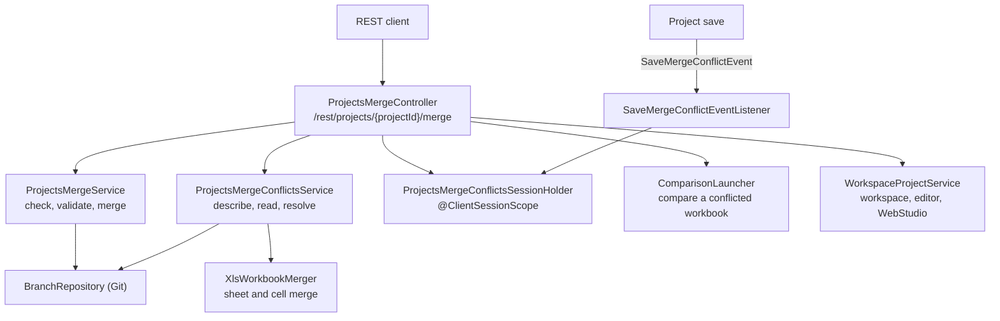

# Projects Merge API - Architecture Design

**Status**: BETA — the design behind [Projects Merge API](projects-merge-api.md)

The API merges the Git branches of a project, keeps the conflicts of a merge or of a project save for the client, and
resolves them. This page describes the components, the flows, and the rules that keep the editor consistent.

## Components

All the code is in `STUDIO/studio-backend`.

- **`ProjectsMergeController`** (`org.openl.studio.projects.rest.controller`) — the endpoints. It pauses the compilation of
  an opened project for the length of a merge or a resolution, and brings the workspace and the editor to the state
  after it.
- **`ProjectsMergeService`** (`org.openl.studio.projects.service.merge`) — checks where the branches stand, refuses a
  merge that must not be performed, and merges.
- **`ProjectsMergeConflictsService`** — describes a conflict (revisions, file availability, default message), groups the
  conflicted files by project, reads one version of a file, and resolves.
- **`ProjectsMergeConflictsSessionHolder`** — keeps the unresolved conflict of one client.
- **`SaveMergeConflictEventListener`** — stores the conflict that a project save found in the same holder.
- **`ComparisonLauncher`** (`org.openl.studio.compare.service`) — starts the comparison of the two versions of a
  conflicted workbook; the comparison is read through the Compare API.
- **`XlsWorkbookMerger`** (`org.openl.rules.xls.merge`) — merges two versions of a workbook against their base, sheet
  by sheet. A sheet both versions changed goes to **`XlsSheetMerger`**, which merges it cell by cell, the value, the
  style and the comment of a cell each on its own, unless the changes overlap. **`XlsSheetShifts`** tells whether a
  version moved the content of the sheet by inserting or deleting rows or columns, which keeps the sheet a conflict.
- **Models** (`org.openl.studio.projects.model.merge`) — the records of the requests and the responses.

## Check and Merge

`POST /merge/check` and `POST /merge` run the same validation, in the same order:

1. **State** — the project is in the design repository and not only in the workspace, the repository supports
   branches and has a branch besides the current one, and the project has no unsaved changes. Otherwise `409` with
   `project.merge.invalid.state.message`.
2. **Permission** — the user has the write, delete, or create permission on some artefact of the project. Otherwise
   `403`.
3. **Branches** — `otherBranch` is not the current branch, and it exists. Otherwise `409`.
4. **Bypass** — for a protected target branch, `force=true` and the bypass eligibility (the Manager role while
   `security.allow-bypass-protected-branches` is `true`). Otherwise `409` or `403`.
5. **Lock** — the project is not locked on the target branch. Otherwise `409`.
6. **Changes** — the target does not hold every change of the source yet. Otherwise `409`.

`check` reports the result as `CheckMergeResult` and never refuses for steps 4 to 6: `blockedBy` carries the protected
branch and the lock, and `status` says `up-to-date` for step 6. `merge` runs all six, and then merges:

- **`receive`** merges `otherBranch` into the current branch. **`send`** merges the current branch into `otherBranch`.
  The target of the merge is the branch that changes.
- The Git repository merges the source into the target with the user as the author, and the service waits up to
  30 seconds until the project index publishes the target branch.
- A conflict in Git gives a `MergeConflictInfo` with the details of the conflict. Otherwise the merge is `success`.

## Merge in the Editor

A merge is made in the repository, so a closed project is merged as well as an opened one. Only an opened project has
the editor state to keep consistent. The controller:

1. validates the merge before it touches the editor, so a refused merge does not pause anything;
2. pauses the compilation of the project (`WebStudioWorkspaceDependencyManager.pause()`);
3. merges;
4. on `success`, closes the project, refreshes the workspace, and opens the project again on its branch (a project that
   the merge deleted stays closed, and a project that the merge renamed is found by its path), then resets
   `WebStudio` and the module info;
5. on `conflicts`, stores the `MergeConflictInfo` in the session holder;
6. resumes the compilation when the request ends, except after a `success`: the reset drops the dependency manager.

## Conflict Storage

`ProjectsMergeConflictsSessionHolder` is a `@ClientSessionScope` bean: it lives as long as the client, whether a browser
session or the state kept for a credential (see [Client Sessions](../architecture/client-sessions.md)).

- It keeps **one** conflict, with the `ProjectIdModel` of the project. A conflict that is stored for another project
  replaces it.
- The reads are by project: asking for another project than the stored one finds nothing, so a client sees
  `404 Not Found` with `project.merge.result.not.found.message`.
- `check` and `merge` refuse with `409` while the conflict of the project is stored.
- A conflict ends when it is resolved, when `DELETE /merge/conflicts` cancels it, or with the client.
- The holder stores two kinds of conflict. A **merge conflict** has the branches (`mergeBranchFrom`,
  `mergeBranchTo`, `currentBranch`). A **save conflict** has none: the project save found that another user changed
  the project, and `PATCH /rest/projects/{projectId}` answers `409` with `project.save.merge.conflict.message`.
  In a save conflict `OURS` is the version being saved and `THEIRS` is the version that another user saved first.

## Resolution

`POST /merge/conflicts/resolve` takes the resolution of each conflicted file:

1. **Validation** — each file is in the conflict, no file is named twice, and a `CUSTOM` resolution has a non-empty
   uploaded file. An uploaded Excel or ZIP file is read to see that it is complete.
2. **Versions** — `BASE`, `OURS`, and `THEIRS` are read from the commits of the conflict, not from the working tree. A
   version that does not hold the file deletes the file.
3. **Workbooks** — a conflicted Excel file whose changes do not overlap is merged by `XlsWorkbookMerger` without a
   decision: a sheet changed in one branch only is taken from it, a sheet changed in both is merged cell by cell. The
   same merge completes a `POST /merge` and a project save without a conflict when every conflicted file is such a
   workbook. Such files are not listed in the request or in `resolvedFiles`.
4. **Commit** — for a merge conflict the repository completes the merge with the resolved files and the message of the
   request. For a save conflict the project is saved with them. Without a message the service builds one: the commit of
   the other branch, the conflicted files, and the workbooks resolved automatically.
5. **Project descriptor** — a resolved workbook whose module the `rules.xml` of one side declares and the `rules.xml` of
   the branch does not is declared again in a second commit with the same message.
6. **Editor** — the controller clears the stored conflict, refreshes the workspace, and opens the project again if it was
   opened, as after a merge.

A refused resolution leaves the stored conflict as it was, so the client can send the request again.

## Errors

The errors are `RestRuntimeException`s with message codes in `ValidationMessages.properties`. The advice maps them to
`{"code": "openl.error.<status>.<key>", "message": "..."}`; see [Errors](README.md#errors) and the table in
[Projects Merge API](projects-merge-api.md#error-handling). A Git failure answers `500`.

## Testing

- **Unit tests** — `STUDIO/studio-backend/test/org/openl/studio/projects/service/merge` and the controller
  tests next to the controller.
- **Git** — `GitRepositoryMergeConflictsInExcelTest` and the other merge tests in `STUDIO/org.openl.rules.repository.git`.
- **Workbook merge** — `XlsSheetMergerTest` and `XlsSheetShiftsTest` in `STUDIO/org.openl.rules.xls.merge`: the
  changes of the two branches, kind by kind, merged or kept a conflict.
- **Integration** — the declarative suites in `ITEST/itest.studio`; `task_EPBDS-16883-excel-cell-merge` merges a
  sheet changed in both branches through the table API, a table theme included.
