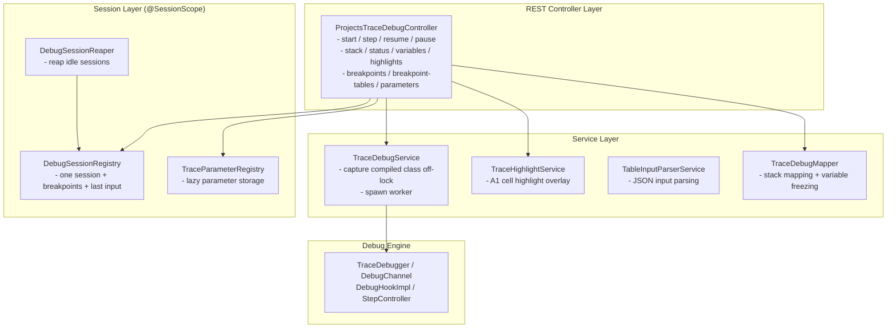
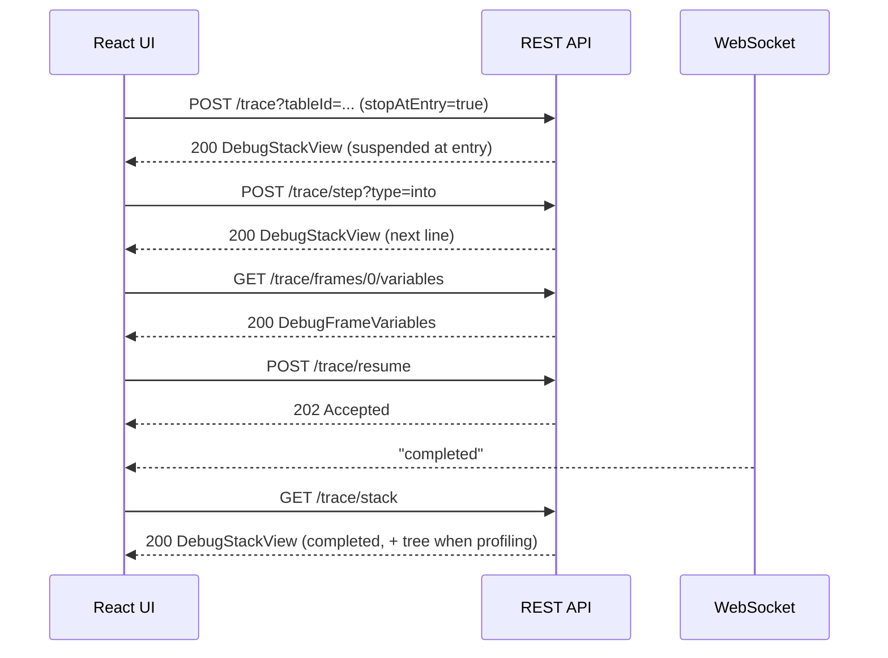

# Projects Trace API Documentation

**Version**: 6.2.1-SNAPSHOT
**Status**: BETA
**Base Path**: `/projects/{projectId}/trace`
**Last Updated**: 2026-07-02

> [!Note]
> This is the **interactive debugger** API. It replaces the previous tree-based Trace (the `/trace/nodes`
> and `/trace/export` endpoints are gone). See [Architecture Design](projects-trace-architecture.md) for
> how suspension and the live stack work.

---

## Table of Contents

1. [Overview](#overview)
2. [Session Lifecycle](#session-lifecycle)
3. [API Reference](#api-reference)
4. [Breakpoint Keys](#breakpoint-keys)
5. [Data Models](#data-models)
6. [WebSocket Notifications](#websocket-notifications)
7. [Workflows](#workflows)
8. [Error Handling](#error-handling)
9. [Examples](#examples)

---

## Overview

The Projects Trace API drives an **interactive debugger** for OpenL rules: start a session on a table,
then step into/over/out, set breakpoints, run to a breakpoint, inspect the live call stack, and freeze a
frame's variables — all against a real, suspended execution rather than a pre-built tree.

### Key features

- **Real suspended execution** — the rule runs on a dedicated worker thread that parks at breakpoints and
  step points; its JVM stack holds all live state. Resuming continues forward, never re-runs.
- **Live stack, not a full tree** — only the frames from the root call to the current point are retained,
  so memory is bounded by stack depth.
- **Stepping** — Step Into, Step Over, Step Out, Resume, and asynchronous Pause. A step that finishes a
  frame first suspends at that frame's **own exit** (its result is on the stack), then continues in the
  caller. An exception suspends at the throwing frame before it propagates.
- **Breakpoints** — on a table by URI or by **name** (stops on every same-named version), on a spreadsheet
  cell, on any fired decision-table rule, or on a specific rule. See [Breakpoint Keys](#breakpoint-keys).
- **Profiling (executed call tree)** — with `profiling=true` the session retains the structure of returned
  calls: which steps ran, what each step called, execution times (total and self), dispatcher choices, and
  references to re-used steps. Structure only — no values are retained. The response also carries a bounded
  `profile` overview (the slowest tables); pass `includeTree=false` to get only that when the whole tree
  would be too large.
- **Lazy variable freezing** — a frame's parameters/context/result are deep-cloned only when inspected,
  while suspended, and discarded when the frame returns. Large values load on demand.
- **One session per user** — starting a new session terminates the previous one. Idle suspended sessions
  are reaped automatically after 10 minutes.

### Use cases

1. **Rule debugging** — walk a calculation step by step to see why it produced a result.
2. **Decision table analysis** — see which conditions matched, which rule fired, and break when a rule fires.
3. **Spreadsheet inspection** — follow cell evaluation order and inspect already-computed cell values.
4. **Performance profiling** — find the slow table or step from the executed call tree's timings.
5. **Test case debugging** — debug a specific test case from a test suite.

### Components



---

## Session Lifecycle

A session moves through these statuses (also returned in every stack/status response):

| Status | Meaning | Accepts commands |
| --- | --- | --- |
| `pending` | Created; worker not started yet | — |
| `running` | Executing, not suspended | `pause` |
| `suspended` | Paused at a breakpoint or step point; stack is inspectable | `step`, `resume`, inspect |
| `completed` | Finished normally | terminal |
| `error` | Failed with an error | terminal |
| `terminated` | Cancelled before finishing | terminal |

The normal flow is `pending → running ⇄ suspended → completed`; `error` and `terminated` are the other
terminal states. Status transitions are pushed over WebSocket (see below). After `completed` the stack is
empty, but a profiling session still exposes the whole executed tree in `DebugStackView.tree` and a
bounded overview of it in `DebugStackView.profile`.

---

## API Reference

### 1. Start a debug session

**Endpoint**: `POST /projects/{projectId}/trace`

Starts a session and runs to the first suspension (or to completion when nothing suspends). Any previous
session for this user is terminated and the parameter registry is cleared. Active breakpoints (set earlier
via `PUT /breakpoints`) apply immediately.

**Path parameters**:
- `projectId` (string, required) — project identifier.

**Query parameters**:
- `tableId` (string, required) — table to debug.
- `testRanges` (string, optional) — test-case selection for a test table (e.g. `1-3,5`).
- `fromModule` (string, optional) — module name to run against the currently opened module.
- `stopAtEntry` (boolean, default `true`) — suspend at the entry of the first frame; when `false`, run to
  the first breakpoint.
- `profiling` (boolean, default `false`) — retain the executed call tree (structure and timings, no
  values). Uses more memory and runs slower.
- `includeTree` (boolean, default `true`) — embed the full executed `tree` in the response. Set to `false`
  to keep only the bounded `profile` overview when the whole tree would be too large.
- `profileTop` (integer, default `20`, min `1`) — how many hotspots (slowest tables) the `profile`
  overview returns.
- `view` (`full` \| `compact`, default `full`) — per-frame detail. `compact` keeps sub-steps only on the
  **active** frame, so stepping does not re-send every frame's `steps`; read another frame's steps with
  `GET /stack?view=full` or its variables endpoint.

**Request body** (optional, `application/json`): raw input for a regular method. Supports the structured
form (`{ "runtimeContext": {...}, "params": {...} }`), a raw named-parameter object, or a positional
array — parsed by `TableInputParserService`.

> [!Note]
> The session remembers the last input. A restart that sends **neither** a body **nor** `testRanges`
> (for example toggling `profiling`, or a replay) re-runs the trace with the remembered input.

**Response**: `200 OK` — a [`DebugStackView`](#debugstackview) at the first suspension (or terminal state).

**Errors**: `404 Not Found` (`table.message`) when the table or its method is not found.

---

### 2. Get session status

**Endpoint**: `GET /projects/{projectId}/trace/status`

Lightweight poll. **Response**: `200 OK` — [`DebugStatusView`](#debugstatusview).

**Errors**: `404 Not Found` (`trace.execution.task.message`) when there is no session.

---

### 3. Get the execution stack

**Endpoint**: `GET /projects/{projectId}/trace/stack`

**Query parameters**: `view` (`full` \| `compact`), `includeTree` (boolean), `profileTop` (integer) —
same response-shaping params as start (see [Start a debug session](#1-start-a-debug-session)).

**Response**: `200 OK` — [`DebugStackView`](#debugstackview), frames ordered root → current. Readable
while suspended or in a terminal state.

**Errors**: `404 Not Found` when there is no session; `409 Conflict`
(`trace.execution.not.suspended.message`) while the worker is still `running` (the worker mutates its
frames as it executes, so the stack is readable only once it has parked or finished).

---

### 4. Step

**Endpoint**: `POST /projects/{projectId}/trace/step`

Steps once and returns the new stack once the worker re-suspends (bounded wait, 30 s).

**Query parameters**:
- `type` (string, required) — one of `into`, `over`, `out`.
- `view` (`full` \| `compact`), `includeTree` (boolean), `profileTop` (integer) — same response-shaping
  params as start. `view=compact` is the useful one here: it drops the non-active frames' `steps` so a
  step returns only the frame that changed.

A step that finishes the current frame suspends at that frame's **own exit** first — the completed frame
stays on the stack with its result — and the next step continues in the caller.

**Response**: `200 OK` — [`DebugStackView`](#debugstackview).

**Errors**:
- `400 Bad Request` — `type` is not one of the enum values (malformed parameter).
- `404 Not Found` — no session.
- `409 Conflict` (`trace.execution.not.suspended.message`) — the session is not suspended.

---

### 5. Resume

**Endpoint**: `POST /projects/{projectId}/trace/resume`

Runs to the next breakpoint or to completion. **Response**: `202 Accepted` (no body); the outcome arrives
via WebSocket. Read `/stack` on the next `suspended`/terminal status.

**Errors**: `404 Not Found` (no session); `409 Conflict` (not suspended).

---

### 6. Pause

**Endpoint**: `POST /projects/{projectId}/trace/pause`

Requests suspension at the next safepoint. **Response**: `202 Accepted` (no body).

**Errors**: `404 Not Found` (no session).

---

### 7. Get frame variables

**Endpoint**: `GET /projects/{projectId}/trace/frames/{index}/variables`

Freezes (deep-clones) the frame at `index` while suspended and returns its parameters, context, result,
sub-steps with computed values, spreadsheet grid names, the decision-table outcome, and errors.

**Response**: `200 OK` — [`DebugFrameVariables`](#debugframevariables).

**Errors**: `404 Not Found` (no session, or `trace.frame.not.found.message`); `409 Conflict` (not
suspended).

---

### 8. Get frame highlights

**Endpoint**: `GET /projects/{projectId}/trace/frames/{index}/highlights`

Returns the execution highlight overlay for the frame's table, keyed by **A1 cell address**. The client
renders the table itself (through the shared Tables API raw view) and paints the overlay on top: the
current cell, a decision table's evaluated conditions (matched / not matched), and the fired rule's
result.

**Response**: `200 OK` — array of [`CellHighlight`](#cellhighlight). Empty at a frame's entry, before any
line executes.

**Errors**: `404 Not Found` (no session, or frame not found); `409 Conflict` (not suspended).

> [!Note]
> The former `GET /frames/{index}/table` endpoint (server-rendered HTML) was removed. Fetch the table
> content from `GET /projects/{projectId}/tables/{tableId}?raw=true` (the frame carries its `tableId`)
> and apply this overlay.

---

### 9. List breakpoints

**Endpoint**: `GET /projects/{projectId}/trace/breakpoints`

Returns the active breakpoint keys. Works without a running session (breakpoints are session-scoped and
persist across runs).

**Response**: `200 OK` — array of strings (see [Breakpoint Keys](#breakpoint-keys)).

---

### 10. Replace breakpoints

**Endpoint**: `PUT /projects/{projectId}/trace/breakpoints`

Replaces the whole breakpoint set. Effective on the next frame enter / current-line change. Works without
a running session, so breakpoints can be set before starting.

**Request body** ([`BreakpointsRequest`](#breakpointsrequest)):
```json
{ "uris": ["RiskAssessment", "file:/.../Rules.xlsx?...#R0C1", "file:/.../DT.xlsx?...#rule"] }
```

**Response**: `204 No Content`.

---

### 11. List breakpoint targets

**Endpoint**: `GET /projects/{projectId}/trace/breakpoint-tables`

Returns the rule tables a breakpoint can be set on, **deduplicated by name** (a name key stops on every
overloaded or dimensional version). With an active session, only tables **reachable from the traced
table** through the dependency graph are offered; without a session (or when the traced table is outside
the graph, e.g. a test table) every executable table is returned. Sorted by name.

**Query parameters**:
- `fields` (string, optional) — standard response projection, e.g. `fields=name` returns names only.

**Response**: `200 OK` — array of [`BreakpointTableView`](#breakpointtableview).

---

### 12. Get a lazy parameter value

**Endpoint**: `GET /projects/{projectId}/trace/parameters/{parameterId}`

Fetches the full value of a parameter that was returned lazily (`lazy: true`) in frame variables.

**Response**: `200 OK` — [`ParameterValue`](#parametervalue) with the value inlined.

**Errors**: `404 Not Found` (no session, or `trace.parameter.not.found.message`).

---

### 13. Watch cells across the run

Watch a factor across the whole run: retain the value of named cells on **every** execution of their
table, so a factor can be read across all coverages or iterations without dumping every frame. Watches
retain values only for the named cells — the one opt-in exception to the values-only-while-suspended rule.

**Set the watch set** — `PUT /projects/{projectId}/trace/watches`, body
[`WatchesRequest`](#watchesrequest). The set persists across runs and applies on the **next start**, since
a watch captures from the beginning of a run. `204 No Content`.

**Get the watch set** — `GET /projects/{projectId}/trace/watches` → `string[]`.

**Get the collected values** — `GET /projects/{projectId}/trace/watch` → [`WatchView`](#watchview). Complete
once the run has finished; carries the executions seen so far while it is still suspended. `409 Conflict`
while the worker is still `running`.

Typical flow: `PUT /watches` → `POST /` with `stopAtEntry=false` (run through, `includeTree=false` to keep
the response small) → `GET /watch`.

---

### 14. Terminate the session

**Endpoint**: `DELETE /projects/{projectId}/trace`

Terminates the worker and clears the session and parameter registry. Idempotent.

**Response**: `204 No Content`.

---

## Breakpoint Keys

All breakpoints ride one set of string keys (`PUT /breakpoints`). A key is matched at a **frame enter**
or at a **current-line change**:

| Key form | Matches | Example |
| --- | --- | --- |
| `<uri>` | Entry of the table with this source URI | `file:/.../Rules.xlsx?sheet=Main&range=B2:D8` |
| `<name>` | Entry of **any** table with this name (every overloaded or dimensional version) | `VehiclePremiumCalculation` |
| `<uri>#R{r}C{c}` | A spreadsheet cell of that table becoming the current line | `file:/...#R0C1` |
| `<uri>#rule` | **Any** rule of that decision table firing (all conditions matched) | `file:/...#rule` |
| `<uri>#{ruleName}` | A **specific** rule of that decision table firing | `file:/...#SeniorDriver` |

Rule-fired breakpoints suspend **before the rule's action runs**, with the evaluated conditions already
captured — the decision panel shows which rule fired and which conditions matched.

---

## Data Models

### DebugStackView

```typescript
interface DebugStackView {
  status: DebugStatus;          // pending | running | suspended | completed | error | terminated
  frames: DebugFrameView[];     // root (index 0) → current; empty after completion
  error?: DebugError;           // present only when status = error
  tree?: CallNodeView;          // whole executed tree after completion (profiling; omitted if includeTree=false)
  profile?: ProfileSummaryView; // bounded hotspots overview after completion (profiling only)
}
```

### ProfileSummaryView

A bounded overview of a finished profiled run — the slowest tables, aggregated across the whole run. It is
**constant-sized** regardless of run size (unlike `tree`, which grows with every invocation), so it is the
safe way to understand a large run. Fetch the full `tree` only to drill into a specific branch.

```typescript
interface ProfileSummaryView {
  hotspots: ProfileHotspotView[]; // slowest tables by own time, most expensive first, capped to profileTop
  distinctTables: number;         // distinct tables that ran (may exceed hotspots.length)
  nodeCount: number;              // total table invocations in the run (the size of the full tree)
  totalMillis: number;            // wall-clock time of the whole run, excluding parked time
  truncated: boolean;             // true when more distinct tables ran than were returned
}

interface ProfileHotspotView {
  uri: string;
  name: string;
  kind: FrameKind;
  selfMillis: number;   // own time across all invocations (excludes called tables); sums to wall-clock
  totalMillis: number;  // inclusive time across all invocations (own work + called tables)
  count: number;        // number of invocations folded into this hotspot
}
```

### DebugFrameView

```typescript
interface DebugFrameView {
  index: number;                // position in the stack, 0 = root
  depth: number;                // frame depth, 1 = root
  uri: string;                  // table source URI (breakpoint + raw-table key)
  tableId: string;              // table id for the shared Tables API (?raw=true)
  name: string;                 // table display name (breakpoint-by-name key)
  kind: FrameKind;              // decisionTable | spreadsheet | method | cmatch | tbasic | tbasicMethod
  location?: DebugLocationView; // current line, or absent at frame entry
  active: boolean;              // true for the top (current) frame
  completed: boolean;           // frame has returned (its result is inspectable)
  error: boolean;               // frame failed
  steps?: StepValueView[];      // sub-steps with status (executed sub-calls in profiling); absent on non-active frames when view=compact
  durationMillis?: number;      // total execution time of a returned frame, excluding parked time
  selfMillis?: number;          // own time of a returned frame (total minus called tables)
  dispatch?: DispatchInfo;      // set when this table was chosen from overloaded versions
}
```

### DebugLocationView

```typescript
interface DebugLocationView {
  kind: LocationKind;  // cell | dtrule | operation
  row?: number;     // cell row index
  column?: number;  // cell column index
  ref?: string;     // short cell reference, e.g. "R2C3" (breakpoint sub-step key)
  label?: string;   // human-readable, e.g. "$Formula$HouseTotal" or a fired rule name
}
```

### DebugFrameVariables

```typescript
interface DebugFrameVariables {
  parameters: ParameterValue[];   // input parameters
  context?: ParameterValue;       // runtime context, if any
  result?: ParameterValue;        // return value, if the frame has completed
  steps: StepValueView[];         // sub-steps with computed values (spreadsheets: every cell with status)
  gridColumns?: string[];         // spreadsheet column names, for a grid layout (spreadsheet frames only)
  gridRows?: string[];            // spreadsheet row names (spreadsheet frames only)
  decision?: DecisionView;        // which rule fired and which conditions matched (decision tables only)
  ruleNames?: string[];           // every rule of the decision table, in rule order (decision tables only)
  errors: MessageDescription[];   // errors, if the frame failed
}
```

### StepValueView

```typescript
interface StepValueView {
  ref: string;                 // sub-step reference, e.g. "R2C3" (breakpoint key suffix uri#ref)
  label?: string;              // human-readable step name, e.g. "$Formula$HouseTotal"
  status: StepStatus;          // executed | current | pending
  value?: ParameterValue;      // frozen computed value for an executed step (variables endpoint only)
  children?: CallNodeView[];   // what this step called or referenced, in execution order (profiling)
  durationMillis?: number;     // total time of an executed step: its own work plus the tables it called
  selfMillis?: number;         // own time of an executed step (total minus called tables)
}
```

Only **executable** cells are steps: a spreadsheet cell with a formula that is actually evaluated. Value
cells, constants, and section-title dividers never execute and are not listed.

### CallNodeView

```typescript
interface CallNodeView {
  uri: string;                 // source URI of the table
  name: string;                // display name; for a stepRef node, the referenced step's label
  kind: FrameKind;             // table kind, or "stepRef" for a step reference
  durationMillis: number;      // total execution time (this table and everything it called)
  selfMillis: number;          // own time (total minus the tables it called)
  steps: StepValueView[];      // the executed sub-steps, each possibly with its own sub-calls
  dispatch?: DispatchInfo;     // set when the table was chosen from overloaded versions
  refStep?: string;            // for a stepRef node, the ref of the original step it points at
}
```

A node of the executed call tree (profiling): a returned table invocation, kept as structure only — no
values. A **`stepRef`** node is not a table: a formula computed or re-read another step of the same
frame; the reference points at the original step (`refStep`) and carries no time or children of its own,
so a shared step is never duplicated in the tree.

### DispatchInfo

```typescript
interface DispatchInfo {
  candidates: { label: string; chosen: boolean }[];  // the overloaded versions; the chosen one flagged
}
```

Present on a frame or call node that was selected by a dispatcher — a table overloaded by dimension
properties (e.g. effective dates). The dispatcher itself is transparent: the chosen version appears in
place, badged with the candidates.

### CellHighlight

```typescript
interface CellHighlight {
  cell: string;            // A1 address in the table's sheet, e.g. "C5"
  state: HighlightState;   // current | result | conditionTrue | conditionFalse
}
```

### DecisionView

```typescript
interface DecisionView {
  firedRules: string[];                 // the rule(s) that fired
  conditions: {
    condition: string;                  // condition name, e.g. "C1"
    rule: string;                       // rule name
    matched: boolean;                   // condition matched for that rule
  }[];
}
```

### DebugError

```typescript
interface DebugError {
  summary: string;      // cleaned, user-readable message
  table?: string;       // the failing table's name
  location?: string;    // the failing step, e.g. "$Formula$Total"
  type?: string;        // exception type, e.g. "IllegalStateException"
  detail?: string;      // technical stack trace, capped
}
```

### DebugStatusView

```typescript
interface DebugStatusView {
  status: DebugStatus;
}
```

### BreakpointsRequest

```typescript
interface BreakpointsRequest {
  uris?: string[];   // breakpoint keys (see Breakpoint Keys); null/omitted clears all
}
```

### WatchesRequest

```typescript
interface WatchesRequest {
  cells?: string[];  // cell names ($... step label) or refs (R2C3) to watch; null/omitted clears all
}
```

### WatchView

The collected values of the watched cells — a factor read across the whole run. One series per cell; the
UI can pivot series that share a table into a matrix (rows = executions, columns = cells), while an agent
reads a single series as a value sequence to spot the outlier.

```typescript
interface WatchView {
  series: WatchSeriesView[];
  truncated: boolean;          // the capture cap was reached, so some late executions are missing
}

interface WatchSeriesView {
  name: string;                // the watched cell name (its $... step label)
  table: string;               // display name of the owning table
  tableUri: string;            // owning table URI (replay target)
  points: WatchPointView[];    // one per execution of the table, in execution order
}

interface WatchPointView {
  instance: number;            // 0-based execution number of the owning table (its 1st, 2nd, … invocation)
  label: string;               // human axis label, e.g. "CoveragePremium #3"
  path: string[];              // call path root → owning frame, as table names
  ref: string;                 // breakpoint key uri#cellRef to reach this cell (replay + breakpoint)
  value: number | string | boolean | null;  // scalar, or a short summary of a non-scalar
}
```

### BreakpointTableView

```typescript
interface BreakpointTableView {
  name: string;      // table name — the breakpoint key (stops on every same-named version)
  kind: FrameKind;   // table kind, for an icon
}
```

### ParameterValue

```typescript
interface ParameterValue {
  name: string;
  description: string;     // type description
  lazy?: boolean;          // true → value omitted, fetch via /parameters/{parameterId}
  parameterId?: number;    // id for lazy fetch
  value?: any;             // JSON value (absent when lazy)
  schema?: object;         // JSON Schema for the type
}
```

### MessageDescription

```typescript
interface MessageDescription {
  severity: "error" | "WARNING" | "INFO";
  summary: string;
  detail?: string;
  sourceLocation?: string;
}
```

---

## WebSocket Notifications

Status transitions are pushed to the per-user destination:

```
/user/topic/projects/{projectId}/tables/{tableId}/trace/status
```

The payload is the **status code** as a plain string (for example `suspended`). On `suspended` the client
reads the new stack from `GET /stack`; on `completed`/`error`/`terminated` it shows the terminal state
(on `error`, `GET /stack` still returns the structured `error`). Synchronous endpoints (`POST /` and
`POST /step`) also return the stack directly, so the WebSocket is mainly needed for the asynchronous
`resume`/`pause` outcomes.



---

## Workflows

### Workflow 1: Step through a rule

```
1. (optional) Set breakpoints up front
   PUT /projects/MyProject/trace/breakpoints   { "uris": ["<tableUri>#R0C1"] }

2. Start, suspended at entry
   POST /projects/MyProject/trace?tableId=DT_RiskAssessment
   → 200 DebugStackView { status: suspended, frames: [ { index:0, name:"DT_RiskAssessment", ... } ] }

3. Step into the calculation
   POST /projects/MyProject/trace/step?type=into
   → 200 DebugStackView (current line advanced)

4. Inspect the current frame
   GET /projects/MyProject/trace/frames/0/variables
   GET /projects/MyProject/trace/frames/0/highlights      (overlay for the client-rendered table)
   GET /projects/MyProject/tables/{tableId}?raw=true      (the table content itself)

5. Run to the next breakpoint / completion
   POST /projects/MyProject/trace/resume   → 202
   (WebSocket: suspended or completed) → GET /stack

6. Finish
   DELETE /projects/MyProject/trace   → 204
```

### Workflow 2: Break when a decision-table rule fires

```
1. PUT /projects/MyProject/trace/breakpoints   { "uris": ["<dtUri>#rule"] }
   (or "<dtUri>#SeniorDriver" for one specific rule)
2. POST /projects/MyProject/trace?tableId=...&stopAtEntry=false
   → suspends the moment a rule's conditions all match, before its action runs
3. GET /frames/{i}/variables → decision: { firedRules:["SeniorDriver"], conditions:[...] }
```

### Workflow 3: Profile a calculation (executed call tree)

```
1. POST /projects/MyProject/trace?tableId=...&stopAtEntry=false&profiling=true&includeTree=false
   → runs to completion; the response carries profile: ProfileSummaryView (bounded hotspots),
     not the full tree — safe on a large run
2. Read profile.hotspots[]: the slowest tables by selfMillis, with count and totalMillis.
   (Omit includeTree=false, or GET /stack, to also get the full tree: CallNodeView.)
3. To inspect a slow branch live: restart with a breakpoint on that table and step from there
   (the UI's "replay" does exactly this — the remembered input is reused automatically).
```

### Workflow 4: Debug a single test case

```
1. POST /projects/MyProject/trace?tableId=TEST_RiskAssessment&testRanges=2
   → 200 DebugStackView (suspended at the entry of test case 2)
2. Step / inspect as above. Cases run sequentially; the worker stops at each case entry.
```

### Workflow 5: Watch a factor across coverages

```
1. PUT /projects/MyProject/trace/watches   { "cells": ["$VehiclePriceFactor"] }
2. POST /projects/MyProject/trace?tableId=...&stopAtEntry=false&includeTree=false
   → runs to completion, capturing the cell on every execution of its table
3. GET /projects/MyProject/trace/watch
   → series[0].points: the factor's value per coverage — the outlier (e.g. 83.372 among 1.0) stands out
4. To inspect an outlier live: replay to its table (points[i].ref / series.tableUri) with a breakpoint.
```

### Workflow 5: Inspect an already-executed spreadsheet step

```
1. Suspend inside a Spreadsheet frame (step until status=suspended on a cell).
2. GET /projects/MyProject/trace/frames/{i}/variables
   → steps: [ { ref:"R0C1", label:"$Value$Base", status:"executed", value:{...}, durationMillis: 1.2 },
              { ref:"R1C1", label:"$Formula$Total", status:"current" }, ... ]
   Inspect the computed value of an executed cell while a later cell is current.
```

---

## Error Handling

Errors use the standard problem body:

```json
{ "status": 404, "message": "trace.execution.task.message", "path": "/projects/MyProject/trace/stack" }
```

| Scenario | Status | Message code |
| --- | --- | --- |
| Table or method not found (start) | `404` | `table.message` |
| No active session | `404` | `trace.execution.task.message` |
| Frame index out of range | `404` | `trace.frame.not.found.message` |
| Lazy parameter id not found | `404` | `trace.parameter.not.found.message` |
| Command or inspection requires a suspended session | `409` | `trace.execution.not.suspended.message` |
| Stack read while still running | `409` | `trace.execution.not.suspended.message` |
| Malformed step `type` (not `into`/`over`/`out`) | `400` | converter message |

---

## Examples

### Start, step, inspect, resume

```bash
# Start (suspended at entry), capture the stack
curl -X POST "http://localhost:8080/projects/MyProject/trace?tableId=DT_RiskAssessment" \
  -H "Content-Type: application/json" \
  -d '{ "params": { "age": 35, "income": 75000, "creditScore": 720 },
        "runtimeContext": { "lob": "Personal", "usState": "NY" } }'

# Step into
curl -X POST "http://localhost:8080/projects/MyProject/trace/step?type=into"

# Inspect the top frame's variables
curl "http://localhost:8080/projects/MyProject/trace/frames/0/variables"

# Highlight overlay for the client-rendered table
curl "http://localhost:8080/projects/MyProject/trace/frames/0/highlights"
# → [ { "cell": "C5", "state": "current" } ]

# Run to completion
curl -X POST "http://localhost:8080/projects/MyProject/trace/resume"   # 202

# Terminate
curl -X DELETE "http://localhost:8080/projects/MyProject/trace"        # 204
```

### Set a breakpoint before running

```bash
# By table name — stops on every overloaded/dimensional version of the table
curl -X PUT "http://localhost:8080/projects/MyProject/trace/breakpoints" \
  -H "Content-Type: application/json" \
  -d '{ "uris": ["VehiclePremiumCalculation"] }'

curl -X POST "http://localhost:8080/projects/MyProject/trace?tableId=DT_RiskAssessment&stopAtEntry=false"
# Runs to the breakpoint and returns the stack suspended there.
```

### Discover breakpoint targets

```bash
# Only tables reachable from the traced table; names deduplicated
curl "http://localhost:8080/projects/MyProject/trace/breakpoint-tables?fields=name"
# → [ { "name": "SetContext" }, { "name": "VehiclePremiumCalculation" }, ... ]
```

---

## Related APIs

- **[Architecture Design](projects-trace-architecture.md)** — how suspension, the live stack, and freezing work.
- **Tables API** — the raw table view (`?raw=true&styles=true`) the client renders the traced table from.
- **Test API** — test execution and results.

---

## Changelog

### Version 6.2.1-SNAPSHOT (BETA)

- **Profiling** (`profiling=true`): the executed call tree (`DebugStackView.tree`, `StepValueView.children`)
  with per-frame and per-step timings (`durationMillis`/`selfMillis`) — structure only, no values.
- **Bounded profile overview** (`DebugStackView.profile`): the slowest tables aggregated across the run,
  constant-sized regardless of run size. `includeTree=false` returns only this (not the full tree);
  `profileTop` sets how many hotspots.
- **Compact stack** (`view=compact` on start/step/stack): keeps sub-steps only on the active frame, so a
  step returns the frame that changed instead of re-sending every frame's `steps`.
- **Watch** (`PUT /watches`, `GET /watch`): retain a named cell's value on every execution of its table,
  so a factor can be read across all coverages or iterations without dumping every frame. The one opt-in
  exception to structure-only profiling; bounded by the number of watched cells.
- **Step references**: a formula that computes or re-reads another step records a `stepRef` node pointing
  at the original step (`CallNodeView.refStep`) — shared steps are never duplicated; calls are attributed
  to the step whose formula makes them.
- **Dispatcher badge**: a table chosen from overloaded (dimension-property) versions carries
  `DispatchInfo` in place; no separate dispatcher frame.
- **Breakpoints**: by table **name** (any same-named version), on **any fired rule** (`uri#rule`), on a
  **specific rule** (`uri#{ruleName}`); `GET /breakpoint-tables` lists reachable targets deduped by name.
- **Client-rendered traced table**: removed `GET /frames/{index}/table` (server HTML); added
  `GET /frames/{index}/highlights` (A1-keyed overlay) on top of the shared raw Tables API.
- **Decision explanation**: `DebugFrameVariables.decision` — which rule fired and which conditions matched.
- **Structured errors**: `DebugStackView.error` (`DebugError`) replaces the flat `errorMessage`.
- **Step exit and exceptions**: a step finishing a frame suspends at the frame's own exit with its result;
  an exception suspends at the throwing frame before propagating.
- **Steps are executable cells only**; the input is remembered for replay/profiling restarts; idle
  sessions are reaped after 10 minutes; the legacy tree-trace implementation was removed.

### Version 6.0.0-SNAPSHOT (BETA)

- Reworked Trace into an **interactive debugger**: suspended execution on a worker thread, live call
  stack, step into/over/out, resume, pause.
- Breakpoints on tables (`uri`) and spreadsheet sub-steps (`uri#ref`), persisted per session.
- Lazy per-frame variable freezing; executed-step values for spreadsheets.
- **Removed** the tree-based endpoints (`/trace/nodes`, `/trace/nodes/{id}`, `/trace/nodes/{id}/table`,
  `/trace/export`) and lazy-tree retention.
