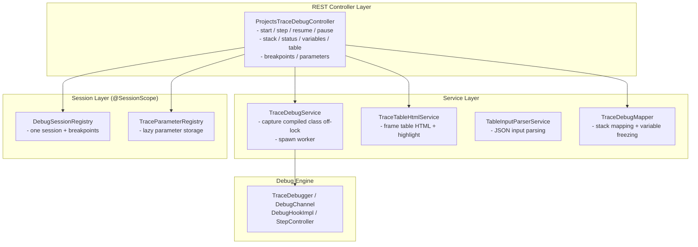
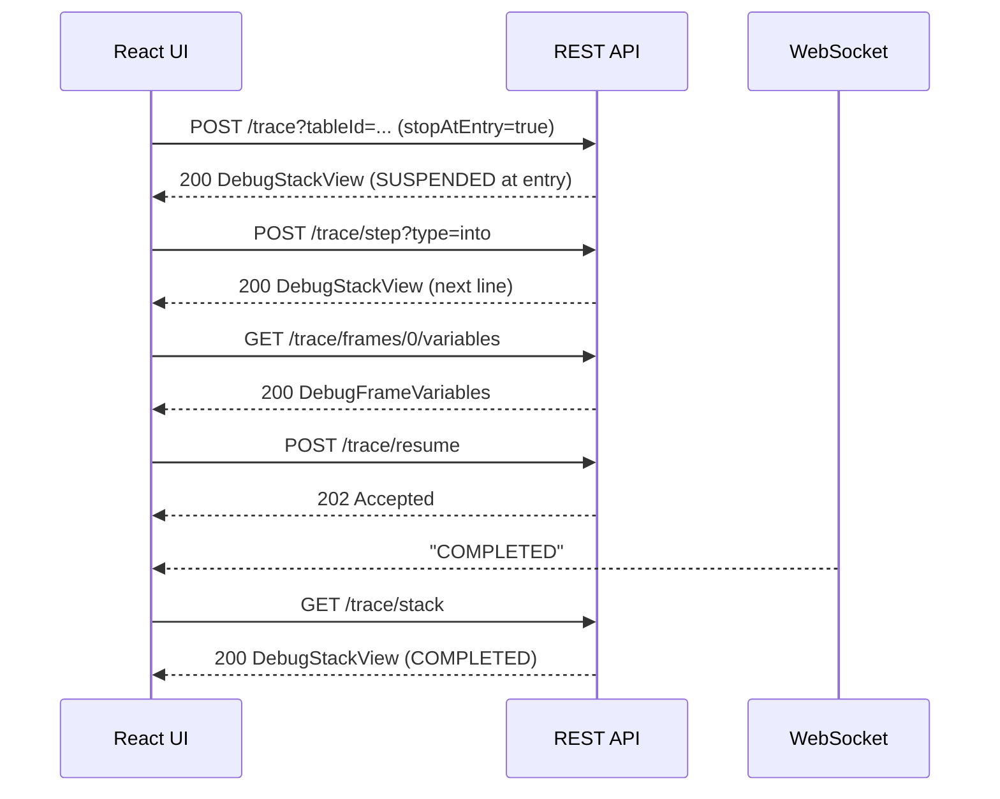

# Projects Trace API Documentation

**Version**: 6.0.0-SNAPSHOT
**Status**: BETA
**Base Path**: `/projects/{projectId}/trace`
**Last Updated**: 2026-06-28

> [!Note]
> This is the **interactive debugger** API. It replaces the previous tree-based Trace (the `/trace/nodes`
> and `/trace/export` endpoints are gone). See [Architecture Design](projects-trace-architecture.md) for
> how suspension and the live stack work.

---

## Table of Contents

1. [Overview](#overview)
2. [Session Lifecycle](#session-lifecycle)
3. [API Reference](#api-reference)
4. [Data Models](#data-models)
5. [WebSocket Notifications](#websocket-notifications)
6. [Workflows](#workflows)
7. [Error Handling](#error-handling)
8. [Examples](#examples)

---

## Overview

The Projects Trace API drives an **interactive debugger** for OpenL rules: start a session on a table,
then step into/over/out, set breakpoints, run to a breakpoint, inspect the live call stack, and freeze a
frame's variables — all against a real, suspended execution rather than a pre-built tree.

### Key features

- **Real suspended execution** — the rule runs on a dedicated worker thread that parks at breakpoints and
  step points; its JVM stack holds all live state. Resuming continues forward, never re-runs.
- **Live stack, not a full tree** — only the frames from the root call to the current point are retained,
  so memory is bounded by stack depth.
- **Stepping** — Step Into, Step Over, Step Out, Resume, and asynchronous Pause.
- **Breakpoints** — on a table (suspend on entry) or on a sub-step (a spreadsheet cell).
- **Lazy variable freezing** — a frame's parameters/context/result are deep-cloned only when inspected,
  while suspended, and discarded when the frame returns. Large values load on demand.
- **One session per user** — starting a new session terminates the previous one.

### Use cases

1. **Rule debugging** — walk a calculation step by step to see why it produced a result.
2. **Decision table analysis** — see which conditions matched (green) or not (red) and which rule fired.
3. **Spreadsheet inspection** — follow cell evaluation order and inspect already-computed cell values.
4. **Test case debugging** — debug a specific test case from a test suite.

### Components



---

## Session Lifecycle

A session moves through these statuses (also returned in every stack/status response):

| Status | Meaning | Accepts commands |
| --- | --- | --- |
| `PENDING` | Created; worker not started yet | — |
| `RUNNING` | Executing, not suspended | `pause` |
| `SUSPENDED` | Paused at a breakpoint or step point; stack is inspectable | `step`, `resume`, inspect |
| `COMPLETED` | Finished normally | terminal |
| `ERROR` | Failed with an error | terminal |
| `TERMINATED` | Cancelled before finishing | terminal |

The normal flow is `PENDING → RUNNING ⇄ SUSPENDED → COMPLETED`; `ERROR` and `TERMINATED` are the other
terminal states. Status transitions are pushed over WebSocket (see below).

---

## API Reference

### 1. Start a debug session

**Endpoint**: `POST /projects/{projectId}/trace`

Starts a session and runs to the first suspension. Any previous session for this user is terminated and
the parameter registry is cleared. Active breakpoints (set earlier via `PUT /breakpoints`) apply
immediately.

**Path parameters**:
- `projectId` (string, required) — project identifier.

**Query parameters**:
- `tableId` (string, required) — table to debug.
- `testRanges` (string, optional) — test-case selection for a test table (e.g. `1-3,5`).
- `fromModule` (string, optional) — module name to run against the currently opened module.
- `stopAtEntry` (boolean, default `true`) — suspend at the entry of the first frame; when `false`, run to
  the first breakpoint.

**Request body** (optional, `application/json`): raw input for a regular method. Supports the structured
form (`{ "runtimeContext": {...}, "params": {...} }`), a raw named-parameter object, or a positional
array — parsed by `TableInputParserService`.

**Response**: `200 OK` — a [`DebugStackView`](#debugstackview) at the first suspension.

**Errors**: `404 Not Found` (`table.message`) when the table or its method is not found.

---

### 2. Get session status

**Endpoint**: `GET /projects/{projectId}/trace/status`

Lightweight poll. **Response**: `200 OK` — [`DebugStatusView`](#debugstatusview).

**Errors**: `404 Not Found` (`trace.execution.task.message`) when there is no session.

---

### 3. Get the execution stack

**Endpoint**: `GET /projects/{projectId}/trace/stack`

**Response**: `200 OK` — [`DebugStackView`](#debugstackview), frames ordered root → current.

**Errors**: `404 Not Found` when there is no session.

---

### 4. Step

**Endpoint**: `POST /projects/{projectId}/trace/step`

Steps once and returns the new stack once the worker re-suspends (bounded wait, 30 s).

**Query parameters**:
- `type` (string, required) — one of `into`, `over`, `out`.

**Response**: `200 OK` — [`DebugStackView`](#debugstackview).

**Errors**:
- `400 Bad Request` (`trace.debug.invalid-step.message`) — unknown `type`.
- `404 Not Found` — no session.
- `409 Conflict` (`trace.execution.not.suspended.message`) — the session is not suspended.

---

### 5. Resume

**Endpoint**: `POST /projects/{projectId}/trace/resume`

Runs to the next breakpoint or to completion. **Response**: `202 Accepted` (no body); the outcome arrives
via WebSocket. Read `/stack` on the next `SUSPENDED`/terminal status.

**Errors**: `404 Not Found` (no session); `409 Conflict` (not suspended).

---

### 6. Pause

**Endpoint**: `POST /projects/{projectId}/trace/pause`

Requests suspension at the next safepoint. **Response**: `202 Accepted` (no body).

**Errors**: `404 Not Found` (no session).

---

### 7. Get frame variables

**Endpoint**: `GET /projects/{projectId}/trace/frames/{index}/variables`

Freezes (deep-clones) the frame at `index` while suspended and returns its parameters, context, result,
executed sub-steps, and errors.

**Response**: `200 OK` — [`DebugFrameVariables`](#debugframevariables).

**Errors**: `404 Not Found` (no session, or `trace.frame.not.found.message`); `409 Conflict` (not
suspended).

---

### 8. Get frame table HTML

**Endpoint**: `GET /projects/{projectId}/trace/frames/{index}/table`

Renders the frame's table as an HTML fragment with the current line highlighted: the active spreadsheet
cell (amber), or a decision table's evaluated conditions (green matched / red unmatched) and the fired
rule's result (blue).

**Query parameters**:
- `showFormulas` (boolean, default `false`) — show cell formulas instead of values.

**Response**: `200 OK`, `Content-Type: text/html`.

**Errors**: `404 Not Found` (no session, or frame not found).

---

### 9. List breakpoints

**Endpoint**: `GET /projects/{projectId}/trace/breakpoints`

Returns the active breakpoint keys. Works without a running session (breakpoints are session-scoped and
persist across runs).

**Response**: `200 OK` — array of strings. Each key is either a table `uri` or a sub-step `uri#ref`.

---

### 10. Replace breakpoints

**Endpoint**: `PUT /projects/{projectId}/trace/breakpoints`

Replaces the whole breakpoint set. Effective on the next frame enter / current-line change. Works without
a running session, so breakpoints can be set before starting.

**Request body** ([`BreakpointsRequest`](#breakpointsrequest)):
```json
{ "uris": ["file:/.../Rules.xlsx?...sheet=Main&cell=B2", "file:/.../Rules.xlsx?...#R0C1"] }
```

**Response**: `204 No Content`.

---

### 11. Get a lazy parameter value

**Endpoint**: `GET /projects/{projectId}/trace/parameters/{parameterId}`

Fetches the full value of a parameter that was returned lazily (`lazy: true`) in frame variables.

**Response**: `200 OK` — [`ParameterValue`](#parametervalue) with the value inlined.

**Errors**: `404 Not Found` (no session, or `trace.parameter.not.found.message`).

---

### 12. Terminate the session

**Endpoint**: `DELETE /projects/{projectId}/trace`

Terminates the worker and clears the session and parameter registry. Idempotent.

**Response**: `204 No Content`.

---

## Data Models

### DebugStackView

```typescript
interface DebugStackView {
  status: DebugStatus;          // PENDING | RUNNING | SUSPENDED | COMPLETED | ERROR | TERMINATED
  frames: DebugFrameView[];     // root (index 0) → current
  errorMessage?: string;        // present only when status = ERROR
}
```

### DebugFrameView

```typescript
interface DebugFrameView {
  index: number;                // position in the stack, 0 = root
  depth: number;                // frame depth, 1 = root
  uri: string;                  // table source URI (breakpoint + table-render key)
  name: string;                 // table display name
  kind: FrameKind;              // decisionTable | spreadsheet | method | cmatch | tbasic | tbasicMethod
  location?: DebugLocationView; // current line, or absent at frame entry
  active: boolean;              // true for the top (current) frame
  completed: boolean;           // frame has returned
  error: boolean;               // frame failed
}
```

### DebugLocationView

```typescript
interface DebugLocationView {
  kind: string;     // cell | condition | dtrule | operation
  row?: number;     // cell row index
  column?: number;  // cell column index
  ref?: string;     // short cell reference, e.g. "R2C3" (breakpoint sub-step key)
  label?: string;   // human-readable, e.g. "$Formula$HouseTotal" or a fired rule name
}
```

### DebugFrameVariables

```typescript
interface DebugFrameVariables {
  parameters: ParameterValue[];   // input parameters
  context?: ParameterValue;       // runtime context, if any
  result?: ParameterValue;        // return value, if the frame has completed
  steps: StepValueView[];         // sub-steps with computed values (spreadsheets)
  errors: MessageDescription[];   // errors, if the frame failed
}
```

### StepValueView

```typescript
interface StepValueView {
  ref: string;                 // sub-step reference, e.g. "R2C3" (breakpoint key suffix uri#ref)
  label?: string;              // human-readable step name, e.g. "$Formula$HouseTotal"
  status: string;              // executed | current | pending
  value?: ParameterValue;      // frozen computed value for an executed step
}
```

### DebugStatusView

```typescript
interface DebugStatusView {
  status: DebugStatus;
}
```

### BreakpointsRequest

```typescript
interface BreakpointsRequest {
  uris?: string[];   // table uri, or sub-step uri#ref; null/omitted clears all
}
```

### ParameterValue

```typescript
interface ParameterValue {
  name: string;
  description: string;     // type description
  lazy?: boolean;          // true → value omitted, fetch via /parameters/{parameterId}
  parameterId?: number;    // id for lazy fetch
  value?: any;             // JSON value (absent when lazy)
  schema?: object;         // JSON Schema for the type
}
```

### MessageDescription

```typescript
interface MessageDescription {
  severity: "ERROR" | "WARNING" | "INFO";
  summary: string;
  detail?: string;
  sourceLocation?: string;
}
```

---

## WebSocket Notifications

Status transitions are pushed to the per-user destination:

```
/user/topic/projects/{projectId}/tables/{tableId}/trace/status
```

The payload is the **status name** as a plain string (for example `SUSPENDED`). On `SUSPENDED` the client
reads the new stack from `GET /stack`; on `COMPLETED`/`ERROR`/`TERMINATED` it shows the terminal state.
Synchronous endpoints (`POST /` and `POST /step`) also return the stack directly, so the WebSocket is
mainly needed for the asynchronous `resume`/`pause` outcomes.



---

## Workflows

### Workflow 1: Step through a rule

```
1. (optional) Set breakpoints up front
   PUT /projects/MyProject/trace/breakpoints   { "uris": ["<tableUri>#R0C1"] }

2. Start, suspended at entry
   POST /projects/MyProject/trace?tableId=DT_RiskAssessment
   → 200 DebugStackView { status: SUSPENDED, frames: [ { index:0, name:"DT_RiskAssessment", ... } ] }

3. Step into the calculation
   POST /projects/MyProject/trace/step?type=into
   → 200 DebugStackView (current line advanced)

4. Inspect the current frame
   GET /projects/MyProject/trace/frames/0/variables
   GET /projects/MyProject/trace/frames/0/table        (HTML with the current line highlighted)

5. Run to the next breakpoint / completion
   POST /projects/MyProject/trace/resume   → 202
   (WebSocket: SUSPENDED or COMPLETED) → GET /stack

6. Finish
   DELETE /projects/MyProject/trace   → 204
```

### Workflow 2: Debug a single test case

```
1. POST /projects/MyProject/trace?tableId=TEST_RiskAssessment&testRanges=2
   → 200 DebugStackView (suspended at the entry of test case 2)
2. Step / inspect as above. Cases run sequentially; the worker stops at each case entry.
```

### Workflow 3: Inspect an already-executed spreadsheet step

```
1. Suspend inside a Spreadsheet frame (step until status=SUSPENDED on a cell).
2. GET /projects/MyProject/trace/frames/{i}/variables
   → steps: [ { ref:"R0C1", label:"$Value$Base", status:"executed", value:{...} },
              { ref:"R1C1", label:"$Formula$Total", status:"current" }, ... ]
   Inspect the computed value of an executed cell while a later cell is current.
```

---

## Error Handling

Errors use the standard problem body:

```json
{ "status": 404, "message": "trace.execution.task.message", "path": "/projects/MyProject/trace/stack" }
```

| Scenario | Status | Message code |
| --- | --- | --- |
| Table or method not found (start) | `404` | `table.message` |
| No active session | `404` | `trace.execution.task.message` |
| Frame index out of range | `404` | `trace.frame.not.found.message` |
| Lazy parameter id not found | `404` | `trace.parameter.not.found.message` |
| Command requires a suspended session | `409` | `trace.execution.not.suspended.message` |
| Unknown step `type` | `400` | `trace.debug.invalid-step.message` |

---

## Examples

### Start, step, inspect, resume

```bash
# Start (suspended at entry), capture the stack
curl -X POST "http://localhost:8080/projects/MyProject/trace?tableId=DT_RiskAssessment" \
  -H "Content-Type: application/json" \
  -d '{ "params": { "age": 35, "income": 75000, "creditScore": 720 },
        "runtimeContext": { "lob": "Personal", "usState": "NY" } }'

# Step into
curl -X POST "http://localhost:8080/projects/MyProject/trace/step?type=into"

# Inspect the top frame's variables
curl "http://localhost:8080/projects/MyProject/trace/frames/0/variables"

# Frame table HTML with the current line highlighted
curl "http://localhost:8080/projects/MyProject/trace/frames/0/table"

# Run to completion
curl -X POST "http://localhost:8080/projects/MyProject/trace/resume"   # 202

# Terminate
curl -X DELETE "http://localhost:8080/projects/MyProject/trace"        # 204
```

### Set a breakpoint before running

```bash
curl -X PUT "http://localhost:8080/projects/MyProject/trace/breakpoints" \
  -H "Content-Type: application/json" \
  -d '{ "uris": ["file:/.../DT_RiskAssessment.xlsx?sheet=Rules#R0C1"] }'

curl -X POST "http://localhost:8080/projects/MyProject/trace?tableId=DT_RiskAssessment&stopAtEntry=false"
# Runs to the breakpoint and returns the stack suspended there.
```

---

## Related APIs

- **[Architecture Design](projects-trace-architecture.md)** — how suspension, the live stack, and freezing work.
- **Tables API** — table read/write operations.
- **Test API** — test execution and results.

---

## Changelog

### Version 6.0.0-SNAPSHOT (BETA)

- Reworked Trace into an **interactive debugger**: suspended execution on a worker thread, live call
  stack, step into/over/out, resume, pause.
- Breakpoints on tables (`uri`) and spreadsheet sub-steps (`uri#ref`), persisted per session.
- Lazy per-frame variable freezing; executed-step values for spreadsheets.
- Frame table HTML with current-line highlighting (spreadsheet cell; decision-table condition/result).
- **Removed** the tree-based endpoints (`/trace/nodes`, `/trace/nodes/{id}`, `/trace/nodes/{id}/table`,
  `/trace/export`) and lazy-tree retention.
