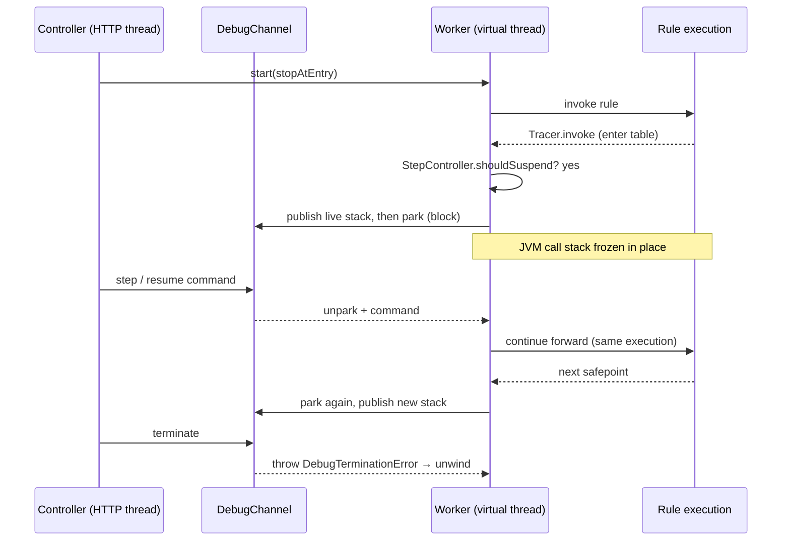
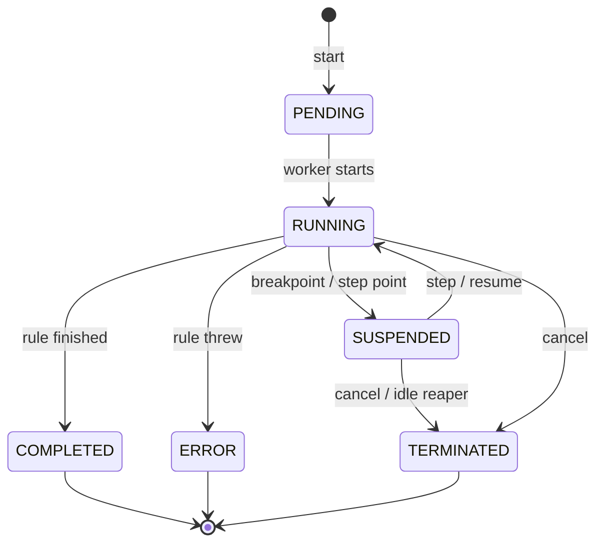
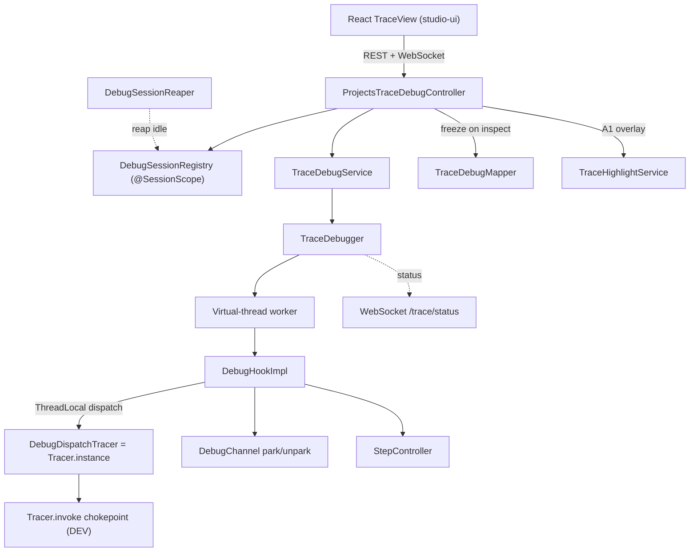
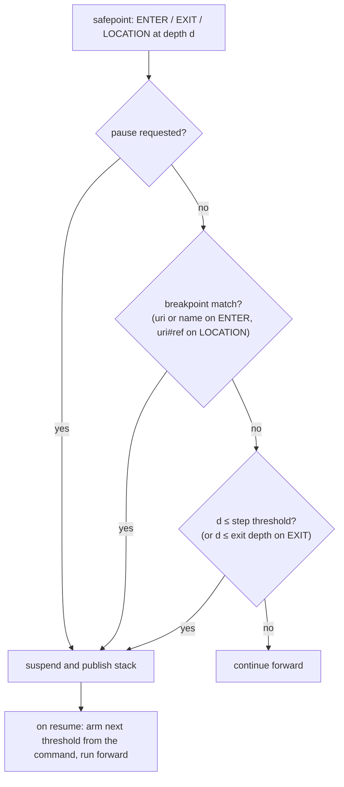

# Projects Trace API - Architecture Design

**Version**: 6.2.1-SNAPSHOT
**Status**: BETA
**Last Updated**: 2026-07-02

> [!Note]
> This describes the **interactive debugger** Trace. It replaces the previous tree-based Trace that ran a
> rule to completion, built a full execution tree, and used "lazy nodes" that re-executed the calculation.
> The legacy tree implementation has been removed.

---

## Table of Contents

1. [Why this exists](#why-this-exists)
2. [The core idea](#the-core-idea)
3. [How suspension works](#how-suspension-works)
4. [Session lifecycle](#session-lifecycle)
5. [Architecture layers](#architecture-layers)
6. [Frames and stepping](#frames-and-stepping)
7. [Nested steps and references](#nested-steps-and-references)
8. [Profiling: the executed call tree](#profiling-the-executed-call-tree)
9. [Breakpoints](#breakpoints)
10. [Freezing variables](#freezing-variables-live-stack-only)
11. [Watch: a value across every execution](#watch-a-value-across-every-execution)
12. [Avoiding the ProjectModel monitor](#avoiding-the-projectmodel-monitor)
13. [Highlighting in the traced table](#highlighting-in-the-traced-table)
14. [Memory: old vs new](#memory-old-vs-new)
15. [REST API](#rest-api)
16. [Concurrency and isolation](#concurrency-and-isolation)
17. [Limitations and follow-ups](#limitations-and-follow-ups)
18. [Key files](#key-files)

---

## Why this exists

The previous Trace ran a rule **to completion**, built a full in-memory tree of every executed step, and
**cloned the arguments and result of every node**. A single trace could reach tens of gigabytes. The
"lazy node" mitigation only *simulated* laziness: expanding a node **re-executed the whole calculation
from that point to the end**, kept just the first level, discarded the rest, and re-cloned arguments —
wasteful in both CPU and memory.

The rework replaces this with a **real, Java-debugger-style** model: step into/over/out, breakpoints on
tables and on individual steps, and **genuinely suspended execution** instead of re-execution. The UI
shows the **live execution stack** (root to the current point) rather than a full tree, so memory is
bounded by stack depth, not by the number of executed steps. An optional **profiling** mode retains the
structure and timings of returned calls — but never their values.

## The core idea

OpenL evaluation is a **synchronous recursive Java call chain**, and every rule-table invocation funnels
through one chokepoint:

```
ExecutableRulesMethod.invoke → Tracer.invoke(executor, target, params, env, source) → instance.doInvoke(...)
```

Therefore a **parked worker thread is a live continuation**: if the thread blocks inside a nested
invocation, its JVM call stack — with every frame and all local state — stays alive, frozen in place. We
can suspend and resume real execution **without rewriting the interpreter and without continuations** —
the parked thread *is* the continuation.

## How suspension works

A debug session runs the selected rule on a **dedicated virtual thread** (Java 21). A debug-aware hook
brackets each table-level invocation and decides whether to suspend (a breakpoint matched, or a step
condition was satisfied). To suspend, the worker **blocks on a lock/condition**; to resume, the
controller unblocks it and it continues **forward** from exactly where it stopped — never a re-run.



> [!Note]
> The control methods (`step`, `resume`, `pause`, `terminate`) run on the HTTP thread and return promptly.
> Only the worker thread ever blocks, and a parked virtual thread costs almost nothing.

## Session lifecycle



Status changes are pushed over WebSocket; `RUNNING ⇄ SUSPENDED` may repeat any number of times before a
terminal state. A terminal state accepts no further commands. A suspended session left idle (no API
access) is terminated by a reaper after 10 minutes, so an abandoned browser tab cannot pin a parked
worker forever.

## Architecture layers



- **Engine** (`org.openl.rules.webstudio.web.trace.debug`) — the debugger core: `TraceDebugger`
  (orchestrates the worker), `DebugChannel` (the park/unpark handshake), `DebugHookImpl` (maintains the
  live frame stack and suspends), `StepController` (pure stepping logic), `DebugFrame`, `CallNode` (the
  executed tree in profiling mode), the `SourceClassifier` seam (`DefaultSourceClassifier`),
  `ConditionCheck`, `DebugTerminationError`.
- **Dispatch** — `DebugDispatchTracer` is the installed `Tracer.instance`. A `ThreadLocal<DebugHook>`
  routes the worker thread's invocations to the hook; every other thread is a plain passthrough with no
  tracing overhead. The DEV `Tracer` class is untouched. The legacy tree-building tracer and its node
  classes were removed — this dispatcher is the only tracer.
- **Service / session** (`org.openl.studio.projects.service.trace`) — `TraceDebugService` builds the test
  suite and spawns the worker; `DebugSession` holds one running session (plus a per-session lock and the
  cached inspection mapper); `DebugSessionRegistry` (`@SessionScope`, at most one session per user)
  manages lifecycle, persistent breakpoints and watches, and the remembered input; `DebugSessionReaper`
  terminates idle sessions.
- **Model / mapper** (`org.openl.studio.projects.model.trace`) — `TraceDebugMapper` maps the live stack,
  the executed tree, and the profile overview to view DTOs, freezes a frame's variables on demand, and
  groups watch captures into per-cell series; `TraceHighlightService` computes the A1-keyed overlay.
- **REST + WebSocket** — `ProjectsTraceDebugController` under `/projects/{projectId}/trace`; status events
  reuse the trace topic via `ProjectSocketNotificationService`.
- **UI** (`STUDIO/studio-ui`) — `TraceView` debugger layout: toolbar, call tree, variables, decision
  panel, spreadsheet grid, watch panel, and the client-rendered traced table.

## Frames and stepping

A **stack frame is one rule-table invocation** (decision table, spreadsheet, method table, column match,
TBasic). All of these extend `ExecutableRulesMethod`, so one `Tracer.invoke(…, this)` is one frame.
Spreadsheet cells, fired decision-table rules, conditions, and TBasic operations are **sub-steps** (the
current line) inside the active frame, not separate frames. Only **executable** cells are steps — a cell
whose formula is actually evaluated; constants, plain values, and section dividers never execute.

A table **overloaded by dimension properties** is dispatched transparently: the dispatcher creates no
frame of its own; the chosen version appears in place, badged with the candidate versions and the choice.

Stepping is a single **depth threshold**: execution suspends on a frame enter or a current-line change
when `depth <= threshold` (frames are numbered from 1).

- **Step Into** — threshold = unbounded; stop at the next enter or sub-step at any depth.
- **Step Over** — threshold = current depth; run callees through, stop at the next line in this frame or its caller.
- **Step Out** — threshold = current depth − 1; run until this frame returns.
- **Resume** — threshold = 0; run to the next breakpoint or to completion.
- **Pause** — asynchronous request; suspend at the next safepoint.

Two refinements on top of the threshold:

- **Frame exit is a safepoint.** A step that finishes the current frame (Into, Over, or Out) first
  suspends at that frame's **own exit**: the completed frame is still on the stack with its result, so
  the returned value can be inspected before execution continues in the caller.
- **Break on exception.** An exception suspends at the **throwing frame** before it propagates, once per
  exception instance; resuming lets it unwind and the session ends in `ERROR` with a structured,
  user-readable error (message, failing table, failing step, technical detail).

The hook evaluates this at every safepoint (a frame enter, a frame exit, or a current-line change):



## Nested steps and references

Spreadsheet cells evaluate **lazily**: a formula that uses another cell computes it on demand, so one
step can start while another step of the same frame is still running. The hook keeps the attribution
honest:

- When a nested step completes, the **enclosing step is restored** as the current line. A table called
  later from the enclosing formula is therefore attributed to the step whose formula makes the call — not
  to the cell that happened to be computed on the way. (On failure the location intentionally stays on
  the failing step, so break-on-exception shows the exact cell.)
- In profiling mode, the nested computation leaves a **reference node** (`stepRef`) under the enclosing
  step, pointing at the original step.
- A formula that **re-reads** an already-computed cell also records a `stepRef` (the engine reports the
  re-read through the tracer's resolve channel; the hook looks the executor up among the frame's executed
  steps). The reference carries no time and no children — the execution is accounted once, at the
  original step — so a shared step is **never duplicated** in the tree; the UI renders it as a link that
  jumps to the original.

```
DeterminePolicyPremium
├── $GetContext
│   ├── → $RatingDate            (stepRef: computed on demand by this formula)
│   └── SetContext               (the call this formula makes)
├── $Value_RiskItemPremiums
│   ├── → $Term                  (stepRef: resolved as an argument)
│   └── VehiclePremiumCalculation
└── $Term                        (the step itself: value + own time, no adopted children)
```

## Profiling: the executed call tree

With `profiling=true` the session retains the structure of **returned** calls, which the live stack alone
would drop:

- Each frame records the sub-calls every step made (`CallNode`, grouped by the calling step) and each
  executed step's own time.
- Timings are real execution time, **excluding time parked at suspend points**, as a **total** (the node
  and everything it called) and **self** (total minus called tables).
- When the root frame returns, the whole tree survives as `DebugStackView.tree`, so a completed trace is
  still explorable.
- Structure only: no arguments or results are retained. Values are inspectable only on the live stack
  while suspended — to look inside a returned branch, replay: restart the trace with a one-shot
  breakpoint on that node (the UI does this in one click; the input is remembered across restarts).

The full tree can be huge, so the response also carries a **bounded overview** (`DebugStackView.profile`):
the slowest tables aggregated by own time, constant-sized regardless of run size. `includeTree=false`
returns only that, and `view=compact` drops the non-active frames' step lists — both keep a large run's
responses small (mainly for agents/MCP with bounded context).

Off by default: a non-profiling session keeps only the live stack.

## Breakpoints

All breakpoints ride one set of string keys, matched at a frame enter or a current-line change:

| Key | Granularity | Suspends |
| --- | --- | --- |
| `uri` | table | on the table's frame enter |
| `name` | table | on the enter of **any** table with that name — every overloaded or dimensional version |
| `uri#R{r}C{c}` | spreadsheet cell | when the cell becomes the current line |
| `uri#rule` | decision table | when **any** rule fires (all its conditions matched), before its action runs |
| `uri#{ruleName}` | decision table | when that **specific** rule fires |
| `<key>@N` | any of the above | only on the table's **N-th execution** (0-based); the number `DebugFrameView.instance` and a watch series carry, so a `uri#ref@N` key matched-and-built (never parsed) reaches one iteration of a table that runs many times |

Breakpoints persist across runs in the session registry, so they can be set before a run and apply to the
next one. `GET /breakpoint-tables` suggests targets by name: only tables **reachable** from the traced
table through the dependency graph (falling back to all tables when there is no session), deduplicated by
name so one key covers every version.

## Freezing variables (live stack only)

Variables are **frozen lazily, on inspection, while the worker is parked**. Because the worker runs no
code while parked, its object graph is stable, so the controller thread safely **deep-clones** a frame's
parameters, context, and result (a fresh `Cloner` identity map under the captured classloader) — the same
cloning the original trace used, but only for the frame you actually open, and only its own values.
**Nothing is retained between requests**: each inspection re-clones from the live graph, so no frozen
snapshot outlives the call. Large cloned values go to the `TraceParameterRegistry` for lazy
`GET /parameters/{id}` fetch. Memory is therefore bounded by **live stack depth**, never by total executed
steps.

For a spreadsheet, the frame's steps carry each executed cell's value as it runs, so an analyst can
inspect already-computed steps while a later step executes; the grid row/column names let the UI lay the
steps out like the source table. For a decision table, the frame carries the **decision outcome** — which
rule fired and which conditions matched — derived from the same condition events that drive the table
highlighting.

## Watch: a value across every execution

Freezing gives one frame's values while suspended; a **watch** gives one cell's value across the *whole
run*. Cells are named by their `$...` label or ref; the hook then captures that cell's value on **every**
execution of its table — each capture tagged with the table's invocation number, the call path to it, and
the cell's breakpoint key — so a factor can be read across all coverages or iterations without opening
every frame.

This is the one **opt-in exception** to structure-only profiling: values are retained, but only for the
named cells, so cost stays bounded (`#watched cells × #executions`, capped). The watch set lives in the
session registry like breakpoints and is **applied live** to the running worker — a cell added mid-run is
captured as stepping reaches it, while a fresh start captures it from the beginning of the run. Each frame
enter bumps a per-table invocation counter, so instances stay numbered correctly regardless of when
watching began.

Captures hold the **raw** value during the run; on `GET /watch` each is deep-cloned and serialized through
the **same `Cloner` and parameter machinery as frame variables**, so dates, arrays, and spreadsheet
results render the same way and large values load lazily. The captures are grouped into one series per
cell (points in execution order), readable while suspended or after completion.

## Avoiding the ProjectModel monitor

The service captures the compiled `IOpenClass` + classloader once, then runs the suspendable invocation
**off the project monitor** via `testSuite.invokeSequentially(openClass, 1)` on the worker. Parking
inside a `synchronized` ProjectModel method would hold the project monitor for the whole session and
block compilation and other reads (the EPBDS-16092 deadlock class). A `WorkspaceResetEvent` terminates
the session.

## Highlighting in the traced table

The traced table is **rendered by the client** from the shared Tables API raw view
(`GET /projects/{id}/tables/{tableId}?raw=true&styles=true` — the frame carries its `tableId`), and the
debugger supplies only a **highlight overlay** keyed by A1 cell address
(`GET /trace/frames/{i}/highlights`):

- **Spreadsheet** — the active cell (`current`). The cell is resolved from the frame's current location
  reference, so the highlight survives intermediate trace events.
- **Decision table** — every evaluated condition cell (`conditionTrue` / `conditionFalse`) and the fired
  rule's returned result (`result`). This requires the debug `Tracer.doWrap` to wrap the `IIntSelector`
  as `IntSelectorTracer`, so the algorithm's per-rule `Tracer.put("condition", condition, rule,
  successful)` events fire and are captured as `ConditionCheck`s on the frame.

The frontend caches the raw table per table id and refetches only the overlay on every suspension, so the
highlight tracks the current line even when stepping within the same frame. There is no server-side HTML
rendering.

## Memory: old vs new

| Aspect | Legacy tree trace | Interactive debugger |
| --- | --- | --- |
| Execution | Run to completion, eagerly | One forward run, paused in place |
| Retained state | Full tree of every step | Live stack (+ value-free structure in profiling) |
| Argument cloning | Per node, for the whole tree | Lazy, per inspected live frame, discarded on return |
| "Deeper" inspection | Re-execute from a point to the end | Continue the same parked execution |
| Memory bound | Total executed steps (tens of GB) | Live stack depth |

## REST API

Base path `/projects/{projectId}/trace`. See [Projects Trace API Documentation](projects-trace-api.md)
for request/response details.

| Method | Path | Purpose |
| --- | --- | --- |
| POST | `/` | Start a session (`profiling`/`includeTree`/`profileTop`/`view` optional); returns the initial stack |
| GET | `/stack` | Current execution stack (root → current); the executed tree/profile after completion |
| GET | `/status` | Lightweight status poll |
| POST | `/step?type=into\|over\|out` | Step and return the new stack (`view=compact` trims to the active frame) |
| POST | `/resume` | Run to the next breakpoint (async) |
| POST | `/pause` | Request a suspend |
| GET | `/frames/{i}/variables` | Freeze and return a frame's variables, steps, and decision outcome |
| GET | `/frames/{i}/highlights` | A1-keyed highlight overlay for the client-rendered table |
| GET / PUT | `/breakpoints` | List / replace breakpoint keys |
| GET | `/breakpoint-tables` | Breakpoint targets: reachable tables, deduplicated by name |
| GET / PUT | `/watches` | List / replace watched cell names or refs |
| GET | `/watch` | The watched cells' values across the run, one series per cell |
| GET | `/parameters/{id}` | Lazy-load a large parameter value |
| DELETE | `/` | Terminate the session |

WebSocket: status changes (the lowercase `DebugStatus` wire codes `suspended`, `running`, `completed`,
`error`, `terminated`) are pushed to `/user/topic/projects/{projectId}/tables/{tableId}/trace/status`; the
client then reads the new stack.

## Concurrency and isolation

- One dedicated **virtual thread** per session — never the bounded `testSuiteExecutor` pool, which a
  parked worker would exhaust. Idle suspended sessions cost almost nothing and are reaped after 10
  minutes anyway.
- The tracer dispatch is **per-thread** (`ThreadLocal<DebugHook>`): non-debug executions and other users
  run a plain passthrough with no tracing overhead, and concurrent debug sessions do not interfere.
- Inspection is serialized against stepping by a **per-session lock**: `step`/`resume` and
  `variables`/`highlights`/`stack` run under it, so a concurrent command cannot wake the worker while a
  frame's mutable step lists are being cloned. Reading the stack while the worker is still `RUNNING` is
  refused (`409`) — the frames are safe to read only once the worker has parked or finished. `pause` and
  `terminate` stay outside the lock so they can always preempt.
- The per-session inspection mapper (Jackson + schema generator for the traced module) is built once at
  start — while the traced module is the current one — and cached, so a concurrent module switch cannot
  repin it and per-request rebuilds are avoided.
- Terminate throws a private `DebugTerminationError extends Error` (not `Exception`/`LinkageError`/
  `StackOverflowError`) so user rule `catch` blocks and the test runner cannot swallow it; the controller
  also interrupts and briefly joins the worker, then abandons a genuinely hung (cheap) virtual thread
  rather than blocking the HTTP thread.

## Limitations and follow-ups

- Condition-by-condition stepping inside a decision table is not implemented; the decision panel lists
  only the rules that were actually evaluated, so a specific-rule breakpoint is settable once a rule has
  been seen (an any-rule breakpoint needs no list).
- Multiple test cases in a suite are debugged sequentially; the worker stops at the entry of each case.
- The executed call tree keeps structure only; inspecting values inside a returned branch requires a
  replay (one click in the UI, with the remembered input).
- A watch added mid-run captures only from that point forward — past executions are gone; a fresh start
  (or the UI's Collect) captures the whole run. Watched values are held raw until read, then cloned; a
  value mutated later in the same run would need a clone-at-capture to stay exact.

## Key files

- `DEV/.../org/openl/vm/Tracer.java` — the invocation chokepoint (unchanged).
- `STUDIO/.../web/trace/DebugDispatchTracer.java` — installs `Tracer.instance`; per-thread dispatch to the debug hook.
- `STUDIO/.../web/trace/debug/` — the engine (`TraceDebugger`, `DebugChannel`, `DebugHookImpl`,
  `StepController`, `DebugFrame`, `CallNode`, `WatchCapture`, `DefaultSourceClassifier`, `ConditionCheck`).
- `STUDIO/.../studio/projects/service/trace/` — `TraceDebugService(Impl)`, `DebugSession`,
  `DebugSessionRegistry`, `DebugSessionReaper`, `TraceHighlightService(Impl)`.
- `STUDIO/.../studio/projects/model/trace/TraceDebugMapper.java` — stack/tree mapping and variable freezing.
- `STUDIO/.../studio/projects/rest/controller/ProjectsTraceDebugController.java` — the REST API.
- `STUDIO/studio-ui/src/containers/TraceView/` + `store/traceStore.ts` + `services/traceService.ts` — the UI.
