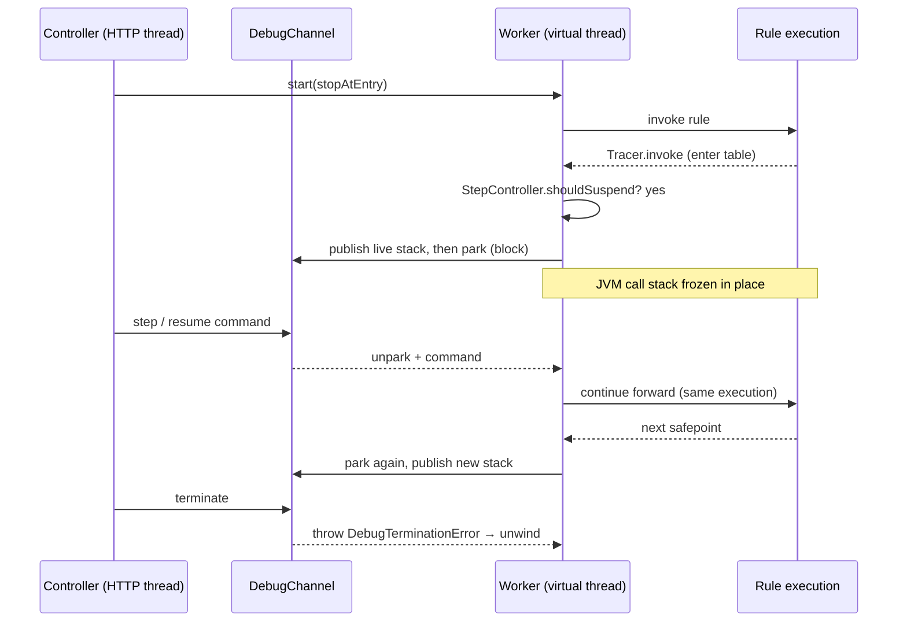
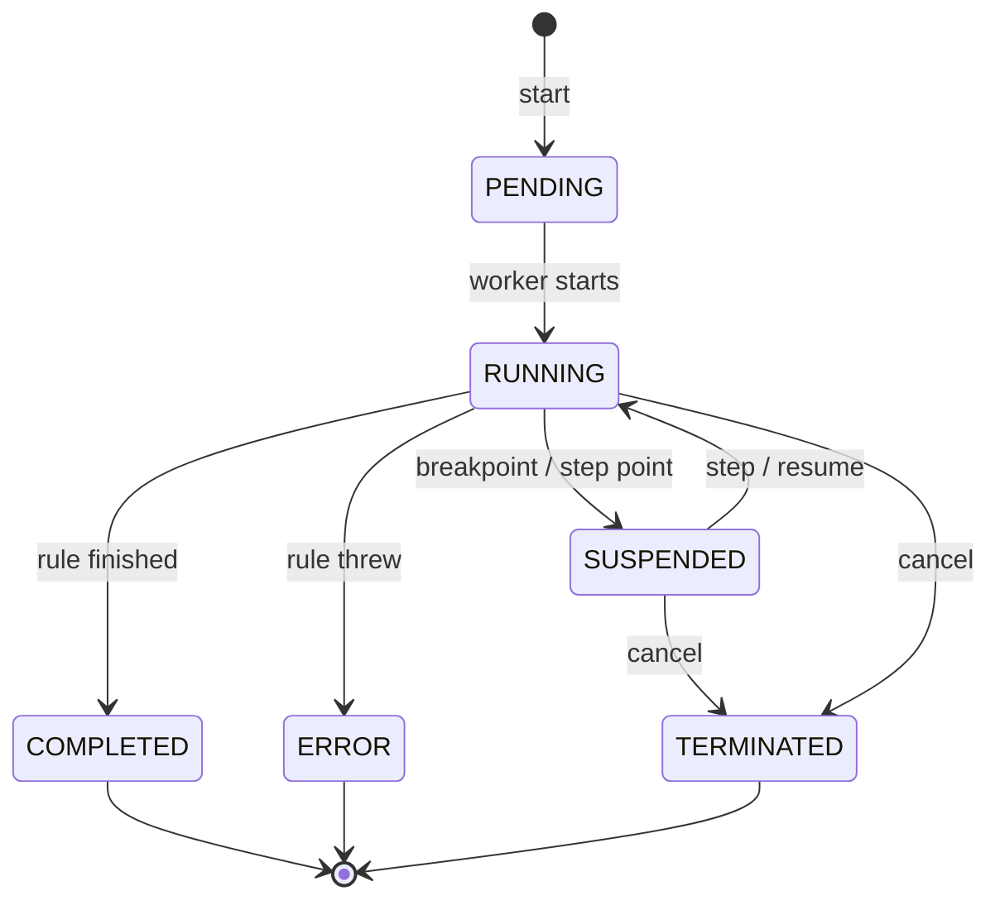
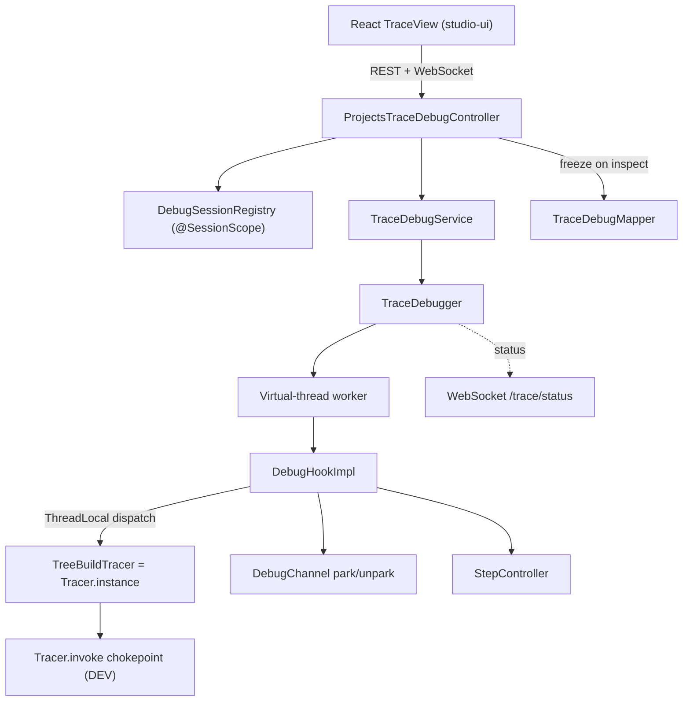
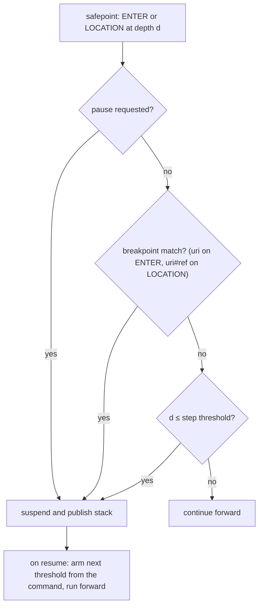

# Projects Trace API - Architecture Design

**Version**: 6.0.0-SNAPSHOT
**Status**: BETA
**Last Updated**: 2026-06-28

> [!Note]
> This describes the **interactive debugger** Trace. It replaces the previous tree-based Trace that ran a
> rule to completion, built a full execution tree, and used "lazy nodes" that re-executed the calculation.

---

## Table of Contents

1. [Why this exists](#why-this-exists)
2. [The core idea](#the-core-idea)
3. [How suspension works](#how-suspension-works)
4. [Session lifecycle](#session-lifecycle)
5. [Architecture layers](#architecture-layers)
6. [Frames and stepping](#frames-and-stepping)
7. [Breakpoints](#breakpoints)
8. [Freezing variables](#freezing-variables-live-stack-only)
9. [Avoiding the ProjectModel monitor](#avoiding-the-projectmodel-monitor)
10. [Highlighting in the traced table](#highlighting-in-the-traced-table)
11. [Memory: old vs new](#memory-old-vs-new)
12. [REST API](#rest-api)
13. [Concurrency and isolation](#concurrency-and-isolation)
14. [Limitations and follow-ups](#limitations-and-follow-ups)
15. [Key files](#key-files)

---

## Why this exists

The previous Trace ran a rule **to completion**, built a full in-memory tree of every executed step, and
**cloned the arguments and result of every node**. A single trace could reach tens of gigabytes. The
"lazy node" mitigation only *simulated* laziness: expanding a node **re-executed the whole calculation
from that point to the end**, kept just the first level, discarded the rest, and re-cloned arguments —
wasteful in both CPU and memory.

The rework replaces this with a **real, Java-debugger-style** model: step into/over/out, breakpoints on
tables and on individual steps, and **genuinely suspended execution** instead of re-execution. The UI
shows the **live execution stack** (root to the current point) rather than a full tree, so memory is
bounded by stack depth, not by the number of executed steps.

## The core idea

OpenL evaluation is a **synchronous recursive Java call chain**, and every rule-table invocation funnels
through one chokepoint:

```
ExecutableRulesMethod.invoke → Tracer.invoke(executor, target, params, env, source) → instance.doInvoke(...)
```

Therefore a **parked worker thread is a live continuation**: if the thread blocks inside a nested
invocation, its JVM call stack — with every frame and all local state — stays alive, frozen in place. We
can suspend and resume real execution **without rewriting the interpreter and without continuations** —
the parked thread *is* the continuation.

## How suspension works

A debug session runs the selected rule on a **dedicated virtual thread** (Java 21). A debug-aware hook
brackets each table-level invocation and decides whether to suspend (a breakpoint matched, or a step
condition was satisfied). To suspend, the worker **blocks on a lock/condition**; to resume, the
controller unblocks it and it continues **forward** from exactly where it stopped — never a re-run.



> [!Note]
> The control methods (`step`, `resume`, `pause`, `terminate`) run on the HTTP thread and return promptly.
> Only the worker thread ever blocks, and a parked virtual thread costs almost nothing.

## Session lifecycle



Status changes are pushed over WebSocket; `RUNNING ⇄ SUSPENDED` may repeat any number of times before a
terminal state. A terminal state accepts no further commands.

## Architecture layers



- **Engine** (`org.openl.rules.webstudio.web.trace.debug`) — the debugger core: `TraceDebugger`
  (orchestrates the worker), `DebugChannel` (the park/unpark handshake), `DebugHookImpl` (maintains the
  live frame stack and suspends), `StepController` (pure stepping logic), `DebugFrame`, the
  `SourceClassifier` seam (`DefaultSourceClassifier`), `ConditionCheck`, `DebugTerminationError`.
- **Dispatch** — `TreeBuildTracer` is the installed `Tracer.instance`. A `ThreadLocal<DebugHook>` routes
  the worker thread's invocations to the hook; other threads fall through to the legacy tree builder or a
  plain passthrough. The DEV `Tracer` class is untouched, and the legacy JSF trace keeps working.
- **Service / session** (`org.openl.studio.projects.service.trace`) — `TraceDebugService` builds the test
  suite and spawns the worker; `DebugSession` holds one running session; `DebugSessionRegistry`
  (`@SessionScope`, at most one session per user) manages lifecycle and persistent breakpoints.
- **Model / mapper** (`org.openl.studio.projects.model.trace`) — `TraceDebugMapper` maps the live stack to
  view DTOs and freezes a frame's variables on demand.
- **REST + WebSocket** — `ProjectsTraceDebugController` under `/projects/{projectId}/trace`; status events
  reuse the trace topic via `ProjectSocketNotificationService`.
- **UI** (`STUDIO/studio-ui`) — `TraceView` debugger layout: toolbar, call stack, steps panel, variables,
  and the traced table.

## Frames and stepping

A **stack frame is one rule-table invocation** (decision table, spreadsheet, method table, column match,
TBasic). All of these extend `ExecutableRulesMethod`, so one `Tracer.invoke(…, this)` is one frame.
Spreadsheet cells, fired decision-table rules, conditions, and TBasic operations are **sub-steps** (the
current line) inside the active frame, not separate frames.

Stepping is a single **depth threshold**: execution suspends on a frame enter or a current-line change
when `depth <= threshold` (frames are numbered from 1).

- **Step Into** — threshold = unbounded; stop at the next enter or sub-step at any depth.
- **Step Over** — threshold = current depth; run callees through, stop at the next line in this frame or its caller.
- **Step Out** — threshold = current depth − 1; run until this frame returns, stop in the caller.
- **Resume** — threshold = 0; run to the next breakpoint or to completion.
- **Pause** — asynchronous request; suspend at the next safepoint.

The hook evaluates this at every safepoint (a frame enter or a current-line change):



## Breakpoints

A breakpoint is matched at one of two granularities, both keyed off the same set:

- **Table** — key `uri`; suspends on the table's **frame enter**.
- **Sub-step** — key `uri#ref` (for a spreadsheet cell `ref = R{row}C{col}`); suspends on the matching
  **current-line change**. The Steps panel sets these from per-step gutters.

Breakpoints persist across runs in the session registry, so they can be set before a run and apply to the
next one.

## Freezing variables (live stack only)

Variables are **frozen lazily, on first inspection, while the worker is parked**. Because the worker runs
no code while parked, its object graph is stable, so the controller thread safely deep-clones a frame's
parameters/context (a fresh `Cloner` identity map under the captured classloader). The snapshot is cached
on the frame and **discarded when the frame returns**. Large values are registered in the
`TraceParameterRegistry` and fetched lazily. Memory is therefore bounded by **live stack depth × the size
of the frames you actually open**, never by total executed steps.

For a spreadsheet, the "Steps" panel additionally records each executed cell's value as it runs, so an
analyst can inspect already-computed steps while a later step executes.

## Avoiding the ProjectModel monitor

`ProjectModel.traceElement` is `synchronized`; parking inside it would hold the project monitor for the
whole session and block compilation and other reads (the EPBDS-16092 deadlock class). The service instead
captures the compiled `IOpenClass` + classloader once, then runs the suspendable invocation **off the
monitor** via `testSuite.invokeSequentially(openClass, 1)` on the worker. A `WorkspaceResetEvent`
terminates the session.

## Highlighting in the traced table

The table view highlights the current execution point, reusing the grid-region/filter machinery:

- **Spreadsheet** — the active cell, amber background. The cell is resolved from the frame's current
  location reference, so the highlight survives intermediate trace events.
- **Decision table** — every evaluated condition is colored: **green** when matched, **red** when not,
  and the fired rule's **returned result** in **blue**. This requires the debug `Tracer.doWrap` to wrap
  the `IIntSelector` as `IntSelectorTracer`, so the algorithm's per-rule
  `Tracer.put("condition", condition, rule, successful)` events fire and are captured as `ConditionCheck`s
  on the frame.

The frontend refetches the table on every suspension (a `stackVersion` counter), so the highlight tracks
the current line even when stepping within the same frame.

## Memory: old vs new

| Aspect | Legacy tree trace | Interactive debugger |
| --- | --- | --- |
| Execution | Run to completion, eagerly | One forward run, paused in place |
| Retained state | Full tree of every step | Live stack only (root → current) |
| Argument cloning | Per node, for the whole tree | Lazy, per inspected live frame, discarded on return |
| "Deeper" inspection | Re-execute from a point to the end | Continue the same parked execution |
| Memory bound | Total executed steps (tens of GB) | Live stack depth |

## REST API

Base path `/projects/{projectId}/trace`. See [Projects Trace API Documentation](projects-trace-api.md)
for request/response details.

| Method | Path | Purpose |
| --- | --- | --- |
| POST | `/` | Start a session; returns the initial stack |
| GET | `/stack` | Current execution stack (root → current) |
| GET | `/status` | Lightweight status poll |
| POST | `/step?type=into\|over\|out` | Step and return the new stack |
| POST | `/resume` | Run to the next breakpoint (async) |
| POST | `/pause` | Request a suspend |
| GET | `/frames/{i}/variables` | Freeze and return a frame's variables and steps |
| GET | `/frames/{i}/table` | Frame's table HTML with the current line highlighted |
| GET / PUT | `/breakpoints` | List / replace breakpoints |
| GET | `/parameters/{id}` | Lazy-load a large parameter value |
| DELETE | `/` | Terminate the session |

WebSocket: status changes (`SUSPENDED`, `RUNNING`, `COMPLETED`, `ERROR`, `TERMINATED`) are pushed to
`/user/topic/projects/{projectId}/tables/{tableId}/trace/status`; the client then reads the new stack.

## Concurrency and isolation

- One dedicated **virtual thread** per session — never the bounded `testSuiteExecutor` pool, which a
  parked worker would exhaust. Idle suspended sessions cost almost nothing.
- The tracer dispatch is **per-thread** (`ThreadLocal<DebugHook>`): non-debug executions, other users, and
  the legacy JSF trace are unaffected, and concurrent debug sessions do not interfere.
- Terminate throws a private `DebugTerminationError extends Error` (not `Exception`/`LinkageError`/
  `StackOverflowError`) so user rule `catch` blocks and the test runner cannot swallow it; the controller
  also interrupts and briefly joins the worker, then abandons a genuinely hung (cheap) virtual thread
  rather than blocking the HTTP thread.

## Limitations and follow-ups

- Sub-step breakpoints are wired for **spreadsheets**; decision tables show condition/result highlighting
  but per-rule breakpoints and condition-by-condition stepping are not yet implemented.
- Multiple test cases in a suite are debugged sequentially; the worker stops at the entry of each case.
- The legacy tree-trace services were superseded; their removal and the ITEST rewrite for the new contract
  are pending.

## Key files

- `DEV/.../org/openl/vm/Tracer.java` — the invocation chokepoint (unchanged).
- `STUDIO/.../web/trace/TreeBuildTracer.java` — installs `Tracer.instance`; per-thread dispatch to the debug hook.
- `STUDIO/.../web/trace/debug/` — the engine (`TraceDebugger`, `DebugChannel`, `DebugHookImpl`,
  `StepController`, `DebugFrame`, `DefaultSourceClassifier`, `ConditionCheck`).
- `STUDIO/.../studio/projects/service/trace/` — `TraceDebugService(Impl)`, `DebugSession`, `DebugSessionRegistry`.
- `STUDIO/.../studio/projects/model/trace/TraceDebugMapper.java` — stack mapping and variable freezing.
- `STUDIO/.../studio/projects/rest/controller/ProjectsTraceDebugController.java` — the REST API.
- `STUDIO/studio-ui/src/containers/TraceView/` + `store/traceStore.ts` + `services/traceService.ts` — the UI.
