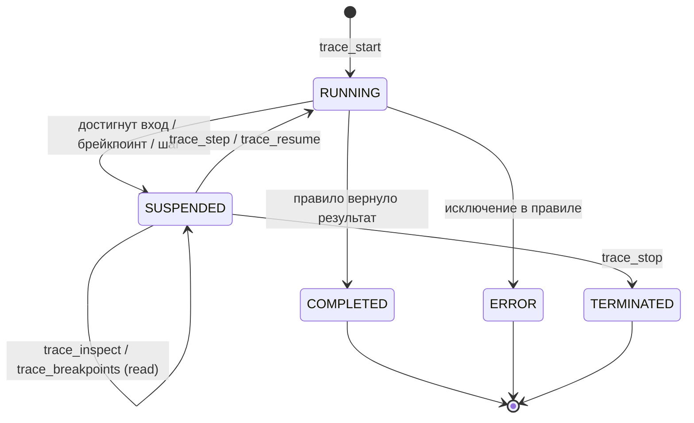
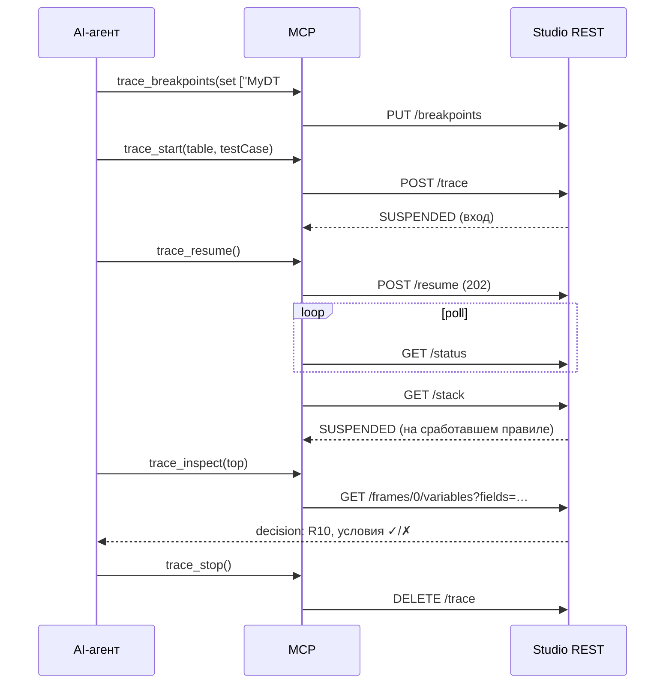

# Trace Debug → MCP: спецификация интеграции

Документ для имплементации MCP-сервера поверх интерактивного Trace Debug API OpenL Studio.
Цель — дать AI-агенту полноценно дебажить правила: репро → брейкпоинт → добежать → понять «почему» →
шагнуть → завершить.

**Итог: 7 тулов** покрывают полный трейс (можно ужать до 5). Каждый тул композитный — 1–3 вызова
REST + `?fields=` для обрезки ответа. Сам MCP-сервер живёт в отдельном репозитории.

## Содержание

- [Транспорт, аутентификация, сессия](#1-транспорт-аутентификация-сессия)
- [Жизненный цикл и статусы](#2-жизненный-цикл-и-статусы)
- [Грамматика ключей брейкпоинтов](#3-грамматика-ключей-брейкпоинтов)
- [Типы данных (схемы)](#4-типы-данных-схемы)
- [Тулы (спецификации)](#5-тулы-спецификации)
- [Обработка ошибок](#6-обработка-ошибок)
- [Заметки по имплементации](#7-заметки-по-имплементации)

## 1. Транспорт, аутентификация, сессия

- **База:** `{context}/rest/projects/{projectId}/trace` (те же контроллеры доступны и на `/web` для UI;
  для MCP используем `/rest` с токеном).
- **Auth:** Personal Access Token в заголовке (как для остальных `/rest`-вызовов).
- **Сессия (критично):** дебаг-сессия серверная и привязана к HTTP-сессии (`@SessionScope`). Весь флоу —
  это много вызовов в ОДНОЙ HTTP-сессии. **MCP обязан хранить cookie/sessionId** (`JSESSIONID`) и
  передавать его между всеми вызовами одного дебага. Без этого после `trace_start` следующий вызов не
  найдёт сессию (404).
- **Одна активная сессия на пользователя**: `trace_start` завершает предыдущую. Для параллельного дебага
  нескольких правил — разные токены/пользователи.
- **Idle-реапер:** припаркованный worker освобождается после ~10 минут простоя. Любой вызов сбрасывает
  таймер; при длинных паузах агента MCP шлёт keepalive (`GET /status`).

## 2. Жизненный цикл и статусы

`DebugStatusView.status` / `DebugStackView.status` ∈
`PENDING | RUNNING | SUSPENDED | COMPLETED | ERROR | TERMINATED`.



- Инспекция кадров и шаги валидны **только при `SUSPENDED`** (иначе `409`); чтение стека — при любом
  статусе, кроме `RUNNING`.
- `COMPLETED`/`ERROR`/`TERMINATED` — терминальные: дальше только чтение стека (`GET /stack` — на
  `ERROR` в нём `error: DebugError`, при `profiling` — весь `tree`) и `trace_stop`; `trace_inspect`
  на терминале вернёт `409`.

## 3. Грамматика ключей брейкпоинтов

Набор брейкпоинтов — это плоский `string[]`. Ключ — одна из форм:

| Форма | Что останавливает |
|---|---|
| `<name>` | вход в любую таблицу с этим именем (все перегрузки/измерения) |
| `<uri>` | вход в конкретную таблицу по URI |
| `<uri>#R{row}C{col}` | ячейку spreadsheet (напр. `…#R0C1`) |
| `<uri>#rule` | срабатывание **любого** правила decision-таблицы |
| `<uri>#<ruleName>` | срабатывание **конкретного** правила (напр. `…#R10`) |

- `name` берётся из `trace_breakpoints` (список целей) или из `frames[].name`.
- `uri` — из `frames[].uri`.
- `ruleName` — из `trace_inspect → ruleNames[]` или `decision.firedRules[]`/`conditions[].rule`.
- Зарезервировано: суффикс `rule` («любое правило») может конфликтовать с правилом, буквально
  названным `rule` — крайний кейс, на практике игнорируем.

## 4. Типы данных (схемы)

> [!Note]
> Поля помечены `?` если опциональны/nullable (`@JsonInclude(NON_NULL)` — отсутствуют в JSON, когда `null`).

```jsonc
// DebugStackView — возвращают trace_start / trace_step / trace_resume / trace_stack
{
  "status": "SUSPENDED",
  "frames": [ /* DebugFrameView, root → current; пуст после завершения */ ],
  "error": null,           // DebugError, присутствует только при status=ERROR
  "tree": null             // ? CallNodeView — ВЕСЬ выполненный колл-три после завершения (только profiling)
}

// DebugFrameView — один кадр стека
{
  "index": 0,              // позиция в стеке
  "depth": 1,              // глубина вызова (1 = верхний уровень)
  "uri": "Proj/File.xlsx?sheet=S&range=A1:B2",  // ключ для брейкпоинтов и raw-таблицы
  "tableId": "…",          // стабильный id таблицы (для Tables API)
  "name": "MyRule",
  "kind": "spreadsheet",   // FrameKind, см. ниже
  "location": null,        // DebugLocationView — текущая «строка», null на входе
  "active": true,          // true у текущего (последнего) кадра
  "completed": false,      // true когда кадр отработал (есть результат)
  "error": false,          // true когда кадр упал
  "steps": [ /* ? StepValueView — под-шаги кадра со статусами (executed/current/pending) */ ],
  "durationMillis": 12.4,  // ? общее время ЗАВЕРШЁННОГО кадра (без времени паркинга)
  "selfMillis": 3.1,       // ? собственное время (без вызванных таблиц)
  "dispatch": null         // ? DispatchInfo — если таблица выбрана диспетчером из перегруженных версий
}

// FrameKind
"decisionTable" | "spreadsheet" | "method" | "cmatch" | "tbasic" | "tbasicMethod"
// + "stepRef" — только у CallNodeView: ссылка на уже выполненный шаг, не таблица

// DispatchInfo — бейдж версии, выбранной по dimension-свойствам (сам диспетчер кадра не создаёт)
{ "candidates": [ { "label": "effectiveDate: 01/01/2021", "chosen": true }, { "label": "…", "chosen": false } ] }

// DebugLocationView — текущая строка внутри кадра
{
  "kind": "cell",          // "cell" | "dtrule" | "operation"
  "row": 0, "column": 1,   // только для cell
  "ref": "R0C1",           // ячейка spreadsheet; для dtrule отсутствует
  "label": "$Value$Total"  // человекочитаемое (имя ячейки / имена правил)
}

// DebugError — на терминальном ERROR
{ "summary": "…", "table": "MyRule", "location": "R3C1", "type": "IllegalStateException", "detail": "<стектрейс, до 8000 симв.>" }

// DebugFrameVariables — возвращает trace_inspect
{
  "parameters": [ /* ParameterValue, входы правила */ ],
  "context": { /* ParameterValue, рантайм-контекст */ },        // ? только если есть
  "result": { /* ParameterValue, возвращённое значение */ },    // ? только у completed-кадра
  "steps": [ /* StepValueView, под-шаги (ячейки/правила) */ ],
  "gridColumns": ["Description", "Value"],   // ? только для spreadsheet
  "gridRows": ["Total", "Tax"],              // ? только для spreadsheet
  "decision": { /* DecisionView */ },        // ? только для decisionTable, после срабатывания
  "ruleNames": ["R1", "R2", "R10"],          // ? только для decisionTable: ВСЕ правила (для брейкпоинтов)
  "errors": [ /* MessageDescription */ ]
}

// ParameterValue — значение с ленивой загрузкой
{
  "name": "currentData",
  "description": "FinancialData",  // тип
  "lazy": true,                    // true => value отсутствует, тяни по parameterId
  "parameterId": 1,                // ? id для trace_get_value
  "value": { /* JsonNode */ },     // ? присутствует когда lazy=false (или после разворота)
  "schema": { /* JSON Schema */ }  // ? схема значения (опускать через ?fields для экономии токенов)
}

// StepValueView — под-шаг кадра (только ИСПОЛНЯЕМЫЕ ячейки: формулы; константы/заголовки не шаги)
{
  "ref": "R0C1", "label": "$Value$Total",
  "status": "executed",            // "executed" | "current" | "pending"
  "value": { /* ParameterValue */ },  // ? только из trace_inspect (variables)
  "children": [ /* ? CallNodeView — что этот шаг вызвал/на что сослался (profiling) */ ],
  "durationMillis": 5.0,           // ? общее время выполненного шага (своя работа + вызванные таблицы)
  "selfMillis": 1.2                // ? собственное время (без вызванных таблиц)
}

// CallNodeView — узел выполненного колл-три (profiling): вернувшийся вызов, только структура, БЕЗ значений
{
  "uri": "…", "name": "SubPremium",
  "kind": "spreadsheet",           // или "stepRef" — ссылка на шаг того же кадра
  "durationMillis": 8.3, "selfMillis": 2.0,
  "steps": [ /* StepValueView — выполненные под-шаги, рекурсивно */ ],
  "dispatch": null,                // ? DispatchInfo
  "refStep": null                  // ? для kind=stepRef: ref оригинального шага (напр. "R1C0")
}
// stepRef = формула вычислила/перечитала другой шаг того же кадра: время 0, детей нет —
// исполнение учтено один раз, у оригинального шага; ветка никогда не дублируется.

// DecisionView — «почему сработало правило» (киллер-фича для агента)
{
  "firedRules": ["R10"],                  // какие правила сработали
  "conditions": [                         // по одной записи на проверенное условие × правило
    { "condition": "C1", "rule": "R10", "matched": true },
    { "condition": "C2", "rule": "R10", "matched": true },
    { "condition": "C1", "rule": "R11", "matched": false }
  ]
}

// CellHighlight — подсветка (мёрджить с raw-сеткой по адресу A1)
{ "cell": "B3", "state": "current" }       // "current" | "result" | "conditionTrue" | "conditionFalse"

// BreakpointTableView — цель для брейкпоинта
{ "name": "BankRatingGroup", "kind": "decisionTable" }
```

## 5. Тулы (спецификации)

Сводка:

| # | Тул | Композит API | Валиден при | Выход |
|---|---|---|---|---|
| 1 | `trace_start` | `POST /trace` | нет сессии | `DebugStackView` |
| 2 | `trace_step` | `POST /step?type=` | `SUSPENDED` | `DebugStackView` |
| 3 | `trace_resume` | `POST /resume` + поллинг `GET /status` → `GET /stack` | `SUSPENDED` | `DebugStackView` |
| 4 | `trace_inspect` | `GET …/variables` (+ опц. `…/highlights`, raw-сетка) | `SUSPENDED` | `DebugFrameVariables` (+ highlights) |
| 5 | `trace_breakpoints` | `GET /breakpoint-tables`, `GET`/`PUT /breakpoints` | любой | `{ breakpoints, targets }` |
| 6 | `trace_get_value` | `GET /parameters/{id}` | сессия жива | `ParameterValue` |
| 7 | `trace_stop` | `DELETE /trace` | любой | `{ ok: true }` |

На терминальном статусе финальное состояние (структурированная ошибка, выполненный `tree`) читается
из стека — его уже вернул `trace_start`/`trace_step`/`trace_resume`; `trace_inspect` там даст `409`.

---

### 1. `trace_start`

Стартует сессию. Перед `POST /trace` MCP при необходимости резолвит вход: либо индекс тест-кейса
(`testRanges`), либо собирает `inputJson` по сигнатуре правила (через Tables/Test API).

**Вход:**

```jsonc
{
  "projectId": "string",
  "tableId": "string",
  "testRanges": "1",          // ? индекс(ы) тест-кейса, напр. "1" или "1-3"
  "inputJson": { /* … */ },   // ? тело-вход, если без тест-кейса
  "fromModule": "string",     // ? трассировать в контексте конкретного открытого модуля
  "stopAtEntry": true,        // по умолчанию true — остановиться на входе
  "profiling": false,         // ? true — сохранять выполненный колл-три (структура+тайминги, без значений)
  "breakpoints": ["MyDT#rule"]// ? начальный набор (иначе ставить через trace_breakpoints до старта)
}
```

**API:** `POST {base}?tableId=…&testRanges=…&stopAtEntry=…&profiling=…` (тело = `inputJson`).
**Выход:** `DebugStackView` (обычно `status=SUSPENDED`, один кадр на входе; при
`stopAtEntry=false` без брейкпоинтов — сразу терминальный, с `tree` при `profiling=true`).
**Ошибки:** `404` таблица/метод не найдены; `409` ошибка конфигурации mapper.

> [!Note]
> Сервер запоминает последний вход: рестарт **без** `inputJson` и **без** `testRanges` (реплей,
> переключение `profiling`) повторяет трассировку с тем же входом — MCP не обязан его пересылать.

---

### 2. `trace_step`

**Вход:** `{ "projectId": "string", "type": "into" | "over" | "out" }`
**API:** `POST {base}/step?type={type}` (синхронно, до следующего safepoint, бандл-таймаут ~30с).

- `into` — внутрь следующего вызова / на следующий под-шаг;
- `over` — следующий под-шаг текущего кадра (вложенные вызовы пробегаются);
- `out` — доводит текущий кадр до его собственного выхода (виден `result`), дальше — в вызывающий.

Шаг, завершающий кадр (любой из трёх), сперва останавливается на **выходе этого кадра**: он ещё в
стеке, `completed=true`, `result` доступен через `trace_inspect`. Исключение в правиле само
останавливает на падающем кадре до раскрутки (дальше `trace_resume` → терминальный `ERROR`).

**Выход:** `DebugStackView`. **Ошибки:** `404` нет сессии; `409` не `SUSPENDED`.

---

### 3. `trace_resume`

«Добежать до следующей остановки» — синхронная обёртка над async `/resume`.

**Вход:** `{ "projectId": "string", "timeoutMs": 30000 }`
**API (внутри MCP):**

1. `POST {base}/resume` → `202`.
2. Поллинг `GET {base}/status` каждые 100–300 мс до `SUSPENDED | COMPLETED | ERROR | TERMINATED`.
3. `GET {base}/stack` → отдать наружу.

**Выход:** `DebugStackView` (со `status` остановки; при `ERROR` — заполнен `error`).
**Ошибки:** `404` нет сессии; `409` не `SUSPENDED`; таймаут → вернуть текущий статус.

---

### 4. `trace_inspect`

Полное состояние кадра. По умолчанию режет ответ через `?fields=` (без JSON-схем значений).

**Вход:**

```jsonc
{
  "projectId": "string",
  "frameIndex": 0,
  "withHighlights": false,   // ? добавить подсветку + raw-сетку
  "full": false              // ? true => не резать схемы значений
}
```

**API:**

- `GET {base}/frames/{frameIndex}/variables?fields=decision,result(name,description,value),steps(ref,label,status,value(name,value)),parameters(name,description,lazy,parameterId,value),context(value),ruleNames`
- если `withHighlights`: ещё `GET {base}/frames/{frameIndex}/highlights` и
  `GET {context}/rest/projects/{projectId}/tables/{tableId}?raw=true`, смёрджить подсветку с сеткой.

**Выход:** `DebugFrameVariables` (+ опц. `highlights`, `grid`). Для decision-таблицы ключевое —
`decision` (что сработало и как сошлись условия) и `ruleNames` (для постановки per-rule брейкпоинтов).
**Ошибки:** `404` нет сессии/кадра; `409` не `SUSPENDED`.

---

### 5. `trace_breakpoints`

Читает текущий набор + доступные цели; при наличии `set` — заменяет набор.

**Вход:**

```jsonc
{
  "projectId": "string",
  "set": ["MyDT#rule", "Other"]  // ? если задано — PUT (полная замена набора)
}
```

**API:** `GET {base}/breakpoint-tables` (цели) + `GET {base}/breakpoints` (текущие); если `set` —
`PUT {base}/breakpoints` с телом `{ "uris": [...] }`.
**Выход:** `{ "breakpoints": ["…"], "targets": [ /* BreakpointTableView */ ] }`.
Грамматику ключей см. в [§3](#3-грамматика-ключей-брейкпоинтов). Брейкпоинты можно ставить до и во
время дебага (применяются на следующем входе/срабатывании).

---

### 6. `trace_get_value`

Разворачивает большое ленивое значение (`ParameterValue.lazy=true`).

**Вход:** `{ "projectId": "string", "parameterId": 1 }`
**API:** `GET {base}/parameters/{parameterId}`.
**Выход:** `ParameterValue` с `value`. **Ошибки:** `404` нет сессии/параметра.

---

### 7. `trace_stop`

**Вход:** `{ "projectId": "string" }`
**API:** `DELETE {base}` → `204`.
**Выход:** `{ "ok": true }`. Идемпотентен (нет сессии — тоже ок).

## 6. Обработка ошибок

| HTTP | Когда | Что делать агенту/MCP |
|---|---|---|
| `404` | нет активной сессии / нет кадра/параметра | стартовать заново (`trace_start`) или поправить индекс |
| `409` | действие не в статусе `SUSPENDED` | сначала `trace_resume`/дождаться остановки; не шагать на завершённой сессии |
| `400` | плохой вход (неизвестный `type`, кривой `inputJson`) | поправить параметры |
| `403` | нет прав READ на проект | проверить токен/доступ |
| таймаут шага/резюма | правило долго считает или зациклилось | вернуть статус; предложить `trace_stop` |

Формат тела ошибки — стандартный для Studio REST (`{ message, fields?[] }`). MCP должен мапить
статус-код в понятное агенту сообщение (а не отдавать сырой стектрейс).

## 7. Заметки по имплементации

- **fields-проекция.** `?fields=` работает на всех trace-DTO автоматически и поддерживает вложенность
  (`a,b(x,y)`). Дефолтные маски в тулах выше — минимум для рассуждения; `full=true` снимает обрезку.
- **Сессия.** Один cookie-jar на агент-сессию; keepalive `GET /status` при паузах > ~8 мин.
- **Синхронность.** Только `/resume` и `/pause` асинхронны (202) — MCP их поллит и отдаёт синхронно.
  `/step` уже синхронный.
- **Токен-бюджет.** Не тащить `schema` и полные графы в `trace_inspect` без `full`; крупные значения —
  по требованию через `trace_get_value`.
- **Профилирование = самый дешёвый «понять весь прогон».** `trace_start(profiling=true,
  stopAtEntry=false)` без брейкпоинтов добегает до конца за ОДИН вызов и возвращает `tree` — полную
  структуру исполнения: какие шаги выполнились, что каждый вызвал (`children`), тайминги
  total/self, бейджи версий и `stepRef`-ссылки. Значений в дереве нет — чтобы заглянуть внутрь
  ветки, реплей: рестарт с брейкпоинтом на нужной таблице (вход запоминается) и `trace_inspect`
  вживую. Паттерн для агента: сперва дерево (дёшево, целиком), потом точечный дебаг подозрительной
  ветки.
- **Highlights.** Ключи — A1-адреса (`B3`); смысл ячейки берётся из raw-сетки (`?raw=true`). Для
  decision-таблиц `decision` обычно информативнее, чем подсветка.
- **Безопасность.** Трассировка = READ-операция (проверяется грант READ на проект, как у run/test).

## Пример: один цикл дебага


