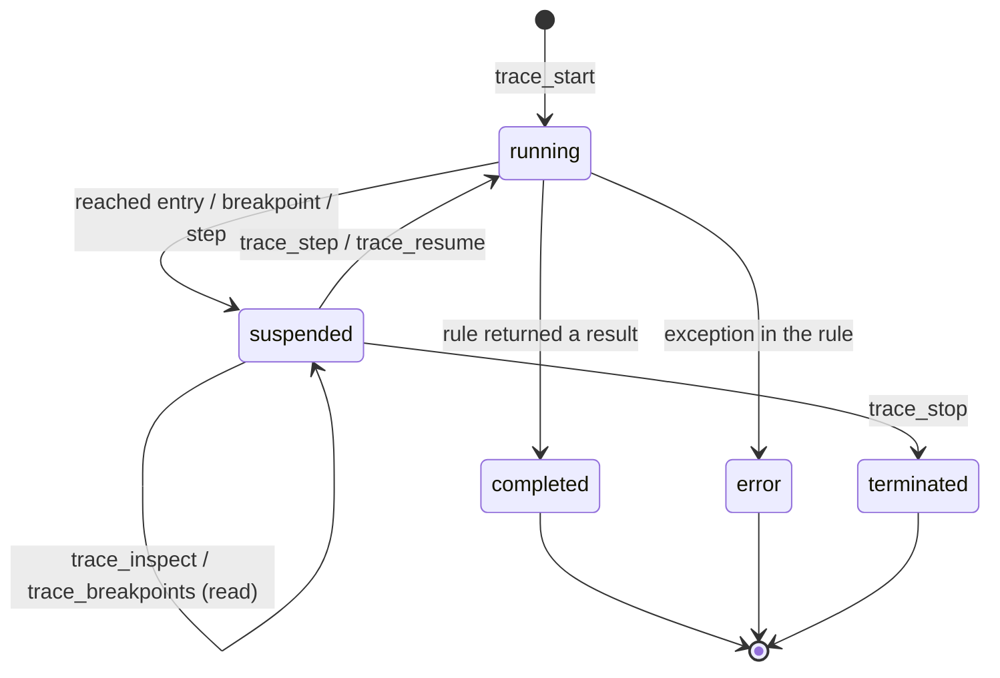
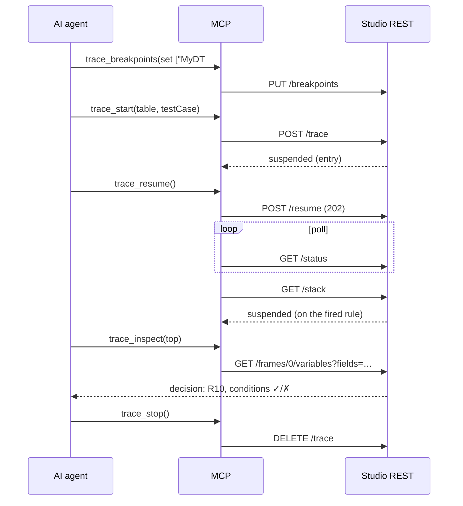

# Trace Debug → MCP: integration specification

A document for implementing an MCP server on top of OpenL Studio's interactive Trace Debug API.
The goal is to let an AI agent fully debug rules: reproduce → breakpoint → run to it → understand "why" →
step → finish.

**Result: 8 tools** cover the full trace (can be squeezed to 5). Each tool is composite — 1–3 REST calls
plus `?fields=` to trim the response. The MCP server itself lives in a separate repository.

## Table of contents

- [Transport, authentication, session](#1-transport-authentication-session)
- [Lifecycle and statuses](#2-lifecycle-and-statuses)
- [Breakpoint key grammar](#3-breakpoint-key-grammar)
- [Data types (schemas)](#4-data-types-schemas)
- [Tools (specifications)](#5-tools-specifications)
- [Error handling](#6-error-handling)
- [Implementation notes](#7-implementation-notes)
- [Response-volume ergonomics (review backlog)](#8-response-volume-ergonomics-review-backlog)

## 1. Transport, authentication, session

- **Base:** `{context}/rest/projects/{projectId}/trace` (the same controllers are also available on `/web` for
  the UI; for MCP use `/rest` with a token).
- **Auth:** a Personal Access Token in the header (as for the other `/rest` calls).
- **Session (critical):** the debug session is server-side and bound to the HTTP session (`@SessionScope`). The
  whole flow is many calls within ONE HTTP session. **MCP must keep the cookie/sessionId** (`JSESSIONID`) and
  pass it across every call of one debug run. Without it, the call after `trace_start` will not find the
  session (404).
- **One active session per user:** `trace_start` terminates the previous one. To debug several rules in
  parallel, use different tokens/users.
- **Idle reaper:** a parked worker is released after ~10 minutes of inactivity. Any call resets the timer;
  during long agent pauses MCP sends a keepalive (`GET /status`).

## 2. Lifecycle and statuses

`DebugStatusView.status` / `DebugStackView.status` ∈
`pending | running | suspended | completed | error | terminated`.


```mermaid
stateDiagram-v2
    [*] --> running: trace_start
    running --> suspended: reached entry / breakpoint / step
    suspended --> running: trace_step / trace_resume
    suspended --> suspended: trace_inspect / trace_breakpoints (read)
    running --> completed: rule returned a result
    running --> error: exception in the rule
    suspended --> terminated: trace_stop
    completed --> [*]
    error --> [*]
    terminated --> [*]
```

- Frame inspection and steps are valid **only while `suspended`** (otherwise `409`); reading the stack works
  in any status except `running`.
- `completed`/`error`/`terminated` are terminal: from there only stack reads (`GET /stack` — on `error` it
  carries `error: DebugError`, and with `profiling` the whole `tree`) and `trace_stop` are possible;
  `trace_inspect` on a terminal state returns `409`.

## 3. Breakpoint key grammar

The breakpoint set is a flat `string[]`. A key is one of these forms:

| Form | What it stops on |
|---|---|
| `<name>` | entry into any table with this name (all overloads/dimensions) |
| `<uri>` | entry into a specific table by URI |
| `<uri>#R{row}C{col}` | a spreadsheet cell (for example `…#R0C1`) |
| `<uri>#rule` | firing of **any** rule of a decision table |
| `<uri>#<ruleName>` | firing of a **specific** rule (for example `…#R10`) |
| `<key>@N` | any form above, but only on the **N-th execution** of the table (0-based) |

- `name` comes from `trace_breakpoints` (the target list) or from `frames[].name`.
- `uri` comes from `frames[].uri`.
- `ruleName` comes from `trace_inspect → ruleNames[]` or `decision.firedRules[]`/`conditions[].rule`.
- **`@N`** addresses one pass of a table that is invoked many times (for example one per-coverage evaluation of
  a spreadsheet). `N` is the same 0-based numbering as `frames[].instance` and the `instance` in a watch
  series: an outlier found by a watch at `instance:3` is reached with the key `<uri>#<ref>@3`. Without the
  suffix a cell breakpoint catches **every** pass starting from the first — target `@N` to avoid `resume` ×N.
- Reserved: the `rule` suffix ("any rule") may conflict with a rule literally named `rule` — an edge case we
  ignore in practice.

## 4. Data types (schemas)

> [!Note]
> Fields are marked `?` when optional/nullable (`@JsonInclude(NON_NULL)` — absent from JSON when `null`).

```jsonc
// DebugStackView — returned by trace_start / trace_step / trace_resume / trace_stack
{
  "status": "suspended",
  "frames": [ /* DebugFrameView, root → current; empty after completion */ ],
  "error": null,           // DebugError, present only when status=error
  "tree": null,            // ? CallNodeView — the WHOLE executed call tree after completion (profiling; may be >1MB; absent when includeTree=false)
  "profile": null          // ? ProfileSummaryView — a bounded overview (top-N slowest tables) after completion (profiling); take THIS, not tree
}

// ProfileSummaryView — a constant-size profile overview (unlike tree)
{
  "hotspots": [ /* ProfileHotspotView — top-N slowest tables, by selfMillis, most-expensive-first */ ],
  "distinctTables": 42,    // how many distinct tables executed (may be > hotspots.length)
  "nodeCount": 3571,       // total table invocations in the run (size of the full tree)
  "totalMillis": 128.4,    // wall-clock of the whole run
  "truncated": true        // more tables executed than hotspots returned
}

// ProfileHotspotView — one table in the hotspots, time aggregated over all its invocations
{
  "uri": "…", "name": "VehiclePriceFactor", "kind": "spreadsheet",
  "selfMillis": 83.4,      // own time across all invocations (excluding called tables); sum over all = wall-clock
  "totalMillis": 120.1,    // inclusive time (own + called)
  "count": 6               // how many times the table was invoked
}

// DebugFrameView — one stack frame
{
  "index": 0,              // position in the stack
  "depth": 1,              // call depth (1 = top level)
  "uri": "Proj/File.xlsx?sheet=S&range=A1:B2",  // key for breakpoints and the raw table
  "tableId": "…",          // stable table id (for the Tables API)
  "name": "MyRule",
  "kind": "spreadsheet",   // FrameKind, see below
  "location": null,        // DebugLocationView — the current "line", null at entry
  "active": true,          // true for the current (last) frame
  "completed": false,      // true once the frame has finished (has a result)
  "error": false,          // true when the frame failed
  "steps": [ /* ? StepValueView — the frame's sub-steps with statuses (executed/current/pending) */ ],
  "durationMillis": 12.4,  // ? total time of the COMPLETED frame (excluding parked time)
  "selfMillis": 3.1,       // ? own time (excluding called tables)
  "dispatch": null         // ? DispatchInfo — if the table was chosen by a dispatcher from overloaded versions
}

// FrameKind
"decisionTable" | "spreadsheet" | "method" | "cmatch" | "tbasic" | "tbasicMethod"
// + "stepRef" — only on CallNodeView: a reference to an already-executed step, not a table

// DispatchInfo — a badge for the version chosen by dimension properties (the dispatcher itself creates no frame)
{ "candidates": [ { "label": "effectiveDate: 01/01/2021", "chosen": true }, { "label": "…", "chosen": false } ] }

// DebugLocationView — the current line inside a frame
{
  "kind": "cell",          // "cell" | "dtrule" | "operation"
  "row": 0, "column": 1,   // cell only
  "ref": "R0C1",           // spreadsheet cell; absent for dtrule
  "label": "$Value$Total"  // human-readable (cell name / rule names)
}

// DebugError — on a terminal error
{ "summary": "…", "table": "MyRule", "location": "R3C1", "type": "IllegalStateException", "detail": "<stack trace, up to 8000 chars>" }

// DebugFrameVariables — returned by trace_inspect
{
  "parameters": [ /* ParameterValue, the rule's inputs */ ],
  "context": { /* ParameterValue, the runtime context */ },     // ? only if present
  "result": { /* ParameterValue, the returned value */ },       // ? only for a completed frame
  "steps": [ /* StepValueView, sub-steps (cells/rules) */ ],
  "gridColumns": ["Description", "Value"],   // ? spreadsheet only
  "gridRows": ["Total", "Tax"],              // ? spreadsheet only
  "decision": { /* DecisionView */ },        // ? decisionTable only, after a rule fires
  "ruleNames": ["R1", "R2", "R10"],          // ? decisionTable only: ALL rules (for breakpoints)
  "errors": [ /* MessageDescription */ ]
}

// ParameterValue — a value with lazy loading
{
  "name": "currentData",
  "description": "FinancialData",  // type
  "lazy": true,                    // true => value is absent, fetch it by parameterId
  "parameterId": 1,                // ? id for trace_get_value
  "value": { /* JsonNode */ },     // ? present when lazy=false (or after expansion)
  "schema": { /* JSON Schema */ }  // ? the value's schema (drop it via ?fields to save tokens)
}

// StepValueView — a frame sub-step (only EXECUTABLE cells: formulas; constants/headers are not steps)
{
  "ref": "R0C1", "label": "$Value$Total",
  "status": "executed",            // "executed" | "current" | "pending"
  "value": { /* ParameterValue */ },  // ? only from trace_inspect (variables)
  "children": [ /* ? CallNodeView — what this step called/referenced (profiling) */ ],
  "durationMillis": 5.0,           // ? total time of the executed step (own work + called tables)
  "selfMillis": 1.2                // ? own time (excluding called tables)
}

// CallNodeView — a node of the executed call tree (profiling): a returned call, structure only, NO values
{
  "uri": "…", "name": "SubPremium",
  "kind": "spreadsheet",           // or "stepRef" — a reference to a step of the same frame
  "durationMillis": 8.3, "selfMillis": 2.0,
  "steps": [ /* StepValueView — executed sub-steps, recursively */ ],
  "dispatch": null,                // ? DispatchInfo
  "refStep": null                  // ? for kind=stepRef: the ref of the original step (for example "R1C0")
}
// stepRef = a formula computed/re-read another step of the same frame: time 0, no children —
// execution is counted once, on the original step; the branch is never duplicated.

// DecisionView — "why the rule fired" (the killer feature for the agent)
{
  "firedRules": ["R10"],                  // which rules fired
  "conditions": [                         // one entry per checked condition × rule
    { "condition": "C1", "rule": "R10", "matched": true },
    { "condition": "C2", "rule": "R10", "matched": true },
    { "condition": "C1", "rule": "R11", "matched": false }
  ]
}

// CellHighlight — a highlight (merge with the raw grid by A1 address)
{ "cell": "B3", "state": "current" }       // "current" | "result" | "conditionTrue" | "conditionFalse"

// BreakpointTableView — a breakpoint target
{ "name": "BankRatingGroup", "kind": "decisionTable" }
```

## 5. Tools (specifications)

Summary:

| # | Tool | Composite API | Valid when | Output |
|---|---|---|---|---|
| 1 | `trace_start` | `POST /trace` | no session | `DebugStackView` |
| 2 | `trace_step` | `POST /step?type=` | `suspended` | `DebugStackView` |
| 3 | `trace_resume` | `POST /resume` + polling `GET /status` → `GET /stack` | `suspended` | `DebugStackView` |
| 4 | `trace_inspect` | `GET …/variables` (+ opt. `…/highlights`, raw grid) | `suspended` | `DebugFrameVariables` (+ highlights) |
| 5 | `trace_breakpoints` | `GET /breakpoint-tables`, `GET`/`PUT /breakpoints` | any | `{ breakpoints, targets }` |
| 6 | `trace_get_value` | `GET /parameters/{id}` | session alive | `ParameterValue` |
| 7 | `trace_stop` | `DELETE /trace` | any | `{ ok: true }` |
| 8 | `trace_watch` | `PUT /watches` + `POST /trace?stopAtEntry=false&includeTree=false` + `GET /watch` | no session | `WatchView` |

On a terminal status the final state (the structured error, the executed `tree`) is read from the stack — it
was already returned by `trace_start`/`trace_step`/`trace_resume`; `trace_inspect` there gives `409`.

---

### 1. `trace_start`

Starts a session. Before `POST /trace`, MCP resolves the input if needed: either a test-case index
(`testRanges`), or it builds `inputJson` from the rule's signature (via the Tables/Test API).

**Input:**

```jsonc
{
  "projectId": "string",
  "tableId": "string",
  "testRanges": "1",          // ? test-case index(es), for example "1" or "1-3"
  "inputJson": { /* … */ },   // ? the input body when not using a test case
  "fromModule": "string",     // ? trace in the context of a specific opened module
  "stopAtEntry": true,        // default true — stop at entry
  "profiling": false,         // ? true — retain the executed call tree (structure + timings, no values)
  "includeTree": true,        // ? false — return only the bounded profile, without the full tree (>1MB)
  "profileTop": 20,           // ? number of hotspots in the profile (default 20)
  "view": "full",             // ? "compact" — steps only on the active frame (more useful for step/stack)
  "breakpoints": ["MyDT#rule"]// ? initial set (otherwise set them via trace_breakpoints before start)
}
```

**API:** `POST {base}?tableId=…&testRanges=…&stopAtEntry=…&profiling=…&includeTree=…&profileTop=…` (body = `inputJson`).
**Output:** `DebugStackView` (usually `status=suspended`, one frame at entry; with
`stopAtEntry=false` and no breakpoints — terminal right away; with `profiling=true` — always with `profile`,
and with `tree` unless `includeTree` is disabled).
**Errors:** `404` table/method not found; `409` mapper configuration error.

> [!Note]
> The server remembers the last input: a restart **without** `inputJson` and **without** `testRanges` (a replay,
> a `profiling` toggle) repeats the trace with the same input — MCP need not resend it.

---

### 2. `trace_step`

**Input:** `{ "projectId": "string", "type": "into" | "over" | "out" }`
**API:** `POST {base}/step?type={type}&view=compact` (synchronous, up to the next safepoint, bundled timeout ~30s;
`view=compact` — steps of the active frame only).

- `into` — into the next call / onto the next sub-step;
- `over` — the next sub-step of the current frame (nested calls run through);
- `out` — runs the current frame to its own exit (the `result` becomes visible), then into the caller.

A step that finishes a frame (any of the three) first stops at **that frame's exit**: it is still on the
stack, `completed=true`, the `result` is available via `trace_inspect`. An exception in a rule stops on the
failing frame itself before unwinding (then `trace_resume` → terminal `error`).

> [!Note]
> **For declarative rules (rating, DT, spreadsheets) drive with `out` + breakpoints.** What matters is "which
> table returned what", not a step-by-step breakdown of an expression — `out` + breakpoints cover ~90% of the
> scenarios. `into`/`over` are for imperative TBasic/loops; in the tool description present them as advanced so
> the agent does not fall into step-by-step expression tracing where jumps between tables dominate.

**Output:** `DebugStackView`. **Errors:** `404` no session; `409` not `suspended`.

---

### 3. `trace_resume`

"Run to the next stop" — a synchronous wrapper over the async `/resume`.

**Input:** `{ "projectId": "string", "timeoutMs": 30000 }`
**API (inside MCP):**

1. `POST {base}/resume` → `202`.
2. Poll `GET {base}/status` every 100–300 ms until `suspended | completed | error | terminated`.
3. `GET {base}/stack?view=compact` → return outward.

**Output:** `DebugStackView` (with the stop's `status`; on `error` — `error` is filled).
**Errors:** `404` no session; `409` not `suspended`; timeout → return the current status.

> [!Note]
> `trace_resume` (to the next breakpoint) and `trace_step(out)` from the top frame sometimes land on the same
> point. That is not a bug; in the tool descriptions separate them explicitly: `resume` — "to the next
> breakpoint/end", `step(out)` — "finish the current frame and return to the caller".

---

### 4. `trace_inspect`

The full frame state. By default it trims the response via `?fields=` (without the values' JSON schemas).

**Input:**

```jsonc
{
  "projectId": "string",
  "frameIndex": 0,
  "withHighlights": false,   // ? add highlights + the raw grid
  "full": false              // ? true => do not trim the values' schemas
}
```

**API:**

- `GET {base}/frames/{frameIndex}/variables?fields=decision,result(name,description,value),steps(ref,label,status,value(name,value)),parameters(name,description,lazy,parameterId,value),context(value),ruleNames`
- if `withHighlights`: also `GET {base}/frames/{frameIndex}/highlights` and
  `GET {context}/rest/projects/{projectId}/tables/{tableId}?raw=true`, then merge the highlights with the grid.

**Output:** `DebugFrameVariables` (+ opt. `highlights`, `grid`). For a decision table the key parts are
`decision` (what fired and how the conditions matched) and `ruleNames` (for setting per-rule breakpoints).
**Errors:** `404` no session/frame; `409` not `suspended`.

---

### 5. `trace_breakpoints`

Reads the current set + available targets; when `set` is present, replaces the set.

**Input:**

```jsonc
{
  "projectId": "string",
  "set": ["MyDT#rule", "Other"]  // ? if given — PUT (full replacement of the set)
}
```

**API:** `GET {base}/breakpoint-tables` (targets) + `GET {base}/breakpoints` (current); if `set` —
`PUT {base}/breakpoints` with the body `{ "uris": [...] }`.
**Output:** `{ "breakpoints": ["…"], "targets": [ /* BreakpointTableView */ ] }`.
See the key grammar in [§3](#3-breakpoint-key-grammar). Breakpoints can be set before and during
debugging (they apply on the next entry/firing).

---

### 6. `trace_get_value`

Expands a large lazy value (`ParameterValue.lazy=true`).

**Input:** `{ "projectId": "string", "parameterId": 1 }`
**API:** `GET {base}/parameters/{parameterId}`.
**Output:** `ParameterValue` with `value`. **Errors:** `404` no session/parameter.

---

### 7. `trace_stop`

**Input:** `{ "projectId": "string" }`
**API:** `DELETE {base}` → `204`.
**Output:** `{ "ok": true }`. Idempotent (no session — still ok).

---

### 8. `trace_watch`

"Show me a factor across all coverages." Keeps the value of named cells on EVERY execution of their table —
without dumping frames.

**Input:** `{ "projectId": "string", "cells": ["$VehiclePriceFactor"], "testRanges": "1", "inputJson": {} }`
**API (inside MCP):**

1. `PUT {base}/watches` `{ "cells": [...] }` → `204` (the set applies on the next start).
2. `POST {base}?stopAtEntry=false&includeTree=false` (body = `inputJson`, the input is remembered) — run to the
   end, capture happens along the way.
3. `GET {base}/watch` → `WatchView`.

**Output:** `WatchView` — `series[]`, one per cell; `points[]` = the value on each execution
(`instance`, `label`, `value`, `ref`, `path`). The agent reads the series, finds the outlier (83.372 among 1.0),
takes `ref`/`tableUri` → replays with a breakpoint → `trace_inspect` live. **Errors:** `409` for `GET /watch`
while `running`; otherwise as for `trace_start`.

## 6. Error handling

| HTTP | When | What the agent/MCP does |
|---|---|---|
| `404` | no active session / no frame or parameter | start over (`trace_start`) or fix the index |
| `409` | the action is not in `suspended` status | first `trace_resume`/wait for a stop; do not step on a finished session |
| `400` | bad input (unknown `type`, malformed `inputJson`) | fix the parameters |
| `403` | no READ permission on the project | check the token/access |
| step/resume timeout | the rule computes long or looped | return the status; suggest `trace_stop` |

The error body format is the Studio REST standard (`{ message, fields?[] }`). MCP should map the status code to
a message the agent understands (rather than returning a raw stack trace).

## 7. Implementation notes

- **fields projection.** `?fields=` works on all trace DTOs automatically and supports nesting
  (`a,b(x,y)`). The default masks in the tools above are the minimum for reasoning; `full=true` removes the
  trimming.
- **Session.** One cookie jar per agent session; keepalive `GET /status` during pauses > ~8 min.
- **Synchrony.** Only `/resume` and `/pause` are async (202) — MCP polls them and returns synchronously.
  `/step` is already synchronous.
- **Token budget.** Do not drag `schema` and full graphs into `trace_inspect` without `full`; large values —
  on demand via `trace_get_value`.
- **Profiling = the cheapest "understand the whole run" — but take `profile`, not `tree`.**
  `trace_start(profiling=true, stopAtEntry=false, includeTree=false)` with no breakpoints runs to the end in
  ONE call and returns `profile: ProfileSummaryView` — a **bounded** overview: the top-N slowest tables
  (`hotspots` with `selfMillis`/`totalMillis`/`count`), plus `nodeCount`/`distinctTables`/`totalMillis`.
  It is **constant-size** regardless of the run's scale. The full tree (`tree: CallNodeView`) on a nontrivial
  project is hundreds of thousands of nodes and easily >1MB: do NOT drag it into the context by default.
  `profileTop` sets the number of hotspots (default 20). Found a suspicious table in `hotspots` →
  replay: restart with a breakpoint on it (the input is remembered) and `trace_inspect` live — the values are
  there. Take the full tree pointwise (`includeTree=true` or `trace_stack`) only to dissect a specific branch.
  The pattern for the agent: first `profile` (cheap, bounded) → pointwise debug → the branch tree only when
  needed.
- **Highlights.** The keys are A1 addresses (`B3`); a cell's meaning comes from the raw grid (`?raw=true`). For
  decision tables `decision` is usually more informative than the highlight.
- **Security.** Tracing is a READ operation (the READ grant on the project is checked, as for run/test).

## 8. Response-volume ergonomics (review backlog)

From a practical review of the MCP integration. The core (breakpoints + `trace_inspect` with values + lazy
values) is strong; the pain point is **response volume**. The split rule: a tool's response limit constrains
what goes to the model, not the server→MCP REST hop, so **simple trimming/projection/filtering of an
already-bounded response is done in the MCP server**, while unbounded artifacts and missing data belong to the
API.

**Ready on the API (use in the tools):**

- ✅ **Profile overview** (`DebugStackView.profile` + `includeTree=false` + `profileTop`) — removes the
  profiler's failure on >1MB. The flow is in §7. The `trace_start`/profile tool must call with
  `includeTree=false` and not drag `tree` by default.
- ✅ **Compact stack** (`view=compact` on start/step/stack) — `steps` stay only on the active frame, so a step
  does not resend the `steps` of every frame. `trace_step`/`trace_resume`/`trace_stack` must call with
  `view=compact` by default; the full steps of another frame — `trace_stack(view=full)` or `trace_inspect`.
- ✅ **Scalar watch across the whole run** (`PUT /watches` + `GET /watch` → `WatchView`) — the value of named
  cells on each execution of their table, a series across coverages. The `trace_watch` tool (§5).

**Do in the MCP server (the tool layer):**

- **Bundle `trace_step(out)` → `trace_inspect`.** The typical "finish the frame and look at the values" loop is
  always two calls. Merge them into one: after `/step` the tool itself calls `/frames/{active}/variables` and
  returns the stack + the active frame's values.
- **Step filter in `trace_inspect`.** An anomaly is an outlier among neutral factors. Post-filter `steps[]` by
  the predicate "value is not the default / not `null`". Do NOT hardcode `1.0` (that is domain-specific to
  rating) — expose a generic predicate/tool parameter.
- **Coverage diff.** "Compare the CoveragePremium frame for coverage A and B." Orchestrate it in the tool: run
  to A, inspect, run to B, inspect, compare the step maps, return only the diverging factors. Multi-case is
  already available (`testRanges`).
- **Tool copy:** `out` + breakpoints — the main loop for declarative rules; `into`/`over` — advanced
  (see `trace_step`). Separate `resume` and `step(out)` in the descriptions (see `trace_resume`).

**Waiting on the API (consume once it appears):**

- **Range/key filter for `get_table`.** Currently only `maxRows` (top trim) — no offset, no key filter. Lookup
  tables need a range over the key column (for example the row `[99000..100000]` out of ~600). When the API
  adds `startRow`/a filter — the tool forwards the parameters.

## Example: one debug cycle


```mermaid
sequenceDiagram
    participant A as AI agent
    participant M as MCP
    participant S as Studio REST
    A->>M: trace_breakpoints(set ["MyDT#rule"])
    M->>S: PUT /breakpoints
    A->>M: trace_start(table, testCase)
    M->>S: POST /trace
    S-->>M: suspended (entry)
    A->>M: trace_resume()
    M->>S: POST /resume (202)
    loop poll
        M->>S: GET /status
    end
    M->>S: GET /stack
    S-->>M: suspended (on the fired rule)
    A->>M: trace_inspect(top)
    M->>S: GET /frames/0/variables?fields=…
    S-->>A: decision: R10, conditions ✓/✗
    A->>M: trace_stop()
    M->>S: DELETE /trace
```
