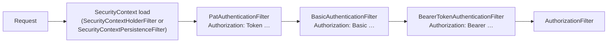

# Authentication Precedence for Mixed Channels: Authorization Header over Cookie

## Status

- **Status:** Design proposal — prerequisite (not implemented)
- **Scope:** OpenL Studio — `org.openl.rules.webstudio` security layer (authentication / identity only)
- **Context:** One server serves a web front end (cookie/session based) and mobile / API / MCP / CLI clients
  (`Authorization` header based).

> [!Note]
> This document covers only the **authentication-precedence** layer — which credential decides identity when more than
> one is present. How a user's **server-side state** (workspace, compiled projects, jobs) is shared across channels is a
> separate design; the near-term plan that consumes this rule is
> [rest-api-token-access.md](rest-api-token-access.md) (the decision of record), with the deferred grand design in
> [principal-scoped-shared-state.md](principal-scoped-shared-state.md) and the prerequisite refactor in
> [decoupling-projectmodel-from-webstudio.md](decoupling-projectmodel-from-webstudio.md). Those depend on the
> precedence rule defined here.

---

## 1. Problem

Two authentication flavors reach the same endpoints:

- **Session-based (implicit)** — form / SAML / OAuth2 login set a `JSESSIONID` cookie the browser attaches
  **automatically** to every request to the domain.
- **Header-based (explicit)** — `Authorization: Basic …`, `Authorization: Token …` (PAT), `Authorization: Bearer …`,
  attached **deliberately** by the client (a mobile app reads the token from its store and sets the header).

When both arrive on one request, "who wins" is currently accidental and uneven:

- `PatAuthenticationFilter` and Spring's `BasicAuthenticationFilter` re-authenticate the header only when the loaded
  session identity **differs** (their `authenticationIsRequired` check); `BearerTokenAuthenticationFilter` has **no**
  such check.
- There is no single, explicit precedence rule.

Separately, cookie-less header requests create throwaway `HttpSession`s inconsistently per mode (see §2) — a resource
leak the state design relies on being fixed.

---

## 2. Current architecture (background)

Key code references (paths relative to repository root):

- PAT filter — [`PatAuthenticationFilter.java:65`](../../STUDIO/org.openl.rules.webstudio/src/org/openl/studio/security/pat/filter/PatAuthenticationFilter.java)
  (`authenticationIsRequired` at line 119: skips only for the **same** already-authenticated user).
- OAuth2 chains — [`OAuth2SecurityConfig.java:90`](../../STUDIO/org.openl.rules.webstudio/src/org/openl/studio/security/OAuth2SecurityConfig.java)
  (`/rest/**`: `securityContextPersistenceFilter`, `patAuthenticationFilter`, `bearerTokenAuthenticationFilter`).
- Form / AD chains — [`FormBasedAuthenticationConfig.java:23`](../../STUDIO/org.openl.rules.webstudio/src/org/openl/studio/security/FormBasedAuthenticationConfig.java)
  (`/rest/**` adds PAT before `BasicAuthenticationFilter`).
- Auto-saving session repo — [`CommonAuthenticationConfig.java:37`](../../STUDIO/org.openl.rules.webstudio/src/org/openl/studio/security/CommonAuthenticationConfig.java)
  (`new SecurityContextPersistenceFilter()` → `HttpSessionSecurityContextRepository`, `allowSessionCreation = true`).

| Mode | `/rest/**` header auth | `/web/**` header auth | Context filter | Auto-saves a session for cookie-less header auth? |
|------|------------------------|-----------------------|----------------|---------------------------------------------------|
| `oauth2` | PAT, Bearer | none (session only) | `SecurityContextPersistenceFilter` (deprecated) | **Yes** — new session per request |
| `saml` | PAT | none (session only) | `SecurityContextPersistenceFilter` (deprecated) | **Yes** — new session per request |
| `ad` / `multi` | PAT, Basic | Basic | DSL default `SecurityContextHolderFilter` | **No** (not auto-saved) |
| `single` | none (anonymous ADMIN) | none | n/a | n/a |

> [!Note]
> CSRF is disabled on **every** chain (`csrf(...).disable()` in all `*SecurityConfig` classes; the hand-built OAuth2/SAML
> chains contain no `CsrfFilter`). See [§8](#8-risks).

---

## 3. Fundamental constraint

> An `HttpSession` is reachable **only** through its `JSESSIONID` cookie. Per the Jakarta Servlet API a session cannot
> be reassigned to a different user and cannot be shared across clients. A bare `Authorization` header carries **no**
> session identity, and the server keeps **no** token-to-session mapping. Matching a token to a user's existing session
> **by username** is rejected (ambiguous, racy, privilege-bleed).

This is why identity precedence and cross-channel state sharing are kept separate: precedence is decided per request
from the credentials present; state is shared per principal — the user's `UserWorkspace` is already per-`userId`,
resolved by the near-term decision of record [rest-api-token-access.md](rest-api-token-access.md), not by reusing a session.

---

## 4. Precedence rule: header over cookie

When a request presents both an `Authorization` header **and** a session cookie, the **header wins**: it determines the
authenticated identity; the session cookie is the fallback used only when no (valid) header is present.

**Explicit over implicit:**

- The `Authorization` header is set **deliberately** by the client — there is no ambiguity about intent.
- The cookie is sent **automatically** by the browser on every request, even when the user merely followed a link — the
  very mechanism that makes CSRF possible.
- Trust the credential sent on purpose. This matches OAuth2 Resource Server conventions (RFC 6750) and is CSRF-resilient:
  a cross-site request cannot set a custom `Authorization` header, so an attacker can ride the ambient cookie but can
  never forge the header that governs identity.

### Identity matrix

| `Authorization` header | Session cookie (owner) | Authenticated identity |
|------------------------|------------------------|------------------------|
| present, user P | absent | **P** (header) |
| present, user P | present, owner **= P** | **P** |
| present, user P | present, owner **= Q ≠ P** | **P** (header wins; cookie ignored for identity) |
| absent | present, owner Q | **Q** (session) |
| absent | absent | anonymous / `401` |

> [!Note]
> A header-authenticated request that is **not** the cookie's owner must not be bound to that cookie's window session or
> have its context written back into it. How a request is bound to (or detached from) per-window state is covered by the
> two-scope state design; here the rule is only that **identity** comes from the header.

---

## 5. Header clients are stateless at the `HttpSession` level

- A header-authenticated request should **not** create a per-request `HttpSession` (today oauth2/saml auto-create one on
  every cookie-less call — a leak). Make header authentication stateless at the servlet-session level, uniformly across
  modes.
- Continuity of the user's heavy state across header calls is provided by resolving the per-principal `UserWorkspace`
  (already per-`userId`) — **not** by an `HttpSession`; the near-term mechanism is the decision of record
  [rest-api-token-access.md](rest-api-token-access.md). A stateless mobile/MCP/CLI client therefore needs no cookie
  round-trip; it resolves its state by authenticated principal.
- The browser front end keeps using its login session unchanged.

---

## 6. CSRF & cookie hardening

- Header-priority already blunts API CSRF: a cross-site attacker cannot forge the `Authorization` header that now
  governs identity, so an ambient cookie alone cannot drive a token-authenticated action.
- Cookie-only **browser** requests remain CSRF-exposed (CSRF is disabled on every chain). Harden with
  `SameSite=Lax`/`Strict` + `Secure` on `JSESSIONID` (today `web.xml` sets only `http-only` + `tracking-mode COOKIE`),
  and add CSRF tokens for state-changing cookie-authenticated requests.

---

## 7. Change surface (auth layer — not implemented)

- Make header authenticators **uniformly authoritative** across all chains (PAT, Basic, Bearer): when a valid header is
  present it determines identity, and a header-authenticated context is **not** persisted into a foreign principal's
  `HttpSession` (the oauth2/saml auto-save path).
- **Stop per-request `HttpSession` creation for header auth**, uniformly across modes (the per-mode inconsistency in §2).
- **Cookie hardening:** `SameSite` + `Secure` on `JSESSIONID`.

Wiring touch points:
[`FormBasedAuthenticationConfig`](../../STUDIO/org.openl.rules.webstudio/src/org/openl/studio/security/FormBasedAuthenticationConfig.java)
(`/rest/**`, `/web/**`), [`OAuth2SecurityConfig`](../../STUDIO/org.openl.rules.webstudio/src/org/openl/studio/security/OAuth2SecurityConfig.java)
(`/rest/**`), `SamlSecurityConfig` (`/rest/**`), and the catch-all chains.

---

## 8. Risks

| ID | Risk | Severity | Likelihood | Mitigation |
|----|------|----------|------------|------------|
| R-1 | **CSRF** on cookie-only browser requests (CSRF disabled everywhere) | High | Med | `SameSite=Lax`/`Strict` + `Secure`; CSRF tokens for state-changing cookie requests; header-priority already protects token-authenticated actions |
| R-2 | **Session-per-request leak** — cookie-less header auth auto-creates an `HttpSession` per call (oauth2/saml) | Med | High | Make header auth stateless at the servlet-session level; unify across modes |
| R-3 | **Bearer URI/query token bypass** — if `DefaultBearerTokenResolver` is ever configured to read `access_token` from URI/form, the "header present?" decision must widen | Low | Low | Keep the header-only resolver; if changed, extend the precedence check to that source |
| R-4 | **Cross-mode inconsistency** — precedence/stateless rules wired into some chains only | Med | Med | Centralize the rule; per-mode integration test of the §4 matrix |
| R-5 | **Foreign-session binding** — a header identity P bound to or written back into Q's cookie session | High | Low | Do not persist a header-authenticated context into a foreign session; detach per the state design |

---

## 9. Open decisions

- **CSRF stance** for cookie-authenticated browser requests — `SameSite` only, or full CSRF tokens for state-changing
  requests?
- State-sharing decisions are owned by the decision of record [rest-api-token-access.md](rest-api-token-access.md)
  (near-term) and its contract/ops companion [rest-token-contract-and-ops.md](rest-token-contract-and-ops.md); the
  deferred grand design is [principal-scoped-shared-state.md](principal-scoped-shared-state.md).
