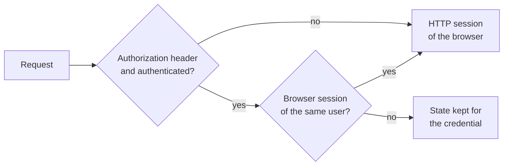

# Client Sessions

OpenL Studio keeps state for each client between its requests: the compiled project, running compilations, test,
run and benchmark results, the debug session, merge conflicts and comparisons. This page describes where that state
lives and when it ends.

## Two Kinds of Clients

- **A browser** signs in once and sends its `JSESSIONID` cookie with every request. Its state lives in its HTTP
  session, as it always has.
- **A client with its own credentials** sends them in the `Authorization` header of every request: a bearer token
  of the identity provider, a personal access token, or Basic authentication. It opens no HTTP session, and its
  state is kept on the server under the credential it came with.

Without the second kind, every request of a client that does not keep cookies opened a new HTTP session. That
session started without a compiled project, so the project was compiled again on every request, and each session
kept its own copy of the project in memory for 30 minutes.

## The Client Scope

State that belongs to one client is declared with `@ClientSessionScope` (`org.openl.studio.session`), never with
`@SessionScope`. The scope, `ClientSessions`, decides per request:

A request that sends credentials together with the session cookie of a browser the same user signed in to is that
browser calling — the API documentation page, for one — and keeps to its session. Credentials of another user never
reach the state of a session they came with.

A credential is told apart by what it stands for, never by the token value:

- **Personal access token** — the user and the token's public id.
- **Identity provider token with `sid`** — the user and the sign-in (`sid`), which stays the same while access
  tokens are refreshed.
- **Anything else** (Basic authentication, client credentials) — the user.

Controllers and services get the beans as before; the scope finds the right instance.

## Lifecycle

- **Idle timeout** — a credential's state ends after the idle time of an HTTP session (`session-timeout` in
  `web.xml`, 30 minutes), counted from the end of its last request. A sweep runs every minute.
- **Running requests** — a credential with a request still running is never idle, however long the request takes.
- **No timeout** — a `session-timeout` of zero or less keeps the state for good, as it keeps HTTP sessions.
- **Application stop or reload** — ends the state of every credential, as a reload invalidates every HTTP session.
- **Destruction** — the same `@PreDestroy` callbacks run as when an HTTP session ends, the latest created bean
  first.

## No Session for a Stateless Request

- **OAuth2 and SAML** — the `/rest/**` chain reads the signed-in user from an existing session
  (`restSecurityContextFilter`, a `SecurityContextHolderFilter` over `HttpSessionSecurityContextRepository`) and
  never saves one. The bearer and PAT filters authenticate the request alone.
- **Database and Active Directory** — the `/rest/**` chain is built by `HttpSecurity`, whose Basic and PAT
  authentication already hold for the request alone.

## The User Workspace

The user workspace is one per user and is shared by every client of the user: browsers and credentials.
`MultiUserWorkspaceManager.acquireUserWorkspace` counts its holders and `releaseUserWorkspace` releases it only when
the last one ends, so one browser signing out leaves it working for the others. The count is cleared even when the
release fails, so a failure never keeps the workspace from being released later.

## Concurrent Use of One Client

Clients never share a `WebStudio`, but the requests of one client do. `WebStudio` holds one current project, so two
parallel callers with the same credential on different projects switch it back and forth and compile on every
switch — as two browser tabs of one session do. Clients that work in parallel use a credential each.
