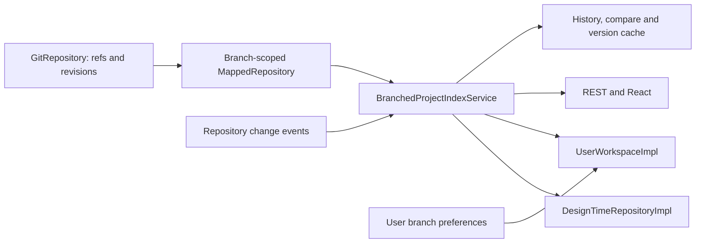

# Cross-Branch Project Discovery

OpenL Studio must discover and manage design-repository projects across every readable Git branch. A project must
remain one logical workspace item while its content, path and permissions may differ by branch.

## Goals

- Discover a project when at least one Git branch contains it.
- Derive project membership exclusively from Git trees.
- Give each branch membership its own repository view, mapped path and file metadata.
- Select a deterministic home branch and a user-specific effective branch.
- Keep project-list and project-read requests independent of repository-wide branch scans.
- Make creation, copy, merge and deletion operate on an explicit branch-scoped repository.
- Publish branch changes before a successful write response is treated as readable.
- Apply authorization separately to every branch membership.
- Preserve the stable branchless project identity used by REST clients and workspaces.

## Architecture

Cross-branch discovery belongs to the workspace layer. Git repositories expose project-agnostic branch and revision
operations, mapped repositories resolve project paths within each branch, and a dedicated service publishes
immutable project snapshots.



The components must have these responsibilities:

- `GitRepository` must enumerate Git branches, resolve branch tips and tree revisions, and create or delete whole
  refs. It must not contain project-membership rules.
- `MappedRepository` must build the external-to-internal project mapping from the selected branch tree.
- `BranchedProjectIndexService` must scan branch views, retain branch snapshots, build the logical-project union and
  publish immutable repository snapshots.
- `DesignTimeRepositoryImpl` must project the published snapshot into logical design projects.
- `UserWorkspaceImpl` must select a readable effective branch and resolve the corresponding branch entry.
- The secure design-repository layer must filter every branch entry before a project or membership set reaches a
  caller.
- REST controllers and UI clients must consume design-repository and workspace contracts instead of accessing the
  shared index directly.

## Project Model

### Logical identity and membership

A logical project is identified by `(repositoryId, internal folder path)`. Every branch agrees on the folder; the
name does not, because the descriptor may name the same folder differently on another branch. `ProjectKey` and the
Base64 `projectId` must remain branchless.

The name is what a branch shows, not what identifies. A project is displayed under the name of its home branch,
and a lookup by name must find it whichever branch the caller took the name from: a mapped name carries the folder
next to the branch's name for it, so it is matched on the folder.

Each logical project must contain one entry for every readable branch whose Git tree contains the project:

```text
logical project
    → home branch
    → branch name → branch project entry

branch project entry
    = external name + internal path + branch-scoped Repository + FileData
```

The entry must retain the external name, internal path, branch-scoped repository and `FileData` discovered at the
recorded branch tip. A path, mapping or revision from one branch must never stand in for another branch.

Two folders may end up with the same displayed name — a branch that renames one of them, or a descriptor that names
them alike — and they remain separate logical projects, because the folder tells them apart. Project creation still
enforces repository-wide name uniqueness, so a name collision is something branches produce rather than something a
user can create.

A mapped repository must show each folder under the name its descriptor declares, and must never invent a suffix to
make two of them differ. The folder hash the external name already carries keeps the mapping unambiguous, while an
invented name shows a project the repository does not contain and hides which folder it stands for.

### Home branch

The home branch must be deterministic:

1. The repository base branch wins when it contains the project. Matching is case-insensitive, and the actual ref
   spelling must be retained.
2. Otherwise, the branch with the newest tip commit wins.
3. Equal tip times are ordered by case-insensitive branch name and then by exact branch name.

When authorization removes the global home entry, the same rule must select a home from the caller's readable entries.

### Effective branch

The effective branch is user-specific and must be selected from readable memberships in this order:

1. the branch of an opened local copy;
2. a durable closed-project preference;
3. the readable home branch.

The preference key must be `(user, repositoryId, external project name)`. A preference is workspace state, not
repository membership. It must be removed when the selected branch no longer contains the project or is not readable
by the user.

An opened local copy must be associated by `(repositoryId, external project name)` before branch selection. Internal
paths cannot be used for this association because mapped paths may differ by branch.

Each dependency must keep its own effective branch. Resolving a dependency must not switch it to the declaring
project's branch.

A dependency must be resolved inside the branch of the declaring project. A project of the same repository counts
only when that branch contains it — membership comes from the index, not from the branch the workspace happens to
show the project on. A name the branch does not contain stays unresolved and is reported as missing, because the
copy another branch keeps is a different version of the same content rather than another project.

The declaring project's branch scopes the lookup and nothing else. It decides membership; it never becomes the
resolved dependency's branch. The dependency keeps its own effective branch, and that branch is what selects the
version compiled and opened — which is why a dependency the workspace shows on another branch is reported as
such, for the user to switch, rather than silently re-pointed.

Another repository is the exception to the scope: nothing keeps the branches of two repositories in step, so a
match there counts whatever branch it is on. The same rule decides which projects a project reports as its
dependents.

The declared dependencies and everything they pull in are both reported, and each says which of the two it is, so
the list can be read against the `rules.xml` that declares only the direct ones.

## Repository and Mapping Contracts

### Branch operations

`BranchRepository` must expose explicit project-agnostic operations:

- `listBranches()` returns local and remote-tracking branch refs.
- `getBranchStatuses(branches)` resolves branch tips in one batched read.
- `getBranchTreeRevisions(branches, path)` resolves branch and tree state in one batched read.
- `createRepositoryBranch(branch, startPoint)` creates a whole Git ref.
- `deleteRepositoryBranch(branch)` deletes a whole Git ref.
- `forBranch(branch)` returns a repository view scoped to that branch.

Tags must not satisfy branch selection, even when a tag and branch have the same short name. A tag must not prevent
creation of a real branch with that name.

A tree-revision result must distinguish:

- a resolved branch with a tree at the requested path;
- a resolved branch without a tree at the requested path;
- an unresolved branch.

It must also indicate whether a changed tip affects the requested path relative to at least one parent. This
distinction is required for merge commits whose final tree object matches an earlier tree while project revision
metadata must advance.

Whole-ref creation and deletion must remain separate from project content operations. Creating a branch copies the
complete start-point tree. Deleting a branch deletes the whole ref. Project creation and deletion must use ordinary
writes through a branch-scoped repository view.

### Branch-specific mappings

Every branch-scoped `MappedRepository` must build its own `ProjectIndexCache` from that branch tree. A project that is
added, moved, renamed or remapped in one branch must be discovered without using another branch's mapping.

`generateExternalToInternalMap()` must scan the physical repository root. The configured rules location is a virtual
external prefix and must not limit the physical discovery tree.

Immutable mapping data may be reused only when the complete physical discovery-root tree revision is identical.
Parsed project names may be reused only when the `rules.xml` blob revision is identical.

Project creation and copy must apply `FileMappingData` within the selected target branch. A custom target path must
therefore resolve through the target branch mapping.

The mapping scan must follow these rules:

- Git entries with mode `160000` are submodules, not folders, and must not be traversed.
- A folder returned from a branch tree is present in that branch and must not be compared with another branch.
- Discovery must not call lazy audit accessors such as author, date, comment or version.
- Descriptor and Excel discovery must use Git tree and blob revisions for reuse and invalidation.

## Index Contract

### Snapshot data

`BranchedProjectIndexService` must own one published snapshot per branch-capable design repository:

```text
repository snapshot
    → branch name → (tip revision, discovery-root tree revision, projects by internal folder path)
    → internal folder path → (display name, home branch, entries by branch)
```

Published records and collections must be immutable. A new generation must be assembled separately and replace the
published snapshot atomically so readers never observe a partial scan.

Membership fields must not mutate after publication. `FileData` may lazily memoize audit fields, and a
branch-scoped `Repository` may remain a live view, but neither may change the membership represented by the snapshot.

The index must be reconstructible from Git and held in memory. Project membership must not depend on a shared
registry or persistent index file.

### Health

Repository index health must use these states:

- `INDEXING` — the complete snapshot has not been published. An early snapshot that maps the default branch's
  projects across their branches may already be served.
- `READY` — every enumerated branch has a successful snapshot.
- `DEGRADED` — at least one branch uses last-known-good data or has no successful snapshot.

REST values must be the lowercase strings `indexing`, `ready` and `degraded`. Diagnostics may include failed branch
names and a sanitized error, but must never expose credentials, repository URIs or provider exception details.

Index diagnostics must require repository-level `READ`. Project-level access alone must not reveal failed branch
names or repository diagnostics.

### Refresh lifecycle

Refreshes must run outside request threads and follow these rules:

- Initialization must materialize the configured-branch listing and start the first branch-wide build.
- Until a snapshot exists, a build must publish a usable one before scanning every branch: it must index the
  default (base) branch first and list its projects across the branches that still hold them, so those projects
  are not confined to the default branch while the rest of the scan runs. Projects that live only on non-default
  branches appear when that scan completes. A build that already has a published snapshot to serve must not
  repeat this early pass.
- The configured-branch listing must remain available only until the first snapshot is published; afterwards the
  published snapshot is served even while its health is still `INDEXING`.
- Repository change events must mark the repository dirty and schedule a batched status check.
- A successful Studio write must invalidate the affected branch directly.
- One coordinator per repository may run at a time.
- Different repositories may scan concurrently.
- Branches within one repository must scan sequentially because branch-view creation shares the Git lock.
- Events received during a build must be coalesced and trigger another pass.
- Each branch scan must capture the tip before scanning and verify it again before publication.
- A result for a branch whose tip changed during the scan must be discarded and retried.
- Requests must continue to use the last published immutable snapshot during a rebuild.
- Shutdown must cancel queued work and prevent an obsolete generation from publishing.

A refresh must reuse a branch snapshot when its tip is unchanged. When the tip changes, it must resolve the discovery
tree revision and reuse the mapping only when the tree revision and path-affecting status permit it. Changed branch
metadata must still advance for a merge tip that affects the discovery root.

A branch absent from `listBranches()` must be removed. If an enumerated branch has no status result, the service must
retain last-known-good data and skip an unindexed branch. A failed scan must likewise retain last-known-good data and
mark health `DEGRADED`; it must not replace known membership with an empty listing.

Publishing a snapshot — both the early default-branch snapshot and the complete one — must refresh the
logical-project projection and send the project-change notification. Each OpenL Studio node must own its index and
converge independently through repository change monitoring.

Project-list and project-read requests must never enumerate branches, create branch views or scan Git trees. A
steady refresh must use one batched status lookup and scan only branches whose relevant state changed.

### Design repository projection

For a branch-capable repository, `DesignTimeRepositoryImpl` must create one branch `AProject` per membership and one
logical project bound to the home entry.

The design repository must expose branch-aware accessors for:

- the branch entries of `(repositoryId, external project name)`;
- the branch project for `(repositoryId, external project name, branch)`;
- repository index health.

Snapshot projection must not resolve Git audit versions for every membership. Audit metadata must remain lazy, and a
completed lazy lookup must release retained commit references. Version-cache history reads must use disposable
project views.

## Authorization

Authorization must be evaluated per branch entry because ACL identities use `(repositoryId, internalPath)` and mapped
paths may differ by branch.

- A branch entry must require `READ` permission on its internal path.
- A logical project must be visible when at least one entry is readable.
- Home and effective branch selection must use readable entries only.
- Membership responses must expose readable entries only.
- Branch-aware accessors must return secured repository and project views.
- Shared raw repository views from the index must not reach controllers or workspace callers.

Project creation must require repository `CREATE`. Ref creation must pass through the secured repository decorator and
require repository-level `WRITE`. Protected-branch authorization must run against the resolved target branch and its
canonical ref spelling.

Conflict-resolution merges must require `WRITE` permission for every resolved file. A merge without explicit conflict
resolutions may follow the normal merge authorization path.

Authorization failures must be returned as forbidden. A caller who cannot read a conflicting project may receive a
generic name-conflict response, but the response must not reveal the hidden branch or path.

## REST and UI Contract

### Project branch data

`ProjectViewModel.branch` must carry only the effective branch. Project-list and project-detail responses must not
repeat the complete membership set.

`GET /projects/{projectId}/branches` must read the project's published snapshot and return only readable
memberships. Each `ProjectBranchInfo` must carry the branch name and true-valued base or protected marks; false marks
must be omitted. The endpoint must not enumerate repository-wide refs or resolve lazy audit metadata.

`GET /repos/{repo-name}/branches` must return a sorted list of actual repository refs for branch selection and
whole-ref workflows.

The Projects table, breadcrumb and Overview branch switchers must render the effective branch and load membership
from the project branch endpoint only when opened.

Manage Branches must display actual project membership as read-only data. Project copy, project deletion, branch
creation and branch deletion must remain explicit operations with separate permission checks.

### Filtering, merge and deployment

`GET /projects?branch=X` must perform a case-insensitive substring match against every readable branch that contains
the project. Filtering must not be limited to the effective branch.

A clean project must be eligible to synchronize when its repository contains another branch. The merge target need
not contain the project; a merge may introduce the project into that branch.

Deployment must retain its backend base-branch validation. UI visibility or enablement must not be the only
deployment restriction.

History, comparison, archive/export and version-cache consumers must resolve projects through branch-aware workspace
and index APIs. A historical lookup must retain its requested branch even when that branch has no project membership
at its tip.

## Project Creation and Copy

### Request model

Every project creation mode must accept the same optional `branch` value:

- archive upload;
- Excel file creation;
- OpenAPI creation;
- template creation;
- project copy;
- publish from workspace.

Multipart creation must use a request parameter. JSON models for copy and publish must carry the equivalent
component.

For a branch-capable repository, every New Project mode must show one **Branch** `SuggestInput`. It must suggest actual
repository refs, accept a free-form valid name and preselect the configured branch. A repository without branch
support must not show or submit the field.

The server must determine whether the submitted name exists. The request must not carry a separate create-branch
flag.

### Target resolution

The target resolver must:

1. trim and validate the submitted value;
2. match an existing branch case-insensitively and retain its actual ref spelling;
3. use the matching branch-scoped repository view;
4. create a valid absent branch from the repository base branch;
5. prepare an unborn branch view when the repository has no refs;
6. use the configured repository view when the value is omitted.

Selecting the configured base branch in an empty repository must prepare that view for the first write. Selecting
another valid name in an empty repository must prepare an unborn view whose first project write establishes the
selected ref.

Branch validation must apply Git structural rules and repository configuration before any absent ref is created. UI
validation must mirror the backend rules, while the backend remains authoritative and returns `branch` field errors.

Project and request validation must finish before ref creation. The branch-scoped repository must be resolved before
the project write.

### Write flow

The resolved `Repository`, not only its id, must flow through archive, builder, copy and publish services.

The write flow must:

1. validate repository create capability, target-branch protection and global logical-name uniqueness;
2. resolve or create the target branch through secured repository APIs;
3. write through the branch-scoped mapped and path-checked repository;
4. enforce per-file `CREATE`, `WRITE` and `DELETE` permissions for archive replacement;
5. finalize the project ACL and extensible tags from the branch-scoped project returned by the writer;
6. request a targeted index refresh and wait for publication;
7. resolve workspace status from the exact target branch and indexed external name;
8. return the creation result.

The archive lock identity must include the target branch.

Normal creation must reject an external name that identifies any logical project in the repository, including a
membership hidden from the caller. Archive replacement is valid only when that project belongs to the selected
branch. A membership in another branch is a name conflict.

Project copy must resolve the readable source by business name within the selected source repository. The name must
identify exactly one readable source. An ambiguous same-named source must be rejected.

Branch-aware lookup must apply the same case-insensitive business-name fallback to mapped projects. A path-derived
external suffix must not prevent duplicate detection, overwrite validation, branch switching or status resolution.

Excel, OpenAPI and template creation must open the project by default. Archive creation must leave it closed by
default. An explicit requested status must override the applicable default.

Workspace open and refresh after publication are best effort. Their failure must not convert a committed, indexed
creation or copy into a generic failure response.

If targeted publication fails or times out, the Git write and finalized metadata must remain durable. The response
must report incomplete indexing instead of normal success, and a later refresh must make the project visible.

Creating a branch from a base branch copies the complete tree. Every base-branch project must therefore gain
membership in the new branch after indexing. A newly written project that exists only in the target branch must use
that branch as its home.

## Project Deletion

Project deletion must act on the effective branch only. It must remain separate from whole-ref deletion.

The validator must allow deletion from any unprotected branch that contains the project while preserving lock,
version and permission checks. The delete service must require project-level `DELETE`, retain the selected
branch-scoped view and avoid replacing authorized project deletion with a parent-repository delete requirement.

Other users' local copies must close only when `(repositoryId, branch)` matches the deleted membership.

The deletion flow must:

1. capture the deleted entry's external identity and ACL path;
2. delete through the effective branch repository;
3. invalidate the affected branch and wait for its snapshot publication;
4. keep the logical project when another readable or hidden membership survives;
5. remove the captured ACL only when no surviving membership uses that path or a covered descendant.

Mapped repositories must use the external design-project identity, which pairs the declared name with the folder
hash, for the post-delete lookup. A display name is not a sufficient index key.

ACL cleanup must use a successfully refreshed snapshot. A scan failure, concurrent branch change or timeout must
retain the ACL. A later successful refresh may perform deferred cleanup.

ACL identity does not include a branch. Entries at the same internal path share ACL behavior across branches.
Entries at disjoint mapped paths retain distinct ACL identities.

## Required Outcomes

- A project that exists in one non-base branch must appear as one logical project to every authorized user.
- A project that exists in several branches must expose only readable memberships.
- The base branch must be home when it contains the project.
- A project without base-branch membership must use the deterministic home selection.
- An opened local branch must override a durable preference, and a valid preference must override the home branch.
- Removing or hiding the effective membership must fall back to the readable home branch.
- Branch switching must use the selected branch's mapped path and repository view.
- Creation in an existing branch must not create or modify another ref.
- Creation in a valid absent branch must create that ref from the base branch and write only through its view.
- Creation in an empty repository must establish the selected branch on the first write.
- Invalid branch names must fail validation before ref creation.
- Every creation mode must use the same branch resolution, permission and protection rules.
- A normal successful write response must guarantee that the published index contains the new membership.
- Deleting one membership must leave the logical project visible while any membership survives.
- Deleting a project must not delete its branch.
- Deleting a branch must remain a whole-repository operation.
- Project reads must use published snapshots and must not scan repository branches.
- Git trees must remain the sole source of project membership.
