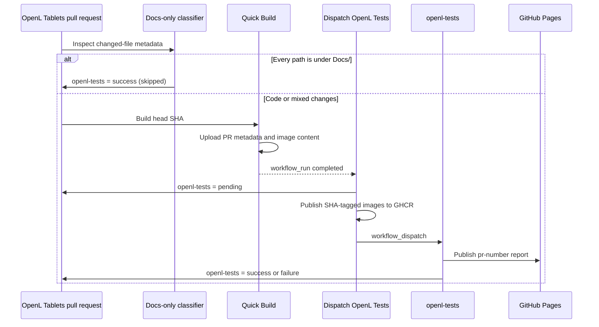

# Cross-Repository End-to-End Gating

OpenL Tablets pull requests are gated by the end-to-end suite in the separate
[`openl-tablets/openl-tests`](https://github.com/openl-tablets/openl-tests) repository. GitHub commit statuses join
the two workflows without making either workflow poll the other.

## Flow

`Quick Build` uploads the pull request number and head SHA separately from the compiled OpenL Studio and OpenL
Rule Services web applications. `Dispatch OpenL Tests` runs from the default branch in the base repository, which
gives fork pull requests access to the required repository credentials without exposing them to pull request code.
It validates the artifact against the current pull request, builds images with the trusted default-branch
`Dockerfile`, and publishes these tags:

- `ghcr.io/openl-tablets/webstudio:pr-<number>-<head SHA>`
- `ghcr.io/openl-tablets/ws:pr-<number>-<head SHA>-all`

The test workflow publishes pull request reports at
`https://openl-tablets.github.io/openl-tests/pr-<number>/`. A new head commit cancels the older test run for that
pull request and replaces its report. Standalone `openl-tests` runs keep their existing `runs/<run id>/` paths and
retention policy.

Quick Build ignores pull requests whose changed files are all under `Docs/`. The `Skip OpenL Tests for
documentation` workflow handles those pull requests and posts `openl-tests` as successful without running the build
or suite. It uses `pull_request_target` so the base-repository status token is available for forks, but it only reads
GitHub's changed-file metadata and never checks out or executes pull request code. Renames are documentation-only
only when both the old and new paths are under `Docs/`; mixed documentation and code changes run the normal gate.

If Quick Build or the dispatch chain fails before the suite starts, the dispatch workflow reports `failure` instead
of leaving a permanent pending status.

## One-Time GitHub Setup

Create one GitHub App owned by the `openl-tablets` organization.

- Grant repository permission **Actions: Read and write** so the OpenL Tablets workflow can dispatch
  `openl-tests`.
- Grant repository permission **Commit statuses: Read and write** so `openl-tests` can update an OpenL Tablets
  commit.
- Install the app on both `openl-tablets/openl-tablets` and `openl-tablets/openl-tests`.
- Create an app private key. Store its complete PEM value as the organization Actions secret
  `E2E_APP_PRIVATE_KEY`, with access to both repositories.
- Store the numeric app ID as the organization Actions variable `E2E_APP_ID`, with access to both repositories.

Each workflow mints a token for only the destination repository and permission it needs. The OpenL Tablets
workflow uses its own `GITHUB_TOKEN` for the same-repository pending or orchestration-failure status and to publish
the pull request images to GHCR.

In the OpenL Tablets repository settings:

- Enable **Allow auto-merge** under general pull request settings.
- Add the exact status context `openl-tests` to the required status checks in the ruleset or branch protection rule
  for every protected merge target.
- Confirm that the repository's Actions workflows can write the `webstudio` and `ws` organization container
  packages. Grant repository Actions access on an existing package if that package does not inherit access.

The `workflow_dispatch` trigger in `openl-tests.yml` must be present on the `openl-tests` default branch before the
OpenL Tablets dispatch workflow is enabled. Merge the `openl-tests` change first, then the OpenL Tablets change.

## End-to-End Verification

1. Open an OpenL Tablets pull request from a repository branch. Confirm Quick Build uploads
   `openl-e2e-metadata` and `openl-e2e-image-context`.
2. Confirm `Dispatch OpenL Tests` posts a pending `openl-tests` status on the pull request head SHA, publishes both
   SHA-tagged images, and starts `OpenL Tests` in the other repository.
3. Confirm the test run publishes `pr-<number>/`, its final status links to that report, and a passing run changes
   `openl-tests` to success without a manual update.
4. Repeat from a fork. Confirm the dispatch succeeds even though the pull request workflow itself cannot read the
   app credentials.
5. Enable auto-merge on a throwaway pull request, push a temporary change that deterministically violates an E2E
   assertion, and leave the run to finish. Confirm `openl-tests` is failure and the pull request remains unmerged.
   Revert that temporary change in a new commit and push again. Confirm the old E2E run is cancelled, the status on
   the new head SHA becomes success, and auto-merge completes without human intervention.
6. Open a documentation-only pull request. Confirm Quick Build and the E2E suite do not run, and `openl-tests`
   reports success with the description `OpenL Tests skipped for documentation-only changes`.
7. Add a file outside `Docs/` to the same pull request. Confirm the skip workflow does not report success on the new
   head SHA and the normal Quick Build and E2E chain runs.

For an infrastructure failure before a report can be built, the failure status links to the responsible workflow
run. Test failures link to the published per-pull-request report.
