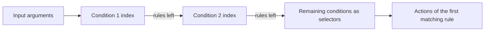

# Decision Table Condition Indexing

How a decision table finds the rules to fire without checking every row. Each indexable condition column is turned
into a lookup structure at compile time, and at run time the columns are applied one after another, each one
narrowing the set of rules left by the previous one.

## The chain of indexes

`DecisionTableAlgorithmBuilder` picks one evaluator per condition, then `DecisionTableOptimizedAlgorithm` orders
the conditions and builds the chain:



- Indexed conditions come first, ordered by evaluator priority; conditions that cannot be indexed become selectors
  over whatever rules are left.
- A rule with an empty condition cell matches anything, so it stays in the result of every lookup.
- The order of the rules is preserved, so the table still fires the first matching rule.

## Index kinds

- **Equals** — one column value per rule, looked up by the value the table input evaluates to.
- **Contains in a column array** — the column keeps an array of values, and a single input value is looked up in it.
- **Contains in an input array** — the column keeps a single value and the input is an array; every element of the
  array is looked up and the matching rules are merged.
- **Range** — the column defines a boundary, and the matching rules are found by a binary search.

Every kind exists in two representations. The older one keeps a separate subtree of rules per value; the newer one
keeps flat arrays of rule numbers and merges them with the rules left by the previous condition. The newer
representation is what keeps the memory of large tables flat, so a new index kind should always use it.

The two representations cannot be mixed in any order: an older index does not receive the result of the previous
condition, it is built for one node of it instead. Evaluator priorities keep the older kinds first, so the ordering
falls out of `IConditionEvaluator` priority constants rather than being enforced separately.

## Indexed condition expressions

A condition is indexed when its expression is one of the shapes below, where `input` is a decision table argument
(or a path starting from one) and `column` is the condition column parameter.

| Expression | Column parameter | Index |
|---|---|---|
| `input` | a single value | Equals |
| `input` | an array | Contains in a column array |
| `input` | two boundaries | Range |
| `input == column` | a single value | Equals |
| `contains(column, input)` | an array | Contains in a column array |
| `contains(input, column)` | a single value | Contains in an input array |
| `input >= column`, `input < column`, … | a single value or two boundaries | Range |

`contains(input, column)` is indexed only when the input is an array of single values: an array column or a range
column keeps the default evaluator, because those are served by the other index kinds.

Several lookups over the same array may be joined by `or`:

```
contains(codes, code) or contains(codes, linkedCode)
```

Every value is registered in one index, so a rule is found by any of its values. The values may be declared by
other condition columns of the same table, as long as those columns hold values rather than formulas and their
type is the same.

## Conditions that start with a static check

A condition may guard the indexed part with a check on the table inputs only:

```
isEmpty(codes) or contains(codes, code)
isNotEmpty(codes) and contains(codes, code)
isNotEmpty(code) ? contains(codes, code) : fallback
```

Such an expression is split in two. The check is compiled as a static method that runs once per table call, and the
lookup is compiled as the indexed expression. The static answer then decides what the index does:

- **or** — a static `true` returns every rule of the index without a lookup, anything else runs the lookup;
- **and** — a static `true` runs the lookup, anything else leaves only the rules with an empty condition cell;
- **? :** — a static `true` runs the lookup, anything else answers the whole condition with the last part: every
  rule of the index when that part is `true`, and only the rules with an empty condition cell otherwise.

The split is applied only when the check uses the table inputs alone and the looked up part is one of the indexed
shapes. In the ternary the last part is a second static check, so it has to read the table inputs alone as well. A
check that reads the condition column answers differently from rule to rule, so such a condition keeps the default
evaluator.

## Falling back

Indexing is skipped, and the condition is evaluated row by row, when:

- the expression is not one of the shapes above;
- the condition cells contain formulas;
- the condition uses `$Rule` or `$RuleId`;
- the condition uses the parameters of another column in any shape but the chain of lookups above;
- the column and the input types cannot be converted to each other.

The fallback is always available, so an unrecognized expression costs performance, never correctness.

## Where the code lives

- `org.openl.rules.dt.algorithm.DecisionTableAlgorithmBuilder` — prepares conditions and picks the evaluators
- `org.openl.rules.dt.algorithm.DecisionTableOptimizedAlgorithm` — orders the conditions, builds and walks the chain
- `org.openl.rules.dt.algorithm.DependentParametersOptimizedAlgorithm` — recognizes the expressions that mention the
  column parameters, such as `input == column` and `contains(input, column)`
- `org.openl.rules.dt.algorithm.evaluator` — one evaluator per index kind, plus the selectors used without an index
- `org.openl.rules.dt.index` — the index structures themselves
