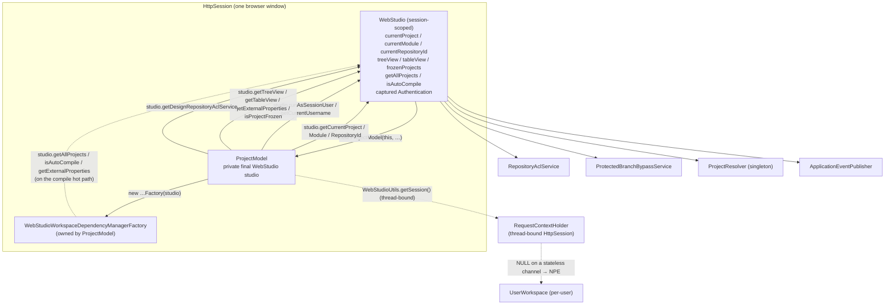
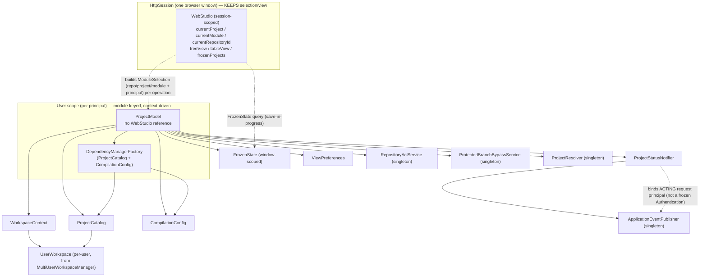
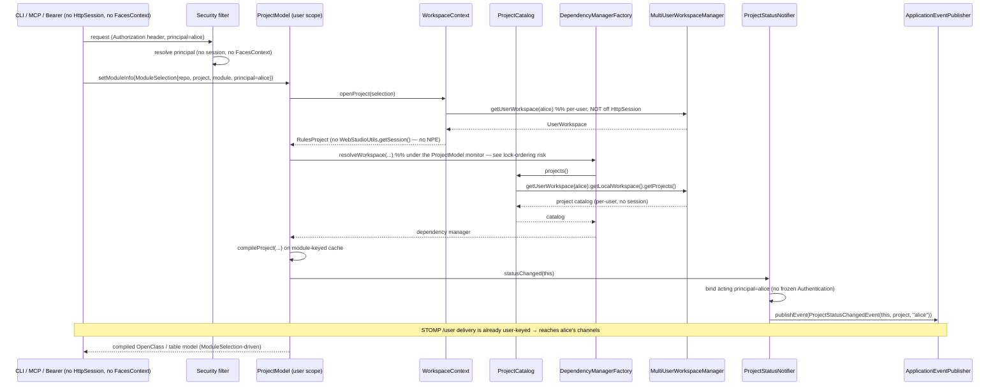

# SPIKE: Decoupling `ProjectModel` from `WebStudio`

## Status

- **Status:** Spike (design for implementation)
- **Type:** Prerequisite refactor — no user-visible behavior change
- **Companion:** [Two-Scope Server-Side State for OpenL Studio](principal-scoped-shared-state.md). That document moves
  the compiled `ProjectModel` into a principal-keyed **user scope** shared across channels. It names this spike as the
  **#1 blocking risk**: *"`ProjectModel` holds a `WebStudio` back-reference … the back-reference and the in-model
  session-thread lookups must be removed or replaced with a channel-supplied context before the model can be shared."*
  This document is that work, scoped narrowly and made compile-safe and incremental.
- **Consumed by:** the near-term decision of record [rest-api-token-access.md](rest-api-token-access.md) requires
  Steps 0–3 here as its prerequisite.

## 1. Problem Statement

`ProjectModel` is the compiled view of an OpenL project: it owns the compiled `OpenClass`, the project tree, the
async compile cycle, and the module-keyed compiled cache. To reuse one compiled model per **principal** across every
channel (browser, CLI, MCP, Bearer), it must stop depending on a single browser window's session.

Today it cannot. `ProjectModel` is constructed by the session-scoped `WebStudio`:

- `WebStudio` builds it eagerly in its constructor: `model = new ProjectModel(this, testSuiteExecutor)`
  (`WebStudio.java:207`).
- `ProjectModel` stores the owner as `private final WebStudio studio` (`ProjectModel.java:167`), captured in the
  two-arg ctor (`ProjectModel.java:186-190`; test-only one-arg ctor at `:182-184`).
- Through that field, nearly every public method reaches into per-window **selection state**
  (`studio.getCurrentProject()`, `getCurrentModule()`, `getCurrentProjectDescriptor()`, `getCurrentRepositoryId()`),
  **session-captured security state** (`studio.runAsSessionUser(...)`, `studio.getCurrentUsername()`), and **view
  preferences** (`studio.getTreeView()`, `studio.getTableView()`).
- It also reaches the session **directly**, bypassing the field, via the static `WebStudioUtils` facade:
  `WebStudioUtils.getUserWorkspace(WebStudioUtils.getSession())` (`ProjectModel.java:1046`, `:1590-1591`) and
  `WebStudioUtils.getWebStudio()` (`ProjectModel.java:1230`). These resolve the `HttpSession` off Spring's
  thread-bound `RequestContextHolder`.

### Why it is the #1 blocker

A stateless channel (CLI / MCP / Bearer) has **no** `FacesContext` and **no** `HttpSession`. On such a channel:

- `WebStudioUtils.getSession()` returns `null` (no `ServletRequestAttributes` on the thread), so `getLocalRepository()`
  NPEs (`ProjectModel.java:1045-1048`) and `getSearchScopeData(CURRENT_PROJECT)` NPEs (`:1230`), while
  `initHistoryStoragePath()` silently no-ops, leaving `historyStoragePath` null (`:1589-1598`).
- A user-scoped model would still hold `studio` — a back-pointer to **one specific window's** `WebStudio` — so every
  other channel of the same principal would read that one window's selection, that one window's view toggles, and a
  stale captured `Authentication` from `runAsSessionUser` (`WebStudio.java:173,221,1576-1584`).

So the model cannot be shared until the back-reference and the thread-bound session reads are replaced by collaborators
that work without a window. Every later step in the companion design (user-scope registry, job sharing, eviction)
sits on top of this. It is the structural precondition.

## 2. Coupling Inventory

Complete inventory of every `ProjectModel` dependency on `WebStudio` / request / session / JSF / security state, with
its **true** underlying collaborator and **target scope**. All `file:line` from the investigation. The field is named
`studio` (there are no `webStudio.`-prefixed uses). The `webStudioWorkspaceDependencyManager*` members are **not** the
`studio` field — they are `ProjectModel`-owned and excluded.

> [!Note]
> Scope legend: **window** = per-`HttpSession` selection/view state; **user** = per-principal collaborator;
> **global** = process-wide singleton service; **self** = a spurious round-trip back into this same `ProjectModel`.

### 2.1 Structural injection (the back-reference itself)

| # | Call site (`ProjectModel.java`) | What it does | True dependency | Target scope |
| --- | --- | --- | --- | --- |
| 1 | `:167` field `private final WebStudio studio` | Single coupling point all method deps flow through | A bundle of user-scoped services + window selection — decompose into the ports below | user |
| 2 | `:186` ctor param `studio` (test ctor `:182`; caller `WebStudio.java:207`) | `WebStudio` passes `this`; captured into the field | The set of ports in §3 | user |
| 3 | `:188` `new WebStudioWorkspaceDependencyManagerFactory(studio)` | Seeds the dep-manager factory with the whole `WebStudio` — see §2.9 for the **three** reads it actually makes | A project catalog + auto-compile flag + external properties — pass concrete collaborators, not `WebStudio` | user/global |

### 2.2 Selection reads (the real per-window coupling)

| # | Call site (`ProjectModel.java`) | What it does | True dependency | Target scope |
| --- | --- | --- | --- | --- |
| 4 | `:193` `getProject()` → `studio.getCurrentProject()` | The model's notion of "the project I model". Called from ~12 sites (editability, tree, branch protection, history path, status events): `:553`, `:570`, `:685`, `:729`, `:741`, `:756`, `:783`, `:1436`, `:1450` (×2), `:1595`, `:1634` | Current open `RulesProject`, resolved from `UserWorkspace` by repo id + project folder (`WebStudio.java:385-391,436-443`) | window |
| 5 | `:689-690` `isEditable()` → `studio.getCurrentModule()` (×2) | Resolve the selected module to an artefact | Current module selection | window |
| 6 | `:706` `isEditableProjectDescriptor()` → `studio.getCurrentProject()` | Resolve selected project for descriptor edit/create check | Current project selection | window |
| 7 | `:728` `getCanSave()` → `studio.getCurrentModule()` | When no module selected, project-level WRITE governs Save | Current module selection | window |
| 8 | `:740` `getCanUpdate()` → `studio.getCurrentModule()` | When no module selected, project-level WRITE/CREATE/DELETE governs Update | Current module selection | window |
| 9 | `:807` `buildProjectTree()` → `studio.getCurrentModule()` (guard) | Build the tree only when a module is open | Current module selection | window |
| 10 | `:997` `createNode()` → `studio.url("table?…id="+id)` | Build the front-end table-view hash URL from current repo/project/module | A link builder seeded with current selection — a presentation concern (or no URL on a non-JSF channel) | window |
| 11 | `:1047` `getLocalRepository()` → `studio.getCurrentRepositoryId()` | Pick the local repo for the selected repository id | Current repository-id selection | window |
| 12 | `:1092` `getCurrentProjectTableSyntaxNodes()` → `studio.getCurrentProjectDescriptor().getName()` | Scope syntax nodes to the selected project | Current `ProjectDescriptor` selection | window |
| 13 | `:1178` `reset(FORCED)` → `studio.getCurrentModule()` | On forced reload, reopen the selected module | Current module selection | window |
| 14 | `:1605` `getCurrentModuleWorkbook()` → `studio.getCurrentModule()` | Find the workbook matching the selected module's rules root | Current module selection | window |
| 15 | `:1230` `getSearchScopeData()` → `WebStudioUtils.getWebStudio().getCurrentModule()` (static, **not** the field) | Decide whether to include CURRENT_MODULE results | Same as the field's `getCurrentModule()`; inconsistency worth removing | window |

### 2.3 Security / principal reach (frozen authentication)

| # | Call site (`ProjectModel.java`) | What it does | True dependency | Target scope |
| --- | --- | --- | --- | --- |
| 16 | `:1434` `doPublishStatusChanged()` → `studio.runAsSessionUser(Runnable)` | Bind the session's **captured** `Authentication` onto the notifier worker thread so `getProject()` (SecureUserWorkspace) works off-request (`WebStudio.java:221,1576-1584`) | The acting principal/`Authentication` to run as — must be the originating request's, not a long-lived captured field | window |
| 17 | `:1440` `doPublishStatusChanged()` → `studio.getCurrentUsername()` | Stamp the status event with the acting user name (`WebStudio.java:1162-1164`) | The originating user name (session principal) | window |

### 2.4 Outbound notification (the reverse seam)

| # | Call site (`ProjectModel.java`) | What it does | True dependency | Target scope |
| --- | --- | --- | --- | --- |
| 18 | `:1414` `publishStatusChanged()` → `studio.getEventPublisher()` | Obtain Spring `ApplicationEventPublisher` to emit `ProjectStatusChangedEvent` (only consumer: `ProjectStatusWebSocketPublisher`) | A status-changed notification sink — `ProjectModel` should only fire, not know Spring's bus | global |

Fired from `addCompiledDependency` (`:1279`), `setModuleInfo` single-module path (`:1349`), and `compileProject`
(`:1371` via `whenComplete`, `:1397`). The publish path needs three things from `WebStudio` (#16, #17, #18) — they
collapse into one outbound port (§3).

### 2.5 View preferences (incidentally on `WebStudio`)

| # | Call site (`ProjectModel.java`) | What it does | True dependency | Target scope |
| --- | --- | --- | --- | --- |
| 19 | `:817` `buildProjectTree()` → `studio.getTreeView().getBuilders()` | The `TreeNodeBuilder[]` that groups/sorts the tree per the user's tree-view mode | The user's `RulesTreeView` preference | user |
| 20 | `:1574` `getTableEditorModel()` → `studio.getTableView()` | Render the editor in developer/business view (`WebStudio.java:466-468`) | The user's table-view preference | user |

### 2.6 Services `WebStudio` merely holds (no real `WebStudio` need)

| # | Call site (`ProjectModel.java`) | What it does | True dependency | Target scope |
| --- | --- | --- | --- | --- |
| 21 | `:559` `getAllEditableWorkbookNodes()` → `studio.getDesignRepositoryAclService().isGranted(...)` | Filter workbooks to those the user may WRITE | `RepositoryAclService` (design-repo ACL), principal-bound | global svc / user principal |
| 22 | `:696` `isEditable()` → `getDesignRepositoryAclService().isGranted(module, WRITE)` | WRITE check on the selected module | Same ACL service + principal | global svc / user principal |
| 23 | `:711,:717` `isEditableProjectDescriptor()` → ACL `isGranted(..., WRITE/CREATE)` | Edit/create check on `rules.xml` | Same ACL service + principal | global svc / user principal |
| 24 | `:730` `getCanSave()` → ACL `isGranted(project, WRITE)` | Project-level Save check | Same ACL service + principal | global svc / user principal |
| 25 | `:742` `getCanUpdate()` → ACL `isGranted(project, WRITE/CREATE/DELETE)` | Project-level Update check | Same ACL service + principal | global svc / user principal |
| 26 | `:574` `isSourceModified()` → `studio.isProjectFrozen(name)` | Skip "modified" while a save is in progress (`WebStudio.java:1562-1564`) | A per-project save-in-progress (frozen) **boolean** — **not** selection; cannot ride on `ModuleSelection`, needs its own `FrozenState` query (§3.6) | window |
| 27 | `:787` `isCurrentBranchProtected()` → `studio.getBypassService().isProtectionEnforced(...)` | Is the current branch write-protected for this user | `ProtectedBranchBypassService`, principal-bound | global svc / user principal |
| 28 | `:1307` `setModuleInfo(FORCED)` → `studio.getProjectResolver().resolve(folder)` | Re-resolve the descriptor from disk on forced reload | `ProjectResolver.getInstance()` — stateless singleton (`WebStudio.java:224,458-460`) | global |
| 29 | `:1449` `getProjectDescriptor()` → `studio.getProjectResolver().resolve(localFile)` | Resolve on-disk descriptor before compiling (mock fallback at `:1453`) | `ProjectResolver` — stateless singleton | global |
| 30 | `:1490` `getRulesInstantiationStrategy()` → `studio.getExternalProperties()` | External/system props for the instantiation strategy (`WebStudio.java:225-226,1395-1397`) | The external-properties config map (effectively system properties) | global / user config |
| 31 | `:998` `createNode()` → `studio.getModel().isTestable(uri)` | Mark a tree node as having tests | **`this`** — a spurious round-trip back to the same model; call `this.isTestable(uri)` directly | self |

### 2.7 Direct thread-bound session reads (bypass the field)

| # | Call site (`ProjectModel.java`) | What it does | True dependency | Target scope |
| --- | --- | --- | --- | --- |
| 32 | `:1046` `getLocalRepository()` → `WebStudioUtils.getUserWorkspace(WebStudioUtils.getSession())` | The user's `LocalWorkspace` repo for the selected repo id; NPEs on a stateless channel | `UserWorkspace`/`LocalWorkspace` for the principal | user |
| 33 | `:1590-1591` `initHistoryStoragePath()` → `WebStudioUtils.getUserWorkspace(WebStudioUtils.getSession()).getLocalWorkspace().getLocation()` | Build the per-user history path; silently no-ops when session null | `UserWorkspace` location for the principal | user |

### 2.8 Inbound callback — already clean (preserve as the template)

`ProjectModel` registers `registerOnCompilationCompleteListener(this::addCompiledDependency)` and
`registerOnResetCompleteListener(this::removeCompiledDependency)` **on the dependency manager**, not on `WebStudio`
(`ProjectModel.java:1499-1500,1530-1532`; signatures `WebStudioWorkspaceRelatedDependencyManager.java:266-272`). These
are `BiConsumer<IDependencyLoader, CompiledDependency>` — already interface-shaped. **Do not** route them through
`WebStudio`; use them as the design template for the new outbound port. (`addCompiledDependency` itself fires
`publishStatusChanged` — port #18.)

> [!Note]
> Out of scope: the `DesignTimeRepositoryListener` flows DTR → `WebStudio` → `ProjectModel` (`WebStudio` implements
> the listener at `WebStudio.java:111`, registers at `:248`, removes at `:1280`, calls `model.clearModuleInfo()` at
> `:1595`). `ProjectModel` never touches the DTR API. `WorkspaceResetEvent` (`WebStudio.java:564`) and
> `SaveMergeConflictEvent` (`:291`) are published by `WebStudio`, not `ProjectModel`.

### 2.9 Hidden `WebStudio` reach inside the dependency-manager factory (transitive, runtime)

Row #3 (`:188`) does **not** just bind the factory at construction. `WebStudioWorkspaceDependencyManagerFactory`
captures the whole `studio` and reads **three** things off it — and two of those run at `ProjectModel` **runtime**,
not at construction. `ProjectModel` calls `prepareWorkspaceDependencyManager()` → `factory.resolveWorkspace(...)` on
**every** `setModuleInfo`/`compileProject` that rebuilds or expands the dependency graph
(`ProjectModel.java:1503-1504`, `:1537`), so the factory's session reach fires on the hot compile path. None of these
are visible as `studio.*` in `ProjectModel`; they are hidden behind the factory the model owns.

| # | Call site | What it does | True dependency | Target scope |
| --- | --- | --- | --- | --- |
| 34 | `WebStudioWorkspaceDependencyManagerFactory.java:47` `resolveWorkspaceRec()` → `studio.getAllProjects()` | Iterate the workspace project catalog to resolve cross-project dependencies; walks the session `UserWorkspace.getLocalWorkspace().getProjects()` (`WebStudio.java:507-536`); runs at compile time via `ProjectModel.java:1503-1504,:1537` | A **project catalog** for the acting principal — the same window-scoped reach the spike exists to remove | user |
| 35 | `WebStudioWorkspaceDependencyManagerFactory.java:29` `buildDependencyManager()` → `studio.isAutoCompile()` | Pass the auto-compile flag into the dependency manager | The auto-compile config flag | window/global config |
| 36 | `WebStudioWorkspaceDependencyManagerFactory.java:29` `buildDependencyManager()` → `studio.getExternalProperties()` | Same external-properties map as #30 (the factory and `getRulesInstantiationStrategy` both read it) | The external-properties config map | global/user config |

So the factory needs **three** collaborators: a `ProjectCatalog` (#34), the auto-compile flag (#35), and external
properties (#36, == #30). It is **not** enough to give it `WorkspaceContext` + `CompilationConfig` — neither covers
the catalog (#34), and a naive `CompilationConfig` would miss the auto-compile flag (#35). The seam design (§3.5,
§3.6) adds `autoCompile()` to `CompilationConfig` and introduces a dedicated `ProjectCatalog` port.

### Coupling summary

- **Distinct `studio.*` dereferences in `ProjectModel`:** ~29 method-body call lines (`:193`, `:559`, `:574`, `:689`,
  `:690`, `:696`, `:706`, `:711`, `:717`, `:728`, `:730`, `:740`, `:742`, `:787`, `:807`, `:817`, `:997`, `:998`,
  `:1047`, `:1092`, `:1178`, `:1307`, `:1414`, `:1434`, `:1440`, `:1449`, `:1490`, `:1574`, `:1605`) across ~17
  distinct methods, plus 1 field + 1 ctor param + 1 ctor body. (ACL alone is 6 lines: `:559`, `:696`, `:711`, `:717`,
  `:730`, `:742`.)
- **Direct thread-bound session reads (no field):** 3 (`:1046`, `:1230`, `:1590-1591`).
- **Hidden factory reach (transitive):** 3 (`getAllProjects` #34, `isAutoCompile` #35, `getExternalProperties` #36),
  two of which fire on the compile hot path.
- **Most-reused indirection:** `getProject()` (`:193`) — called from ~12 sites.
- **Spurious self-call:** 1 (`:998`).

## 3. Seam Design (Dependency Inversion via Narrow Ports)

Replace the single fat `WebStudio` back-reference with a small set of **narrow ports** (interfaces). `ProjectModel`
depends only on the ports; a `WebStudio`-backed adapter implements them today, and a stateless-channel adapter
implements them tomorrow. The inventory rows map onto seven ports plus three already-global services injected directly.

| Port | Replaces (inventory #) | Responsibility | Lifetime |
| --- | --- | --- | --- |
| `WorkspaceContext` | 4, 11, 32, 33 | Resolve the open `RulesProject`, the `LocalRepository`, and the workspace location for the acting principal | user-scoped |
| `ProjectCatalog` | 34 | List the principal's workspace projects for the factory's cross-project dependency resolution (was `studio.getAllProjects()`) | user-scoped |
| `ModuleSelection` (per-operation) | 5–9, 12–15 | Carry the **selection** (repo id / project / module) + the **principal** for one operation | per-operation value |
| `FrozenState` | 26 | Per-project save-in-progress query (was `studio.isProjectFrozen(name)`) — **not** part of `ModuleSelection` | window-scoped |
| `ProjectStatusNotifier` | 16, 17, 18 | Outbound: `ProjectModel` fires a status-changed signal; the adapter owns auth-binding + username + event publish | global sink |
| `ViewPreferences` | 19, 20 | The user's tree-view builders and table-view mode | user-scoped |
| `CompilationConfig` | 30, 35, 36 | External/system properties **and** the auto-compile flag for instantiation + the factory | global/user config |
| (direct injection) `RepositoryAclService` | 21–25 | Design-repo ACL, principal-bound | global singleton |
| (direct injection) `ProtectedBranchBypassService` | 27 | Branch-protection bypass, principal-bound | global singleton |
| (direct injection) `ProjectResolver` | 28, 29 | Stateless descriptor resolver | global singleton |
| (direct injection) `ApplicationEventPublisher` | 18 (sink) | Already a Spring singleton; injected straight (no `WebStudio`) | global singleton |
| (delete) link builder | 10 | `studio.url(...)` becomes an optional `LinkBuilder` or returns no URL on non-JSF channels | window/optional |
| (delete) self-call | 31 | `studio.getModel().isTestable(uri)` → `this.isTestable(uri)` | self |

### 3.1 `WorkspaceContext` — user-scoped project/workspace access

Replaces `getProject()`'s reach into `studio.getCurrentProject()` and the two raw `WebStudioUtils.getSession()`
lookups. It is **already per-user** behind the scenes (`UserWorkspace` is cached by `userId` in
`MultiUserWorkspaceManager`), so this port exposes that per-user collaborator without a window.

```java
@NullMarked
public interface WorkspaceContext {

    /** The open project for the given selection, resolved from the principal's UserWorkspace. */
    @Nullable RulesProject openProject(ModuleSelection selection);

    /** The local-workspace repository for the selected repository id. */
    @Nullable LocalRepository localRepository(ModuleSelection selection);

    /** Root of the principal's local working copy on disk (for the history storage path). */
    @Nullable Path workspaceLocation();
}
```

- WebStudio adapter: `openProject` → `studio.getCurrentProject()`; `localRepository` →
  `userWorkspace.getLocalWorkspace().getRepository(selection.repositoryId())`; `workspaceLocation` →
  `userWorkspace.getLocalWorkspace().getLocation()`. This removes the `WebStudioUtils.getSession()` chain at `:1046`
  and `:1590-1591` entirely.
- Stateless adapter: resolves the `UserWorkspace` from `MultiUserWorkspaceManager` by the request principal — no
  `HttpSession` involved.

### 3.2 `ModuleSelection` — the per-operation context (selection + principal)

A small immutable value passed **into** the operations that today read `studio.getCurrentModule()` /
`getCurrentProjectDescriptor()` / `getCurrentRepositoryId()`. This is what makes the model channel-driven: the
selection is supplied per request instead of read off shared window state.

```java
@NullMarked
public record ModuleSelection(
        String repositoryId,
        @Nullable ProjectDescriptor projectDescriptor,
        @Nullable Module module,
        Principal principal) {     // the acting principal — NOT a frozen Authentication
}
```

- Browser channel: built from the window's `WebStudio.currentRepositoryId/currentProjectDescriptor/currentModule` +
  the request's `SecurityContext` principal.
- Stateless channel: built from request parameters + the header-resolved principal.
- The `principal` field is the substitute for `runAsSessionUser` reading a captured field: the ACL/bypass checks
  (#21–#27) and the status stamp (#17) take the acting principal from the selection, not from
  `WebStudio.authentication`.

> [!Note]
> Methods that today read `studio.getCurrentModule()` (#5–#9, #13–#15) change signature to accept a `ModuleSelection`
> (or read it from a per-operation holder). The `synchronized` short-circuits in `setModuleInfo` (`:1301`) and the
> `anotherModuleOpened` logic in `WebStudio.init` (`WebStudio.java:632`) then become per-selection cache hits rather
> than mutations of one shared pointer — the foundation for the module-keyed cache in the companion doc. `isProjectFrozen`
> (#26) is **not** in this set: it is a per-project boolean, carried by `FrozenState` (§3.6), not `ModuleSelection`.

### 3.3 `ProjectStatusNotifier` — outbound notification port

The single reverse seam. `ProjectModel` calls **one** method; the adapter owns the three things it used to pull from
`WebStudio` (`runAsSessionUser` #16, `getCurrentUsername` #17, `getEventPublisher` #18). Modeled on the already-clean
dependency-manager callback (§2.8).

```java
@NullMarked
public interface ProjectStatusNotifier {

    /** Signals that the model's compile status may have changed. The adapter resolves
        the originating principal/username and publishes the outbound event. */
    void statusChanged(ProjectModel source);
}
```

- WebStudio adapter (`ProjectStatusNotifierAdapter`): runs `runAsSessionUser`, reads `getCurrentUsername()`, and calls
  `applicationEventPublisher.publishEvent(new ProjectStatusChangedEvent(source, project, userName))`. This deletes
  `ProjectModel`'s only uses of `getEventPublisher`/`runAsSessionUser`/`getCurrentUsername` and lets the
  `statusNotifier` executor (`ProjectModel.java:153`) stay where it is (lifecycle owned by the model; binding owned by
  the adapter).
- Stateless adapter: binds the request principal (no frozen auth), stamps the request username, publishes the same
  event. STOMP `/user` delivery is already user-keyed (companion doc), so no change downstream.

### 3.4 `ViewPreferences` — user-scoped settings port

```java
@NullMarked
public interface ViewPreferences {
    TreeNodeBuilder<?>[] treeNodeBuilders();   // was studio.getTreeView().getBuilders()
    int tableViewMode();                       // was studio.getTableView()
}
```

User-scoped preferences (already user-global via `UserSettingManagementService` per the companion doc). WebStudio
adapter delegates to `studio.getTreeView()/getTableView()`; stateless adapter supplies a default or request-specified
view.

### 3.5 `CompilationConfig` — external-properties + auto-compile port

```java
@NullMarked
public interface CompilationConfig {
    Map<String, Object> externalProperties();   // was studio.getExternalProperties() (#30, #36)
    boolean autoCompile();                       // was studio.isAutoCompile() (#35)
}
```

Effectively system/config properties plus the auto-compile flag; can be a global bean. The factory reads
`externalProperties()` from two places (`getRulesInstantiationStrategy` #30 and the factory itself #36) — one port
serves both.

### 3.6 `ProjectCatalog` and `FrozenState` — the two non-obvious reaches

The dep-manager factory (#3) needs **three** collaborators, not two: it reads `studio.getAllProjects()` (#34),
`studio.isAutoCompile()` (#35), and `studio.getExternalProperties()` (#36). #35/#36 fold into `CompilationConfig`;
#34 is a project catalog that fires on the compile hot path (`ProjectModel.java:1503-1504`, `:1537`), so it gets its
own port.

```java
@NullMarked
public interface ProjectCatalog {
    /** The acting principal's workspace projects, for cross-project dependency resolution. */
    Collection<? extends RulesProject> projects();   // was studio.getAllProjects()
}

@NullMarked
public interface FrozenState {
    /** True while a save is in progress for the named project. */
    boolean isProjectFrozen(String projectName);     // was studio.isProjectFrozen(name) (#26)
}
```

- The factory is rebuilt to take `ProjectCatalog` + `CompilationConfig` instead of `WebStudio`. The WebStudio adapter
  for `ProjectCatalog` delegates to `studio.getAllProjects()`; the stateless adapter resolves the principal's
  `UserWorkspace` from `MultiUserWorkspaceManager` and lists its local projects — the same per-user reach as
  `WorkspaceContext`, so the two share a backing collaborator.
- `FrozenState` stays **window-scoped** (frozen is a save-in-progress UI concern owned by the session `WebStudio`);
  the WebStudio adapter delegates to `studio.isProjectFrozen`, and a stateless channel reports "never frozen".

### What the window keeps vs what the model becomes

| Concern | Today | After |
| --- | --- | --- |
| **Selection** (repo/project/module) | Mutable fields on session `WebStudio`, read by the model via the back-reference | Stays in the window `HttpSession`; supplied to the model per operation as `ModuleSelection` |
| **View toggles** (tree/table mode) | Session `WebStudio` fields, read via back-reference | Window holds the live toggle; model reads via `ViewPreferences` |
| **Frozen / save-in-progress** | Session `WebStudio.frozenProjects`, read by the model via `studio.isProjectFrozen` (#26) | Stays window-scoped; model queries it through the `FrozenState` port (§3.6), not via `ModuleSelection` |
| **Project catalog** (cross-project deps) | `studio.getAllProjects()`, read **transitively** inside the dep-manager factory on the compile path (#34) | Supplied to the factory via `ProjectCatalog` (§3.6); per-principal, no window |
| **Compiled model** (`OpenClass`, tree, compile cycle, module-keyed cache) | One per `HttpSession`, owns `studio` back-ref | **User-scoped**, **module-keyed**, **context-driven** — no `WebStudio` reference |
| **Principal / auth** | Frozen `Authentication` captured at `WebStudio` ctor | Acting principal carried per operation in `ModuleSelection` |
| **Status notification** | `ProjectModel` calls `WebStudio` three ways | `ProjectModel` fires `ProjectStatusNotifier.statusChanged(this)` |

## 4. Incremental, Compile-Safe Refactor Plan

Each step keeps the build green and is independently reviewable. Behavior is unchanged until the final flip.

**Step 0 — Kill the spurious self-call and the static lookup (no new types).**
Replace `studio.getModel().isTestable(uri)` (#31, `:998`) with `this.isTestable(uri)`. Replace
`WebStudioUtils.getWebStudio().getCurrentModule()` (#15, `:1230`) with the same value the `studio` field already
exposes. Pure cleanup; removes one self round-trip and one inconsistent thread-bound read. ~2 call sites.

**Step 1 — Inject the already-global services directly (no behavior change).**
Add `RepositoryAclService` (#21–#25), `ProtectedBranchBypassService` (#27), `ProjectResolver` (#28, #29), and
`ApplicationEventPublisher` (#18 producer) as fields, sourced from the existing `studio.getX()` at construction so
values are identical. Switch the call sites to the new fields. The `studio` field still exists; this only stops *new*
reads from flowing through it for global services. ~10 call sites (ACL ×6, bypass ×1, resolver ×2, publisher ×1).

**Step 2 — Introduce the ports with WebStudio-backed adapters (no behavior change).**
Define `WorkspaceContext`, `ProjectCatalog`, `FrozenState`, `ProjectStatusNotifier`, `ViewPreferences`,
`CompilationConfig` and a `ModuleSelection` record. Implement each as a thin adapter that delegates to `studio` (e.g.
`WorkspaceContextWebStudioAdapter` → `studio.getCurrentProject()`; `ProjectCatalogWebStudioAdapter` →
`studio.getAllProjects()`; `ProjectStatusNotifierAdapter` → `runAsSessionUser` + `getCurrentUsername` +
`publishEvent`). Construct the adapters from `studio` inside the `ProjectModel` ctor and store them as fields. The
model still has `studio`; the adapters merely wrap it. Build stays green, behavior identical.

**Step 3 — Migrate call sites to the ports (still WebStudio-backed).**
Re-point the inventory rows:

- #4, #11, #32, #33 → `workspaceContext` (deletes the two `WebStudioUtils.getSession()` chains).
- #16, #17, #18 → `statusNotifier.statusChanged(this)` (deletes `getEventPublisher`/`runAsSessionUser`/
  `getCurrentUsername` from `ProjectModel`).
- #19, #20 → `viewPreferences`.
- #26 → `frozenState.isProjectFrozen(name)` (its own port — threading `ModuleSelection` does **not** supply this).
- #30, #36 → `compilationConfig.externalProperties()`; #35 → `compilationConfig.autoCompile()`.
- #3, #34, #35, #36 → rebuild `WebStudioWorkspaceDependencyManagerFactory` to take `ProjectCatalog` +
  `CompilationConfig` instead of `WebStudio`; re-point its `studio.getAllProjects()`/`isAutoCompile()`/
  `getExternalProperties()` reads. Verify the factory paths reached at `ProjectModel.java:1503-1504,:1537` no longer
  touch `studio`.
- #5–#9, #12–#15 → accept a `ModuleSelection` argument (thread the selection through; the window builds it from
  its session state). This is the largest single sub-step (~12 selection reads); do it method-by-method.
- `buildProjectTree()` (#9 guard + #19 builders) is also triggered **externally** by `WebStudio.init`
  (`WebStudio.java:670`) right after `setModuleInfo`; migrate its two reads together and hand the external caller a
  `ModuleSelection` + `ViewPreferences` rather than letting it rely on shared selection.

After this step, **no production code in `ProjectModel` or the factory reads `studio`** — only the adapters do, and
they are constructed from it.

**Step 4 — Flip ownership to user scope (the payoff).**
Replace `new ProjectModel(this, …)` (`WebStudio.java:207`) with construction from the user-scoped collaborators: the
`WorkspaceContext` and `ProjectCatalog` adapters are re-bound to resolve the `UserWorkspace` from
`MultiUserWorkspaceManager` by principal (so the factory's catalog walk at `:1503-1504,:1537` no longer touches a
session), and the notifier publishes status under the request principal rather than a frozen `Authentication`. Remove
the `studio` field and both constructors' `WebStudio` parameter; the test-only ctor (`:182`) takes the ports/fakes
instead. The model is now user-scoped, module-keyed, and context-driven.

> [!Note]
> Steps 0–3 are shippable independently and carry zero behavior change — they can land before the companion design's
> user-scope registry exists. Only Step 4 depends on the registry. This is the seam the companion doc requires.

**Approximate call-site counts** (from findings): ~29 `studio.*` method-body dereference lines in `ProjectModel`
(across ~17 methods) + 3 thread-bound session reads + 1 self-call + 3 hidden reads inside the factory (#34–#36).
`getProject()` (#4) is reused by ~12 sites but is migrated **once** (its body), so the fan-out does not multiply the
edit count. The dominant sub-step is threading `ModuleSelection` through the ~12 selection reads.

## 5. Diagrams

### Before — model coupled to the window



### After — model depends on narrow ports



### Sequence — a stateless channel compiles/uses the model with NO `WebStudio`



## 6. Risks and Effort

| Risk | Severity | Likelihood | Mitigation |
| --- | --- | --- | --- |
| **Frozen authentication / `runAsSessionUser`** — `WebStudio.authentication` is captured once at ctor (`WebStudio.java:173,221`), installed into the `SecurityContextHolder` in `runAsSessionUser` (`:1576-1584`); a shared/stateless model binding it would act as a stale or wrong user (#16) | High | High | `ProjectStatusNotifier` adapter reads the **acting request** principal from `ModuleSelection`/the current security context, never a captured field; assert in tests that the published username matches the calling channel's principal |
| **`setModuleInfo` selection coupling** — selecting a module overwrites the single `moduleInfo` + two `CompiledOpenClass` fields; the `:1301` same-module short-circuit and `WebStudio.init`'s `anotherModuleOpened` (`WebStudio.java:632`) assume one shared selection (#5–#15) | High | Medium | Thread `ModuleSelection` through every selection read; treat the short-circuit as a per-selection cache hit; this spike stops at the seam — the module-keyed cache itself is the companion doc's Step 4 |
| **Hidden factory reach (`getAllProjects` / `isAutoCompile`)** — the dep-manager factory captures `studio` and reads `getAllProjects()` (`WebStudioWorkspaceDependencyManagerFactory.java:47`, walking the session `UserWorkspace`), `isAutoCompile()` and `getExternalProperties()` (`:29`) on the compile hot path (`ProjectModel.java:1503-1504,:1537`); invisible as `studio.*` in `ProjectModel`, so easy to miss (#34–#36) | High | High | Rebuild the factory to take `ProjectCatalog` + `CompilationConfig` (§3.6); add a grep gate over `WebStudioWorkspaceDependencyManagerFactory` for `studio.` after Step 3; cover the cross-project resolve path in the stateless test |
| **Catalog resolution under the model monitor** — `compileProject` (`:1359-1396`) and `synchronized setModuleInfo` (`:1300`) hold `ProjectModel`'s monitor while calling `prepareWorkspaceDependencyManager` → `factory.resolveWorkspace` → the catalog walk; a lazy per-user `ProjectCatalog` adapter (via `MultiUserWorkspaceManager`) touches the `UserWorkspace` **while the monitor is held** — a new lock-ordering surface parallel to the `publishStatusChanged` deadlock | High | Medium | Resolve the catalog **eagerly** (snapshot before taking the monitor) or document the lock order `model-monitor → user-workspace` and keep it acyclic; add a deadlock/lock-ordering test alongside the notifier one |
| **`isProjectFrozen` (#26) has no selection home** — `isSourceModified()` (`:574`) reads a per-project save-in-progress boolean, not selection; threading `ModuleSelection` into it does **not** supply the flag, so the Step 3 "`#26 → ModuleSelection`" path was incomplete | Medium | Medium | Give #26 its own `FrozenState` port (§3.6); migrate it in Step 3a (not 3b); window-scoped adapter delegates to `studio.isProjectFrozen`, stateless reports "never frozen" |
| **`buildProjectTree` external trigger** — `WebStudio.init` calls `model.buildProjectTree()` (`WebStudio.java:670`) right after `setModuleInfo`; the method both guards on `studio.getCurrentModule()` (#9) and reads `studio.getTreeView().getBuilders()` (#19), so it cannot be migrated as a purely internal method | Medium | Medium | Migrate #9 + #19 together and have the external caller pass a `ModuleSelection` + `ViewPreferences` hand-off; characterization-test the tree built via `WebStudio.init` before/after |
| **`statusNotifier` / `destroy` lifecycle** — the single-thread `project-status-notifier` executor (`ProjectModel.java:153`) is created at ctor and shut down in `destroy()` (`:1638-1643`, reached via `WebStudio.destroy()` `:1273-1276`); the deadlock-avoidance comment (`:1418-1422`) must be preserved when the publish moves behind the port | High | Medium | Keep the executor + its hand-off inside `ProjectModel`; move only the auth-binding/username/publish into the adapter; preserve the `RejectedExecutionException` drop-on-teardown path (`:1425-1428`); ownership of `destroy()` stays with whoever owns the model lifecycle |
| **Hidden transitive session reach** — beyond the field, the model reaches the session via `WebStudioUtils.getSession()` (`:1046`, `:1590-1591`) and `getWebStudio()` (`:1230`); other code may read heavy fields off the `"studio"`/`RULES_USER_SESSION` session attributes and bypass the port | High | Medium | Grep for `WebStudioUtils.get*` and `RULES_USER_SESSION` reads in/around the model; route all through `WorkspaceContext`; Step 0 removes the known static reads; add a test asserting `ProjectModel` makes no `RequestContextHolder` call |
| **`getProjectDescriptor` mock fallback** — `:1452-1454` swallows exceptions and falls back to `moduleInfo.getProject()` when the resolver is unset (test path) | Medium | Low | Preserve the fallback when migrating #29 to the injected `ProjectResolver`; keep the test-only ctor able to leave the resolver null |
| **`createNode` URL builder reaches catalog state** — `studio.url(...)` (#10, `:997`; impl `WebStudio.java:1306-1362`) resolves the repo id by scanning the session-cached `projects` map and `getAllProjects()`, not just the current selection triple; a non-JSF channel has no such URL | Medium | Medium | Make the link an optional `LinkBuilder` port (window-scoped) that carries the **catalog**, not only the selection; emit no URL on stateless channels; the tree node degrades gracefully without it |
| **Adapter equivalence regression** — Steps 1–3 must be exact no-ops; a subtle difference (e.g. ACL principal source) changes authorization | Medium | Medium | Construct adapters from the same `studio.getX()` values; characterization tests around editability/ACL before and after each step; ≥80% diff coverage |

### Effort estimate (WP ≈ 8h)

| Work item | WP | Notes |
| --- | --- | --- |
| Step 0 — self-call + static-lookup cleanup | 0.5 | Mechanical; ~2 call sites |
| Step 1 — inject global services directly (ACL ×6, bypass, resolver ×2, publisher) | 1 | ~10 call sites; no behavior change |
| Step 2 — define 6 ports + `ModuleSelection` + WebStudio-backed adapters | 2 | Includes `ProjectCatalog` + `FrozenState`; thin delegating adapters |
| Step 3a — migrate `WorkspaceContext` + `FrozenState` + notifier + view + config + factory rebuild | 2 | Deletes the two `getSession()` chains and the 3 status reads; rebuilds the factory off `ProjectCatalog` + `CompilationConfig` (#34–#36) |
| Step 3b — thread `ModuleSelection` through the ~12 selection reads (incl. `buildProjectTree` external trigger) | 2 | Largest sub-step; method-by-method signature changes + the `WebStudio.init` hand-off |
| Step 4 — flip ownership to user scope; remove `studio` field/ctor param | 1.5 | Depends on companion registry; re-bind `WorkspaceContext`/`ProjectCatalog` to per-principal `UserWorkspace` |
| Tests — stateless-channel model, factory cross-project resolve, lock-ordering, adapter equivalence, no-`RequestContextHolder`, status-username | 2 | ≥80% diff coverage |
| **Total** | **~11 WP (~88h)** | Steps 0–3 (~7.5 WP) shippable before the registry exists |

## 7. Acceptance Criteria and Verification

**Functional**

1. `ProjectModel` has **no** `WebStudio` field and **no** `WebStudio` constructor parameter after Step 4
   (`grep -n 'WebStudio' ProjectModel.java` returns only unrelated imports, none for `studio`).
2. Neither `ProjectModel` **nor** `WebStudioWorkspaceDependencyManagerFactory` calls `WebStudioUtils.getSession()`,
   `WebStudioUtils.getWebStudio()`, `RequestContextHolder`, or holds a `WebStudio` reference (static-analysis / grep
   gate in CI — the factory gate guards the hidden `getAllProjects()`/`isAutoCompile()` reach of #34–#36).
3. Browser behavior is byte-for-byte unchanged through Steps 0–3 (characterization tests on editability, tree build,
   status events, history path pass before and after each step).

**The key new test — stateless channel, no `FacesContext`/`HttpSession`**

4. A test drives `ProjectModel` entirely through the ports with **no** thread-bound servlet context:
   - Clear `RequestContextHolder` (no `ServletRequestAttributes`) and run with no `FacesContext`.
   - Construct the model with fake/stub ports: a `WorkspaceContext` and `ProjectCatalog` backed by a `UserWorkspace`
     resolved by principal (not a session), a `ProjectStatusNotifier` capturing the published event, default
     `ViewPreferences`, a `FrozenState` returning false.
   - Call `setModuleInfo(ModuleSelection{repo, project, module, principal})` for a project **with a cross-project
     dependency** (exercising the factory's `ProjectCatalog` walk), then `compileProject(...)`,
     `getCompiledOpenClass()`, `isEditable(selection)`, `getLocalRepository(selection)`, `isSourceModified()`, and
     `getProjectDescriptor()`.
   - **Assert:** no `NullPointerException` (the current failure mode at `:1046`/`:1230` **and** the factory's
     `getAllProjects()` walk), the model compiles with its dependency resolved, and the captured
     `ProjectStatusChangedEvent` carries the **acting** principal's username — proving #16/#17 no longer read a frozen
     `Authentication`.

**Lifecycle / notification**

5. `ProjectModel.destroy()` still shuts down the `statusNotifier` executor exactly once and the deadlock-avoidance
   hand-off (`:1418-1422`) is preserved (test that a status update fired during teardown is dropped via the
   `RejectedExecutionException` path, not thrown).
6. `statusChanged(this)` results in exactly one `ProjectStatusChangedEvent` per compile-cycle boundary
   (`addCompiledDependency` / single-module `setModuleInfo` / `compileProject` completion), matching today's fan-out
   from `:1279`, `:1349`, `:1371`, `:1397`.
7. The factory's `ProjectCatalog` resolution under the `ProjectModel` monitor (`:1300` `setModuleInfo`, `:1359-1396`
   `compileProject` → `:1503-1504,:1537`) does not deadlock: either the catalog is snapshotted before the monitor is
   taken, or a lock-ordering test confirms the `model-monitor → user-workspace` order is acyclic under concurrent
   compile + workspace access.

**Coverage**

8. New/changed Java keeps ≥80% line coverage on the diff (`mvn verify -Dsonar`; report at
   `jacoco-report/target/site/jacoco-aggregate/jacoco.xml`).
