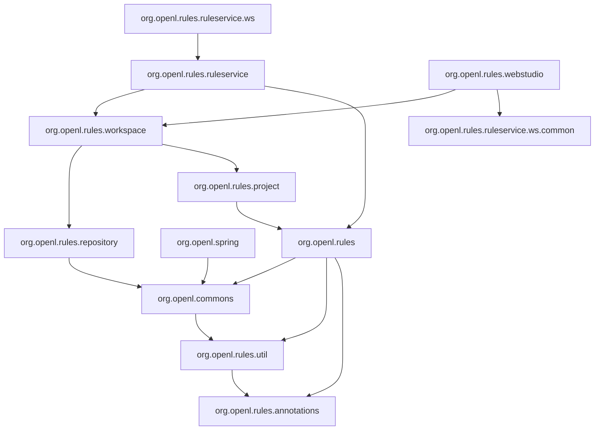

# Module Dependencies

This page lists the dependencies between the OpenL modules, as the `pom.xml` files of the modules declare them. The
`test` scope and third-party libraries are not listed; see [Technology Stack](technology-stack.md) for the libraries.
`(provided)` marks a dependency that the runtime environment supplies, and `(runtime)` one that is needed only at run
time.

## Layers



- **Base** — `org.openl.rules.annotations` depends on no OpenL module. `org.openl.rules.util` depends on it,
  `org.openl.commons` on `org.openl.rules.util`, and `org.openl.rules` on all three.
- **Projects** — `org.openl.rules.project` depends on the engine, and the workspace module on both the project module
  and the repository module.
- **Services and Studio** — `org.openl.rules.ruleservice` depends on the engine, the workspace and the repository
  modules. OpenL Studio and the OpenAPI modules depend on `org.openl.rules.ruleservice.ws.common`.

## DEV

- **`org.openl.commons`** — `org.openl.rules.util`
- **`org.openl.rules.annotations`** — no OpenL dependencies
- **`org.openl.rules.demo`** — `org.openl.rules.test`
- **`org.openl.rules.gen`** — `org.openl.rules`
- **`org.openl.rules.project`** — `org.openl.rules`
- **`org.openl.rules.test`** — `org.openl.rules.project`
- **`org.openl.rules.util`** — `org.openl.rules.annotations`
- **`org.openl.rules`** — `org.openl.commons`, `org.openl.rules.annotations`, `org.openl.rules.util`
- **`org.openl.spring`** — `org.openl.commons`

## STUDIO

- **`org.openl.rules.diff`** — `org.openl.rules`
- **`org.openl.rules.jackson.configuration`** — no OpenL dependencies
- **`org.openl.rules.jackson`** — `org.openl.rules.project`, `org.openl.rules.jackson.configuration`
- **`org.openl.rules.project.openapi`** — `org.openl.rules.ruleservice.ws.common`, `org.openl.rules.jackson`
- **`org.openl.rules.project.validation.openapi`** — `org.openl.rules.ruleservice.ws.common`,
  `org.openl.rules.jackson`, `org.openl.rules.test`
- **`org.openl.rules.repository.aws`** — `org.openl.rules.repository` (provided)
- **`org.openl.rules.repository.azure`** — `openl-yaml`, `org.openl.rules.repository` (provided)
- **`org.openl.rules.repository.git`** — `org.openl.rules.repository` (provided), `org.openl.rules.xls.merge`
- **`org.openl.rules.repository`** — `org.openl.commons`
- **`org.openl.rules.webstudio`** — `org.openl.commons`, `openl-yaml`, `org.openl.rules.ruleservice.ws.common`,
  `org.openl.rules.repository`, `org.openl.rules.repository.aws`, `org.openl.rules.repository.git`,
  `org.openl.rules.repository.azure`, `org.openl.rules.workspace`, `org.openl.rules.project`,
  `org.openl.rules.jackson`, `org.openl.rules.demo`, `org.openl.rules.project.validation.openapi`,
  `org.openl.rules.project.openapi`, `org.openl.rules.diff`, `openl-openapi-parser`, `openl-excel-builder`,
  `org.openl.spring`, `studio-ui`, `studio-docs` (runtime)
- **`org.openl.rules.workspace`** — `org.openl.commons`, `org.openl.rules.repository`, `org.openl.rules.project`,
  `org.openl.spring`, `openl-yaml`
- **`org.openl.rules.xls.merge`** — `org.openl.commons`
- **`studio-docs`** — no OpenL dependencies
- **`studio-ui`** — no OpenL dependencies

## WSFrontend

- **`org.openl.rules.ruleservice.annotation`** — `org.openl.rules.project` (provided), `org.openl.rules.jackson`
  (provided)
- **`org.openl.rules.ruleservice.common`** — `org.openl.rules.project`, `org.openl.rules.ruleservice.annotation`
- **`org.openl.rules.ruleservice.deployer`** — `org.openl.rules.repository`, `openl-yaml`
- **`org.openl.rules.ruleservice.kafka`** — no OpenL dependencies
- **`org.openl.rules.ruleservice.ws.all`** — `org.openl.rules.ruleservice.ws`, `org.openl.rules.repository.aws`,
  `org.openl.rules.repository.git`, `org.openl.rules.repository.azure`,
  `org.openl.rules.ruleservice.ws.storelogdata.db`
- **`org.openl.rules.ruleservice.ws.annotation`** — `org.openl.rules.jackson.configuration`
- **`org.openl.rules.ruleservice.ws.common`** — `org.openl.rules.ruleservice.common`, `org.openl.rules.jackson`
- **`org.openl.rules.ruleservice.ws.storelogdata.db.annotation`** — no OpenL dependencies
- **`org.openl.rules.ruleservice.ws.storelogdata.db`** — `org.openl.rules.ruleservice.ws.storelogdata`,
  `org.openl.rules.ruleservice` (provided), `org.openl.rules.ruleservice.ws.storelogdata.db.annotation`
- **`org.openl.rules.ruleservice.ws.storelogdata`** — `org.openl.rules.ruleservice.kafka` (provided),
  `org.openl.rules.ruleservice` (provided)
- **`org.openl.rules.ruleservice.ws`** — `org.openl.rules`, `org.openl.rules.ruleservice`,
  `org.openl.rules.ruleservice.ws.common`, `org.openl.rules.ruleservice.kafka`,
  `org.openl.rules.ruleservice.ws.storelogdata`, `org.openl.rules.ruleservice.deployer`
- **`org.openl.rules.ruleservice`** — `org.openl.spring`, `org.openl.rules`, `org.openl.rules.ruleservice.annotation`,
  `org.openl.rules.ruleservice.common`, `org.openl.rules.repository`, `org.openl.rules.workspace`,
  `org.openl.rules.project`, `org.openl.rules.ruleservice.deployer`, `org.openl.rules.jackson`

## Util

- **`openl-excel-builder`** — `org.openl.commons`, `org.openl.rules`, `openl-openapi-model-scaffolding`
- **`openl-maven-plugin`** — `org.openl.rules.project`, `org.openl.rules.ruleservice.deployer`,
  `org.openl.rules.ruleservice.ws`, `org.openl.rules.project.validation.openapi`, `openl-yaml`
- **`openl-openapi-model-scaffolding`** — no OpenL dependencies
- **`openl-openapi-parser`** — `org.openl.rules`, `openl-openapi-model-scaffolding`,
  `org.openl.rules.ruleservice.annotation`, `org.openl.commons`, `org.openl.rules.ruleservice.ws.common`
- **`openl-project-archetype`** — no OpenL dependencies
- **`openl-rules-opentelemetry`** — `org.openl.rules` (provided)
- **`openl-simple-project-archetype`** — no OpenL dependencies
- **`openl-yaml`** — no OpenL dependencies

## Inspect

```bash
mvn dependency:tree -pl <module-path>
```

The versions of third-party libraries are managed in the `dependencyManagement` of the root `pom.xml`.
