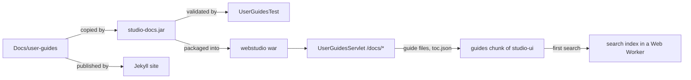

# ADR: User Guides Embedded in OpenL Studio

- **Status** — Accepted
- **Ticket** — [EPBDS-16455](https://jira.eisgroup.com/browse/EPBDS-16455)
- **Scope** — `Docs/user-guides`, a new `STUDIO/studio-docs` module, OpenL Studio backend and `studio-ui`

## Context

The Help page of OpenL Studio links to the user guides on the documentation site. That works only while the site is
reachable and holds the guides of the running version:

- many installations have no internet access, so the links lead nowhere;
- the Jekyll workflow of this repository publishes the guides of `main` only, so the versioned addresses the Help
  page links to (`<openl.site>/openl-tablets/<version>/user-guides`) are not produced by it;
- a screen of OpenL Studio cannot open the section of a guide that describes it.

The guides are already plain enough to be rendered by more than Jekyll. `Docs/user-guides` holds 140 Markdown files
and about 500 images (about 20 MB) with no Liquid tags and no kramdown attribute lists. The repository Markdown rules keep
them GFM-only, with `> [!Note]` as the only admonition and Mermaid for diagrams.

## Decision

OpenL Studio ships the user guides of its own version and shows them inside the application at `/docs/*`.



### The `studio-docs` module

A new module `STUDIO/studio-docs` (`org.openl.rules.studio:studio-docs`, packaging `jar`) holds no sources of its own.
It turns `Docs/user-guides` into a jar.

- **Content** — every file of `Docs/user-guides`, except OS junk such as `.DS_Store`, is copied to
  `META-INF/resources/docs/` of the jar, keeping the folder structure.
- **Not deployed** — the module sets `maven.deploy.skip=true`. The root `pom.xml` derives `maven.install.skip`
  from it, so the module sets `maven.install.skip=false` back. The jar still reaches the local repository, and a
  build of the webstudio war alone, outside the reactor, still resolves it.
- **Consumed by the war only** — the webstudio war depends on it as an `optional` dependency, so the published war
  pom does not drag it into the builds of its consumers, and nobody needs it from Nexus. The war plugin leaves an
  optional dependency out, so the war copies the jar into `WEB-INF/lib` itself, the way it ships its optional log4j
  runtime.
- **Version** — managed in the root `dependencyManagement`, like `studio-ui`.

### The validator

`UserGuidesTest` in `studio-docs` runs `GuideValidator` over the guides the jar holds. The validator parses every
guide with a CommonMark parser, so links inside code are not mistaken for real ones. The test fails the build with the
file and line of each problem:

- **Broken relative link** — the target file is missing. A folder link needs an `index.md` in that folder. Names
  are compared case-sensitively, because the jar and Linux are case-sensitive while macOS is not.
- **Link leaving the guides** — a relative link resolves outside `Docs/user-guides`. Such a target is not in the jar.
  Use an absolute link to the documentation site instead.
- **Broken anchor** — the `#fragment` of a link does not match a heading of the target page. Heading ids follow the
  GitHub rules, which both the Jekyll site and the viewer use.
- **Missing image** — an image of a Markdown `` or an HTML `` does not exist.
- **Unreferenced image** — an image file that no guide uses. This enforces the rule that images no longer referenced
  are deleted.
- **External link not in the allowlist** — an absolute URL does not start with a prefix listed in
  `STUDIO/studio-docs/test-resources/allowed-links.txt`. A new external site is accepted by adding it to that file in
  review. External links are never fetched, so the build stays offline and stable. An address written as bare text
  counts only when GFM links it, as a web or an e-mail address: a JDBC URL in the text is no link.
- **Unsupported syntax** — an admonition other than `> [!Note]`, an HTML tag outside the supported list, or a code
  fence language the viewer does not know. See [Supported Markdown](#supported-markdown).
- **Malformed `csv` or `openl` fence** — a record that is not valid CSV, a `<` in the first column, a second `---`
  line, or merged cells that do not form a rectangle.

The quick CI build (`.github/workflows/build-quick.yml`) ignores `Docs/**` except `Docs/user-guides/**`, because the
guides are build input and the rest of `Docs/` is not in the jar. Both its `push` and `pull_request` triggers use a
`paths` filter for it: GitHub reads a re-inclusion in a `paths` filter only, not in `paths-ignore`.

### The servlet

`UserGuidesServlet` in the webstudio war answers `/docs/*` and follows the same access rules as the other pages of
OpenL Studio.

- **A file of the guides** — `/docs/<path>` naming a file of `META-INF/resources/docs` is handed to the container's
  `default` servlet, which sets the content type and `Last-Modified`. It reuses the request shaping of
  `StaticResourcesServlet`, which keeps the whole address under a prefix mapping. `web.xml` maps a `.md` file to
  `text/markdown;charset=UTF-8`, because the containers' own tables of types do not list it. The servlet answers a file
  with `Cache-Control: no-cache` before the security chain writes its `no-store`, so a browser keeps the file and
  revalidates it by its date.
- **The table of contents** — `/docs/toc.json` lists the pages as a tree, built on the first request from the jar
  content. It applies the rules of the site sidebar: a page takes the front matter `title`, else the level 1–3
  heading it starts with, else its file name; a folder lists its pages, then its folders, in the order of their
  names. `toc.json` is a reserved name, so the validator rejects a guide file with it.
- **Anything else** — a page address such as `/docs/openl-studio/rules-editor` gets the application page, the way
  `AppPageServlet` answers. The viewer then loads `rules-editor.md` itself. An address ending with a file extension
  names a file the guides do not hold, and is not found.

Viewer addresses mirror the site addresses: `/docs/<path>` is `<site>/user-guides/<path>`. A page drops the `.md`
extension, and a folder stands for its `index.md`.

### The viewer in the application bundle

The guides viewer is part of the `studio-ui` application, its single `index` entry, and not a page of its own like
`api-docs`. It shares the application layout, theme, appearance and translations.

- **Loaded on demand** — the `/docs/*` route loads the viewer as a lazy chunk, the way `ProjectWorkspace` is loaded.
  A user who never opens the guides downloads none of its code.
- **Chunk content** — the Markdown renderer, the sanitizer and the CSV parser.
- **Nested chunks** — the Mermaid library loads with the first diagram, the code grammars with the first code block,
  and the search index with the first search, so reading a page without diagrams or code pays for none of them.
- **One set of grammars** — code is highlighted with the CodeMirror grammars of the code editor, through
  `@lezer/highlight`, so the editor and the viewer share one chunk instead of bundling two highlighters. Until the
  grammars arrive, a code block shows as plain text.

The viewer shows a sidebar from `toc.json`, and beside the page its outline: the two highest heading levels below the
heading the page opens with, which the site takes for the title. A page without a heading of its own is given the
title of its `toc.json` entry. Links are resolved against the page that contains them. A `.md` link becomes an
in-app route, an image becomes a `/docs/...` file address, and an external link opens in a new tab.

The Help page links its documentation card to `/docs/<guide>/` instead of the documentation site.

### Supported Markdown

The guides use only this syntax, and the validator holds them to it:

- **GFM** — headings, emphasis, lists, task lists, pipe tables, strikethrough, autolinks and fenced code. Raw HTML is
  limited to the tags the guides use: `br` for a line break in a table cell, `img` for a screenshot of a given size,
  and an `iframe` in a `p` for a YouTube player. Everything else is removed by a sanitizer. The guides ship with the
  application, so the sanitizer is defence in depth, not a trust boundary.
- **`> [!Note]`** — rendered as an antd `Alert` of the info type. Other GitHub alert types are not supported.
- **Mermaid** — a `mermaid` code fence is drawn as a diagram. The diagram theme follows the light or dark appearance
  of OpenL Studio.
- **CSV** — a `csv` code fence is drawn as a table. Its records follow RFC 4180, so a value holding a comma, a quote
  or a line break is quoted. The first record is the column header.
- **OpenL table** — an `openl` code fence is drawn as an OpenL table by `RawTableGrid`, the read-only grid the table
  editor and the trace window of OpenL Studio draw a table with. It lets a guide show a rule table as text instead of
  a screenshot. See [The `openl` fence](#the-openl-fence).
- **Syntax highlighting** — fenced code is highlighted for the languages the guides use: `bash`, `groovy`, `java`,
  `json`, `properties`, `xml` and `yaml`. A fence without a language renders as plain text. Only these grammars are
  loaded.

### The `openl` fence

The lines of an `openl` fence are CSV records, like those of a `csv` fence, with these additions:

- **Table header** — the first line is the header of the OpenL table, taken as it is written, commas included, so a
  method signature needs no quotes. It spans the whole width.
- **Column headers** — a `---` line ends the header rows. The records between the table header and that line are
  shaded as column headers. Without the line, only the table header is shaded.
- **Merged cells** — a cell `<` joins the cell on its left, and a cell `^` joins the cell above. A merged area must be
  a rectangle. A literal `<` or `^` is written quoted.
- **Short records** — a record shorter than the widest one is padded with empty cells.
- **Shading** — the table header and the column headers are shaded; the other rows are not.

For example, a rules table with a merged condition value:

```text
Rules String greeting(Integer hour, Boolean weekend)
Rule,C1,C2,RET1
,hour,weekend,greeting
---
R10,0-12,false,Good Morning
R20,^,true,Lazy Morning
R30,12-24,,Good Day
```

### Search

The viewer searches the text of all guides, or of one part of the guides tree.

- **Scope** — the list under the search box offers **All Guides** and every folder above the current page, so a
  search covers a whole guide or one of its sections. The scope is a path prefix of the tree.
- **What is found** — one result per page section, the text between two headings. A result shows the page title,
  the section heading and a snippet with the matched words highlighted. It opens `/docs/<page>#<heading>`.
- **Matching** — every word of the query must match, the last one as a prefix, so results follow typing. Small typos
  are tolerated. A match in the page title ranks above one in a heading, and that above one in the text.
- **What is indexed** — the text of a page, the alt text of its images, and the content of code, `csv` and `openl`
  fences. Mermaid sources are not indexed.
- **Where the index lives** — a client-side full-text index (MiniSearch) in a Web Worker. On the first search the
  worker fetches the pages listed by `toc.json`, about 1.4 MB of Markdown today, once per session. Later sessions
  revalidate them by their `Last-Modified`. A page that cannot be read is left out rather than failing the search.
- **Without a worker** — where the browser refuses to start one, the same search runs on the page itself: a page
  whose scripts come from another origin, as from a frontend dev server, or a security policy forbidding workers.
  A worker that fails to load or breaks hands the search over to the page as well, with the searches still waiting.
- **Results** — up to 50, a moment after typing pauses; they take the place of the table of contents, which keeps
  the folders the reader opened.
- **One parser** — the worker splits pages into sections with the same Markdown parser and heading ids that the
  renderer uses, so every result anchor exists on the page it opens. The parser decodes HTML entities through a DOM
  element in its browser build, so the worker bundle resolves that one package the way Node does, to its build
  without a DOM.

## Alternatives Considered

- **Link to the documentation site** (before this decision) — no build work, but no offline access, no versioned
  guides and no section links from a screen.
- **Build the Jekyll site inside Maven and serve its HTML** — keeps the site look, but the build needs Ruby or Docker
  and fetches the remote theme from GitHub. The theme CSS also looks foreign inside OpenL Studio and ignores its
  dark mode.
- **Render Markdown to HTML in the servlet** — keeps the browser simple, but Mermaid needs client code anyway. Server
  HTML would also bring a second page layout to style apart from the antd one.
- **Import the guides into the `studio-ui` bundle** — no new module, but 19 MB of images would go through the Vite
  build. The guides would also depend on the npm toolchain, and the validator would have to live in TypeScript.
- **Deploy `studio-docs` to Nexus** — would let other products reuse it, but it publishes a large artifact every
  release for no current consumer. OpenL Rule Services can adopt the same jar later.
- **Show the documentation site in an iframe** — same drawbacks as linking out, plus framing headers and broken
  anchors.
- **Build the viewer as a separate page** like `api-docs` — isolates its code, but duplicates the layout, theme,
  authentication and translations that the application already loads. A lazy chunk keeps the same isolation for
  download size.
- **Search in the servlet** — keeps the index out of the browser, but needs a second Markdown parser and heading-id
  rule in Java. Its anchors must then match those of the renderer, and the two drift.
- **Search index built at build time** — saves the first-search download, but needs a JavaScript step in
  `studio-docs` or makes the `studio-ui` build read `Docs/`. Neither is worth it for 1.4 MB of text.
- **Pipe tables only, no `csv` or `openl` fence** — no new syntax, but GFM tables cannot merge cells. OpenL tables
  would then stay screenshots that no search finds and no review can diff.

## Consequences

- **Version accuracy** — every installation, including offline ones, shows the guides of the running version.
- **War size** — the webstudio war grows by the size of the guides, about 20 MB today.
- **Validated guides** — the guides become build input, so a broken link, a missing image or unsupported syntax fails
  the check before merge, not after publishing.
- **CI cost** — a change to the guides alone runs the whole quick build, not only the validator. It also builds the
  war that ships them, so a guide change is checked the way it is released.
- **Two renderers** — the Jekyll site and the viewer render the same files. The site does not draw Mermaid diagrams
  or `> [!Note]` alerts yet, and it shows `csv` and `openl` fences as plain code. It gains them through the theme's
  `head/custom.html` include, which needs no Jekyll plugin. Until then, the plain code stays readable.
- **First search cost** — the first search of a session downloads every page of the guides once. The index
  grows with the guides.
- **Follow-ups** — screens can open their guide section through a `/docs/<path>#<anchor>` link. Screenshots of OpenL
  tables can be replaced by `openl` fences guide by guide.
