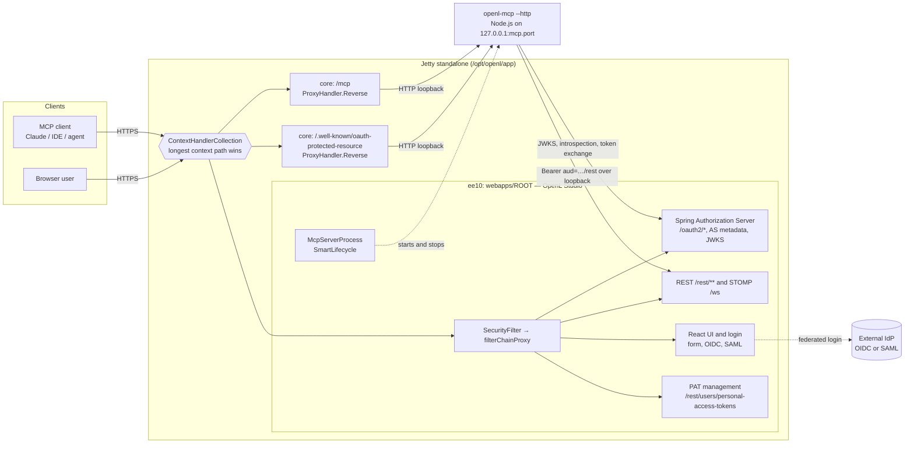
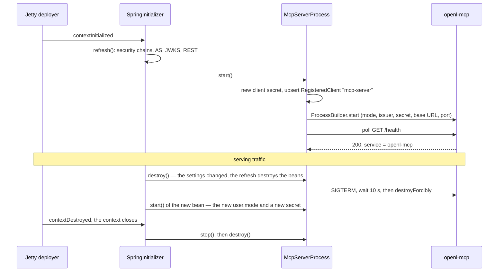
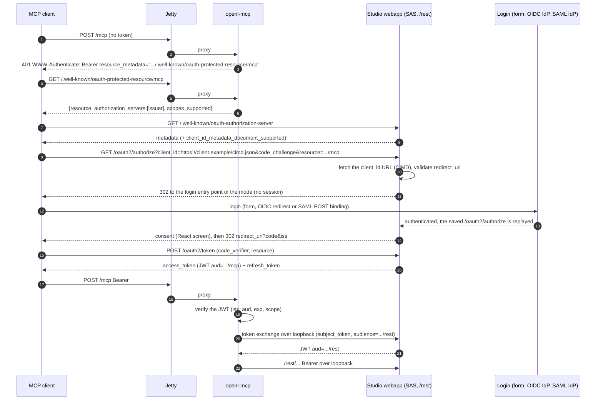
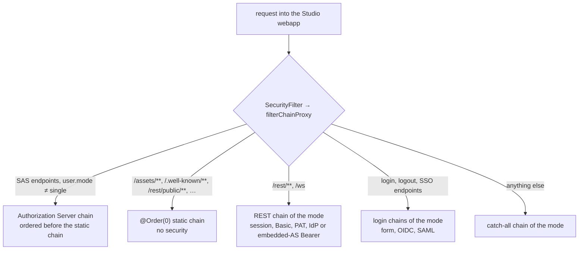
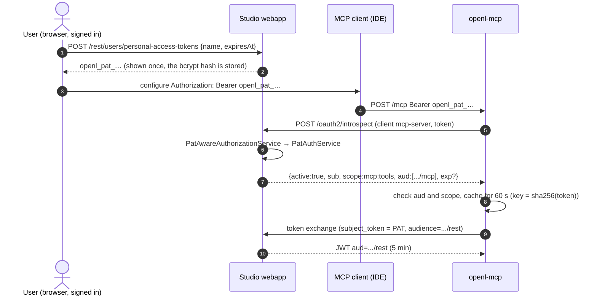
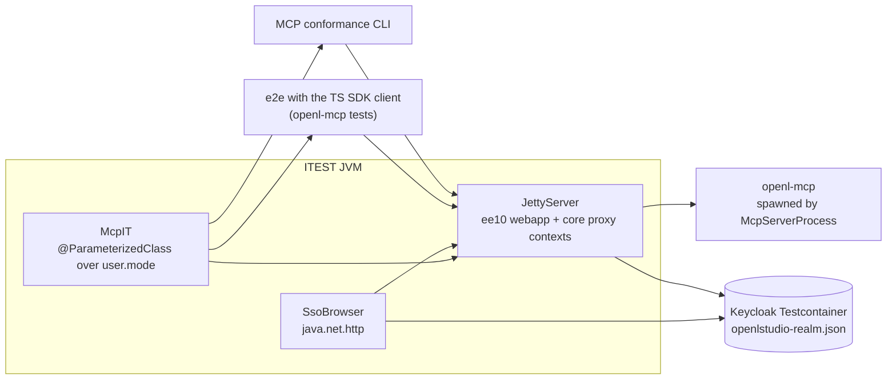

# Built-in MCP Server for OpenL Studio on Standalone Jetty

> [!Note]
> This page is the design of EPBDS-16523. The code of this repository does not contain the built-in MCP server yet.
> Section 1.1 describes what exists today, and the other sections describe the target.

How OpenL Studio exposes its MCP server as a built-in endpoint. The existing openl-mcp server runs as a supervised
Node.js sidecar of the Studio web application behind the same Jetty origin, and MCP clients authenticate the way the
`user.mode` of the installation prescribes.

- **Scope** — runtime topology, security for every `user.mode` (OAuth 2.1, Personal Access Tokens, no
  authentication), packaging, Maven and JUnit integration testing

---

## 1. Context and goals

OpenL Studio and its MCP server are released separately today. The MCP server has to be matched to the Studio
release, the reference guides and the skills by hand, and a team that pairs it with another Studio version fails to
onboard. Clients upgrade Studio on a slow cadence of their own. This design makes the MCP endpoint a part of every
Studio installation, so both always ship and version as one unit.

### 1.1 Current state

#### OpenL Studio

- **Bootstrap** — `SpringInitializer`, a `ServletContextListener` declared in `web.xml`, builds an
  `XmlWebApplicationContext` from `/WEB-INF/spring/webstudio.xml` and registers `StudioDispatcherServlet`, a Spring
  `DispatcherServlet`, at `/rest/*` and at the exact `/ws`. Studio is not a Spring Boot application: it borrows only
  condition annotations such as `@ConditionalOnExpression`.
- **Configuration refresh** — `SpringInitializer` checks the dynamic properties every 10 seconds and refreshes the
  whole context in place when they change, for example after an administrator saves the authentication settings.
  The refresh invalidates every HTTP session. A component that caches configuration must follow the context
  lifecycle.
- **Web filters** — `web.xml` maps `CorsFilter`, `ForwardedHeaderFilter` (`X-Forwarded-*`), `SecurityFilter` and
  `ChangeOriginFilter` to `/*`. `SecurityFilter` takes the `filterChainProxy` bean from the current context on every
  request under a read lock, so requests wait while a refresh runs. No filter declares async support.
- **Security chains** — the order-0 chain of `SecurityConfig` matches static-like paths (`/assets/**`,
  `/.well-known/**`, `/rest/public/**`, `/rest/settings`, the API docs) and disables every security feature for them.
  Each mode adds its own chains through `@ConditionalOnExpression("'${user.mode}' == '…'")` configuration classes.
  Spring profiles are not used.
- **User modes** — `user.mode` selects one of five modes; `single` is the default:

| `user.mode` | Browser login | `/rest/**` accepts |
|---|---|---|
| `single` | none — every request runs as `security.single.username` with ADMIN | everything (`permitAll`) |
| `multi` | form at `/login`, users in the Studio database | session, Basic, PAT |
| `ad` | form at `/login`, Active Directory over LDAP | session, Basic, PAT |
| `saml` | `/saml2/authenticate/webstudio`, then the SAML IdP | session, PAT |
| `oauth2` | `/oauth2/authorization/webstudio`, then the OIDC IdP | session, PAT, IdP Bearer token |

- **IdP tokens** — in `oauth2` mode the REST chain validates a JWT against the JWKS of `security.oauth2.issuer-uri`
  with `OidcIdTokenValidator`, so its `aud` must contain `security.oauth2.client-id` (`webstudio` by default).
  Opaque tokens are introspected when the IdP advertises an introspection endpoint.
- **Personal Access Tokens (PAT)** — available in every mode except `single`:
  - the value is `openl_pat_<publicId>.<secret>` and is shown once; the secret is hashed with the Studio password
    encoder (bcrypt by default) in `OpenL_PAT_Tokens`;
  - the expiry is optional; a PAT has no scope and no audience — it acts with the current authorities of its owner,
    external groups included;
  - it is sent as `Authorization: Token <pat>` and `PatAuthenticationFilter` validates it on every request;
  - tokens are managed at `/rest/users/personal-access-tokens`, and `@NotPatAuth` keeps a PAT from managing PATs.
- **REST and WebSocket** — REST lives under `/rest/**`. STOMP over WebSocket has a single endpoint, `/ws`, for the
  UI and for third-party clients; the REST chain authenticates its handshake by the session cookie or the
  `Authorization` header.
- **Client state** — `RulesUserSession`, `WebStudio`, the compilation job registry, debug sessions, test, run
  and benchmark results, merge conflicts and comparisons are `@ClientSessionScope` beans. A browser keeps them in
  its HTTP session; a REST client with its own credentials opens no session and finds them kept for the
  credential — see [Client Sessions](client-sessions.md).
- **No server-rendered pages** — `AppPageServlet` answers every UI address with the React page; a new screen is a
  React screen backed by REST.
- **Distributions**:
  - **Docker image** — an Eclipse Temurin JRE on Alpine (musl) without Node.js. Jetty home is copied from the
    official Jetty image to `/opt/openl/app`, which is `jetty.home` and `jetty.base` at once, and Studio is exploded
    into `webapps/ROOT`. `start.sh` runs `start.jar --module=http,ext,ee10-deploy,ee10-websocket-jakarta` with
    `logging-log4j2` and writes ECS JSON logs to stdout. The image is built for `linux/amd64` and `linux/arm64` and
    runs as the non-root `openl` user.
  - **`DEMO/start*`** — downloads a JRE and `jetty-home` and deploys Studio at `/webstudio` through a context XML,
    next to OpenL Rule Services; `webapps/ROOT` holds a static landing page.
  - **WAR on GitHub Releases** — customers deploy it into Jetty or Apache Tomcat 10.1; both are
    [supported platforms](../supported-platforms.md).
- **Build and tests** — the root `pom.xml` manages `node.version`, `npm.version` and
  `frontend-maven-plugin.version`, which `STUDIO/studio-ui` already uses. ITEST boots the unpacked WAR in an embedded
  Jetty (`JettyServer` in `ITEST/server-core`). `ITEST/itest.studio/sso` logs in through Keycloak (Testcontainers,
  realm `openlstudio-realm.json`) over OIDC and SAML with `SsoBrowser`, a `java.net.http` browser emulation.

#### Current MCP server: openl-mcp

- **Repository** — [openl-tablets/openl-mcp](https://github.com/openl-tablets/openl-mcp). It is released to npm as
  `openl-mcp` with a version line of its own, plus a nightly build published as the GitHub release `x`.
- **Stack** — TypeScript on the MCP TypeScript SDK v2 (`@modelcontextprotocol/server`, `@modelcontextprotocol/node`)
  and Express, on the Node.js LTS line its `engines` field requires. It serves 74 tools, 14 prompts and the bundled
  reference guides.
- **How it runs today** — locally over stdio. The AI client launches one process per client
  (`npx -y openl-mcp <studio-url>`) and passes the PAT of the user in `OPENL_PERSONAL_ACCESS_TOKEN`, or nothing for
  `single` mode.
- **Streamable HTTP** — implemented, but never tested end to end: no real MCP client, no deployed Studio, no reverse
  proxy — only in-process unit tests. `--http` starts Express on `PORT` (3000) with `/mcp` and `/health`:
  - modern `2026-07-28` requests are stateless — a fresh `OpenLClient` serves each request;
  - legacy 2025 clients keep a sessionful transport per `Mcp-Session-Id`, each with a Studio cookie jar of its own;
  - the inbound `Authorization` (`Token` or `Bearer`) is forwarded to Studio as `Token`;
    `OPENL_MCP_PRESERVE_AUTH_SCHEME` forwards `Bearer` unchanged — token passthrough, off by default;
  - browser origins pass only through the `MCP_ALLOWED_ORIGINS` allow-list; `Host` is not checked, and the server
    listens on every interface.
- **Talks to Studio** — REST under `<base-url>/rest` (the base URL may carry a context path), STOMP at `/ws` to
  wait for compilations, and the `JSESSIONID` cookie captured and replayed per `OpenLClient`.
- **Open items of its own plan** (`docs/development/mcp-spec-alignment.md`):
  - P1.2 — the trace, test-result and merge-conflict flows keep state in the Studio session, so they work only over
    stdio or a legacy HTTP session;
  - P2.1 — standard MCP OAuth for the HTTP transport, including how upstream calls authenticate: a service PAT, token
    exchange, or Studio and the MCP server declared one resource.

### 1.2 Goals

1. **One deliverable, one version.** The MCP server ships with OpenL Studio and reports the Studio version. Nobody
   matches MCP, Studio, guides and skills by hand any more.
2. **One public origin.** Jetty is the only listener exposed to the network; `https://studio.example.com/mcp` is the
   MCP endpoint.
3. **Security follows the installation.** The `user.mode` of Studio applies to MCP clients too: `single` stays open,
   every other mode requires a Studio identity. The existing PATs serve headless and IDE clients.
4. **Spec compliance.** MCP Authorization `2026-07-28`: the MCP endpoint is an OAuth 2.1 resource server with
   RFC 9728 metadata and RFC 8707 audience binding, and it never passes a token through.
5. **Testable in the Maven build.** ITEST suites exercise the topology in every mode.

Non-goals: horizontal scaling design, multi-tenant IdP federation, MCP client development, a rewrite of the MCP
server in Java.

### 1.3 Assumptions

- **A1 — Studio is deployed at the root context.** Holds for the Docker image; fails for `DEMO` (`/webstudio`) and for
  a WAR deployed under a context path. The issuer then carries the path, so RFC 8414 metadata moves to
  `/.well-known/oauth-authorization-server/webstudio` at the host root, outside the Studio context: Jetty needs one
  more core context, or clients fall back to OIDC discovery appended to the issuer path.
- **A2 — The Jetty environment is `ee10`.** Holds: the Spring Framework and Spring Security lines in use
  (`spring.framework.version`, `spring.security.version`) run on Jakarta EE 10, and both the image and `DEMO` start
  `ee10-deploy`. Spring 7 moves to `ee11`; nothing else changes.
- **A3 — Spring Authorization Server (SAS) is the embedded authorization server.** A new dependency: the root pom
  imports the Spring Security BOM, which includes SAS only from Spring Security 7 on. Until then the root pom manages
  the SAS line that matches `spring.security.version`.
- **A4 — The webapp is exploded.** Holds for the image and `DEMO`. A packed WAR in a customer container may not be
  (`getRealPath` returns `null`): extract `WEB-INF/mcp` to a temporary folder at start.
- **A5 — Docker is available on CI.** Holds: ITEST already runs Keycloak, S3 and databases in Testcontainers.
- **A6 — Snippets are design sketches, not compiled code.**
- **A7 — A Node.js runtime is present.** Fails today: neither the image nor `DEMO` has one (§3.6).
- **A8 — The servlet container is Jetty.** Fails for Tomcat 10.1, a supported platform without Jetty core contexts
  (§3.1).

---

## 2. Architecture overview



Key properties:

- `/mcp` and `/.well-known/oauth-protected-resource/*` are served by **core** contexts. They never enter the webapp,
  so `SecurityFilter`, the Spring Security chains, the HTTP sessions and the webapp filters without async support do
  not apply to MCP traffic.
- openl-mcp listens on **loopback only**. A lifecycle bean of the Studio Spring context supervises it, so it restarts
  with every context refresh.
- In every mode except `single` Studio is the **authorization server**, and the user logs in through the existing
  entry point of the mode. MCP clients get OAuth tokens whatever the mode is.
- openl-mcp calls the Studio REST API over loopback, never through the public origin.

---

## 3. Deployment on standalone Jetty

### 3.1 Distributions

- **Docker image** — the primary target: standalone Jetty with Studio at the root context. It gains Node.js, the
  openl-mcp bundle inside the webapp, two core context XMLs and the `core-deploy` and `proxy` modules.
- **`DEMO`** — standalone Jetty too, but Studio lives at `/webstudio`. `/mcp` stays at the host root, and the
  discovery documents need the extra context of A1 — or `DEMO` deploys Studio as `ROOT`.
- **WAR in a customer container** — carries the bundle and its supervisor, but neither Node.js nor the core contexts.
  On Jetty the operator adds the XMLs and a Node.js runtime. Tomcat 10.1 has no core contexts, so the endpoint needs
  a proxy servlet inside the webapp at `<context>/mcp` there. That servlet requires
  `<async-supported>true</async-supported>` on every filter of `web.xml` and `/mcp` excluded from the Spring Security
  chains — a decision is needed (§8).

### 3.2 Modules

```bash
# The Docker image: jetty.home = jetty.base = /opt/openl/app, start.sh passes the modules on the command line
java -jar start.jar --module=http,ext,ee10-deploy,ee10-websocket-jakarta,core-deploy,proxy
# TLS: add `ssl,https`, or terminate it at the load balancer
```

- `core-deploy` deploys Jetty **core** `ContextHandler`s from `webapps/*.xml`.
- `proxy` puts `lib/jetty-proxy-*.jar` on the server classpath, which the `core` environment uses (`proxy.mod` in
  `jetty-home`).

### 3.3 Jetty base layout of the Docker image

```
/opt/openl/app                     # jetty.home and jetty.base
├── start.d/                       # logging-log4j2.ini, jul-bridge.ini
├── lib/ext/                       # ECS layout, JUL bridge
└── webapps/
    ├── ROOT/                      # exploded OpenL Studio with WEB-INF/mcp
    ├── mcp.xml                    # core reverse proxy for /mcp
    ├── mcp.properties             # environment=core
    ├── mcp-prm.xml                # core reverse proxy for /.well-known/oauth-protected-resource
    └── mcp-prm.properties         # environment=core
```

`mcp.properties` and `mcp-prm.properties`:

```properties
environment=core
```

### 3.4 Reverse-proxy contexts

`webapps/mcp.xml`:

```xml
<?xml version="1.0" encoding="UTF-8"?>
<!DOCTYPE Configure PUBLIC "-//Jetty//Configure//EN" "https://jetty.org/configure_10_0.dtd">
<Configure class="org.eclipse.jetty.server.handler.ContextHandler">
    <Set name="contextPath">/mcp</Set>
    <!-- Without it Jetty answers POST /mcp with 302 -> /mcp/ -->
    <Set name="allowNullPathInContext">true</Set>
    <Set name="handler">
        <New class="org.eclipse.jetty.proxy.ProxyHandler$Reverse">
            <!-- Rewrites the absolute client URI; the path (/mcp...) and the query are preserved -->
            <Arg type="String">^https?://[^/]+/(.*)$</Arg>
            <!-- Studio reads the same system property to start openl-mcp on this port (§3.7) -->
            <Arg type="String">http://127.0.0.1:<SystemProperty name="mcp.port" default="3000"/>/$1</Arg>
        </New>
    </Set>
</Configure>
```

`webapps/mcp-prm.xml` is identical except `<Set name="contextPath">/.well-known/oauth-protected-resource</Set>`.

`ProxyHandler` defaults relevant to MCP:

| Behaviour | Default | Consequence |
|---|---|---|
| `Host` to the backend | the client value (`proxyToServerHost` is `null`) | openl-mcp sees the public host (§4.7) |
| `Via`, `Forwarded` (RFC 7239) | added | no `X-Forwarded-*`; the MCP resource URI comes from settings |
| Content decoding | disabled | bytes pass through unchanged |
| Response streaming | streamed | SSE works without buffering |
| Idle timeout of the proxy `HttpClient` | 30 s (`ClientConnector`) | safe: SDK v2 sends `: keepalive` every 15 s |

> [!Note]
> Do not inject a custom `HttpClient` through XML: `ProxyHandler` installs its proxy-specific protocol handlers only
> when it creates the client itself. To change timeouts, subclass `ProxyHandler.Reverse`, override
> `configureHttpClient`, and deploy the jar to `lib/ext`.

### 3.5 WAR layout

```
webapps/ROOT/
└── WEB-INF/
    ├── web.xml
    ├── lib/…
    └── mcp/                       # the openl-mcp bundle built together with this Studio (§5)
        ├── dist/                  # compiled server; dist/index.js is the entry point
        ├── node_modules/          # production dependencies, unless bundled into dist/
        ├── guides/                # reference guides built from Docs/ of the same commit
        ├── prompts/
        └── build-info.json
```

- The WAR carries no Node.js binary: it is one artifact for every OS and architecture (§3.6).
- `WEB-INF` keeps the bundle away from the static resources. It must never travel under `META-INF/resources`, which the
  container serves as static content — that is how `studio-ui` ships the React app.

### 3.6 Node.js runtime

- **Docker image** — copy the musl build from the official Node.js Alpine image of the major version that
  `node.version` names, the same way the image takes Jetty home from the official Jetty image, and add its runtime
  library `libstdc++`. A multi-platform build picks the binary of each architecture.
- **`DEMO`** — `start*` downloads a Node.js runtime next to the JRE and Jetty it already downloads.
- **WAR in a customer container** — Node.js on `PATH`, or the `mcp.node` setting. Without a runtime the endpoint stays
  disabled and Studio logs a single WARN; Studio itself still starts.
- The runtime must satisfy the `engines` field of openl-mcp.

### 3.7 Sidecar lifecycle



- **A Spring bean, not a `web.xml` listener** — `SpringInitializer` refreshes the context in place when the dynamic
  properties change (§1.1). A listener started once would keep serving the old `user.mode`, issuer and client secret.
- **Start and stop** — the bean starts openl-mcp once the context is refreshed (`SmartLifecycle.start()`) and stops it
  in `DisposableBean.destroy()` too: an in-place refresh of `XmlWebApplicationContext` destroys the old beans without
  stopping the lifecycle beans first, and only closing the context calls `stop()`.
- **Output** — openl-mcp writes plain text to stdout and stderr, while the Docker image logs ECS JSON through log4j2.
  A reader thread pipes each line into an SLF4J logger (`org.openl.studio.mcp.node`) instead of letting it break the
  JSON stream.
- **Port** — one JVM system property, `mcp.port` (default `3000`), is read by both the core context XMLs and the
  lifecycle bean. The health poll checks the `service` field of `/health`, so a foreign process on the port is never
  mistaken for openl-mcp.
- **Failure** — a missing runtime or a failed start disables the endpoint with a WARN. It does not fail Studio,
  because the WAR may run where no Node.js exists.

```java
/**
 * Runs the built-in MCP server next to OpenL Studio and restarts it with every context refresh.
 */
@Slf4j
@Component
@RequiredArgsConstructor
class McpServerProcess implements SmartLifecycle, DisposableBean {

    private final McpProperties mcp;                                   // mcp.* settings
    private final ObjectProvider<McpServerClientRegistrar> registrar;  // absent in single mode
    private final ServletContext servletContext;
    private @Nullable Process node;

    @Override
    public void start() {
        if (!mcp.enabled()) {
            return;
        }
        var home = Path.of(servletContext.getRealPath("/WEB-INF/mcp"));
        var pb = new ProcessBuilder(mcp.node(), home.resolve("dist/index.js").toString(), "--http")
                .redirectErrorStream(true);
        var env = pb.environment();
        env.put("PORT", String.valueOf(mcp.port()));
        env.put("OPENL_BASE_URL", mcp.internalUrl());          // http://127.0.0.1:8080 + the context path
        env.put("MCP_ALLOWED_ORIGINS", mcp.allowedOrigins());  // the public origin and cors.allowed.origins
        env.put("OPENL_MCP_AUTH", "none");
        registrar.ifAvailable(r -> {                           // every user.mode except single
            env.put("OPENL_MCP_AUTH", "oauth");
            env.put("OPENL_MCP_RESOURCE", mcp.resource());     // https://studio.example.com/mcp
            env.put("OPENL_MCP_ISSUER", mcp.issuer());
            env.put("OPENL_MCP_CLIENT_ID", McpServerClientRegistrar.CLIENT_ID);
            env.put("OPENL_MCP_CLIENT_SECRET", r.registerWithNewSecret());  // never written to disk
        });
        try {
            var process = pb.start();
            node = process;
            Thread.ofVirtual().name("openl-mcp-output").start(() -> pipeToLog(process.getInputStream()));
            awaitHealthy(URI.create("http://127.0.0.1:" + mcp.port() + "/health"), Duration.ofSeconds(20));
        } catch (Exception e) {
            stop();
            log.warn("The built-in MCP server is not available.", e);
        }
    }

    @Override
    public void stop() {
        var process = node;
        node = null;
        if (process == null) {
            return;
        }
        process.descendants().forEach(ProcessHandle::destroy);
        process.destroy();
        try {
            if (!process.waitFor(10, TimeUnit.SECONDS)) {
                process.destroyForcibly();
            }
        } catch (InterruptedException e) {
            Thread.currentThread().interrupt();
        }
    }

    @Override
    public void destroy() {
        stop();  // an in-place refresh destroys the bean without calling stop()
    }

    @Override
    public boolean isRunning() {
        return node != null && node.isAlive();
    }
}
```

---

## 4. Security design

### 4.1 Modes

The mode is the existing `user.mode`; no new switch is introduced.

| `user.mode` | MCP client obtains | openl-mcp validates | openl-mcp calls `/rest` with |
|---|---|---|---|
| `single` | nothing | `Host` and `Origin` only | no credential |
| `multi`, `ad` | code + PKCE from the embedded AS, login at `/login` | JWT via JWKS, `aud` = MCP URL | exchanged JWT |
| `saml` | the same, login through the SAML IdP | the same | exchanged JWT |
| `oauth2` | the same, login through the OIDC IdP | the same | exchanged JWT |
| not `single`, PAT stage 1 | the user's PAT | one cached Studio call | the PAT as `Token` |
| not `single`, PAT stage 2 | the user's PAT | introspection at the embedded AS | exchanged JWT |

Why the embedded AS instead of pointing MCP clients at the customer IdP:

- `multi` and `ad` have no IdP at all, and SAML issues no OAuth tokens.
- Many IdPs lack CIMD/DCR or RFC 8707 audiences (e.g. Entra ID has no DCR).
- One flow serves all installations; the IdP only authenticates the user.
- This supersedes P2.1 of the openl-mcp plan for the built-in endpoint. P2.1 points the protected-resource metadata at
  the IdP of the deployment, which works only in `oauth2` mode — there Studio already accepts IdP tokens whose `aud`
  contains `security.oauth2.client-id`.

### 4.2 OAuth 2.1 authorization flow (`multi`, `ad`, `saml`, `oauth2`)



### 4.3 Spring Security integration



What the existing security code dictates:

- **Conditions, not profiles** — the new configuration is selected by `@ConditionalOnExpression` on `user.mode`, like
  `PatSecurityConfiguration` (`'${user.mode}' != 'single'`).
- **Order before the static chain** — the order-0 static chain matches `/.well-known/**` and disables every filter, so
  SAS would never see `/.well-known/oauth-authorization-server` or `/.well-known/openid-configuration`: the request
  would fall through to `AppPageServlet`. The AS chain takes the highest precedence.
- **Entry points** — the AS chain sends an unauthenticated browser to the login entry of the mode: `/login` in
  `multi` and `ad`, the existing `loginUrl` bean in `oauth2` and `saml`.
- **Saved request** — the AS chain saves `/oauth2/authorize` in the HTTP session, and the
  `SavedRequestAwareAuthenticationSuccessHandler` of the mode replays it after login. Studio excludes only the API
  addresses, `/rest/**` and `/ws`, from its `httpSessionRequestCache`, so the authorize request is kept.
- **Consent screen** — SAS renders its default consent page on the server, and Studio renders no server page. The
  `consentPage` points at a React route backed by a REST endpoint that names the client (the host of its `client_id`
  URL) and the requested scopes.
- **Persistence** — the JDBC stores of SAS live in the Studio security database. They need Flyway scripts for every
  supported database in `STUDIO/studio-backend/resources/db/flyway/`. The signing keys are persisted too, so
  issued tokens survive restarts, context refreshes and — when several Studio instances share the database — other
  nodes.

#### 4.3.1 Authorization Server chain

```java
@Configuration
@ConditionalOnExpression("'${user.mode}' != 'single'")
class McpAuthorizationServerConfig {

    @Bean
    @Order(Ordered.HIGHEST_PRECEDENCE)  // the static chain would swallow /.well-known/** otherwise
    SecurityFilterChain authorizationServer(HttpSecurity http, LoginEntryPoint entry) throws Exception {
        var as = OAuth2AuthorizationServerConfigurer.authorizationServer();
        http.securityMatcher(as.getEndpointsMatcher())
                .with(as, c -> c
                        .oidc(Customizer.withDefaults())                  // path-appended discovery (A1)
                        .tokenIntrospectionEndpoint(Customizer.withDefaults())  // PATs (§4.4)
                        .authorizationEndpoint(a -> a.consentPage("/oauth2/consent"))  // a React screen
                        .authorizationServerMetadataEndpoint(m -> m.authorizationServerMetadataCustomizer(b -> b
                                .claim("client_id_metadata_document_supported", true))))
                .authorizeHttpRequests(a -> a.anyRequest().authenticated())
                .exceptionHandling(e -> e.defaultAuthenticationEntryPointFor(
                        new LoginUrlAuthenticationEntryPoint(entry.url()),
                        new MediaTypeRequestMatcher(MediaType.TEXT_HTML)));
        return http.build();
    }

    @Bean
    AuthorizationServerSettings authorizationServerSettings(McpProperties mcp) {
        // Fixed: tokens exchanged over loopback must carry the public issuer too
        return AuthorizationServerSettings.builder().issuer(mcp.issuer()).build();
    }
}

/** Where /oauth2/authorize sends an unauthenticated user: the login entry point of the mode. */
record LoginEntryPoint(String url) {
}

@Configuration
class LoginEntryPoints {

    @Bean
    @ConditionalOnExpression("'${user.mode}' == 'multi' || '${user.mode}' == 'ad'")
    LoginEntryPoint formLogin() {
        return new LoginEntryPoint("/login");
    }

    @Bean
    @ConditionalOnExpression("'${user.mode}' == 'oauth2' || '${user.mode}' == 'saml'")
    LoginEntryPoint federatedLogin(@Qualifier("loginUrl") String loginUrl) {
        return new LoginEntryPoint(loginUrl);  // /oauth2/authorization/webstudio or /saml2/authenticate/webstudio
    }
}
```

#### 4.3.2 Audience binding (RFC 8707)

SAS puts the **client_id** in `aud` by default, which fails the MCP audience rule. The customizer sets `aud` from the
validated `resource` parameter. Only the token exchange of the `mcp-server` client yields the `/rest` audience; an
authorization request for any other resource answers `invalid_target`.

```java
@Bean
OAuth2TokenCustomizer<JwtEncodingContext> audienceCustomizer(McpProperties mcp) {
    return ctx -> {
        if (!OAuth2TokenType.ACCESS_TOKEN.equals(ctx.getTokenType())) {
            return;
        }
        String aud;
        if (AuthorizationGrantType.TOKEN_EXCHANGE.equals(ctx.getAuthorizationGrantType())) {
            aud = mcp.restAudience();                        // https://studio.example.com/rest (§4.5)
        } else {
            OAuth2AuthorizationRequest ar = ctx.getAuthorization() == null ? null
                    : ctx.getAuthorization().getAttribute(OAuth2AuthorizationRequest.class.getName());
            Object res = ar == null ? null : ar.getAdditionalParameters().get("resource");
            aud = res == null ? mcp.resource() : res.toString();
            if (!mcp.resource().equals(aud)) {
                throw new OAuth2AuthenticationException(new OAuth2Error("invalid_target"));
            }
        }
        ctx.getClaims().audience(List.of(aud)).claim("client_id", ctx.getRegisteredClient().getClientId());
    };
}
```

#### 4.3.3 Client registration: CIMD first, pre-registered next, DCR optional

```java
final class CimdRegisteredClientRepository implements RegisteredClientRepository {

    private final JdbcRegisteredClientRepository jdbc;
    private final CimdFetcher fetcher;  // HTTPS only, no private/loopback IPs, 5 s timeout, 16 KiB cap, HTTP cache

    @Override
    public @Nullable RegisteredClient findByClientId(String clientId) {
        if (!clientId.startsWith("https://")) {
            return jdbc.findByClientId(clientId);
        }
        ClientMetadata md = fetcher.fetch(URI.create(clientId));
        if (md == null || !clientId.equals(md.clientId())) {
            return null;
        }
        RegisteredClient rc = RegisteredClient.withId(DigestUtils.sha256Hex(clientId))
                .clientId(clientId).clientName(md.clientName())
                .clientAuthenticationMethod(ClientAuthenticationMethod.NONE)
                .authorizationGrantType(AuthorizationGrantType.AUTHORIZATION_CODE)
                .authorizationGrantType(AuthorizationGrantType.REFRESH_TOKEN)
                .redirectUris(u -> u.addAll(md.redirectUris()))
                .scope("mcp:tools")
                .clientSettings(ClientSettings.builder()
                        .requireProofKey(true).requireAuthorizationConsent(true).build())
                .tokenSettings(TokenSettings.builder().accessTokenTimeToLive(Duration.ofMinutes(10))
                        .refreshTokenTimeToLive(Duration.ofDays(30)).reuseRefreshTokens(false).build())
                .build();
        jdbc.save(rc);  // upsert: authorizations are loaded through findById()
        return rc;
    }

    @Override
    public @Nullable RegisteredClient findById(String id) {
        return jdbc.findById(id);
    }

    @Override
    public void save(RegisteredClient client) {
        jdbc.save(client);
    }
}
```

The consent screen shows the **host of the client_id URL**: users approve a domain, not a display name.

#### 4.3.4 REST chains accept the exchanged token

Every mode except `single` gets a bearer provider for the tokens of the embedded AS in its REST chain, the one that
matches `/rest/**` and `/ws`:

- **`multi`, `ad`** — the `HttpSecurity` chain of `FormBasedAuthenticationConfig` adds `oauth2ResourceServer` with the
  decoder below.
- **`saml`** — the hand-built `DefaultSecurityFilterChain` of `SamlSecurityConfig` adds a
  `BearerTokenAuthenticationFilter` after `patAuthenticationFilter`.
- **`oauth2`** — the chain already has a bearer filter for IdP tokens; a `JwtIssuerAuthenticationManagerResolver`
  picks the IdP provider or the embedded-AS provider by `iss`.
- **Principal** — `sub` is the login name. The authorities come from the user details service PATs already use
  (`PatUserInfoUserDetailsServiceImpl`), so external groups apply and a disabled or locked user is refused, exactly as
  for a PAT.
- **`@NotPatAuth`** must refuse the exchanged tokens as well. Today `isNotPat` refuses only `PatAuthenticationToken`,
  so an MCP session could otherwise create PATs through `/rest/users/personal-access-tokens`.

```java
@Bean
@ConditionalOnExpression("'${user.mode}' != 'single'")
JwtDecoder mcpRestJwtDecoder(JWKSource<SecurityContext> jwks, McpProperties mcp) {
    var decoder = (NimbusJwtDecoder) OAuth2AuthorizationServerConfiguration.jwtDecoder(jwks);  // in-process keys
    decoder.setJwtValidator(new DelegatingOAuth2TokenValidator<>(
            JwtValidators.createDefaultWithIssuer(mcp.issuer()),
            new JwtClaimValidator<List<String>>("aud", aud -> aud != null && aud.contains(mcp.restAudience()))));
    return decoder;
}
```

The login chains of the modes (`FormBasedAuthenticationConfig`, `OAuth2SecurityConfig`, `SamlSecurityConfig`) stay as
they are: after a successful login the saved `/oauth2/authorize` request is replayed the same way in every mode.

> [!Note]
> The SAML POST binding is a cross-site POST, and the saved `/oauth2/authorize` request lives in the HTTP session.
> If the browser withholds the session cookie on that POST, the replay is lost. Keep the cookie policy the SAML UI
> login already works with, and cover the replay in the SAML integration test.

### 4.4 Personal Access Tokens

PATs exist since OpenL 6.0.0 (§1.1); the MCP endpoint reuses them as they are. An IDE, a CLI agent or a CI job that
cannot run a browser flow sends the PAT as `Authorization: Bearer openl_pat_…`, the scheme MCP clients use, or as
`Token`, which openl-mcp accepts today. openl-mcp recognises the `openl_pat_` prefix.

- **Stage 1 — no Studio change.** openl-mcp forwards the PAT to `/rest` as `Token` over loopback, which is its HTTP
  behaviour today, and Studio validates it on every call. One Studio call, cached for 60 s, checks the PAT up front,
  so that a wrong PAT gets the 401 challenge instead of failing inside a tool. This declares `/mcp` and `/rest` one
  resource of one deployment — the third candidate of openl-mcp P2.1 — and costs one bcrypt check per REST call,
  while a tool call makes several.
- **Stage 2 — with the embedded AS.** A decorator turns the PAT into a SAS authorization, so introspection,
  revocation and token exchange work unchanged. openl-mcp introspects the PAT, caches the answer for 60 s, and
  exchanges it for a short-lived JWT that Studio verifies by signature only.
- **Reuse, not a new token** — the decorator delegates to `PatAuthService` (parsing, bcrypt check, expiry, account
  status, external groups). There is no new token format, hash or repository. `PatAuthResolution` only has to carry
  the expiry of the stored token as well, so that introspection reports `exp`.
- **No scope, no audience** — the introspection answer reports `aud` = the MCP resource and `scope` = `mcp:tools` by
  definition. Binding a PAT to a narrower audience or scope means a new column of `OpenL_PAT_Tokens`, a Flyway script
  and a UI change; the first release does not need it.
- **No expiry** — a PAT may never expire, while the SDK v2 bearer check refuses an `AuthInfo` without `expiresAt`.
  openl-mcp sets `expiresAt` to the end of the cache period when the introspection answer has no `exp`.



```java
@Configuration
@ConditionalOnExpression("'${user.mode}' != 'single'")
class McpPatConfig {

    @Bean
    OAuth2AuthorizationService authorizationService(JdbcOperations jdbc, RegisteredClientRepository clients,
                                                    PatAuthService pats, McpProperties mcp) {
        var delegate = new JdbcOAuth2AuthorizationService(jdbc, clients);
        return new PatAwareAuthorizationService(delegate, pats, clients.findByClientId("openl-pat"), mcp.resource());
    }
}

@RequiredArgsConstructor
final class PatAwareAuthorizationService implements OAuth2AuthorizationService {

    private final OAuth2AuthorizationService delegate;
    private final PatAuthService pats;
    private final RegisteredClient patClient;
    private final String resource;

    @Override
    public @Nullable OAuth2Authorization findByToken(String token, @Nullable OAuth2TokenType type) {
        if (!token.startsWith(PatToken.PREFIX)) {
            return delegate.findByToken(token, type);
        }
        PatToken pat;
        try {
            pat = PatToken.parse(token);
        } catch (IllegalArgumentException e) {
            return null;
        }
        var resolution = pats.resolveAuthentication(pat);  // bcrypt, expiry, account status, external groups
        if (!resolution.valid()) {
            return null;
        }
        var principal = resolution.authentication();
        var scopes = Set.of("mcp:tools");
        var expiresAt = resolution.expiresAt();  // a new component; null for a PAT that never expires
        var at = new OAuth2AccessToken(OAuth2AccessToken.TokenType.BEARER, token, null, expiresAt, scopes);
        return OAuth2Authorization.withRegisteredClient(patClient)
                .id("pat:" + pat.publicId())
                .principalName(principal.getName())
                .authorizationGrantType(new AuthorizationGrantType("urn:openl:pat"))
                .authorizedScopes(scopes)
                .attribute(Principal.class.getName(), principal)  // token exchange reads it
                .token(at, md -> md.put(OAuth2Authorization.Token.CLAIMS_METADATA_NAME, Map.of(
                        "sub", principal.getName(), "aud", List.of(resource), "scope", "mcp:tools",
                        "client_id", "openl-pat")))
                .build();
    }

    @Override
    public void remove(OAuth2Authorization authorization) {
        // A PAT is deleted in Studio (/rest/users/personal-access-tokens), never through the AS
        if (!authorization.getId().startsWith("pat:")) {
            delegate.remove(authorization);
        }
    }

    @Override
    public void save(OAuth2Authorization authorization) {
        if (!authorization.getId().startsWith("pat:")) {
            delegate.save(authorization);
        }
    }

    @Override
    public @Nullable OAuth2Authorization findById(String id) {
        return id.startsWith("pat:") ? null : delegate.findById(id);
    }
}
```

PAT management stays at `/rest/users/personal-access-tokens`. Neither a PAT nor a token minted for MCP may reach it
(§4.3.4).

### 4.5 Downstream calls: token exchange (RFC 8693)

openl-mcp must not forward the MCP token: "MCP servers MUST NOT accept or transit any other tokens". It exchanges the
token over loopback instead:

```http
POST /oauth2/token HTTP/1.1
Host: 127.0.0.1:8080
Authorization: Basic base64(mcp-server:<secret of this start>)
Content-Type: application/x-www-form-urlencoded

grant_type=urn:ietf:params:oauth:grant-type:token-exchange
&subject_token=<MCP JWT or PAT>
&subject_token_type=urn:ietf:params:oauth:token-type:access_token
&audience=https://studio.example.com/rest
```

- `McpServerClientRegistrar` registers `mcp-server` at every start of the lifecycle bean: a confidential client with
  only the `TOKEN_EXCHANGE` grant and 5-minute access tokens. Its secret is regenerated at every start, a context
  refresh included, and is never written to disk.
- `/rest` sees the **real user** (`sub`) with `aud` = `https://studio.example.com/rest`, and the audit trail carries
  `act.sub=mcp-server`.
- The exchanged token authenticates the STOMP handshake at `/ws` too, since the handshake runs through the same
  REST chain.
- Studio has no public-URL setting today. The issuer, the MCP resource and the REST audience derive from a new
  `mcp.public-url` setting (§8).

### 4.6 Single-user mode (`single`)

`single` is the Studio default: every request runs as `security.single.username` with ADMIN, and there are no PATs
and no AS chain.

- **openl-mcp** starts with `OPENL_MCP_AUTH=none`: no bearer gate and no protected-resource route, so
  `GET /.well-known/oauth-protected-resource/mcp` answers 404 and compliant clients connect without OAuth.
- **Tools** call `/rest` without a credential — what stdio users of a single-user Studio do today.
- **Still enforced** — openl-mcp listens on loopback, and it validates `Host` and `Origin` (DNS-rebinding defence).
- **No MCP-specific guardrail** — the endpoint exposes nothing that `/rest` does not already expose in this mode.
  Studio logs a WARN banner at start while `single` mode serves `/mcp`.

### 4.7 openl-mcp changes

The built-in endpoint runs the existing `createHttpApp()` of openl-mcp with these deltas:

- **Loopback** — `app.listen(port)` binds every interface today; the sidecar binds `127.0.0.1`.
- **Host** — openl-mcp checks `Origin` but not `Host`. Jetty preserves the public `Host`, so a `hostHeaderValidation`
  guard from `@modelcontextprotocol/node` allows the public host and the loopback names.
- **Origins** — `MCP_ALLOWED_ORIGINS` comes from Studio: the public origin plus `cors.allowed.origins`.
- **Bearer gate** — the web-standard `requireBearerAuth` of `@modelcontextprotocol/server`, a package openl-mcp
  already depends on, guards both the modern and the legacy route. The Express variant would need
  `@modelcontextprotocol/express` on top.
- **Protected resource metadata** — served by hand. The SDK helper `oauthMetadataResponse` also answers
  `/.well-known/oauth-authorization-server`, which belongs to SAS in the Studio webapp.
- **Upstream credential** — the `OpenLClient` of a request is built from the exchanged token, not from the inbound
  header. `OPENL_MCP_PRESERVE_AUTH_SCHEME` has no place in the built-in endpoint.
- **PAT, stage 1** — `openl_pat_…` keeps being forwarded as `Token` (§4.4).
- **Tool allow-list** — a Studio setting feeds `OPENL_MCP_TOOLS`.
- **Version** — `serverInfo`, `openl_get_version` and `/health` report the Studio version the bundle was built with
  (§5).

```ts
// src/http-server.ts — the embedded mode, a sketch on top of createHttpApp()
import {
    getOAuthProtectedResourceMetadataUrl, requireBearerAuth, type AuthInfo, type OAuthTokenVerifier,
} from "@modelcontextprotocol/server";
import { hostHeaderValidation, toWebRequest } from "@modelcontextprotocol/node";
import { createRemoteJWKSet, jwtVerify } from "jose";  // a new dependency

const RESOURCE = new URL(env("OPENL_MCP_RESOURCE"));  // https://studio.example.com/mcp
const ISSUER = env("OPENL_MCP_ISSUER");               // https://studio.example.com
const STUDIO = env("OPENL_BASE_URL");                 // http://127.0.0.1:8080, loopback
const jwks = createRemoteJWKSet(new URL(`${STUDIO}/oauth2/jwks`));

const verifier: OAuthTokenVerifier = {
    async verifyAccessToken(token): Promise<AuthInfo> {
        if (token.startsWith("openl_pat_")) {
            // Stage 1: one Studio call checks the PAT; stage 2: introspection at the embedded AS (§4.4).
            // Both are cached for 60 s; without exp, expiresAt is the end of the cache period.
            return PAT_INTROSPECTION ? introspectPat(token) : checkPatWithStudio(token);
        }
        const { payload } = await jwtVerify(token, jwks, { issuer: ISSUER, audience: RESOURCE.href });
        return {
            token, clientId: String(payload.client_id), scopes: scopesOf(payload.scope),
            expiresAt: payload.exp, resource: RESOURCE, extra: { sub: payload.sub },
        };
    },
};
const gate = requireBearerAuth({
    verifier, requiredScopes: ["mcp:tools"], resourceMetadataUrl: getOAuthProtectedResourceMetadataUrl(RESOURCE),
});
const validateHost = hostHeaderValidation([RESOURCE.hostname, "localhost", "127.0.0.1"]);

app.get("/.well-known/oauth-protected-resource/mcp", (_req, res) => res.json({
    resource: RESOURCE.href,
    authorization_servers: [ISSUER],
    scopes_supported: ["mcp:tools"],
    bearer_methods_supported: ["header"],
    resource_name: "OpenL Studio",
}));

// Registered before the existing app.all("/mcp") that routes modern and legacy requests
app.use("/mcp", async (req, res, next) => {
    if (!validateHost(req, res)) {
        return;                                     // the guard has answered 403
    }
    const verdict = await gate(await toWebRequest(req, req.body));
    if (verdict instanceof Response) {
        return writeWebResponse(res, verdict);      // 401/403 with the WWW-Authenticate challenge
    }
    const forwardPat = verdict.token.startsWith("openl_pat_") && !PAT_INTROSPECTION;
    res.locals.upstream = forwardPat
        ? { scheme: "Token", token: verdict.token }                           // stage 1 (§4.4)
        : { scheme: "Bearer", token: await exchangeForRest(verdict.token) };  // RFC 8693, cached until exp
    next();
});
```

### 4.8 Security checklist

- **TLS on the public origin** — the Jetty `ssl` module or the load balancer; Studio honours `X-Forwarded-*` through
  `ForwardedHeaderFilter`.
- **openl-mcp on `127.0.0.1`, `Host` and `Origin` allow-lists** — the environment set by `McpServerProcess`, the
  openl-mcp guards (§4.7).
- **PKCE S256 mandatory, consent for CIMD clients** — `ClientSettings`, the React consent screen.
- **`aud` = the MCP resource, `invalid_target` for anything else** — the token customizer (§4.3.2).
- **No token passthrough** — token exchange for `/rest` (§4.5); stage 1 PAT forwarding is the one documented
  exception (§4.4).
- **Short access tokens (10 min), rotating refresh tokens** — `TokenSettings`.
- **CIMD fetch SSRF guard (HTTPS, public IPs, size and time limits)** — `CimdFetcher`.
- **PATs hashed, revocable, unable to manage PATs; MCP tokens unable too** — the existing PAT code and `@NotPatAuth`
  extended (§4.3.4).
- **403 `insufficient_scope` with `scope` and `resource_metadata`** — `requireBearerAuth`.
- **`single` mode visible** — the WARN banner of `McpServerProcess`.

---

## 5. Packaging and versioning

What ships inside `WEB-INF/mcp`, and where each part comes from today:

- **Server** — the compiled openl-mcp with its production dependencies.
- **Reference guides** — openl-mcp downloads `Docs/ref` and `Docs/user-guides/reference-guide` of this repository at
  build time, at the ref pinned in its `package.json` (`openlDocs`). Built by the Studio build, the guides come from
  the same commit as Studio, and the pin disappears.
- **Prompts** — `prompts/*.md`, served as MCP prompts; already part of the npm package.
- **Skills** — today a folder that users copy into `~/.claude/skills/` by hand; the npm package does not carry it. The
  built-in server could offer the skills for download from Studio or turn them into MCP prompts — a decision is needed.
- **Project `AGENTS.md`** — part of each project, read through `openl_get_project_agent_context` from the Studio REST
  API. It versions with the project, not with the server.

Versioning and build:

- **Version** — `serverInfo`, `openl_get_version` and `/health` report the Studio version. The openl-mcp build id
  stays as build metadata for bug reports; there is no second version to match.
- **Build module** — a `STUDIO/studio-mcp` module mirrors `STUDIO/studio-ui/pom.xml`: the same `frontend-maven-plugin`
  executions with the root `node.version` and `npm.version`, and the same `-Dnpm.test.skip`, `-Dnpm.build.skip`
  switches. The bundle travels in a non-public classpath folder of the module jar, and the webstudio war unpacks it
  into `WEB-INF/mcp`.
- **Source of the bundle** — a decision is needed:
  - a pinned openl-mcp release (npm package or git tag) keeps the faster MCP release line, but each Studio release
    pins it by hand;
  - the openl-mcp sources moved into this repository give the one-to-one coupling EPBDS-16523 asks for, at the price
    of that separate cadence.
- **Standalone openl-mcp** — keeps serving, over stdio, the Studio versions that have no built-in endpoint. Its
  deprecation timeline and the communication to clients are open (§8).

---

## 6. Integration testing

### 6.1 Strategy

- **A new suite** — `ITEST/itest.studio/mcp`, a sibling of `sso`, reuses `JettyServer`, `SsoBrowser`, the Keycloak
  realm and the `noop` password encoder of the Studio suites. The suite iterates over the modes.
- **The production path through Jetty** — `JettyServer` runs the unpacked war in the test JVM. It gains a hook to add
  the two core contexts to the same `Server` (`ProxyHandler.Reverse` with the regex of the XMLs), so MCP traffic
  takes the Jetty path of the image.
- **Real Node.js** — the lifecycle bean spawns openl-mcp with the runtime that `frontend-maven-plugin` installed for
  the build (`mcp.node`); no Playwright, no second browser stack.
- **HTTP-level rows** — the 401 challenge, the metadata documents and the 404 in `single` mode fit the declarative
  `*.req`/`*.resp` files, the primary ITEST mechanism. The OAuth flows need Java and `SsoBrowser`.
- **The shipped image** — one smoke test boots the freshly built Docker image through Testcontainers, the way the
  database suites boot `openltablets/webstudio`. It covers what the embedded server cannot: the XML contexts, the
  modules and Node.js inside the image.
- **Keycloak** runs in Testcontainers, and the test JVM reaches it and Studio through the same `localhost` URLs, so
  the issuer never differs between a container network and the host.



```java
/** The core contexts of the Docker image, added to the ITEST server so MCP traffic takes the Jetty path. */
static ContextHandler mcpProxy(String contextPath, int mcpPort) {
    var proxy = new ProxyHandler.Reverse("^https?://[^/]+/(.*)$", "http://127.0.0.1:" + mcpPort + "/$1");
    var context = new ContextHandler(proxy, contextPath);  // "/mcp", "/.well-known/oauth-protected-resource"
    context.setAllowNullPathInContext(true);
    return context;
}
```

### 6.2 Maven lifecycle mapping

| Phase | Action | Plugin |
|---|---|---|
| `initialize` | install Node.js and npm (root properties); `npm ci` | `frontend-maven-plugin` |
| `compile` | build openl-mcp and the guides from `Docs/` | `frontend-maven-plugin` |
| `test` | openl-mcp unit tests (Jest), skipped by `-Dnpm.test.skip` | `frontend-maven-plugin` |
| `package` | jar with the bundle; the webstudio war unpacks it into `WEB-INF/mcp` | jar, dependency plugins |
| `test` of the ITEST suite | boot Studio per mode, run the matrix | `maven-surefire-plugin` |

### 6.3 Test matrix

`ad` shares the code path of `multi` — form login, Basic, PAT — and ITEST has no Active Directory, so the matrix skips
it. The PAT column runs in `multi`.

| # | Test | `single` | `multi` | `saml` | `oauth2` | PAT |
|---|---|:-:|:-:|:-:|:-:|:-:|
| 1 | `POST /mcp` without a token → 401 with `resource_metadata` | → 200 | ✔ | ✔ | ✔ | ✔ |
| 2 | Protected resource metadata: `resource`, `authorization_servers` | → 404 | ✔ | ✔ | ✔ | ✔ |
| 3 | AS metadata passes the static chain; `S256`, CIMD flag | → 404 | ✔ | ✔ | ✔ | ✔ |
| 4 | Access token `aud` = the MCP resource, not the client id | — | ✔ | ✔ | ✔ | introspection |
| 5 | Token for `/rest` presented to `/mcp` → 401 (no passthrough) | — | ✔ | ✔ | ✔ | ✔ |
| 6 | Token without `mcp:tools` → 403 `insufficient_scope` | — | ✔ | ✔ | ✔ | ✔ |
| 7 | `resource` other than the MCP URL → `invalid_target` | — | ✔ | ✔ | ✔ | — |
| 8 | CIMD client authorizes; a mismatched `client_id` is refused | — | ✔ | — | — | — |
| 9 | `openl_list_repositories` reaches `/rest` as the user | anonymous | ✔ | ✔ | ✔ | ✔ |
| 10 | Deleted PAT → 401 within the cache period; PAT without expiry works | — | — | — | — | ✔ |
| 11 | Foreign `Origin` or `Host` → 403 | ✔ | ✔ | ✔ | ✔ | ✔ |
| 12 | Tool call longer than 30 s survives the proxy (SSE keepalive) | ✔ | ✔ | — | — | — |
| 13 | A token minted for MCP cannot create a PAT | — | ✔ | ✔ | ✔ | ✔ |
| 14 | Saving the authentication settings restarts openl-mcp in the new mode | ✔ | — | — | — | — |
| 15 | e2e with the TS SDK client | ✔ | ✔ | ✔ | ✔ | ✔ |
| 16 | MCP conformance (transport scenarios) | ✔ | — | — | — | — |
| 17 | AS conformance `authorization-server-metadata` | — | ✔ | — | — | — |
| 18 | Studio stops → no orphan Node.js process | ✔ | — | — | — | — |

Examples:

```java
@Test
void unauthenticatedGets401WithResourceMetadata() throws Exception {
    assumeTrue(mode != StudioMode.SINGLE);
    var r = post(studio.resolve("/mcp"), Rpc.ping(), Map.of());
    assertEquals(401, r.statusCode());
    assertThat(r.headers().firstValue("WWW-Authenticate").orElseThrow())
            .startsWith("Bearer")
            .contains("resource_metadata=\"" + studio + "/.well-known/oauth-protected-resource/mcp\"");
}

@Test
void tokenForRestIsRejectedAtMcp() throws Exception {
    assumeTrue(mode != StudioMode.SINGLE);
    var restToken = OAuthIt.exchange(studio, token, studio + "/rest");  // legit token, wrong audience for /mcp
    assertEquals(401, post(studio.resolve("/mcp"), Rpc.ping(), bearer(restToken)).statusCode());
}

@Test
void nodeStopsWithStudio() throws Exception {
    assumeTrue(mode == StudioMode.SINGLE);
    long pid = ProcessHandle.allProcesses()
            .filter(p -> p.info().commandLine().orElse("").contains("WEB-INF/mcp/dist/index.js"))
            .findFirst().orElseThrow().pid();
    server.close();
    await().atMost(Duration.ofSeconds(15)).until(() -> ProcessHandle.of(pid).isEmpty());
}
// Keep this test last (or in a class of its own), so the other tests keep a running server.
```

### 6.4 End-to-end with the TS SDK client

The e2e lives in openl-mcp next to its unit tests (Jest). `@modelcontextprotocol/client` is already a
devDependency there. The ITEST suite runs it with the build's Node.js against the embedded server:

```ts
// tests/e2e/tools.e2e.test.ts
import { Client, StreamableHTTPClientTransport } from "@modelcontextprotocol/client";
import { expect, test } from "@jest/globals";

test("tools reach OpenL Studio through the built-in endpoint", async () => {
    const client = new Client({ name: "itest", version: "1.0.0" });
    await client.connect(new StreamableHTTPClientTransport(new URL(process.env.MCP_URL!), {
        authProvider: { token: async () => process.env.MCP_TOKEN },  // undefined in single mode
    }));
    const tools = await client.listTools();
    expect(tools.tools.map((t) => t.name)).toContain("openl_list_repositories");
    const r = await client.callTool({ name: "openl_list_repositories", arguments: {} });
    expect(r.isError).toBeFalsy();
    await client.close();
});
```

### 6.5 Conformance

The `conformance server` command has no option for an auth header, so it runs in **`single`** mode through the Jetty
proxy. `@modelcontextprotocol/conformance` becomes a devDependency of openl-mcp.

```java
@Test
void mcpConformance() throws Exception {
    assumeTrue(mode == StudioMode.SINGLE);
    var pb = new ProcessBuilder(System.getProperty("mcp.node"), conformanceCli(), "server",
            "--url", studio + "/mcp", "--requirements", "2026-07-28",
            "--expected-failures", "conformance-baseline.yml")
            .inheritIO();
    assertEquals(0, pb.start().waitFor());
}

@Test
void authorizationServerMetadataConformance() throws Exception {
    assumeTrue(mode == StudioMode.MULTI);
    var pb = new ProcessBuilder(System.getProperty("mcp.node"), conformanceCli(), "authorization",
            "--url", studio.toString(), "--scenario", "authorization-server-metadata")
            .inheritIO();
    assertEquals(0, pb.start().waitFor());
}
```

- The server tool scenarios expect SDK fixture tools (`test_simple_text`, `test_sampling`, …). Baseline them in
  `conformance-baseline.yml`; do **not** add fixture tools to the product. The transport scenarios are what matter
  here: lifecycle, stateless, http-standard-headers, dns-rebinding, sse-*.
- The `authorization-code-grant` AS scenario asks a human to open a browser, so CI excludes it. Rows 4–8 of the matrix
  cover it.
- `conformanceCli()` resolves the `bin` entry of the package rather than a hard-coded path.

---

## 7. Decisions

- **D1 — openl-mcp runs as a Node.js sidecar, supervised by a Spring lifecycle bean.** Rejected: GraalJS in the JVM,
  a rewrite on the MCP Java SDK, a `web.xml` listener. Reason: SDK v2 and openl-mcp need Node.js; a rewrite discards
  74 tools; `SpringInitializer` refreshes the context in place, and only a bean of that context follows the refresh.
- **D2 — a Jetty core context proxy (`ProxyHandler.Reverse`) terminates `/mcp`.** Rejected: a `ProxyServlet` inside
  the webapp; nginx in front. Reason: it bypasses the webapp filters, which lack async support, and the Spring
  Security chains, without classloader conflicts or an extra product. Consequence: the endpoint exists on Jetty only,
  and its configuration lives in the Jetty base, not in the WAR (§3.1).
- **D3 — the embedded SAS is the only AS for MCP clients.** Rejected: the customer IdP as AS, as openl-mcp P2.1
  planned. Reason: `multi` and `ad` have no IdP, SAML issues no OAuth tokens, and IdPs lack CIMD, DCR or RFC 8707.
- **D4 — CIMD and pre-registered clients; DCR off by default.** Rejected: DCR only. Reason: DCR is deprecated in
  `2026-07-28`; CIMD is a SHOULD.
- **D5 — the existing Studio PATs, introspected through a SAS decorator over `PatAuthService`.** Rejected: a new PAT
  format and store; static API keys checked by Node.js. Reason: PATs exist since 6.0.0 with the UI, REST management,
  bcrypt hashing and `@NotPatAuth`; the decorator keeps "tokens only from the MCP server's AS" and gives standard
  revocation and token exchange.
- **D6 — token exchange for `/rest`; PATs are forwarded as `Token` in stage 1.** Rejected: forwarding the MCP token.
  Reason: passthrough is forbidden by the specification, per-audience tokens limit the blast radius, and a signature
  check is cheaper than a bcrypt check per call.
- **D7 — ITs run in ITEST on the embedded `JettyServer` with the core proxy contexts, plus one Docker image smoke
  test.** Rejected: a new launcher of an unpacked `jetty-home`; Playwright. Reason: it reuses `JettyServer`,
  `SsoBrowser` and the Keycloak realm, and the image smoke test covers the XML contexts and Node.js in the image.

---

## 8. Risks and open points

- **Tomcat 10.1** — a supported platform without core contexts. Either the built-in endpoint is Jetty-only, or the
  webapp gets a proxy servlet fallback: async support on every `web.xml` filter and `/mcp` excluded from the chains.
- **Context path** — `DEMO` serves Studio at `/webstudio`: an extra core context for RFC 8414, OIDC discovery appended
  to the issuer path, or Studio deployed as `ROOT` (A1).
- **Public URL** — Studio has no public-URL setting; `mcp.public-url` is new, and the issuer must stay fixed.
- **Client-bound Studio state** — Studio keeps a stateless client's state for its credential
  ([Client Sessions](client-sessions.md)), so every MCP request with one token reaches one `WebStudio`. Tokens
  exchanged per MCP session would each get state of their own; whether that is wanted is open.
- **One debug session per client** — every MCP call with one token shares that token's trace (openl-mcp P1.1).
- **bcrypt per PAT call** — stage 1 costs a bcrypt check for every REST call a tool makes, until token exchange lands.
- **`@NotPatAuth`** — must refuse tokens minted for MCP before the REST chains accept them (§4.3.4).
- **SAS schema** — Flyway scripts for PostgreSQL, MariaDB, MySQL, SQL Server, Azure SQL, Oracle and H2, and persisted
  signing keys.
- **Refresh restarts everything** — saving the settings restarts openl-mcp and drops legacy MCP sessions, the way it
  drops HTTP sessions today.
- **Node.js in the image** — image size, CVE surface, musl builds; the WAR ships no runtime (§3.6).
- **Enabled by default?** — whether the built-in endpoint starts without an explicit `mcp.enabled` is open.
- **RFC 9207 `iss` in the authorization response** (a SHOULD of the spec) — not verified for SAS. Verify; otherwise
  add it through a custom `authorizationResponseHandler` and advertise `authorization_response_iss_parameter_supported`.
- **`PatAwareAuthorizationService`** — the SAS introspection and token-exchange providers may need extra attributes;
  rows 9 and 10 of the matrix cover them.
- **Jetty XML** — concatenating `<SystemProperty>` and text in one `<Arg>` is not verified; fallback: a literal
  backend URL.
- **Spring Security 6 lacks RFC 9728 support** (added in 7.0) — openl-mcp serves the metadata; after the upgrade
  Spring can serve it.
- **EPBDS-16523 scope** — the migration path for clients of the standalone openl-mcp, its deprecation timeline, and
  how the combined delivery is communicated to clients are acceptance criteria this document does not settle yet.

---

## 9. Verified facts (sources)

- **MCP authorization** — protected resource metadata MUST, CIMD SHOULD, DCR deprecated, RFC 8707 `resource` MUST,
  audience validation MUST, no passthrough:
  [MCP Authorization 2026-07-28](https://modelcontextprotocol.io/specification/2026-07-28/basic/authorization).
- **TypeScript SDK v2** — `@modelcontextprotocol/server` exports the web-standard `requireBearerAuth`,
  `OAuthTokenVerifier`, `getOAuthProtectedResourceMetadataUrl` and `oauthMetadataResponse`; its bearer check refuses
  an `AuthInfo` without `expiresAt`; `DEFAULT_SSE_KEEP_ALIVE_MS` is 15 s. `@modelcontextprotocol/node` exports
  `toNodeHandler`, `toWebRequest` and `hostHeaderValidation`. Checked in the SDK packages the openl-mcp npm release
  installs; see [typescript-sdk](https://github.com/modelcontextprotocol/typescript-sdk).
- **Jetty** — `core-deploy.mod` and `proxy.mod` exist in `jetty-home`; `ProxyHandler.Reverse(String, String)`,
  `ProxyHandler#setProxyToServerHost`, `ProxyHandler#configureHttpClient` and
  `ContextHandler#setAllowNullPathInContext` exist in the jars; checked in `jetty-home` 12.1. See
  [Jetty deploy](https://jetty.org/docs/jetty/12.1/operations-guide/deploy/index.html) and
  [Jetty modules](https://jetty.org/docs/jetty/12.1/operations-guide/modules/standard.html).
- **Conformance CLI** — `server --url --requirements 2026-07-28 --expected-failures`, the `authorization` command, the
  fixture tools, no server auth-header option:
  [modelcontextprotocol/conformance](https://github.com/modelcontextprotocol/conformance).
- **Spring Security** — RFC 9728 support arrives in 7.x: [Spring Security docs][spring-prm].
- **openl-mcp** at `60c7f73` —
  [`src/http-server.ts`](https://github.com/openl-tablets/openl-mcp/blob/60c7f73/src/http-server.ts) (transports,
  auth forwarding, origins),
  [`src/auth.ts`](https://github.com/openl-tablets/openl-mcp/blob/60c7f73/src/auth.ts) (the `Token` scheme),
  [`docs/development/mcp-spec-alignment.md`][mcp-plan] (P1.1, P1.2, P2.1),
  [`src/fetch-guides.ts`](https://github.com/openl-tablets/openl-mcp/blob/60c7f73/src/fetch-guides.ts) (the guides
  bundle).
- **OpenL Studio** — `SpringInitializer`, `SecurityFilter`, `SecurityConfig`, `FormBasedAuthenticationConfig`,
  `OAuth2SecurityConfig`, `SamlSecurityConfig`, `PatSecurityConfiguration`, `PatAuthenticationFilter`, `PatToken`,
  `PersonalAccessTokenController`, `AuthorizationExpressions`, `ServiceApiConfig`, `WebSocketConfig`, `web.xml`,
  `openl-default.properties`, the `Dockerfile` and `DEMO/start`.
- **Versions** — Jetty, Spring, Node.js, npm, `frontend-maven-plugin`, JUnit and Testcontainers come from the root
  `pom.xml` properties; the SDK and Node.js requirements of openl-mcp come from its `package.json`.

[spring-prm]: https://docs.spring.io/spring-security/reference/servlet/oauth2/resource-server/protected-resource-metadata.html
[mcp-plan]: https://github.com/openl-tablets/openl-mcp/blob/60c7f73/docs/development/mcp-spec-alignment.md
