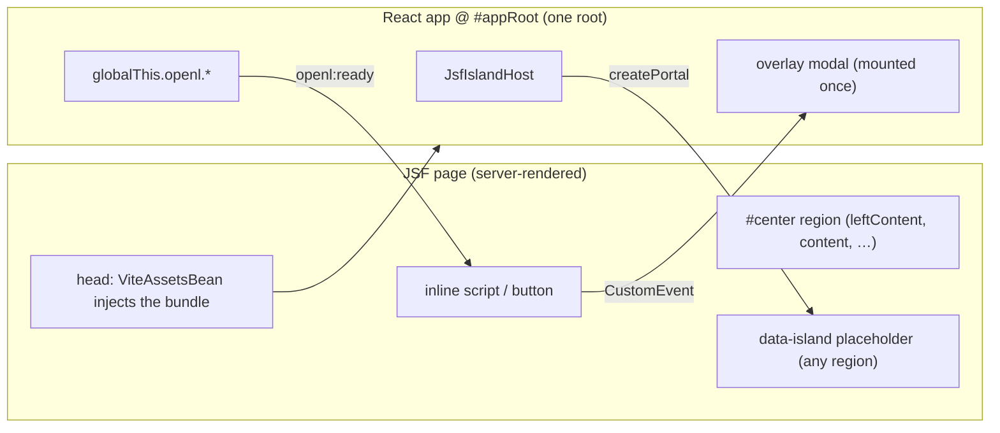

# Migrating JSF UI to React

How to move OpenL Studio UI off legacy JSF/RichFaces onto the React frontend (`STUDIO/studio-ui`)
**incrementally**, one dialog / popup / panel / page at a time, without a big-bang rewrite. This is the
general guide.

## Foundation: one React app inside the JSF shell

`ViteAssetsBean` injects the studio-ui bundle into every JSF page's `<head>`, and the app mounts once at
`#appRoot` (`studio-ui/src/index.tsx`). The JSF shell (menus, breadcrumbs, the `#content` region that jQuery
swaps on navigation) stays; React lives alongside it.

- **There is exactly one React root (`#appRoot`).** Everything else renders through **portals** or the
  router — never a second `createRoot` inside a JSF fragment.
- React components reached this way share the app's context: Ant Design (`AntApp`), i18n, `SystemContext` /
  `PermissionContext`, Zustand stores, and React Router.



Pick the pattern by what you are migrating:

| Migrating… | Pattern | Mechanism |
| --- | --- | --- |
| A panel, page fragment, or inline widget | **Island** | `createPortal` into a `data-island` placeholder |
| A dialog / popup / modal opened by a JSF action | **Event-triggered overlay** | a `CustomEvent` opens a React modal mounted once |
| React needing a page capability, or JSF needing a React service | **Service bridge** | `globalThis.openl.<service>` + `openl:ready` |

## Pattern A — Island (panels, fragments, whole pages)

Replace a JSF region with a React component rendered in place. `JsfIslandHost` (mounted once in
`DefaultLayout`) observes the `#center` shell region — which wraps `#leftContent`, `#content`,
`#bottomContent` and `#rightContent` — with a `MutationObserver` and `subtree`, falling back to the document
body when a page has no such region. When a `<div data-island="<name>">` placeholder appears inside it, it
`createPortal`s the registered component into it, and drops the portal when the placeholder leaves the DOM
(navigation / panel reload).

It observes that region rather than the whole document **on purpose**: `#center` is a sibling of the React
root `#appRoot`, so the observer stays off the React app's own renders and antd's body-level popups (modals,
dropdowns, tooltips). It rescans only when a mutation actually adds or removes a placeholder — the islands'
own re-renders and the legacy page's constant DOM churn (RichFaces AJAX, layout resizing, the table editor)
are ignored — and re-renders only when the set of mounted islands changes.

> [!Note]
> A region that is not replaced on navigation (e.g. `#leftContent`, the persistent left panel) keeps its
> island mounted across route changes — usually what you want for a persistent side panel. A region that is
> swapped (like `#content`) drops and remounts its island.

**Steps**

1. Build the component under `containers/` (or reuse an existing one).
2. Register it in `components/islandRegistry.tsx`, keyed by island name; the element's `dataset` is the
   props source:
   ```tsx
   export const ISLAND_REGISTRY: Record<string, (dataset: DOMStringMap) => React.ReactNode> = {
       'project-page': (dataset) => <ProjectPage projectId={dataset['projectId'] ?? ''} />,
       help: () => <Help />,
   }
   ```
3. Replace the JSF fragment's body with the placeholder, passing inputs as `data-*` attributes:
   ```xml
   <div data-island="project-page" data-project-id="#{studio.currentProjectId}"></div>
   ```
4. For anything beyond a couple of scalars, fetch from REST inside the component (see *Backend data*) rather
   than stuffing state into `data-*`.

Worked examples: `home.xhtml` → `Help`, `pages/modules/changes.xhtml` → `LocalChangesView`.

## Pattern B — Event-triggered overlay (dialogs, popups, modals)

The React modal is **mounted once** (in `DefaultLayout`) and stays dormant until a JSF action opens it via a
`window`/`globalThis` `CustomEvent`. The event `detail` carries the modal's inputs and callbacks.

**React side** — listen with `useGlobalEvents`, open on a non-null detail, and close by re-dispatching the
same event with `detail: null`:

```tsx
export const DeleteFileModal: React.FC = () => {
    const { detail } = useGlobalEvents<DeleteFileModalDetail>('openDeleteFileModal')
    const [visible, setVisible] = useState(false)
    useEffect(() => { setVisible(!!(detail && Object.keys(detail).length > 0)) }, [detail])
    const close = () => globalThis.dispatchEvent(new CustomEvent('openDeleteFileModal', { detail: null }))
    // …antd <Modal open={visible} …>; on confirm call the REST service, then detail.onSuccess?.()
}
```

**JSF side** — dispatch from an inline script / button handler:

```js
globalThis.dispatchEvent(new CustomEvent('openDeleteFileModal', { detail: { projectId, path, name, onSuccess } }))
```

- `detail` is passed in-document, so it may include **callbacks** (e.g. `onSuccess`) that refresh the JSF
  page (a RichFaces re-render, a reload, or `globalThis.openl` call) after the action succeeds.
- Mount the modal once in `DefaultLayout` alongside the existing ones.

Worked examples: `DeleteFileModal` (`openDeleteFileModal`), `MergeModal` (`openMergeModal`), `DeployModal`
(`openDeployModal`), `TraceExecutionModal`, `TableGraphModal`.

### Reusing a Projects tab dialog

A dialog the Projects tab already has takes a loaded project rather than an event. Wrap it in a small **host**
that turns the event into that project, and send only the project id — the JSF page then makes no REST call of
its own, and both tabs open the same dialog with the same data.

```tsx
export const SaveProjectModalHost: React.FC = () => {
    const { detail, project, close } = useEventProject<SaveProjectModalDetail>(
        'openSaveProjectModal', 'repository:browser.save_dialog.load_failed')
    return <SaveProjectModal onClose={close} onSaved={() => detail?.onSuccess?.()}
        open={project !== null} project={project} />
}
```

`useEventProject` listens for the event, reads the project, holds the loading overlay for the read, and keeps
the dialog shut when the project cannot be read — reporting why instead of opening it empty.

Worked examples: `SaveProjectModalHost` (`openSaveProjectModal`), `ExportProjectModalHost`
(`openExportProjectModal`, with an optional `filePath` to export a single file), `CopyProjectModalHost`
(`openCopyProjectModal`).

## Pattern C — Service bridge (React ↔ JSF interop)

When a legacy page needs a React-owned capability (or vice versa), publish it on `globalThis.openl` once and
announce readiness so inline scripts that run before React mounts can wait for it.

```ts
// studio-ui/src/legacy/projectStatusBridge.ts — side-effect import from App.tsx
globalThis.openl = globalThis.openl ?? {}
globalThis.openl.projectStatus = { fetch: fetchProjectStatus, subscribe: subscribeProjectStatus }
document.dispatchEvent(new CustomEvent('openl:ready'))
```

```js
// legacy caller
function whenReady(cb) {
    if (globalThis.openl?.projectStatus) { cb(); return }
    document.addEventListener('openl:ready', cb, { once: true })
}
```

Worked examples: `projectStatusBridge` (`openl.projectStatus`), `notificationBridge` (`openl.notification`,
behind `notifyUser` in `common.js`), `loaderBridge` (`openl.loader`, behind `notifyLoader` — drives the
full-screen `LoadingOverlay` that replaced the jQuery `#loadingPanel` spinner).

## Backend data

The React component talks to the server through REST (`services/apiCall.ts`), **never** by reading JSF beans.

- For read-only views, call an existing `GET`.
- Identify project and module state in every read and action instead of reading the JSF session. For example, the
  Local Changes island calls `GET /projects/{projectId}/local-history?module={moduleName}` to read history and
  `POST /projects/{projectId}/local-history/restore?module={moduleName}` to restore it. Project-wide deletion uses
  `DELETE /projects/{projectId}/local-history`. Its legacy comparison page
  receives the same project ID and module name. This keeps every action scoped to the island after remounts, in a
  fresh HTTP session, and when another browser tab changes the session's current module.
- For editable state, put a REST **façade** in front of the domain service and make it the **source of
  truth** (e.g. `GET`/`PUT /projects/{id}/descriptor`). Guard concurrent edits with an optimistic
  **content hash**: `GET` returns it, `PUT` echoes it, a mismatch returns `409` → the UI confirms and retries
  with a `force` flag.
- After a write that changes compiled state, trigger the server-side reset/recompile and, if the JSF shell
  shows stale data (tree, breadcrumbs), refresh it.

## Migration recipe

1. **Scope** the JSF fragment/dialog: its bean actions, its inputs, and the server state it reads/writes.
2. **Choose the pattern** (island vs overlay) from the table above.
3. **Data** — if it edits server state, add or reuse REST endpoints (with the content-hash guard); confirm
   read endpoints exist.
4. **Build** the React component: i18n keys from day one, `*.styles.ts`, `data-testid` for test hooks.
5. **Wire** it — register the island, or mount the modal and dispatch its event from JSF.
6. **Replace** the JSF content with the placeholder (island) or add the trigger dispatch (overlay).
7. **Test** — unit (below) and live in the running JSF shell.
8. **Retire** the JSF code once nothing references it: delete the now-dead bean actions and RichFaces popups,
   verified by a build + boot. Removing shared helpers is easy to get wrong — remove only members with zero
   remaining references and let the compiler confirm.
9. **Commit** one migration per commit, each buildable and green on its own. When two migrations share a file
   (e.g. `islandRegistry.tsx`), keep the earlier commit self-contained — register only the islands that commit
   introduces, and add the rest in the commit that adds their components.

## Testing

- **Unit** (Vitest + RTL): mock `services` and `react-i18next`. For islands, `JsfIslandHost` tests mock the
  registry and drive a `MutationObserver` cycle inside `act`. For overlays, dispatch the `CustomEvent` and
  assert the modal reacts. Heed the jsdom caveats in `studio-ui/AGENTS.md` (antd `Modal`/`Table` need
  `act`-flushing; mock antd `Select` with a native `<select>`).
- **Live**: run the war with the dev bundle (`_REACT_UI_ROOT_` → Vite), open the JSF page, and confirm the
  island/modal renders, round-trips through REST, and unmounts on navigation.

## Gotchas

- **One root.** Render through portals; never a second `createRoot` in `#content`.
- **Context comes from the tree, not the DOM.** Islands get Router/AntApp/i18n/security because they portal
  from within `DefaultLayout` — not because of where the placeholder sits in the JSF DOM.
- **RichFaces ships Prototype.js**, which clobbers globals (e.g. `Object.values`) on JSF pages. A library that
  breaks only on JSF pages is the tell; lock the native methods (see `prototypeJsCompat`).
- **Real-input libraries** (drag-and-drop, rich editors) can't always be driven by synthetic events in tests —
  unit-test the callback/handler and verify the gesture live.
- **`data-*` is strings only.** Pass identifiers through the dataset; fetch the rest from REST.
