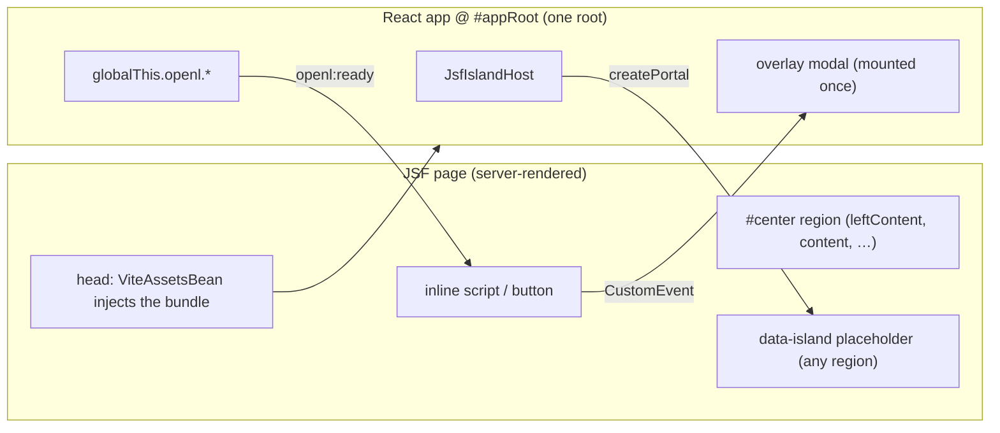

# Migrating JSF UI to React

How to move OpenL Studio UI off legacy JSF/RichFaces onto the React frontend (`STUDIO/studio-ui`)
**incrementally**, one dialog / popup / panel / page at a time, without a big-bang rewrite. This is the
general guide.

## Foundation: one React app inside the JSF shell

`ViteAssetsBean` injects the studio-ui bundle into every JSF page's `<head>`, and the app mounts once at
`#appRoot` (`studio-ui/src/index.tsx`). The JSF shell (menus, breadcrumbs, the `#content` region that jQuery
swaps on navigation) stays; React lives alongside it.

- **There is exactly one React root (`#appRoot`).** Everything else renders through **portals** or the
  router — never a second `createRoot` inside a JSF fragment.
- React components reached this way share the app's context: Ant Design (`AntApp`), i18n, `SystemContext` /
  `PermissionContext`, Zustand stores, and React Router.



Pick the pattern by what you are migrating:

| Migrating… | Pattern | Mechanism |
| --- | --- | --- |
| A panel, page fragment, or inline widget | **Island** | `createPortal` into a `data-island` placeholder |
| A dialog / popup / modal opened by a JSF action | **Event-triggered overlay** | a `CustomEvent` opens a React modal mounted once |
| React needing a page capability, or JSF needing a React service | **Service bridge** | `globalThis.openl.<service>` + `openl:ready` |

## Pattern A — Island (panels, fragments, whole pages)

Replace a JSF region with a React component rendered in place. `JsfIslandHost` (mounted once in
`DefaultLayout`) observes the `#center` shell region — which wraps `#leftContent`, `#content`,
`#bottomContent` and `#rightContent` — with a `MutationObserver` and `subtree`, falling back to the document
body when a page has no such region. When a `<div data-island="<name>">` placeholder appears inside it, it
`createPortal`s the registered component into it, and drops the portal when the placeholder leaves the DOM
(navigation / panel reload).

It observes that region rather than the whole document **on purpose**: `#center` is a sibling of the React
root `#appRoot`, so the observer stays off the React app's own renders and antd's body-level popups (modals,
dropdowns, tooltips). It rescans only when a mutation actually adds or removes a placeholder — the islands'
own re-renders and the legacy page's constant DOM churn (RichFaces AJAX, layout resizing, the table editor)
are ignored — and re-renders only when the set of mounted islands changes.

> [!Note]
> A region that is not replaced on navigation (e.g. `#leftContent`, the persistent left panel) keeps its
> island mounted across route changes — usually what you want for a persistent side panel. A region that is
> swapped (like `#content`) drops and remounts its island.

**Steps**

1. Build the component under `containers/` (or reuse an existing one).
2. Register it in `components/islandRegistry.tsx`, keyed by island name; the element's `dataset` is the
   props source:
   ```tsx
   export const ISLAND_REGISTRY: Record<string, (dataset: DOMStringMap) => React.ReactNode> = {
       'project-page': (dataset) => <ProjectPage projectId={dataset['projectId'] ?? ''} />,
       help: () => <Help />,
   }
   ```
3. Replace the JSF fragment's body with the placeholder, passing inputs as `data-*` attributes:
   ```xml
   <div data-island="project-page" data-project-id="#{studio.currentProjectId}"></div>
   ```
4. For anything beyond a couple of scalars, fetch from REST inside the component (see *Backend data*) rather
   than stuffing state into `data-*`.

Worked examples: `home.xhtml` → `Help`, `pages/modules/changes.xhtml` → `LocalChangesView`.

## Pattern B — Event-triggered overlay (dialogs, popups, modals)

The React modal is **mounted once** (in `DefaultLayout`) and stays dormant until a JSF action opens it via a
`window`/`globalThis` `CustomEvent`. The event `detail` carries the modal's inputs and callbacks.

**React side** — listen with `useGlobalEvents`, open on a non-null detail, and close by re-dispatching the
same event with `detail: null`:

```tsx
export const DeleteFileModal: React.FC = () => {
    const { detail } = useGlobalEvents<DeleteFileModalDetail>('openDeleteFileModal')
    const [visible, setVisible] = useState(false)
    useEffect(() => { setVisible(!!(detail && Object.keys(detail).length > 0)) }, [detail])
    const close = () => globalThis.dispatchEvent(new CustomEvent('openDeleteFileModal', { detail: null }))
    // …antd <Modal open={visible} …>; on confirm call the REST service, then detail.onSuccess?.()
}
```

**JSF side** — dispatch from an inline script / button handler:

```js
globalThis.dispatchEvent(new CustomEvent('openDeleteFileModal', { detail: { projectId, path, name, onSuccess } }))
```

- `detail` is passed in-document, so it may include **callbacks** (e.g. `onSuccess`) that refresh the JSF
  page (a RichFaces re-render, a reload, or `globalThis.openl` call) after the action succeeds.
- Mount the modal once in `DefaultLayout` alongside the existing ones.

Worked examples: `DeleteFileModal` (`openDeleteFileModal`), `MergeModal` (`openMergeModal`), `DeployModal`
(`openDeployModal`), `TableGraphModal`, `TraceLaunchHost` (`openTraceLaunch`), `RunLaunchHost`
(`openRunLaunch`), `TestsLaunchHost` (`openTestsLaunch`), `BenchmarkLaunchHost` (`openBenchmarkLaunch`).

A dialog that replaces a legacy drop-down keeps its place under the button: the event carries the button's
viewport rectangle (`event.currentTarget.getBoundingClientRect()`), and the React side hangs an Ant Design
`Popover` on an invisible fixed anchor at that rectangle. The legacy page and the React app share one document,
so no coordinate translation is needed; an outside click closes the popover as it closed the drop-down.
Worked example: `TableInputPopover` used by `TraceLaunchHost`.

Every action of the table toolbar asks for the same things, so one panel serves them all:
`TableInputLauncher` reads what the table takes, shows the parameter form of a rule table or the cases of a
test table, offers "Within Current Module Only", and hands what it collected to the buttons the action
supplies. Trace, Run, Test and Benchmark differ only in those buttons and in the options next to the checkbox,
which the panel renders through the same render props so an action offers only what applies to the table it is
on.

### Showing what an action produced

A result belongs to the editor, so it is shown in a modal over the table rather than in a window of its own:
the host that started the action swaps its panel for the result modal (`RunResultModal`, `TestsResultModal`,
`BenchmarkResultModal`) and closes both together. Closing the modal returns to the table with the action still in view, which the
legacy pages could not do - they replaced it.

A trace is the exception: it is a session the user works in, not a result to read, so it keeps a window of its
own on a route outside the main layout (`/trace/:projectId`).

The result modal opens while the action is still on its way and waits on the topic the action reports its status
on. It reads the result once as soon as it is subscribed, which covers an action that ended before the window
was there to hear about it, and again when the status says the action has ended. The status is reported from
inside the run, so a read right after it can still answer "not ended yet" (`409`); the read is repeated for a
few seconds to let the result appear, and a run that is genuinely still going on simply waits for the next
status. Nothing polls.

A screen that only reads values asks for them lazily. The test results are read with `lazyValues=true`: an input
with inner structure and the whole returned value arrive as references, and no schema is written at all. The
screen reads such a value from `GET /projects/{id}/tests/summary/{tableId}/cases/{caseId}`, which answers with
one case of the run in full, when the user asks for it. On a project of fourteen test tables that is 62% less
over the wire. The option is off by default, so a client that wants everything at once keeps getting it.

A second view of the same value is asked for the same way. A run reports what the table returned as the value
OpenL Rule Services publishes, and `GET /projects/{id}/run/result?spreadsheet=true` adds `resultSpreadsheet`,
the same value laid out by the rows and the columns of the spreadsheet it was calculated by. The run window
asks for it to show the result as the table its author wrote; the layout repeats the values, about a fifth of
the response, so a caller that does not show a table is not sent it. The value itself and the schema that
describes it never change shape - a field whose meaning turns on a query parameter would leave its schema
describing something else, and the "Result in JSON Format" download would quietly stop being the JSON a
deployed service answers with.

An action whose results accumulate keeps them on the server, not in the screen. A benchmark joins the
measurements of the session (`ExecutionBenchmarkResultRegistry`), which `GET /projects/{id}/benchmarks` reports
newest first and `DELETE` forgets, so the window shows what the session has measured however often it is opened
and closed. The registry holds the running measurement the way every execution registry does, and folds its
result into the list once, when the list is first read after it ends.

### Reusing a Projects tab dialog

A dialog the Projects tab already has takes a loaded project rather than an event. Wrap it in a small **host**
that turns the event into that project, and send only the project id — the JSF page then makes no REST call of
its own, and both tabs open the same dialog with the same data.

```tsx
export const SaveProjectModalHost: React.FC = () => {
    const { detail, project, close } = useEventProject<SaveProjectModalDetail>(
        'openSaveProjectModal', 'repository:browser.save_dialog.load_failed')
    return <SaveProjectModal onClose={close} onSaved={() => detail?.onSuccess?.()}
        open={project !== null} project={project} />
}
```

`useEventProject` listens for the event, reads the project, holds the loading overlay for the read, and keeps
the dialog shut when the project cannot be read — reporting why instead of opening it empty.

Worked examples: `SaveProjectModalHost` (`openSaveProjectModal`), `ExportProjectModalHost`
(`openExportProjectModal`, with an optional `filePath` to export a single file), `CopyProjectModalHost`
(`openCopyProjectModal`).

## Pattern C — Service bridge (React ↔ JSF interop)

When a legacy page needs a React-owned capability (or vice versa), publish it on `globalThis.openl` once and
announce readiness so inline scripts that run before React mounts can wait for it.

```ts
// studio-ui/src/legacy/projectStatusBridge.ts — side-effect import from App.tsx
globalThis.openl = globalThis.openl ?? {}
globalThis.openl.projectStatus = { fetch: fetchProjectStatus, subscribe: subscribeProjectStatus }
document.dispatchEvent(new CustomEvent('openl:ready'))
```

```js
// legacy caller
function whenReady(cb) {
    if (globalThis.openl?.projectStatus) { cb(); return }
    document.addEventListener('openl:ready', cb, { once: true })
}
```

Worked examples: `projectStatusBridge` (`openl.projectStatus`), `notificationBridge` (`openl.notification`,
behind `notifyUser` in `common.js`), `loaderBridge` (`openl.loader`, behind `notifyLoader` — drives the
full-screen `LoadingOverlay` that replaced the jQuery `#loadingPanel` spinner).

## Backend data

The React component talks to the server through REST (`services/apiCall.ts`), **never** by reading JSF beans.

- For read-only views, call an existing `GET`.
- Identify project and module state in every read and action instead of reading the JSF session. For example, the
  Local Changes island calls `GET /projects/{projectId}/local-history?module={moduleName}` to read history and
  `POST /projects/{projectId}/local-history/restore?module={moduleName}` to restore it. Project-wide deletion uses
  `DELETE /projects/{projectId}/local-history`. Its comparison window is opened with the same project ID and
  module name. This keeps every action scoped to the island after remounts, in a fresh HTTP session, and when
  another browser tab changes the session's current module.
- For editable state, put a REST **façade** in front of the domain service and make it the **source of
  truth** (e.g. `GET`/`PUT /projects/{id}/descriptor`). Guard concurrent edits with an optimistic
  **content hash**: `GET` returns it, `PUT` echoes it, a mismatch returns `409` → the UI confirms and retries
  with a `force` flag.
- After a write that changes compiled state, trigger the server-side reset/recompile and, if the JSF shell
  shows stale data (tree, breadcrumbs), refresh it.
- For work that cannot answer within a request — comparing two workbooks, running rules — use three steps
  instead of one long call: a `POST` that starts the work and answers with its identifier, a WebSocket topic
  named by that identifier that reports how it is going, and a `GET` that reads the result once it has
  completed. The work runs on an executor of its own, and what it holds stays in a session-scoped registry
  that releases it when another one starts or the session ends. Compare (`POST /compare/files` →
  `/user/topic/compare/{id}/status` → `GET /compare/{id}`) and Run (`POST /projects/{id}/run` →
  `/topic/projects/{id}/tables/{tableId}/run/status`) are built this way. What is reported to one user
  is sent to that user, so the client subscribes to it under `/user`.
- When the work is a **compilation**, none of that is built again: it already reports on the project's status
  channel, which names each module as it finishes (`compilation.modules.compiledModules`). So opening a module
  is `POST /projects/{id}/modules/{name}/compile`, which answers `202` the moment the work is handed over, and
  the screen follows the channel it already subscribes to. The session-scoped collaborators the work needs are
  out of reach of a background thread, so the request thread looks them up and the task carries them along.
- **A read that waits has to be found in every path, not just the obvious one.** The tables *list* was the
  visible one; the body of a single table went through `getOpenLTable`, which opened the project's first module
  and joined the whole compilation — so the editor let the reader in on time and then hung on the first table it
  drew. Every read the screen makes takes the module: the list, the table, and the tests that cover it.
- **What the user set for themselves still applies — and the screen, not the server, applies it.** The Editor
  has always obeyed the profile's Table Settings, so the new screen obeys them too: Default Order picks the
  grouping the tree opens on, Show Formulas draws the formula a cell was written with, Show Header puts the
  header away. None of them is a request parameter: a display choice that changes nothing about what the server
  knows does not belong in the contract, and a read per setting is a read too many. What the server owes the
  screen is where things are — every cell carries both its `value` and the `formula` behind it, and the table
  says in `headerHeight` how many rows its header takes (the header line, a properties section, the service rows
  of a decision table — read from the engine's own business view of that table). The screen chooses; when
  editing arrives it sends back whichever of the two the author edited.
- **A rail of hundreds of tables draws the rows it shows.** The tree is virtualised (`height`, `itemHeight`
  and `scrollWidth` on Ant Design's `Tree`), so scrolling paints a screenful rather than a module. Without it
  every node sits in the DOM and the widest of them is measured across all of them, which is why a long tree
  scrolled to a blank page and filled in once the scrolling stopped.
- **A problem leads to the table it was raised against, and asks nothing to do it.** Every compilation message
  already carries where it came from — the project, the module, the table and the cell — so the list makes each
  message a link built from what it already holds: a project raising a thousand of them still costs no request.
  The project is part of that, because a message can be raised in a project this one depends on, and the reader
  has to be sent there rather than to the project being compiled. While a module is being compiled the links
  stand still, for the same reason the module list does.
- **What the compiler said about the table is shown with the table.** The read of a table carries its own
  messages, so they sit in a foldable section above it, the way the legacy editor kept its Problems block —
  the project's other messages stay in the panel at the foot of the screen. Both draw through one component,
  so a message reads the same wherever it is shown.
- **Nothing may animate a painted property while a reader scrolls.** The compiling indicator beat with a
  `box-shadow`, which the page paints — so every frame recalculated style and repainted, and the browser's own
  trace of a scroll over a large table showed 346 style recalculations and 610 paints in four seconds, with the
  GPU process pegged and the screen going blank behind the scroll. The same scroll with the animation silenced
  cost one style recalculation and one paint. The beat is a ring moved by `transform` and `opacity` now, which
  is the compositor's own work: 6 paints for the same scroll.
- **A table is drawn at the width its values need, not the width of the screen.** Squeezing a table of several
  hundred columns into the page gives each column a few characters and wraps every value into a tower of
  lines: a table 10,000 x 6,700 px where the same table laid out naturally is 32,000 x 700 — three times the
  pixels to paint, and unreadable besides. The screen it sits on scrolls instead.
- **A tall table arrives a window at a time.** The read takes `startRow` and `maxRows` and answers `totalRows`,
  so the screen draws the first window and fetches the rest as the reader asks for it.
- **Read what is ready, not what is finished.** Opening a module compiles that module before the rest of the
  project, so `GET /projects/{id}/tables?module={name}` answers as soon as that module is done and never waits
  for the modules after it — on a large project, minutes of waiting for work nobody asked about. The editor
  renders on the first status naming its module, while the rest go on compiling behind the open screen. The
  same read without `module` still waits for the whole project, so no existing caller changes.
- **A progress report cannot wait for the work it reports on.** Opening a module compiles it while the
  project model's own monitor is held — minutes, on a large project — and most of the status is read under
  that same monitor, so a status handed off to another thread waited for the compilation it was reporting on
  and arrived as one burst at the end. What the compiling thread can read without waiting (the module counts
  and the names already built) it publishes itself, as a progress-only status; the full one — every message
  resolved to its table, the tests counted over every method, and what is not committed yet — follows once the
  monitor is free. Updates handed off are coalesced, since the hand-off reads the status when it runs, not when
  it was asked to. A screen reading a progress status is therefore told how many problems there are but not
  which: the problems panel stands on those counts, or it would vanish under its reader for as long as a
  compilation lasts and come back when it ended.
- **"Compiled" must mean compiled.** The status names the modules already built, and the module being opened
  used to be named from the moment it was asked for — its compilation finishes inside `setModuleInfo`, so by
  the time anyone could read the status it was true. Once the compiling thread reports its own progress it is
  no longer true, and a screen waiting for its module was let in before the module existed, only to hang on
  the first read. The model now says whether the opened module is compiled, and the status answers with it.
- **Work carried out for a session must not need the session's request.** A compilation handed to a
  background thread reached for the HTTP session twice — the local repository a module's history is written
  to, and the path that history is kept at — and found none, so the work failed quietly behind a debug log and
  a refresh looked like it did nothing. The studio holds the user's session, so the work asks it
  (`WebStudio.getUserWorkspace()`) instead of the thread it happens to run on.
- **Asking how a compilation is going must not wait for it.** Reading the status used to take the model's own
  lock, which a compilation holds from its first module to its last — so the projects list froze for minutes
  whenever any module was being built. The status is read from what the compilation has already published, so
  it answers at once; a read a moment before a module finishes simply does not count that module.
- **A wait the reader did not ask for can be ended.** Compiling a large project takes minutes, so the waiting
  screen offers to stop it: `DELETE /projects/{id}/modules/{name}/compile` answers at once, the module being
  compiled at that moment is finished — a module cannot be abandoned halfway — and nothing after it is started.
  The engine already had the switch (a dependency manager that is no longer active answers every request as an
  interrupted compilation); what was added is asking for it, and a `cancelled` compile state, since a
  compilation that stopped is neither running nor finished. What was compiled stays readable — a read waiting
  on a stopped compilation is answered with it, not with an error — and the next request to compile the module
  builds it from the workbook, whether or not it asks for a reset: opening a module already open compiles
  nothing, so a compilation that was stopped would otherwise never start again.
- **Refreshing is compiling again, not asking again.** Opening a module already open compiles nothing, so
  Refresh says so: `POST .../compile?reset=true` drops what was compiled and builds the module from the
  workbook once more. Without the flag the endpoint leaves a compiled module as it is, which is what opening a
  module means.
- When such work is shown in a window of its own, let **the new window start it**, telling it what to do in
  the address (`/compare?projectId=…&first=…&second=…`). A screen that starts the work first and opens the
  window afterwards opens it after an `await`, when the click no longer counts as user activation and a
  blocker can refuse it silently — and the window misses whatever the topic reported meanwhile.
- One window serves every way of reaching such work, told in the address which of them this is: `/compare`
  compares two uploaded files, two versions of a module, a file of a project against a revision of it, or the
  two versions of a file a merge could not settle. The screen that opens it names what to compare and nothing
  else, so a new way of comparing adds a reading of the address rather than a window of its own.

## Migration recipe

1. **Scope** the JSF fragment/dialog: its bean actions, its inputs, and the server state it reads/writes.
2. **Choose the pattern** (island vs overlay) from the table above.
3. **Data** — if it edits server state, add or reuse REST endpoints (with the content-hash guard); confirm
   read endpoints exist.
4. **Build** the React component: i18n keys from day one, `*.styles.ts`, `data-testid` for test hooks.
5. **Wire** it — register the island, or mount the modal and dispatch its event from JSF.
6. **Replace** the JSF content with the placeholder (island) or add the trigger dispatch (overlay).
7. **Test** — unit (below) and live in the running JSF shell.
8. **Retire** the JSF code once nothing references it: delete the now-dead bean actions and RichFaces popups,
   verified by a build + boot. Removing shared helpers is easy to get wrong — remove only members with zero
   remaining references and let the compiler confirm.
9. **Commit** one migration per commit, each buildable and green on its own. When two migrations share a file
   (e.g. `islandRegistry.tsx`), keep the earlier commit self-contained — register only the islands that commit
   introduces, and add the rest in the commit that adds their components.

## Testing

- **Unit** (Vitest + RTL): mock `services` and `react-i18next`. For islands, `JsfIslandHost` tests mock the
  registry and drive a `MutationObserver` cycle inside `act`. For overlays, dispatch the `CustomEvent` and
  assert the modal reacts. Heed the jsdom caveats in `studio-ui/AGENTS.md` (antd `Modal`/`Table` need
  `act`-flushing; mock antd `Select` with a native `<select>`).
- **Live**: run the war with the dev bundle (`_REACT_UI_ROOT_` → Vite), open the JSF page, and confirm the
  island/modal renders, round-trips through REST, and unmounts on navigation.

## Gotchas

- **One root.** Render through portals; never a second `createRoot` in `#content`.
- **Context comes from the tree, not the DOM.** Islands get Router/AntApp/i18n/security because they portal
  from within `DefaultLayout` — not because of where the placeholder sits in the JSF DOM.
- **RichFaces ships Prototype.js**, which clobbers globals (e.g. `Object.values`) on JSF pages. A library that
  breaks only on JSF pages is the tell; lock the native methods (see `prototypeJsCompat`).
- **Real-input libraries** (drag-and-drop, rich editors) can't always be driven by synthetic events in tests —
  unit-test the callback/handler and verify the gesture live.
- **`data-*` is strings only.** Pass identifiers through the dataset; fetch the rest from REST.
