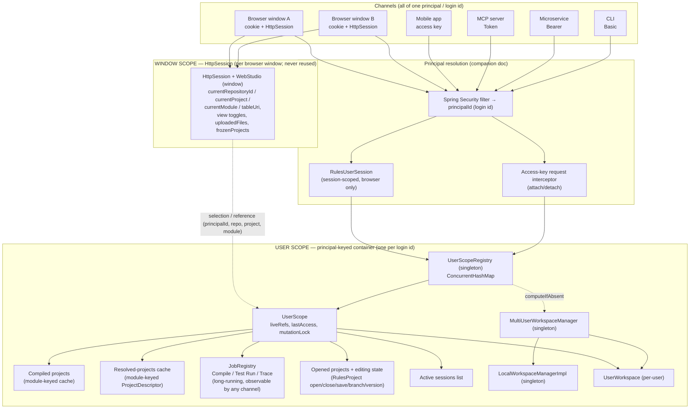
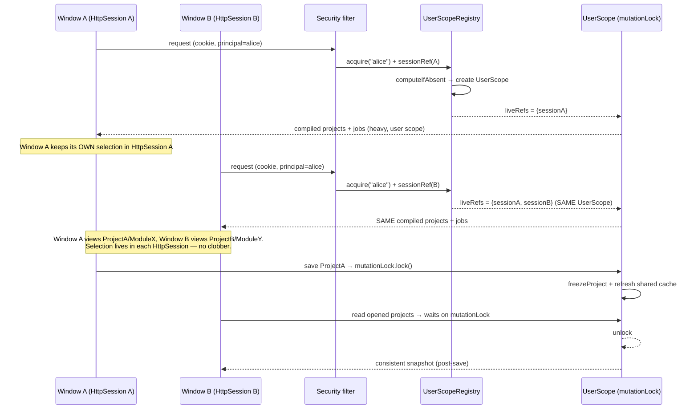
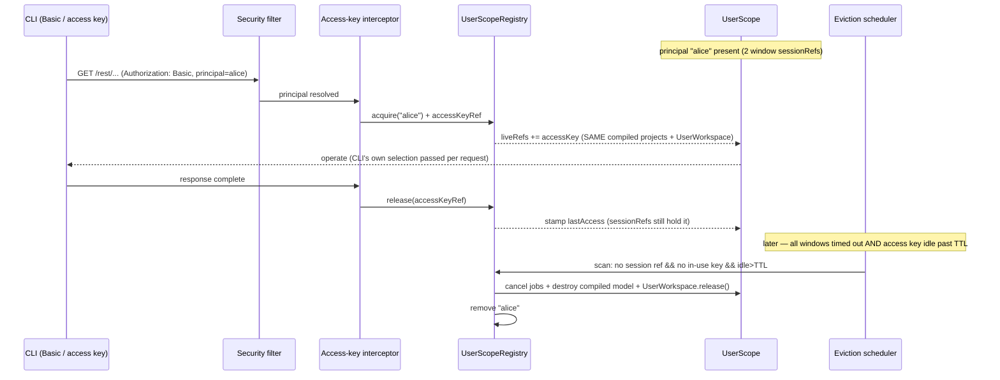
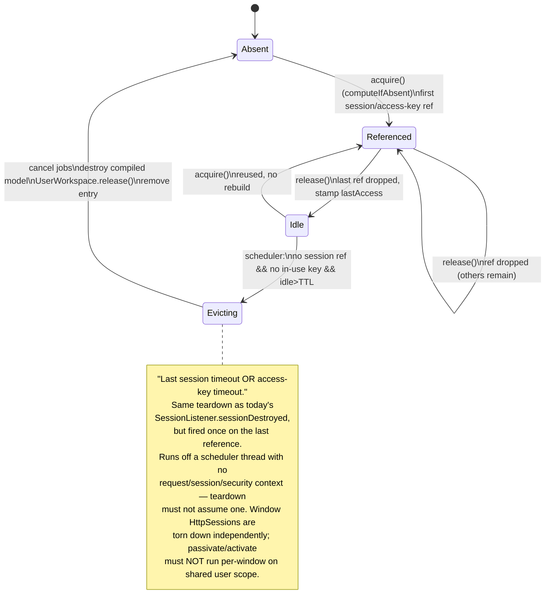
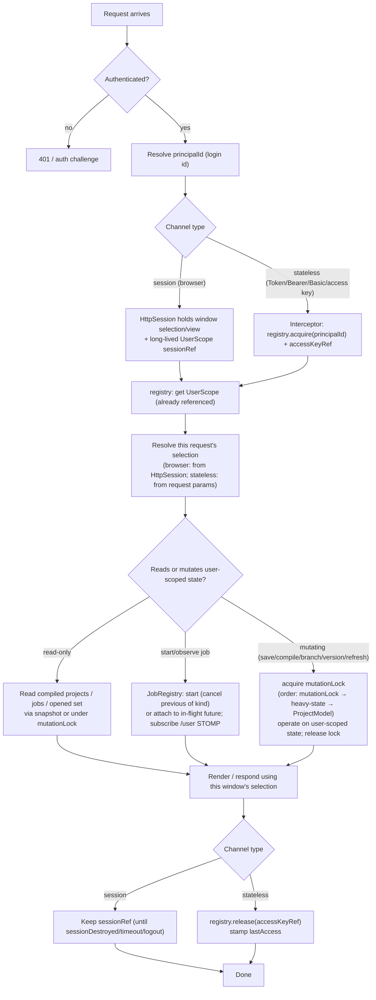

# Two-Scope Server-Side State for OpenL Studio: Window Scope and User Scope

## Status

- **Status:** Deferred / superseded-in-practice. The near-term **decision of record** is
  [rest-api-token-access.md](rest-api-token-access.md). Read the [Critical Assessment](#critical-assessment) first — it
  concludes this grand design is disproportionate to the goal and recommends that MVP instead.
- **Direction (deferred):** the long-term option is to hold the heavy, long-lived, cross-channel state of a user in
  **one** server-side container per authenticated principal, **separate** from the per-browser-window
  `HttpSession`, with exactly **two** server-side scopes:
  - **Window scope = `HttpSession`** — one per browser window/client. Holds the per-window navigation/selection/view
    state. Stays exactly as it is today; never reused, never reassigned across users or channels (Jakarta Servlet
    constraint, below).
  - **User scope = principal-keyed bean container** — one per authenticated principal (login id). Holds the heavy
    objects (compiled OpenL projects), the long-running job state (Compile / Test Run / Trace), the opened-projects
    and project-editing state, and the list of the user's active sessions. Shared across all of the user's windows and
    channels and accessed by principal (login id).
- **Supersedes:** This is the converged state-sharing design. It replaces the earlier session-reuse approach (reuse the
  per-window session-scoped `WebStudio`): the per-window `HttpSession` is kept for **window** state, but the heavy
  per-user state is shared **by principal** across all channels. The reversal is deliberate and narrowed — only the
  *user-scoped* heavy state is shared; the *window-scoped* navigation/view state stays in the `HttpSession` and is never
  shared, which removes most of the cross-talk risk. The companion document
  [auth-precedence-header-over-cookie.md](auth-precedence-header-over-cookie.md) now covers only
  the **authentication precedence** (`Authorization` header over the session cookie) that this design depends on.

> [!Note]
> "One state per user" cannot mean one `HttpSession`. Per the Jakarta Servlet API specification an `HttpSession` is
> cookie-bound and per-client, it cannot be reassigned to a different user, and it cannot be shared across clients.
> Five devices cannot share one cookie jar, and the spec forbids reusing a session across channels. Therefore the
> session is the wrong home for cross-channel state. Throughout this document, "one per user" means **one
> user-scoped, principal-keyed container** that every channel resolves by its authenticated login id, independent of
> any transport-level session.

## The Two-Scope Model in One Sentence

The `HttpSession` is not only the *user* context — it is also the **current browser-window context**. So we keep two
homes for state: the **window** (`HttpSession`) holds *what this tab is looking at*, and the **user-scoped container**
holds *the user's heavy, long-running, cross-channel work*. A window holds only a **selection/reference** into the
user-scoped objects; it never owns them.

## Goals

- Keep per-window navigation/selection/view state in the `HttpSession`, exactly as today. The session remains the
  window context and is never reused or reassigned (Jakarta Servlet API).
- Introduce **user-scoped bean management**: one principal-keyed container per login id holding the heavy state
  (compiled OpenL projects), the long-running job state (Compile / Test Run / Trace), opened projects, project-editing
  state, and the user's active-session list.
- Every channel — session-based browser and stateless header client alike — resolves the **same** user-scoped
  container by authenticated principal (login id).
- A long-running job started by one channel can be monitored/streamed by any other channel of the same user
  (progressive disclosure); results survive in user scope until consumed or evicted.
- The user-scoped state is concurrency-safe under simultaneous access from multiple windows/channels of the same user.
- The user-scoped state is released deterministically: on the **last** session timeout/logout **or** access-key
  (token) expiry/idle TTL.

## Non-Goals

- Sharing one `HttpSession` across devices or channels (impossible and spec-forbidden; see note above).
- Cross-**user** sharing of any state. Scope is strictly per principal.
- Reworking `ProjectModel` internal synchronization (it does its own locking; treated as a black box here, but see the
  lock-ordering risk below).
- Replacing the existing `LockEngine` cross-user repository file-locking (it stays; it is the only correct concurrency
  primitive today and is orthogonal to in-memory state).
- Changing the authentication pipeline itself — channel/principal resolution is assumed from the companion document.
- Distributed/clustered sharing across JVMs. This design is single-node; the container registry is an in-process
  singleton. Clustering is an open decision.

## Current State (grounded in findings)

Investigation across four areas (trace; run/compile jobs; opened/editing; sessions/window) shows the codebase is
**already a partial two-scope system** — but the line is drawn in the wrong place and the heavy state is pinned to a
single window's `HttpSession`.

- **Already per-user (de-facto user scope), keyed by `userId` in singleton managers:**
  - `UserWorkspace` / `UserWorkspaceImpl` — the authoritative open-projects set and each project's open/closed status,
    modified flag, selected branch, viewed version. Cached by `userId` in
    `MultiUserWorkspaceManager.userWorkspaces` (`STUDIO/org.openl.rules.workspace/src/org/openl/rules/workspace/MultiUserWorkspaceManager.java:32`,
    lookup at `:59-66`). The Spring `userWorkspace` bean is `SCOPE_SESSION`
    (`STUDIO/org.openl.rules.webstudio/src/org/openl/studio/config/ServiceApiConfig.java:97`) but merely delegates to
    `RulesUserSession.getUserWorkspace()`, which fetches the shared singleton — so it is **effectively per-user**, not
    per-session.
  - `LocalWorkspace` / `LocalWorkspaceImpl` — the on-disk working copy (uncommitted edits live as real files under
    `<workspace.home>/<userId>/`), singleton-cached by `userId` in `LocalWorkspaceManagerImpl.localWorkspaces`
    (`LocalWorkspaceManagerImpl.java:33`, lookup at `:74`).
  - `RulesProject` open/close/save/branch/version state — one instance per `(repo, name)` shared by all of the user's
    windows; modified flag/branch/version persist to disk via `ProjectState` (`RulesProject.java:509,514,536`;
    `ProjectState.java:6-14`).
- **Per-`HttpSession` (window scope), but holding heavy state it should not own:**
  - `WebStudio` (a `@Scope(SCOPE_SESSION)` bean, `ServiceApiConfig.java:103`) owns exactly **one** `ProjectModel`
    (`WebStudio.java:133`, assigned once in the ctor at `:207`). `RulesUserSession` (the session bean,
    `RulesUserSession.java:12`) holds the `WebStudio`; both are mirrored into `HttpSession` attributes
    (`WebStudioUtils.java:34,52-55`).
  - The window's **navigation cursor** — `currentRepositoryId`/`currentProject`/`currentModule`/`tableUri`
    (`WebStudio.java:147,148,149,132`), set by `init()` (`:595`) — is correctly per-window.
  - But the **compiled `ProjectModel`**, the async **compile/test/run/trace** registries, the trace tree, and the
    test/run results are all pinned to that single window's session today, so opening a second project, or a second
    tab, **clobbers** the shared model and **cancels** the previous job.

So the gap is twofold:

1. **Scope gap** — the heavy/long-running/cross-channel state (compiled `ProjectModel`, job registries, trace tree,
   opened-projects, project-editing) is bound to one window's `HttpSession`. It must move into a **user-scoped
   container** keyed by login id, leaving the `HttpSession` to hold only the per-window selection/view state.
2. **Concurrency gap** — the per-user shared collections are **not** thread-safe (plain `HashMap`s, an unsynchronized
   `ArrayList`, unsynchronized check-then-put in both manager singletons), and `WebStudio`'s heavy state has no
   field-level synchronization. Once that heavy state is shared across concurrent channels, existing latent races
   become reachable in normal operation.

---

## Catalogue: Which Scope Each State Object Belongs To

The classification below is grounded in the investigation findings (file:line). **Window scope = `HttpSession`** (one
per browser window; never shared). **User scope = principal-keyed container** (one per login id; shared across all the
user's windows/channels).

### Window scope (`HttpSession`) — stays exactly as today

| State object | Where it lives | file:line |
| --- | --- | --- |
| `WebStudio` / `RulesUserSession` window owner | `@Scope(SCOPE_SESSION)` bean held as `HttpSession` attribute | `ServiceApiConfig.java:55-106`; `RulesUserSession.java:12-77`; `WebStudioUtils.java:34,40-74` |
| Current window selection (repo / project / module) | `WebStudio.currentRepositoryId` / `currentProject` / `currentModule`, set by `init()` | `WebStudio.java:147,148,149,595` |
| Current table URI (open table in this window) | `WebStudio.tableUri` | `WebStudio.java:132,487,1193` |
| Redirect flag (post branch-switch rename) | `WebStudio.needRedirect` | `WebStudio.java:183,604,697` |
| View toggles (live in-memory values) | `treeView`/`tableView`/`showFormulas`/`testsPerPage`/`collapseProperties` etc. | `WebStudio.java:137-145,251-262` |
| This window's upload buffer | `WebStudio.uploadedFiles` | `WebStudio.java:161,1263,1290` |
| Save-in-progress guard (this window) | `WebStudio.frozenProjects` (already `synchronizedSet`) | `WebStudio.java:182,1555,1563` |
| Merge-conflict editing state (this window) | `ProjectsMergeConflictsSessionHolder` (`@SessionScope`) | `ProjectsMergeConflictsSessionHolder.java:12-49` |
| Recently visited tables (this window's history) | `RecentlyVisitedTables` field inside `ProjectModel` | `RecentlyVisitedTables.java:17-30`; `ProjectModel.java:176,1187` |

> Persisted view defaults (the *saved* `treeView`/`tableView`/tests-paging values) are already **user-global** via
> `UserSettingManagementService` keyed by user name. Only the *live* toggle in the window is window-scoped; the saved
> default is user-scoped. Keep the live value in the session, route the saved preference to user scope.

### User scope (principal-keyed container) — moves out of the `HttpSession`

| State object | Current scope | Target scope | file:line |
| --- | --- | --- | --- |
| Opened-projects set + workspace project list (`UserWorkspace`) | per-user (de-facto) | **user** | `UserWorkspaceImpl.java:59,336`; `MultiUserWorkspaceManager.java:32,59` |
| Open / close / edit / save of a project (`RulesProject`) | per-user (de-facto) | **user** | `RulesProject.java:31,97,101,155,168,261,355,360` |
| Uncommitted working copy on disk (`LocalWorkspace`) | per-user (de-facto) | **user** | `LocalWorkspaceImpl.java:27,33`; `LocalWorkspaceManagerImpl.java:33,65,74` |
| Per-project modified flag | per-user (disk) | **user** | `RulesProject.java:509,514`; `ProjectState.java:6-10` |
| Branch selection per project | per-user (disk) | **user** | `UserWorkspaceProject.java:125,143`; `RulesProject.java:536`; `WebStudio.java:1399` |
| Version selection per project | per-user (disk) | **user** | `RulesProject.java:360`; `ProjectState.java:12-14`; `WebStudio.java:1512` |
| Compiled `ProjectModel` (compiled `OpenClass`, project tree, async compile cycle) | per-`HttpSession` | **user** | `WebStudio.java:133`; `ProjectModel.java:111,135,1356,1366`; `RegisteredCompilation.java:17` |
| Compilation job tracking (COMPILING/OK/ERRORS) | per-`HttpSession` | **user** | `CompilationJobRegistryImpl.java:47,70,74`; `CompilationJobImpl.java:31`; `ProjectHandle.java:40` |
| Test-run results (async "run all tests") | per-`HttpSession` | **user** | `ExecutionTestsResultRegistry.java:23`; `TestsExecutorServiceImpl.java:25`; `AbstractExecutionResultRegistry.java:33,42` |
| Run (single method/table) results (async) | per-`HttpSession` | **user** | `ExecutionRunResultRegistry.java:23`; `RunExecutorServiceImpl.java:1`; `ProjectsRunController.java:89` |
| Trace tree results (`ITracerObject` root) + lazy-disclosure cache | per-`HttpSession` | **user** | `ExecutionTraceResultRegistry.java:28,31`; `TraceHelper.java:23`; `SimpleTracerObject.java:10` |
| Lazily-disclosed large trace parameter values | per-`HttpSession` | **user** | `TraceParameterRegistry.java:32,35,44`; `ProjectsTraceController.java:75,196` |
| Active-sessions list (per principal) | not surfaced today (registry-global) | **user** (read view) | `UserManagementService.java:220-238`; `UserManagementConfiguration.java:86-89`; `CommonAuthenticationConfig.java:74-77` |

### Process-global (neither scope) — stays as-is

| State object | Scope | file:line |
| --- | --- | --- |
| Single-suite test-case parallel executor (engine pool) | global singleton, shared by all sessions | `DEV/.../TestSuiteExecutor.java:8`; `ProjectModel.java:1199,1215`; `ServiceApiConfig.java:60` |
| Shared application `testSuiteExecutor` orchestration pool (core 2, max=#CPU, queue 10) | application-level bean | `TestSuiteExecutorsConfiguration.java:13` |
| Per-thread trace builder state (`TreeBuildTracer` ThreadLocals) | per-execution thread | `TreeBuildTracer.java:31,32,33,184` |
| `SessionRegistry` (Spring Security) — source for active-sessions view | application singleton | `UserManagementConfiguration.java:86-89` |

### Already removed in main

- The orphaned legacy `tracer` session attribute and `WebStudioUtils.getTraceHelper()` (a dead `TraceHelper` lazily
  stored under the `HttpSession` attribute `"tracer"`, with no production caller) were **removed in main**
  (`EPBDS-15551`). The live trace flow keeps using the session-scoped registries
  (`ExecutionTraceResultRegistry.getTraceHelperIfDone:64`; `ProjectsTraceController:265`), which this design moves to
  user scope.

---

## Core Design

### 1. The Two Scopes

```text
WINDOW SCOPE = HttpSession (one per browser window / client)
  - the window context per the Jakarta Servlet API: never reused, never reassigned
  - holds the navigation cursor + view toggles + this-window scratch (see catalogue)
  - holds ONLY a SELECTION / REFERENCE into user-scoped objects:
      currentRepositoryId, currentProject, currentModule, tableUri  -> (principalId, repo, project, module)

USER SCOPE = principal-keyed container (one per login id)
  - holds the heavy, long-running, cross-channel state (see catalogue)
  - resolved by every channel via the authenticated principal (login id)
  - evicted on last session timeout/logout OR access-key timeout
```

### 2. User-Scoped Bean Management

Introduce a single in-process registry that owns the user-scoped containers and is the single source of truth for
resolution by every channel. Access to the content is **by principal (login id)**.

- `UserScopeRegistry` — a Spring **singleton** bean keyed by **principal id** (the same `userId` used by
  `MultiUserWorkspaceManager` / `LocalWorkspaceManagerImpl`, so all caches agree on the key).
- Holds a `ConcurrentHashMap<String, UserScope>` where `UserScope` bundles the shared per-user heavy state and the
  lifecycle bookkeeping (live references, last-access timestamp).
- `UserScope` references (does not duplicate) the existing per-user `UserWorkspace` obtained from
  `MultiUserWorkspaceManager`, plus the **user-scoped** heavy state moved out of the window.

```text
UserScopeRegistry (singleton)
  Map<principalId, UserScope>
UserScope
  - principalId  (login id)
  - UserWorkspace            (from MultiUserWorkspaceManager — already per-user)
  - compiled projects        (module-keyed compiled-model cache — was WebStudio.model)
  - resolved-projects cache  (module-keyed ProjectDescriptor cache — was WebStudio.projects)
  - JobRegistry              (Compile / Test Run / Trace — long-running jobs, see below)
  - openedProjects / editing state (RulesProject open/close/save/branch/version)
  - activeSessions           (the user's live HttpSessions + access keys)
  - Set<reference> liveRefs  (one per live HttpSession + one per in-use access key)
  - volatile long lastAccessNanos
  - ReentrantLock mutationLock   (per-principal serialization, see Concurrency)
```

Resolution helper (replaces direct `RulesUserSession.getWebStudio()`-style access to heavy state):

```text
UserScope scope = registry.acquire(principalId);   // creates-or-gets, atomically; adds a reference
try { ... use scope.compiledProjects() / scope.userWorkspace() / scope.jobs() ... }
finally { /* session refs are long-lived; access-key refs released at request end */ }
```

Creation is **atomic** via `ConcurrentHashMap.computeIfAbsent`, eliminating the current check-then-put double-create
races (see Concurrency). The two workspace managers must be fixed the same way (`computeIfAbsent`) so the registry and
the managers cannot diverge on first touch.

### 3. How Every Channel Resolves the SAME User Scope

The registry is reached **after** authentication, so the principal (login id) is always known. Resolution differs only
in *how the principal is obtained* and *who holds the reference*:

- **Session-based browser (cookie + `HttpSession`)**
  - The `HttpSession` still exists and still holds the per-window selection/view state. It stays exactly as today and
    is never reused across users or channels (Jakarta Servlet API).
  - `RulesUserSession` (still session-scoped) no longer *constructs* the heavy `ProjectModel`; instead it `acquire`s
    the `UserScope` from the registry on first use and holds the reference for the session's lifetime.
  - On `HttpSession` creation: `registry.acquire(principalId)` (add session reference); on `sessionDestroyed`:
    `registry.release(sessionRef)`. This preserves the existing `SessionListener` contract.
- **Stateless header / access-key clients (Token / Bearer / Basic — MCP, microservice, CLI, mobile)**
  - No `HttpSession`. The Spring Security filter resolves the principal from the header / access key (per the companion
    document).
  - A request interceptor `acquire`s the `UserScope` at request entry and `release`s the access-key reference at
    request completion. The access-key idle TTL (below) covers the gap between calls.

The key invariant: **the principal id (login id) is the only routing key into user scope.** A browser tab, an MCP Token
call, and a CLI Basic-auth call that authenticate as the same user all resolve the same `UserScope` — therefore the
same compiled projects, the same `UserWorkspace`, and the same job registry — while each browser window keeps its own
`HttpSession` for its own selection.

The existing `WebStudioUtils.getWebStudio()` accessor keeps working: its signature is unchanged, it still returns the
session-scoped `WebStudio` (window selection/view), and the heavy state it used to own is delegated to
`registry.acquire(currentPrincipalId)`. Callers that touch *selection/view* fields keep hitting the session; callers
that touch *heavy/long-running* state are redirected to user scope. (The `getWebStudio()` call-site arithmetic — three
overloads, ~118 external call sites across 47 files — is detailed once in the Migration section below.) This split is
the bulk of the careful migration work.

---

## Long-Running Jobs in User Scope: Compile / Test Run / Trace

This is a first-class concern, not a side effect of scoping. OpenL Studio has genuinely **long-running** jobs —
project **compilation** and **"run all tests"** can run for **minutes**, and **trace** trees can be enormous (the
export path notes *"traces can be 1GB+"* with a 60s export timeout). Some jobs require **progressive disclosure**: the
trace tree is built with `LazyTracerNodeObject` placeholders and a node's real subtree is materialized on demand
(`TraceHelper` resolves a lazy node by re-running that sub-invocation through `TreeBuildTracer`, `TraceHelper.java:41,46`;
`TreeBuildTracer.java:147,177`; `LazyTracerNodeObject.java:12`); recompilation of a module is similar — the user
watches progress unfold.

These jobs and their results belong in **user scope**, with two consequences:

- **Any channel can start a job; any channel can attach to monitor/stream it.** Because the job future and its result
  live in the user-scoped container (not in one window's session), a job started from a browser tab can be observed by
  a second tab, the mobile app, or a CLI poll — all keyed by the same login id.
- **Results survive in user scope until consumed or evicted.** A finished test run / trace tree is retained until it is
  explicitly fetched/cleared, superseded by a new job, or the user scope is evicted (last session timeout / access-key
  timeout). It no longer dies when the originating window closes.

### How jobs run today (mechanics to preserve)

- **Compile** is async: `ProjectModel.compileProject(sync, …)` (`ProjectModel.java:1356`) loads the dependency on the
  dependency-manager worker thread and completes a per-cycle `CompletableFuture` wrapped in `RegisteredCompilation`
  (`RegisteredCompilation.java:17`) created inside a `synchronized(this)` block (`ProjectModel.java:1366`) and held in
  an `AtomicReference<RegisteredCompilation> currentCompilation` (`ProjectModel.java:135`). Callers block on
  `ProjectHandle.awaitCompiled()` → `future().join()` (`ProjectHandle.java:40`). A dedicated single-thread
  `statusNotifier` executor (`ProjectModel.java:153`) decouples status publishing from the compile monitor to avoid a
  documented deadlock (`:146-152`).
- **Test Run** is async via `@Async("testSuiteExecutor")` (`TestsExecutorServiceImpl.java:25`);
  `ProjectsController.runAllTests` (`ProjectsController.java:431`) returns `202 ACCEPTED` and stores the future;
  results are pulled later via `GET /tests/summary`. The single-suite test-case parallelism uses the **global**
  `TestSuiteExecutor` engine pool (`ProjectModel.java:1199,1215`; stays global).
- **Run** (single method/table) mirrors tests: `ProjectsRunController.startRun` (`ProjectsRunController.java:89`)
  returns `202`, builds a WebSocket listener (PENDING immediately), submits via `@Async`, stores the future.
- **Trace** is async via `@Async("testSuiteExecutor")` (`TraceExecutorServiceImpl.java:44` on `traceTestSuite`, `:74`
  on `traceMethod`); the resulting `ITracerObject` root is held with a `TraceHelper` for lazy node lookup
  (`TraceHelper.cacheTraceTree`).
- All four execution registries today extend `AbstractExecutionResultRegistry`: an `AtomicReference<Entry>`
  (`AbstractExecutionResultRegistry.java:33`) holding **at most one task**, **cancelling the previous** on a new submit
  (`registerTask:42-52`, `getAndSet`+`cancel:48-50`), with an `onWorkspaceReset` `@EventListener` → `clear()`
  (`:79-86`). They are `@SessionScope` today — **this is what moves to user scope.**

### Progress delivery today (and the window-vs-user nuance)

Progress is pushed over **STOMP/WebSocket**. `WebSocketConfig` registers endpoint `/ws` (`:62`, reachable as `/web/ws`
and `/rest/ws`, `:59-60`), a `SimpleBroker` on `/topic` + `/queue` (`:70`), and user-destination prefix `/user`
(`:72`). `ProjectSocketNotificationService` (class `:20`) sends via
`messagingTemplate.convertAndSendToUser(user.getUserName(), destination, payload)` (`:45,:59,:72`) to topics like
`/topic/projects/{id}/tests/{status|units}` (`:24`), `/topic/projects/{id}/tables/{tableId}/{trace|run}/status`
(`:26,:27`), and `/topic/projects/{id}/status` (`:28`); compile status is published reactively from
`ProjectStatusWebSocketPublisher` (class `:24`) on `ProjectStatusChangedEvent` (`@EventListener:30-31`).

Crucially, **delivery is already keyed by USERNAME**, not by window — `convertAndSendToUser(userName, …)`. So every
window/channel of the user already receives the same progress stream. That is exactly the behavior user-scoped jobs
want: it is the natural fit for "start in one channel, observe in another." (If a *future* requirement needs
per-window filtering of which job a tab cares about, the destination would gain a job-id segment and the window would
subscribe by job id — but the transport stays user-keyed.) A cookie-less **token** client, however, cannot open a
session-bound STOMP connection today, so under the near-term MVP token clients are **polling-only**; token-authenticated
STOMP is a deferred Phase 2 — see [rest-token-contract-and-ops.md](rest-token-contract-and-ops.md) §B8.

### Job lifecycle under user scope

- The per-principal `JobRegistry` keeps the "at most one active Compile / Test Run / Trace task" semantics from
  `AbstractExecutionResultRegistry`, but keyed by `(principalId, projectId[, tableId])` instead of by session. Starting
  a new job of a kind still cancels the previous one of that kind for that target — now consistently across the user's
  channels, instead of silently per-tab.
- Job results are invalidated by the existing `WorkspaceResetEvent` path (`WebStudio.reset()` →
  `WorkspaceResetEvent`, published at `WebStudio.java:564` inside the `reset()` flow), which every registry already
  listens to via `onWorkspaceReset` → `clear()`/`cancel()`. Under user scope, that event must reach the user-scoped
  registries (see Event-routing and event-delivery-semantics risks).
- On eviction (last session timeout / access-key timeout), in-flight jobs are cancelled and results are dropped, the
  same teardown `WorkspaceResetEvent`/`destroy()` does today — fired **once** on the last reference, not per window.

---

## Lifecycle: Reference-Held by Sessions and Access Keys; Evicted on the Last Timeout

A `UserScope` entry is **reference-held** by:

- each **live `HttpSession`** of the user (one long-lived reference per window, added on session create, removed on
  `sessionDestroyed`/timeout/logout), and
- each **in-use access key / token** (one reference per access key while it is valid and recently used).

It is **evicted** when the **last** reference drops:

- on the **last** session timeout / logout (no more windows), **AND**
- on access-key **expiry / idle TTL** (no more recently-used tokens).

In short: **the user scope is removed on session timeout OR access-key timeout — whichever is last.**

### Mechanisms

- **Reference holding (attach/detach):**
  - A *session* reference attaches on `HttpSession` create and detaches on `sessionDestroyed` (timeout/logout).
  - An *access-key* reference attaches at request entry and detaches at request completion; the access-key idle TTL
    keeps the scope warm between bursty calls (so a CLI/MCP making bursts does not pay re-initialization each time).
  - `acquire()` adds the appropriate reference; `release()` removes it and stamps `lastAccessNanos`.
- **Eviction (scheduled):**
  - A scheduled task (Spring `@Scheduled`, virtual-thread executor) periodically scans the registry.
  - A `UserScope` is evicted only when it has **no live session reference** **and** **no in-use access key**, and
    `now - lastAccessNanos > idleTtl` (the access-key idle window). This is the "last session timeout OR access-key
    timeout" rule made concrete.
  - Eviction cancels in-flight jobs, calls the heavy-state teardown (`destroy()` of the compiled model) and
    `UserWorkspace.release()` exactly as `sessionDestroyed` does today, then removes the registry entry. Because this
    runs off a scheduler thread, the teardown must not assume a request/session/security context (see the
    eviction-thread-context risk).

### Reconciliation with existing teardown

- `MultiUserWorkspaceManager.workspaceReleased()` (`:81-84`) removes the `UserWorkspace` (`userWorkspaces.remove`,
  `:83`) and unregisters its `DesignTimeRepository` listener (`workspace.removeWorkspaceListener(this)`, `:82`);
  `UserWorkspaceImpl.release()` (`:557`) fires `workspaceReleased` and copies the listener list first (`:565`). The
  registry must call `UserWorkspace.release()` **only** from the single eviction path, so the workspace is not released
  while another window or access key still references it. Today `RulesUserSession.sessionDestroyed()` releases per
  session (`RulesUserSession.java:44-48`) — that becomes a `registry.release(sessionRef)`, and the actual
  `UserWorkspace.release()` happens only when the **last** reference drops.
- `SessionListener.sessionDestroyed` (`SessionListener.java:77-98`) keeps publishing its events and calls
  `obj.sessionDestroyed()` (`:90`); its workspace/heavy-state teardown is redirected to `registry.release(sessionRef)`.
  The hard `webStudio.destroy()` it calls today (`:94-97`, which runs `model.destroy()` and removes the DTR listener,
  `WebStudio.java:1273,1275,1280`) is split: the *window* `WebStudio` (selection/view) is still torn down per session,
  but the *heavy* state (compiled model, jobs) is destroyed only on the last-reference eviction path.

> [!Note]
> Eviction reconciles `destroy()`/`release()` but **not** `passivate()`/`activate()`. `UserWorkspace.passivate()`
> (`UserWorkspaceImpl.java:227-234`, clearing the cache at `:228-229`) and `activate()` are still wired to
> per-`HttpSession` activation/passivation events via `RulesUserSession.sessionDidActivate`/`sessionWillPassivate`
> (`RulesUserSession.java:50-56`). With one shared user-scoped `UserWorkspace`, a single window passivating would wipe
> the cache out from under another window or an active CLI. See the lifecycle risk below.

---

## Concurrency Strategy

The user-scoped state must tolerate simultaneous access from multiple windows/channels of one principal. Today it does
not (findings: plain `HashMap`s, unsynchronized `ArrayList`, unsynchronized check-then-put, no field synchronization on
the heavy `WebStudio` state). **Keeping the per-window selection/view in the `HttpSession`** means the only state that
needs new cross-channel synchronization is the heavy/long-running state in user scope — a much smaller, well-bounded
surface than synchronizing a fully shared `WebStudio`.

### Registry & managers — make creation atomic AND iteration safe

- `UserScopeRegistry` uses `ConcurrentHashMap` + `computeIfAbsent` for create-or-get. No torn first-touch.
- Fix `MultiUserWorkspaceManager.getUserWorkspace()` (`:60-66`) — replace the unsynchronized get-null-create-put with
  `computeIfAbsent`, so two channels of the same user cannot both `createUserWorkspace` (the current bug leaks a
  workspace that stays registered as a `DesignTimeRepository` listener; `:32,:60,:83`).
- Fix `MultiUserWorkspaceManager.refreshWorkspaces()` (`:86-88`) — it iterates `userWorkspaces.values()` over a plain
  `HashMap` with **no** synchronization. `computeIfAbsent` alone does not protect this iterate-during-mutation path;
  under user-scoping, concurrent `acquire`/evict (put/remove) during a refresh sweep can throw
  `ConcurrentModificationException` or corrupt buckets. Move the backing map to `ConcurrentHashMap`.
- Fix `LocalWorkspaceManagerImpl.getWorkspace()` (`:74-82`) the same way — it currently has the identical
  unsynchronized check-then-put while the sibling `getLockEngine()` (`:89-97`) is correctly `synchronized` on
  `lockEngines`. Two concurrent first-touches today initialize two `LocalWorkspaceImpl`s over the same on-disk
  directory `new File(workspaceRoot, userId)` (`createWorkspace` `:65-72`; `:33,:74,:108`). Use `computeIfAbsent`.
  Removal (`workspaceReleased`, `:108` / `:83`) must run on the same concurrent map so remove/iterate cannot throw.

### `UserWorkspaceImpl` — protect the shared cache and listeners

- `userRulesProjects` and `rulesProjectKeysByName` are plain `HashMap`s guarded by hand-written
  `synchronized (userRulesProjects)` blocks (`:59,:60,:79`). The concrete defects to fix:
  - The `refreshBefore || projectsRefreshNeeded` check (`getProject:122`, `getProjects:166`, `getProjectsByName:187`)
    reads the `volatile` flag **outside** the lock, then `refreshRulesProjects()` clears (`:357`) and rebuilds under
    the lock, then clears `projectsRefreshNeeded` (`:527`). Two channels can both decide to rebuild and run the heavy
    clear+rebuild back-to-back; the second `clear()` wipes a cache the first is about to read. **Fix:** move the
    decision **inside** the lock (double-checked under the monitor), and clear the flag only after a successful
    rebuild.
  - `doSyncProjects()` clears `syncNeeded` (`:248`) **before** doing the work (`renameTo` at `:264`) with **no** lock,
    so a second thread starts a duplicate sync (concurrent `File.renameTo` on the same folder). **Fix:** guard the sync
    with the per-principal `mutationLock` and clear `syncNeeded` only after completion.
  - `listeners` is a plain `ArrayList` (`:66`) with `add`/`remove` (`:91,:573`) and an iteration **without** a
    defensive copy in `scheduleProjectsRefresh()` (`:331-333`) → `ConcurrentModificationException` / lost element.
    (`release()` at `:565` already copies, so it is safe.) **Fix:** `CopyOnWriteArrayList` (cheap; listener churn is
    rare relative to iteration).
  - `hasProject()` (`:217-224`) runs the full heavy `refreshRulesProjects()` while holding the `userRulesProjects`
    monitor (`:219-221`), blocking every other channel's `getProject`/`getProjects`. **Fix:** narrow the critical
    section; do the heavy refresh outside the read lock or behind the per-principal lock with a fast read path.
- The shared mutable `RulesProject` instances handed out by `getProject()` (`:120`) and `getProjects()` (`:165,:171`)
  are mutated in place: `close(CommonUser)` (`RulesProject.java:168`) mutates `designFolderName`/`historyVersion` and
  calls `unlock`/`refresh`; `save(AdditionalData)` (declared at `:97,:101`) and the `unlock()` it calls (call at
  `:155`; method declared at `:261`) mutate shared state — while another channel reads them. `LockEngine` protects the
  repository file lock but **not** the in-memory object. **Fix:** route project state-changing operations
  (`open`/`close`/`save`/`refresh`/branch/version switch) through the per-principal `mutationLock`.

### Heavy state — serialize per-principal mutations

- The heavy `WebStudio`-owned state has **no** field-level synchronization and **no** `volatile`; only coarse
  method-level `synchronized` on the instance monitor guards `getProjects` (`:507`), `getAllProjects` (`:500`),
  `resetProjects` (`:542`), `reset` (`:554`), `init` (`:595`), `updateProject`, `forceUpdateProjectDescriptor`,
  `onRepositoryModified` (`:1587`). Many heavy mutators are **un**synchronized: `compile` (`:538`),
  `invokeManualCompile` (`:591`), `storeProjectHistory` (`:867`), `resolveProject` (`:897`), `setProjectBranch`
  (`:1399`), `setProjectVersion` (`:1512`).
- Strategy: the heavy/long-running/cross-channel state moves into `UserScope` and is serialized with a single
  per-principal `ReentrantLock` (`UserScope.mutationLock`), held across compound operations
  (`init`/`reset`/`updateProject`/`forceUpdateProjectDescriptor`/`onRepositoryModified`/projects-cache rebuild, plus
  job start/cancel and branch/version switch). Reads of the resolved-projects cache must take the same lock or read an
  immutable snapshot.
- The **window** fields (selection, view toggles, this-window upload buffer, `frozenProjects`) stay in the
  `HttpSession` and need **no** cross-channel synchronization at all — they are not shared. `frozenProjects` keeps its
  current `Collections.synchronizedSet` shape (`WebStudio.java:182`) for intra-window concurrency.

### The coupling that must be broken

`currentModule` (window scope, per-`HttpSession`) is fed into `ProjectModel.setModuleInfo` (user scope, shared):
`init()` at `WebStudio.java:664,666,668`; `clearModuleInfo()` at `:326,792,1406,1524,1595`. A shared compiled model
with a per-window module selection cannot have "which module is compiled" be a property of the shared model. Options
(Open Decision below):

- **(Preferred) Module-keyed compiled-model cache** in user scope: the compiled model becomes a lookup/compile keyed by
  `(repoId, project, module)`; each window's `HttpSession` carries its own selection and resolves the matching compiled
  module from the user-scoped cache. Two windows can view two modules of the same project without recompiling each
  other's view.
- **(Fallback) Serialize module switches** under the per-principal lock and recompile on switch. Simpler, but two
  windows viewing different modules thrash the single compiled slot — acceptable only if true concurrent multi-module
  viewing is rare.

> [!Note]
> The `authentication` field (`WebStudio.java:173`, captured in the ctor at `:221` from `SecurityContextHolder`,
> installed into the `SecurityContextHolder` in `runAsSessionUser():1576-1584` at `:1579`, invoked from
> `onRepositoryModified():1589`) freezes one session's `Authentication`. Heavy state shared across a principal's
> concurrent logins must **not** rely on a frozen session credential. `runAsSessionUser` must read the **current
> request's** `Authentication` from the security context, not a captured field. This is a correctness blocker for
> user-scoping and is called out as a risk.

### Lock ordering — avoid deadlock against `ProjectModel`

`ProjectModel` is treated as a black box, but it has its own instance monitor (heavily `synchronized`, e.g.
`setModuleInfo:1300`, `compileProject:1356` with `synchronized(this)` at `:1359`, `buildProjectTree:806`). The new
per-principal `mutationLock` sits **on top of** that monitor on several paths: `reset(ReloadType)` (`:571-577`) is
`WebStudio`-synchronized and calls `model.reset` (`:573`); `onRepositoryModified` (`:1587`) is `WebStudio`-synchronized
and calls `model.clearModuleInfo` (`:1595`); `setModuleInfo` is invoked under the `mutationLock` via the compile path.
Introducing `mutationLock` over the existing monitors creates a multi-lock acquisition order that can deadlock if any
`ProjectModel` callback re-enters the heavy state under a different order. **Fix / requirement:** define and enforce
one global lock-acquisition order — `mutationLock` → heavy-state monitor → `ProjectModel` monitor — never reversed;
audit every `model.*` call made while holding `mutationLock` and every callback (`onRepositoryModified`, listener
fan-out) that re-enters the heavy state. This ordering analysis is a precondition of the design.

### The `ProjectModel → WebStudio` back-reference must be broken

`ProjectModel` is constructed with the owning `WebStudio` (`new ProjectModel(this, testSuiteExecutor)`,
`WebStudio.java:207`) and calls back into it and into request-thread state — e.g.
`WebStudioUtils.getUserWorkspace(WebStudioUtils.getSession())` at `ProjectModel.java:1046` and `:1591`. Moving
`ProjectModel` to user scope while `WebStudio` stays per-session would leave the user-scoped model holding a back-
pointer to **one specific window's** `WebStudio`, and its `getSession()`-based lookups would break for every other
channel. The back-reference and the in-model session-thread lookups must be removed or replaced with a channel-supplied
context before the model can be shared. See the back-reference risk below.

### Cross-talk risk is REDUCED by keeping window state in the session

Today, because `WebStudio` is per-`HttpSession`, two browser windows of the same user have **separate** `WebStudio`
instances; that incidental isolation prevents one window's edit/compile from corrupting another's *view*. **This
two-scope model keeps the per-window selection/view in the `HttpSession`** (rather than sharing it), so:

- Two windows still cannot clobber each other's selection (`currentProject`/`currentModule`/`tableUri`) — it is not
  shared.
- Only the genuinely heavy/cross-channel state is shared, and it is the state users *want* shared (one set of opened
  projects, one compiled model per module, jobs observable from any channel).
- The remaining cross-channel contention is on **edits to shared editing state** (open/close/save/branch/version), for
  which the per-principal `mutationLock` is the explicit substitute for the per-session isolation that used to exist
  incidentally. There is **no per-user in-memory lock today** (`WebStudio`'s `synchronized` is per-session;
  `LockEngine` is cross-**user** file locking), so this lock is new and mandatory on every shared mutator.

---

## Component Diagram



## Sequence: Two Browser Windows of the Same User Share User Scope



## Sequence: Long-Running Job Started by One Channel, Observed by Another

```mermaid
sequenceDiagram
  participant W1 as Window A (browser)
  participant CLI as CLI (Basic / access key)
  participant SEC as Security filter
  participant REG as UserScopeRegistry
  participant JOBS as JobRegistry (user scope)
  participant POOL as testSuiteExecutor (shared pool)
  participant WS as STOMP /user broker

  Note over JOBS: principal "alice" already in user scope (window A + CLI both reference it)

  W1->>SEC: POST run-all-tests (cookie, principal=alice)
  SEC->>REG: acquire("alice")
  REG->>JOBS: start Test Run (cancel previous of this kind)
  JOBS->>POOL: @Async submit (minutes-long)
  JOBS-->>W1: 202 ACCEPTED (future stored in user scope)
  POOL-->>WS: convertAndSendToUser("alice", /topic/projects/{id}/tests/status = STARTED)

  Note over POOL,WS: progress streams to ALL of alice's channels (user-keyed)

  CLI->>SEC: GET tests/summary (access key, principal=alice)
  SEC->>REG: acquire("alice") (SAME UserScope)
  REG->>JOBS: read Test Run future
  alt job still running
    JOBS-->>CLI: 409 (not done) — CLI polls; token STOMP is Phase 2 (rest-token-contract-and-ops.md B8)
  else job done
    JOBS-->>CLI: 200 results (survived in user scope until consumed)
  end

  POOL-->>JOBS: complete → store results in user scope
  POOL-->>WS: convertAndSendToUser("alice", .../tests/status = COMPLETED + /units)
  Note over W1,CLI: Window A and the CLI both see COMPLETED;<br/>results survive until fetched, superseded, or scope evicted.
```

## Sequence: Stateless Channel (CLI / Access Key) Attaching to Existing User Scope



## State / Lifecycle Diagram



## Per-Request Decision / Workflow



---

## Migration / Change Surface (design level)

Real call-site counts from the codebase:

- **`WebStudioUtils.getWebStudio(...)` — ~118 external call sites across 47 Java files.** The accessor has **three**
  static overloads (`WebStudioUtils.java:60,65,70`), not four; the remaining `getWebStudio(` text inside that file
  (`:55,:62,:67,:72,:73,:77,:82`) calls the unrelated `RulesUserSession.getWebStudio()` instance method
  (`RulesUserSession.java:70`). The raw grep of 128 `getWebStudio(` occurrences across 48 files therefore conflates two
  distinct methods, so ~118 is an approximation, not a clean subtraction; the 48/47-file split is exact. The accessor
  signature stays. Callers that touch **window** fields (selection, view toggles, upload buffer) keep hitting the
  session-scoped `WebStudio` unchanged. Callers that touch **heavy/long-running** state (compiled model, job
  registries, opened-projects/editing) are redirected to `registry.acquire(currentPrincipalId)`. Classifying each call
  site by which scope its fields belong to is the bulk of the careful work.
- **Per-user workspace lookup** — `MultiUserWorkspaceManager.getUserWorkspace(WorkspaceUser)` has only **3 call sites**
  (`DemoInit.java:96`, `ConflictedFileDiffController.java:83`, `RulesUserSession.java:30`; declaration at
  `MultiUserWorkspaceManager.java:59`). No signature change; behavior is already per-user. **Only the two manager
  singletons change internally** (`computeIfAbsent` + concurrent-map iteration).
- **`RulesUserSession` — 9 referencing files.** Stops constructing the heavy `ProjectModel`; instead `acquire`s the
  `UserScope`. The factory `@Bean` `rulesUserSession(...)` (`ServiceApiConfig.java:55-56`, constructs `WebStudio` at
  `:78`) changes from "build heavy WebStudio" to "build window WebStudio + attach to registry".
- **Job registries move from session scope to user scope.** `ExecutionTestsResultRegistry` (`@SessionScope:23`),
  `ExecutionRunResultRegistry` (`@SessionScope:23`), `ExecutionTraceResultRegistry` (`@SessionScope:28`),
  `TraceParameterRegistry` (`@SessionScope:32`), and `CompilationJobRegistryImpl` (which is **not** `@SessionScope` — it
  uses `@Scope(value = WebApplicationContext.SCOPE_SESSION, proxyMode = TARGET_CLASS)` at `:47`) all behave
  session-scoped today; re-key them by `(principalId, projectId[, tableId])` and host them in `UserScope`. The
  `AbstractExecutionResultRegistry` "at most one task, cancel previous" contract (`:33,42`) is preserved.
  `CompilationJobRegistryImpl` needs extra care — see its dedicated migration item below.
- **`CompilationJobRegistryImpl` is more session-coupled than the four execution registries.** Unlike them (which only
  depend on a `ProjectId`-style key plus a future), it injects `WebStudio` directly (field `:51`) and its
  `adoptFromSession` path (`:134-150`) reads `webStudio.getCurrentProject()` / `getCurrentModule()` / `getModel()` to
  adopt JSF-driven compilations. Under user scope with a shared compiled model and per-window selection, "the
  WebStudio session's current project" is no longer well-defined per principal. This registry needs the window's
  selection threaded in explicitly (or its adopt-from-session logic redesigned), not just the uniform
  `(principalId, projectId[, tableId])` re-key the others get.
- **Request-thread lookups inside the heavy `WebStudio` methods must be supplied by the channel.** Several heavy
  methods reach into request-thread state a stateless channel lacks: `handleProjectNotFound()` uses
  `FacesContext.getCurrentInstance()` (`:687`); `isProjectExists()` pulls the `HttpSession` via
  `WebStudioUtils.getSession()`/`getUserWorkspace(session)` (`:1136-1137`); `saveProject(HttpSession)` takes a session
  argument. Invoked from a stateless channel these NPE or take the REST-fallback inconsistently; the channel must carry
  or replace these lookups.
- **The resolved-projects cache (`WebStudio.projects`) is heavy state that is also session-bound today.**
  `WebStudio.projects` (field `:135`, built lazily in `synchronized getProjects()` `:507`, nulled in `doResetProjects`
  `:548` and `onRepositoryModified` `:1588`) is a heavy `ProjectDescriptor` cache that must move to user scope along
  with the compiled model — but it is currently rebuilt from
  `rulesUserSession.getUserWorkspace().getLocalWorkspace()` (`:511`), a session-bound lookup. Moving it to user scope
  requires resolving that lookup against the user-scoped `UserWorkspace`, not the session's `rulesUserSession`.
- **`ProjectModel` holds a `WebStudio` back-pointer** (`new ProjectModel(this, …)`, `:207`) and performs its own
  session-thread lookups (`ProjectModel.java:1046,1591`). Sharing the model means breaking that back-reference — see
  the dedicated spike [decoupling-projectmodel-from-webstudio.md](decoupling-projectmodel-from-webstudio.md).
- **The `studio` / `Constants.RULES_USER_SESSION` session attributes are a second hard reference to reconcile.**
  `getRulesUserSession(session, true)` eagerly stores `rulesUserSession.getWebStudio()` under the `HttpSession`
  attribute `"studio"` for RichFaces (`WebStudioUtils.java:55`). Splitting heavy state out of `WebStudio` leaves this
  attribute pinning the per-session **window** `WebStudio` (fine), but any RichFaces/JSF code reading **heavy** fields
  off the `"studio"` attribute would silently bypass the user-scope redirect. The reclassification effort must cover
  direct reads of the `"studio"`/`RULES_USER_SESSION` session attributes, not only `WebStudioUtils.getWebStudio`
  callers.
- **Orphaned `tracer` session attribute** — already removed in main (`EPBDS-15551`); no longer part of this work.

Ordered work:

1. **Concurrency hardening first (independent, shippable on its own).** Fix the two manager singletons
   (`computeIfAbsent` + `ConcurrentHashMap` for the `refreshWorkspaces`/`workspaceReleased` iteration paths),
   `UserWorkspaceImpl` maps/listeners (`CopyOnWriteArrayList`, lock-scoped refresh/sync decisions, narrowed
   `hasProject`), and the heavy-state locking with the defined lock order. These are bug fixes valuable even before
   scoping changes.
2. **Introduce `UserScope` + `UserScopeRegistry`.** Move the heavy/long-running state (compiled `ProjectModel`, the
   `WebStudio.projects` resolved-descriptor cache, job registries, opened-projects/editing) off the `HttpSession` into
   the principal-keyed container. Keep window selection/view in the session. Break the `ProjectModel → WebStudio`
   back-reference and the `currentModule → ProjectModel.setModuleInfo` coupling (module-keyed compiled cache or
   serialized switch). Fix `runAsSessionUser` to use the current request's `Authentication`.
3. **Wire channels.** `RulesUserSession` attaches a session reference; an access-key interceptor attaches/detaches a
   token reference. Re-key the job registries to user scope (with the extra `CompilationJobRegistryImpl`
   selection-threading work); verify STOMP `/user` delivery reaches every channel.
4. **Lifecycle.** Add reference holding + `@Scheduled` eviction on "last session timeout OR access-key timeout";
   redirect `SessionListener.sessionDestroyed` / `RulesUserSession.sessionDestroyed` heavy-state teardown to
   `registry.release`; move the hard heavy `destroy()` to the single eviction path and make that teardown safe on a
   scheduler thread with no request/security context; decouple `passivate`/`activate` from per-`HttpSession` events.
5. **Active-sessions view.** Surface the user's active sessions from the `SessionRegistry`
   (`getAllSessions(principal, …)`, today only tested for emptiness in `UserManagementService.isUserOnline`,
   `:220-238`) as a user-scoped read view.
6. **Tests.** Concurrency (two-channel same-principal interleavings), eviction-after-idle / last-ref, no-double-create,
   no-cross-window-selection-clobber, long-running-job-observed-by-second-channel, lock-order/no-deadlock,
   no-passivate-under-active-channel, event-delivery-reaches-user-scoped-registries-off-request-thread,
   no-classloader-leak-on-eviction. New/changed Java must keep ≥80% line coverage on the diff.

### Effort Estimate (WP ≈ 8h)

| Work item | WP | Notes |
| --- | --- | --- |
| Concurrency hardening: managers (incl. concurrent-map iteration) + `UserWorkspaceImpl` + heavy-state locking + lock-order audit | 2.5 | Independent bug-fix; high test density |
| `UserScope` + `UserScopeRegistry`; move heavy `ProjectModel` + `WebStudio.projects` cache + opened-projects/editing off the session; break `ProjectModel→WebStudio` back-reference; classify ~118 call sites + `studio` attribute reads by scope | 3 | Smaller than the old full-split because window state stays in the session, but the back-reference and resolved-cache moves add work |
| Re-key job registries (Compile / Test Run / Trace / params) to user scope incl. `CompilationJobRegistryImpl` selection-threading; verify event delivery + STOMP `/user` to all channels; long-running-job-observed-by-another-channel path | 2.5 | Preserve "one task per kind, cancel previous"; event-delivery semantics change |
| Break `currentModule`→`ProjectModel` coupling (module-keyed cache or serialized switch) | 1.5 | Higher if module-keyed cache chosen |
| Channel wiring (session ref + access-key ref) + `runAsSessionUser` current-auth fix | 1 | |
| Reference holding + eviction (last session timeout OR access-key timeout) + scheduler-thread-safe teardown + reconcile `SessionListener`/`MultiUserWorkspaceManager` + passivate/activate decoupling | 1.5 | Scheduler + teardown redirection |
| Active-sessions read view from `SessionRegistry` | 0.5 | Expose existing `getAllSessions` data |
| Concurrency / lifecycle / job-sharing / deadlock / event-delivery / classloader-leak tests, ≥80% diff coverage | 2 | |
| **Total** | **~14.5 WP (~116h)** | Sequencing allows shipping item 1 first |

---

## Risk Assessment

| Risk | Severity | Likelihood | Mitigation |
| --- | --- | --- | --- |
| **Cross-channel cross-talk — REDUCED by keeping window state in the session** — the previous design split every view field off `WebStudio` and risked one channel's selection corrupting another's render; keeping per-window selection in the `HttpSession` removes this for selection/view | Medium | Low | Window selection (`currentProject`/`currentModule`/`tableUri`) stays in the session and is never shared; only heavy/long-running state is user-scoped; test that two windows selecting different modules never observe each other's selection |
| **Loss of same-user edit isolation on shared editing state** — per-session isolation that incidentally protected concurrent same-user edits (open/close/save/branch/version) disappears; no per-user in-memory lock exists today | High | High | Per-principal `mutationLock` applied to every shared editing/compile mutator; shared cache reads via snapshot or same lock; document that `LockEngine` is cross-user only |
| **Lock-ordering deadlock** between the new `mutationLock`, the heavy-state monitor, and the self-synchronized `ProjectModel` monitor (`reset`/`model.reset` `:573`; `onRepositoryModified`/`model.clearModuleInfo` `:1595`; `setModuleInfo` under lock) | High | Medium | Define one global acquisition order (`mutationLock` → heavy-state → `ProjectModel`), never reversed; audit every `model.*` call under the lock and every callback re-entering heavy state; add a no-deadlock interleaving test |
| **`ProjectModel` holds a `WebStudio` back-reference** — `new ProjectModel(this, …)` (`WebStudio.java:207`) plus in-model session lookups (`ProjectModel.java:1046,1591`); a user-scoped model would pin one window's `WebStudio` and its `getSession()` lookups break for other channels | High | High | Break the back-reference before sharing the model; replace in-model `getSession()`/`getUserWorkspace(session)` lookups with the user-scoped `UserWorkspace` or a channel-supplied context; test the model resolving correctly from a stateless channel |
| **Long-running job lost or mis-shared** — a Compile / Test Run / Trace future must survive the originating window closing and be observable by other channels; if it stays session-scoped it dies with the window, if mis-keyed it leaks to the wrong target | High | Medium | Host job futures in user scope keyed by `(principalId, projectId[, tableId])`; preserve "one task per kind, cancel previous" (`AbstractExecutionResultRegistry.java:33,42`); STOMP `/user` delivery already user-keyed; test start-in-A/observe-in-B |
| **`WorkspaceResetEvent` delivery semantics change fundamentally** — the consuming registries are session-scoped today, so Spring resolves the `@EventListener` against the current request/session bean; a reset published from one session does not deterministically reach another session's registry, and off a request thread (async compile/test workers, the proposed `@Scheduled` eviction sweep) there may be **no** session context, so scoped-proxy resolution can throw or no-op. Moving the registries to singleton-held user scope changes how/whether reset reaches them | High | Medium | Re-home reset consumers as user-scoped (singleton) listeners keyed by principal so delivery does not depend on a session-bound proxy; never publish/consume `WorkspaceResetEvent` expecting session-thread binding from async workers or the scheduler; test that a reset invalidates the user-scoped caches when fired off a non-request thread |
| **`CompilationJobRegistryImpl` session coupling under-migrated** — it injects `WebStudio` (`:51`) and `adoptFromSession` (`:134-150`) reads `getCurrentProject()`/`getCurrentModule()`/`getModel()`, which are no longer well-defined per principal once the model is shared and selection is per-window | High | Medium | Thread the window's selection into the registry explicitly or redesign adopt-from-session; do not apply the uniform `(principalId, projectId[, tableId])` re-key blindly to this one; test JSF-driven adopt with a shared model |
| **`runAsSessionUser` binds a stale `Authentication`** from the frozen `authentication` field (`WebStudio.java:173,221,1576-1584` set at `:1579`, fired at `:1589`) when shared across a principal's concurrent logins | High | Medium | Read the current request's `Authentication` from the security context; never store a session credential on shared state |
| **`currentModule`→`ProjectModel.setModuleInfo` coupling** forces a single compiled-module slot to serve divergent per-window selections (`init` `:664-668`; `clearModuleInfo` `:326,792,1406,1524,1595`) | High | Medium | Module-keyed compiled cache (preferred) or serialize module switches under `mutationLock` and accept recompile thrash |
| **Request-thread coupling inside heavy `WebStudio` methods** — `FacesContext.getCurrentInstance()` (`:687`), `HttpSession`/`getUserWorkspace(session)` (`:1136-1137`), `saveProject(HttpSession)` NPE or take inconsistent REST-fallback when invoked from a stateless channel | High | Medium | The channel carries/replaces request-thread lookups; remove direct `FacesContext`/`HttpSession` access from user-scoped methods; test stateless invocation of each affected method |
| **`studio` / `RULES_USER_SESSION` session attribute bypass** — RichFaces/JSF code reading heavy fields off the eagerly-stored `"studio"` `HttpSession` attribute (`WebStudioUtils.java:55`) would silently bypass the user-scope redirect and read stale per-window state | Medium | Medium | Include direct `"studio"`/`RULES_USER_SESSION` attribute reads in the call-site reclassification; route heavy-field reads through the registry; the attribute keeps pinning only the window `WebStudio` |
| **`passivate`/`activate` wipe shared cache** — per-`HttpSession` passivation (`UserWorkspaceImpl.passivate` `:227-234`, wired via `RulesUserSession.sessionWillPassivate` `:50-56`) clears `userRulesProjects` (`:228-229`) out from under another window or an active CLI | High | Medium | Decouple passivate/activate from per-session events; gate cache-clearing on last-reference drop only; do not passivate while any reference is live |
| **Double-create / leaked workspace on concurrent first-touch** (`MultiUserWorkspaceManager.getUserWorkspace` `:60-66`, `LocalWorkspaceManagerImpl.getWorkspace` `:74-82` — unsynchronized check-then-put) leaving an orphan registered as a repo listener | High | Medium | `computeIfAbsent` on `ConcurrentHashMap` in both managers and the registry |
| **`ConcurrentModificationException` / bucket corruption on plain-`HashMap` iteration** — `MultiUserWorkspaceManager.refreshWorkspaces()` (`:86-88`) iterates `userWorkspaces.values()` unsynchronized; concurrent `acquire`/evict during a sweep corrupts it | Medium | High | Move the backing map to `ConcurrentHashMap`; iterate the weakly-consistent view; tolerate concurrent removal |
| **`ConcurrentModificationException` / list corruption** in `UserWorkspaceImpl.listeners` — unsynchronized iterate in `scheduleProjectsRefresh` (`:331-333`) vs `add`/`remove` (`:91,:573`) (`release` `:565` already copies) | Medium | High | `CopyOnWriteArrayList` |
| **Lost/duplicate refresh or sync** from unlocked `projectsRefreshNeeded`/`syncNeeded` flag checks (`:122,:166,:187,:248`) causing stale/empty project lists or duplicate `File.renameTo` (`:264`) | Medium | High | Decide and clear flags inside the lock; clear only after successful rebuild/sync |
| **Event-routing inconsistency** — `WorkspaceResetEvent`/`SaveMergeConflictEvent` fan-out (`reset()` publishes at `:564`; `SaveMergeConflictEvent` at `:291`): with registries moved to user scope and merge-conflict/selection staying in the session, one channel's reset must reach the user-scoped job/compile caches predictably without wiping another window's merge-conflict state | Medium | Medium | Decide event scope explicitly: user-scoped job/compile consumers receive reset once-per-principal; window-scoped consumers (merge conflict) stay per-session; test that a reset from one channel invalidates user-scoped derived caches predictably |
| **`onRepositoryModified` callback cardinality change** — listener registration was per-`WebStudio` (`initWorkspace` adds `this` at `:248`, `destroy` removes at `:1280`); collapsing the heavy state to one user-scoped instance changes the callback from once-per-session to once-per-principal | Medium | Medium | State and verify the new once-per-principal semantics; ensure each window still receives the UI refresh it expects via the user-keyed STOMP layer |
| **Premature teardown** — one window closing fires heavy `destroy()` while a CLI/another window still uses the user scope | High | Medium | Reference holding; destroy only on last-reference drop + TTL via the single eviction path |
| **Eviction teardown runs without a session/security context** — `model.destroy()` (`ProjectModel.java:1638`) shuts down `statusNotifier` (`:1642`) and the dependency manager; today it runs from `sessionDestroyed` on a container thread with the session's classloader/`SecurityContext`. Off a `@Scheduled` virtual-thread sweep there is no `SecurityContext`/request, and `runAsSessionUser` depends on a captured `Authentication` | Medium | Medium | Make the eviction teardown self-contained: establish the needed classloader/`SecurityContext` explicitly on the scheduler thread (or remove the dependency); never assume request/session-thread context in `destroy()`; test eviction-driven teardown off a non-request thread |
| **`ProjectModel` ClassLoader leak on eviction** — heavy `destroy()` → `model.destroy()` now runs on a background scheduler thread; compiled rules hold a dedicated `ClassLoader` (`compiledOpenClass.getClassLoader()` in the Jackson ObjectMapper factory `:431`; same classloader installed as TCCL in `ProjectModel.runTest` `:1211`). If any channel still holds a strong reference to a compiled class / derived `ObjectMapper`, scheduler-driven destroy cannot reclaim it | Medium | Medium | Ensure derived objects (ObjectMapper, compiled types, retained trace trees) are not held past detach; null out channel-held references on `release`; verify reclamation with a heap/classloader leak test on eviction |
| **Aggregate heap ceiling / OOM from many principals** — the registry pins one heavy compiled `OpenClass` (+ classloaders) per distinct authenticated principal until eviction; large trace trees (*"1GB+"*) and many service/token principals (MCP, microservices) can hold far more than today, where stateless REST never built persistent heavy state | High | Medium | Bound the registry (max principals / LRU under memory pressure) in addition to idle TTL; size heap for peak distinct principals; monitor compiled-model count, retained trace-tree size, and memory |
| **`DummyLockEngine` / `enableLocks=false` defeats the cross-window guard baseline** — `LocalWorkspaceManagerImpl.getLockEngine` returns a `DummyLockEngine` when `enableLocks` is false (`:86-88`); the concurrency argument assumes `LockEngine` is the cross-user file lock and `mutationLock` the only in-memory guard, but with locks disabled there is neither a real file lock nor (today) any in-memory guard | Medium | Low | Do not rely on `LockEngine` as a correctness baseline; the per-principal `mutationLock` must guard shared in-memory mutation regardless of `enableLocks`; document that file-locking is config-dependent |
| **State never released** for stateless-only principals (no session-destroy event) → memory leak | Medium | Medium | Access-key idle-TTL scheduled eviction independent of sessions |
| **TTL too short** re-initializes heavy compiled state between bursty CLI/MCP calls (latency/CPU) | Low | Medium | Tunable access-key idle TTL; keep state warm across the typical inter-request gap |
| **Migration regression** across the ~118 `getWebStudio()` call sites mis-classifying a field as window vs user scope | Medium | Medium | Keep accessor signature stable; migrate field-by-field with tests; lean on ≥80% diff coverage |
| **Clustered deployment** — in-process registry does not share user scope across nodes; a load-balanced principal could hit two nodes | Medium | Low (single-node today) | Out of scope here; sticky routing or distributed store is an open decision below |

---

## Critical Assessment

The four reviews (concurrency/correctness, security, operability/SRE, and scope/simplicity) converge on a striking consensus: the analysis underpinning the design is excellent and its premises are verified against real code, but the central state-sharing feature is over-built relative to a goal that is mostly already satisfied, and it ships several named-but-unclosed correctness blockers. The strongest, lowest-risk parts (auth precedence, concurrency hardening, the no-op decoupling steps) are unanimously endorsed and independently shippable.

### Strengths

- **Grounded in real code, not hand-waved.** All four lenses independently spot-checked the load-bearing claims and found them accurate: the unsynchronized check-then-put races over plain `HashMap`s, the session-scoped `WebStudio` with its single `ProjectModel` field, the `@Lookup`-based REST path reaching the same session bean, and the per-user/on-disk-shared working copy. The decomposition rests on verified facts.
- **Correct decomposition and sequencing.** Splitting auth-precedence (doc 1) from state-sharing (doc 2) from the `ProjectModel` decoupling spike (doc 3) is the right structure. Steps 0–3 of the spike are genuine no-behavior-change refactors, shippable before any registry exists, with standalone DI-hygiene value.
- **The two-scope cut is a real simplification.** Keeping per-window selection/view in the `HttpSession` and sharing only heavy state removes the largest cross-talk class (tabs clobbering `currentProject`/`currentModule`/`tableUri`) by construction and bounds the new synchronization surface — a clear improvement over the superseded "share the whole session bean" approach.
- **Header-over-cookie precedence is the right CSRF-resilient default.** A cross-site page cannot set a custom `Authorization` header, so an ambient `JSESSIONID` alone cannot drive a token-authenticated action. The matrix matches RFC 6750 resource-server conventions.
- **The most dangerous shortcut is explicitly rejected.** Refusing to map a bare token to an existing `HttpSession` by username avoids a whole class of privilege-bleed/session-fixation bugs — the single most important correct call in the set. The underlying PAT validation (constant-time comparison, uniform invalid responses, account-state checks) is already hardened.
- **`computeIfAbsent` for atomic create-or-get** correctly eliminates the double-create/leaked-listener race, and the design distinguishes it from the iterate-during-mutation path (which needs `ConcurrentHashMap`/`CopyOnWriteArrayList`), prescribed separately.
- **Unusual self-awareness about its own failure modes.** The design names its hardest blockers as explicit risks: frozen `Authentication`, `ProjectModel` lock-ordering, `passivate`/`activate` cache-wipe, `WorkspaceResetEvent` off a non-request thread, the aggregate-heap ceiling, classloader leak on eviction, and the single-node limitation. Reference-counted teardown (destroy on last reference) is a genuine improvement over today's per-session destroy, and it reuses the proven `clearModuleInfo` → `OpenClassUtil.release` + `dependencyManager.shutdown` chain.

### Weaknesses

- **The goal is largely already met; the feature shares a *cache*, not user state.** The `UserWorkspace` and on-disk working copy — the actual source of truth — are already per-user shared. The only thing not shared is the in-memory compiled model and its async jobs, and the compiled model is a *derived cache* that any channel can rebuild on demand from the shared working copy. Roughly 25.5 WP of machinery exists to avoid re-deriving a cache, justified only by (a) recompilation-cost avoidance and (b) cross-channel job observation.
- **Cross-channel job observation is speculative and half-free.** It is the one capability the cheap design cannot meet, yet no cited user story demands it, and STOMP is already user-keyed so progress *broadcast* is free today. Only late-attach to an in-flight future plus result retrieval needs the shared registry — gold-plating absent a concrete workflow.
- **The lifecycle/eviction subsystem is a large, high-risk system that exists only because the model was made long-lived and principal-keyed.** Reference-counting sessions *and* access keys, an `@Scheduled` idle-TTL sweep, scheduler-thread teardown without a security context, classloader-leak avoidance, and a heap-ceiling cap are all manufactured by the design choice. A compile-on-demand model has trivial lifecycle (request- or session-scoped, as today).
- **The proposed lock order does not actually break the targeted deadlock.** A pre-existing AB-BA inversion already lives *between the two existing monitors*, beneath the new `mutationLock`: the request path acquires `WebStudio.init` (synchronized) → `ProjectModel.setModuleInfo` (synchronized), while the compile path acquires `ProjectModel.setModuleInfo` → factory `resolveWorkspace` → `WebStudio.getAllProjects` (synchronized). `mutationLock` on top breaks nothing unless *every* entrant — including the async compile worker and the DTR change callback — provably acquires it first.
- **The single-slot job registries make sharing a behavior change, not a re-key.** `AbstractExecutionResultRegistry` holds one `AtomicReference` for the whole registry and blindly `getAndSet`+cancels regardless of key; `CompilationJobRegistryImpl` injects `WebStudio` and its single `Entry` cannot represent N windows on N modules. Sharing these turns per-tab cancellation into cross-channel self-DoS and needs redesign, not uniform re-keying.
- **The core value proposition is left as an open decision.** Module-keyed compiled cache vs. serialized single-slot is unresolved — yet that is the difference between "two windows view two modules without thrash" (a real win) and "today's behavior plus extra locks" (the justification collapsing).
- **The memory model is named but never quantified or designed.** No per-principal footprint estimate, no default cap, no backpressure policy, and an eviction predicate ("no session ref AND no in-use key AND idle>TTL") that *structurally cannot fire* under memory pressure from many active principals — i.e. it is a no-op precisely when needed. The single application-wide async pool (core 2 / max #CPU / queue 10) is kept global with "no change," creating a multi-tenant noisy-neighbor problem with hard rejection at the queue limit.
- **No clustering, restart, or drain story.** The registry is an in-process singleton; behind a load balancer "one model per principal" silently becomes "one per principal per node" and cross-channel observability breaks. On restart/rolling-deploy all warm state and in-flight jobs are lost, quietly invalidating the "results survive until consumed" promise. OpenL Studio is commonly run HA, so this is discovered in production, not review.

### Pitfalls & risks

| Issue | Severity | Why it bites | Mitigation |
|---|---|---|---|
| **Disproportionate scope: ~25.5 WP to share a derived cache.** The working copy is already per-user shared; only the in-memory compiled model + jobs are not, and the model is rebuildable on demand. | High | Large effort and several net-new High-severity liabilities are taken on to avoid recompilation cost and enable an unproven cross-channel feature. | Ship the cheap MVP (auth precedence + concurrency hardening + compile-on-demand from the shared working copy); defer the registry until a concrete workflow proves it necessary. |
| **AB-BA deadlock between the `WebStudio` and `ProjectModel` monitors, unresolved by the proposed lock order.** Request path takes WebStudio→ProjectModel; compile path takes ProjectModel→factory→`WebStudio.getAllProjects`. The DTR poll thread inverts the order again (`onRepositoryModified`→`clearModuleInfo`) holding no `mutationLock`. | High | Latent today (one re-entrant thread per window); fires under cross-channel contention for projects with cross-project dependencies. `mutationLock` above the cycle does not break it. | Write and enforce a single lock-acquisition protocol covering request threads, the async compile worker (1373–1395), and the DTR callback; prove it with an interleaving/deadlock test before flipping to shared state. |
| **Single-slot job registries turn sharing into cross-channel self-DoS.** One `AtomicReference`/`Entry` per registry; a window-B submit cancels window-A's minutes-long run/test/trace of a different target. `CompilationJobRegistryImpl` injects `WebStudio` and reads current project/module/model. | High | A user (or token channel) silently kills another channel's long-running job; the single `Entry` cannot represent N windows on different modules. | Redesign as per-(principal, target) keying with an explicit, documented cross-channel-cancel policy — not a uniform re-key. |
| **Identity routing key is not canonical across the three unified subsystems.** Workspace key = `generateUserId(userName)` (hex-escape only, no case-fold); STOMP delivery = raw `userName`; PAT = `token.getLoginName()`. | High | Case-insensitive backends (AD/LDAP) split one human into multiple scopes, or stream one human's job progress to a name another login isn't subscribed under — a cross-identity state/delivery boundary, not a cosmetic bug. | Define ONE canonical principal id (trimmed, case-folded) at the security-filter boundary; use it for the registry key, STOMP destination, and workspace key; test that `Alice`/`alice`/`ALICE` resolve to one scope and one STOMP name. |
| **`runAsSessionUser` binds a frozen, possibly wrong `Authentication`.** Captured once in the `WebStudio` ctor and replayed; a principal-scoped model shared across concurrent logins runs ACL-bearing `getProject` and publishes status under whichever single session built it. | High | Wrong-identity authorization decisions and status publication on shared state — a correctness/security blocker, not a follow-up. | Carry the acting request principal in `ModuleSelection` (decoupling §3.2) instead of a captured field; treat as a hard prerequisite. |
| **Token reaches the browser's warm/stale heavy state with no per-channel capability narrowing.** One `UserScope` per principal is shared by the browser and every access key; a (possibly never-expiring) PAT can read opened-projects/editing state, the compiled model, 1GB+ trace trees, and cancel/attach to browser-started jobs. | High | Blast radius of a leaked or over-broad token becomes the principal's entire warm working set, not the token's intended narrow purpose; survives browser logout by the design's own open decision. | Commit logout/token-revocation eviction semantics (not "likely no"); consider per-reference capability narrowing; do not collapse channels onto one omnipotent scope without it. |
| **CSRF is disabled on the `/web` cookie chain that now fronts the principal's entire warm working set.** All chains disable CSRF; SameSite is only an open decision. | High | A forged cross-site state-changing request (save/branch-switch/compile/run/delete) rides the ambient cookie and mutates shared state visible to all the user's channels. Header-priority protects only the token surface. | Land SameSite + CSRF-token defenses on the cookie surface before collapsing heavy state behind it. |
| **Single-user mode (`user.mode=single`) collapses to one anonymous ADMIN scope, CSRF off.** `anonymous().principal(singleUsername).authorities(ADMIN)` on `/**`; the design never carves it out. | High | Every caller — any browser, any token, any CSRF probe — resolves the same warm omnipotent ADMIN working set. Worst-case collapse of all channels onto one scope. | Explicitly special-case single mode (no shared cross-channel scope, or no token channel) in the design. |
| **OOM / unbounded heap from many principals; eviction can't shed memory under pressure.** Each principal pins a compiled `OpenClass` + classloader(s) + resolved-projects cache (+ possibly 1GB trace trees) until idle TTL; the "no ref AND idle>TTL" predicate cannot evict referenced-but-active scopes. Stateless calls now warm-pin heavy state per principal — an amplification vector for many service/token principals. | High | Peak heap = sum over all active principals with no enforced cap; the LRU/heap-ceiling backstop is a no-op exactly during a load spike when all entries are referenced. Memory class changes from O(active windows) to O(distinct principals seen within TTL). | Design a per-principal heap budget + default max-principals cap with a *forced* eviction policy for referenced-but-idle scopes (cancel jobs, tear down, force rebuild on next access); quantify per-principal footprint. |
| **Single application-wide async job pool becomes a noisy-neighbor fairness failure.** `testSuiteExecutor` (core 2 / max #CPU / queue 10) shared across all principals; kept global with "no change." | High | Beyond 10 queued jobs the default abort policy rejects submissions — principal A's trace fails to start because principals B..K saturated the queue. State scales per-principal, compute scales per-pool. | Add per-principal or fair job admission (per-principal concurrency limit / fair queueing) before user-scoping jobs. |
| **Classloader leak / use-after-teardown on scheduler-driven eviction.** `destroy()` shuts the notifier; the compiled classloader is TCCL in `runTest` (1211) and captured by the per-project Jackson `ObjectMapper` (431); the global `testSuiteExecutor` outlives any principal. Running `destroy()` off a context-less `@Scheduled` thread while a slow job still references the classloader leaks or tears down mid-use. | Medium | Classloader leaks are the canonical hard-to-detect failure for a bytecode-generating engine; compounds once per eviction, invisible until metaspace/heap pressure days later. | Add a quiescence barrier under the lock (confirm job cancellation complete before `destroy`); reconstruct TCCL + `SecurityContext` on the sweep thread; null out channel-held references on release. |
| **`passivate`/`activate` wired to per-`HttpSession` events wipes the shared per-principal cache.** `UserWorkspaceImpl.passivate` clears `userRulesProjects` per window. | Medium | One window's lifecycle event clears a cache an active CLI/other tab is using. The doc flags it but offers no concrete mechanism beyond gate-on-last-reference. | Re-home cache invalidation to the user scope, gated on the last reference; do not let per-window events mutate shared state. |
| **`WorkspaceResetEvent` delivery semantics change off-request-thread.** Session-scoped `@EventListener` resolution can throw or no-op on async/scheduler threads. | Medium | A reset from one channel may fail to invalidate another channel's caches — and a missed invalidation can serve stale authorization-relevant data (a project the user can no longer access). Correctness becomes security. | Re-home registries as singleton user-scoped listeners keyed by principal; test event delivery from non-request threads. |
| **`UserWorkspaceImpl.getProjects` full-refreshes on every call.** Documented FIXME (142–146); full clear+rebuild of `userRulesProjects` under the monitor. | Medium | Relocating this into the shared hot path under bursty CLI/MCP polling amplifies an existing performance problem under cross-channel contention. | Add caching/throttling to the refresh before placing it in the shared path. |
| **`ModuleSelection` record lacks per-window context some methods still need.** Link-builder scans `getAllProjects` (a `WebStudio`-monitor acquisition reintroducing the inversion) and needs the `FrozenState` boolean. | Medium | Threading it through can compile while silently changing behavior or re-introducing the deadlock from inside the model. | Give `isProjectFrozen` and catalog access their own narrow ports; audit for monitor acquisitions from inside the model. |
| **No clustering / restart / drain story.** In-process singleton registry; all state in memory. | Medium | Behind an LB, per-principal heap multiplies by node count and cross-channel observability breaks; rolling deploy drops all warm state and in-flight jobs, silently voiding "results survive until consumed." | Document a hard sticky-by-principal routing requirement before any multi-node rollout; specify restart/drain behavior. |
| **Observability of registry/eviction is named but not specified.** No metrics (live principals, retained bytes, eviction counters, pool queue depth/rejections), no logging contract, no alert thresholds. | Medium | For a feature whose primary failure mode is gradual heap/metaspace growth, instrumentation is the only early warning the on-call has. | Commit a concrete Micrometer metrics + logging + alerting contract as part of the change surface. |
| **Bearer token resolver could be widened to query/URI.** `DefaultBearerTokenResolver` can read `access_token` from query/form. | Low | A query-param token can be planted cross-site, breaking the "header present?" precedence decision and reintroducing CSRF on the token surface. | Add an explicit guard/test asserting the resolver remains header-only. |

### Bottom line

The design is technically sound, unusually well-researched, and correctly sequenced — but it is **disproportionate to its goal, and the disproportion is structural**. The stated goal ("one shared `UserWorkspace`/`WebStudio` across channels") is *mostly already satisfied*: the working copy and `UserWorkspace` are per-user shared today. The only thing not shared is the in-memory compiled model and its async jobs — and that model is a *derived cache*, not user state. So roughly 25.5 WP of new machinery (a long-lived principal-keyed registry, an eviction lifecycle, a deadlock-prone `mutationLock`, and Step 4 of the spike) buys exactly two things beyond the cheap path: avoiding recompilation cost (a cache optimization) and cross-channel job observation (a speculative feature whose progress-broadcast half is already free via user-keyed STOMP, and whose only genuinely new capability — late-attach + result retrieval — has no cited user story).

For those two benefits, the design takes on net-new High-severity liabilities that do not exist today: a heap/OOM retention profile with an eviction predicate that can't fire under pressure, classloader leaks on scheduler-thread teardown, a noisy-neighbor job pool, widened token blast radius, and a cross-channel cancel/deadlock surface — while the one concurrency guarantee it is built to provide (deadlock-free shared state) is **not yet true**, because a real AB-BA inversion already exists beneath the new lock and an ungated DTR callback inverts it from a non-request thread.

**Recommended path — cheaper MVP first, gate the rest:**

1. **Ship now (independently valuable, low risk):** the header-over-cookie precedence rule + the session-per-request leak fix + cookie hardening (doc 1); the concurrency hardening as standalone bug fixes (`ConcurrentHashMap` + `computeIfAbsent`, `UserWorkspaceImpl` lock-scoping, `CopyOnWriteArrayList`); and Steps 0–3 of the `ProjectModel` decoupling spike as no-behavior-change DI hygiene.
2. **Treat compile-on-demand from the already-shared working copy as the MVP** for "one workspace across all channels." It meets the literal goal with none of the registry, eviction, `mutationLock`, or Step-4 machinery.
3. **Defer the `UserScopeRegistry`, job sharing, and eviction lifecycle** until a concrete, validated workflow proves a user must retrieve a job result from a *different* channel than the one that started it. If and when that workflow is confirmed, gate the flip on: a written/enforced lock-acquisition protocol (proven by a deadlock test), per-(principal, target) job keying with an explicit cancel policy, the current-auth fix, a canonical principal id, committed logout/revocation + heap-bound semantics, SameSite/CSRF on the cookie surface, single-user-mode carve-out, and a metrics contract.

**The single biggest risk to retire first** is the unproven product requirement itself: confirm (or refute) that cross-channel job observation is a real user need. If it is soft, the entire heavy-state subsystem — and every High-severity liability attached to it — is unjustified, and the cheap MVP is the whole answer. If it is hard, the next risk to retire is the deadlock: prove the lock-acquisition protocol with an interleaving test *before* any state-sharing flip, because the design's central safety claim is currently false.

---

## Open Decisions

- **Module decoupling strategy:** module-keyed compiled-model cache (true concurrent multi-module viewing) vs
  serialized single-slot switch (simpler, thrashes). Pick based on whether concurrent multi-module viewing by one
  principal is a real workflow.
- **Per-window selection transport for stateless channels:** the browser carries selection in its `HttpSession`; a
  stateless channel has none. Decide whether stateless callers pass full coordinates per request (preferred, stateless)
  or get a lightweight server-side "logical window" they can reuse across calls.
- **Job retention policy:** how long do completed Test Run / Trace results live in user scope before being dropped if
  never fetched? Bound by count and by retained size (trace trees can be huge) in addition to scope eviction.
- **Access-key idle TTL value and scan interval:** must exceed the typical inter-request gap of bursty stateless
  clients (MCP/CLI) without leaking idle principals; this is the access-key half of the "last timeout" eviction rule.
- **Registry size bound:** add a max-principals / LRU cap (and behavior under memory pressure) on top of idle TTL, to
  cap aggregate compiled-model + trace-tree heap for many-principal deployments.
- **Event-consumer scope and delivery thread:** user-scoped job/compile consumers receive `WorkspaceResetEvent`
  once-per-principal; window-scoped consumers (merge conflict, selection) stay per-session. Confirm which derived
  caches are which, and confirm reset/clear is reachable from async workers and the eviction scheduler (no session-
  bound proxy).
- **`CompilationJobRegistryImpl` adopt-from-session:** decide whether to thread the window's selection into the
  user-scoped registry per call or redesign the JSF adopt path, since `getCurrentProject()`/`getCurrentModule()` are no
  longer principal-unique.
- **Persisted user-global prefs:** the *saved* view defaults (`treeView`, `tableView`, tests paging) are already
  user-global via `UserSettingManagementService`; decide whether to fold them into a user-scoped `UserSettings` value
  object now or leave the live toggle in the window and the saved default in settings.
- **`frozenProjects` ownership:** keep as window-scoped (its current per-session save guard) vs lift to user scope so
  concurrent saves from two windows of the same user are mutually guarded. Today two windows are **not** mutually
  guarded by it; the per-principal `mutationLock` is the real cross-window guard.
- **Eviction vs explicit logout:** should an explicit browser logout force-evict even if a stateless access key still
  references the user scope? Likely no — the last reference must drop — but confirm against security expectations (a
  logged-out browser should not leave a warm compiled model reachable by a token, unless that token is independently
  valid, which it is).
- **Clustering:** single-node now. If OpenL Studio is ever load-balanced, decide between sticky-by-principal routing
  and a distributed/shared state store. Out of scope for this iteration but must be acknowledged before any multi-node
  deployment.
