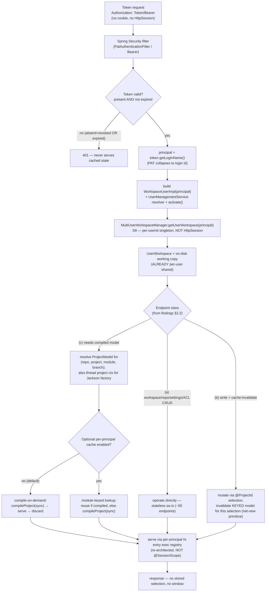

# REST API Access with Tokens (Principal-Keyed, Stateless)

## Status

- **Status:** Accepted — **decision of record** (near-term plan). The MVP the [Critical Assessment](principal-scoped-shared-state.md#critical-assessment) recommended.
- **Scope:** OpenL Studio — `org.openl.rules.webstudio` REST surface and the compiled `ProjectModel`
- **Decision (by the product owner):** Server-side working state is keyed on the **principal (login id)**, not on the token and not on an `HttpSession`. The token governs **authentication** only and contributes one **eviction signal** (expiry/revocation). "Two stateless services using one token" is ordinary same-user concurrency — the same case as two browser tabs of one user — and needs no new machinery.
- **Relationship to the companion docs:**
  - [auth-precedence-header-over-cookie.md](auth-precedence-header-over-cookie.md) — the auth-precedence rule (header over cookie) this design depends on. Reused, not restated.
  - [principal-scoped-shared-state.md](principal-scoped-shared-state.md) — the full two-scope grand design and its **Critical Assessment**. This document is the assessment's recommended cheap MVP: it deliberately does **not** build the `UserScopeRegistry`, the eviction reference-counting subsystem, or cross-channel job sharing.
  - [decoupling-projectmodel-from-webstudio.md](decoupling-projectmodel-from-webstudio.md) — Steps 0–3 are the **prerequisite** here (a model that can be served without a window).

---

## 1. Problem and the Key Insight

### The real problem

Clients call OpenL Studio's REST API with **tokens only** — `Authorization: Token …` (PAT) or `Authorization: Bearer …` — with **no cookie and no `HttpSession`**. Two stateless services may present the **same token concurrently**. Today the server's per-user working state hangs off a session-scoped `WebStudio` bean, so a cookie-less token caller either gets a throwaway session per request or no usable working state at all.

### The key insight: the working copy is already per-user

The source of truth a token client needs — the user's checked-out projects and their uncommitted edits — is **already shared per user**, keyed by `userId`, independent of any `HttpSession`:

`UserWorkspace` and the on-disk working copy are cached by `userId` in the singleton `MultiUserWorkspaceManager` /
`LocalWorkspaceManagerImpl`; the session-scoped `userWorkspace` bean merely **delegates** to that singleton, and
`RulesProject` open/close/save/branch/version state is one instance per `(repo, name)`. (Full file:line inventory:
[principal-scoped-shared-state.md](principal-scoped-shared-state.md) §Current State.)

So a token client authenticated as user *alice* **already shares** alice's workspace and on-disk edits the moment we resolve her `UserWorkspace` by principal instead of via the session. The **only** thing pinned to a session today is the **in-memory compiled `ProjectModel`** owned by the session-scoped `WebStudio` (`ServiceApiConfig.java:103`; `WebStudio` builds the single model in its constructor, and `getModel()` returns that one instance).

> [!Note]
> Therefore **no "session by token" is needed.** The compiled model is a *derived cache* that any channel can rebuild on demand from the already-shared working copy. We resolve the workspace by principal and either rebuild the model per request or hold a small per-principal cache. Nothing else about the user's state needs a new home.

This is exactly the critical assessment's finding: *"The `UserWorkspace` and on-disk working copy — the actual source of truth — are already per-user shared. The only thing not shared is the in-memory compiled model and its async jobs … a derived cache that any channel can rebuild on demand"* ([principal-scoped-shared-state.md](principal-scoped-shared-state.md) §Critical Assessment).

### What "two services, one token" actually is

Two stateless services presenting one PAT both authenticate as the same login id. They are two concurrent callers of the **same principal** — indistinguishable from two browser tabs of *alice*, a case the system already serves today (each tab gets its own session, but they all read the same per-`userId` `UserWorkspace` and the same on-disk working copy). The token is not an identity of its own; the PAT collapses to `token.getLoginName()` (`PatAuthenticationToken extends UsernamePasswordAuthenticationToken`; `PatAuthServiceImpl.resolveAuthentication` loads `UserDetails` by `token.getLoginName()`), so all of a user's PATs and her browser session resolve to one principal. Concurrency is handled with the same primitives that already exist for same-user access (below), not with a token registry.

---

## 2. The Minimal Design

### 2.1 Token auth → principal → workspace by principal

Authentication is unchanged and reused from the companion auth-precedence doc: `PatAuthenticationFilter` (PAT) and the Bearer/JWT path resolve the principal on every request. The PAT path already does a per-request DB round-trip and expiry check (`PatValidationServiceImpl.java:87` `getByPublicId`, `:113`/`:130-132` `isExpired`), returning the principal as `token.getLoginName()`.

The single change is **how the `UserWorkspace` is resolved** — by principal, not via the `HttpSession`:

| | Current path | Target path |
| --- | --- | --- |
| Workspace resolution | `WebStudioUtils.getUserWorkspace(HttpSession)` → `getRulesUserSession(session)` → session-bound delegate (`WebStudioUtils.java:84+`) | `MultiUserWorkspaceManager.getUserWorkspace(workspaceUser(principal))` (`:59`) — the same singleton the session path delegates to, reached directly from the request principal |
| Compiled model | `WebStudioUtils.getProjectModel()` → `getWebStudio().getModel()` (`WebStudioUtils.java:81`) — the one per-session model | per-principal, module-keyed lookup/compile from the shared working copy (§2.3) |

No signature change to `getUserWorkspace` is required; its 3 call sites are unaffected. The token request simply does not go through `getRulesUserSession`/`HttpSession` — it builds a `WorkspaceUser` from the security-context principal and calls the manager directly.

> [!Note]
> The principal path must **reproduce what the session delegate does**, not just call the manager. `RulesUserSession.getUserWorkspace()` builds a `WorkspaceUserImpl` with a `username → UserInfo` resolver backed by `UserManagementService`, then calls `userWorkspace.activate()` (and is `synchronized`). The token path must construct the same `WorkspaceUserImpl` (wiring the `UserManagementService` resolver) and call `activate()`; skipping either leaves the workspace half-initialized. This is real work hiding behind "no signature change."

> [!Note]
> Concurrent first-touch in the two singleton managers (`MultiUserWorkspaceManager.getUserWorkspace` and `LocalWorkspaceManagerImpl.getWorkspace`) is an **unsynchronized check-then-put over a plain `HashMap`** today. Two concurrent token callers for one new principal can double-create a workspace (leaking a `DesignTimeRepository` listener) or corrupt the map. Fixing both with `computeIfAbsent` over a `ConcurrentHashMap` is a **prerequisite concurrency hardening** (independently shippable; see §6). The put fix is **not** the whole job: `createUserWorkspace` registers a `DesignTimeRepository` listener (`MultiUserWorkspaceManager.java:39`) before the map insert, and the symmetric `workspaceReleased` (`:80-84`) / `refreshWorkspaces` (`:86-88`) and `LocalWorkspaceManagerImpl.workspaceReleased` (`:108-112`) **iterate and mutate the same maps**. All of these must move to `ConcurrentHashMap` together — a concurrent release during a first-touch can otherwise still corrupt iteration. The iterate/release paths are **co-equal** to the put, not a sub-task.

### 2.2 REST is stateless: selection passed per request

The principle: a token request carries **its full selection** (repo / project / module / branch) in the request itself. There is no stored "current selection" and no server-side window. The investigation shows the surface is already mostly there.

The STUDIO REST surface is ~36 `@RestController`s / ~139 endpoints; only **14 controllers** touch `WebStudio`/session. The work splits four ways:

**(a) Already stateless — no `WebStudio`/session touch at all (~50 endpoints).** Repositories, deployment, settings, ACL, PAT, mail, management, sysinfo, public diff. Token-ready as-is; a grep for `getWebStudio`/`getModel`/`getRulesUserSession`/`openProject`/`HttpSession` returns zero hits across them.
- `DesignTimeRepositoryController.java`, `RepoFilesController.java`, `RepoFileOperationsController.java`, `DeployRepositoryController.java`, `DeploymentsController.java`
- `SettingsController.java`, `RepositorySettingsController.java`, `AuthenticationSettingsController.java`
- `AclRepositoriesController.java`, `AclProjectsController.java`, `AclRolesController.java`, `AclController.java`
- `PersonalAccessTokenController.java`, `MailController.java`, `ManagementController.java`, `SysInfoController.java`, `DiffController.java:33`
- `TagConfigController.java:70,252` is borderline (it `@Lookup`-injects `getUserWorkspace()` only to **list** projects for tag usage — workspace-scoped, never touches a compiled model; threadable via the same per-request principal resolution).

**(b) Selection already threaded per request; only coupling is `getWebStudio().reset()` as cache invalidation.** The BETA `/projects` family resolves the project per-request: `@ProjectId @PathVariable RulesProject project` is converted by `ProjectIdentityConverter` (a `Converter<String, RulesProject>`, class `:34`, `convert()` body `:48-57`, which `@Lookup`-injects the per-request `UserWorkspace` and does an ACL READ check at `:53`); files use `/{*path}`; module/branch arrive as `@RequestParam`. The **signature is already stateless.** The residual coupling is cache invalidation — write endpoints call `getWebStudio().reset()` in `finally` blocks. The reset-site count in the projects REST package is **16**:
- `ProjectsController.java` (8): `:190` (updateProjectStatus), `:222` (createBranch), `:244` (deleteBranch), `:300` (createNewTable), `:356` (updateTable), `:371` (appendTable), `:386` (editTableSource), `:399` (deleteTable)
- `ProjectManagementController.java` (4): `:117`, `:140`, `:177`, `:204` — open/close/erase project lifecycle, `@Lookup` `getUserWorkspace()`/`getWebStudio()`. A (b)-class controller.
- `ProjectsMergeController.java` (2): `:174`, `:253` (resolveConflicts) — but see (c/legacy) below: merge also drives `init`/`freeze`, so it is heavier than pure invalidation.
- `ProjectFilesController.java:69` (postWrite), `ProjectFileOperationsController.java:64` (postWrite) — via `@Lookup getWebStudio()`

For token clients, `reset()` must invalidate **the keyed model for that selection**, not "the session's model" (§2.3). There is **no per-selection invalidation primitive today** — `WebStudio.reset()` is all-or-nothing per session and fires a `WorkspaceResetEvent` that `CompilationJobRegistryImpl.onWorkspaceReset` (`:102-109`) and the three execution registries listen to, none of which are principal-aware. Building selective, principal-aware invalidation is net-new surface (§2.3, §5).

**(c) Genuinely need a compiled `ProjectModel` — obtained today from the shared per-session model.** These already accept `@ProjectId` + module/branch params (selection is threaded), but call `projectService.openProject(...).awaitCompiled()`, which under the hood drives `WorkspaceProjectService.openProject` → `webstudio.init(repo,branch,project,module)` (`WorkspaceProjectService.java:706`) → `webstudio.getModel()` (`:707`) — **mutating the single session model** to point at the requested selection, then compiling it. For concurrent token callers this must become a per-principal, module-keyed compiled-model lookup:
- Compile/read-compiled: `ProjectsController.java:328` (getTablesGraph), `:338` (getTableGraph), table read via `WorkspaceProjectService.getOpenLTable` (`:752`)
- Test: `ProjectsController.java:438` (runAllTests)
- Run: `ProjectsRunController.java:97` (startRun)
- Trace: `ProjectsTraceController.java:103` (startTrace), `:213` (getTraceTableHtml)

> [!Note]
> **Two distinct couplings hide in this group, not one.** Beyond the compiled-model read, `ProjectsController.java:530` (inside getTestsSummary, which starts at `:486`), `ProjectsRunController.java:201`, and `ProjectsTraceController.java:280` call `getWebStudio().getCurrentProjectJacksonObjectMapperFactoryBean()` — reaching into the **session-current project** to build a result-serialization Jackson factory. `@ProjectId` alone does not supply this; the project context must be threaded into the Jackson-factory lookup too. Compile-on-demand does **not** solve it automatically. Treat it as a separate sub-task in the (c) work item.

The per-request execution-result registries (`ExecutionTestsResultRegistry` / `ExecutionRunResultRegistry` / `ExecutionTraceResultRegistry`) are keyed by `projectId` **inside a single `AtomicReference<Entry>`** — but they are **`@SessionScope` single-slot holders, not `projectId → task` maps**, and registering any task **cancels the previous one** (`AbstractExecutionResultRegistry`: "holds at most one execution task at a time"). They **cannot be reused as-is** for token clients (see the blocking gap in §2.3 and §6).

**(c/legacy) True session-stateful endpoints — read the ambient current selection with NO selection param.** These take only a `tableId`/`messageId` (or nothing) and must have selection **threaded in** so a token client can say *which* project/module it means:
- `InitController.java:31` — the imperative setter of session selection (`getWebStudio().init(repo,branch,project,module)`); the stateful model token clients replace with per-request selection
- `WorkspaceCompileController.java:43,76,137` — reads `webStudio.getModel().getTableById(tableId)` against the session-current module
- `OpenLMessageController.java:32,49` — `model.getCompilationStatus()` of the session-current model
- `NotificationController.java:26` — `model.isSourceModified()` of the session-current module
- `TestDownloadController.java:73,116` — session `getModel()` + session-polled `TestSuite`
- `ProjectHistoryController.java:37` (and restore `:48-52`) — passes the whole session `WebStudio` to `ProjectHistoryService`, bound to the session-current project's local-history dir
- `UsersController.java:248` — writes UI prefs onto the session `WebStudio` **when present**, already falling back to `userSettingsManager` when null (the stateless path already exists here)
- `ProjectsMergeController` (merge `:128-`, resolveConflicts `:204-`) — **belongs here, not in (b)**: it calls `studio.freezeProject` (`:152,236`), `studio.init` (`:177`), `studio.reset` (`:174,253`), and reads `model.getWebStudioWorkspaceDependencyManager()` (`:139,226`), so it **re-pins the session's current project** rather than merely invalidating a cache. Scope it as ambient-selection rework.

### 2.3 Compiled `ProjectModel`: optional per-principal, module-keyed cache

The compiled artifact lives **on the `ProjectModel` instance**: `compileProject(sync, prepareWorkspaceDependencyManager)` (`ProjectModel.java:1356`) registers a `RegisteredCompilation` future in `AtomicReference currentCompilation` (`:135`), loads the dependency async, sets `compiledOpenClass` under `synchronized(ProjectModel.this)` in the async callback (`:1375-1377`); `sync=true` blocks on a `CountDownLatch` (`:1398-1404`). **The model *is* the per-module compiled cache once its cycle future completes**; rebuild = call `compileProject` again.

Two equivalent serving strategies, **caching optional and configurable**:

- **Compile-on-demand (default, simplest):** per request, resolve the `UserWorkspace` by principal, build/locate the `ProjectModel` for `(repoId, project, module[, branch])`, `compileProject(sync=true, …)`, serve, discard. Trivial lifecycle (request-scoped). Meets the literal goal with **none** of a long-lived registry. This is exactly the assessment's MVP: *"compile-on-demand from the already-shared working copy."*
- **Per-principal, module-keyed cache (optional optimization):** a per-principal holder keyed by `(repoId, project, module, branch)` retains the compiled `ProjectModel` so repeat requests skip recompilation. Mechanically this is the shape of the existing `CompilationJobRegistryImpl` (an `AtomicReference<Entry>` with `acquire`/`find`/`clear`, synchronized, `canReuse` identity checks, stale-future cancel) — but **keyed by principal, not by session**, and holding **N module entries** rather than one slot, so two callers viewing two modules don't thrash. Enabled by a config flag; when off, behavior is compile-on-demand.

The keyed cache is an **optimization to avoid recompilation cost**, not a correctness requirement. The acceptance criteria (§6) must pass with the cache **off**.

> [!Note]
> **Blocking gap — execution registries must be re-architected, not reused.** `ExecutionTestsResultRegistry` / `ExecutionRunResultRegistry` / `ExecutionTraceResultRegistry` are `@SessionScope(proxyMode=TARGET_CLASS)` single-slot beans. A cookie-less token request has no `HttpSession`, so the session-scoped proxy either lazily creates a throwaway session (breaking acceptance criterion #5) or fails to bind. Even re-keyed by principal they hold **one** task, so two concurrent same-principal test/run/trace calls (acceptance criterion #2) cancel each other. They need the **same per-principal, N-entry rework** the cache gets — this is in scope for §6, not free reuse.

### 2.4 Concurrency: same-user concurrency, no new registry

"Two services, one token" = two concurrent callers of one principal. The existing primitives cover most of it; we add exactly one in-JVM lock:

1. **Reads are snapshot/refresh.** A compile/read produces a `CompiledOpenClass` on a `ProjectModel`; `ProjectModel`'s own instance monitor (every compile/read method is `synchronized`; `compileProject` double-locks) serializes a single model's compile. Concurrent reads of an already-compiled model are safe; a reader either gets the current snapshot or triggers a refresh (recompile) under the model monitor.
2. **Edits take a per-principal mutation lock.** Project state-changing operations (open/close/save/branch/version switch, table edits) for one principal are serialized by an in-JVM **per-principal `ReentrantLock`** — `ConcurrentHashMap<principalId, ReentrantLock>` via `computeIfAbsent`. This mirrors the `synchronized(userRulesProjects)` pattern already in `UserWorkspaceImpl` (every `getProject`/`getProjects`/`refresh` guards the shared maps). It is the explicit substitute for the per-session isolation two tabs got incidentally. There is **no per-user in-memory lock today** (`WebStudio`'s `synchronized` is per-session; `LockEngine` is cross-*user* file locking), so this lock is new — but it is one small lock, not a registry.
3. **Repository mutations keep the existing file-based `LockEngine`.** `LockEngine`/`LockManager` (file-backed, keyed by `repoId+branch+projectName`, also taking `userName`) remains the cross-process write/edit lock for repository mutations. It is orthogonal to the compile cache and unchanged.

> [!Note]
> **Full lock hierarchy must be specified, not just "mutationLock before model monitor."** The codebase already runs three monitors here: the `ProjectModel` instance monitor, the compilation-worker monitor inside `compileProject`, and `publishStatusChanged` deliberately hands status off to a `statusNotifier` executor to *avoid* a model-monitor/compilation-monitor deadlock (`ProjectModel.java:1413-1428`). Adding a per-principal `mutationLock` introduces a **third** cross-cutting lock onto an ordering the code already found subtle. The enforced order is: **mutationLock → ProjectModel monitor → (never re-enter compilation worker monitor while holding either)**; status publication must stay on the existing executor hand-off, never inline under a held lock. With compile-on-demand (default) there is no shared compiled model and no cross-channel cancel surface, so this hazard only arises with the optional cache on.

### 2.5 Eviction: token expiry/revocation + idle TTL (no reference counting)

If the optional per-principal cache is enabled, it is released by two signals — **no reference-counted session machinery**:

- **Idle TTL.** A per-principal cache entry not touched within a configurable TTL is dropped (cancel any in-flight compile, `model.destroy()` to release the compiled classloader, evict the entry). A single scheduled sweep over the `ConcurrentHashMap` suffices.
- **Token-as-eviction-signal.** The eviction signal is **free per request**: `PatValidationServiceImpl.validate` already does `getByPublicId` + `isExpired` (`expiresAt.isBefore(now)`, `:132`) on every PAT call, and revocation is a **hard row delete** (`PersonalAccessTokenDaoImpl.deleteByPublicId` / `deleteAllByLoginName`, `:63-86`) — no `revoked` flag, a token is present (live) or absent (revoked). For opaque Bearer tokens, the introspector re-introspects per request (reads `exp`). So an expired/revoked PAT or opaque token **fails authentication before any controller** — it never serves stale state. When a principal's tokens are all expired/revoked (and no browser session is active), the idle TTL reclaims the cache; the validation layer guarantees correctness in the meantime.

> [!Note]
> **JWT Bearer weakens the revocation guarantee.** `JwtTimestampValidator` (`OAuth2JwtAccessTokenConfiguration.java:43`) validates `exp` from the **token's own claims with no server round-trip**. A JWT revoked at the IdP but not yet expired still authenticates and could be served a cached model until `exp`. The "revocation = immediate eviction" guarantee holds for **PATs (hard delete)** and **opaque tokens (re-introspection)** but **not for JWTs**. For the JWT mode, idle TTL is the only backstop within the token's remaining lifetime.

This is deliberately weaker than the grand design's lifecycle: there is **no attach/detach reference holding, no `@Scheduled` last-reference predicate, no scheduler-thread security-context reconstruction**. With compile-on-demand (default) there is nothing to evict at all.

### 2.6 Prerequisite: ProjectModel decoupling Steps 0–3

A `ProjectModel` cannot be served to a token client today because it holds a `WebStudio` back-reference and makes thread-bound session reads (`WebStudioUtils.getUserWorkspace(WebStudioUtils.getSession())` at `ProjectModel.java:1046` and `:1590-1591`; `getWebStudio().getCurrentModule()` at `:1230`) that NPE on a channel with no `HttpSession`/`FacesContext`. **Steps 0–3 of [decoupling-projectmodel-from-webstudio.md](decoupling-projectmodel-from-webstudio.md) are the hard prerequisite**:

- **Step 0** — kill the spurious self-call and the static `getWebStudio()` lookup.
- **Step 1** — inject the already-global services directly (`RepositoryAclService`, `ProtectedBranchBypassService`, `ProjectResolver`, `ApplicationEventPublisher`).
- **Step 2** — introduce the narrow ports (`WorkspaceContext`, `ProjectCatalog`, `FrozenState`, `ProjectStatusNotifier`, `ViewPreferences`, `CompilationConfig`) + the `ModuleSelection` record, with WebStudio-backed adapters.
- **Step 3** — migrate call sites to the ports (deleting the two `getSession()` chains and the three status reads; thread `ModuleSelection` through the ~12 selection reads).

These are no-behavior-change DI hygiene, shippable before this design. Crucially, `ModuleSelection` carries the **acting request principal** (decoupling §3.2) — the substitute for `runAsSessionUser` reading a frozen `Authentication` — so a token request's ACL/status decisions use the **caller's** identity. This design does **not** require Step 4 (flip ownership to a `UserScopeRegistry`); a token request constructs the model from the port adapters bound to the per-principal `UserWorkspace` resolved via `MultiUserWorkspaceManager`.

---

## 3. What Is NOT Built (Anti-Scope)

This MVP explicitly does **not** build, per the critical assessment's recommendation to *"defer the `UserScopeRegistry`, job sharing, and eviction lifecycle until a concrete, validated workflow proves a user must retrieve a job result from a different channel than the one that started it"*:

- **No `HttpSession` for tokens.** Header auth stays stateless at the servlet-session level (no per-request session creation). Reused from the companion auth doc.
- **No token-keyed session / token-keyed state.** State keys on principal. The token is auth + an eviction signal only. There is no token-to-session mapping (rejected as racy/privilege-bleeding in the auth doc) and no token-to-state mapping.
- **No cross-channel job registry.** A job's progress is already broadcast user-keyed over STOMP (`convertAndSendToUser`), which is free. We do **not** build the shared `JobRegistry` that lets a *different* channel late-attach to an in-flight future and retrieve its result — *"a speculative feature whose progress-broadcast half is already free … whose only genuinely new capability has no cited user story."* The per-request execution registries are **re-architected to per-principal N-entry holders** (they cannot be reused as-is — §2.3), not replaced by a shared job registry.
- **No long-lived `UserScopeRegistry`.** No principal-keyed bean container holding compiled projects + jobs + opened-projects + active-session list. The compiled model is treated as a rebuildable cache, optional and bounded by TTL.
- **No eviction reference-counting subsystem.** No session-ref/access-key-ref attach/detach, no last-reference `@Scheduled` predicate, no scheduler-thread security-context reconstruction, no heap-ceiling/LRU lifecycle. *"A compile-on-demand model has trivial lifecycle."* Just an optional idle-TTL sweep, and token expiry handled by the existing validation layer.
- **No Step 4 of the decoupling spike** (flip model ownership into a registry). Steps 0–3 only.

This avoids the net-new High-severity liabilities the assessment attaches to the grand design: the unfireable-under-pressure eviction predicate, classloader leaks on scheduler-thread teardown, the noisy-neighbor job pool sharing, the widened token blast radius onto a warm omnipotent scope, and the cross-channel cancel/AB-BA-deadlock surface.

---

## 4. Diagrams

### 4.1 Request flow — token → principal → workspace → stateless op



### 4.2 Concurrency — two services, one token, one principal

```mermaid
sequenceDiagram
  participant S1 as Service 1 (token T, no session)
  participant S2 as Service 2 (token T, no session)
  participant SEC as Security filter
  participant MUWM as MultiUserWorkspaceManager (singleton)
  participant UW as UserWorkspace (per-userId — SHARED)
  participant LK as per-principal mutationLock
  participant PM as ProjectModel (compiled cache / on-demand)
  participant LE as LockEngine (file-based, repo write lock)

  Note over S1,S2: Token T → same principal "alice" (ordinary same-user concurrency)

  S1->>SEC: GET /projects/{id}/tables (Token T)
  SEC->>SEC: validate T (present, not expired) → principal=alice
  SEC->>MUWM: getUserWorkspace(alice)  %% computeIfAbsent — no double-create
  MUWM-->>S1: SAME UserWorkspace

  S2->>SEC: PUT /projects/{id}/tables/... (Token T) — edit
  SEC->>MUWM: getUserWorkspace(alice)  %% SAME instance
  MUWM-->>S2: SAME UserWorkspace

  par S1 reads (snapshot/refresh)
    S1->>PM: compileProject(sync) for module X under ProjectModel monitor
    PM-->>S1: compiled snapshot of module X
  and S2 edits (serialized)
    S2->>LK: lock("alice")  %% in-JVM per-principal mutation lock
    S2->>LE: tryLock(repo, branch, project, user)  %% cross-process file lock
    S2->>UW: save / edit table (mutate shared working copy)
    S2->>LE: unlock
    S2->>LK: unlock("alice")
    Note over S2: invalidate KEYED model for (repo,project,module) — next read recompiles
  end

  Note over S1,S2: No shared single-slot model to clobber; no cross-channel job cancel.<br/>Edits serialized by mutationLock + LockEngine; reads see a consistent snapshot or recompile.
```

---

## 5. Change Surface and Effort

Grounded in the investigation counts. Surface is narrower than the grand design because the working copy is already shared and the model is treated as a rebuildable cache — but it is **larger than a first pass suggests** once the re-architected execution registries, the extra reset sites, and the Jackson-factory coupling are counted.

- **Prerequisite concurrency hardening (2 managers).** `MultiUserWorkspaceManager.getUserWorkspace` (`:59`) and `LocalWorkspaceManagerImpl.getWorkspace` — replace unsynchronized check-then-put with `computeIfAbsent` over `ConcurrentHashMap`; **and** make the iterate/release paths (`workspaceReleased`, `refreshWorkspaces`) concurrent-safe in the same change. Independently shippable bug fix.
- **Workspace resolution by principal.** Add a request-principal → `WorkspaceUserImpl` (with `UserManagementService` resolver) → `activate()` → `MultiUserWorkspaceManager.getUserWorkspace` path for token requests, bypassing `getRulesUserSession`/`HttpSession`. No `getUserWorkspace` signature change (3 call sites untouched).
- **Decoupling Steps 0–3 (prerequisite).** ~29 `studio.*` dereferences across ~17 methods + 3 thread-bound session reads + 1 self-call + 3 hidden factory reads, behind 6 ports + `ModuleSelection`. (Steps 0–3 are ~7.5 WP in the spike's own estimate; counted there, not double-counted below.)
- **(c) controllers needing a compiled model — ~8 endpoints across 4 controllers** (`ProjectsController` graph/table/test, `ProjectsRunController`, `ProjectsTraceController`, `WorkspaceProjectService.openProject`): re-point from the shared session `getModel()` to the per-principal/per-request keyed model; **plus** thread project context into the 3 `getCurrentProjectJacksonObjectMapperFactoryBean()` sites; **plus** re-architect the 3 `@SessionScope` single-slot execution registries to per-principal N-entry holders.
- **(b) cache-invalidation decoupling — 16 `reset()` sites** across `ProjectsController` (8), `ProjectManagementController` (4), `ProjectsMergeController` (2 — but see below), `ProjectFilesController` (1), `ProjectFileOperationsController` (1): build a **net-new per-selection, principal-aware invalidation primitive** (today only session-global `reset()` + `WorkspaceResetEvent` exist) and target it.
- **(c/legacy) selection-threading — ~7 controllers** (`InitController`, `WorkspaceCompileController`, `OpenLMessageController`, `NotificationController`, `TestDownloadController`, `ProjectHistoryController`, `UsersController`) **plus `ProjectsMergeController`** (re-pins selection via `init`/`freeze`, heavier than reset): add explicit project/module (and test payload) params.
- **(a) ~50 endpoints + ~17 controllers** — zero change; token-ready as-is.
- **Optional per-principal module-keyed cache + idle-TTL sweep + per-principal mutationLock** — small, behind a config flag; reuses the `CompilationJobRegistryImpl` shape re-keyed by principal with N module entries.

### Effort estimate (WP ≈ 8h)

| Work item | WP | Notes |
| --- | --- | --- |
| Concurrency hardening: 2 managers (`computeIfAbsent` + concurrent iterate/release) | 1 | Independent bug fix; put + release/iterate paths co-equal; high test density |
| Resolve `UserWorkspace` by principal (build `WorkspaceUserImpl` + resolver + `activate()`; bypass `HttpSession`) | 1 | More than a no-signature-change call; reproduces session-delegate obligations |
| (c) Re-point ~8 compiled-model endpoints + 3 Jackson-factory couplings to per-principal/per-request keyed model | 2 | `ProjectsController`/Run/Trace + `WorkspaceProjectService.openProject` + session-current-project Jackson factory |
| (c) Re-architect 3 `@SessionScope` single-slot execution registries → per-principal N-entry | 1.5 | Blocking for acceptance criteria #1/#2; not free reuse |
| (b) Build per-selection principal-aware invalidation + re-target 16 `reset()` sites | 1.5 | Net-new primitive; `WorkspaceResetEvent` listeners are session-scoped today |
| (c/legacy) Thread selection into ~7 legacy controllers + `ProjectsMergeController` (init/freeze) | 2 | Add explicit project/module/test-payload params; merge re-pins selection |
| Optional per-principal module-keyed cache + per-principal mutationLock + idle-TTL sweep | 1.5 | Behind a config flag; reuses `CompilationJobRegistryImpl` shape; specify full lock order |
| Token-as-eviction-signal wiring (reuse existing `validate` result) | 0.5 | No new lookup; piggyback on per-request PAT/JWT/opaque validation |
| Tests — token-only list/open/edit/save/compile/run; two-caller-one-token concurrency (incl. concurrent test/run/trace); cache off and on; ≥80% diff coverage | 2.5 | Acceptance criteria below |
| **Total** | **~13.5 WP (~108h)** | Plus decoupling Steps 0–3 (~7.5 WP) as a shared prerequisite → **~21 WP realistic delivery** |

This is still smaller than the grand design (`UserScopeRegistry` + job sharing + eviction lifecycle + Step 4) cited at ~25.5 WP in [principal-scoped-shared-state.md](principal-scoped-shared-state.md), and it avoids that design's net-new High-severity liabilities. The execution-registry rework, the extra reset surface, and the Jackson-factory coupling are real and are reflected in the estimate above.

---

## 6. Risks and Acceptance Criteria

### Risks

| Risk | Severity | Likelihood | Mitigation |
| --- | --- | --- | --- |
| **Session-scoped execution registries cannot serve token clients** — `ExecutionTests/Run/TraceResultRegistry` are `@SessionScope` single-slot; no session = throwaway-session creation (breaks AC #5) or bind failure, and single-slot cancels concurrent same-principal jobs (breaks AC #2) | High | High | Re-architect all three to per-principal N-entry holders (scoped in §5); do not reuse as-is |
| **Concurrent mutation of the shared on-disk working copy** by two callers of one principal (two services one token, or token + browser tab) — no per-user in-memory lock today | High | Medium | Per-principal in-JVM `mutationLock` (`computeIfAbsent` over `ConcurrentHashMap`) on every state-changing op; existing file-based `LockEngine` for repository writes; reads snapshot/recompile under the `ProjectModel` monitor |
| **Double-create / leaked workspace + corrupted iteration** on concurrent first-touch or concurrent release of a principal (unsynchronized check-then-put **and** unsynchronized `workspaceReleased`/`refreshWorkspaces`) | High | Medium | Move put **and** iterate/release paths in both managers to `ConcurrentHashMap` + `computeIfAbsent` together — the put fix alone is insufficient |
| **No per-selection invalidation primitive** — `WebStudio.reset()` is session-global and its `WorkspaceResetEvent` listeners are not principal-aware; 16 reset sites need re-targeting | Medium | High | Build a net-new per-selection, principal-aware invalidation; make the keyed-model and registry listeners principal-aware |
| **Lock-order regression** — adding `mutationLock` over the existing `ProjectModel` monitor + compilation-worker monitor + status-executor hand-off (already a documented deadlock-avoidance dance at `ProjectModel.java:1413-1428`) | Medium | Medium | Specify and enforce the full hierarchy: `mutationLock → ProjectModel monitor`; keep status publication on the existing executor hand-off, never inline under a held lock; compile-on-demand avoids the shared-model case entirely |
| **Session-current-project Jackson factory coupling** at `ProjectsController:530`, `ProjectsRunController:201`, `ProjectsTraceController:280` — result serialization depends on session-current project, not just `@ProjectId` | Medium | High | Thread project context into the Jackson-factory lookup; do not assume compile-on-demand resolves it |
| **`WorkspaceUserImpl` half-init** — principal path skipping the `UserManagementService` resolver or `activate()` | Medium | Medium | Reproduce the full session-delegate construction (resolver + `activate()`) in the token path; cover with a token-only workspace-resolution test |
| **Compile cost** — compile-on-demand recompiles per request; large projects slow | Medium | Medium | Enable the optional per-principal module-keyed cache (config flag); idle-TTL bounds memory; `compileProject` caches the result on the model |
| **JWT revocation lag** — `JwtTimestampValidator` checks `exp` with no server round-trip, so an IdP-revoked-but-unexpired JWT still authenticates and may be served a cached model until `exp` (guarantee holds for PAT hard-delete + opaque re-introspection only) | Medium | Low | Document the JWT limitation; idle-TTL is the only backstop within the token's remaining lifetime; for strict revocation use PAT or opaque Bearer |
| **`mutationLock` map unbounded growth** — `ConcurrentHashMap<principalId, ReentrantLock>` never pruned; locks for departed principals accumulate | Low | Medium | Prune idle lock entries in the same TTL sweep that evicts the model cache (extend sweep to cover the lock map) |
| **Token-as-eviction-signal correctness** — a cached model outliving the token | Medium | Low | Validation rejects absent (revoked = hard delete) / expired tokens before any controller (`PatValidationServiceImpl.java:113,130-132`; opaque re-introspection), so stale state is never served for PAT/opaque; idle-TTL reclaims the cache when tokens lapse and no session is active |
| **Legacy ambient-selection endpoints** can't be called by a token client until selection is threaded (incl. `ProjectsMergeController` init/freeze) | Medium | High | Thread explicit project/module/test params into the ~7 (c/legacy) controllers + merge; until then those endpoints stay browser-only |
| **CSRF — n/a for header-only callers.** A cross-site page cannot set a custom `Authorization` header, so the token surface is CSRF-resilient (RFC 6750) | Low | — | Header-only Bearer resolver (guard against query/URI token resolution); cookie-surface CSRF hardening is the companion auth doc's scope |
| **Heap from the optional cache** under many principals | Low | Low | Cache off by default (compile-on-demand); when on, idle-TTL + (optional) max-principals cap |

### Acceptance criteria

1. **Token-only client, no cookie, full lifecycle.** A client presenting only `Authorization: Token …` (or `Bearer …`), with **no `JSESSIONID` cookie and no `HttpSession`**, can: **list** projects, **open** a project, **edit** a table, **save**, **compile** a module (read the compiled tables/graph), **run** a method/table, and start/read a **test** — all by passing its selection per request, with no stored selection and no server-side window. (Requires the re-architected, non-`@SessionScope` execution registries.)
2. **Two concurrent callers, one token, no corruption.** Two stateless callers presenting the same token concurrently (one principal) do not corrupt server state: their shared `UserWorkspace` is created exactly once (no double-create, no corrupted iteration under concurrent release), concurrent edits are serialized (per-principal `mutationLock` + `LockEngine`), **two concurrent test/run/trace calls both complete** (per-principal N-entry registries, not single-slot), and a reader sees either a consistent compiled snapshot or a clean recompile — never a half-mutated model.
3. **Cache-optional parity.** All of the above pass with the per-principal compiled-model cache **disabled** (compile-on-demand) and **enabled** (module-keyed). Enabling the cache changes only performance, not results.
4. **Eviction correctness.** After a **PAT or opaque token** is revoked (row deleted) or expires, a request with that token receives `401` and is **never** served any cached model; an idle principal's cache entry **and** its `mutationLock` entry are released within the configured TTL (verified by no recompile-blocking growth and by `model.destroy()` releasing the compiled classloader). For **JWT** Bearer, eviction on IdP revocation is bounded by token `exp`, not immediate — documented, not asserted.
5. **No new session for token auth.** A cookie-less token request creates **no** `HttpSession` (verified across auth modes — reused from the companion auth doc; specifically the re-architected execution registries must not lazily create one).
6. **Decoupling prerequisite met.** `ProjectModel` is driven entirely through its ports with **no** thread-bound servlet context — a model compiles/serves for a principal with `RequestContextHolder` cleared and no `FacesContext` (decoupling acceptance test #4), and the published status carries the **acting** principal (not a frozen `Authentication`).
7. **Coverage.** New/changed Java keeps ≥80% line coverage on the diff (`mvn verify -Dsonar`; report `jacoco-report/target/site/jacoco-aggregate/jacoco.xml`).
