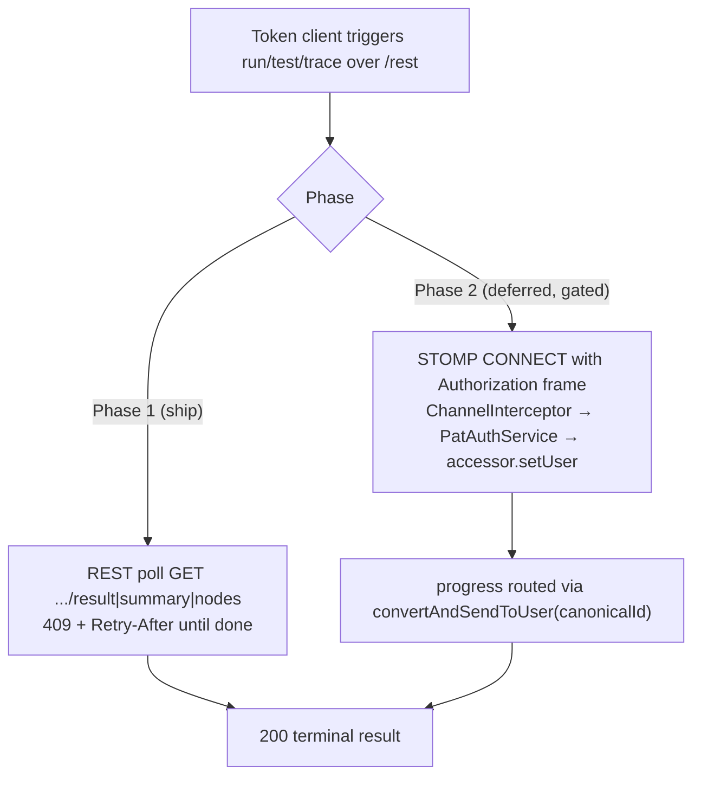
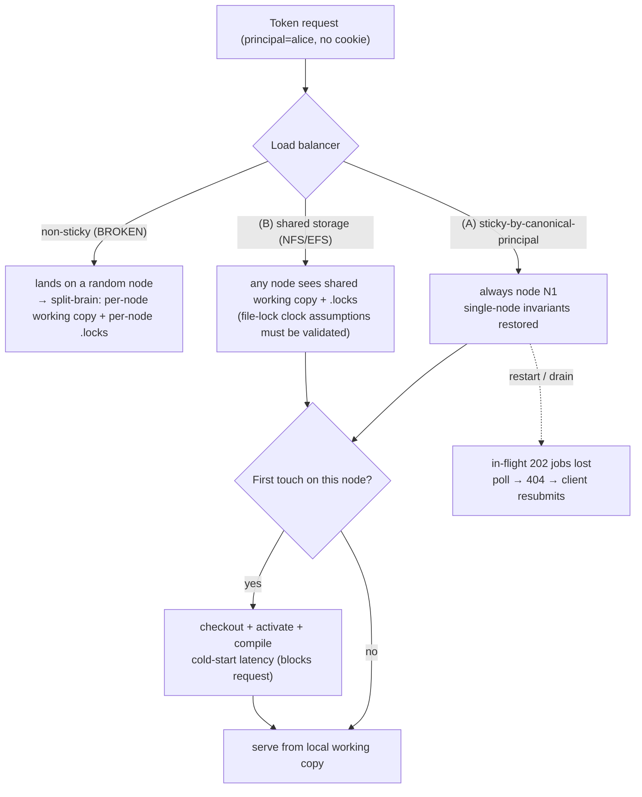

# REST/Token Access — API Contract, Authorization & Operations

## Status

- **Status:** Design proposal — companion to the accepted MVP. The MVP
  [rest-api-token-access.md](rest-api-token-access.md) decided *how* token requests resolve per-principal working state
  (stateless, principal-keyed, no `HttpSession`). This document decides the **externally-facing contract** a token
  client codes against and the **operational envelope** the server must run in. It does **not** restate the MVP's
  internal mechanics (workspace-by-principal resolution, compile-on-demand, the per-principal `mutationLock`,
  eviction-by-token-validation) — it references them.
- **Scope:** OpenL Studio — the `org.openl.rules.webstudio` REST surface tagged **BETA** (base `/projects`), its error
  model, authorization under a PAT/Bearer identity, the realtime channel, and the single-node-to-HA operational gaps.
- **Relationship to the companion docs:**
  - [rest-api-token-access.md](rest-api-token-access.md) — the MVP and **decision of record**. Selection-per-request,
    compile-on-demand, the re-architected per-principal N-entry execution registries, eviction via per-request token
    validation. This document is the contract and operations layer *on top of* that MVP.
  - [auth-precedence-header-over-cookie.md](auth-precedence-header-over-cookie.md) — header-over-cookie identity rule.
    Reused; the realtime decision (§8) is the first place that rule meets a transport (WebSocket) the header cannot ride.
  - [principal-scoped-shared-state.md](principal-scoped-shared-state.md) — the deferred grand design and its
    [Critical Assessment](principal-scoped-shared-state.md#critical-assessment). Several items here (canonical principal
    id, fair job admission, metrics, clustering) are the assessment's named-but-unbuilt operational gaps, made concrete.
  - [decoupling-projectmodel-from-webstudio.md](decoupling-projectmodel-from-webstudio.md) — Steps 0–3 and the
    `ModuleSelection` record that carries the **acting** principal. §5 (ACL off the request thread) depends on it.

> [!Note]
> This document is **contract + operations**, not internals. Where it must touch a mechanism (e.g. the execution
> registry rework), it states the **observable** consequence and points at the MVP for the how. Everything below is the
> surface a third-party integration sees, plus what an operator must provision to run it safely.

---

# Part A — API Contract & Error Model

## A1. Selection: `{projectId}`, module, and the branch decision

A token request carries its full selection per request (MVP §2.2). Selection is a three-part coordinate; two parts are
already clean, the third (branch) is the single biggest unresolved contract decision.

### A1.1 `{projectId}` — opaque id is the contract key; the path-segment hazard

`{projectId}` is `Base64(repositoryId + ":" + projectName)`, the `@JsonValue`/`@JsonCreator` representation
(`ProjectIdModel.java:24` encode, `:28-44` decode), resolved by an ordered strategy chain
(`ProjectIdentityConverter.java:59-68`, `convert()` at `:48`): Base64-id first (`Base64ProjectResolveStrategy.java:22-23`,
`@Order(1)`), then bare project name (`ProjectNameResolveStrategy.java:22-23`, `@Order(2)`).

There is a **path-segment hazard** the contract must close: `encode()` emits the **standard** Base64 alphabet
(`Base64.getEncoder()`, `ProjectIdModel.java:24`), which may contain `+` and `/`. `decode()` is *forgiving on input* — it
runs `encoded.replace('-','+').replace('_','/')` (a no-op for standard ids, which never contain `-`/`_`) and then uses
the **standard** `Base64.getDecoder()`, explicitly documented as backward compatible for standard ids
(`ProjectIdModel.java:29-33`). So a standard id round-trips through `decode()` fine. **The real hazard is the
transport, not decode:** a servlet container rejects an encoded `/` in a path segment, so a standard id containing `/`
that a client reflects from a response body (`dependsOn`, dependency ids) straight into a `{projectId}` path segment
can fail at the container before it ever reaches `decode()`.

**Decision.**
- The **opaque id is the stable contract key.** Document it as the selector; the human project name is a best-effort
  convenience only.
- **Make `encode()` emit URL-safe Base64** (`Base64.getUrlEncoder().withoutPadding()`), so the id a client receives in a
  response body is path-segment-safe **without transcoding** — no `/` to be rejected by the container. `decode()` already
  accepts URL-safe input, so this is a one-line producer change that round-trips and removes a whole class of client
  bugs. Until shipped, the contract MUST state: *clients URL-encode (or transcode standard→URL-safe) a reflected id
  before using it in a path segment.*

### A1.2 Name resolution and the ambiguity 409

Bare-name resolution is implicit, cross-repository, and can collide: a name matching >1 project across repos throws
`ConflictException("project.identifier.ambiguous.message", identity, candidates)` → **409**
(`ProjectIdentityConverter.java:76`, in `selectSingleMatch`). No match → **404** (`"project.identifier.message"`).
Missing READ ACL in the converter → a bare `SecurityException` → **403** (`ProjectIdentityConverter.java:53-54`).

**Caveat on the 409 body — candidates are not a structured field.** The error body is a `BaseError` with exactly two
fields, `code` and `message` (`BaseError.java:16,19`); there is **no `candidateIds` field**. The candidate ids are passed
as message-format varargs to `ConflictException(code, identity, candidates)` and are interpolated only into the
human-readable localized **message string** (`ProjectIdentityConverter.java:72-76`) — they are **not** machine-readable.
A token client cannot parse candidate ids as data; it would have to scrape the message text.

**Decision.** Keep name resolution as a convenience but **document that a token client hardcoding a name may start
returning 409 the day a same-named project appears in another repo**, and that the candidates appear **only in the 409
message string**, not as a parseable field. The opaque id never collides; recommend integrations resolve a name once and
cache the id. *(Open option: add a structured `candidates[]` field to the 409 body if a client needs to disambiguate
programmatically — see Open Decisions.)*

### A1.3 Module: unify the param name (unknown-module already 404s)

Two param names exist for the same concept: run/trace/tests use **`?fromModule`** (`ProjectsController.java:426`,
`ProjectsRunController.java:92`, `ProjectsTraceController.java:95`); the project-graph endpoint uses **`?module`**
(`ProjectsController.java:325`). Blank == whole project (`trimToNull`, `ProjectsController.java:327`).

**An unknown module name already `404`s** — there is no silent-fallback bug to fix. `openProject(...)` filters the
module stream by name when `moduleName != null` (`WorkspaceProjectService.java:663-664`,
`filter(m -> m.getName().equals(moduleName))`), so an unknown name empties the stream and
`findFirst().orElse(null)` (`:666`) yields `null`; the `module == null` branch then throws
`NotFoundException("project.identifier.message")` → **404** (`:701-704`). The first-module pick only happens when
`moduleName == null` (the whole-project case), where the filter is skipped and `findFirst()` legitimately selects the
first module. So unknown-module-is-deterministic-404 is **current behavior**, not a proposed change.

**Decision.**
- **Adopt `?module` as the canonical param name across all sibling endpoints**; keep `?fromModule` as a deprecated alias
  for one BETA cycle (accept both, document `?module`). This is the only behavioral change in A1.3.
- **Document the unknown-module contract as-is:** an unknown module name → **404** (`project.identifier.message`);
  blank/absent → whole-project. No fallback to fix; just specify the existing behavior so clients can rely on it.

### A1.4 Branch — the single biggest contract decision

Branch is **not** a per-request coordinate today. It is **stateful per user** on the shared `RulesProject`:

- `GET /{projectId}/status?branch=` is **assert-only** (`ProjectsController.java:199-214`; comment `:202-204`): non-blank
  branch is checked against `project.getBranch()` — unsupported repo → **409** (`project.branch.unsupported.message`,
  `:207`), mismatch → **409** (`project.branch.mismatch.message`, `:209-210`). It **never switches**.
- Switching happens only via `PATCH /{projectId}` with `ProjectStatusUpdateModel.branch` (`ProjectsController.java:175`,
  `ProjectStatusUpdateModel.java:26-27`) → `switchToBranch()` (`WorkspaceProjectService.java:398`): it
  `project.releaseMyLock()` (`:416`), `project.setBranch(branchName)` (`:420`), validates `getLastHistoryVersion() !=
  null` (else reverts `setBranch(previousBranch)` + **409**, `:421-423`), and the controller then fires
  `getWebStudio().reset()` (`ProjectsController.java:190`). **`setBranch` mutates the shared per-user `RulesProject`**
  held in the workspace — every subsequent run/trace/tests/table-read for that principal operates on whatever branch was
  last `PATCH`ed.

This collides head-on with the MVP's "two services, one token = ordinary same-user concurrency" model: two token clients
sharing a principal **share one mutable branch pointer**. Client A's `PATCH ?branch=feature-X` silently re-points the
project under client B mid-flight. A token client cannot today say *"run table X on branch Y"* atomically.

> [!Note]
> **This is the contract decision that determines whether the token API is composable.** Branch-as-shared-state means
> every multi-client integration must serialize its own PATCH-then-act sequences out-of-band, and there is no isolation
> primitive offered. Branch-as-coordinate makes each request self-describing — at a real cache/working-copy keying cost.

**Decision — phased.**

**Phase 1 (ship with the MVP): branch is documented sticky per-principal state.** `PATCH` switches; reads/runs operate on
the current branch; `?branch=` on reads stays assert-only and a **mismatch is a first-class 409, not a race the client
must guess at**. The contract explicitly warns: concurrent callers of one principal share the branch pointer; a client
that needs a specific branch MUST `PATCH` then immediately act **and tolerate** that another caller may re-switch. This is
honest about today's behavior and ships at zero working-copy cost.

**Phase 2 (deferred, gated on demand): optional `?branch=` request coordinate on run/trace/tests/table-read that
asserts-or-resolves transactionally.** This requires the compiled-model cache key and the on-disk working copy to be keyed
by **branch** in addition to `(repoId, project, module)` — i.e. the MVP's module-keyed cache (`rest-api-token-access.md`
§2.3) gains a branch dimension, and `LocalWorkspace` must materialize per-branch working trees per principal. **Cost:** N
branches × the per-principal working-copy and compiled-model footprint; the `LockEngine` key already includes branch
(`RulesProject.tryLock` keys on `repoId+branch+realPath+userName`, `:285`), so locking is ready, but the working copy is
**not** branch-keyed on disk today (`<workspace.home>/<userId>/` is single-tree). **Do not build Phase 2 until a concrete
integration needs per-request branch isolation** — it multiplies the operational footprint (§9) by the branch fan-out.

```
Selection coordinate         Phase 1 (ship)                        Phase 2 (deferred)
-------------------------------------------------------------------------------------------
{projectId}  (opaque id)     per-request path segment              unchanged
?module                      per-request query param               unchanged
branch                       STICKY per-principal (PATCH switches) per-request ?branch= coordinate
                             ?branch= on reads = assert-only 409    (branch-keyed cache + working copy)
```

## A2. The async job contract: 202 + poll, registry key, retention, 409/404/500

Run/test/trace are async: `POST .../tests/run`, `POST .../run`, `POST .../trace` all return **`202 ACCEPTED`** with
**void body, no task id, no `Location`** (`ProjectsController.java:429-431`, `ProjectsRunController.java:86-89`,
`ProjectsTraceController.java:88-91`). The MVP replaces the `@SessionScope` single-slot registry with a **per-principal,
N-entry result registry** (`rest-api-token-access.md` §2.3, the blocking gap). This section defines what that registry
exposes to a token client.

### A2.1 The result-registry key tuple — fix the lookup key, not just the scope

The token contract keys a result by **`(principal, projectId, module, tableId)`**. This is **two** independent fixes, not
one:

1. **Per-principal scope (the MVP's framing).** Today the registry is `@SessionScope`
   (`ExecutionRunResultRegistry.java:23`) and a single `AtomicReference<Entry>` (`AbstractExecutionResultRegistry.java:33`)
   — it cannot serve cookie-less clients.
2. **The lookup key must gain `module` + `tableId` (a fix needed even single-principal).** Today the lookup ignores both:
   `hasTask`/`isDone`/`getResultIfDone` compare `e.projectId().equals(projectId)` **only**
   (`AbstractExecutionResultRegistry.java:96,107,119`); `tableId` is stored on `Entry` but never used for lookup, and
   `registerTask` does `getAndSet` + cancel of the previous task (`:48-51`). **Consequence today:** two concurrent jobs on
   the **same project but different tables** already overwrite/cancel each other *within one session*. Generalizing scope
   to per-principal does not fix this; the **lookup key itself** must become `(projectId, module, tableId)` (under the
   per-principal registry) so a client's two table jobs do not evict each other.

`principal` is the **canonical** id from §13. `tableId` is null for whole-project test runs and present for single-table
run/trace. This is the smallest key that lets a token client poll the result of the job it started without a session and
without two of its own concurrent jobs cancelling each other.

> [!Note]
> The MVP mandates the **scope** rework as a blocking gap (its §2.3, AC #1/#2). The `module`+`tableId` **lookup-key**
> dimension is a *second* fix this contract surfaces: it is required for correct N-entry behavior and is independently
> a latent same-session bug today. This section defines the **key tuple and the poll semantics** both reworks must expose.

### A2.2 Poll semantics and status table — 404 vs 409 vs 500

Today: `GET .../tests/summary`, `GET .../run/result`, `GET .../trace/nodes` return **404** if no task
(`NotFoundException`, `"...execution.task.message"`, e.g. `ProjectsRunController.java` no-task branch), **409** if a task
exists but is not done (`ConflictException`, `"...not.completed.message"`), **200** with the body otherwise.

**The terminal-failure status today is 500, not 404 — correct this.** `getResultIfDone` returns `null` only when the
future is **not-done or CANCELLED** (`AbstractExecutionResultRegistry.java:124`); a cancelled job is therefore re-mapped
to **404**. But a **terminally-FAILED** job (future completed exceptionally) passes that guard, reaches `future.get()`
(`:129`), throws `ExecutionException`, and is re-thrown via `RuntimeExceptionWrapper.wrap(ex)` (`:133-134`) — an
**unannotated** runtime exception → `handleInternalErrors` → **500** (`ApiExceptionControllerAdvice.java:113-124`). So
today a failed run/test/trace job **polls to 500**, and **404 masks three states: never-started, evicted-by-reset, and
cancelled** — *not* terminal failure. (The registry javadoc claiming "returns null if failed/cancelled",
`AbstractExecutionResultRegistry.java:111-113`, does not match the code.)

**Decisions.**
- **Disambiguate terminal failure from both 404 and 500.** A job that ran and **failed** MUST poll to a terminal status
  carrying the failure. Recommended: keep **404** for *no such job / evicted / cancelled*, and return **200 with a
  terminal `{status: "FAILED", error: {...}}`** for a job that ran and threw (or **422** if the failure is
  rule/compile-shaped — see A3.3). The current outcome (an opaque **500** on a failed job) is the bug; a poller must tell
  "I never started it" (404) from "it broke" (terminal failure, 200/422) from "the server broke" (500).
- **This fix lives at the POLL path, not the submit path.** The async job's failure surfaces *later*, at the poll
  endpoints — `getResult` (`ProjectsRunController.java:160` region), `getTestsSummary` (`ProjectsController.java:505`
  region), and trace's `getCompletedTraceHelper` (`ProjectsTraceController.java`) — when `future.get()` throws. The
  compile-422 fix (A3.3) intercepts only the **synchronous** `awaitCompiled()` `CompletionException` at *trigger* time
  and therefore does **not** cover this. The poll endpoints need their own terminal-status mapping (unwrap the
  `ExecutionException`/`RuntimeExceptionWrapper` cause → `FAILED` body or 422), distinct from A3.3.
- **`409 not-done` SHOULD carry `Retry-After`** (seconds) so a token client backs off deterministically instead of
  busy-polling the bcrypt-validating auth path (§12).
- **Retention window.** Results live in the per-principal registry until: (a) superseded by a newer job of the same key
  (N-entry, so a *different* table's job no longer evicts this one — the key change in A2.1), (b) the principal's cache is
  reclaimed by the MVP idle-TTL, or (c) a **`WorkspaceResetEvent`** fires (today every `getWebStudio().reset()` after a
  write/branch op clears all results, `AbstractExecutionResultRegistry.java:79-86`). Define a **bounded retention TTL**
  (default e.g. 30 min) and **bound by retained size** (trace trees can be 1GB+ per the grand design) so a never-fetched
  result does not pin heap forever. Document the TTL in the contract.
- **The reset-evicts-results behavior is itself a compatibility event** — see A4: a write on branch/table by *any* caller
  of the principal drops in-flight results to 404. With the N-entry registry the blast radius is the principal, not the
  session; document it.

### A2.3 Reconciling with the MVP anti-scope (back-door cross-channel retrieval)

A token client polling `GET .../run/result` for a job it started over REST is **not** the cross-channel job sharing the MVP
explicitly does **not** build (`rest-api-token-access.md` §3: *"No cross-channel job registry … late-attach to an in-flight
future"*). But it is adjacent, and the boundary must be stated:

- **In scope (this contract):** the **same principal** retrieving the result of a job **keyed by `(principal, project,
  module, tableId)`** that any of that principal's callers started. Because the registry is per-principal and N-entry, a
  second token client of the same principal *can* poll a result the first started. This is ordinary same-user concurrency
  (the MVP's framing), not a new capability — it is the natural consequence of keying results on principal instead of
  session.
- **Out of scope (deferred to the grand design):** **late-attaching to an in-flight future to stream progress**, and any
  *cross-channel* (browser-started, token-observed) push. The token poll reads a **completed-or-running flag**, not a live
  attach. Progress *observation* for token clients is decided in §8 (polling-only by default).

> [!Note]
> The honest framing: the per-principal N-entry registry **does** make a started job's result retrievable by another
> same-principal caller — that is a side effect of the key change the MVP already requires, not a feature this document
> adds. It is bounded to *result retrieval after completion*, not *live progress attach*. The latter stays deferred.

## A3. HTTP status table for token clients

The error model is otherwise sound: every `RestRuntimeException` subclass carries `@ResponseStatus` + a message code and
emits a `BaseError {code, message}` via `ApiExceptionControllerAdvice.handleAllRestRuntimeExceptions`
(`ApiExceptionControllerAdvice.java:73`); `getErrorCode()` builds `openl.error.<status>.<code>`; bean-validation →
`ValidationError` 400; malformed JSON is **sanitized** (`handleHttpMessageNotReadable`, `:152` — raw Jackson text discarded);
security/`AccessDenied` → 403. The contract goal is to **guarantee every controller-reachable exception is a
`RestRuntimeException` subclass** so nothing inherits the base 500. Two leaks break that today.

### A3.1 Canonical status table

| Status | Meaning for a token client | Source today | Change |
| --- | --- | --- | --- |
| **400** | Malformed request: bad JSON (sanitized message), bean-validation (`@Valid`/`@Min`), bad query param | `BadRequestException`/`ValidationException`/`MethodArgumentNotValid` (`:152`) | Unchanged |
| **401** | Token absent / expired / revoked — never serves cached state (MVP §2.5) | Security filter, before any controller | Unchanged |
| **403** | Authenticated but lacks ACL (READ on resolve, WRITE/DEPLOY on mutate); `@NotPatAuth`-guarded PAT endpoint | `ForbiddenException` / `SecurityException` (`:53-54`) | Unchanged; see §5, §6. **403 precedes 409** on writes (A3.5) |
| **404** | No such project (after strategy chain), no such table, **unknown module**, **no such async job / evicted / cancelled** | `NotFoundException` | Disambiguate from terminal job failure (A2.2) |
| **409** | Ambiguous name (candidates in message), branch unsupported/mismatch, **async job not done**, **and (new) lock held by another user** | `ConflictException`; **+ lock-held (was 500)** | **Fix lock-held → 409** (5 write endpoints, A3.2); add `Retry-After` to not-done |
| **422** | **(new) Project not compilable** — genuine compile/infra failure on a write/run path | none today (→ 500) | **Define** (A3.3) |
| **500** | Genuine server fault only | `RestRuntimeException` base / unmapped | Must become **unreachable** for the leaks below (lock-held, infra-compile, failed-job-poll) |

> [!Note]
> Unknown module → **404** is **current behavior** (A1.3: the name filter empties the stream → `module == null` →
> `NotFoundException`), not a fix. It is listed in the 404 row only to specify the contract, not as a change.

### A3.2 Fix: lock-held MUST be 409, not 500 — but only the five table-write endpoints leak

All five table writes — `updateTable`/`appendTableLines`/`editTableSource`/`deleteTable`/`createNewTable` — call
`getWebStudio().getCurrentProject().tryLockOrThrow()` (`WorkspaceProjectService.java:790`, `:811`, `:835`, `:855`, `:864`),
which throws a **plain** `org.openl.rules.common.ProjectException("The project is locked by other user")`
(`AProjectArtefact.java:157-160`). `ProjectException extends CommonException` (**not** `RestRuntimeException`) and carries
**no `@ResponseStatus`** (`ProjectException.java:5`). These five controller handlers wrap the write in `try/finally`
(**not** `catch`), so the exception propagates to `handleInternalErrors` (`ApiExceptionControllerAdvice.java:113-124`),
where `AnnotationUtils` finds no status → **`HttpStatus.INTERNAL_SERVER_ERROR`** and logs at error. A normal concurrency
condition is reported as 500.

**Scope precisely — the PATCH branch path already maps to 409.** `updateProjectStatus` (the `PATCH` handler) **catches**
`ProjectException` and translates it to `ConflictException("project.status.update.failed.message")`
(`ProjectsController.java:192-194`). So the 500 defect is **specific to the five table-write endpoints**; branch-switch,
create-branch and delete-branch already translate. The general statement *"controllers declare `throws ProjectException`
and do not catch it"* holds **only for those five write endpoints**.

**Decision.** Map lock-held to **409 Conflict** with a structured body `{lockedBy, lockedAt}` (the lock owner + instant are
in `LockInfo`, `LockInfo.java:12,29,37`). Preferred mechanism: an `@ExceptionHandler(ProjectException)` in
`ApiExceptionControllerAdvice` that inspects the lock state and returns 409 with the lock info. **Caution:** a blanket
advice-level handler would also intercept the already-handled `PATCH` path — scope it so it does **not** double-map or
change the `PATCH` message code (the `PATCH` catch should keep winning, or the advice must only fire where no controller
catch exists). The narrower, lower-risk alternative is to translate `tryLockOrThrow`'s `ProjectException` into a
`ConflictException` carrying `{lockedBy, lockedAt}` **at the five service write sites** — this touches exactly the leaking
paths and leaves `PATCH` alone. (423 Locked is defensible but 409 keeps the body shape uniform with the rest of the
contract.) A token client MUST be able to distinguish *"retry later, someone holds the lock"* from a server fault — and
get **who** holds it.

```json
// 409 on a write to a locked project
{ "code": "openl.error.409.project.locked",
  "message": "The project is locked by another user",
  "lockedBy": "bob",
  "lockedAt": "2026-06-30T11:42:08Z" }
```

### A3.3 Define the compile-error response shape

OpenL compilation is **fault-tolerant**: rule binding/compile errors do **not** fail the compile future. Every read/run/trace
path calls `openProject(...).awaitCompiled()` → `compilation().future().join()` (`ProjectHandle.java:40-42`), which returns
normally; rule errors surface only as the **`messages[]`** field on `TableView` (`WorkspaceProjectService.java:727`,
`mapMessages` at `:731`, via `module.getMessagesByTsn`) and in `ProjectStatusViewModel` from `GET /status`. The future
completes **exceptionally only on genuine infrastructure failure** — `join()` then throws a `CompletionException`
(`ProjectHandle.java` javadoc `:37-38`), which is **unannotated** and hits `handleInternalErrors` → **500**. So *"project
has compile errors"* has no first-class status: it is a **200 with `messages[]`** (rule errors) OR a **500** (infra), with
nothing distinguishing them. `getTableById` may also return null for an errored table → **404** (`"table.message"`).

**Decisions.**
- **Rule errors keep the de-facto contract: 200 with `messages[]`.** A project that binds with rule errors is a normal,
  inspectable state; the token client reads `messages[]` (an `OpenLMessage` list: severity, summary, source location) from
  the table/status body. Document `messages[]` as the canonical compile-diagnostics surface. **Define the OpenLMessage
  shape in the contract**: `[{ severity: ERROR|WARN|INFO, summary, sourceLocation? }]`.
- **Genuine infra compile failure becomes 422, not 500 — at the synchronous trigger path.** Add an `@ExceptionHandler`
  for `CompletionException`/compilation-infra failure that unwraps the cause and returns **422 Unprocessable Entity**
  (`code: openl.error.422.project.not.compilable`) with the failure summary — *not* an opaque 500. **This covers only the
  synchronous `awaitCompiled()` failure at trigger time.** The *async* job-failure surfaced at poll time is a **separate**
  mapping (A2.2): the failed-future re-throw at `future.get()` is not on this path and is not fixed here.
- **Optional strict mode for write/run on a broken project.** Decide (Open Decision) whether write/run endpoints should
  **refuse with 409/422** when the project does not bind, rather than operating on a partially-compiled model. Default:
  permit (matches today's read-with-messages behavior); strict mode is opt-in per deployment.

### A3.4 Content-type and mutable-table-id contract (token-relevant subset)

Two contract facts a token client must encode against (`ProjectsController.java:414-423`, `:496-524`;
`ProjectsRunController.java:150-179`; `ProjectsTraceController.java`):

- **A write can change `{tableId}`.** Table writes return either **204** (id unchanged) or **200 with `{id}` + a `Location`
  header** pointing at the relocated table (`tableWriteResponse`, `:414-423`) — a table id changes when the table grows or
  relocates. Create = **201** (`:294`), delete = **204** (`:397`). **The contract MUST state: clients read the response id
  / follow `Location`; never reuse the request id after a write.**
- **Result endpoints use hand-rolled `Accept` negotiation**, not Spring's. The `Accept` header is read as a raw
  `@RequestHeader` string and `equalsIgnoreCase`-compared: `application/json` → JSON; the xlsx mediatype → binary with
  `Content-Disposition`; **anything else (including `*/*` or a list) → 406**, handled in-method
  (`ProjectsController.java:524`, `ProjectsRunController.java:179`). **Decision:** either honor standard `Accept` semantics
  (parse the list, match `application/json` for `*/*`) so well-behaved clients sending `*/*` are not surprised by 406,
  **or** document the exact-match requirement loudly. Recommended: honor `*/*` → JSON (the common-case default) to reduce
  client friction; keep xlsx as an explicit opt-in mediatype.

### A3.5 Status precedence on writes: 403 before 409

In every write method the **ACL WRITE check runs before lock acquisition**: `designRepositoryAclService.isGranted(...,
WRITE)` → `ForbiddenException` **403** (`WorkspaceProjectService.java:785-787`, `:806-808`, `:830-832`, `:850-852`,
`:860-862`), **then** `tryLockOrThrow()` (the lock-held **409** of A3.2). So a caller lacking WRITE **always gets 403
regardless of lock state**, and the lock-held **409 applies only to a WRITE-authorized caller**.

**Decision.** Document the precedence so token clients interpret the pair correctly: **403 (no WRITE) is evaluated and
returned before 409 (lock held)**. A 409-lock-held therefore implies the caller *is* authorized to write but is blocked by
another user's lock; a 403 says nothing about the lock at all.

## A4. Versioning / backward-compat: the BETA tag and observable-behavior events

The `/projects` family is tagged **BETA** (`ProjectsController.java:100`, `ProjectsRunController.java:64`,
`ProjectsTraceController.java:66`). This document **keeps the BETA tag** for the token contract and uses it as the
compatibility envelope: while BETA, observable behavior may change with a release note; the tag is removed (GA) only once
the branch decision (A1.4), the status-table fixes (A3), and the canonical principal id (§13) have shipped and stabilized.

The contract changes here are **observable-behavior events** for any existing caller; enumerate them as compatibility
events in the release notes:

| Compatibility event | Before | After | Affects |
| --- | --- | --- | --- |
| **Lock-held status** (5 write endpoints) | 500 (`ProjectException` → `handleInternalErrors`) | **409** with `{lockedBy, lockedAt}` (A3.2) | Any client that pattern-matched 500 to mean "locked" (none should) — strictly an improvement |
| **Infra compile failure** (sync trigger path) | 500 (`CompletionException`) | **422** (A3.3) | Clients distinguishing rule-errors from engine-failure |
| **Failed async job at poll** | 500 (wrapped `ExecutionException`) | terminal **200 `{status:FAILED}`** or 422 (A2.2) | Clients polling run/test/trace results |
| **`?module` vs `?fromModule`** | inconsistent per endpoint | `?module` canonical, `?fromModule` deprecated alias | All run/trace/tests/graph clients |
| **`{projectId}` alphabet** | `encode()` standard (may contain `/`) | `encode()` URL-safe (path-segment-safe) | Clients reflecting ids from response bodies |
| **Async result eviction scope** | per-session reset → 404 | per-**principal** reset → 404 (MVP N-entry) | Multi-client integrations of one principal |
| **Result lookup key** | `projectId`-only (same-project diff-table jobs collide) | `(projectId, module, tableId)` (A2.1) | Clients running >1 concurrent job on one project |
| **Branch** | implicit shared-state side effect of PATCH | **documented** sticky-per-principal (Phase 1); optional coordinate (Phase 2) | All multi-client integrations |

> [!Note]
> The lock-status 500→409, the infra-compile 500→422, and the failed-job-poll 500→terminal are the **behavior** changes a
> current BETA consumer would notice (each removes an erroneous 500). The BETA tag is precisely the license to make them;
> the discipline is to **enumerate each as a release-note compatibility event**, not ship them silently. Note that
> **unknown-module → 404 is NOT a change** (already current behavior, A1.3) and is therefore absent from this table.

---

# Part B — Authorization, Scopes, Audit, Realtime

## B5. ACL under token identity: derive from the acting principal, on every thread

### B5.1 Invariant: ACL/Sid derive from the request `SecurityContextHolder`, not a frozen `Authentication`

Authorization under a PAT is **structurally identical** to a session identity (confirmed). Every grant flows through
`isGranted0`, which reads `SecurityContextHolder.getContext().getAuthentication()` then
`sidRetrievalStrategy.getSids(authentication)` (`SimpleRepositoryAclServiceImpl.java:413-415`;
`RepositoryAclServiceImpl.java:63-64`); `isOwner` builds `new PrincipalSid(SecurityContextHolder...getAuthentication())`
(`RepositoryAclServiceImpl.java:154`). The stock `SidRetrievalStrategyImpl` (`EnabledAclConfiguration.java:77-79`) derives
Sids purely from `authentication.getName()` (→ `PrincipalSid`) and `getAuthorities()` (→ `GrantedAuthoritySid`), with **no
awareness of token vs session and no `HttpSession` read anywhere on this path**. A `PatAuthenticationToken` and a session
token with the same name + authorities are indistinguishable to the ACL layer. `CurrentUserInfo.getUserName()` (commit
author + PAT ownership) likewise reads only `ctx.getAuthentication().getName()` (`CurrentUserInfo.java:15-22`).

> **Invariant (assert in tests):** all ACL/Sid evaluation derives from the **acting request principal** currently in the
> `SecurityContextHolder` — never from a captured/frozen `Authentication`. **ACL works without an `HttpSession`** (confirmed:
> nothing on the grant path reads the session). This is the authorization counterpart of the MVP's stateless resolution.

### B5.2 Off-request-thread sites that must carry the acting principal

The hazard is **off-request-thread** execution. The test/trace/run executors wrap a `ThreadPoolTaskExecutor` in
`DelegatingSecurityContextAsyncTaskExecutor` (`TestSuiteExecutorsConfiguration.java:13-25`, wrap at `:24`), which
**captures the calling thread's `SecurityContext` at submit time** and re-establishes it on the worker. The captured
context is the `PatAuthenticationToken` the `PatAuthenticationFilter` built (`:93-99`) — a **frozen snapshot** whose
authorities were resolved once at filter time. Worker-thread `isGranted` reads that snapshot, not a re-resolved live
principal.

Enumerate the off-request-thread sites that MUST carry the acting principal:

- **`@Async("testSuiteExecutor")` workers** — `TestsExecutorServiceImpl` (runAll/runAllForTable/runSingle), and the same
  pool used by `RunExecutorServiceImpl` and `TraceExecutorServiceImpl`. They run `isGranted` on the worker thread against
  the captured snapshot.
- **The compile status notifier** — `ProjectModel`'s status hand-off executor (the decoupling spike's
  `ProjectStatusNotifier`, decoupling §3.3, #16/#17). Today `runAsSessionUser` replays `WebStudio`'s captured
  `Authentication` (`WebStudio.java:1576-1584`). Under the spike this MUST become the **acting** principal carried in
  `ModuleSelection` (decoupling §3.2: *"the acting principal — NOT a frozen Authentication"*).

**Decision.** This document **accepts** the captured-snapshot model for short-lived async work (it matches Spring's standard
`DelegatingSecurityContext*` semantics and the work is bounded by the per-principal job caps of §12), with **two explicit
constraints**:

1. **Correctness of identity, not freshness of authority.** The captured context MUST be the **acting request's** principal
   (guaranteed because the filter sets it per request and the delegating executor captures *that*), so off-thread ACL never
   runs as the wrong user. The decoupling spike's `ModuleSelection.principal` is the mechanism for the notifier path.
2. **Documented revocation lag for in-flight jobs.** A long async job started by a since-revoked PAT (or a user whose roles
   changed mid-run) runs to completion with the **stale** authority snapshot — the ACL layer does not re-resolve. Combined
   with omnipotent PATs (§6) this is a real window. **Bound it** with the per-principal job caps (§12, short jobs) and the
   strict-revocation posture (§6: prefer PAT/opaque over JWT). If a deployment needs **hard mid-job revocation**, the job
   workers must re-validate the principal at ACL-check time (a future option, not built here).

## B6. Token scopes: omnipotent PAT vs an optional READ/WRITE/DEPLOY authority filter

A PAT carries the user's **full** authorities and has **no scope column**. The entity fields are exactly
`publicId, secretHash, createdAt, expiresAt, loginName, name` (`PersonalAccessToken.java:24-42`) — no scope/permission/role.
On validation, `PatAuthServiceImpl` builds `new PatAuthenticationToken(user, null, user.getAuthorities())`
(`PatAuthServiceImpl.java:74`; resolves the user by `token.getLoginName()` at `:66`); the `UserDetailsService` explicitly
loads external-group privileges so a PAT gets the **same** authorities as interactive login
(`PatUserInfoUserDetailsServiceImpl.java:56-60`). `PatAuthenticationToken` is a bare `UsernamePasswordAuthenticationToken`
subclass — a type marker, no restriction (`PatAuthenticationToken.java:15-19`). The only PAT-specific guard is `@NotPatAuth`
on the PAT-management controller (`PersonalAccessTokenController.java:39`) — a PAT cannot mint/list/delete PATs.

This matters because **write/deploy-via-token is the design's purpose** — a leaked/over-shared PAT today grants the bearer
the owner's **entire** permission surface (every repo/project, including admin if the user is ADMIN).

**Decision — add an optional scope, default to full (documented posture).**

- **Ship the documented posture first: PATs are omnipotent within the owner's authority set.** State it plainly in the
  contract and the PAT-creation UI: *a PAT acts as you, with all your permissions; treat it as your password.* This matches
  today's behavior and unblocks the token API immediately.
- **Add an OPTIONAL `scope` to the PAT** — a coarse enum subset `{READ, WRITE, DEPLOY}` stored as a column on
  `PersonalAccessToken`, defaulting to *all* (full) for backward compatibility. Enforce it as an **authority filter at token
  construction**: when building `PatAuthenticationToken`, **intersect** `user.getAuthorities()` with the authorities the
  scope permits, before placing it in the `SecurityContext`. Because the ACL layer cannot distinguish token from session
  (§5.1), **the only place to narrow a token is the authorities on the `PatAuthenticationToken` at filter time** — exactly
  here.
- **Touch points** (mirrors the grand-design assessment's scope item): the `PersonalAccessToken` entity (+ migration with a
  nullable/`ALL` default), the create-request DTO, `PatGeneratorServiceImpl`, and the authority-intersection in
  `PatAuthServiceImpl`/the filter. ACL, controllers, and the rest of the stack are unchanged — they see a narrower
  authority set and `403` naturally.

> [!Note]
> Scope is an **authority filter**, not a new authorization axis. READ ⇒ keep view/read authorities; WRITE ⇒ add
> table/project write; DEPLOY ⇒ add deploy authorities. A scope can only **narrow** the owner's authorities, never widen
> them — a READ-scoped PAT of a non-admin user is strictly less than that user. This keeps the blast radius of a
> deploy-pipeline token to deploy, and a read-only reporting token to read.

## B7. Audit: structured, credential-attributable trail for token-driven mutations

There is **no audit** of token-driven mutations anywhere in the PAT/users packages. A grep for audit/log across both
packages returns nothing: `PatGeneratorServiceImpl.generateToken` persists with no log line (`:59-100`, save at `:88`);
the create/delete controller handlers log nothing (`PersonalAccessTokenController.java`, no `@Slf4j`/`Logger`). The
**only** persistent trace of a token-driven write is the **Git commit author**, which downstream is just
`CurrentUserInfo.getUserName()` → `authentication.getName()` (`CurrentUserInfo.java:15-22`) — **identical** whether the
write came from a browser or a PAT. Commit history cannot distinguish *"user X via PAT named 'ci-deploy'"* from *"user X
interactively."* The token's name/publicId never reaches commit metadata. `AuthorizationExpressions.isNotPat`
(`AuthorizationExpressions.java:24-26`) *can* tell at runtime that the current auth is a `PatAuthenticationToken` — that
signal exists but is used only for `@NotPatAuth`, never written to any log.

**Decision — emit a structured audit record for credential-attributable operations.**

- **A structured audit event on every token-driven mutation and on PAT lifecycle** with fields:
  `{ principal (canonical, §13), tokenPublicId, tokenName, op, target (repo/project/branch/table), result, timestamp }`.
  The channel/credential is detectable today (`isNotPat`); the token publicId is in the `PatAuthenticationToken`. Emit it
  through the existing **ECS/OTEL structured logging** (§11) as a dedicated audit logger so it lands in the same pipeline
  as everything else — no new sink.
- **Stamp the credential into commit attribution.** When `authentication instanceof PatAuthenticationToken`, **append the
  token publicId/name to the Git commit message or metadata** (e.g. a trailer `OpenL-Token: <publicId> (<name>)`), so a
  repository write is attributable to the **specific credential**, not just the user. The author stays the user (correct
  for Git identity); the trailer carries the channel.
- **PAT create/revoke audit lines** (today silent) so the lifecycle of a credential is reconstructable. Combined with a
  **`lastUsedAt`** timestamp (a forensic gap noted below) this answers *"was this stolen token ever used before I revoked
  it."*

> [!Note]
> Revocation is a hard row delete (`PersonalAccessTokenDaoImpl.deleteByPublicId`/`deleteAllByLoginName`, `:62-86`) with **no
> tombstone and no `lastUsedAt`** — a deleted token leaves no forensic record. The audit log is the substitute: it records
> *uses* even after the token row is gone. Recommend also adding a `lastUsedAt` (cheap, write-on-validate) and considering a
> **mandatory max lifetime** (today a null `expiresAt` never expires, `PatValidationServiceImpl.java:130-132`).

## B8. Realtime: token clients are polling-only by default

A cookie-less token client **cannot** receive realtime run/test/trace progress over STOMP today — but **not** because
CONNECT authenticates from the `HttpSession`. The design already added `AnonymousSupportHandshakeHandler` +
`SecurityContextHandshakeInterceptor` so a **header-authenticated handshake** populates the WS session from the live
`SecurityContextHolder` when it is absent from the HTTP session (`SecurityContextHandshakeInterceptor.java:35-43`,
`WebSocketConfig.java:62-66`). The in-process auth plumbing supports a stateless handshake.

The **actual blocker is the transport**:

- `/ws` is reachable at both `/web/ws` and `/rest/ws` (DispatcherServlet mapped to `/rest/*` and `/web/*`,
  `SpringInitializer.java:131`). But the dedicated WebSocket security chain only matches **`/web/ws/**`**
  (`CommonAuthenticationConfig.java:92-102`, `permitAll` + anonymous, `@Order(-1)`); there is **no `/rest/ws/**` chain**. A
  `/rest/ws` handshake falls to the general `/rest/**` chain (`FormBasedAuthenticationConfig.java:21-33`,
  `addFilterBefore(patAuthenticationFilter)` at `:30`), which *does* support PAT + Basic — so in principle a token
  handshake to `/rest/ws` could authenticate and be captured.
- The **practical** blocker: the browser frontend uses `@stomp/stompjs` with a raw `wss://.../web/ws` `brokerURL`
  (`studio-ui/src/services/websocket.ts:39,42`). **A browser WebSocket cannot attach an `Authorization` header to the
  handshake.** Only the auto-sent session cookie works, against `/web/ws`. The `/rest/ws` "authenticated through the
  /rest/** chain" comment (`WebSocketConfig.java:58-61`) is **aspirational** — nothing in the codebase, frontend, or tests
  exercises it.

Progress is delivered to **user-specific destinations** gated by authentication:
`convertAndSendToUser(user.getUserName(), "/topic/projects/{id}/tables/{tid}/run/status", ...)`
(`ProjectSocketNotificationService.java:44-48`, `:127-131`), rewritten under `/user` (`setUserDestinationPrefix("/user")`,
`WebSocketConfig.java:72`). The message `AuthorizationManager` permits anonymous only on `/topic/public/**`,
`/app/public/**`, `/user/queue/errors` and requires `.anyMessage().authenticated()` otherwise
(`WebSocketSecurityConfig.java:13-28`). So observing progress requires an authenticated STOMP principal whose name equals
`user.getUserName()` — achievable today **only** via the session cookie on `/web/ws`.

> [!Note]
> **Single-mode caveat — STOMP authorization is fully open in `user.mode=single`.** `WebSocketSecurityConfig` defines a
> `noMessageAuthorizationManager` bean for single mode that permits **all** messages (`:30-37`), and the
> `CommonAuthenticationConfig` websocket chain is gated similarly. So in single mode the message-level auth posture is
> *open*, not the `anyMessage().authenticated()` posture above. This matters for the §8 realtime security model and for any
> per-principal routing assumption — single mode is the §14 carve-out where all callers collapse to one anonymous scope.

**Decision — token clients are polling-only (Phase 1); CONNECT-frame token auth is the gated Phase 2.**

**Phase 1 (ship): polling-only for token clients, and correct the aspirational wording.**
- A token client that triggers run/test/trace over `/rest` **observes via REST polling** (A2): `GET .../run/result`,
  `.../tests/summary`, `.../trace/nodes` with `409 + Retry-After` while not done. This is sufficient for integrations
  (CI/CD, MCP, microservices) that poll.
- **Delete/correct the misleading `/rest/ws` comment** (`WebSocketConfig.java:58-61`) and state plainly in the contract:
  *the STOMP realtime channel is browser/cookie-only; token clients use REST polling for progress.*
- **Consequence for "observe progress cross-channel":** a token client **cannot** observe live progress on the socket; it
  polls. The MVP's note that progress *broadcast* is "free via user-keyed STOMP" holds **only for the cookie UI** — a token
  client has no socket to receive it on. This is the honest boundary.

**Phase 2 (deferred, gated on a real integration need): token-authenticated STOMP via a CONNECT-frame interceptor.**
- Add a `ChannelInterceptor` at the **front** of `configureClientInboundChannel` (before the session-security and
  authorization interceptors, `WebSocketConfig.java:92-100`) that, on `StompCommand.CONNECT`, reads the STOMP
  **`Authorization`** header (Token/Bearer/Basic), runs it through the **existing** `PatAuthService`/`PatValidationService`/
  Bearer/Basic validation (no new credential path), builds the `Authentication`, and calls `accessor.setUser(auth)`.
- This is the **only browser-viable** way to carry a token (the token rides the CONNECT **frame**, not the WS handshake the
  browser cannot header), and the standard Spring pattern. User-destination routing already keys off
  `accessor.getUser().getName()` (canonical id, §13), so progress routes correctly once the principal is set. Bad
  credentials → reject CONNECT.
- **Gate it on a confirmed requirement** for non-browser/token live observation. Until then, the handshake interceptors stay
  for the cookie path and the contract is polling-only for tokens.



---

# Part C — Operations

## C9. Clustering / HA: sticky-by-principal or shared storage; cold-node and drain behavior

OpenL Studio token access is built for a **single node**. There is **no** horizontal-scaling infrastructure: no Spring
Session, no Redis/Hazelcast, no sticky-routing config anywhere in STUDIO or the repo. The REST chain
(`OAuth2SecurityConfig.java:90-99`, mirrored in SAML; `CommonAuthenticationConfig.java:37`) is a hand-built filter chain
with no `SessionManagementFilter` and single-JVM `SecurityContextPersistenceFilter`. Crucially:

- The per-user **working copy** is on local disk at `<user.workspace.home>/<userId>/` (`LocalWorkspaceManagerImpl.java:45`
  reads the property, `:65/:67` builds the per-user tree) — one tree per node.
- The project **lock** is **also** a file under `<user.workspace.home>/.locks/<type>/` on that **same local disk**
  (`LockEngineImpl.java:10` `LOCKS_FOLDER_NAME=".locks"`, create at `:20-23`). `Lock.java` is *"shareable"* only across
  processes sharing that filesystem path — **not** across nodes with separate local disks.

A PAT request carries **no session cookie** and there is **no affinity key**. Behind a non-sticky load balancer, successive
calls from one token land on **different nodes**, each with its own local workspace and its own local `.locks` tree →
**split-brain**: edits and locks are invisible across nodes. Two token clients of one principal on two nodes neither see
each other's uncommitted edits nor each other's locks.

**Hard requirement — choose one before any multi-node rollout:**

- **(A) Sticky-by-principal routing.** Route all requests of one principal to one node by a deterministic key derived from
  the **canonical principal id** (§13). The LB needs a stable key the token request actually carries; a PAT request has no
  cookie, so the affinity key MUST be derivable at the LB from the request (e.g. a hash of the canonical principal extracted
  from the token, requiring an auth-aware proxy) or injected by an authenticating gateway in front of the LB. This pins one
  principal's working copy + locks to one node, restoring the single-node invariants.
- **(B) Shared storage.** Put `user.workspace.home` (and therefore `.locks`) on shared storage (NFS/EFS). Then any node sees
  any principal's working copy and locks. **Caveat:** the file-lock scheme relies on atomic create-new + `lastModified`
  tie-break (`Lock.finishLockCreating`); its cross-host clock/timestamp assumptions are **unverified** on NFS/EFS and MUST
  be validated, or replaced with a DB/coordination-service lock.

**Cold-node behavior.** A node that has never served a principal has **no** local working copy. The first request triggers
a checkout (the MVP's workspace-by-principal resolution + `activate()`), which is **expensive** for large projects — a
cold-start latency the contract must expose (the request blocks on checkout + compile). With sticky routing (A) this
happens once per principal per node; with shared storage (B) the working copy already exists and only the compiled model is
cold (compile-on-demand pays it once, or the optional per-principal cache warms it).

**Restart / drain for in-flight 202 jobs.** The async result registry is **in-memory** (MVP §2.3). On restart or rolling
deploy:
- **All warm compiled models and in-flight 202 jobs are lost.** A token client polling `GET .../run/result` after the node
  it submitted to was drained gets **404** (no such job) — the same status as evicted/never-started (A2.2 disambiguates
  *terminal failure* but not "node restarted under you"; a post-restart poll is indistinguishable from never-started).
  **Decision:** document that 202 jobs do **not** survive restart; clients treat a post-202 404 as "resubmit." A **drain**
  SHOULD wait for the awaitTermination window (`testSuiteExecutor` `awaitTermination=5s`,
  `waitForTasksToCompleteOnShutdown=true`, `TestSuiteExecutorsConfiguration.java:21-22`) so short jobs finish, but
  minutes-long jobs are still dropped — accept and document, do **not** promise job durability.



## C10. Data-consistency UX: lock prevents corruption, not lost updates

The file lock prevents **corruption**, not **lost updates** — they are different guarantees. Write endpoints call
`getCurrentProject().tryLockOrThrow()` then write (`WorkspaceProjectService.java:790`). `tryLockOrThrow` just calls
`tryLock()` and throws if false (`AProjectArtefact.java:157-161`); it does **not hold** the lock across the write — the
lock is a persistent file released only on explicit unlock, keyed `repoId+branch+realPath+userName` with owner = raw
`userName` (`RulesProject.java:285`), carrying only `{date, userName}` (`LockInfo.java:12`). There is **no** ETag /
`If-Match` / `@Version` / optimistic concurrency anywhere in the studio sources. The repository commit (JGit) is the
**only** lost-update gate, and only at commit time.

So the **lost-update window is open even on one node**: two token requests of one principal (two services, one token) that
both pass the check-then-write, or that edit without holding the lock for the whole edit session, can have a later write
silently overwrite an earlier one with no version precondition.

**Decision — define the concurrent-edit contract explicitly. Recommended: optimistic concurrency via `If-Match`.**

- **`GET` on a table/project returns a revision/`ETag`** (e.g. the current Git revision or a content hash from the
  workspace).
- **`PUT`/`POST`/`DELETE` writes accept `If-Match: <revision>`** and return **409 Conflict** when the supplied revision is
  stale (the base the client edited is no longer current). A token client editing concurrently then gets a deterministic
  409 — *"your base is stale, re-fetch and retry"* — instead of silently clobbering a peer.
- **`If-Match` SHOULD be required for token writes** (the corruption case the lock catches, plus the lost-update case the
  lock does **not**). For backward compat in BETA, missing `If-Match` defaults to **documented last-write-wins** (today's
  behavior) — but the contract states this is unsafe under concurrency and recommends `If-Match`.

> [!Note]
> The lock and `If-Match` are complementary: the **lock** (a held file) prevents two users corrupting the working copy
> mid-edit and surfaces as **409 lock-held** (A3.2); **`If-Match`** prevents a stale-base **lost update** and surfaces as
> **409 stale-revision**. A token integration needs both: lock-held says "someone else is editing now," stale-revision says
> "the project moved under you since you read it."

## C11. Observability: a Micrometer/OTEL metric set wired into the existing logging

There is **no** Micrometer / Actuator / Prometheus and **no** request metrics or tracing today
(grep over Java + poms + properties is empty). The only operational telemetry is **structured logging**: the Docker image
runs one log4j2 system selected by `LOGGING_FORMAT=ecs|otel|plain|none` (default `ecs`; `Dockerfile:38`, `:134`,
`:138-155`), with the OTEL mode exporting log records via the bundled OpenTelemetry agent. Logs only — no metrics, no
traces of REST or token endpoints. There is no way to see token-REST throughput, latency, error rate, or per-token usage
except by parsing logs.

**Decision — add Micrometer + an OTEL/actuator metrics path, emit a concrete metric set, wire it into the existing
ECS/OTEL pipeline (the agent already runs in OTEL mode, so metrics ride the same exporter).**

| Metric | Type | Why |
| --- | --- | --- |
| `openl.principals.live` | gauge | Live per-principal scopes (workspaces/caches) — the heap-driver count the grand-design assessment flagged as unmonitored |
| `openl.principals.evictions` | counter | Idle-TTL evictions (MVP §2.5) — confirms the cache is actually being reclaimed |
| `openl.jobs.active{principal,kind}` | gauge | Per-principal concurrent compile/run/test/trace — feeds the §12 caps and detects a runaway integration |
| `openl.pool.queue.depth` / `openl.pool.rejections` | gauge / counter | The global `testSuiteExecutor` queue depth and `AbortPolicy` rejections (§12) — the noisy-neighbor early warning |
| `openl.compile.latency{project,module}` | timer | Compile-on-demand cost; the justification for the optional cache |
| `openl.heap.retained{principal}` | gauge (sampled) | Retained compiled-model + trace-tree bytes per principal — the OOM precursor |
| `openl.pat.requests{publicId,endpoint,status}` | counter | Per-PAT, per-endpoint, per-status — abuse detection + the audit cross-check (§7) |
| `openl.classloader.leak.detected` | counter | Classloader-leak detection on eviction (below) |

- **Tag every metric and every log line with the canonical principal id and (for token traffic) the PAT publicId** so
  token traffic is attributable end-to-end and joins the audit log (§7).
- **Classloader-leak detection on eviction.** Compiled rules hold a dedicated `ClassLoader`; on idle-TTL eviction
  (`model.destroy()`, MVP §2.5) register a `PhantomReference`/weak-ref watch on the released classloader and, if it is not
  collected within a window, increment `openl.classloader.leak.detected` and log the principal/project. Classloader leaks
  are the canonical hard-to-detect failure for a bytecode-generating engine (grand-design assessment) — this is the only
  early warning the on-call gets before metaspace pressure days later.

## C12. Rate limiting / admission control: per-principal caps + fair queueing

There is **no** rate limiting (no bucket4j/resilience4j/RateLimiter in studio sources or poms). The `PatAuthenticationFilter`
validates **every** request via a DB lookup + **bcrypt** verify (`PatValidationServiceImpl`) with no throttling
(`PatAuthenticationFilter.java:65-102`, `resolveAuthentication` at `:86`); `PatToken.parse` caps token length at 256
(`PatToken.java:20,41`) but there is no request-rate cap. A leaked or abused PAT can hammer the synchronous
bcrypt-verifying validation path **and** the shared compile/test pool without limit.

The shared async pool is **one global `testSuiteExecutor`** (core 2, max = `Math.max(availableProcessors, 2)`, queue 10,
**default `AbortPolicy`**, `TestSuiteExecutorsConfiguration.java:13-25`) serving **all users and all** run/test/trace REST +
UI executions. Past core(2)+queue(10) busy, submissions throw `RejectedExecutionException`/`TaskRejectedException` —
surfaced to a token client as an opaque internal error. Effective concurrency ≈ processors + 10 queued, shared across the
whole instance and all principals: a handful of token clients can saturate it and starve everyone.

**Decisions.**

- **Per-principal concurrent caps.** Cap concurrent **compile** and concurrent **run/test/trace** per principal (default
  e.g. 2 each). Enforced at the controller/service boundary before submitting to the pool; over the cap → **429 Too Many
  Requests** with `Retry-After`, not an opaque rejection. This bounds a single runaway integration.
- **Fair queueing on the global pool.** Replace the single FIFO queue's blind `AbortPolicy` with **per-principal fairness**
  (round-robin/weighted admission so one principal cannot fill all 10 slots) and a **`CallerRunsPolicy` or an explicit
  429/503** on saturation — never a bare `TaskRejectedException` to the client. Surface pool saturation as **503 Service
  Unavailable** with `Retry-After` (a clear, retryable signal) rather than a 500.
- **Rate-limit expensive endpoints per PAT (and optionally per IP).** Apply a token-bucket on run/test/trace/compile and on
  the auth path itself. **Cache successful PAT validations briefly** (a short TTL keyed by token hash) to bound the
  per-request bcrypt cost under high call volume — without weakening revocation: a hard-deleted token (revocation, MVP §2.5)
  still fails on the next cache miss within the short TTL, an acceptable revocation latency to document.

> [!Note]
> Admission control and the §9 clustering decision interact: per-principal caps are **per node** unless the LB is
> sticky-by-principal (§9 option A), in which case they are effectively per principal. With shared storage (option B) and a
> non-sticky LB, a principal's caps are not globally enforced — document that per-principal limits are per-node absent
> sticky routing.

## C13. Canonical principal id: one normalized id everywhere

The principal is represented **three inconsistent ways**, and they can diverge:

- **Workspace path** uses `generateUserId(userName)` — per char keep `[A-Za-z0-9_-]` else emit `(<hex>)`, with **no case
  folding** (`WorkspaceUserImpl.java:49-66`). So `Bob` and `bob` map to **distinct** ids and **distinct** workspaces;
  `equals`/`hashCode`/`compareTo` are by raw `userName` (`:30,87`).
- **STOMP routing** uses the **raw** name: `convertAndSendToUser(user.getUserName(), ...)`
  (`ProjectSocketNotificationService.java:45`) and the WS principal is the raw `Authentication.getName()`
  (`AnonymousSupportHandshakeHandler.java:41`).
- **PAT auth** resolves the user by `token.getLoginName()` (`PatAuthServiceImpl.java:66`) and the filter compares
  `username.equals(existingAuth.getName())` (`PatAuthenticationFilter.java:131`).

An IdP that returns the same human under different casing/whitespace/encoding produces a **different workspace** yet the
**same** socket/lock owner string — splitting one human (`Alice`/`alice`/`ALICE`) into multiple workspace scopes while lock
ownership (`isLockedByUser` compares raw names, `AProjectArtefact.java:175-178`) and notification routing treat them as one.
This is a cross-identity state/delivery boundary, not a cosmetic bug — and it is the **routing key** for the MVP's
per-principal workspace, the result registry (A2.1), STOMP (§8), the audit log (§7), and the §9 sticky-routing key.

**Decision — define ONE canonical principal id, computed once at the security-filter boundary, used everywhere.**

- **Canonicalization:** `canonical(name) = caseFold(trim(name))` — trim surrounding whitespace and case-fold (locale-root
  lower-case) the login name. (Whether to case-fold is a deployment property of the IdP — AD/LDAP are case-insensitive, so
  fold; a case-sensitive backend may opt out. Default: fold, because the dominant backends are case-insensitive.)
- **Apply it at the filter boundary** so the canonical id is the principal name placed in the `SecurityContext`. Every
  downstream key then derives from one value: the MVP workspace key (`generateUserId(canonical)`), the result-registry key
  (A2.1), the STOMP destination (`convertAndSendToUser(canonical)`), the lock owner, the PAT `loginName` comparison, the
  audit log (§7), and the §9 affinity key.
- **Test the invariant:** `Alice`, `alice`, ` alice `, `ALICE` resolve to **one** workspace, **one** lock owner string, and
  **one** STOMP name.

> [!Note]
> This is the grand-design assessment's *"Identity routing key is not canonical across the three unified subsystems"*
> (High) made concrete, scoped to exactly the subsystems the token API touches. It is a **prerequisite** for the result
> registry, STOMP routing, and sticky HA — do it before they ship, or they split a single human across scopes.

## C14. Rollout: feature flag, sequencing, rollback, SLOs

The independently-shippable concurrency hardening (the two-manager `computeIfAbsent`, MVP §2.1 / `rest-api-token-access.md`
§5) lands **first and unconditionally** — it is a bug fix valuable with or without the token API. Everything else gates
behind a flag.

**Feature flag.** Gate **token workspace-by-principal resolution** (the MVP's core change) behind a flag, **default off**,
**per-mode** (it can be enabled for `oauth2`/`ad`/`multi` independently; **never** for `user.mode=single`, where all callers
collapse to one anonymous ADMIN scope **and** STOMP message authorization is fully open — the grand-design assessment's
High-severity carve-out, also surfaced in §8). When off, token requests behave as today (throwaway-session-per-request);
when on, they resolve per-principal per the MVP.

**Sequencing.**

1. **Concurrency hardening** (managers `computeIfAbsent` + concurrent iterate/release) — ship unconditionally.
2. **Decoupling Steps 0–3** + the `ModuleSelection` acting-principal (prerequisite for §5; no behavior change).
3. **Canonical principal id** (§13) — prerequisite for the registry, STOMP, and sticky HA.
4. **Contract fixes** (A3.2 lock-held 409, A3.3 compile-422, A2.2 failed-job-poll terminal status, A2.1 N-entry +
   module/tableId lookup key + poll semantics, A1 module-param/projectId) — behind the flag, enumerated as BETA
   compatibility events (A4).
5. **Authorization** (§5 invariant + tests; §6 documented-omnipotent posture, then optional scope; §7 audit).
6. **Operations** (§11 metrics, §12 admission control) — ship with or shortly after the flag flip; metrics SHOULD precede
   the flip so the flip is observable.
7. **Deferred/gated:** §1 Phase-2 branch coordinate, §8 Phase-2 CONNECT-frame STOMP, §9 multi-node — each gated on a
   confirmed requirement.

**Rollback triggers (flip the flag off).** Sustained `openl.pool.rejections` > threshold; `openl.heap.retained` growth
without matching `openl.principals.evictions` (eviction not firing — the assessment's *"predicate can't fire under
pressure"*); `openl.classloader.leak.detected` > 0; any 500 on the lock-held, compile-infra, or failed-job-poll paths (the
A2.2/A3 fixes regressed); a spike in 401/403 after the canonical-id flip (identity split or merge). The flag is the
rollback — no redeploy needed.

**SLOs / resource caps.**
- **Latency:** compile-on-demand p95 within a documented budget per project size (warm path with the optional cache; cold
  path on a cold node, §9, is exempt and documented). Note the **second-compile cold cost** of table resolution (C-note
  below) is part of this budget.
- **Caps:** per-principal concurrent compile/run caps (§12), a **max-principals** bound on the cache (the assessment's
  unbuilt heap cap), a per-principal **retained-heap budget**, and the global pool's fair-admission limit.
- **Availability:** pool saturation → **503 + `Retry-After`** (§12), never 500; the SLO is "graceful 429/503 under load,"
  not "never reject."

> [!Note]
> **Second-compile cold cost on table resolution.** `getOpenLTable` can trigger a **second** compile —
> `openProject(pd, project, module).awaitCompiled()` (`WorkspaceProjectService.java:766`) — when the target table is not in
> the currently-open module, i.e. a table read/write pays a module-switch + recompile. Under the corrected failure
> semantics (A3.3) this synchronous `awaitCompiled()` can **422 mid-write** on infra failure. This path is a real cold-cost
> and failure surface for token table operations and must be counted in the latency budget and the 422 mapping, not only
> the run/trace compile-on-demand path.

---

## Risks

| Risk | Severity | Likelihood | Mitigation |
| --- | --- | --- | --- |
| **Branch shared-state races between two callers of one principal** — `PATCH ?branch=` mutates the shared `RulesProject` (`WorkspaceProjectService.java:398`); client A re-points the project under client B | High | High | Phase 1: document sticky-per-principal branch + first-class 409 mismatch; Phase 2 (gated): `?branch=` request coordinate with branch-keyed working copy + cache |
| **Lock-held reported as 500** — plain `ProjectException` with no `@ResponseStatus` reaches `handleInternalErrors` on the **five table-write endpoints** (`AProjectArtefact.java:157`, `ApiExceptionControllerAdvice.java:113`); `PATCH` already translates to 409 (`ProjectsController.java:192-194`) | High | High | Map lock-held to **409** with `{lockedBy, lockedAt}` at the five service write sites (or a scoped `@ExceptionHandler` that does not double-map the `PATCH` path) (A3.2) |
| **Failed async job polls to 500** — terminally-failed future re-thrown via `RuntimeExceptionWrapper.wrap` → unannotated → 500 at the **poll** path (`AbstractExecutionResultRegistry.java:129-134`); 404 masks never-started/evicted/cancelled, not failure | High | Medium | Map terminal failure at the poll endpoints to **200 `{status:FAILED}`** (or 422 if compile-shaped); distinct from the A3.3 submit-time fix (A2.2) |
| **Compile-infra failure indistinguishable from server fault** — synchronous `CompletionException` from `awaitCompiled().join()` → 500; rule errors silently 200-with-`messages[]` (`ProjectHandle.java:40`, `WorkspaceProjectService.java:731`) | High | Medium | Rule errors stay 200 + documented `messages[]`; synchronous infra failure → **422** via `@ExceptionHandler` (A3.3) |
| **Lost update** — `tryLockOrThrow` does not hold the lock across the write; no ETag/`If-Match`/`@Version` anywhere | High | Medium | Optimistic concurrency: `ETag` on GET, `If-Match` on write → **409 stale** (C10); document last-write-wins fallback as unsafe |
| **Split-brain behind a non-sticky LB** — per-node local working copy + per-node `.locks` (`LocalWorkspaceManagerImpl.java:45`, `LockEngineImpl.java:20`); PAT has no affinity key | High | High (if multi-node) | Hard requirement: sticky-by-canonical-principal **or** shared storage (validate NFS file-lock clock assumptions) before any multi-node rollout (C9) |
| **Omnipotent PAT blast radius** — full authorities, no scope column (`PersonalAccessToken.java:24-42`, `PatAuthServiceImpl.java:74`); a leaked PAT grants the owner's entire surface incl. admin/deploy | High | Medium | Documented posture first; add optional `{READ,WRITE,DEPLOY}` scope enforced as an authority intersection at filter time (C6) |
| **Pool saturation / noisy neighbor** — one global `testSuiteExecutor` (core 2 / queue 10 / `AbortPolicy`) shared across all principals → hard `RejectedExecutionException` (`TestSuiteExecutorsConfiguration.java:13-25`) | High | High | Per-principal caps → **429**; fair per-principal admission; saturation → **503 + Retry-After** (C12) |
| **OOM / eviction can't fire under pressure** — each principal pins a compiled `OpenClass` + classloader (+ 1GB+ trace trees); no heap cap | High | Medium | Max-principals cap + per-principal retained-heap budget + forced eviction; `openl.heap.retained` gauge + rollback trigger (C11, C14) |
| **Canonical-id split** — workspace `generateUserId` (no case-fold) vs raw STOMP name vs PAT `loginName`; `Alice`/`alice` split into multiple scopes (`WorkspaceUserImpl.java:49`, `ProjectSocketNotificationService.java:45`, `PatAuthServiceImpl.java:66`) | High | Medium | One canonical id at the filter boundary, used by workspace/registry/STOMP/lock/PAT/audit/affinity; test casing/whitespace variants resolve to one scope (C13) |
| **Result lookup key ignores module + tableId** — `hasTask`/`isDone`/`getResultIfDone` match on `projectId` only (`AbstractExecutionResultRegistry.java:96,107,119`); two same-project different-table jobs overwrite/cancel each other even within one session today | High | Medium | Lookup key must become `(projectId, module, tableId)` under the per-principal registry — a second fix independent of the per-principal scope rework (A2.1) |
| **In-flight 202 jobs lost on restart/drain** — in-memory registry; post-restart poll → 404 indistinguishable from never-started | Medium | High | Document non-durability; drain waits the `awaitTermination` window; client treats post-202 404 as resubmit (C9, A2.2) |
| **Stale-authority in-flight async job** — `DelegatingSecurityContextAsyncTaskExecutor` captures a frozen snapshot (`TestSuiteExecutorsConfiguration.java:24`, `PatAuthenticationFilter.java:93-99`); a since-revoked PAT's job runs to completion | Medium | Low | Accept for short jobs (bounded by §12 caps); document revocation lag; prefer PAT/opaque over JWT for strict revocation; re-validate at ACL-check time only if hard mid-job revocation is required (C5) |
| **No audit trail for token writes** — only the Git author = `authentication.getName()`, indistinguishable from interactive (`CurrentUserInfo.java:15-22`); no `lastUsedAt`, hard-delete revocation leaves no record | Medium | High | Structured audit `{principal, tokenPublicId, op, target}` via ECS/OTEL; commit-message token trailer; `lastUsedAt`; PAT create/revoke audit lines (C7) |
| **No realtime for token clients** — STOMP is browser/cookie-only (`/web/ws` chain only; browser WS can't header the handshake; `studio-ui/src/services/websocket.ts:39,42`) | Medium | High | Phase 1: polling-only + correct the aspirational `/rest/ws` comment; Phase 2 (gated): CONNECT-frame `ChannelInterceptor` reusing `PatAuthService` (C8) |
| **Single-mode STOMP authorization is fully open** — `noMessageAuthorizationManager` permits all messages in `user.mode=single` (`WebSocketSecurityConfig.java:30-37`); the §8 `anyMessage().authenticated()` posture does not apply there | Medium | Low | Never enable token-per-principal resolution for single mode (C14 carve-out); document the open posture for any single-mode realtime assumption (C8) |
| **Second-compile cold cost / 500 on table resolution** — `getOpenLTable` triggers `openProject(...).awaitCompiled()` when the table is outside the open module (`WorkspaceProjectService.java:766`); a module-switch recompile that can 422/fail mid table op | Medium | Medium | Count in the latency budget; cover by the A3.3 synchronous-compile 422 mapping; warm via the optional per-principal cache (C14, A3.3) |
| **403/409 precedence on writes is unstated** — ACL WRITE check runs before lock acquisition (`WorkspaceProjectService.java:785-787`), so no-WRITE callers always 403 regardless of lock | Low | Medium | Document precedence: 403 (no WRITE) before 409 (lock held); a 409-lock-held implies the caller is authorized (A3.5) |
| **`{projectId}` path-segment hazard** — `encode()` standard Base64 may contain `/`, rejected as an encoded slash in a path segment before `decode()` (which already tolerates both alphabets) (`ProjectIdModel.java:24`, `:28-33`) | Medium | Medium | Make `encode()` emit URL-safe; until then document URL-encoding a reflected id before path use (A1.1) |
| **Ambiguous-name candidates not machine-readable** — 409 body is `{code,message}` only; candidate ids are interpolated into the message string, not a structured field (`BaseError.java:16,19`, `ProjectIdentityConverter.java:72-76`) | Low | Medium | Document candidates appear only in the message string; recommend resolve-once-cache-the-id; optionally add a structured `candidates[]` (A1.2) |
| **Hand-rolled `Accept` 406 on `*/*`** — exact-literal match, no Spring negotiation (`ProjectsController.java:524`) | Low | Medium | Honor `*/*`→JSON; keep xlsx explicit (A3.4) |
| **No metrics / classloader-leak blindness** — logs only (`Dockerfile:38,134`); leaks invisible until metaspace pressure | Medium | Medium | Micrometer metric set wired into ECS/OTEL; phantom-ref classloader-leak detection on eviction (C11) |
| **Per-principal caps are per-node without sticky routing** — admission control interacts with the §9 LB decision | Medium | Medium | Sticky-by-principal makes caps per-principal; document per-node enforcement under shared-storage + non-sticky LB (C12) |

## Open Decisions

- **Branch coordinate (A1.4):** ship Phase 1 (sticky-per-principal) now; build the Phase-2 `?branch=` request coordinate
  (branch-keyed working copy + cache) only when a concrete integration proves it needs per-request branch isolation. The
  on-disk working copy is **not** branch-keyed today — Phase 2 multiplies the per-principal footprint by the branch fan-out.
- **Ambiguous-name 409 body (A1.2):** keep candidates in the message string only, or add a structured `candidates[]` field
  to the 409 body for programmatic disambiguation. Default: message-string only; recommend clients cache the resolved id.
- **Failed-job poll status (A2.2):** terminal **200 `{status:FAILED, error}`** vs **422** for a job that ran and threw —
  confirm which shape, and ensure the poll-path mapping is distinct from the A3.3 submit-time mapping.
- **PAT scope (B6):** ship omnipotent-with-documented-posture, then add the optional `{READ,WRITE,DEPLOY}` column — confirm
  the enum granularity (is project-vs-table write a separate scope?) and the default for existing tokens (`ALL`).
- **Compile-error strictness (A3.3):** default permit (200 + `messages[]` on a project with rule errors); decide per
  deployment whether write/run should **refuse** (409/422) on a non-binding project.
- **`Accept` negotiation (A3.4):** honor standard `*/*`→JSON, or keep the exact-literal contract and document the 406.
- **Case-folding (C13):** fold by default (AD/LDAP are case-insensitive); allow a per-deployment opt-out for a
  case-sensitive backend. Confirm against the configured IdP.
- **Clustering mode (C9):** sticky-by-canonical-principal routing **vs** shared storage (NFS/EFS) — and, if shared storage,
  whether the file-lock scheme's clock/timestamp assumptions hold or must be replaced with a DB/coordination-service lock.
- **PAT validation cache (C12):** short-TTL cache of successful validations to bound bcrypt cost — confirm the acceptable
  revocation latency (cache TTL) against security expectations (today revocation is immediate via per-request DB hit).
- **Realtime for tokens (C8):** stay polling-only, or build the CONNECT-frame STOMP interceptor — gated on a confirmed
  non-browser live-observation requirement. Confirm accepted header schemes on CONNECT (Token/Bearer/Basic).
- **Hard mid-job revocation (C5):** accept the frozen-snapshot revocation lag for in-flight async jobs, or re-validate the
  principal at ACL-check time on the workers — decide based on whether deploy-via-token jobs are long enough to matter.
- **Max PAT lifetime (C7):** today a null `expiresAt` never expires — decide whether to mandate a maximum lifetime and add
  `lastUsedAt` for forensics.
- **GA criteria (A4):** which fixes must ship before removing the BETA tag — at minimum the branch decision, the A3
  status-table fixes (lock-held 409, compile-422, failed-job-poll terminal status), and the canonical principal id.
