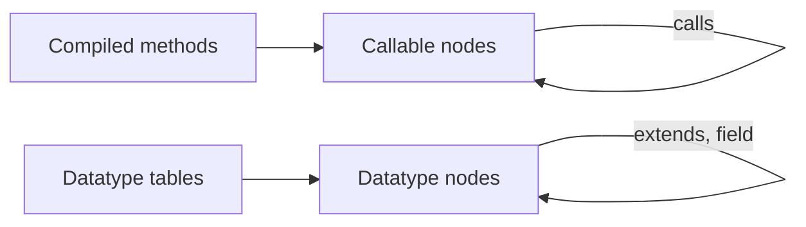

# Table Dependency Graph

How OpenL Studio reports what a project is made of: which tables call which, and which data types are built from
which. One graph answers both, so a user, the graph screen and an MCP client all read the same payload.

## The one graph

Two endpoints return the graph, both as a flat list of nodes that reference each other by id:

- `GET /projects/{projectId}/tables/graph` — the whole project, or a single module through `?module=`. It follows
  dependencies only. `?layer=` returns one layer of the graph on its own: `executable` for the callable tables,
  `datatype` for the data model, `all` (the default) for both.
- `GET /projects/{projectId}/tables/{tableId}/graph` — the neighbourhood of one table, following `direction`
  (`DEPENDENCIES`, `DEPENDENTS`, `BOTH`) up to an optional `depth`. It needs no layer: the root already decides one,
  because neither layer links to the other.

The list is a graph, not a tree: it carries cycles, recursion (a node listing its own id) and shared nodes
faithfully. Cycles are derived by walking the edges; there is no separate cycles payload.

`ProjectTablesGraphService` builds it in two passes over two different sources, because a project holds two kinds
of thing:



## What a node is

Every node carries the identity of the table it stands for — id, name, kind, table type, file, cells, owning
project — and its `dependencies` and `dependents`. What it adds depends on what it stands for:

- **A callable table** (`ExecutableNodeView`) — a rules table, a spreadsheet, a method, or the synthetic
  dispatcher of same-named versions. Adds `signature`, `returnType` and, for one version of an overloaded method,
  the `dimensionProperties` that select it. Its dependencies are the tables it calls.
- **A datatype table** (`DatatypeNodeView`) — a datatype or a vocabulary. Adds `extends`, the id of the datatype
  it inherits from, and `fields`, the fields it declares. A field names its type as declared (`Driver[]`), the id
  of the datatype that type resolves to (`ref`), and whether it holds many values of it (`collection`). Its
  dependencies are the parent and every field type that is a datatype of the graph.

A field of a simple type is listed too, without a `ref` — so the node describes the whole data type, not only the
part of it that links elsewhere. Only declared fields are listed; the inherited ones belong to the parent's node.

A vocabulary declares values rather than fields, so it comes back without `fields` and with a `vocabulary` object
instead — the values are values, not fields, and are never dressed up as ones:

```json
{ "kind": "Datatype", "tableType": "Vocabulary", "name": "Alphabet",
  "vocabulary": { "valueType": "String", "valueCount": 26,
                  "valuesPreview": ["A", "B", "C", "X", "Y", "Z"], "truncated": true } }
```

- **The values keep their type.** A vocabulary of numbers reads as JSON numbers, a vocabulary of dates as the dates
  the table API returns — both are read through the same reader as the table itself, so the two never disagree.
- **They keep the order the table declares them in**, because that order is what the author chose.
- **`valueType` and `valueCount` are always there**, so the size and the shape of a vocabulary are known even when
  its values are not all shown.
- **`valuesPreview` holds at most six values.** A longer vocabulary comes back as its first three and its last
  three with `truncated` set; a vocabulary of six or fewer comes back whole, with `truncated` false; a vocabulary
  that lists no values has no `valuesPreview` at all, as any other empty list of this API. The gap is said through
  `truncated` and the count — never as an ellipsis value, which would be a value the table does not have. The
  complete list is read from the table itself through the table API.
- **`vocabulary` is absent for a regular datatype**, as `fields` is for a vocabulary.

Dispatchers stay as EPBDS-15473 defined them: callers depend on the dispatcher, which fans out to the concrete
versions.

## How the data model is drawn

The data model layer is drawn as an entity-relationship diagram, so a reader of the graph screen can rely on what the
shapes already mean. A datatype is a box, not a named dot:

```text
┌────────────────────────┐
│ Policy                 │        Policy ──────────────○|  Region
│ ───────────────────────│        Policy ──────────────○<  Driver
│ car            Car     │
│ drivers        Driver[]│        ○|  optional, holds one value
│ region         Region  │        ○<  optional, holds many
│ policyNumber   String  │
└────────────────────────┘
```

- **The name is on top**, a rule under it, and the members below in two columns: the name of a field and the type it
  holds, or the values of a vocabulary one per line.
- **A vocabulary is titled with the type it narrows** — `Region: String` — which is what tells it apart from a
  datatype, whose title is a name alone.
- **A box is bounded.** It lists twelve members and cuts an over-long line, and says how many it left out
  (`… +3 more`) in the place they were left out of — the first values of a truncated vocabulary, then the gap, then
  the last ones. The side panel lists the members in full.
- **The frame of a box is even**, unlike a callable table's, whose border thickens with how much it is used. How
  many types are built on a datatype is not what a data model is read for, and a heavy frame would fight the
  members inside the box.

Relationships are drawn in crow's foot (information engineering) notation, the one an ER diagram is read with:

- **Cardinality is a symbol at the entity the field points at** — a bar for a field holding one value, a crow's foot
  for one holding many. A ring in front of it says the field is optional, which a datatype field always is.
- **Inheritance keeps the UML generalization triangle** — a hollow closed triangle pointing at the datatype being
  extended. Crow's foot notation has no symbol for it, and a data model of OpenL datatypes does inherit.

Cytoscape draws every arrow shape with its tip in the node, and a crow's foot points the other way, so the cardinality
symbol is an end label that turns with the line rather than an arrowhead. It reads the same whichever way the edge runs.

Three limits are deliberate:

- **Only the end the field declares carries a symbol.** A datatype field is one-directional, so nothing states how many
  owners a value has. A many-to-many relation — both datatypes holding a collection of the other — is drawn as the two
  relationships the model actually declares, not merged into one with a crow's foot at both ends.
- **Ownership is not asserted.** OpenL has no way to say whether a field owns the value it holds, so neither the UML
  diamonds nor an identifying relationship is drawn. The cardinality symbol carries the "holds many" meaning alone.
- **One edge per pair of datatypes.** Several fields of the same type merge into one relationship, a crow's foot as
  soon as one of them is a collection, and inheritance outranks a field of the parent's own type. The side panel of a
  datatype lists every field separately, so nothing the canvas merges is lost.

The rest of the graph — a rules table calling another — is a plain dependency edge and belongs to no diagram
notation: it keeps what the call graph had before the data model joined it.

## Where each diagram sits

The canvas carries two diagrams that share no edge, so they are laid out one band at a time and stacked: the callable
tables first, the data model of each project under them. Laying them out together would interleave two unrelated
diagrams over the same space.

The data model of a project is framed as a **subject area** titled with the project name — a compound node, so it is
sized by the entities it holds, and it disappears when a filter leaves it empty. It also makes a graph that spans
several projects readable: one frame per project instead of one pile of entities.

The screen's problem markers stay on that call graph, because what they flag is not a defect in a data model:

- **Cycles** are hunted over call edges only. Two datatypes holding a field of each other is ordinary modelling, and a
  datatype cannot inherit in a circle at all.
- **A self-reference** — a field of the datatype's own type — is drawn as a self-association in the data model's own
  colours, not as the red loop that marks a recursive rule.
- **Isolated** is never reported for a datatype. Nothing links a rules table to the types it uses, so a datatype built
  from no other datatype cannot be told apart from one nobody uses.

## Why the data model rides in the same graph

Datatype tables define types rather than methods, so they never arrive through the compiled methods the rest of
the graph is built from — they are read from the table syntax nodes, and a field type is matched to its table by
type identity ([EPBDS-16318](https://jira.eisgroup.com/browse/EPBDS-16318)).

They could have been a capability of their own — a `/datatypes/graph` endpoint with a class-diagram view and its
own MCP tool. They are not, and the decision is deliberate:

- The node kind enumeration already listed `Datatype`, and the graph screen already coloured it. The data model
  was a hole in an existing capability rather than a new one.
- One endpoint, one screen and one MCP tool ([EPBDS-15474](https://jira.eisgroup.com/browse/EPBDS-15474)) cover
  both layers, so nothing has to be documented, filtered or navigated twice.
- The traversal, the direction and depth semantics, the cycle detection and the "used by" reversal are the same
  work for both, and were already written.

Both layers are returned by default. A caller that wants one of them asks for it with `?layer=`; the graph screen
requests the combined graph and lets its legend hide a kind from the view.

## Where the two layers meet

They do not, on purpose. A rules table that takes a `Policy` is **not** linked to the `Policy` datatype: the data
model is its own layer of the graph, so a whole-project graph does not turn into a mesh where every table hangs
off every type. Asking what a datatype is built from, or what is built on it, walks datatypes only.
