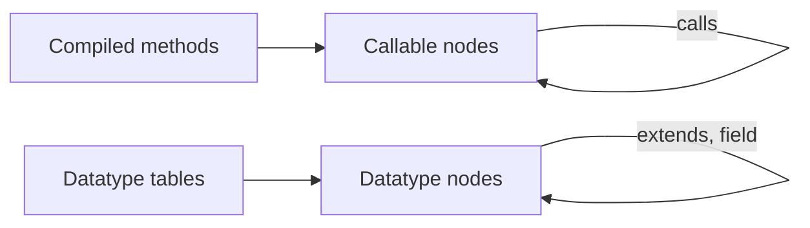

# Table Dependency Graph

How OpenL Studio reports what a project is made of: which tables call which, and which data types are built from
which. One graph answers both, so a user, the graph screen and an MCP client all read the same payload.

## The one graph

Two endpoints return the graph, both as a flat list of nodes that reference each other by id:

- `GET /projects/{projectId}/tables/graph` — the whole project, or a single module through `?module=`. It follows
  dependencies only. `?layer=` returns one layer of the graph on its own: `executable` for the callable tables,
  `datatype` for the data model, `all` (the default) for both.
- `GET /projects/{projectId}/tables/{tableId}/graph` — the neighbourhood of one table, following `direction`
  (`DEPENDENCIES`, `DEPENDENTS`, `BOTH`) up to an optional `depth`. It needs no layer: the root already decides one,
  because neither layer links to the other.

The list is a graph, not a tree: it carries cycles, recursion (a node listing its own id) and shared nodes
faithfully. Cycles are derived by walking the edges; there is no separate cycles payload.

`ProjectTablesGraphService` builds it in two passes over two different sources, because a project holds two kinds
of thing:

## What a node is

Every node carries the identity of the table it stands for — id, name, kind, table type, file, cells, owning
project — and its `dependencies` and `dependents`. What it adds depends on what it stands for:

- **A callable table** (`ExecutableNodeView`) — a rules table, a spreadsheet, a method, or the synthetic
  dispatcher of same-named versions. Adds `signature`, `returnType` and, for one version of an overloaded method,
  the `dimensionProperties` that select it. Its dependencies are the tables it calls.
- **A datatype table** (`DatatypeNodeView`) — a datatype or a vocabulary. Adds `extends`, the id of the datatype
  it inherits from, and `fields`, the fields it declares. A field names its type as declared (`Driver[]`), the id
  of the datatype that type resolves to (`ref`), and whether it holds many values of it (`collection`). Its
  dependencies are the parent and every field type that is a datatype of the graph.

A field of a simple type is listed too, without a `ref` — so the node describes the whole data type, not only the
part of it that links elsewhere. Only declared fields are listed; the inherited ones belong to the parent's node.

Dispatchers stay as EPBDS-15473 defined them: callers depend on the dispatcher, which fans out to the concrete
versions.

## How the data model is drawn

The data model layer follows UML class diagram notation, so a reader of the graph screen can rely on what the shapes
already mean:

- **Generalization** — a solid line with a hollow closed triangle pointing at the datatype being extended.
- **Directed association** — a solid line with an open arrowhead pointing at the datatype a field refers to, with the
  multiplicity written at that end: `0..1` for a field holding one value, `0..*` for a collection field. A datatype
  field is always optional, hence the `0..`.

Two limits are deliberate:

- **Only the end the field declares is labelled.** A datatype field is one-directional, so nothing states how many
  owners a value has. A many-to-many relation — both datatypes holding a collection of the other — is drawn as the two
  associations the model actually declares, not merged into one association with `*` at both ends.
- **Aggregation and composition are not used.** OpenL has no way to say whether a field owns its value, so a filled or
  hollow diamond would assert something the model does not know. Multiplicity carries the "holds many" meaning
  instead.
- **One edge per pair of datatypes.** Several fields of the same type merge into one association, `0..*` as soon as
  one of them is a collection, and inheritance outranks a field of the parent's own type. The side panel of a
  datatype lists every field separately, so nothing the canvas merges is lost.

The rest of the graph — a rules table calling another — is a plain dependency edge and is not UML: it keeps the
notation the call graph had before the data model joined it.

The screen's problem markers stay on that call graph, because what they flag is not a defect in a data model:

- **Cycles** are hunted over call edges only. Two datatypes holding a field of each other is ordinary modelling, and a
  datatype cannot inherit in a circle at all.
- **A self-reference** — a field of the datatype's own type — is drawn as a self-association in the data model's own
  colours, not as the red loop that marks a recursive rule.
- **Isolated** is never reported for a datatype. Nothing links a rules table to the types it uses, so a datatype built
  from no other datatype cannot be told apart from one nobody uses.

## Why the data model rides in the same graph

Datatype tables define types rather than methods, so they never arrive through the compiled methods the rest of
the graph is built from — they are read from the table syntax nodes, and a field type is matched to its table by
type identity ([EPBDS-16318](https://jira.eisgroup.com/browse/EPBDS-16318)).

They could have been a capability of their own — a `/datatypes/graph` endpoint with a class-diagram view and its
own MCP tool. They are not, and the decision is deliberate:

- The node kind enumeration already listed `Datatype`, and the graph screen already coloured it. The data model
  was a hole in an existing capability rather than a new one.
- One endpoint, one screen and one MCP tool ([EPBDS-15474](https://jira.eisgroup.com/browse/EPBDS-15474)) cover
  both layers, so nothing has to be documented, filtered or navigated twice.
- The traversal, the direction and depth semantics, the cycle detection and the "used by" reversal are the same
  work for both, and were already written.

Both layers are returned by default. A caller that wants one of them asks for it with `?layer=`; the graph screen
requests the combined graph and lets its legend hide a kind from the view.

## Where the two layers meet

They do not, on purpose. A rules table that takes a `Policy` is **not** linked to the `Policy` datatype: the data
model is its own layer of the graph, so a whole-project graph does not turn into a mesh where every table hangs
off every type. Asking what a datatype is built from, or what is built on it, walks datatypes only.
