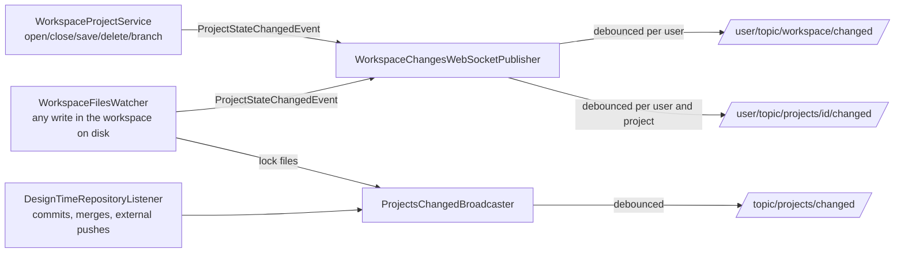

# WebSocket Change Notifications

How OpenL Studio tells open screens that the projects they show may be stale, so the UI refreshes
itself instead of waiting for the user to reload.

## Topics

- **`/user/topic/workspace/changed`** — the user's own workspace changed: a project was opened,
  closed, saved, deleted, switched to another branch, or edited. Content edits are observed on the
  workspace disk, so every write counts, whatever made it — the REST API, the legacy Editor, a file
  saved straight from Excel. Sent only to the acting user's sessions — an action made through any
  client of the same user shows up in their browser.
- **`/user/topic/projects/{id}/changed`** — one project of the user's workspace changed — its state,
  its branch or its content. The body is `{"files": [...]}` naming the project-relative files the
  change touched when the backend knows them; a folder stands for anything under it, an empty list
  means a project-wide change. An open page of that project re-reads it; the files let it refresh an
  open file precisely.
- **`/topic/projects/changed`** — something every user can see changed: the content of a design
  repository (a commit or merge from any user, or an external push detected by repository polling,
  ~10 s), or a project lock appeared or released — the lock badge shows on everyone's screens.
  Broadcast to every authenticated subscriber.
- **`/user/topic/workspace/projects/status`** — the one compile-status stream of the whole
  workspace: every `ProjectStatusViewModel` a compile cycle produces, each naming its own project
  and branch. The projects list holds this single subscription and routes the updates itself —
  instead of one subscription per visible row. The per-project
  `/user/topic/projects/{id}[/branches/{branch}]/status` destinations stay for the single-project
  screens (the title dot, the problems panel, the legacy panels).

The workspace ping and the broadcast are bare (`CHANGED`), and the per-project body carries file
paths at most. No project content ever rides a message: the broadcast reaches every authenticated
session, so clients re-read what they show through the REST API under their own ACL.

## Event flow

- `ProjectStateChangedEvent` is published by `WorkspaceProjectService` after a state-changing action
  succeeds, and by `WorkspaceFilesWatcher` for every content change observed on the workspace disk —
  the disk is where all writes meet, the same signal the legacy Editor's timestamp check reads. The
  file events carry the touched project-relative paths. Publication is best-effort: a notification
  failure never fails the action. Writes on a repository mount go straight to the design repository,
  whose own listener already broadcasts the change.
- Compile-status transitions never feed the change pings: a compile changes nothing they stand
  for, and it already streams on the status destinations. Without this split a compile cycle would
  ping every second and provoke pointless refreshes.
- Project locks are files under the workspace root (`.locks/`), written when a user starts editing
  and removed when they stop. The watcher routes their changes to the broadcast — a lock concerns
  every user, not the workspace of one — through the same debounced sender the repository listener
  uses, so a commit and its lock release collapse into one ping.
- `NotificationDebouncer` collapses a burst (a merge or upload touching many files) into one ping
  per key within a one-second window; the files gathered while a per-project ping waits merge into
  its body.

## What the UI does with a ping

- `subscribeWorkspaceChanges` (over the shared `stompTopic` multiplexer) watches the workspace ping
  and the broadcast; the projects screen runs a silent revalidation — the workspace snapshot
  (`projectIndex`) is dropped and re-read behind the scenes, and the fresh answer swaps in without a
  skeleton.
- `subscribeProjectChanges` watches the open project's own ping, the user's workspace ping and the
  broadcast; the project page re-reads itself (`useLiveProjectChanges`), and drops the snapshot so
  the tree beside it follows. The id-free workspace ping backs the id-keyed one up: a project's id
  mutates when it opens or turns local (it hashes the path), and a ping addressed to the new id
  would slip past a subscription keyed by the old one.
- The open file of the Files tab re-fetches with the page reload (`reloadToken`); an editor holding
  unsaved changes parks the refresh instead of overwriting them (`FilePreviewPane`).
- Bursts coalesce again on the client (`useCoalescedChanges`, 500 ms), merging the named files.
- A ping arriving right after the user's own mutation is likely its echo: the screen already
  reloaded itself when the action finished — without special handling every own action would
  refresh the screen twice, immediately. The batch is not dropped (someone else's real change can
  hide behind the echo): it is held until the echo window passes and delivered then, as one quiet
  refresh.
- The refreshes the pings trigger are silent — the fresh answer swaps in without a skeleton — and
  the open file re-fetches only when the named files cover it. A refresh that brings back exactly
  what the page shows and names no files is not applied at all: no tab reset, no re-fetch cascade —
  it would only replay the reload the user's own action already performed.

## Staleness policy

Pings are the fast path, not the guarantee — they can be lost while a laptop sleeps or the socket
reconnects. Behind them:

- the workspace snapshot has a trust window (5 min); an older snapshot is re-read instead of served;
- coming back to the tab (`useWindowFocus`) re-reads quietly what outlived the window — the projects
  list its snapshot, the open project page its detail read;
- every successful mutating REST call still invalidates the snapshot locally (`openl:workspace-changed`);
- the files watcher retries its initial registration until the workspaces root becomes walkable, so
  a transient filesystem failure at startup cannot silence it for the process's lifetime.

> [!Note]
> The watcher takes one filesystem watch per directory across all user workspaces. On a Linux
> install with many users, raise `fs.inotify.max_user_watches` if the log keeps repeating that the
> watcher failed to start watching the workspaces root.

## Security

- Subscriptions require an authenticated STOMP session (`WebSocketSecurityConfig`); user-scoped
  topics deliver only to the destination user's sessions.
- No per-project ACL filtering happens in the WebSocket layer: the pings carry no data, and all data
  reads stay behind the REST API's ACL.
