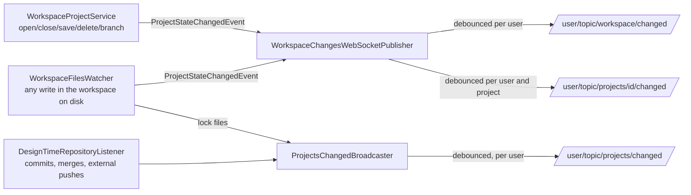

# WebSocket Change Notifications

How OpenL Studio tells open screens that the projects they show may be stale, so the UI refreshes
itself instead of waiting for the user to reload.

## Topics

- **`/user/topic/workspace/changed`** — the user's own workspace changed: a project was opened,
  closed, saved, deleted, switched to another branch, or edited. Content edits are observed on the
  workspace disk, so every write counts, whatever made it — the REST API, the legacy Editor, a file
  saved straight from Excel. Sent only to the acting user's sessions — an action made through any
  client of the same user shows up in their browser. The body is `{"origins": [...]}`.
- **`/user/topic/projects/{id}/changed`** — one project of the user's workspace changed — its state,
  its branch or its content. The body is `{"files": [...], "origins": [...]}`; the files are the
  project-relative ones the change touched when the backend knows them; a folder stands for anything
  under it, an empty list means a project-wide change. An open page of that project re-reads it; the
  files let it refresh an open file precisely.
- **`/user/topic/projects/changed`** — something every user can see changed: the content of a design
  repository (a commit or merge from any user, or an external push detected by repository polling,
  ~10 s), or a project lock appeared or released — the lock badge shows on everyone's screens. Sent
  to every connected user separately rather than broadcast, so it can be named: the body is
  `{"origins": [...]}` and holds only the reader's own clients — see below.
- **`/user/topic/workspace/projects/status`** — the one compile-status stream of the whole
  workspace: every `ProjectStatusViewModel` a compile cycle produces, each naming its own project
  and branch. The projects list holds this single subscription and routes the updates itself —
  instead of one subscription per visible row. The per-project
  `/user/topic/projects/{id}[/branches/{branch}]/status` destinations stay for the single-project
  screens (the title dot, the problems panel, the legacy panels).

A ping body carries file paths and origins at most. No project content ever rides a message: the
broadcast reaches every authenticated session, so clients re-read what they show through the REST
API under their own ACL.

## Who made the change

A ping tells its subscribers what changed, not who asked for it — so the session that made the
change re-read the workspace along with everybody else, doubling the most expensive request the
screen makes. The origins close that gap:

- a browser tab keeps an id of its own (`services/clientId`) and sends it in the
  `X-OpenL-Client-Id` header of every mutating REST request;
- `ChangeOriginResolver` reads the header off the request the change is being made by — the change
  events travel synchronously, so the publisher still runs on that thread;
- a client that sends no header — an integration or an MCP server calling the REST API under the
  user's own credentials, or the legacy pages — is named after its HTTP session instead, and a
  request without even a session is given a name of its own. Those names are ids the server makes
  up, never the id of a browser tab, so a change made through another client of the same user can
  never look like that tab's own echo;
- the name rides the ping out in `origins`, and a client drops a ping whose origins hold nothing but
  its own id (`isOwnEcho`) — and only while its own mutation has just succeeded, so a write whose
  answer never reached the browser still refreshes the screen.

Names travel only to the user they belong to. That is why the repository-changed ping is sent per
user instead of broadcast: it concerns everyone, but each user is told only about clients of their
own. A name can then never be handed to somebody who could not have set it, so no client can learn
another's name, put it on its own requests and have that client skip its changes.

Not every change is published by the request that made it, and those need the same name:

- a file written through the files API reaches the sockets through `WorkspaceFilesWatcher`, from
  the watcher's own thread;
- a commit reaches them through the design-repository index, which rebuilds on its executor a
  moment after the request that invalidated it.

So a mutating request stays the *presumed author* for a few seconds after it starts
(`ChangeOriginResolver.remember`, wired by `ChangeOriginFilter` — a filter rather than a handler
interceptor, because the writes come from every mount: the REST API and the legacy pages as well as
the UI's own). A publication about one user's workspace with no request of its own takes the clients
**of that user** that were writing just before. It is the same move the legacy Editor makes when it
calls `resetSourceModified()` after writing a file — the writer marks its own change as already
known. The repository-changed ping is named the same way, but per recipient: each user is told which
of their own clients were writing, and never about anybody else's.

Four rules keep this from swallowing real changes:

- **the whole set travels.** A debounce window coalesces the changes of several sessions into one
  ping, so it names every origin it absorbed. A ping is an echo only when its sole origin is the
  reader — a single origin would silently drop another session's change hiding behind it;
- **several recent writers name them all.** When more than one client of the user wrote inside the
  window, the ping carries every one of them, so none of them reads it as its own and all re-read;
- **one nameless change makes the whole ping nameless.** A window coalesces what happened in a
  moment, so a change nobody can be named for (an external write into the workspace) takes the
  names of everything it was merged with: one ping stands for it too, and a client reading its own
  name on it would skip a change it did not make;
- **with no recent writer at all the ping stays unnamed** and belongs to nobody, so every session
  re-reads. The clients fall back to the time-based hold for those (see below).

What this trades away: a change made with **no request at all** behind it — an external `git push`
the polling finds, a file saved from Excel straight into the workspace — that lands within the
window of this tab's own write is read as that tab's own echo and skipped by it. Every other session
still sees it, and the trust window and the focus re-read below bring the tab back in line. A change
made through any client that does reach the server over HTTP carries that client's name and is
never mistaken for the tab's own, however the client authenticated.

An id names a running tab and nothing else: a reload starts a new one, and it identifies no user.
An id that is not an opaque token (letters, digits and `-_.`, at most 64) is ignored, so nothing
unbounded reaches the subscribers of a broadcast.

## Event flow

- `ProjectStateChangedEvent` is published by `WorkspaceProjectService` after a state-changing action
  succeeds, and by `WorkspaceFilesWatcher` for every content change observed on the workspace disk —
  the disk is where all writes meet, the same signal the legacy Editor's timestamp check reads. The
  file events carry the touched project-relative paths. Publication is best-effort: a notification
  failure never fails the action. Writes on a repository mount go straight to the design repository,
  whose own listener already broadcasts the change.
- Compile-status transitions never feed the change pings: a compile changes nothing they stand
  for, and it already streams on the status destinations. Without this split a compile cycle would
  ping every second and provoke pointless refreshes.
- The design-repository broadcast rides the cross-branch index, which reports every publish and
  says whether the content moved (`BranchedProjectIndexService`). A rebuild runs on everything the
  repository reports, including work that changes nothing in it — opening a project re-indexes and
  finds the same trees. Both halves matter: the caches built on the previous read are dropped on
  every publish (`onRepositoryModified`), while only a publish that holds something new pings the
  sessions (`onRepositoryContentChanged`). Without the split every action would broadcast a ping
  every screen answers by re-reading the whole workspace, for nothing.
- Project locks are files under the workspace root (`.locks/`), written when a user starts editing
  and removed when they stop. The watcher routes their changes to the broadcast — a lock concerns
  every user, not the workspace of one — through the same debounced sender the repository listener
  uses, so a commit and its lock release collapse into one ping.
- `NotificationDebouncer` collapses a burst (a merge or upload touching many files) into one ping
  per key within a one-second window; the notes gathered while a ping waits — the touched files and
  the origins of the requests behind them — merge into its body.

## What the UI does with a ping

- `subscribeWorkspaceChanges` (over the shared `stompTopic` multiplexer) watches the workspace ping
  and the repository one; the projects screen runs a silent revalidation — the workspace snapshot
  (`projectIndex`) is dropped and re-read behind the scenes, and the fresh answer swaps in without a
  skeleton.
- `subscribeProjectChanges` watches the open project's own ping, the user's workspace ping and the
  repository one; the project page re-reads itself (`useLiveProjectChanges`), and drops the snapshot so
  the tree beside it follows. The id-free workspace ping backs the id-keyed one up: a project's id
  mutates when it opens or turns local (it hashes the path), and a ping addressed to the new id
  would slip past a subscription keyed by the old one.
- The open file of the Files tab re-fetches with the page reload (`reloadToken`); an editor holding
  unsaved changes parks the refresh instead of overwriting them (`FilePreviewPane`).
- Bursts coalesce again on the client (`useCoalescedChanges`, 500 ms), merging the named files.
- A ping this tab caused itself is dropped at the door: the screen already reloaded when the action
  finished — without this every own action would refresh the screen twice, immediately. The origins
  make it exact, so a change of another session is never dropped with the echo, and a ping that
  names a foreign origin needs no waiting at all.
- A ping that names no origin may still be this tab's own action reaching the workspace disk. The
  batch is not dropped (someone else's real change can hide behind it): it is held until the echo
  window of the last own mutation passes (2.5 s, capped at 10 s of holding) and delivered then, as
  one quiet refresh.
- A ping that lands while the screen is running an action of its own waits for it. The screens
  number their reads and apply the newest, which is right for two competing reads and wrong for a
  ping-driven one: it would supersede the read the action is waiting for, so the controls would
  unlock over a screen still showing the state before the action. Both screens pass `holdWhile` to
  the shared hook while an action is pending, so the batch keeps gathering and is delivered once the
  action's own answer is on screen — never dropped, so a change of another session behind it is only
  delayed.
- What counts as pending is the whole project-scoped busy state, not just the buttons of the action
  bar: an action, a branch switch, and the read a dialog leaves behind all mark the project busy
  until the screen shows what they did. The list keys it by project, so one busy project never stops
  work with the others.
- A batch is never dropped for waiting: whatever it waits for — an action of the screen, the echo
  window — it is delivered within 10 s. A batch gathered before the subscription was renewed travels
  to the new one only while an action holds it; renewed for any other reason the screen is watching
  another project, and the batch stays with the subscription that gathered it.
- The refreshes the pings trigger are silent — the fresh answer swaps in without a skeleton — and
  the open file re-fetches only when the named files cover it. A refresh that brings back exactly
  what the page shows and names no files is not applied at all: no tab reset, no re-fetch cascade —
  it would only replay the reload the user's own action already performed.

## Staleness policy

Pings are the fast path, not the guarantee — they can be lost while a laptop sleeps or the socket
reconnects. Behind them:

- the workspace snapshot has a trust window (5 min); an older snapshot is re-read instead of served;
- coming back to the tab (`useWindowFocus`) re-reads quietly what outlived the window — the projects
  list its snapshot, the open project page its detail read;
- every successful mutating REST call still invalidates the snapshot locally (`openl:workspace-changed`);
- the files watcher retries its initial registration until the workspaces root becomes walkable, so
  a transient filesystem failure at startup cannot silence it for the process's lifetime.

> [!Note]
> The watcher takes one filesystem watch per directory across all user workspaces. On a Linux
> install with many users, raise `fs.inotify.max_user_watches` if the log keeps repeating that the
> watcher failed to start watching the workspaces root.

## Security

- Subscriptions require an authenticated STOMP session (`WebSocketSecurityConfig`); user-scoped
  topics deliver only to the destination user's sessions.
- No per-project ACL filtering happens in the WebSocket layer: the pings carry no data, and all data
  reads stay behind the REST API's ACL.
- The origins of the broadcast reach every authenticated session. A client id is an opaque token a
  tab picks for itself and discards on reload — it names no user, no project and no repository.
