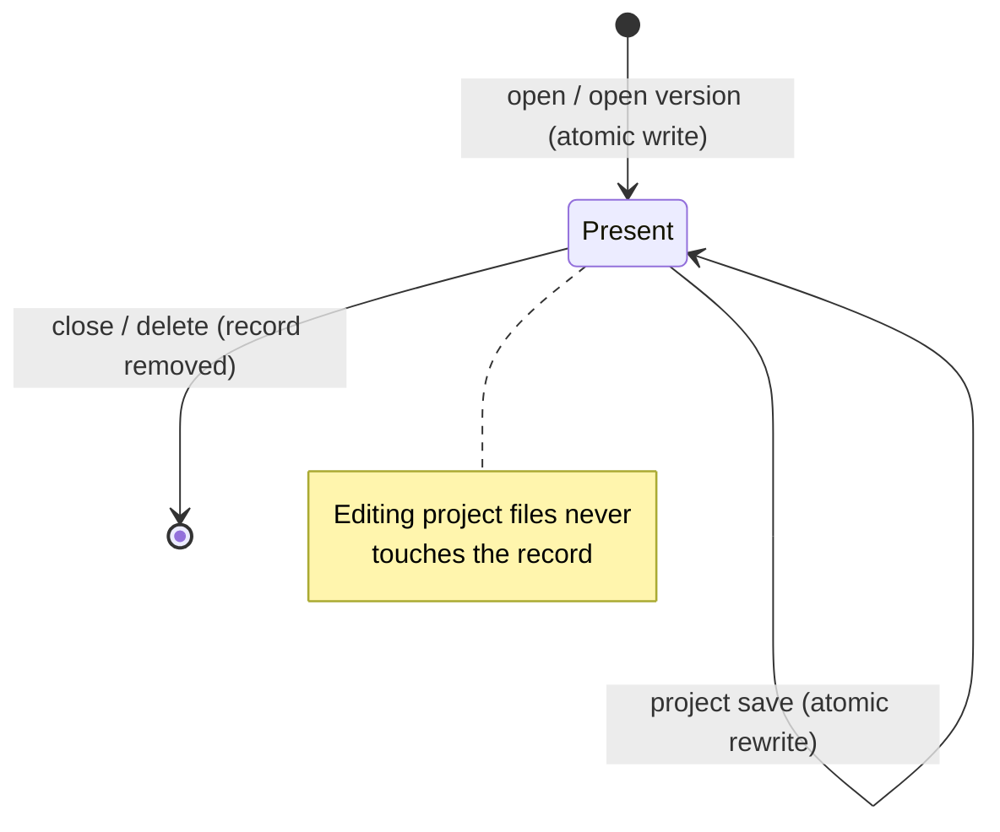

# Workspace Project Metainfo Registry

Every project opened in a user workspace of OpenL Studio is described by one record in the per-user
**metainfo registry**. The record links the local project copy to its source repository project and keeps the
per-file baselines of the last synchronization. Project folders contain only project files.

The registry is **authoritative**: a project exists in the workspace exactly when it has a record. A folder
without a record is garbage and is deleted when the workspace is loaded.

## On-Disk Layout

```
${user.workspace.home}/
├── .locks/                                  # lock files, shared across users
└── {userId}/
    ├── .metainfo/
    │   └── {projectFolderName}.properties   # one record per project
    ├── .history/
    │   └── {projectFolderName}/**           # local edit history of the project modules
    └── {projectFolderName}/                 # project files only, nothing else
```

- Top-level folders of a user workspace whose name starts with `.` are service folders. Listings of the
  local repository skip them by this single rule; project names cannot start with a dot (`NameChecker`).
- The record file name equals the project folder name, so the mapping needs no extra key.

## Record Format

```properties
format-version=1
repository-id=design
path-in-repository=DESIGN/rules/Example 1 - Bank Rating
branch=main
version=8b5f3a9
author=jsmith
modified-at-long=1751980000000
size=12345
comment=Project copied from Example 1
file.unique-id./rules/Main.xlsx=9f3c1a7e
file.size./rules/Main.xlsx=54321
file.modified-at-long./rules/Main.xlsx=1751979000000
```

- Project-level keys describe the last synchronized project revision. The link is complete when the
  `version` and `modified-at-long` are known; the `author` is display metadata and may be absent.
- A genuinely local project has `repository-id=local` and no revision keys.
- Per-file baseline keys use the `file.<attribute>.<path>` shape. The attribute set is closed
  (`unique-id`, `size`, `modified-at-long`), and the arbitrary user content (the path) is the key tail,
  so parsing is unambiguous. `unique-id` is the file revision id in the source repository and is absent
  when the repository does not provide one.
- No `modified` state is stored at any level — it is derived (see below).

## Record Lifecycle



- Only three coarse-grained operations write the record: open, save, close. They run under a per-project
  in-JVM lock inside the registry.
- A revoked read permission also closes the copy: the first project listing that meets an opened copy
  without the read access evicts it, so the copied data does not outlive the access.
- Records are written atomically (temp file + rename), so a crash cannot leave a partially written record.
- The record write is the commit point of the open operation: project files are copied first, and a crash
  before the record is written leaves a folder without a record, which the reconciliation removes.

## Local-Changes Detection

- **Per file, on the read path.** File listings already carry the actual size and modification time.
  A file is changed when these differ from the recorded baseline or when it has no baseline. A changed
  file is reported without a repository revision id (`uniqueId` is `null`), which drives the incremental
  save and the pending-changes view.
- **Per project, on the status path.** An in-memory dirty-set is fed by every save and delete going through
  the local repository, so the project `modified` status is an O(1) lookup without IO.
- **Reconstruction.** When the registry is loaded, the dirty-set is rebuilt by comparing project files
  against the baselines: a size or time mismatch, an extra file, or a missing baseline file means the
  project has local changes.
- **Baseline-collision guard.** If a save produces the same size and modification time as the baseline
  (possible only for programmatic edits within the same millisecond), the local repository bumps the file
  modification time forward so the derivation stays reliable across restarts.

## In-Memory Registry and Concurrency

- **One registry instance per `userId`, never per session.** `LocalWorkspaceManagerImpl` owns a
  `Map<userId, MetainfoRegistry>` and hands the instance to every `LocalWorkspace` and `LocalRepository`
  created for that user. All channels of a user (browser tabs, JSF, REST, MCP) share it. Workspace
  instances can churn — `UserWorkspaceImpl.release()` has no reference counting — but the registry
  survives the churn, so the dirty-set and the per-project locks are never forked.
- The instance is created lazily on the first access (the disk read and the dirty-set reconstruction happen
  once per JVM) and is retained for the JVM lifetime.
- The registry is cached write-through; all hot readers (statuses, `getRealPath`, ACL, lock operations,
  refresh) are served from memory. The OpenL Studio process is the only writer of
  `${user.workspace.home}`, so no cross-process invalidation is needed.
- The editing hot path takes no locks and performs no metainfo IO.

## Reconciliation

The registry reconciles the disk state when it is loaded — once per JVM, at the first access to the user
workspace after the start — before the workspace projects are exposed:

- a record without a project folder is dropped;
- a project folder without a record is deleted;
- an unreadable or unparseable record is dropped together with its folder.

Every state has exactly one outcome, so a damaged entry cannot break or pollute the workspace load.

## Unmatched Projects

The workspace refresh never rewrites the repository link of an opened copy:

- **Repository unavailable** (an outage, a wrong URL, lost credentials): the opened copies stay linked and
  keep their last known state, reconstructed from the records. When the repository recovers, the copies
  match their design counterparts again as if nothing happened.
- **Project deleted in the current branch, or the branch removed**: an unchanged copy is silently closed;
  a copy with local changes stays opened and linked — the next save targets the current branch of the
  repository, so the changes are not lost.
- A genuinely local project (`repository-id=local`) is served as is.
- **Repository removed from the configuration**: the copy is relinked to the `local` repository — the
  administrative detach is the only case when a design project becomes a local one. The baselines and
  the local-changes state survive the relink.

## Local Edit History

- The module edit history lives outside the project folder: `{userId}/.history/{project}/<module root>`
  (`FolderHelper.resolveHistoryFolder`).
- Deleting the project root in the local repository removes the record and the project history together
  with the folder.

## Upgrade from `.studioProps`

Workspaces created before the registry keep the metainfo in a `.studioProps` folder inside each project.
A one-time `Migrator` step converts them on the first start:

- a project with a repository link in `.studioProps/.version` gets a registry record with the link and the
  per-file baselines; the legacy `.studioProps` folder and the in-project edit history are deleted;
- a folder with a missing or unreadable link gets no record — a link that does not exist cannot be
  restored, and the reconciliation deletes such folders at the first workspace load;
- the step is idempotent: a project that already has a record is skipped, so a repeated run cannot degrade
  it. Downgrade is not supported.

## Implementation Map

- `MetainfoRegistry`, `ProjectMetainfo` (`org.openl.rules.project.impl.local`) — the record model, atomic
  IO, write-through cache, per-project locks, reconciliation, and the dirty-set.
- `ProjectState` — the per-project facade over the registry used by the workspace and the web layers.
- `LocalRepository` — reports saves and deletes to the registry, enriches file listings with the baseline
  revision ids, hides top-level service folders, applies the baseline-collision guard.
- `LocalWorkspaceImpl` / `LocalWorkspaceManagerImpl` — load projects from the registry and own the
  per-user registry instances.
- `RulesProject` — captures the synchronization snapshot (project link + file baselines) on open and save.
- `Migrator` — the one-time `.studioProps` conversion.
- `FolderHelper`, `ProjectHistoryService` — the edit-history location and its maintenance.
