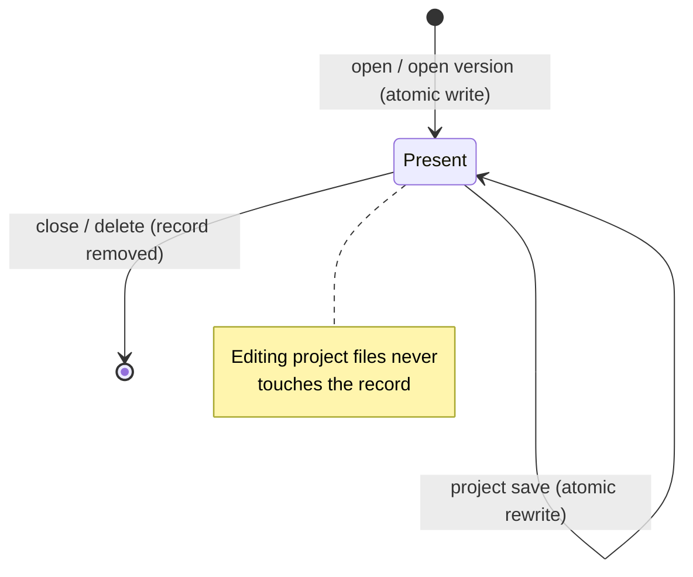

# Workspace Project Metainfo Registry

Every project opened in a user workspace of OpenL Studio is described by one record in the per-user
**metainfo registry**. The record links the local project copy to its source repository project and keeps the
per-file baselines of the last synchronization. Project folders contain only project files.

The registry is **authoritative**: a project exists in the workspace exactly when it has a record. A folder
without a record is garbage and is deleted when the workspace is loaded.

## On-Disk Layout

```
${user.workspace.home}/
├── .locks/                                  # lock files, shared across users
└── {userId}/
    ├── .metainfo/
    │   └── {projectFolderName}.properties   # one record per project
    ├── .history/
    │   └── {projectFolderName}/**           # local edit history of the project modules
    └── {projectFolderName}/                 # project files only, nothing else
```

- Top-level folders of a user workspace whose name starts with `.` are service folders. Listings of the
  local repository skip them by this single rule; project names cannot start with a dot (`NameChecker`).
- The record file name equals the project folder name, so the mapping needs no extra key.

## Record Format

```properties
format-version=1
repository-id=design
path-in-repository=DESIGN/rules/Example 1 - Bank Rating
branch=main
version=8b5f3a9
author=jsmith
modified-at-long=1751980000000
size=12345
comment=Project copied from Example 1
file.unique-id./rules/Main.xlsx=9f3c1a7e
file.size./rules/Main.xlsx=54321
file.modified-at-long./rules/Main.xlsx=1751979000000
```

- Project-level keys describe the last synchronized project revision. The link is complete when the
  `version` and `modified-at-long` are known; the `author` is display metadata and may be absent.
- A genuinely local project has `repository-id=local` and no revision keys.
- Per-file baseline keys use the `file.<attribute>.<path>` shape. The attribute set is closed
  (`unique-id`, `size`, `modified-at-long`), and the arbitrary user content (the path) is the key tail,
  so parsing is unambiguous. `unique-id` is the file revision id in the source repository and is absent
  when the repository does not provide one.
- No `modified` state is stored at any level — it is derived (see below).

## Record Lifecycle



- Only three coarse-grained operations write the record: open, save, close. They run under a per-project
  in-JVM lock inside the registry. The open holds the lock for the whole operation — the file copy and
  the record write — so a reconciliation running in parallel cannot meet the half-copied folder.
- Evicting an opened copy removes its record, project folder, edit history, and lock. Local changes do
  not prevent the eviction.
- Records are written atomically (temp file + rename), so a crash cannot leave a partially written record.
- The record write is the commit point of the open operation: project files are copied first, and a crash
  before the record is written leaves a folder without a record, which the reconciliation removes.

## Local-Changes Detection

- **Per file, on the read path.** File listings already carry the actual size and modification time.
  A file is changed when these differ from the recorded baseline or when it has no baseline. A changed
  file is reported without a repository revision id (`uniqueId` is `null`), which drives the incremental
  save and the pending-changes view.
- **Per project, on the status path.** An in-memory dirty-set is fed by every save and delete going through
  the local repository, so the project `modified` status is an O(1) lookup without IO.
- **Reconstruction.** When the registry is loaded, the dirty-set is rebuilt by comparing project files
  against the baselines: a size or time mismatch, an extra file, or a missing baseline file means the
  project has local changes.
- **Baseline-collision guard.** If a save produces the same size and modification time as the baseline
  (possible only for programmatic edits within the same millisecond), the local repository bumps the file
  modification time forward so the derivation stays reliable across restarts.

## In-Memory Registry and Concurrency

- **One registry instance per `userId`, never per session.** `LocalWorkspaceManagerImpl` owns a
  `Map<userId, MetainfoRegistry>` and hands the instance to every `LocalWorkspace` and `LocalRepository`
  created for that user. All channels of a user (browser tabs, JSF, REST, MCP) share it. Workspace
  instances can churn — `UserWorkspaceImpl.release()` has no reference counting — but the registry
  survives the churn, so the dirty-set and the per-project locks are never forked.
- The instance is created lazily on the first access (the disk read and the dirty-set reconstruction happen
  once per JVM) and is retained for the JVM lifetime.
- The registry is cached write-through; all hot readers (statuses, `getRealPath`, ACL, lock operations,
  refresh) are served from memory. The OpenL Studio process is the only writer of
  `${user.workspace.home}`, so no cross-process invalidation is needed.
- The editing hot path performs no metainfo IO. Reporting a change takes the in-JVM project lock only
  for the insertion into the dirty-set, so a concurrent reconciliation cannot lose the notification.

## Reconciliation

The registry reconciles the disk state at two moments:

- **On load** — once per JVM, at the first access to the user workspace after the start, before the
  workspace projects are exposed.
- **On every interactive sign-in of the user** — the login listener cleans up the registry and
  recomputes the local-changes state of the opened projects. The reconciliation runs in the
  background, so the sign-in latency does not depend on the workspace size. Stateless requests
  (Basic authentication, personal access tokens) do not trigger it.

The outcomes are the same in both cases:

- a record without a project folder is dropped;
- a project folder without a record is deleted;
- an unreadable or unparseable record is dropped together with its folder;
- a leftover of an interrupted record write is deleted;
- the local-changes state of every remaining project is recomputed from the baselines.

Every state has exactly one outcome, so a damaged entry cannot break or pollute the workspace load.

The sign-in reconciliation runs on a live registry: every project is reconciled under its project lock,
and a project locked by an operation in progress (an open, a save, a folder rename) is skipped — the
operation rewrites the project state anyway, and the sign-in must not stall behind it.

## Unmatched Projects

An opened copy is evicted regardless of local changes in each of these cases:

- **Project deleted**: OpenL Studio no longer identifies the project as existing.
- **Branch deleted**: the branch used by the opened copy no longer exists.
- **Read access revoked (Studio ACL)**: the user no longer has read access to the project.
- **Repository removed from the configuration**: the source repository is no longer configured in
  OpenL Studio.

Other unmatched projects are handled as follows:

- **Repository unavailable** (an outage, a wrong URL, lost credentials): the opened copies stay linked and
  keep their last known state, reconstructed from the records. When the repository recovers, the copies
  match their design counterparts again as if nothing happened.
- A genuinely local project (`repository-id=local`) is served as is.

## Local Project Identity and Actions

A local-only project has two names with different purposes when the `<name>` in `rules.xml` differs from its folder:

- Its project id encodes `local:{workspace-folder}`. The folder identifies the project in the workspace and keeps
  REST links stable and resolvable.
- Project dependencies use the logical name declared in `rules.xml`. OpenL Studio matches a dependency by that name,
  displays it, and attaches the folder-based id of the project it resolved. The Overview and legacy JSF Editor links
  therefore open the target instead of treating the folder name as a logical name.
- Legacy Editor hash routes identify a project by that logical name. Every project and module breadcrumb route
  therefore uses the name declared in `rules.xml`, while REST links keep using the folder-based project id.

The local project is its own working copy, so its files can be edited and the project can be deleted. It has no
Design repository revision to commit, so the project capabilities do not offer **Save**. Publishing it uses
**Create Project > Workspace**, which imports the project into a Design repository.

## Local Edit History

- The module edit history lives outside the project folder: `{userId}/.history/{project}/<module root>`
  (`FolderHelper.resolveHistoryFolder`).
- Deleting the project root in the local repository removes the record and the project history together
  with the folder.

## Upgrade from `.studioProps`

Workspaces created before the registry keep the metainfo in a `.studioProps` folder inside each project.
A `Migrator` step converts them:

- a project with a repository link in `.studioProps/.version` gets a registry record with the link and the
  per-file baselines; the legacy `.studioProps` folder and the in-project edit history are deleted;
- a folder with a missing or unreadable link gets no record — a link that does not exist cannot be
  restored, and the reconciliation deletes such folders at the first workspace load;
- the step is idempotent: a project that already has a record is skipped, so a repeated run cannot degrade
  it. Downgrade is not supported.

The conversion is not guarded by the installation version. An env-var or default installation keeps no
dynamic settings file, so the recorded from-version reads as the running build and a version guard would
skip the conversion — the reconciliation would then delete every unconverted legacy folder as a stray one
and destroy uncommitted work. Because the step is idempotent and touches only folders with a legacy link,
it runs on every start.

A single-user installation upgraded from before EPBDS-16213 also has its workspace directory moved: the
single user defaulted to `DEFAULT` and now defaults to the OS account, so the folder is renamed to the
resolved user name before the conversion above records its projects. Without the rename 6.4.0 would read a
fresh empty workspace while the previous one is abandoned — and, once the renamed folder is read, the
unconverted projects in it would be deleted as strays. The move runs only when the legacy folder exists and
the target does not, so it never overwrites an existing workspace.

## Implementation Map

- `MetainfoRegistry`, `ProjectMetainfo` (`org.openl.rules.project.impl.local`) — the record model, atomic
  IO, write-through cache, per-project locks, reconciliation, and the dirty-set.
- `ProjectState` — the per-project facade over the registry used by the workspace and the web layers.
- `LocalRepository` — reports saves and deletes to the registry, enriches file listings with the baseline
  revision ids, hides top-level service folders, applies the baseline-collision guard.
- `LocalWorkspaceImpl` / `LocalWorkspaceManagerImpl` — load projects from the registry and own the
  per-user registry instances; `refreshMetainfoRegistry` serves the sign-in reconciliation.
- `UserWorkspaceImpl` — matches the opened copies against the design repositories on refresh and
  applies the unmatched-project outcomes: evicts copies when their project or branch is deleted, read
  access is revoked, or their repository is removed from the configuration; keeps copies of an
  unavailable repository.
- `WorkspaceRegistryReconciler` (`org.openl.studio.security`) — triggers the reconciliation on every
  interactive sign-in.
- `RulesProject` — captures the synchronization snapshot (project link + file baselines) on open and save.
- `Migrator` — the `.studioProps` conversion and the single-user workspace rename, run unconditionally on
  every start.
- `FolderHelper`, `ProjectHistoryService` — the edit-history location and its maintenance.
