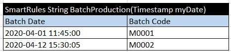

## Extending OpenL Tablets Functionality
If an added class has a public constructor with a `String` parameter, a public static `valueOf(String)` method, or a public static `parse(CharSequence)` method, OpenL Tablets checks them in this order and reads a value of the class from the text of a cell. The values can be declared in the cells directly, and no conversion is required. An example of an added class is as follows.

*Added class example*

In this example, timestamp class object values in the Batch Date column are defined as a plain text, without conversion.

OpenL Tablets Documentation is licensed under a Creative Commons Attribution 4.0 International License.
