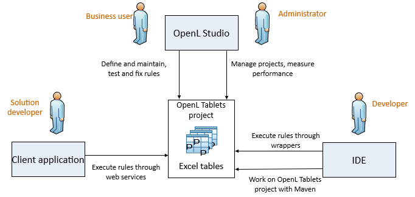

## Introducing OpenL Tablets
This chapter introduces OpenL Tablets and describes its main concepts.

The following topics are included in this chapter:

-   [What Is OpenL Tablets?](#what-is-openl-tablets)
-   [Basic Concepts](#basic-concepts)
-   [System Overview](#system-overview)
-   [Quick Start with OpenL Tablets](#quick-start-with-openl-tablets)

### What Is OpenL Tablets?
**OpenL Tablets** is a business rules management system and business rules engine based on tables presented in Excel documents. Using unique concepts, OpenL Tablets facilitates treating business documents containing business logic specifications as executable source code. Since the format of tables used by OpenL Tablets is familiar to business users, OpenL Tablets bridges a gap between business users and developers, thus reducing costly enterprise software development errors and dramatically shortening the software development cycle.

In a very simplified overview, OpenL Tablets can be considered as a table processor that extracts tables from Excel documents and makes them accessible from the application.

The major advantages of using OpenL Tablets are as follows:

-   OpenL Tablets removes the gap between software implementation and business documents, rules, and policies.
-   Business rules become transparent to developers.

For example, decision tables are transformed into Java methods or directly into web service methods. The transformation is performed automatically.

-   OpenL Tablets verifies syntax and type errors in all project document data, providing convenient and detailed error reporting. OpenL Tablets can directly point to a problem in an Excel document.
-   OpenL Tablets provides calculation explanation capabilities, enabling expansion of any calculation result by pointing to source arguments in the original documents.
-   OpenL Tablets enables users to create and maintain tests to insure reliable work of all rules.
-   OpenL Tablets provides cross-indexing and search capabilities within all project documents.
-   OpenL Tablets provides full rules lifecycle support through its business rules management applications.
-   OpenL Tablets supports the `.xls` and `.xlsx` file formats.

### Basic Concepts
This section describes the basic concepts of OpenL Tablets and includes the following topics:

-   [Rules](#rules)
-   [Tables](#tables)
-   [Projects](#projects)
-   [Wrapper](#wrapper)
-   [Execution Mode for OpenL Project](#execution-mode-for-openl-project)

#### Rules
In OpenL Tablets, a **rule** is a logical statement consisting of conditions and actions. If a rule is called and all its conditions are true, then the corresponding actions are executed. Basically, a rule is an IF-THEN statement. The following is an example of a rule expressed in human language:

*If a service request costs less than 1,000 dollars and takes less than 8 hours to execute, then the service request must be approved automatically*.

Instead of executing actions, rules can also return data values to the calling program.

#### Tables
Basic information OpenL Tablets deals with, such as rules and data, is presented in **tables**. Different types of tables serve different purposes. For more information on table types, see [OpenL Tablets Reference Guide > Table Types](https://openldocs.readthedocs.io/en/latest/documentation/guides/reference_guide/#table-types).

#### Projects
An OpenL Tablets **project** is a container of all resources required for processing rule related information. Usually, a project contains Excel files and Java code. For more information on projects, see [OpenL Tablets Reference Guide > Working with Projects](https://openldocs.readthedocs.io/en/latest/documentation/guides/reference_guide/#working-with-projects).

There can be situations where OpenL Tablets projects are used in the development environment but not in production, depending on the technical aspects of a solution.

#### Wrapper
A **wrapper** is a Java object that exposes rule tables via Java methods and data tables as Java objects and allows developers to access table information from code. Wrappers are essential for solutions where compiled OpenL Tablets project code is embedded in solution applications. If tables are accessed through web services, client applications are not aware of wrappers but they are still used on the server.

For more information on wrappers, see [Using OpenL Tablets Rules from Java Code](#using-openl-tablets-rules-from-java-code).

#### Execution Mode for OpenL Project
Execution mode for OpenL project is a light weight compilation mode that enables only evaluating of rules; but editing, tracing and search are not available. Since the Engine will not load test tables and keep debug information in memory in this mode, memory consumption is up to 5 times less than for debug mode.

By default, the execution mode (`exectionMode=true`) is used in OpenL Rule Services.

The debug mode (`exectionMode=false`) is used by default in OpenL Studio.

Flag indicating required mode is introduced in runtime API and in wrappers.

To compile an OpenL Tablets project in execution mode, proceed as follows:

-   If the OpenL Tablets high level API (instantiation strategies) is used, define an execution mode in a constructor of the particular instantiation strategy.
-   If the low level API (Engine factories) is used, set an execution mode flag using the `setExecutionMode(boolean)` method.

### System Overview
The following diagram displays how OpenL Tablets is used by different types of users:

*OpenL Tablets overview*

A typical lifecycle of an OpenL Tablets project is as follows:

1.  A business analyst creates a new OpenL Tablets project in OpenL Studio.
	Optionally, development team may provide the analyst with a project in case of complex configuration.
	The business analyst also creates correctly structured tables in Excel files based on requirements and includes them in the project. Typically, this task is performed through Excel or OpenL Studio in a web browser.
2.  The business analyst performs unit and integration tests by creating test tables and performance tests on rules through OpenL Studio.
	As a result, fully working rules are created and ready to be used.
3.  A developer adds configuration to the project according to application needs.
	Alternatively, they can create a new OpenL Tablets project in their IDE via OpenL Maven Archetype and adjust it to use business user input.
4.  A developer employs business rules directly through the OpenL Tablets engine or remotely through web services.
5.  Whenever required, the business user updates or adds new rules to project tables.

OpenL Tablets business rules management applications, such as OpenL Studio, Rules Repository, and Rule Services Core, can be set up to provide self-service environment for business user changes.

### Quick Start with OpenL Tablets
OpenL Tablets provide a few ways to create a project. We recommend using Simple Project Maven Archetype approach for creating a project for the first time or create it via OpenL Studio. For more information on approaches for creating a project with detailed descriptions, see [How to Start with OpenL Rules Project](#how-to-start-with-openl-rules-project).

After a project is created, a zip or Excel file for importing the project to OpenL Studio can be used. For more information on importing an existing project into OpenL Studio, see [OpenL Studio Guide](https://openldocs.readthedocs.io/en/latest/documentation/guides/webstudio_user_guide).

OpenL Studio provides convenient UI to work with rules. However, its usage can be avoided by working with rules from IDE only using the OpenL Tablets Maven plugin. The plugin provides compilation and testing of rules and wrapper generation support.

Also, OpenL Tablets has OpenL Tablet Demo Package available at <https://openl-tablets.org/>. A demo is a zip file that contains a Tomcat with configured OpenL Studio and OpenL Rule Services projects. It can be used to effectively start using OpenL Tablets products.

