## OpenL Tablets Functions and Supported Data Types

This chapter is intended for OpenL Tablets users to help them better understand how their business rules are processed in the OpenL Tablets system.

To implement business rules logic, users need to instruct OpenL Tablets what they want to do. For that, one or several rule tables with user’s rules logic description must be created.

Usually, rules operate with some data from user’s domain to perform certain actions or return some results. The actions are performed using functions, which, in turn, support particular data types.

This section describes data types and functions for business rules management in the system and introduces basic principles of using arrays.

The section includes the following topics:

-   [Working with Arrays](#working-with-arrays)
-   [Working with Data Types](#working-with-data-types)
-   [Working with Functions](#working-with-functions)

### Working with Arrays

An **array** is a collection of values of the same type. Separate values of an array are called **array elements**. An **array element** is a value of any data type available in the system, such as Integer, Double, Boolean, and String. For more information on OpenL Tablets Data Types, see [Working with Data Types](#working-with-data-types).

Square brackets in the name of the data type indicate that there is an array of values in the user’s rule to be dealt with. For example, the `String[]` expression can be used to represent an array of text elements of the **String** data type, such as US state names, for example, CA, NJ, and VA. Users use arrays for different purposes, such as calculating statistics and representing multiple rates.

The following topics are included in this section:

-   [Working with Arrays from Rules](#working-with-arrays-from-rules)
-   [Array Index Operators](#array-index-operators)
-   [Operators and Functions to Work with Arrays](#operators-and-functions-to-work-with-arrays)
-   [Rules Applied to Array](#rules-applied-to-array)
-   [Rules with Variable Length Arguments](#rules-with-variable-length-arguments)

#### Working with Arrays from Rules

Data type arrays can be used in rules as follows:

| Method                                       | Description                                                                                                                                                                                                                                                                                                                                                                                                                                                                                                                                                                                                                                                                                                                                                                                               |
|----------------------------------------------|-----------------------------------------------------------------------------------------------------------------------------------------------------------------------------------------------------------------------------------------------------------------------------------------------------------------------------------------------------------------------------------------------------------------------------------------------------------------------------------------------------------------------------------------------------------------------------------------------------------------------------------------------------------------------------------------------------------------------------------------------------------------------------------------------------------|
| By numeric index, <br/>starting from 0            | In this case, by calling `drivers[5]`, a user gets the sixth element of the data type array.                                                                                                                                                                                                                                                                                                                                                                                                                                                                                                                                                                                                                                                                                                              |
| By user defined index                        | This case is a little more complicated. The first field of data type is considered to be the user defined index. <br/><br/>For example, if there is a **Driver** data type with the first String field name, a data table can be created, initializing two instances <br/>of **Driver** with the following names: John and David. Then in rules, the required instance can be called by `drivers[“David”]`. <br/><br/>All Java types, including primitives, and data types can be used for user specific indexes. <br/>When the first field of data type is of `int` type called `id,` to call the instance from array, wrap it with quotes as in <br/>`drivers[“7”]`. In this case, a user does not get the eighth element in the array, but the **Driver** with ID=7. <br/>For more information on data tables, see [Data Table](Creating_Tables_for_OpenL_Tablets.md#data-table). |
| By conditional index                         | Another case is to use conditions that consider which elements must be selected. <br/>For this purpose, SELECT operators are used, which specify conditions for selection. <br/>For more information on how to use SELECT operators, see [Array Index Operators](#array-index-operators).                                                                                                                                                                                                                                                                                                                                                                                                                                                                                                                           |
| By other array index <br/>operators and functions | Any index operator listed in [Array Index Operators](#array-index-operators) or a function designed to work with arrays can be applied to an array in user rules. <br/>The full list of OpenL Tablets array functions is provided in [Appendix B: Functions Used in OpenL Tablets](Appendix_B_Functions_Used_in_OpenL_Tablets.md#appendix-b-functions-used-in-openl-tablets).                                                                                                                                                                                                                                                                                                                                                                                                                                                                             |

When referencing the non-existing element by array[index], for primitive types, the default value is returned, and for other types, null is returned.

#### Array Index Operators

**Array index operators** are operators which facilitate working with arrays in rules. Index operators are specified in square brackets of the array and apply particular actions to array elements.

This section provides detailed description of index operators along with examples. OpenL Tablets supports the following index operators:

-   [SELECT Operators](#select-operators)
-   [ORDER BY Operators](#order-by-operators)
-   [SPLIT BY Operator](#split-by-operator)
-   [TRANSFORM TO Operators](#transform-to-operators)
-   [Array Index Operators and Arrays of the SpreadsheetResult Type](#array-index-operators-and-arrays-of-the-spreadsheetresult-type)
-   [Advanced Usage of Array Index Operators](#advanced-usage-of-array-index-operators)

##### SELECT Operators

There are cases requiring conditions that determine the elements of the array to be selected. For example, if there is a data type **Driver** with such fields as **name** of the String type, **age** of the Integer type, and other similar data, and all drivers with the name **John** aged under **20** must be selected, use the following SELECT operator realizing conditional index:

`arrayOfDrivers[select all having name == “John” and age < 20]`

The following table describes the SELECT operator types:

| Type                                               | Description                                                                                                                                                                                                                                                      |
|----------------------------------------------------|------------------------------------------------------------------------------------------------------------------------------------------------------------------------------------------------------------------------------------------------------------------|
| Returns the first element <br/>satisfying the condition | Returns the first matching element or null if there is no such element. <br/>**Syntax:** `array[!@ <condition>]` or `array[select first having <condition>]` or `array[select first where <condition>]` <br/>**Example:** `arrayOfDrivers[!@ name == “John” and age < 20]` |
| Returns all elements <br/>satisfying the condition      | Returns the array of matching elements or empty array if there are no such elements. <br/>**Syntax:** `array[@ <condition>]` or `array [select all having <condition>]` or `array[select all where <condition>]` <br/>**Example:** `arrayOfDrivers[@ numAccidents > 3]`    |

##### ORDER BY Operators

These operators are intended to sort elements of the array. Consider a data type **Claim** with such fields as **lossDate** of the Date type, **paymentAmount** of the Double type, and other similar data, and all claims must be sorted by loss date starting with the earliest one. In this case, use the ORDER BY operator, such as `claims[order by lossDate]`.

The following table describes ways of sorting:

| Method                            | Description                                                                                                                                            |
|-----------------------------------|--------------------------------------------------------------------------------------------------------------------------------------------------------|
| Sort elements by increasing order | **Syntax:** `array[^@ <expression>]` or `array[order by <expression>] `or `array[order increasing by <expression>]` <br/>**Example:** `claims[^@ lossDate]` |
| Sort elements by decreasing order | **Syntax:** `array[v@ <expression>]` or `array[order decreasing by <expression>]` <br/>**Example:** `claims[v@ paymentAmount]`                              |

**Note:** The operator returns the array with ordered elements. It saves element order in case of equal elements. `<expression>` by which ordering is performed must have a comparable type, such as Date, String, Number.

##### SPLIT BY Operator

To split array elements into groups by definite criteria, use SPLIT BY operator, which returns a collection of arrays with elements in each array of the same criteria. For example, `codes = {"5000", "2002", "3300", "2113"}; codes[split by substring(0,1)]` will produce three collections, `{"5000"}, {"2002", "2113"} and {"3300"}` united by codes with the equal first number.

**Syntax:** `array[~@ <expression>]` or `array[split by <expression>]`

**Example:** `orders[~@ orderType]`

where orders of `Order[]` data type, custom data type **Order** has a field **orderType** for defining a category of **Order**. The operator in the example produces `Order[][]` split by different categories.

The SPLIT BY operator returns a two-dimensional array containing arrays of elements split by an equal value of `<expression>`. The relative element order is preserved.

##### TRANSFORM TO Operators

This operator turns source array elements into another transformed array in a quick way. Assume that a collection of claims is available and **claim ID** and **loss date** information for each claim in the form of array of strings needs to be returned. Use the TRANSFORM TO operator, such as `claims[transform to id + " - " + dateToString(lossDate, "dd.MM.YY")]`.

The following table describes methods of transforming:

| Method                                                                        | Description                                                                                                                                                                                                                                                                                                             |
|-------------------------------------------------------------------------------|-------------------------------------------------------------------------------------------------------------------------------------------------------------------------------------------------------------------------------------------------------------------------------------------------------------------------|
| Transforms elements and returns <br/>the whole transformed array                   | **Syntax:** `array[*@ <expression>]` or `array[transform to <expression>]` <br/>**Example:** `drivers[transform to name]` or `drivers[*@ name]`                                                                                                                                                                                |
| Transforms elements and returns <br/>unique elements of the transformed array only | **Syntax:** `array[*!@ <expression>]` or `array[transform unique to <expression>]` <br/>**Example:** `drivers[transform unique to vehicle]` or `drivers[*!@ vehicle]` <br/>**Example:** `otherProducts [ (p) transform unique to p]` returns a unique list of products where “p” is the name <br/>given by a user for the transformed array. |

The example above produces collection of vehicles, and in this collection, each vehicle is listed only once, without identical vehicles.

The operator returns array of the `<expression> `type. The order of the elements is preserved.

Any field, method of the collection element, or any OpenL Tablets function can be used in `<condition>` / `<expression>,` for example: `claims[order by lossDate], `where `lossDate `is a field of the **Claim** array element;`arrayOfCarModels[@ contains("Toyota")],`where `contains` is a method of String element of the `arrayOfCarModels` array.

##### Array Index Operators and Arrays of the SpreadsheetResult Type

Array index operators can be used with arrays which elements are of SpreadsheetResult data type. To refer to a cell of SpreadsheetResult element in the operator condition, the full `$columnName$rowName `or simplified reference format is used.

Consider an example with select operator. There is a rule which selects and returns spreadsheet result with value **2** in the \$Formula\$EmployeeClassId cell.

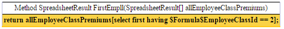

*Index operator applied on array of SpreadsheetResults*

where the spreadsheet result element of allEmployeeClassPremiums array is calculated from the following spreadsheet table:

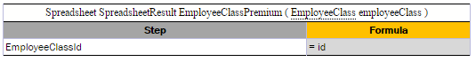

*Spreadsheet for allEmployeeClassPremiums array result calculation*

##### Advanced Usage of Array Index Operators

Consider a case when the name of the array element needs to be referred explicitly in condition or expression. For example, the policy has a collection of drivers of Driver[] data type and a user wants to select all policy drivers of the age less than 19, except for the primary driver. The following syntax with an explicit definition of the `(elementName) `collection element can be used:

`policy.drivers[(elementName) @ elementName != policy.primaryDriver && elementName.age < 19]`

**Note for experienced users:** An expression can be written using the explicit type definition, via the (Datatype x) syntax, and array index operators can be applied to lists. Examples are as follows.
    
    -   List claims = policy.getClaims(); claims[(Claim claim) order by claim.date]
    -   List claims = policy.getClaims(); claims[(Claim claim) ^@ date]

#### Operators and Functions to Work with Arrays

This section describes operators and functions used in work with arrays and includes the following topics:

-   [Length Function](#length-function)
-   [Comparison Operators](#comparison-operators)

For more information on array functions, see [Appendix B: Functions Used in OpenL Tablets](Appendix_B_Functions_Used_in_OpenL_Tablets.md#appendix-b-functions-used-in-openl-tablets).

##### Length Function

The **Length** array function returns the number of elements in the array as a result value. An example is as follows.

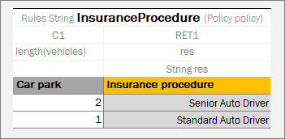

*Rule table with the length function*

In this example, the **Insurance** procedure depends on the number of vehicles. The policy includes vehicles field represented as array.

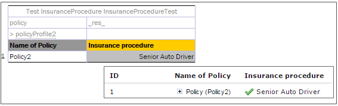

*Test table for rule table with length function*

Policy2 contains two vehicles as illustrated in the following data table.

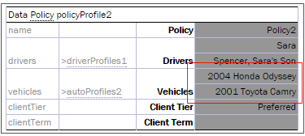

*Data table for a test table*

**Note:** The length function can be used for maps, in the same way as it is used for collections and arrays.

##### Comparison Operators

== and != comparison operators can be applied to arrays. Array elements are compared one-by-one, and for each element pair, if comparison result is true, all array comparison result is true. For more information on operators, see [Operators Used in OpenL Tablets](Appendix_A_BEX_Language_Overview.md#operators-used-in-openl-tablets).

#### Rules Applied to Array

OpenL Tablets allows applying a rule intended for work with one value to an array of values. The following example demonstrates this feature in a very simple way.

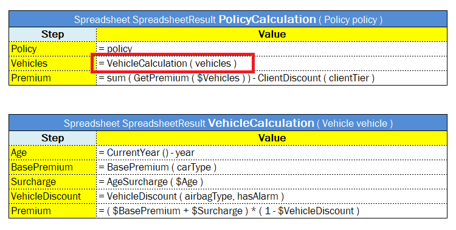

*Applying a rule to an array of values*

The **VehicleCalculation** rule is designed for working with one vehicle as an input parameter and returns one spreadsheet as a result. In the example, this rule is applied to an array of vehicles, which means that it is executed for each vehicle and returns an array of spreadsheet results.

If several input parameters for a rule are arrays where the rule expects only a single value, the rule is separately calculated for each element of these arrays, and the result is an array of the return type. In other words, OpenL Tablets executes the rule for each combination of input values from arrays and return a collection of all these combinations’ results. The order in which these arrays are iterated is not specified.

**Note:** OpenL Tablets engine may run parts of one request in parallel and Dev property `Concurrent Execution` is used to enable or disable this behavior in case when the rule table is applied to an array of value instead of a single value. `Concurrent Execution` is useful for complex rule sets where parallel execution will improve performance for a single request. But note that modifying arguments of the rule are not thread safe.

#### Rules with Variable Length Arguments

If the last input of the table is an array, OpenL Tablets allows passing this array as an array or a set of comma-separated elements.

An example is as follows:

`Spreadsheet Integer RatingFunction(Integer index, String customerName, Double[] rates)`

It can be called as follows:

`RatingFunction(5, "SomeCompany", 10, 12, 14, 13)`

In this example, OpenL recognizes and transforms all last numbers-inputs into a single array of numbers-input.

### Working with Data Types

Data in OpenL Tablets must have a type of data defined. A data type indicates the meaning of the data, their possible values, and instructs OpenL Tablets how to process operations, which rules can be performed, and how these rules and operations affect data.

All data types used in OpenL Tablets can be divided into the following groups:

| Type                               | Description                                                                            |
|------------------------------------|----------------------------------------------------------------------------------------|
| Predefined data types              | Types that exist in OpenL Tablets, can be used, but cannot be modified.                |
| Custom data types and vocabularies | Types created by a user as described in the [Datatype Table](Creating_Tables_for_OpenL_Tablets.md#datatype-table) section. |

This section describes predefined data types that include the following ones:

-   [Simple Data Types](#simple-data-types)
-   [Range Data Types](#range-data-types)
-   [Void Data Type](#void-data-type)

#### Simple Data Types

The following table lists simple data types that can be used in user’s business rules in OpenL Tablets:

| Data type | Description                                                                                                                                                                                                                                             | Examples                                              | Usage in OpenL Tablets                                                                                                                                                                                                                                                                                                                                                                                  |
|-----------|---------------------------------------------------------------------------------------------------------------------------------------------------------------------------------------------------------------------------------------------------------|-------------------------------------------------------|---------------------------------------------------------------------------------------------------------------------------------------------------------------------------------------------------------------------------------------------------------------------------------------------------------------------------------------------------------------------------------------------------------|
| Integer   | Used to work with whole numbers without <br/>fraction points. <br/>The maximum Integer value is 2147483647.                                                                                                                                                       | 8; 45; 12; 356; 2011                                  | Common for representing a variety of numbers, <br/>such as driver’s age, a year, a number of points, and mileage.  |
| Double    | Used for operations with fractional<br/> numbers. Can hold very large <br/>or very small numbers.                                                                                                                                                                 | 8.4; 10.5; 12.8; 12,000.00; <br/>44.416666666666664        | Commonly used for calculating balances or discount <br/>values for representing exchange rates, a monthly income, <br/>and so on. In other words, the dollar or any other <br/>currency value that does not require very high precision <br/>must be of a Double data type. <br/>A good practice is to explicitly round Double values <br/>to a business significative number of decimals after calculation, <br/>at least in end results. |
| String    | Represents text rather than numbers. <br/>String values are comprised of a set of <br/>characters that can contain spaces and numbers. <br/>For example, the word **Chrysler** and the phrase <br/>**The Chrysler factory warranty is valid for 3 years** <br/>are both Strings. | John Smith, London, Alaska, <br/>BMW; Driver is too young. | Represents cities, states, people names, car models, genders, <br/>marital statuses, as well as messages, such as warnings, <br/>reasons, notes, diagnosis, and other similar data.                                                                                                                                                                                                                               |
| Boolean   | Represents only two possible values: <br/>true and false. <br/>For example, if a driver is trained, <br/>the condition is `true`, and the <br/>insurance premium coefficient is 1.5. <br/>If the driver is not trained, the condition <br/>is false, and the coefficient is 0.25.     | true; yes; y; false; no; n                            | Handles conditions in OpenL Tablets. <br/>The synonym for ‘true’ is ‘yes’, ‘y’; for ‘false’ – ‘no’, ‘n’.                                                                                                                                                                                                                                                                                                     |
| Date      | Used to operate with dates.                                                                                                                                                                                                                             | 06/05/2010; 01/22/2014; <br/>11/07/95; 1/1/1991.           | Represents any dates, such as policy effective date, <br/>date of birth, and report date. <br/>If the date is defined as a text cell value, <br/>it is expected in the `<month>/<date>/<year>` format.                                                                                                                                                                                                                 |

Byte, Character, Short, Long, Float, BigInteger, and BigDecimal data types are rarely used in OpenL Tablets, therefore, ranges of values are only provided in the following table. For more information about values, see the appropriate Java documentation.

| Data type | Min                  | Max                 |
|-----------|----------------------|---------------------|
| Byte      | -128                 | 127                 |
| Character | 0                    | 65535               |
| Short     | -32768               | 32767               |
| Long      | -9223372036854775808 | 9223372036854775807 |
| Float     | 1.5\*10-45           | 3.481038            |

There is no range limits for BigInteger and BigDecimal. Using these values can cause performance issues and thus must be avoided.

#### Range Data Types

**Range Data Types** can be used when a business rule must be applied to a group of values. For example, a driver’s insurance premium coefficient is usually the same for all drivers from within a particular age group. In such situation, a range of ages can be defined, and one rule for all drivers from within that range can be created. The way to inform OpenL Tablets that the rule must be applied to a group of drivers is to declare driver’s age as the range data type.

OpenL Tablets supports the following range data types:

| Type        | Description                                                                                                                                                                                                                                                                                                                                                                    |
|-------------|--------------------------------------------------------------------------------------------------------------------------------------------------------------------------------------------------------------------------------------------------------------------------------------------------------------------------------------------------------------------------------|
| IntRange    | Intended for processing whole numbers within an interval, for example, vehicle or driver age for calculation of insurance compensations, <br/>or years of service when calculating the annual bonus. Range borders are stored as Long values.                                                                                                                                       |
| DoubleRange | Used for operations on fractional numbers within a certain interval. <br/>For instance, annual percentage rate in banks depends on amount of deposit which is expressed as intervals: 500 – 9,999.99; 10,000 – 24,999.99.                                                                                                                                                           |
| CharRange   | Used for processing character values within a predefined interval.                                                                                                                                                                                                                                                                                                             |
| DateRange   | Used for processing dates within a predefined interval. Only default date format, such as 01/01/1999 or 01/01/1999 12:12:12, is supported.                                                                                                                                                                                                                                     |
| StringRange | Used for processing string values within a predefined interval. If a string contains numbers, they are treated in a regular way. <br/>For example, for a string range [A1...A3], A2 is within the range, and A22 is out of the range. <br/>StringRange conditions can be defined in smart rules and smart lookups, while in simple rules and simple lookups it is interpreted as String. |

The following illustration provides a very simple example of how to use a range data type. The value of discount percentage depends on the number of orders and is the same for 4 to 5 orders and 7 to 8 orders. A number of cars per order is defined as IntRange data type. For a number of orders from, for example, 6 to 8, the rule for calculating the discount percentage is the same: the discount percentage is 10.00% for BMW, 4.00% for Porsche, and 6.00% for Audi.

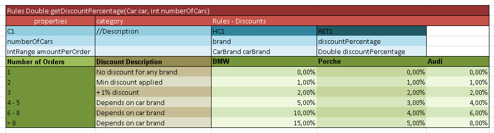

*Usage of the range data type*

Supported range formats are as follows:

| \# | Format                                                                                                                                              | Interval                                                | Example                                     | Values for IntRange                     |
|----|-----------------------------------------------------------------------------------------------------------------------------------------------------|---------------------------------------------------------|---------------------------------------------|-----------------------------------------|
| 1  | `[<min_number>; <max_number>)` <br/>Mathematic definition for ranges using square brackets <br/>for included borders and round brackets for excluded borders. | `[min; max]` `(min; max)` `[min; max)` `(min; max]`     | `[1; 4]` `(1; 4)` `[1; 4)` `(1; 4]`         | `1, 2, 3, 4` `2, 3` `1, 2, 3` `2, 3, 4` |
| 2  | `[<min_number> .. <max_number>) ` <br/>Mathematic definition for ranges with two dots used instead of semicolon.                                         | `[min; max]` `(min; max)` `[min; max)` `(min; max]`     | `[1 .. 4]` `(1 .. 4)` `[1 .. 4)` `(1 .. 4]` | `1, 2, 3, 4` `2, 3` `1, 2, 3` `2, 3, 4` |
| 3  | `[<min_number> - <max_number>)` <br/>Mathematic definition for ranges with a hyphen used instead of a semicolon.                                       | `[min - max]` `(min - max)` `[min - max)` `(min - max]` | `[1 - 4]` `(1 - 4)` `[1 - 4)` `(1 - 4]`     | `1, 2, 3, 4` `2, 3` `1, 2, 3` `2, 3, 4` |
| 4  | `<min_number> – <max_number>`                                                                                                                       | `[min; max]`                                            | `1 - 4` `-2 - 2` `-4 - -2`                  | `[1; 4]` `[-2; 2]` `[-4; -2]`           |
| 5  | `<min_number> .. <max_number>`                                                                                                                      | `[min; max]`                                            | `1 .. 4`                                    | `1, 2, 3, 4`                            |
| 6  | `<min_number> … <max_number>`                                                                                                                       | `(min; max)`                                            | `1 … 4`                                     | `2, 3`                                  |
| 7  | `<<max_number>`                                                                                                                                     | `[-∞; max)`                                             | `<2`                                        | `-∞ …, -1, 0, 1`                        |
| 8  | `<=<max_number>`                                                                                                                                    | `[-∞; max]`                                             | `<=2`                                       | `-∞ …, -1, 0, 1, 2`                     |
| 9  | `><min_number>`                                                                                                                                     | `(min; +∞]`                                             | `>2`                                        | `3, 4, 5, … +∞`                         |
| 10 | `>=<min_number>`                                                                                                                                    | `[min; +∞]`                                             | `>=2`                                       | `2, 3, 4, 5, … +∞`                      |
| 11 | `><min_number> <<max_number>` `<<max_number> ><min_number>`                                                                                         | `(min; max)`                                            | `>1 <4` `<4 >1`                             | `2, 3` `2, 3`                           |
| 12 | `>=<min_number> <<max_number>` `<<max_number> >=<min_number>`                                                                                       | `[min; max)`                                            | `>=1 <4` `<4 >=1`                           | `1, 2, 3` `1, 2, 3`                     |
| 13 | `><min_number> <=<max_number>` `<=<max_number> ><min_number>`                                                                                       | `(min; max]`                                            | `>1 <=4` `<=4 >1`                           | `2, 3, 4` `2, 3, 4`                     |
| 14 | `>=<min_number> <=<max_number>` `<=<max_number> >=<min_number>`                                                                                     | `[min; max]`                                            | `>=1 <=4` `<=4 >=1`                         | `1, 2, 3, 4` `1, 2, 3, 4`               |
| 15 | `<min_number>+`                                                                                                                                     | `[min; +∞]`                                             | `2+`                                        | `2, 3, 4, 5, … +∞`                      |
| 16 | `<min_number> and more`                                                                                                                             | `[min; +∞]`                                             | `2 and more`                                | `2, 3, 4, 5, … +∞`                      |
| 17 | `more than <min_number>`                                                                                                                            | `(min; +∞]`                                             | `more than 2`                               | `3, 4, 5, … +∞`                         |
| 18 | `less than <max_number>`                                                                                                                            | `[-∞; max)`                                             | `less than 2`                               | `-∞ …, -1, 0, 1`                        |

The following rules apply:

-   Infinities in IntRange are represented as `Integer.MIN_VALUE` for -∞ `and Integer.MAX_VALUE` for +∞.
-   Using of ".." and "..." requires spaces between numbers and dots.
-   Numbers can be enhanced with the `$` sign as a prefix and `K`, `M`, `B` as a postfix, for example, `$1K = 1000`.
-   For negative values, use the ‘`-`’ (minus) sign before the number, for example, `-<number>`.

#### Void Data Type

**Void** is a special type that represents the absence of a value or lack of a specific type. It is often used as a return type for functions that do not return a value or as a placeholder for empty parameters in function declarations. Essentially, **void** signifies that there is no data or value associated with it. 

In rules, use the **void** type when a rule must be executed but no value is expected to be returned.

### Working with Functions

Data types are used to represent user data in the system. Business logic in rules is implemented using **functions**. Examples of functions are the **Sum** function used to calculate a sum of values and **Min/Max** functions used to find the minimum or maximum values in a set of values.

This section describes OpenL Tablets functions and provides simple usage examples. All functions can be divided into the following groups:

-   math functions
-   array processing functions
-   date functions
-   String functions
-   error handling functions

The following topics are included in this section:

-   [Understanding OpenL Tablets Function Syntax](#understanding-openl-tablets-function-syntax)
-   [Understanding Math Functions](#understanding-math-functions)
-   [Understanding Date Functions](#understanding-date-functions)
-   [Understanding Special Functions and Operators](#understanding-special-functions-and-operators)
-   [Null Elements Usage in Calculations](#null-elements-usage-in-calculations)

#### Understanding OpenL Tablets Function Syntax

This section briefly describes how functions work in OpenL Tablets.

Any function is represented by the following elements:

-   function name or identifier, such as **sum**, **sort**, **median**
-   function parameters
-   value or values that the function returns

For example, in the `max(value1, value2)` expression, **max** is the rule or function name, **(value1, value2)** are function parameters, that is, values that take part in the action. When determining **value1** and **value2** as 50 and 41, the given function looks as `max(50, 41)` and returns **50** in result as the biggest number in the couple.

If an action is performed in a rule, use the corresponding function in the rules table. For example, to calculate the best result for a gamer in the following example, use the **max** function and enter *max(score1, score2, score3)* in the **C1** column. This expression instructs OpenL Tablets to select the maximum value in the set. The **contains** function can be used to determine the gamer level.

Subsequent sections provide description for mostly often used OpenL Tablets functions. For a full list of functions, see [Appendix B: Functions Used in OpenL Tablets](Appendix_B_Functions_Used_in_OpenL_Tablets.md#appendix-b-functions-used-in-openl-tablets).

#### Understanding Math Functions

Math functions serve for performing math operations on numeric data. These functions support all numeric data types described in [Working with Data Types](#working-with-data-types).

The following example illustrates how to use functions in OpenL Tablets. The rule in the diagram defines a gamer level depending on the best result in three attempts.

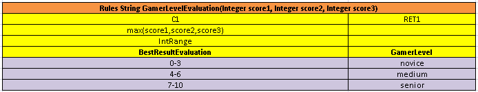

*An example of using the ‘max’ function*

The following topics are included in this section:

-   [Math Functions Used in OpenL Tablets](#math-functions-used-in-openl-tablets)
-   [Round Function](#round-function)

##### Math Functions Used in OpenL Tablets

The following table lists math functions used in OpenL Tablets:

| Function    | Description                                                                                                                                                                                                                                                                                                                                   |
|-------------|-----------------------------------------------------------------------------------------------------------------------------------------------------------------------------------------------------------------------------------------------------------------------------------------------------------------------------------------------|
| **min/max** | Returns the smallest or biggest element in a set of elements of comparable type for an array or multiple values. <br/>The result type depends on the entry type. min/max(element1, element2, …) `min/max(array[])` <br/>For example, if Date1= 01/02/2009 and Date2= 03/06/2008 are variables of the Date type, `max(Date1, Date2)` returns 01/02/2009. |
| **sum**     | Adds all numbers in the provided array and returns the result as a number. `sum(number1, number2, …)` `sum(array[])`                                                                                                                                                                                                                          |
| **avg**     | Returns the arithmetic average of array elements. The function result is a floating value. avg(number1, number2, …) avg(array[])                                                                                                                                                                                                              |
| **product** | Multiplies numbers from the provided array and returns the product as a number. product(number1, number2, …) product(array[])                                                                                                                                                                                                                 |
| **mod**     | Returns the remainder after a number is divided by a divisor. The result is a numeric value and has the same sign as the devisor. <br/>`mod(number, divisor)` <br/>- `number `is a numeric value which’s remainder must be found. <br/>- `divisor` is the number used to divide the `number`. <br/>If the divisor is **0**, the **mod** function returns an error.      |
| **sort**    | Returns values from the provided array in ascending sort. The result is an array. sort(array[])                                                                                                                                                                                                                                               |
| **round**   | Rounds a value to a specified number of digits. For more information on the ROUND function, see [Round Function](#round-function).                                                                                                                                                                                                            |

##### Round Function

*The* **ROUND function** *is* used to round a value to a specified number of digits. For example, in financial operations, users may want to calculate insurance premium with accuracy up to two decimals. Usually, a number of digits in long data types, such as Double, must be limited. The ROUND function allows rounding a value to a whole number or to a fractional number with limited number of signs after decimal point. In case of rounding to a whole number, for the round(number) and round (number, String) functions, the type of the returned value is always Integer, except for BigDecimal input value which is returned as BigInteger.

The ROUND function syntax is as follows:

| Syntax                     | Description                                                                                                                                                                                                                                                                                                                                                                              |
|----------------------------|------------------------------------------------------------------------------------------------------------------------------------------------------------------------------------------------------------------------------------------------------------------------------------------------------------------------------------------------------------------------------------------|
| `round(number)`            | Rounds to the whole number and returns Integer or BigInteger.                                                                                                                                                                                                                                                                                                                            |
| `round(number,int)`        | Rounds to the fractional number. `int` is a number of digits after decimal point.                                                                                                                                                                                                                                                                                                        |
| `round(number,String)`     | Rounds to the whole number considering the specified rounding mode. The result is Integer or BigInteger. <br/>An example of a string value is `round_DOWN, ROUND_HALF_UP`.                                                                                                                                                                                                                    |
| `round(number,int,int)`    | Rounds to the fractional number and enables to get results different from usual mathematical rules: <br/>- The first `int` stands for a number of digits after decimal point. <br/>- The second `int` stands for a rounding mode represented by a constant, for example, `1- round_DOWN, 4-` `ROUND_HALF_UP`. <br/>The corresponding string value, such as `DOWN`, can be used instead of the second `int`. |
| `round(number,int,String)` | Rounds to the fractional number considering the specified rounding mode.                                                                                                                                                                                                                                                                                                                 |

The following topics are included in this section:

-   [round(number)](#roundnumber)
-   [round(number,int)](#roundnumberint)
-   [round(number,String)](#roundnumberstring)
-   [round(number,int,int)](#roundnumberintint)
-   [round(number,int,String)](#roundnumberintstring)

###### round(number)

This syntax is used to round to a whole number. The following example demonstrates function usage:

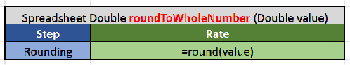

*Rounding to integer*

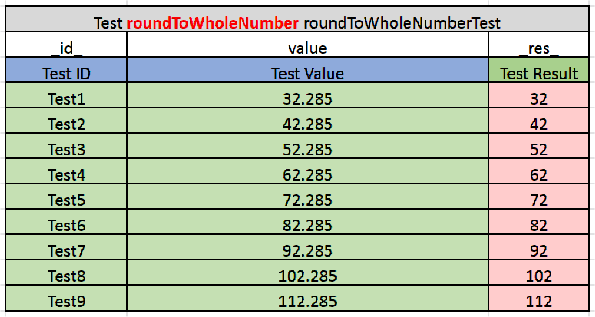

*Test table for rounding to integer*

###### round(number,int)

This function is used to round to a fractional number. The second parameter defines a number of digits after decimal point.

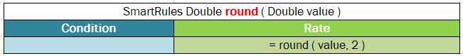

*Rounding to a fractional number*

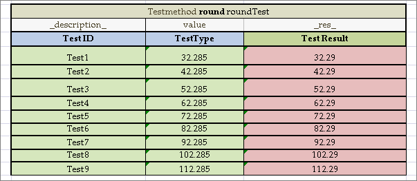

*Test table for rounding to a fractional number*

###### round(number,String)

This syntax is used to round to a whole number, where the String value denotes the rounding mode as described in the following table:

| Mode name   | Description                                                                                                                                |
|-------------|--------------------------------------------------------------------------------------------------------------------------------------------|
| UP          | Rounding mode to round away from zero.                                                                                                     |
| DOWN        | Rounding mode to round towards zero.                                                                                                       |
| CEILING     | Rounding mode to round towards positive infinity.                                                                                          |
| FLOOR       | Rounding mode to round towards negative infinity.                                                                                          |
| HALF_UP     | Rounding mode to round towards the nearest neighbor unless both neighbors are equidistant, in which case round up.                         |
| HALF_DOWN   | Rounding mode to round towards the nearest neighbor unless both neighbors are equidistant, in which case round down.                       |
| HALF_EVEN   | Rounding mode to round towards the nearest neighbor unless both neighbors are equidistant, in which case, <br/>round towards the even neighbor. |
| UNNECESSARY | Rounding mode to assert that the requested operation has an exact result, hence no rounding is necessary.                                  |

An example is as follows:

```
round(32.285,DOWN)=32
```

**Note:** In the code, both CEILING and RoundingMode.CEILING formats are acceptable.

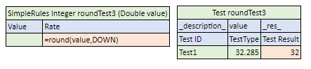

*Usage of the round(number,String) format with the DOWN rounding mode*

###### round(number,int,int)

This function allows rounding to a fractional number and get results by applying different mathematical rules. The following parameters are expected:

-   Number to round
-   The first `int` stands for a number of digits after decimal point.
-   The second `int` stands for a rounding mode represented by a constant, for example, `1`- round\_`DOWN`, `4`- `ROUND_HALF_UP`.

The following table contains a list of the constants and their descriptions:

| Constant | Name        | Description                                                                                                                                |
|----------|-------------|--------------------------------------------------------------------------------------------------------------------------------------------|
| 0        | UP          | Rounding mode to round away from zero.                                                                                                     |
| 1        | DOWN        | Rounding mode to round towards zero.                                                                                                       |
| 2        | CEILING     | Rounding mode to round towards positive infinity.                                                                                          |
| 3        | FLOOR       | Rounding mode to round towards negative infinity.                                                                                          |
| 4        | HALF_UP     | Rounding mode to round towards the nearest neighbor unless both neighbors are equidistant, in which case round up.                         |
| 5        | HALF_DOWN   | Rounding mode to round towards the nearest neighbor unless both neighbors are equidistant, in which case round down.                       |
| 6        | HALF_EVEN   | Rounding mode to round towards the nearest neighbor unless both neighbors are equidistant, in which case, <br/>round towards the even neighbor. |
| 7        | UNNECESSARY | Rounding mode to assert that the requested operation has an exact result, hence no rounding is necessary.                                  |

For more information on the constants representing rounding modes, see [https://docs.oracle.com/en/java/javase/11/docs/api/constant-values.html\#java.math.BigDecimal.ROUND_HALF_DOWN](https://docs.oracle.com/en/java/javase/11/docs/api/constant-values.html#java.math.BigDecimal.ROUND_HALF_DOWN).

For more information on the constants with examples, see <https://docs.oracle.com/en/java/javase/11/docs/api/java.base/java/math/class-use/RoundingMode.html>, *Enum Constant Details* section.

The following example demonstrates how the rounding works with the DOWN constant.

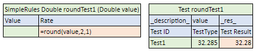

*Usage of the round(number,int,int/String) format with the DOWN rounding mode*
  

###### round(number,int,String)

This function allows rounding to a fractional number and get results by applying different mathematical rules. The following parameters are expected:

-   Number to round
-   `int` stands for a number of digits after decimal point.
-   `String` stands for a rounding mode as described in [round(number,String)](#roundnumberstring).

An example is as follows:

```
round(32.285, 2, DOWN)=32.28
```

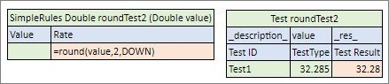

*Usage of the round(number,int,int/String) format with the DOWN rounding mode*

#### Understanding Date Functions

OpenL Tablets supports a wide range of date functions that can be applied in the rule tables. The following date functions return an Integer data type:

| Function        | Description                                                                                                                                                                                         |
|-----------------|-----------------------------------------------------------------------------------------------------------------------------------------------------------------------------------------------------|
| **absMonth**    | Returns the number of months since AD. <br/>`absMonth(Date)`                                                                                                                                             |
| **absQuarter**  | Returns the number of quarters since AD as an integer value. <br/>`absQuarter(Date)`                                                                                                                     |
| **Date**  | Returns the date. The following options are available:<br/> - Date(year, month, day, hours, minutes)<br/> - Date(year, month, day, hours, minutes, seconds)<br/> - Date(year, month, day, hours, minutes, seconds, milliseconds)                                                                                                                      |
| **dayOfWeek**   | Takes a date as input and returns the day of the week on which that date falls. <br/>Days in a week are numbered from 1 to 7 as follows: 1=Sunday, 2=Monday, 3 = Tuesday, and so on. <br/>`dayOfWeek(Date d)` |
| **dayOfMonth**  | Takes a date as input and returns the day of the month on which that date falls. Days in a month are numbered from 1 to 31. <br/>`dayOfMonth(Date d)`                                                    |
| **dayOfYear**   | Takes a date as input and returns the day of the year on which that date falls. Days in a year are numbered from 1 to 365. <br/>`dayOfYear(Date d)`                                                      |
| **hour**        | Returns the hour of the day in 12 hour format for an input date. <br/>`hour(Date d)`                                                                                                                     |
| **hourOfDay**   | Returns the hour of the day in 24 hour format for an input date. <br/>`hourOfDay(Date d)`                                                                                                                |
| **isLeap**   | Identifies whether the year is a leap year. The following options are available: <br/> - isLeap(Date) - checks whether the provided date is in the leap year.<br/> - isLeap(Integer) - checks whether the provided year is a leap year.                                                                                                              |
| **minute**      | Returns a minute (0 to 59) for an input date. <br/>`minute(Date d)`                                                                                                                                      |
| **second**      | Returns a second (0 to 59) for an input date. <br/>`second(Date d)`                                                                                                                                      |
| **setTime**      | Sets time or date. The following options are available:<br/> - setTime(Date, hours, minutes) - sets time in **hh:mm:xx.xxx** without changing the date.<br/> - setTime(Date, hours, minutes, seconds) - sets time in **hh:mm:ss.xxx** without changing the date.<br/> - setTime(Date, hours, minutes, seconds, milliseconds)- sets time in **hh:mm:ss.ccc** without changing the date.<br/> - setDate(Date, year, month, day)- sets the date in **yyyy-mm-dd** without changing the time.                                                                                                                                     |
| **weekOfMonth** | Takes a date as input and returns the week of the month within which that date is. Weeks in a month are numbered from 1 to 5. <br/>`weekOfMonth(Date d)`                                                 |
| **weekOfYear**  | Takes a date as input and returns the week of the year on which that date falls. Weeks in a year are numbered from 1 to 54. <br/>`weekOfYear(Date d)`                                                    |

The following date function returns a String data type:

| Function         | Description                                                  |
|------------------|--------------------------------------------------------------|
| **amPm(Date d)** | Returns `Am` or `Pm` value for an input date. `amPm(Date d)` |

The following figure displays values returned by date functions for a particular input date specified in the **MyDate** field.

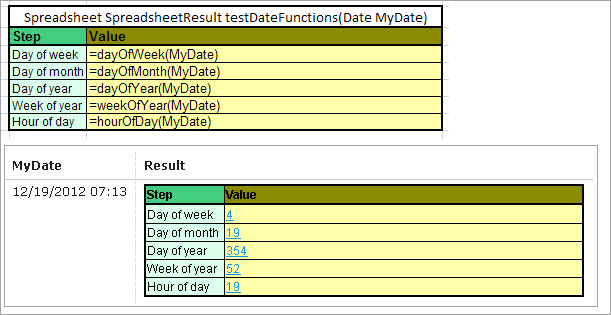

*Date functions in OpenL Tablets*

The following decision table provides a very simple example of how the `dayOfWeek` function can be used when the returned value, **Risk Factor**, depends on the day of the week.

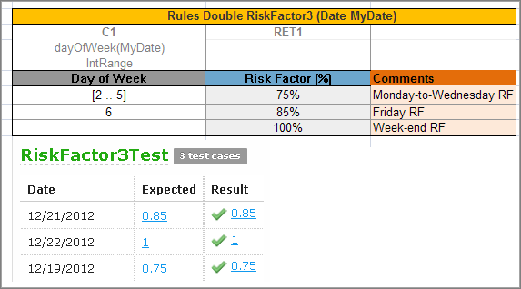

*A risk factor depending on a day of the week*

#### Understanding Special Functions and Operators

OpenL Tablets supports a variety of different special functions and syntax to make rules creation easier and more convenient for business users.

The following topics are included in this section:

-   [Error Function](#error-function)
-   [Ternary Operator](#ternary-operator)
-   [Performing Operations via Formula](#performing-operations-via-formula)
-   [Pattern-Matching Function](#pattern-matching-function)

##### Error Function

The **ERROR** function is used to handle exceptional cases in a rule when an appropriate valid returned result cannot be defined. The function returns a message containing problem description instead and stops processing. The message text is specified as the error function parameter.

In the following example, if the value for a coverage limit of an insurance policy exceeds 1000\$, a rule notifies a user about wrong limit value and stops further processing.

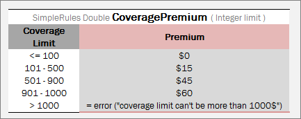

*Usage of the ERROR function*

Alternatively, a custom error with custom error message can be defined as arguments using the `error(String code, String message)` function. The expected REST response is as follows:
  
```
{
    "code": "cd01",
    "message": "User message"
}
```
  

##### Ternary Operator

**?:** is a ternary operator that is a part of the syntax for simple conditional expressions. It is commonly referred to as the conditional operator, inline if (iif), or ternary if.

Formula `(expression) ? (value1) : (value2) `returns value1 if condition expression is true, otherwise, value2.

:(value2) part is optional. If it is not defined, null is returned if the condition is false.

An example of a ternary operator is as follows:

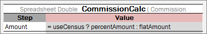

*Ternary operator example*

In if-then expression, this example stands for the following:

If (useCensus == true) then { Amount step value = percentAmount} else { Amount step value = flatAmount}.

For more information on ternary operators, see <https://en.wikipedia.org/wiki/Ternary_operation>.

To create more complex conditional expressions, use decision tables.

##### Performing Operations via Formula

A user can write several operations in a cell’s formula or in expression statement of the Decision table by separating each operation with the ‘;’ sign. The result of the last operation is defined as a returned value of the cell as follows:

`‘= Expression1; Expression2; …; ResultedExpression`

In practice, it is widely used when a user needs to store calculated values in the input object fields by using the following syntax:

`‘= field = value`

or

`‘= field1 = value1; field2 = value2 …; ResultedExpression`

In the following example, the **Age** step calculates the age and stores the result in the **vehicleAge** field of the input object **vehicle**, the **Scoring** step calculates several scoring parameters, stores them in the **scoring** object, and returns the object with updated fields as a result of the step:

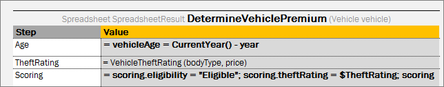

*Example of performing operations via formula*

##### Pattern-Matching Function

A **pattern-matching function** allows verifying whether a string value matches the predefined pattern. For example, for emails, phone numbers, and zip codes the following function can be used:

`like (String str, String pattern)`

The result is a Boolean value indicating whether the string equals the pattern.

The `like` function provides a versatile tool for string comparison. The pattern-matching feature allows a user to match each character in a string against a specific character, a wildcard character, a character list, or a character range. The following table lists the characters allowed in a pattern and describes what they match:

| **Characters in pattern** | **Meaning**                     |
|---------------------------|---------------------------------|
| ?                         | One character.                  |
| \*                        | Zero or multiple characters.    |
| \#                        | One digit.                      |
| @                         | One letter.                     |
| [a-k]                     | One character from the set.     |
| [!v-z]                    | One character not from the set. |
| Pattern+                  | Pattern applied at least once.  |
| [?]                       | Match to '?'.                   |
| [\*]                      | Match to '\*'.                  |
| [\#]                      | Match to '\#'.                  |
| [@]                       | Match to '@'.                   |
| [+]                       | Match to '+'.                   |
| [!]                       | Match to '!'.                   |
| [!!]                      | NOT match to '!'.               |
| [1!]                      | Match to '!' or '1'.            |
| [!1]                      | NOT match to '1'.               |
| [-1-3]                    | Match to '-', '1', '2', '3'.    |

Examples are as follows:

`like(“(29)687-11-53", “(##)###-##-##")` -\> **TRUE**

`like (“(29)87-11-53", “(##)###-##-##")` -\> **FALSE**

`like ("D1010", "[A-D]####")` -\> **TRUE**

`like ("F1010", "[A-D]####")` -\> **FALSE**

#### Null Elements Usage in Calculations

This section describes how null elements (an element with an empty value) are processed in calculations.

For adding and subtracting, `null` is interpreted as `0.`

For multiplying and dividing, it is interpreted as `null`. That is, if `a=3` and `b=null`, `a*b=null`. If `null` must be interpreted as `1`, that is, `a*b=3`, `import org.openl.rules.binding.MulDivNullToOneOperators.*` must be added to the Environment table.

The following diagrams demonstrate this rule.

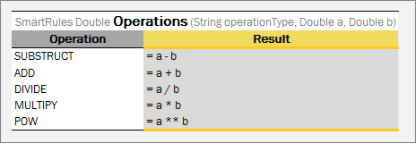

*Rules for null elements usage in calculations*

The next test table provides examples of calculations with null values.

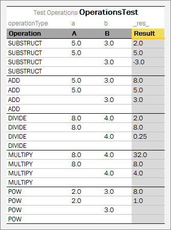

*Test table for null elements usage in calculations*

If all values are **null**, the result is also **null**.

