# OpenL Tablets BRMS Installation Guide


## Preface

**OpenL Tablets** is a Business Rules Management System (BRMS) based on tables presented in the Microsoft Excel documents. Using unique concepts, OpenL Tablets facilitates treating business documents containing business logic specifications as an executable source code.

OpenL Tablets provides a set of tools addressing the BRMS related capabilities including *OpenL Studio* that can be used for creating, testing, and managing business rules and business rule projects, and *OpenL Rule Services* designed for integration of business rules into customer applications.

The OpenL Tablets Installation Guide provides instructions for installing and customizing OpenL Tablets software. The document describes how to install OpenL Tablets under Apache Tomcat, deploy, and set up OpenL Rule Services.

All installation and configuration can be done in the `application.properties` file. For an example of this file with all properties described, see <http://localhost:8080/webstudio/web/config/application.properties> or access it at the index page of the installed Open Studio.

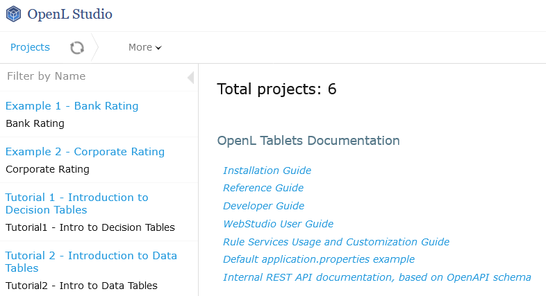

*Accessing the application.properties file example*

This section includes the following topics:

-   [How This Guide Is Organized](#how-this-guide-is-organized)
-   [Audience](#audience)
-   [Related Information](#related-information)
-   [Typographic Conventions](#typographic-conventions)

### How This Guide Is Organized

| Section                                                                                                                                                                                     | Description                                                                                                |
|---------------------------------------------------------------------------------------------------------------------------------------------------------------------------------------------|------------------------------------------------------------------------------------------------------------|
| [Before You Begin](#before-you-begin)                                                                                                                                                      | Lists system requirements for installing and using OpenL Tablets software.                                 |
| [Install OpenL Studio<br/> under Apache Tomcat](#install-openl-studio-under-apache-tomcat)                                                                                                              | Explains how to install OpenL Studio under Apache Tomcat.                                       |
| [Deploy OpenL Rule Services<br/> under Apache Tomcat](#deploy-openl-rule-services-under-apache-tomcat)                                                                           | Designed for rule developers who need to use business rules as separate web services.                      |
| [Install OpenL Studio and OpenL <br/>Tablets Rule Services on JBoss Application Server](#install-openl-studio-and-openl-rule-services-on-jboss-application-server) | Explains how to install OpenL Studio and OpenL Rule Services on JBoss Application Server. |
| [OpenL Studio and <br/>Rule Services Integration](#openl-studio-and-rule-services-integration)                                                               | Explains how to set up OpenL Studio and OpenL Rule Services as an integrated environment. |
| - [Troubleshooting Notes](#troubleshooting) <br/>- [Frequently Asked Questions](#frequently-asked-questions)                                                                                  | Provide useful information related to OpenL Tablets installation.                                         |

### Audience

This guide is mainly targeted at business users and rule experts who define, view, and manage their business rules and rule projects via OpenL Studio. Developers can also use this document to learn how to install and set up OpenL Rule Services.

Basic knowledge of Java and Apache Tomcat is required to use this guide effectively.

### Related Information

The following table lists the sources of information related to contents of this guide:

| Title                                                                                                                                                       | Description                                                                                                   |
|-------------------------------------------------------------------------------------------------------------------------------------------------------------|---------------------------------------------------------------------------------------------------------------|
| [OpenL Studio User Guide](webstudio_user_guide.md) | Describes OpenL Studio, a web application for managing OpenL Tablets projects through web browser. |
| [OpenL Tablets Reference Guide](https://openldocs.readthedocs.io/en/latest/documentation/guides/reference_guide/)                                                                                                                         | Provides overview of OpenL Tablets technology, as well as its basic concepts and principles.                  |
| <https://openl-tablets.org/>                                                                                                                                | OpenL Tablets open source project website.                                                                    |

### Typographic Conventions

The following styles and conventions are used in this guide:

| Convention                 | Description                                                                                                                                                                                                                                                                                                                 |
|----------------------------|-----------------------------------------------------------------------------------------------------------------------------------------------------------------------------------------------------------------------------------------------------------------------------------------------------------------------------|
| **Bold**                   | Represents user interface items such as check boxes, command buttons, dialog boxes, drop-down list values, field names, menu commands, <br/>menus, option buttons, perspectives, tabs, tooltip labels, tree elements, views, and windows. <br/>Represents keys, such as F9 or CTRL+A. <br/>Represents a term the first time it is defined. |
| `Courier`                  | Represents file and directory names, code, system messages, and command-line commands.                                                                                                                                                                                                                                      |
| `Courier Bold`             | Represents emphasized text in code.                                                                                                                                                                                                                                                                                         |
| **Select File \> Save As** | Represents a command to perform, such as opening the File menu and selecting Save As.                                                                                                                                                                                                                                       |
| *Italic*                   | Represents any information to be entered in a field.  Represents documentation titles.                                                                                                                                                                                                                                      |
| \< \>                      | Represents placeholder values to be substituted with user specific values.                                                                                                                                                                                                                                                  |
| Hyperlink                  | Represents a hyperlink. <br/>Clicking a hyperlink displays the information topic or external source.                                                                                                                                                                                                                             |

## Before You Begin

This section lists the system requirements for OpenL Tablets software and introduces OpenL Studio instance properties. The following topics are included:

-   [System Requirements for OpenL Tablets Software](#system-requirements-for-openl-tablets-software)
-   [Common Information about OpenL Studio Instances](#common-information-about-openl-studio-instances)

### System Requirements for OpenL Tablets Software

The following table covers system requirements for installing and running OpenL Tablets software:

| Software          | Requirements description                                                                                                                                                                                                                                                                                      |
|-------------------|---------------------------------------------------------------------------------------------------------------------------------------------------------------------------------------------------------------------------------------------------------------------------------------------------------------|
| Operating systems | One of the following: <br/>• Microsoft Windows 11+ <br/>• Ubuntu 22.4+ <br/>• MacOs 15 <br/>This table lists operating systems on which the OpenL Tablets software is tested and supported. <br/>Note: OpenL Tablets software can potentially run on any operating system that supports Java Virtual Machine.  |
| Browsers          | One of the following: <br/>• Microsoft Edge 131 <br/>• Firefox 128 ESR or later <br/>• Chrome 131+                                                                                                                                                                                                                     |
| Data Bases        | One of the following: <br/>• MySQL 8+ <br/>• MariaDB 10.5+ <br/>• MS SQL Server 2014+ <br/>• Oracle 12c + <br/>• PostgreSQL 11.2+                                                                                                                                                                                                               |
| Other software    | <br/>Java v11/21 <br/>Apache Tomcat 9 <br/>Jetty 10                                                                                                                                                                                                                  |

**Hardware requirements:** RAM 4 GB minimum. 6 GB is recommended. 1 GHz or faster 32-bit (x86) or 64-bit (x64) processor.

**User rights  requirements:** Administrative permissions are required to install the software under Microsoft Windows or UNIX system.

**Note:** It is highly recommended to avoid using spaces and special characters in paths.

### Common Information about OpenL Studio Instances

This section provides general information about OpenL Studio home directory structure and resources shared among multiple OpenL Studio instances. The following topics are included:

-   [OpenLStudio Home Directory Configuration](#openl-studio-home-directory-configuration)
-   [Starting OpenL Studio in the Cluster Mode](#starting-openl-studio-in-the-cluster-mode)
-   [Sharing webstudio.properties](#sharing-webstudioproperties)
-   [Sharing Project History](#sharing-project-history)
-   [Sharing Project Index](#sharing-project-index)

#### OpenL Studio Home Directory Configuration

When OpenL Studio is run for the first time, by default `${user.home}/.openl `is used as the `openl.home` or `OPENL_HOME` directory where the application is deployed.

This folder contents depends on configuration. Example of its contents is as follows:

`locks`

`repositories` which is a settings folder

`user-workspace` that contains `.locks` folder and folders by users with `.history` folders

`webstudio.properties` file

`cache`

`repositories` that includes `deploy-config` and `design` folders

In case of multiple OpenL Studio instances, a shared file storage can be defined. The `openl.home.shared` folder must be defined in the `application.properties` file before launching OpenL Studio for the first time.

An example of the `openl.home.shared` folder contents is as follows:

`locks`

`repositories` which is a settings folder

`user-workspace` that contains the `.locks` folder and folders by users with `.history` folders

`webstudio.properties` file

An example of the `openl.home` folder contents is as follows:

`cache`

`repositories` that includes `deploy-config` and `design` folders and by default can be set to one folder

`users-db,` only for a local h2 database

This option is not available if OpenL Studio is installed using the installation wizard. In this case, `openl.home.shared` is set equal to `openl.home` and it cannot be modified in the installation wizard.

#### Starting OpenL Studio in the Cluster Mode

To start OpenL Studio in the cluster mode, the `openl.home.shared` or `OPENL_HOME_SHARED` property must be defined properly. In the cluster mode, the same file storage can be used for multiple OpenL Studio instances.


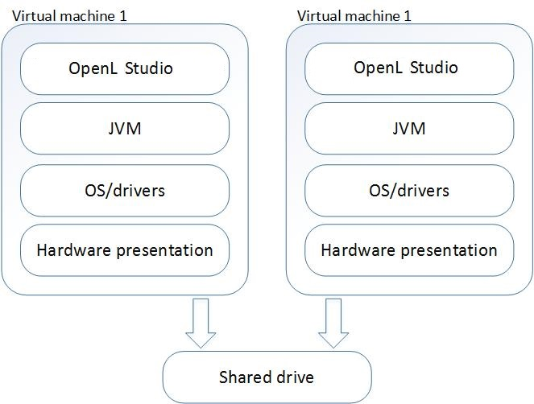 

*Multiple OpenL Studio instances sharing the same drive*

#### Sharing webstudio.properties

`webstudio.properties` can be shared among multiple instances of OpenL Studio. If the `openl.home.shared` path is added to `application.properties` before starting OpenL Studio, and it differs from the `openl.home` path, a separate folder is created for storing `webstudio.properties` file and administrative settings can be shared among several instances of OpenL Studio that have one `openl.home.shared` path.

`webstudio.properties` contents can be modified by OpenL Studio when saving settings.

#### Sharing Project History

Project history can be shared among multiple instances of OpenL Studio.

It is stored in user workspace, in the `openl.home.shared` folder if set up so before launching OpenL Studio. Thus, users can view project history from different OpenL Studio instances.

#### Sharing Project Index

Project index can be shared among multiple instances of OpenL Studio to support work with the Git non-flat structure repository from different OpenL Studio instances. The `openl-projects.yaml` file that contains a list of projects and their paths is now stored in `repositories\settings\design` of the `openl.home.shared` folder, or `openl.home` if the shared folder is not configured.

## Install OpenL Studio under Apache Tomcat

This section describes how to set up the environment for working with OpenL Tablets software and deploy OpenL Studio under Apache Tomcat and provides information about settings required for proper functioning of the application.

Perform the following steps:

-   [Installing JDK](#installing-jdk)
-   [Installing Apache Tomcat](#installing-apache-tomcat)
-   [Deploying OpenL Studio](#deploying-openl-studio)
-   [Configuring External User Database](#configuring-external-user-database)
-   [Setting Up OpenL Studio with Installation Wizard](#setting-up-openl-studio-with-installation-wizard)
-   [Integration with External Identify Providers](#integration-with-external-identity-providers)
-   [OpenL Studio Customization](#openl-studio-customization)

### Installing JDK

To install JDK, perform the following steps:

1. Download JDK.

	Options are as follows:
	
	-   Download OpenJDK 21 available at <https://adoptium.net/>.
	-   Download OpenJDK 11 or later from <https://adoptium.net/temurin/releases/> to the target directory.
	
	Further in the document, this catalog is referred to as `<JAVA_HOME>`.

	!!! note
		It is highly recommended to avoid installing Java in the default Program Files directory because it can cause problems due to space characters in the path to the folder.

	For more information on the installation, see <https://adoptium.net/installation/>.

1. Install JDK according to the instructions.  
	Now the environment variable `JAVA_HOME` must be set to the pathname of the directory where JDK is installed. 
	1. For MS Windows, set the environment variable `JAVA_HOME` as follows:
	2. To open the **System Properties** window, press **\<Windows\> + \<Pause\>** or right click the **My Computer** icon and in the pop-up menu, select **Properties**.
	3. In the **Advanced** tab, click **Environment Variables**.
	4. In the **System variables** area, click **New**.
	5. In the **Variable** name field, enter *JAVA_HOME.*
	6. In the **Variable** value field, enter the path to the directory where JDK is installed, for example, `C:\Java\jdk-21`.
	7.  Click **OK** to complete.

8. For Unix/Linux environments, assuming the target directory is `/usr/lib/jvm/jdk-21`, to set up the environment variable `JAVA_HOME` for a single user, proceed as follows:
	9.  Log in to the account and open `.bash_profile:nano ~/.bash_profile`.
	10. Add the following line
		
		`export JAVA_HOME=/usr/lib/jvm/jdk-21`.

	11. Add or correct the system PATH as follows:
	
		`export PATH=$PATH:$JAVA_HOME/bin`
	
	12. To save, press **CTRL+O** and then press **CTRL+X** to exit.
	
13. For Unix/Linux environments, assuming the target directory is `/usr/lib/jvm/jdk-21`, to set up the environment variable `JAVA_HOME` for all users, proceed as follows:
	14. Log in as root and open the `nano /etc/profile` profile.
	15. Add the following line:
	
		`export JAVA_HOME=/usr/lib/jvm/jdk-21`.
	
	16. Add or correct the system PATH as follows:
	
		`export PATH=$PATH:$JAVA_HOME/bin`.

### Installing Apache Tomcat

Apache Tomcat can be installed from a ZIP file or using Windows Service Installer. The following topics are included in this section:

-   [Installing Apache Tomcat on Windows](#installing-apache-tomcat-on-windows)
-   [Installing Apache Tomcat on UNIX / Linux Machine](#installing-apache-tomcat-on-unix-linux-machine)

#### Installing Apache Tomcat on Windows

This section describes how to install Apache Tomcat on Windows and includes the following topics:

-   [Installing Apache Tomcat from Zip File](#installing-apache-tomcat-from-zip-file)
-   [Installing Apache Tomcat Using Windows Service Installer](#installing-apache-tomcat-using-windows-service-installer)

##### Installing Apache Tomcat from Zip File

To install Apache Tomcat 9.0.x, proceed as follows:

1.  Open Apache Tomcat home page at <http://tomcat.apache.org/index.html>.
2.  In the left-hand **Download** menu, click the latest available Tomcat version.
3.  Locate the **Binary Distributions** area and in the **Core** list, click on the ZIP file corresponding to the required Windows version.
4.  Save the ZIP file in a temporary directory.
5.  Extract the downloaded ZIP file into the target folder on the computer.

	This folder is referred to as `<TOMCAT_HOME> `further in this document.

1.  For Tomcat web server 9.0, to configure JVM options, open the `TOMCAT_HOME/conf/server.xml `file and add the `URIEncoding="UTF-8"` attribute for all `<Connector>` elements.

	For example:

	```
	<Connector port="8080" protocol="HTTP/1.1" connectionTimeout="20000" redirectPort="8443" URIEncoding="UTF-8"/>
	```

##### Installing Apache Tomcat Using Windows Service Installer

This section describes how to install Apache Tomcat using Windows Service Installer.

!!! note
	It is not recommended to select this type of installation if planning to edit rule tables in Excel files from OpenL Studio as described in [OpenL Studio User Guide > Modifying Tables](https://openldocs.readthedocs.io/en/latest/documentation/guides/webstudio_user_guide/#modifying-tables) section. This type of installation requires additional setup. To solve this issue, contact your OpenL Tablets administrator.

!!! note
	For OpenL Tablets administrator: to enable editing rule tables in Excel files from OpenL Studio, enable the **Allow** service to interact with desktop Tomcat service option using MMC or from the command line.

Proceed as follows:

1.  Navigate to the Apache Tomcat site at <http://tomcat.apache.org/index.html> and in the left-hand **Download** menu, click the latest available Tomcat version.
2.  Locate the **Binary Distributions** area and in the **Core** list, click the [32-bit/64-bit Windows Service Installer](https://tomcat.apache.org/download-90.cgi) link.

	Save the apache-tomcat exe file in a temporary folder.

1.  Run the exe file and follow the instructions of the installation wizard.
2.  Click **Next**.
3.  In the **License Agreement** window, click **I Agree**.
4.  In the **Choose Components** dialog, leave the default **Normal** type of installation.

	Experienced Tomcat users can select another installation type in the drop-down list.

1.  In the **Configuration** dialog, proceed with default values.
2.  In the next window, review the folder where Tomcat will be installed, the **Destination Folder**.

	This folder is referred to as `<TOMCAT_HOME> `further in this document.

1.  Click **Install** to start the installation.
2.  Click **Finish** to complete.

	As a result, Apache Tomcat is installed and started on the user’s computer. In the **Notification Area** located next to the clock, the  icon appears. Tomcat is managed by using this icon or from the **Start** menu.

1.  To configure JVM options for Tomcat, in the **Notification** area, right click the **Apache Tomcat** icon and select **Configure;** or click **Start \> All Programs \> Apache Tomcat 9.0 \> Configure Tomcat**.

	The Apache Tomcat Properties dialog appears.

1.  Click the **Java** tab and in the **Java Options** text box, add the following lines:
	```
	-Xms512m
	-Xmx2000m
	-XX: +UseConcMarkSweepGC
	-XX:PermSize=128m
	-XX:MaxPermSize=512m
	```

	**Note:** Every option must be manually entered in a separate row.

1.  Click **Apply** and then click **OK**.
2.  To restart Tomcat, in **Notification Area**, right click the Tomcat icon and select **Stop service**.

	The Tomcat icon changes to .

1.  Select **Start Service**.

	Alternatively, Tomcat can be restarted from the **General** tab in the **Apache Tomcat Properties** window which appears after selecting **Start \> All Programs \> Apache Tomcat 9.0 \> Configure Tomcat**.

From this point, OpenL Studio can be run as described in [Deploying OpenL Studio](#deploying-openl-studio).

#### Installing Apache Tomcat on UNIX / Linux Machine

This section describes how to install Apache Tomcat on the UNIX or Linux machine and includes the following topics:

-   [Installing Apache Tomcat from Repository](#installing-apache-tomcat-from-repository)
-   [Installing Apache Tomcat from ZIP File](#installing-apache-tomcat-from-zip-file)
-   [Configuring JVM Options for Tomcat on UNIX / Linux Machine](#configuring-jvm-options-for-tomcat-on-unix-linux-machine)

##### Installing Apache Tomcat from Repository

This section describes how to install Apache Tomcat from repository as a service on Ubuntu 12.x.

!!! note
	All commands must be entered into a terminal window using an account with `sudo` privileges.

Proceed as follows:

1.  Open a terminal window and enter the following:

	```
	sudo apt-get install tomcat9
	```

1.  Start Tomcat with the next command:

	```
	sudo /etc/init.d/tomcat9 start
	```

	All necessary folders must be located in `/var/lib/tomcat9`.

1.  To ensure that Tomcat works properly, open the browser and enter *http://localhost:8080*.

	If all is correct, Apache Tomcat displays the welcome page with a message resembling the following:

	**If you're seeing this, you've successfully installed Tomcat. Congratulations!**

	If the 404 error appears, try to restart Tomcat as follows:

	sudo /etc/init.d/tomcat9 restart

	Alternatively, stop Tomcat by entering the following command in command line and then start it as described previously:

	sudo /etc/init.d/tomcat9 stop

##### Installing Apache Tomcat from ZIP File

This section describes how to install Apache Tomcat on Ubuntu 12.04 and Centos 6.3. The instructions are valid for other Linux distributions with small changes.

Proceed as follows:

1.  Download the appropriate Tomcat archive file, ZIP or `tar.gz` archive, from its official website <http://tomcat.apache.org/download-90.cgi> to the required user folder.

	In this example, Tomcat 9.0.39 is downloaded to the `/home/myuser `folder.

1.  Open a terminal window and change directory to the folder containing the Tomcat archive.
2.  Extract the archive by entering the following command in the terminal, modifying the Tomcat version as required:

	```
	tar -zxvf apache-tomcat-9.0.39.tar.gz
	```

	The `apache-tomcat-9.0.39 `folder appears. For example:

	```
	/home/myuser/apache-tomcat-9.0.39
	```

1.  Change directory to the `tomcat/bin`:

	```
	cd apache-tomcat-9.0.39/bin
	```

1.  Make sure all `*.sh` files are executable, that is, they have `r` in all positions to the left of the file name, for example, `-rwxr-xr-x`.

	For that, in terminal, enter the following:

	```
	ls –la
	```

	The following information is displayed:

	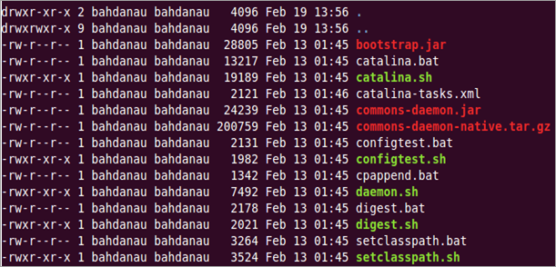

	*OpenL Tablets package is added*

1.  If some `sh` files are not executable, enter the following command:

	```
	chmod +x ./*.sh
	```

1.  Run the `sturtup.sh` file as follows:

	```
	sh ./startup.sh
	```

1.  In the browser, enter the following URL:

	[*http://localhost:8080*](http://localhost:8080)

	If the installation is completed successfully, the Apache Tomcat welcome screen appears. The next thing to be done is to configure JVM options for Tomcat.

##### Configuring JVM Options for Tomcat on UNIX / Linux Machine

To configure JVM options for Tomcat on a UNIX / Linux machine, proceed as follows:

1.  For UNIX, create `TOMCAT_HOME/start.cmd `file and type the following:

	`export JAVA_OPTS="$JAVA_OPTS -Xms512m -Xmx2000m -XX:+` `UseConcMarkSweepGC -XX:PermSize=128m -XX:MaxPermSize=512m"`

1.  Locate the `TOMCAT_HOME/conf/server.xml `file and add the `URIEncoding="UTF-8"` attribute for all `<Connector>` elements.

	For example:

	`<Connector port="8080" protocol="HTTP/1.1" connectionTimeout="20000" redirectPort="8443" URIEncoding="UTF-8"/>`

1.  From this point, deploy OpenL Studio as described in [Deploying OpenL Studio](#deploying-openl-studio).

### Deploying OpenL Studio

This section describes how to deploy and run OpenL Studio under Tomcat.

The following topics are included:

-   [Deploying OpenL Studio on a Windows Machine](#deploying-openl-studio-on-a-windows-machine)
-   [Deploying OpenL Studio on a Linux Machine and Mac](#deploying-openl-studio-on-a-linux-machine-and-mac)

#### Deploying OpenL Studio on a Windows Machine

This section describes how to deploy and run OpenL Studio under Tomcat on a Windows machine.

Proceed as follows:

1.  Go to the <https://openl-tablets.org/downloads> page.
2.  Click the appropriate OpenL Studio WAR link.
3.  Save the file in a temporary folder and then copy the OpenL Studio WAR file.

	For example, `openl-tablets-webstudio-X.X.X.war` to the \<`TOMCAT_HOME>\webapps` folder.

1.  Run Tomcat as follows:
	-   If Tomcat is installed from the ZIP file, in `TOMCAT_HOME\bin,` click the `startup.bat` file`.`
	-   If Tomcat is installed using Windows Service Installer, restart Tomcat as described in [Installing Apache Tomcat Using Windows Service Installer](#installing-apache-tomcat-using-windows-service-installer).

	Tomcat unpacks the WAR file into the `<TOMCAT_HOME>\webapps\<war file name>` folder. For example, for 5.9.4 version the target folder can be `<TOMCAT_HOME>\webapps\openl-tablets-webstudio-5.9.4`. For convenience, the folder can be renamed as needed but remember that this name is used to launch OpenL Studio under Tomcat.

	From this point on, run OpenL Studio with default settings or make additional customizations by changing the user mode and configuring an external user database as described in [OpenL Rule Services Usage and Customization Guide](https://openldocs.readthedocs.io/en/latest/documentation/guides/rule_services_usage_and_customization_guide/).

1.  To run OpenL Studio, in the browser, enter the following URL:

	*http://localhost:8080/\<WAR file name\>*

	That is, for this example, the URL is *http://localhost:8080/openl-tablets-webstudio-5.9.4*.

	OpenL Studio is opened in the browser on the **Welcome to Installation Wizard** page. The wizard will guide through the setup process as described in [Setting Up OpenL Studio with Installation Wizard](#setting-up-openl-studio-with-installation-wizard). When setup is complete, use OpenL Studio to create new projects or download existing ones.

1.  After a new release of the OpenL Studio is installed, click **CTRL**+**F5** or clear cookies and cash manually to reload the page in the browser.

#### Deploying OpenL Studio on a Linux Machine and Mac

To install OpenL Studio under Linux and Mac OS, perform the following steps:

1.  Create the `<OPENL_HOME>` folder where the application will be deployed as follows:

	```
	sudo mkdir /<OPENL_HOME>
	```

1.  Change access rights for this folder by entering the following command in the command line:

	```
	sudo chmod 775 -R /<OPENL_HOME>
	```

1.  Change the owner for this folder:

	```
	sudo chown tomcat9:tomcat9 /<OPENL_HOME>
	```

1.  Download OpenL Studio WAR file from <https://github.com/openl-tablets/openl-tablets/releases/> to a temporary folder.
2.  Copy the downloaded WAR file to the Tomcat `webapps` folder:

	```
	cp /home/myuser/Downloads/<openl-tablets-webstudio-xxxx.war>/home/myuser/<TOMCAT_HOME>/webapps/webstudio.war
	```

1.  To stop Tomcat, run the following command from `/home/myuser/<TOMCAT_HOME>/bin` :

	```
	sh shutdown.sh
	```

1.  Start Tomcat from the same folder as follows:

	```
	sh startup.sh
	```

1.  In the browser, enter *http://localhost:8080/webstudio*.

	If deployment is completed without errors, the OpenL Studio Installation Wizard described in the next step is opened in the browser.

	If encountering any problems, for more information, see the following log files: `home/myuser/<TOMCAT_HOME>/logs/catalina.out `and `home/myuser//<TOMCAT_HOME>/logs/webstudio.log`

### Configuring External User Database

This step is only required if a user is planning to work in multi-user application modes such as Multi-user, Active Directory, SSO: CAS, SSO: SAML, or SSO:OAuth2. For more information, see [Setting Up OpenL Studio with Installation Wizard](#setting-up-openl-studio-with-installation-wizard) and use an external database such as MySQL for managing users in OpenL Studio.

By default, OpenL Studio can run using an internal user database based on the H2 database engine. It is a good idea to use the internal user database for demonstration purposes because it is provided by default and requires no additional setup. But in this case, all user management changes will be lost after server restart.

In a production environment, it is strongly recommended to use an external database.

**Note:** For more information on supported platforms, see <https://openl-tablets.org/>.

The following topics are included:

-   [Adding Drivers and Installing and Configuring the Database](#adding-drivers-and-installing-and-configuring-the-database)
-   [Configuring MySQL Database as External User Storage](#configuring-mysql-database-as-external-user-storage)
-   [Configuring MariaDB Database as External User Storage](#configuring-mariadb-database-as-external-user-storage)
-   [Configuring Oracle Database as External User Storage](#configuring-oracle-database-as-external-user-storage)

#### Adding Drivers and Installing and Configuring the Database

Before configuration, perform the following steps:

1.  Add the appropriate driver library for a database in OpenL Studio to `\WEB-INF\lib\`.

	Alternatively, locate required libraries directly in `\<TOMCAT_HOME>\lib` with other Tomcat libraries.

	|  Database   | Driver                            |
	|-------------|-----------------------------------|
	|  MySQL      | `mysql-connector-j-8.4.0.jar`     |
	|  MariaDB    | `mariadb-java-client-2.7.12.jar`  |
	|  Oracle     | `ojdbc11.jar`                     |
	|  MS SQL     | `mssql-jdbc-12.10.0.jre11.jar`    |
	|  PostgreSQL | `postgresql-42.7.5.jar`           |

	For more information on URL value according to the database type, see the **URL value according to the database type** table in [Setting Up OpenL Studio with Installation Wizard](#setting-up-openl-studio-with-installation-wizard).

1.  Install the database, defining login and password and creating a new schema or service.

	Ensure all database settings are completed.

1.  Start OpenL Studio and in the third step, select a **Multi-user**, **Active Directory,** or **SSO** mode.
2.  Define database URL, username, and password.

	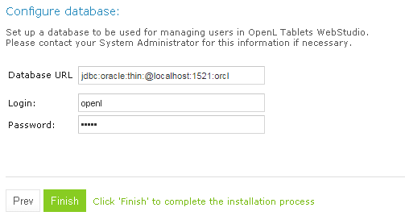

	*Creating a connection to the Oracle database in the installation wizard*

1.  Click **Finish** to close the wizard when the installation is complete.
2.  Log in with credentials of an administrative user defined in the third step of the installation wizard, in the **Configure initial users** section.

	Note that even after configuring the database as user storage, a default user is available for login. The default user can manage user settings in OpenL Studio, for example, create a user or add privileges to a user. All user management activities can be performed via the OpenL Studio UI, in the **Admin** **\> User Management** section.

	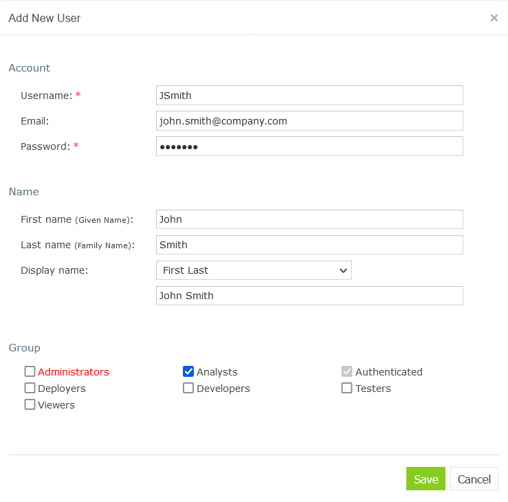

	*Managing users in the User Management section of OpenL Studio*

	Right after applying changes in OpenL Studio, the updates are applied to the database. A user can log in and work under a newly created account in OpenL Studio.

	!!! note
		During installation, several tables are created in the database. If the same tables exist in the database from the previous usage, a conflict occurs. To avoid this situation, the following tables must be removed:
		-   ACCESSCONTROLENTRY
		-   GROUP2GROUP
		-   OPENLUSER
		-   schema_version
		-   USER2GROUP
		-   USERGROUP
		-   HIBERNATE_SEQUENCE table that has `SEQUENCE_OWNER=OPENL`
		-   OPENL_EXTERNAL_GROUPS
		-   OPENL_TAG_TYPES
		-   OPENL_TAGS
		-   OPENL_PROJECTS
		-   OPENL_PROJECT_TAGS
		-   OPENL_TAG_TEMPLATES

#### Configuring MySQL Database as External User Storage

This section explains how to set up a MySQL database. Proceed as follows:

1.  Go to <http://dev.mysql.com/downloads/mysql/>.
2.  Select the appropriate MSI Installer for system configuration and click **Download**.

	For example, **Windows (x86, 32-bit)**, **MSI Installer** may be needed. It is recommended to use **ZIP Archive** version since it is intended for advanced users.

1.  In the next window, register or log in to the MySQL site.

	This step can be skipped, and users can proceed to **No thanks, just start my download!** link.

1.  In the next window, select **Save File** and save the `.msi` file in a target folder.
2.  Navigate to the folder containing the `.msi `file and double click the file to start the installation process.

	The **MYSQL Server Setup Wizard Welcome** window appears.

1.  Follow the wizard steps leaving the default values and clicking **Next** to proceed.
2.  Click **Finish** to close the wizard when installation is complete.

		**Note:** It is recommended to configure the database server to use the UTF-8 character set.

	When MySQL is successfully installed on the user’s computer, an empty database for OpenL Studio in MySQL must be created and permissions to modify this database granted to the user from which the OpenL Studio will work with this database.

1.  To open MySQL Command Line Client, select **Start \> All Programs \> MySQL \> MySQL Server 8.4 \> MySQL Command Line Client** and enter the following commands:

	`CREATE USER openl_user IDENTIFIED BY 'openl_password';`

	`CREATE DATABASE openl CHARACTER SET utf8;`

	`GRANT ALL PRIVILEGES ON openl.* TO openl_user;`

#### Configuring MariaDB Database as External User Storage

This section explains how to set up an MariaDB database. Proceed as follows:

1.  Go to <https://downloads.mariadb.org>.
2.  Select the appropriate version and click **Download**.
3.  Select the appropriate MSI Installer for system configuration and click **Download**.
4.  In the next window, select **Save File** and save the .msi file in a target folder.
5.  Navigate to the folder containing the .msi file and double click the file to start the installation process.

	The **MariaDB Setup Wizard Welcome** window appears.

1.  Follow the wizard steps leaving the default values and clicking **Next** to proceed.
2.  Define password for a **root** user.
3.  Create a database.

	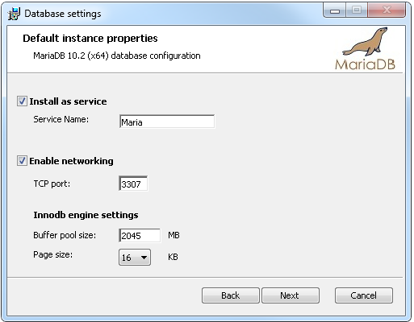

	*Setting properties for the MariaDB database*

1.  Click **Finish** to close the wizard when the installation is complete.
2.  Start HeidiSQL application.
3.  Click **New** to create a session.
4.  Select the **Prompt for credentials** check box and define a database port.

	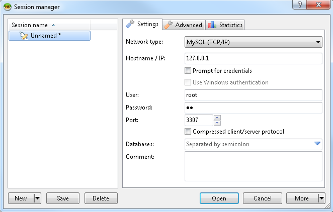

	*Creating a connection to the MariaDB database*

1.  Click **Open** and save the changes.

#### Configuring Oracle Database as External User Storage

This section explains how to set up an Oracle database. Proceed as follows:

1.  Go to <http://www.oracle.com/technetwork/database/enterprise-edition/downloads/index.html>.
2.  After registration, select the appropriate version and system configuration, and click **Download**.
3.  Unzip 2 archives in one folder and click the `exe` file.
4.  Configure the database and define a username and password.

	These values will be used further for configuration.

1.  To improve work with database, download Oracle SQL Developer at <http://www.oracle.com/technetwork/developer-tools/sql-developer/overview/index.html>.

	In this section, as an example, Oracle SQL Developer 3.2.2 is used.

1.  Start Oracle Workbench and create a connection or select an existing database connection.

	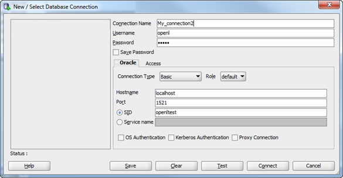

	*Creating a connection to the Oracle database*

1.  Enter username and password values defined when installing the database.

### Setting Up OpenL Studio with Installation Wizard

This topic describes the steps that must be taken after the first run of OpenL Studio under Tomcat. Accept the default options provided by the wizard by clicking **Next** to move to the next step or change the options as required and click **Next** to proceed.

Proceed as follows:

1.  In the **Welcome to OpenL Studio Installation Wizard** window, click **Start**.
2.  In the next window, specify a **working directory** for OpenL Tablets.

	By default, the following directory is displayed:

	```
	${user.home}/.openl
	```

	This folder is referred to as `<OPENL_HOME>` in the documentation. It is highly recommended not to use the system drive for that.

1.  Click **Next** to proceed.
2.  Specify **deployment** and design repositories:

	|  Type                | Description                                                                                                                                                                                                                                                                                                                                                                                                                                                                                                                                                                                                       |
	|---------------------|-------------------------------------------------------------------------------------------------------------------------------------------------------------------------------------------------------------------------------------------------------------------------------------------------------------------------------------------------------------------------------------------------------------------------------------------------------------------------------------------------------------------------------------------------------------------------------------------------------------------|
	|  **Database (JDBC)** | The repository is located in a database installed either local or remote. <br/>The **Repository URL** field displays URL for access to the database.                                                                                                                                                                                                                                                                                                                                                                                                                                                                   |
	|  **Database (JNDI)** | The repository is located in a database installed either locally or remotely. <br/>The **Repository URL** field displays URL for accessing the database. <br/>Configuration settings are located in configuration files of the web server application.                                                                                                                                                                                                                                                                                                                                                                      |
	|  **AWS S3**          | The repository is located in Amazon Simple Storage Service (AWS S3). <br/>A “bucket” is a logical unit of storage in AWS S3 and is globally unique. <br/>Choose a region for storage to reduce latency, costs etc. An **Access key** and a **Secret key** are needed to access storage. <br/>If empty, the system retrieves it from one of the known locations as described in <br/> [AWS Documentation. Best Practices for Managing AWS Access Keys](http://docs.aws.amazon.com/general/latest/gr/aws-access-keys-best-practices.html). <br/>The **Listener period** is the interval in which to check repository changes, in seconds. |
	|  **Git**             | The Git repository is a version control system. <br/>The Git repository can be configured as local or remote. <br/>The **URL** field displays URL for the remotely located Git repository or file path to the repository stored locally. <br/>For more information on connection settings, see [OpenL Studio User Guide](https://openldocs.readthedocs.io/en/latest/documentation/guides/webstudio_user_guide/).                                                                              |

	If deploy configuration must be stored in a separate repository, not in Design repository, the **Use Design Repository** check box must be cleared and required parameter values must be provided.

	The following table explains URL values according to the database type:

	|  Database    | URL value                                                                               |
	|--------------|-----------------------------------------------------------------------------------------|
	|  MySQL       | `jdbc:mysql://[host][:port]/[schema]`                                                   |
	|  MariaDB     | `jdbc:mariadb://[host][:port]/[schema]`                                                 |
	|  Oracle      | `jdbc:oracle:thin:@//[ host][:port]/service`                                            |
	|  MS SQL      | `jdbc:sqlserver://[serverName[\instanceName][:port]][;property=value[;property=value]]` |
	|  PostgreSQL  | `jdbc:postgresql://[host][:port]/[schema]`                                              |

	For more details about how to configure the repository of a specific type, please refer to the corresponding section below:

	-   [Configuring OpenL Studio via JDBC Connection](#configuring-openl-studio-via-jdbc-connection)
	-   [Configuring OpenL Studio via JNDI Connection](#configuring-openl-studio-via-jndi-connection)
	-   [Configuring OpenL Studio via Amazon Simple Storage Service](#configuring-openl-studio-via-amazon-simple-storage-service)
	-   [Connecting to OpenL Studio via Proxy](#connecting-to-openl-studio-via-proxy)

	For more information on repository security, see [OpenL Studio User Guide > Managing Repository Setting](#managing-repository-settings).

1.  Click **Next**.
2.  Select a user mode as described in the following table:

	|  Mode                      | Description                                                                                                                                                                                                                                                                                                 |
	|---------------------------|-------------------------------------------------------------------------------------------------------------------------------------------------------------------------------------------------------------------------------------------------------------------------------------------------------------|
	|  Demo                      | This is a multi-user mode with the list of users predefined in the default database. <br/>The database does not require additional setup. <br/>All changes in the database will be lost after the application restart.                                                                                                |
	|  Single-user               | Only the user currently logged on to the computer can work with the OpenL Studio. <br/>For more information on the single user mode, see [OpenL Studio User Guide](https://openldocs.readthedocs.io/en/latest/documentation/guides/webstudio_user_guide/). |
	|  Multi-user <br/>(recommended)  | Multiple users can run OpenL Studio with their unique names. <br/>OpenL Studio is used to authenticate and manage user credentials/permissions with External database.                                                                                                                                   |
	|  Active Directory          | Multiple users can run OpenL Studio using their unique user names. <br/>Active Directory will be used to authenticate and manage user credentials.                                                                                                                                                    |
	|  SSO: CAS                  | Multiple users can run OpenL Studio using their unique user names. <br/>CAS (Central Authentication Service) server will be used to authenticate and manage user credentials.                                                                                                                         |
	|  SSO: SAML                 | Multiple users can run OpenL Studio using their unique user names. <br/>SAML (Security Assertion Markup Language) supporting Identity Provider server will be used to authenticate and manage user credentials.                                                                                       |
	|  SSO:OAuth2                | Multiple users can run OpenL Studio using their unique user names. <br/>User projects will be located in the './openl-demo/user-workspace/USERNAME' folder. <br/>OAuth2 supporting the identity provider server will be used to authenticate and manage user credentials.                                  |

	For **Active Directory**, **SSO: CAS**, **SSO: SAML,** and **SSO:OAuth2,** user modes proceed as described in [Integration with External Identity Providers](#integration-with-external-identity-providers).

1.  If **Multi-user**, **Active Directory**, **SSO: CAS**, **SSO: SAML**, or **SSO:OAuth2** mode is selected, in the **Configure database** area that appears, modify the database parameters as follows:

	|  Parameter         | Description                                                                                                                               |
	|-------------------|-------------------------------------------------------------------------------------------------------------------------------------------|
	|  Database URL      | Enter the URL for the selected database.                                                                                                  |
	|  Login / Password  | Username and password specified for the database as defined in [Configuring External User Database](#configuring-external-user-database). |

1.  Click **Finish** to complete setup.

	As a result, for the **Demo, Multi-user, Active Directory**, **SSO: CAS**, **SSO: SAML,** and **SSO:OAuth2** modes, the login screen appears for entering user’s credentials to start working with OpenL Studio. If the **openl.home** registry variable is defined, upon OpenL Studio update, after replacing the war file, re-running installation wizard is not required as the fact of configuration is recorded in the system registry. However, if there are multiple instances of OpenL Studio installed on the same computer, OpenL Studio must be run via system properties.

	For a list of users predefined in the **Demo** application mode, see [OpenL Studio User Guide > Managing Users](https://openldocs.readthedocs.io/en/latest/documentation/guides/webstudio_user_guide/#managing-users).

#### Configuring OpenL Studio via JDBC Connection

Configure design and deployment repositories settings on the second step of OpenL Studio installation wizard as follows:

1.  Select **JDBC** as the type of the connection database (JDBC).
2.  Provide **URL** and authentication data.

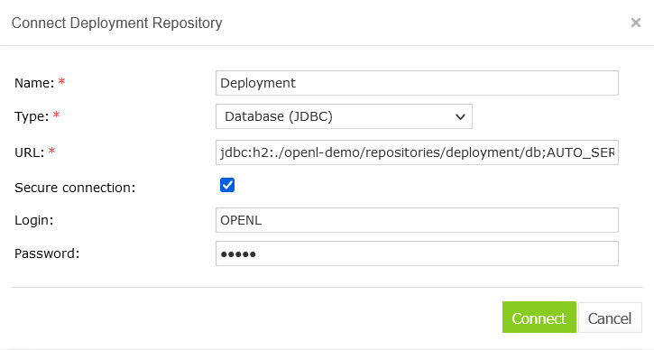

*Setting up a JDBC connection using the installation wizard*

#### Configuring OpenL Studio via JNDI Connection

To configure the OpenL Studio via JNDI connection, perform the following steps:

-   [Configuring Resources for JNDI Context](#configuring-resources-for-jndi-context)
-   [Configuring Settings in OpenL Studio](#configuring-settings-in-openl-studio)

##### Configuring Resources for JNDI Context

Resource settings must be configured before deploying the application. Proceed as follows:

1.  Open the `\conf\context.xml` file in Apache Tomcat and add the `Resource` tag as described in the following examples.

	For the Oracle database, an example is as follows:

	```
	<Resource name=”jdbc/oracleJNDI” auth=”Container”
			type=”javax.sql.DataSource” username=”user” password=”password”
			driverClassName=”oracle.jdbc.OracleDriver” 
			url=”jdbc:oracle:thin:@localhost:1521:orcl”
			maxActive=”8”    
			/> 
	```

	`For the MySQL database, an example is as follows:`

	```
	<Resource name=”jdbc/mysqlJNDI” auth=”Container” type=”javax.sql.DataSource”
			   maxActive=”100” maxIdle=”30” maxWait=”10000”
			   username=”javauser” password=”javadude” driverClassName=”com.mysql.jdbc.Driver”
			   url=”jdbc:mysql://localhost:3306/javatest”
			   />
	```

	`For the MS SQL database, an example is as follows:`

	```
	<Resource name=”jdbc/mssqlJNDI” auth=”Container”
			type=”javax.sql.DataSource” username=”wally” password=”wally”
			driverClassName=”com.microsoft.sqlserver.jdbc.SQLServerDriver” 
			url=”jdbc:sqlserver://localhost;DatabaseName=mytest;SelectMethod=cursor;”
			maxActive=”8” 
			/>
	For the PostrgeSQL database, an example is as follows:
	<Resource name=”jdbc/postgres” auth=”Container”
			type=”javax.sql.DataSource” username=”postgres” password=”Password1”
			driverClassName=”org.postgresql.Driver” 
			url=”jdbc:postgresql://localhost:5432/postgres”
			maxActive=”8” 
			/>
	```

1.  Save the `context.xml` file.

##### Configuring Settings in OpenL Studio

Configure design and deployment repositories settings on the second step of OpenL Studio installation wizard as follows:

1.  Select **JNDI** as the type of the connection database.
2.  Enter a URL in the `java:comp/env/<resource name>` format.

	Definition of the authentication data, that is, login and password, is not required in the installation wizard because this information is set in `context.xml` file already.

	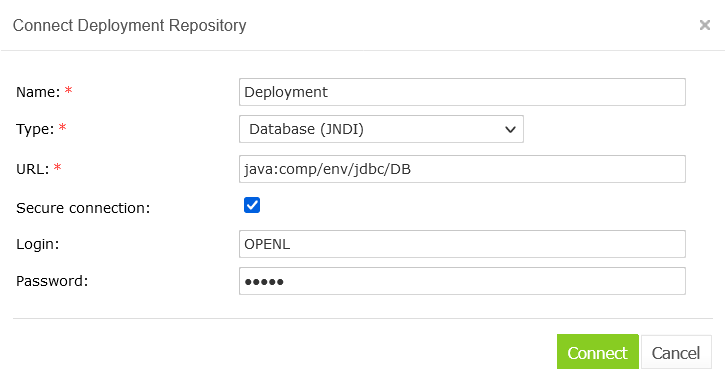

	*Setting up JNDI connection with installation wizard*

#### Configuring OpenL Studio via Amazon Simple Storage Service

Configure design and deployment repositories settings on the second step of OpenL Studio installation wizard as follows:

1.  Select **AWS S3** as the type of connection.
2.  Specify the following information:

	|  Parameter             | Description                                                                                                                                                                                       |
	|-----------------------|---------------------------------------------------------------------------------------------------------------------------------------------------------------------------------------------------|
	|  Bucket name           | Enter the name of the bucket in which your data resides.                                                                                                                                          |
	|  Region name           | Select the name of the AWS region in which your bucket resides. <br/>For non-AWS S3 repositories, any value can be specified. <br/>This value cannot be omitted as it is required by the API specification. |
	|  Access key            | Enter your Amazon AWS access key.                                                                                                                                                                 |
	|  Secret key            | Enter your Amazon AWS secret access key.                                                                                                                                                          |
	|  Listener period (sec) | The time, in seconds, to wait for the Amazon server to respond.                                                                                                                                   |
	|  Endpoint              | Leave empty for a standard AWS S3 connection. <br/>To connect to the non-standard AWS S3 alternative repository, specify the endpoint.                                                                 |

#### Connecting to OpenL Studio via Proxy

The following diagram illustrates how to connect to OpenL Studio via proxy.

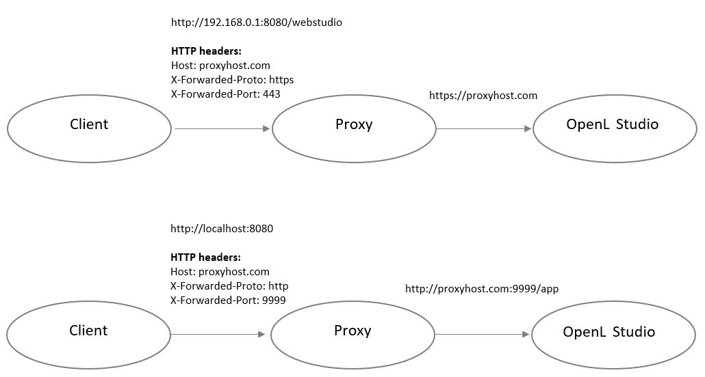

*Connecting to OpenL Studio via proxy*

### Integration with External Identity Providers

To enhance sign in options for users, a third-party authentication can be established between organization authentication systems and OpenL Studio. After enabling third-party authentication, users can sign into OpenL Tablets using their organizational credentials.

The following topics are included in this section:

-   [User Management](#user-management)
-   [Configuring Authentication via Active Directory](#configuring-authentication-via-active-directory)
-   [Configuring Single Sign On via CAS](#configuring-single-sign-on-via-cas)
-   [Configuring Single Sign On via SAML Server](#configuring-single-sign-on-via-saml-server)
-   [Configuring Single Sign On via OAuth2](#configuring-single-sign-on-via-oauth2)

#### User Management

OpenL Studio allows selecting where user permissions are managed in the case of integration with external identity providers. First of all, administrative users must be defined in the **Configure initial users** section that appears in the third step of the installation wizard. Proceed as follows:

1.  Provide at least one user to be granted administration privileges in the **Administrators** field.
2.  Select the **All authenticated users have View access** check box to grant viewer privileges by default.

	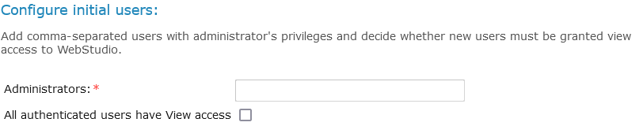

	*Configuring initial users*

#### Configuring Authentication via Active Directory

This section explains how to set up authentication via Active Directory. Proceed as follows:

1.  Specify Active Directory domain, URL, user filter, and group filter.
2.  To verify connection to Active Directory, enter credentials of the existing Active Directory user and click **Check Connection**.

	*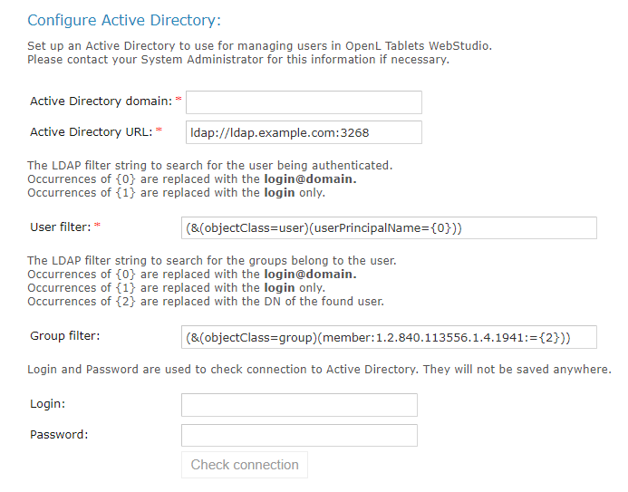*

	*Configuring authentication via Active Directory*

#### Configuring Single Sign On via CAS

This section explains how to set up authentication via CAS.

Define the following parameters:

| Parameter                      | Description                                                                                         |
|--------------------------------|-----------------------------------------------------------------------------------------------------|
| **OpenL Studio server URL**    | URL for OpenL Studio.                                                                    |
| **CAS server URL**             | URL for the selected CAS server.                                                                    |
| **Attribute for First Name**   | CAS attribute for the first name. <br/>Keep it blank if the CAS server does not return this attribute.   |
| **Attribute for Second Name**  | CAS attribute for the second name. <br/>Keep it blank if the CAS server does not return this attribute.  |
| **Attribute for Display Name** | CAS attribute for the display name. <br/>Keep it blank if the CAS server does not return this attribute. |
| **Attribute for Email**        | CAS attribute for the email. <br/>Keep it blank if the CAS server does not return this attribute.        |
| **Attribute for Groups**       | CAS attribute for groups. <br/>Keep it blank if the CAS server does not return this attribute.           |

!!! note
	Contact CAS server administrator for attribute names information.

*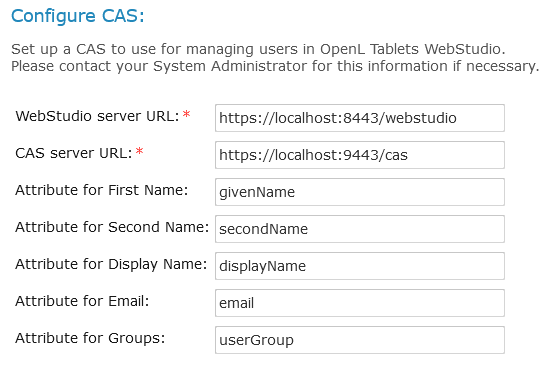*

*Configuring CAS*

#### Configuring Single Sign On via SAML Server

This section describes single sign on configuration via the SAML server and includes the following topics:

-   [Configuring SAML via the Installation Wizard](#configuring-saml-via-the-installation-wizard)
-   [Configuring SAML on Azure Kubernetes](#configuring-saml-on-azure-kubernetes)

##### Configuring SAML via the Installation Wizard

This section explains how to set up authentication via the SAML server using the installation wizard.

Define the following parameters:

| Parameter                               | Description                                                                                                                                                                                                                                                                                                                                                                                                                                         |
|-----------------------------------------|-----------------------------------------------------------------------------------------------------------------------------------------------------------------------------------------------------------------------------------------------------------------------------------------------------------------------------------------------------------------------------------------------------------------------------------------------------|
| **Entity ID**                           | Entity identifier. Alternatively, its value can be set for the security.saml.entity-id property, in the webstudio.properties file.<br/>An administrator must add the same entity ID to the clients list on the server which serves as an identity provider instance <br/>before setting it up in OpenL Studio.<br/>Adding the Entity ID parameter allows using several OpenL Studio instances on the same server <br/>with one Keycloak server. |
| **SAML server metadata URL**            | URL of the metadata XML file of the Identity Provider.                                                                                                                                                                                                                                                                                                                                                                                              |
| **SAML remote server X509 certificate** | PEM Base-64 encoded string, which contains a public key for SAML IDP Server. <br/>The begin and end tags are not required.                                                                                                                                                                                                                                                                                                                               |
| **Attribute for Username**              | SAML attribute for a username. <br/>Keep it blank if SAML server does not return this attribute, or if default algorithm for username retrieval must be used.                                                                                                                                                                                                                                                                                            |
| **Attribute for First Name**            | SAML attribute for the first name. <br/>Keep it blank if SAML server does not return this attribute.                                                                                                                                                                                                                                                                                                                                                     |
| **Attribute for Second Name**           | SAML attribute for second name. <br/>Keep it blank if SAML server does not return this attribute.                                                                                                                                                                                                                                                                                                                                                        |
| **Attribute for Display Name**          | SAML attribute for the display name. <br/>Keep it blank if the SAML server does not return this attribute.                                                                                                                                                                                                                                                                                                                                               |
| **Attribute for Email**                 | SAML attribute for the email. <br/>Keep it blank if the SAML server does not return this attribute.                                                                                                                                                                                                                                                                                                                                                      |
| **Attribute for Groups**                | SAML attribute for groups. <br/>Keep it blank if the SAML server does not return this attribute.                                                                                                                                                                                                                                                                                                                                                         |

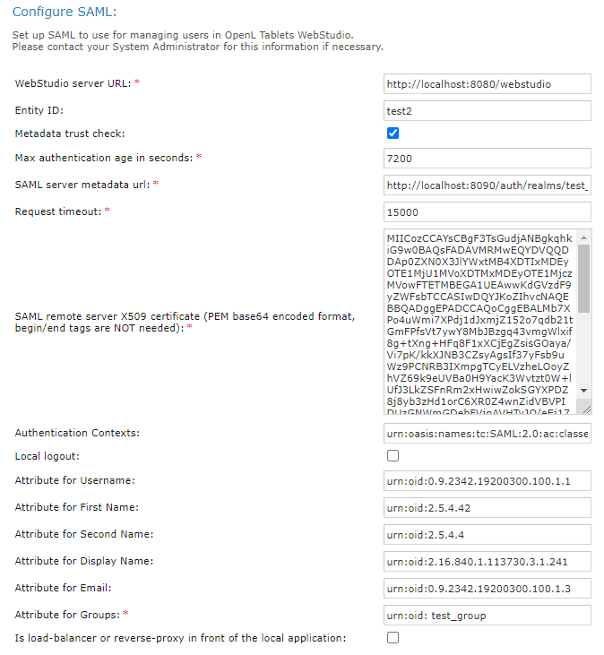

*Configuring SAML*

##### Configuring SAML on Azure Kubernetes

SAML configuration on Azure Kubernetes includes the following steps:

-   If the OpenL Studio Docker image is deployed on Azure Kubernetes, set the parameters on the Azure Basic SAML configuration as follows:

| Parameter              | Description                                                                                                                                                      |
|------------------------|------------------------------------------------------------------------------------------------------------------------------------------------------------------|
| Identifier (Entity ID) | Audience of the SAML response for IDP-initiated SSO. <br/>Example: https://example.com/ saml2/service-provider-metadata/webstudio                                     |
| Reply URL              | Destination in the SAML response for IDP-initiated SSO. <br/>Example: [https://example.com/ login/saml2/sso/webstudio](https://example.com/openl/webstudio/saml/SSO)  |
| Logout URL             | Called URL for the logout operation. <br/>Example: [https://example.com/ logout/saml2/slo](https://example.com/openl/webstudio/saml/SingleLogout)                     |

URLs must be accessible by Azure.

-   To specify the Azure metadata URL in the OpenL Studio, search for **App Federation Metadata URL** in the Azure SAML Signing certificate.
	
	Username, first name, last name, group, and other attributes can also be retrieved from App Federation Metadata XML.
	
-   Build the image with the required JDBC driver.

OpenL Studio stores information about users and their groups in the database, so there must be a remote database server when OpenL Studio is used in Kubernetes.

In Kubernetes, application configuration is described in the configuration map and installer must not be used. For an example of the configuration, see [Appendix B: OpenL Studio Image Configuration for SAML Under Kubernetes](#appendix-b-openl-studio-image-configuration-for-saml-under-kubernetes).

#### Configuring Single Sign On via OAuth2

This section explains how to set up authentication via the OAuth2 server using the installation wizard. Define the following parameters:

| Parameter                       | Description                                                                                                                                                                                                                       |
|---------------------------------|-----------------------------------------------------------------------------------------------------------------------------------------------------------------------------------------------------------------------------------|
| **Client ID**                   | Parameter required for an identity provider to identify OpenL Studio as a separate service provider.  <br/>For Keycloak, the value must exactly match the client ID. In Okta, it must match the service provider entity ID. |
| **Issuer URI**                  | OAuth2 authorization server URL. <br/>It is used for binding with the server to get additional settings for autoconfiguration.                                                                                                         |
| **Client Secret**               | Client secret. <br/>It is used by the OAuth client to authenticate to the authorization server.                                                                                                                                        |
| **Scope**                       | Scope requested by the client during the authorization request flow, such as openid, email, or profile. https://oauth.net/2/scope/                                                                                                |
| **Attribute for Username**      | OAuth2 attribute for a username. <br/>Keep it blank if OAuth2 server does not return this attribute, or if default algorithm for username retrieval must be used.                                                                      |
| **Attribute for First Name**    | OAuth2 attribute for the first name. <br/>Keep it blank if OAuth2 server does not return this attribute.                                                                                                                               |
| **Attribute for Second Name**   | OAuth2 attribute for second name. <br/>Keep it blank if OAuth2 server does not return this attribute.                                                                                                                                  |
| **Attribute for Display Name**  | OAuth2 attribute for the display name. <br/>Keep it blank if the OAuth2 server does not return this attribute.                                                                                                                         |
| **Attribute for Email**         | OAuth2 attribute for the email. <br/>Keep it blank if the OAuth2 server does not return this attribute.                                                                                                                                |
| **Attribute for Groups**        | SA OAuth2 ML attribute for groups. <br/>Keep it blank if the OAuth2 server does not return this attribute.                                                                                                                             |

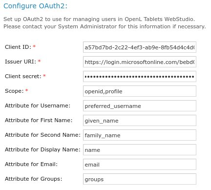

*Configuring single sign on via OAuth2*

An example of how to configure single sign on via OAuth2 using properties is as follows:

```
security.oauth2.client-id=a57bd7bd-2c22-4ef3-xxxx-xxxxxxxxxxx
security.oauth2.issuer-uri=https://login.microsoftonline.com/bebd0062-openid-connect/v2.0
security.oauth2.client-secret=xzB8Q~XxxXx-Secret-key-XxxXxxXxXxxx
```

### OpenL Studio Customization

This section describes additional configuration for OpenL Studio and includes the following topics:

-   [Updating User Database Configuration](#updating-user-database-configuration)
-   [Configuring User Mode](#configuring-user-mode)
-   [Configuring Google Analytics](#configuring-google-analytics)
-   [Configuring Private Key for Repository Security](#configuring-private-key-for-repository-security)
-   [Configuring User for Migration](#configuring-user-for-migration)

The changes described in this section can be made in the properties file as described in [OpenL Studio Home Directory Configuration](#openl-studio-home-directory-configuration).

#### Updating User Database Configuration

An example of the configuration that can be used for the user database is as follows:

```
db.url = jdbc:oracle:thin:@localhost:1521:openltest
db.user = loginname
db.password = myPassword
```

#### Configuring User Mode

Normally, user mode in OpenL Studio is set to **multi-user** by using OpenL Studio Installation Wizard as described in [Setting Up OpenL Studio with Installation Wizard](#setting-up-openl-studio-with-installation-wizard).

User mode can also be changed as a JVM option for Tomcat. For that, open the **Apache Tomcat Properties** dialog as described in [Installing Apache Tomcat Using Windows Service Installer](#installing-apache-tomcat-using-windows-service-installer), and in the **Java Options** text box, add the following line:

```
-Duser.mode=multi
```

**Note:** User mode set as a Java option takes precedence over the corresponding value specified in the OpenL Studio Installation Wizard. If both are defined, the Java option value is used.

#### Configuring Google Analytics

Google Analytics is a service offered by Google that generates detailed statistics about website traffic and traffic sources. To configure Google Analytics for OpenL, open the **Apache Tomcat Properties** dialog as described in [Installing Apache Tomcat Using Windows Service Installer](#installing-apache-tomcat-using-windows-service-installer) and in the **Java Options** text box, add the following lines:

```
webstudio.analytics=number 
```

`number` is a number provided by Google during registration.

#### Configuring Private Key for Repository Security

OpenL Studio allows connecting to secured repositories. In this case, passwords are stored in OpenL Studio workspace. To improve passwords protection, a private key can be used.

**Private key** is a special secure sentence for coding and encoding repository passwords. By default, the private key is empty. It can be set up as a JVM option for Tomcat by adding and specifying the value of the following parameter:

```
secret.key=mySecretPhrase
```

The private key must be specified without spaces.

!!! note
	The private key must be configured prior to creating any secured connections. Otherwise, all stored passwords become invalid.

#### Configuring User for Migration

Sometimes OpenL Studio needs to make changes in repositories in order to complete migration between versions. In this case, it uses the following username and email to show as author of those changes:
```
migration.user.name=Studio Migration
migration.user.email=openltablets@eisgroup.com
```

## Deploy OpenL Rule Services under Apache Tomcat

This chapter is designed for rule developers who need to use business rules as separate web services.

For more information on how to configure OpenL Rule Services, see [OpenL Rule Services Usage and Customization Guide](https://openldocs.readthedocs.io/en/latest/documentation/guides/rule_services_usage_and_customization_guide/).

Before deploying OpenL Rule Services under Apache Tomcat, ensure the following tasks are performed:

-   The `JAVA_HOME` environment variable is set to the pathname of the directory where JDK is installed.
-   JVM options are set up as described in [Installing Apache Tomcat](#installing-apache-tomcat).

The folder where Tomcat is installed is referred to as `<TOMCAT_HOME>.`

`This section contains the following topics:`

-   [Downloading Preconfigured OpenL Rule Services](#downloading-preconfigured-openl-rule-services)
-   [Configuring OpenL Rule Services for a Local Data Source](#configuring-openl-rule-services-for-a-local-data-source)
-   [Configuring OpenL Rule Services for a Database Data Source](#configuring-openl-rule-services-for-a-database-data-source)
-   [Configuring OpenL Rule Services via AWS S3 Connection](#configuring-openl-rule-services-via-aws-s3-connection)
-   [Configuring OpenL Rule Services via GIT Connection](#configuring-openl-rule-services-via-git-connection)

### Downloading Preconfigured OpenL Rule Services

To download the preconfigured OpenL Rule Services application in a WAR file, proceed as follows:

1.  Locate <https://openl-tablets.org/downloads>.
2.  Click the appropriate OpenL Rule Services WAR link.
3.  Save the WAR file to the `<TOMCAT_HOME>\webapps` directory.

### Configuring OpenL Rule Services for a Local Data Source

This section describes how to configure settings for a local storage with deployed projects there. The following topics are included:

-   [Configuring OpenL Rule Services via Local File System](#configuring-openl-rule-services-via-local-file-system)
-   [Configuring OpenL Rule Services via Local ZIP Archives](#configuring-openl-rule-services-via-local-zip-archives)
-   [Configuring OpenL Rule Services via Classpath JAR](#configuring-openl-rule-services-via-classpath-jar)

#### Configuring OpenL Rule Services via Local File System

Using a file system as a data source for user projects means that projects are stored in a local folder. This folder represents multi deployments containing one or multiple projects for each deployment. Each deployment must be represented as a separate folder and, at the same time, the project must also be represented as a separate folder inside the deployment folder.

To deploy OpenL Rule Services, configure a local file system as a data source as follows:

1.  Open the `application.properties` file.
2.  Set the following properties with the following values:

	```
	production-repository.factory = repo-file 
	production-repository.uri = d:/datasource/
	```

	!!! note
		For proper parsing of Java properties file, the path to the folder must be defined with a slash (‘/’) as the folders delimiter. Back slash “\\” is not allowed.

1.  Save the rule project in the appropriate `datasource` folder.

	Every rule project must be represented as a separate folder. As an example, use OpenL Tablets Tutorial available at <https://openl-tablets.org/documentation/tutorials>.

1.  To run Tomcat, in `<TOMCAT_HOME>\bin,` click the `startup.bat` file.

To ensure the deployment is successful, try loading the appropriate CXF page with web services.  
An example is <http://localhost:8080/openl-tablets-ws-X.X.X>`.`

Users can also pack their rule projects in a `jar` file and use this file as a data source as described in [OpenL Rule Services Usage and Customization Guide > Classpath JAR](https://openldocs.readthedocs.io/en/latest/documentation/guides/rule_services_usage_and_customization_guide/#classpath-jar).

#### Configuring OpenL Rule Services via Local ZIP Archives

Using a local zip archive as a data source for user projects means that zipped projects are stored in a local folder. This folder represents rule project or deployment as a separate zip archive:

-   Each dependent rule projects must be represented as a deployment zip archive and each project must be in a separate folder inside the deployment archive.
-   Each independent rule project must be represented as a separate zip archive.

To set up local zip archives for deployment to OpenL Rule Services, proceed as follows:

1.  Open the `application.properties` file.
2.  Set the following properties with the following values:

	```
		production-repository.factory = repo-zip
		production-repository.uri = d:/datasource
	```

1.  Save the zipped rule projects in the appropriate `datasource` folder.

	Every rule project must be represented as a separate archive. As an example, use OpenL Tablets tutorial available at <https://openl-tablets.org/documentation/tutorials>.

It is also possible to configure separate zip archives from different locations. For that, set up the `production-repository.archives` property and define the exact address to the zip archive. Use the comma “,” separator to configure multiple archives. An example is as follows:

`production-repository.archives = d:/datasource/project1.zip, c:/folder/project2.zip`

#### Configuring OpenL Rule Services via Classpath JAR

If rule projects with the `rules.xml` project descriptor in the archive root or deployments with the `deployment.xml` or `deployment.yaml` deployment descriptor in the archive root are packed into a JAR file and placed in the `classpath`, these projects are deployed at the application launch. It is default configuration.

To set up a classpath JAR for deploy to OpenL Rule Services, proceed as follows:

1.  Open the `application.properties` file.
2.  Set the following properties with the following values:

	```
		production-repository.factory = repo-jar
	```

1.  Put the JAR file with the project to `\<TOMCAT_HOME>\webapps\<rule services file name>\WEB-INF\lib`.

Alternatively, zip archives with deployments or rule projects can be saved to `\<TOMCAT_HOME>\webapps\<rule services file name>\WEB-INF\classes\openl.`

### Configuring OpenL Rule Services for a Database Data Source

This section describes how to configure settings to connect to a database for storing deployed projects there. Such configuration requires that the appropriate database exists and is launched. The following topics are included:

-   [Configuring OpenL Rule Services via JDBC Connection](#configuring-openl-rule-services-via-jdbc-connection)
-   [Configuring OpenL Rule Services via JNDI Connection](#configuring-openl-rule-services-via-jndi-connection)
-   [Configuring OpenL Rule Services via AWS S3 Connection](#configuring-openl-rule-services-via-aws-s3-connection)
-   [Configuring OpenL Rule Services via GIT Connection](#configuring-openl-rule-services-via-git-connection)
-   [Configuring OpenL Rule Services via Azure Blob Connection](#configuring-openl-rule-services-via-azure-blob-connection)

Before configuration, add the appropriate driver library for a database in OpenL Rule Services to `\WEB-INF\lib\.`Alternatively, locate required libraries directly in `\<TOMCAT_HOME>\lib` with other Tomcat libraries. Install the database, defining a login and password and creating a new schema or service.

For more information on drivers, see the **Driver name for appropriate databases** table in [Adding Drivers and Installing and Configuring the Database](#adding-drivers-and-installing-and-configuring-the-database).

#### Configuring OpenL Rule Services via JDBC Connection

To set up JDBC connection settings for OpenL Rule Services, proceed as follows:

1.  Open the `application.properties` file.
2.  Set the following properties with the following values:

	```
	production-repository.factory = repo-jdbc
	production-repository.uri = jdbc:mysql://localhost/deployment-repository
	```

1.  Set the URL value for `production-repository.uri` according to the appropriate database as described in the **URL value according to the database type** table in [Setting Up OpenL Studio with Installation Wizard](#setting-up-openl-studio-with-installation-wizard).
2.  Set the login `production-repository.login `and password `production-repository.password `for connection to the database defined while installing the database.

	The password must be encoded via the Base64 encoding schema when `secret.key` is also defined.

#### Configuring OpenL Rule Services via JNDI Connection

This section describes how to configure JNDI connection when OpenL Rule Services is started under Apache Tomcat. Before configuration, ensure that resources are set up in the `context.xml` file as described in [Configuring Resources for JNDI Context](#configuring-resources-for-jndi-context).

To configure OpenL Rule Services via JNDI connection, proceed as follows:

1.  Open the `application.properties` file.
2.  Set the following properties with the following values:

	```
	production-repository.factory = repo-jndi
	production-repository.uri = java:comp/env/jdbc/deploymentDB
	```

1.  Change the URL value for `production-repository.uri` according to the appropriate database as described in the **URL value according to the database type** table in [Setting Up OpenL Studio with Installation Wizard](#setting-up-openl-studio-with-installation-wizard).

	!!! note
		Login and password are not required for definition inside the `application.properties` file while configuring JNDI settings.

### Configuring OpenL Rule Services via AWS S3 Connection

This section describes how to configure an AWS S3 connection when OpenL Rule Services is started under Apache Tomcat.

To configure OpenL Rule Services via an AWS S3 connection, add the following properties to the `application.properties` file:

```
production-repository.factory = repo-aws-s3
production-repository.bucket-name = yourBucketName
production-repository.region-name = yourS3Region
production-repository.access-key = yourAccessKey
production-repository.secret-key = yourSecretKey
```

### Configuring OpenL Rule Services via GIT Connection

To configure OpenL Rule Services via a GIT connection, add the following properties to the application.properties file:

```
production-repository.factory = repo-git
production-repository.uri = https://github.com/<your-name>/<your-repo>.git
production-repository.login = your-login
production-repository.password = your-password
```

### Configuring OpenL Rule Services via Azure Blob Connection

To configure OpenL Rule Services via the Azure Blob connection using SAS, add the following properties to the application.properties file:

```
production-repository.factory=repo-azure-blob
production-repository.uri=https://myStorage.blob.core.windows.net/container/?sv=2015-07-08
```

## Install OpenL Studio and OpenL Rule Services on JBoss Application Server

This section explains how to install OpenL Studio and OpenL Rule Services on JBoss Application Server in a standalone mode.

The following topics are included:

-   [Deploying OpenL tudio on JBoss Application Server](#deploying-openl-studio-on-jboss-application-server)
-   [Deploying OpenL Rule Services on JBoss Application Server](#deploying-openl-rule-services-on-jboss-application-server)
-   [Setting Up a JDBC Connection](#setting-up-a-jdbc-connection)
-   [Setting Up a JNDI Connection](#setting-up-a-jndi-connection)

### Deploying OpenL Studio on JBoss Application Server

To deploy OpenL Studio on JBoss Application Server, proceed as follows:

1.  Rename the OpenL Studio war file to `webstudio.war`.
1.  Copy `webstudio.war` to the `<JBoss home directory>\standalone\deployments` directory.
1.  If the `auto-deploy-zipped` attribute is set to `true` in the `standalone.xml` file, manually create an empty file `webstudio.war.dodeploy`.
1.  Run the `<JBoss home directory>\bin\standalone.bat` file.
1.  Verify that the `webstudio.war.deployed` marker is generated.
1.  To run OpenL Studio, in a browser, enter *http://localhost:8080/webstudio/*.
1.  The **Welcome to OpenL Studio Installation Wizard** window.
2.  Set up the application as required.

### Deploying OpenL Rule Services on JBoss Application Server

To deploy OpenL Rule Services on JBoss Application Server, proceed as follows:

1.  Rename the OpenL Rule Services file to `webservice.war.`
2.  Copy the `webservice.war` file to the `<JBoss home directory>\standalone\deployments` directory.
3.  Run the `<JBoss home directory>\bin\standalone.bat` file.
4.  Verify that the `webservice.war.deployed` marker is generated.
5.  To run OpenL Rule Services, in a browser, enter *http://localhost:8080/webservice/*.

### Setting Up a JDBC Connection

To set up a JDBC connection for OpenL Studio, proceed as follows:

1.  Download a required JDBC driver.
1.  Run `< JBoss home directory >\bin\standalone.bat.`
1.  Run JBoss command line client `<JBoss home directory>\bin\jboss-cli.bat.`
1.  In Jboss-cli:, connect to the server using the `connect` command.
1.  In Jboss-cli:, add a module using the following command:

	`module add --name=<module name> --resources=<path to the driver> --dependencies=javax.api,javax.transaction.api`

	An example of the MySQL driver copied to the `<JBoss home directory>\bin` directory is as follows:

	`module add --name=org.mysql --resources=mysql-connector-java-8.0.11.jar --dependencies=javax.api,javax.transaction.api`

1.  To prepare `*.war` files for deployment, in the `META-INF\jboss-deployment-structure.xml` file, add the following structure:

	`<dependencies>`

	`		<module name="<module_name>" export="true" />`

	`</dependencies>`

1.  For `webservice.war`, in the `application.properties` file, specify a connection to the database as follows:

	`production-repository.factory = repo-jdbc`

	`production-repository.uri = jdbc:mysql://localhost/deployment-repository`

1.  Ensure that the `application.properties` file is “visible” at the JBoss launch location.

	For example, if the `application.properties` file is located in JBoss home directory, JBoss must be run from this directory via the `bin\standalone.bat` command.

1.  Configure a JDBC connection for OpenL Studio as described in [Configuring OpenL Studio via JDBC Connection](#configuring-openl-studio-via-jdbc-connection).

### Setting Up a JNDI Connection

To set up a JNDI connection settings for OpenL Studio, proceed as follows:

1.  Copy a database driver to the `<JBoss home directory>\ standalone\deployments\` directory.
1.  Run the `<JBoss home directory>\bin\standalone.bat` file.
1.  In a browser, enter *http://localhost:8080/*.
1.  Click **Administration console.**
1.  Click the **Configuration** link.
1.  Select **Subsystems \> Datasources \> Non-XA**.
1.  Click **Add.**

	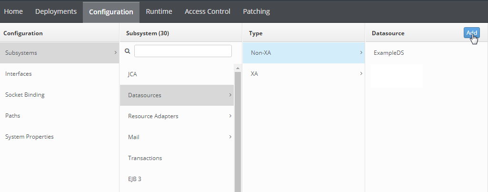

	*Configuring a JNDI connection*

1.  In the **Create Datasource** window, select a data source and click **Next.**
1.  Enter the data source name and JNDI name and click **Next.**
1.  Switch to the **Detected Driver** tab.

	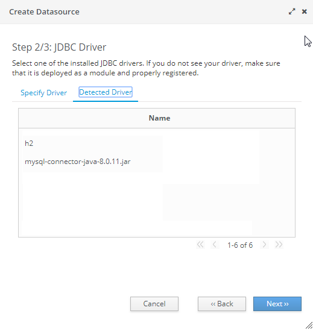

	*JDBC driver collection*

1.  Select a JDBC driver and click **Next.**
1.  Specify database connection settings and click **Next.**
1.  To test the JDBC connection, click **Test Connection.**
1.  Click **Next** and then click **Finish.**
1.  For `webservice.war`, in the `application.properties` file, specify the connection to a database as follows:

	`production-repository.factory = repo-jndi`

	`production-repository.uri = <JNDI Name>`

1.  Configure a JNDI connection for OpenL Studio as described in [Configuring Settings in OpenL Studio](#configuring-settings-in-openl-studio).

## OpenL Studio and Rule Services Integration

This section describes how to set up OpenL Studio and OpenL Rule Services integration and enable backward compatibility and includes the following topics:

-   [Deploying Rules to the Production Server](#deploying-rules-to-the-production-server)
-   [Integrating OpenL Studio and OpenL Rule Services via Database Repository](#integrating-openl-studio-and-openl-rule-services-via-database-repository)

### Deploying Rules to the Production Server

After integration any changes can be made in user’s rule in OpenL Studio, and then the project must be saved and redeployed. These changes immediately affect the rule represented as web service. During development, rules are stored in the file system of the development server. When development is finished, rules can be deployed to the production server as follows:

1.  OpenL Studio sends the rules project to the database repository, using the JDBC driver for connection, in case of integration via database repository.
2.  The rules are saved on the production server.
3.  OpenL Rule Services detects a new version of the deployed rules and starts using it.

	The following diagram illustrates the OpenL Studio and OpenL Rule Services integration:

	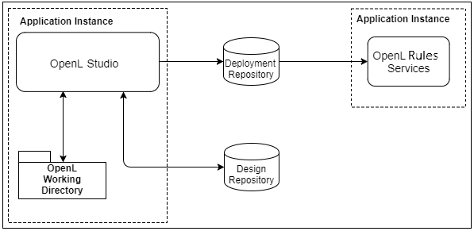

	*OpenL Studio and OpenL Rule Services deployment*

### Integrating OpenL Studio and OpenL Rule Services via Database Repository

This section describes an alternative way of how to set up an integrated environment that enables work with business rules from OpenL Studio and launch these rules as OpenL Rule Services. To set up OpenL Studio and OpenL Rule Services integration using the database as storage for deployment repository, proceed as follows:

1.  Install OpenL Studio and OpenL Rule Services on the same application server.
2.  Connect OpenL Studio to the database to store deployed projects as described in [Setting Up OpenL Studio with Installation Wizard](#setting-up-openl-studio-with-installation-wizard).
3.  Configure OpenL Rule Services for a database data source as described in [Configuring OpenL Rule Services for a Database Data Source](#configuring-openl-rule-services-for-a-database-data-source).

## Troubleshooting

If OpenL Studio is deployed under Tomcat in the Unix/Linux environment, consider the following troubleshooting recommendations:

1.  Before starting Tomcat under Linux, make sure that no Java processes are running:

	`sudo ps -A | grep j`

	If found, the process name and number are displayed.

1.  If any Java process is running, stop it as follows:

	`kill -9 <process number>`

1.  Make sure that port 8080 is available as follows:

	`sudo netstart –an | grep 8080`

1.  Run Tomcat under Linux as follows:

	`<TOMCAT_HOME>/bin/startup.sh`

1.  If the **command not found** error appears, mark the `.sh` file as an executable script as follows:

	`chmod +x startup.sh`

2.  If the **Permission denied** or **The BASEDIR environment variable is not defined correctly** error is displayed, make all `.sh` files in the `bin` folder executable as follows:

	`chmod 777 *.sh`

1.  Verify that all `.sh` files in the `bin` folder are executable as follows:

	`ls –la`

1.  Run Tomcat as follows:

	`<TOMCAT_HOME>/bin/startup.sh`

## Frequently Asked Questions

This section provides the most common questions and answers related to the OpenL Tablets installation procedure. For more information on working with Java, Tomcat, and other third party software, see the corresponding sites of the software manufacturers.

| \#    | Question                                                                                                                         | Answer                                                                                                                                                                                                                                                                                                                                   |
|-------|----------------------------------------------------------------------------------------------------------------------------------|------------------------------------------------------------------------------------------------------------------------------------------------------------------------------------------------------------------------------------------------------------------------------------------------------------------------------------------|
| **1** | How can I check if Java is installed on my PC?                                                                                   | Proceed as follows: <br/>Open **Start \> Control Panel.** <br/>Perform either of the following: <br/>• For Windows XP, double click **Add or Remove Programs**. <br/>• For Windows 7/Vista, click **Programs \> Programs and Features**. <br/>Look through the list for **Java(TM)…** or **Java(TM) Update…** items. <br/>If any is present, Java is installed on your PC. |
| **2** | During Java installation, the page for Java registration appears. <br/>Do I have to register Java?                                    | No, it is optional. You can close the registration page.                                                                                                                                                                                                                                                                                 |
| 3     | How can I check which version of Java is installed on my PC?                                                                     | Open the [**Verify Java Version**](http://java.com/en/download/installed.jsp) page and click the **Verify Java Version** button.  <br/>In a few seconds a new page appears where you will find the message like the following one: <br/>**Your Java version: Version 6 Update 26**.                                                                |
| 4     | How can I see the error message in the Tomcat <br/>console that appears when I start Tomcat? <br/>The error screen disappears too quickly. | Proceed as follows: <br/>Click **Start \> Run**. <br/>Locate the `<TOMCAT_HOME>\bin` folder. <br/>Select `catalina.bat` and enter *run* in the command line.                                                                                                                                                                                            |

## Appendix A: Official Docker Images for OpenL Tablets

OpenL Tablets supports Docker containers. The following table provides links to the Docker images for OpenL Tablets:

| **OpenL Tablet resource**   | **Reference**                                      |
|-----------------------------|----------------------------------------------------|
| OpenL Rule Services | <https://hub.docker.com/r/openltablets/ws/>        |
| OpenL Studio     | <https://hub.docker.com/r/openltablets/webstudio/> |
| OpenL Tablets demo          | <https://hub.docker.com/r/openltablets/demo/>      |

## Appendix B: OpenL Studio Image Configuration for SAML Under Kubernetes

```
apiVersion: apps/v1
kind: StatefulSet
metadata:
  name: webstudio
spec:
  replicas: 1
  selector:
	matchLabels:
	  app: webstudio
  serviceName: webstudio
  template:
	metadata:
	  labels:
		app: webstudio
	spec:
	  containers:
		- name: webstudio
		  image: openltablets/webstudio:latest
		  resources:
			limits:
			  memory: "32768Mi"
			requests:
			  memory: "1024Mi"
		  ports:
			- containerPort: 8080
		  readinessProbe:
			tcpSocket:
			  port: 8080
			initialDelaySeconds: 30
			periodSeconds: 60
		  livenessProbe:
			tcpSocket:
			  port: 8080
			initialDelaySeconds: 60
			periodSeconds: 120
		  env:
			- name: WEBSTUDIO_CONFIGURED
			  value: "true"
			- name: DB_URL
			  value: "jdbc:postgresql://dbserver:5432/studio_db"
			- name: DB_USER
			  value: "pgadmin@studio"
			- name: DB_PASSWORD
			  value: "Pa$$w0rd"
			- name: USER_MODE
			  value: "saml"
			- name: SECURITY_SAML_ENTITY-ID
			  value: "webstudio"
			- name: SECURITY_SAML_SAML-SERVER-METADATA-URL
			  value: "https://saml-idp-server/path/to/metadata"
			- name: SECURITY_ADMINISTRATORS
			  value: "mylogin@example.com"
			- name: SECURITY_SAML_SERVER-CERTIFICATE
			  value: "BASE64 encoded public key (optional)"
			- name: SECURITY_SAML_ATTRIBUTE_FIRST-NAME
			  value: "http://schemas.xmlsoap.org/ws/2005/05/identity/claims/givenname"
			- name: SECURITY_SAML_ATTRIBUTE_LAST-NAME
			  value: "http://schemas.xmlsoap.org/ws/2005/05/identity/claims/surname"
			- name: SECURITY_SAML_ATTRIBUTE_DISPLAY-NAME
			  value: "http://schemas.microsoft.com/identity/claims/displayname"
			- name: SECURITY_SAML_ATTRIBUTE_EMAIL
			  value: "http://schemas.xmlsoap.org/ws/2005/05/identity/claims/emailaddress"
			- name: SECURITY_SAML_ATTRIBUTE_GROUPS
			  value: "http://schemas.microsoft.com/ws/2008/06/identity/claims/role"
			- name: USER_MODE
			  value: "saml"
	  imagePullSecrets:
		- name: regcreds
```

## Appendix C: CORS Filter Support Enablement in <br/>OpenL Studio

**Cross-Origin Resource Sharing (CORS)** is a specification which is a standard mechanism that enables cross-origin requests. For more information on how to enable CORS filter support in OpenL Studio, see [OpenL Rule Services Usage and Customization Guide > CORS Filter Support](https://openldocs.readthedocs.io/en/latest/documentation/guides/rule_services_usage_and_customization_guide/#cors-filter-support).
```
Release 5.27
OpenL Tablets Documentation is licensed under the Creative Commons Attribution 3.0 United States License.
```
