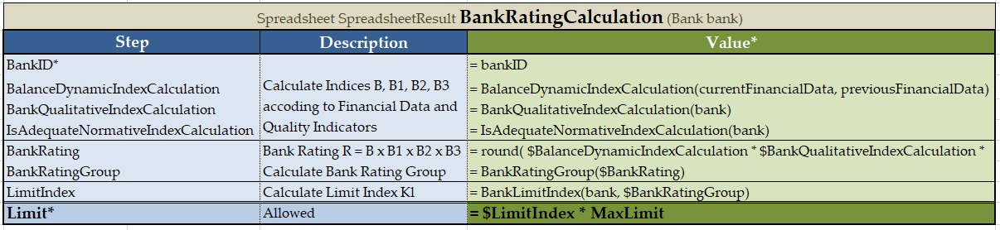

## Untitled


To simplify integration with OpenL rules, customize serialization output of SpreadsheetResult objects by adding or removing steps or columns from spreadsheet result output.

- To identify steps or columns to be returned in the SOAP/REST response, mark them using the \* asterisk symbol.
- To ensure that certain steps or columns are not included in output, mark them with the ~ tilde symbol.

Consider the following spreadsheets.


*Spreadsheets example*

For these spreadsheets, output result is as follows.

```
{
  "PremiumCalc": {
    "PolicyID": "P1",
    "VehiclesPremiumCalc": [
      {
        "VehicleID": "V1",
        "CoverageCalculation": [
          {
            "CoverageType": "Bodily Injury",
            "BaseRate": 150,
            "VehicleYearFactor": 1.35,
            "MileageFactor": 1.19,
            "CoverageTotal": 240.98
          },
          {
            "CoverageType": "Property Damage",
            "BaseRate": 130,
            "VehicleYearFactor": 1.35,
            "MileageFactor": 1.19,
            "CoverageTotal": 208.85
          }
        ],
        "VehicleCoveragesSum": 449.83,
        "VehicleDiscounts": 0.08,
        "VehicleDiscountsAmount": 36,
        "TotalVehiclePremium": 413.83
      }
    ],
    "DriversPremiumCalc": [
      {
        "DriverID": "D1",
        "DriverAge": 44,
        "AgeRate": 1,
        "RiskAdjustment": 1,
        "ConvictedDriverFactor": 1.2,
        "TotalDriverPremium": 1.2
      }
    ],
    "PolicyPremiumSubtotal": 415.03,
    "CustomerDiscount": 0.12,
    "TotalPolicyPremium": 365.23
  }
}
```

In the following example, some steps are marked with the asterisk to be included in the output.


*Example of spreadsheets with mandatory steps*

An output for these tables is as follows:

```
{
  "PremiumCalc": {
    "PolicyID": "P1",
    "VehiclesPremiumCalc": [
      {
        "VehicleID": "V1",
        "CoverageCalculation": [
          {
            "CoverageType": "Bodily Injury",
            "CoverageTotal": 240.98
          },
          {
            "CoverageType": "Property Damage",
            "CoverageTotal": 208.85
          }
        ],
        "TotalVehiclePremium": 413.83
      }
    ],
    "DriversPremiumCalc": [
      {
        "DriverID": "D1",
        "TotalDriverPremium": 1.2
      }
    ],
    "TotalPolicyPremium": 365.23
  }
}
```

Within a project, different tables can contain ~ or * markings. Using one or another depends on whether a user needs more steps to include or exclude into the final result. An example is as follows.


*An example of spreadsheets with steps marked to be included and excluded*

An output result for these spreadsheets is as follows.

```
{
  "PremiumCalc": {
    "PolicyID": "P1",
    "VehiclesPremiumCalc": [
      {
        "VehicleID": "V1",
        "CoverageCalculation": [
          {
            "CoverageType": "Bodily Injury",
            "CoverageTotal": 240.98
          },
          {
            "CoverageType": "Property Damage",
            "CoverageTotal": 208.85
          }
        ],
        "TotalVehiclePremium": 413.83
      }
    ],
    "DriversPremiumCalc": [
      {
        "DriverID": "D1",
        "TotalDriverPremium": 1.2
      }
    ],
    "TotalPolicyPremium": 365.23
  }
}
```

It is also possible to filter spreadsheet columns identifying the ones to be displayed or hidden in the output result. Use the ~ or * markings depending on whether there are more columns to include or exclude from the final result. The following naming rules apply:

- If a spreadsheet has two columns, the step name in API is **RowName**.
- If a spreadsheet has more than two columns, the step name in API is **ColumnName_RowName**.

**Note:** If there is only one spreadsheet column marked as mandatory, its name in API is just **RowName.** If there is only one spreadsheet column left after exclusion besides the step column, its name in API is also just **RowName**.

An example is as follows. 
  


*A spreadsheet table with three columns*

An output result for this spreadsheet is as follows.

```
{
  "Value_BankID": "commerz",
  "Description_BalanceDynamicIndexCalculation": "Calculate Indices B, B1, B2, B3 accoding to Financial Data and Quality Indicators",
  "Value_BalanceDynamicIndexCalculation": 0.94,
  "Description_BankQualitativeIndexCalculation": "Calculate Indices B, B1, B2, B3 accoding to Financial Data and Quality Indicators",
  "Value_BankQualitativeIndexCalculation": 0.9,
  "Description_IsAdequateNormativeIndexCalculation": "Calculate Indices B, B1, B2, B3 accoding to Financial Data and Quality Indicators",
  "Value_IsAdequateNormativeIndexCalculation": 1,
  "Description_BankRating": "Bank Rating R = B x B1 x B2 x B3",
  "Value_BankRating": 0.85,
  "Description_BankRatingGroup": "Calculate Bank Rating Group",
  "Value_BankRatingGroup": "R2",
  "Description_LimitIndex": "Calculate Limit Index Kl",
  "Value_LimitIndex": 1,
  "Description_Limit": "Max Limit which Bank is Allowed\nL = Kl x Lmax",
  "Value_Limit": 5000
}	
```

Note that the step names are in the **ColumnName_RowName** format.

An example of the same spreadsheet with one of the columns excluded using the tilda ~ sign is as follows.
  


*A spreadsheet table with excluded column*

An output result for this spreadsheet is as follows.

```
{
  "BankID": "commerz",
  "BalanceDynamicIndexCalculation": 0.94,
  "BankQualitativeIndexCalculation": 0.9,
  "IsAdequateNormativeIndexCalculation": 1,
  "BankRating": 0.85,
  "BankRatingGroup": "R2",
  "LimitIndex": 1,
  "Limit": 5000
}
```

Note that the step names are in the **RowName** format because there is only one column left besides the **Step** column. 
  
Now consider the following example that illustrates simultaneous usage of asterix in columns and steps.
  


*A spreadsheet table with filtered columns and steps*

An output result for this spreadsheet is as follows.

```
{
  "BankID": "commerz",
  "Limit": 5000
}
```
  
**Note:** If the Maven plugin is used for generating a spreadsheet result output model, system integration can be based on generated classes. A default Java package for generated Java beans for particular spreadsheet tables is set using the spreadsheetResultPackage table property. Nevertheless, it is recommended to avoid any integration based on generated classes.

