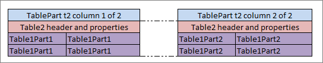

#### Table Part

The **Table Part** functionality enables the user to split a large table into smaller parts, or partial tables. Physically, in the Excel workbook, the table is represented as several table parts which logically are processed as one rules table.

This functionality is suitable for cases when a user is dealing with `.xls` file format using a rules table with more than 256 columns or 65,536 rows. To create such a rule table, a user can split the table into several parts and place each part on a separate worksheet.

Splitting can be vertical or horizontal. In vertical case, the first N1 rows of an original rule table are placed in the first table part, the next N2 rows in the second table part, and so on. In horizontal case, the first N1 columns of the rule table are placed in the first table part, the next N2 columns in the second table part, and so on. The header of the original rule table and its properties definition must be copied to each table part in case of horizontal splitting. Merging of table parts into the rule table is processed as depicted in the following figures.


*Vertical merging of table parts*



*Horizontal merging of table parts*

All table parts must be located within one Excel file.

Splitting can be applied to any tables of decision, data, test and run types.

The format of the TablePart header is as follows:

```
TablePart <table id> <split type> {M} of {N}
```

The following table describes the TablePart header syntax:

| Element        | Description                                                                                                                    |
|----------------|--------------------------------------------------------------------------------------------------------------------------------|
| TablePart      | Reserved word that defines the type of the table.                                                                              |
| \<table id\>   | Unique name of the rules table. It can be the same as the rules table name if the rules table is not overloaded by properties. |
| \<split type\> | Type of splitting. It is set to **row** for vertical splitting and **column** for horizontal splitting.                        |
| {M}            | Sequential number of the table part: 1, 2, and so on.                                                                          |
| {N}            | Total number of table parts of the rule table.                                                                                 |

The following examples illustrate vertical and horizontal splitting of the **RiskOfWorkWithCorporate** decision rule.


*Table Parts example. Vertical splitting part 1*


*Table Parts example. Vertical splitting part2*


*Table Part example. Horizontal splitting part 1*


*Table Parts example. Horizontal splitting part 2*

