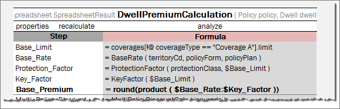

#### Dev Properties

The **Dev** properties group impacts the OpenL Tablets features and enables system behavior management depending on a property value.

For example, the **Scope** property defines whether properties are applicable to a particular category of rules or for the module. If **Scope** is defined as **Module**, the properties are applied for all tables in the current module. If **Scope** is defined as **Category**, use the **Category** property to specify the exact category to which the property is applicable.


*The properties are defined for the ‘Police-Scoring’ category*

The following topics are included in this section:

-   [Dev Properties List](../../04-table-properties/07-dev-properties.md#dev-properties-list)
-   [Variation Related Properties](../../04-table-properties/07-dev-properties.md#variation-related-properties)
-   [Using the Precision Property in Testing](../../04-table-properties/07-dev-properties.md#using-the-precision-property-in-testing)

##### Dev Properties List

The **Dev** group properties are listed in the following table:

| Property                | Name to be used <br/>in rule tables | Type    | Table type             | Level at which property <br/>can be defined | Description                                                                                                                                                                                                                                                                                          |
|-------------------------|--------------------------------|---------|------------------------|----------------------------------------|------------------------------------------------------------------------------------------------------------------------------------------------------------------------------------------------------------------------------------------------------------------------------------------------------|
| ID                      | id                             | Table   | All                    | Table                                  | Unique ID to be used for calling a particular table <br/>in a set of overloaded tables without using <br/>business dimension properties. <br/>**Note:** Constraints for the ID value are the same <Br/>as for any OpenL function.                                                                                        |
| Build Phase             | buildPhase                     | String  | All                    | Module, Category, Table                | Property used to manage dependencies <br/>between build phases. <br/>**Note:** Reserved for future use.                                                                                                                                                                                                        |
| Validate DT             | validateDT                     | String  | Decision Table         | Module, Category, Table                | Validation mode for decision tables. <br/>In the wrong case an appropriate warning is issued. <br/>Possible values are as follows: <br/>- **on**: checks for uncovered or overlapped cases. <br/>- **off**: validation is turned off. <br/>- **gap**: checks for uncovered cases. <br/>- **overlap**: checks for overlapped cases. |
| Fail On Miss            | failOnMiss                     | Boolean | Decision Table         | Module, Category, Table                | Rule behavior in case no rules were matched: <br/>- If the property is set to TRUE, an error occurs <br/>along with the corresponding explanation. <br/><br/>- If the property is set to FALSE, <br/>the table output is set to NULL.                                                                                             |
| Scope                   | scope                          | String  | Properties             | Module, Category                       | Scope for the Properties table.                                                                                                                                                                                                                                                                      |
| Datatype Package        | datatypePackage                | String  | DataType               | Table                                  | Name of the Java package for generating <br/>the data type.                                                                                                                                                                                                                                               |
| Recalculate             | recalculate                    | Enum    |                        | Module, Category, Table                | Way of a table recalculation for a variation. <br/>Possible values are **Always**, **Never**, and **Analyze**.                                                                                                                                                                                            |
| Cacheable               | cacheable                      | Boolean |                        | Module, Category, Table                | Identifier of whether to use cache while <br/>recalculating the table, depending on rule input.                                                                                                                                                                                                       |
| Precision               | precision                      | Integer | Test Table             | Module, Category, Table                | Precision of comparing the returned results <br/>with the expected ones while launching test tables.                                                                                                                                                                                                      |
| Auto Type Discovery     | autoType                       | Boolean | Properties <br/>Spreadsheet | Module, Category, Table                | Auto detection of data type for a value <br/>of the **Spreadsheet** cell with formula. <br/>The default value is `true`. <br/>If the value is `true`, the type can be left undefined.                                                                                                                               |
| Concurrent Execution    | parallel                       | Boolean |                        | Module, Category, Table                | Controls whether to parallel the execution of a rule <br/>when the rule is called for an array instead of a <br/>single value as input parameter. <br/>Default is `false`.                                                                                                                                          |
| Calculate All Cells     | calculateAllCells              | Boolean | Spreadsheet            | Module, Category, Table                | Returns a particular type. <br/>Default is true when calculation is started <br/>from the beginning of the spreadsheet. <br/>If this property is set to false, calculation is started <br/>from the last line of the spreadsheet.                                                                                        |
| Empty Result Processing | emptyResultProcessing          | String  | Decision table         | Module, Category, Table                | Identifier of whether to process blank parameter <br/>value cells and return an empty result if found, when <br/>set to **RETURN**, or ignore and find the first<br/>non-empty result value, when  set to **SKIP** (default).<br/>                                                                                                                                             |

The following example illustrates how the property  **emptyResultProcessing** works depending on property values when x=1:


<!DOCTYPE html>
<html lang="en">
<head>
<meta charset="UTF-8">
<title>Table Example</title>
<style>
    .table-container {
        float: left;
        margin-right: 20px; /* Adjust the space between the tables as needed */
    }
    table, th, td {
        border: 1px solid black;
        border-collapse: collapse;
    }
    th, td {
        padding: 5px;
        text-align: left;
    }
    .yellow-background {
        background-color: yellow;
    }
</style>
</head>
<body>


<div class="table-container">

<table>
  <tr>
    <th colspan="3" >SmartRules Integer codes(Integer x)</th>
  </tr>
  <tr>
    <td>properties</td>
    <td>emptyResultProcessing</td>
    <td><strong>SKIP</strong></td>
  </tr>
  <tr>
    <td>X</td>
    <td colspan="2">RESULT</td>
  </tr>
  <tr>
    <td>1-100</td>
    <td colspan="2"></td>
  </tr>
  <tr>
    <td>1-200</td>
    <td class="yellow-background" colspan="2">3</td>
  </tr>
  <tr>
    <td>1-300</td>
    <td colspan="2">4</td>
  </tr>
</table>

</body>
</html>

</div>

<div class="table-container">

<table>
  <tr>
    <th colspan="3" >SmartRules Integer codes(Integer x)</th>
  </tr>
  <tr>
    <td>properties</td>
    <td>emptyResultProcessing</td>
    <td><strong>RETURN</strong></td>
  </tr>
  <tr>
    <td>X</td>
    <td colspan="2">RESULT</td>
  </tr>
  <tr>
    <td>1-100</td>
    <td colspan="2" class="yellow-background"></td>
  </tr>
  <tr>
    <td>1-200</td>
    <td colspan="2">3</td>
  </tr>
  <tr>
    <td>1-300</td>
    <td colspan="2">4</td>
  </tr>
</table>


</div>

<div style="clear: both;"></div>

</body>
</html>


##### Variation Related Properties

This section describes *variations* and the properties required to work with them, namely *Recalculate* and *Cacheable*.

A **variation** means additional calculation of the same rule with a modification in its arguments. Variations are very useful when calculating a rule several times with similar arguments. The idea of this approach is to calculate once the rules for a particular set of arguments and then recalculate only the rules or steps that depend on the fields specifically modified by variation in those arguments. For example, a user wants to compare the premium with an original set of parameters defined to the results where one or more attributes are varied to see how it impacts the premium and what is the best option for this user.

The following **Dev** properties are used to manage rules recalculation for variations:

| Property        | Description                                                                                                                                                                                                                                                                                                                                                                                                                                                                                                                                                                                                                                                                                                                                                                |
|-----------------|----------------------------------------------------------------------------------------------------------------------------------------------------------------------------------------------------------------------------------------------------------------------------------------------------------------------------------------------------------------------------------------------------------------------------------------------------------------------------------------------------------------------------------------------------------------------------------------------------------------------------------------------------------------------------------------------------------------------------------------------------------------------------|
| **Cacheable**   | Switches on or off using cache while recalculating the table. It can be evaluated to `true` or `false`. <br/>If it is set to `true`, all calculation results of the rule are cached and can be used in other variations; otherwise, calculation results are not cached. <br/>It is recommended to set Cacheable to `true` if recalculating a rule with the same input parameters is suggested.<br/>In this case, OpenL does not recalculate the rule, instead, it retrieves the results from the cache.                                                                                                                                                                                                                                                                                  |
| **Recalculate** | Explicitly defines the recalculation type of the table for a variation. It can take the following values: <br/>- **Always** <br/>If the Recalculate property is set to **Always** for a rule, the rule is entirely recalculated for a variation. <br/>This value is useful for rule tables which are supposed to be recalculated. <br/><br/>- **Never** <br/>If the Recalculate property is set to **Never** for a rule, the system does not recalculate the rule for a variation. <br/>It can be set for rules which new results users are not interested in and which are not required for a variation. <br/><br/>- **Analyze** <br/>It must be used for the top level rule tables to ensure recalculation of the included rules with the **Always** value.<br/>The included table rules with the **Never** value are ignored. |

By default, the properties are set as follows:

`recalculate = always; cacheable = false.`

To provide an illustrative example of how to use variation related properties, consider the Spreadsheet rule **DwellPremiumCalculation**, as displayed in the following figure, which calculates a home insurance premium quote. The quote includes calculations of **Protection** and **Key** factors which values are dependent on **Coverage A** limit as defined in the **ProtectionFactor** and **KeyFactor** simple rules. The insurer requests to vary Coverage A limit of the quote to verify how limit variations impact the **Key** factor.

DwellPremiumCalculation is a top level rule and during recalculation of the rule, only some results are of interest. That is why recalculation type, or the **recalculate** property, must be defined as **Analyze** for this rule.

As the interest of the insurer is to get a new value of the **Key** factor for a new **Coverage A** limit value, recalculation type of the **KeyFactor** rule must be determined as **Always**.

On the contrary, the **Protection** factor is not interesting for the insurer, so the **ProtectionFactor** rule is not required to be recalculated. To optimize the recalculation process, recalculation type of the rule must be set up as **Never**. Moreover, other rules tables, such as the **BaseRate** rule, which are not required to be recalculated, must have the recalculation property set to **Never**.



*Spreadsheet table which contains Recalculate Property*


*Decision table with defined Recalculate Property*


*Usage of Variation Recalculate Properties*

Consider that the **Coverage A** limit of the quote is 90 and **Protection Class** is 9. A modified value of **Coverage A** limit for a variation is going to be 110. The following spreadsheet results after the first calculation and the second recalculation are obtained:


*Results of DwellPremiumCalculation with recalculation = Analyze*

Note that the **Key** factor is recalculated, but the **Protection** factor remains the same and the initial value of **Protection Factor** parameter is used.

If the recalculation type of DwellPremiumCalculation is defined as **Always**, OpenL Tablets ignores and does not analyze recalculation types of nested rules and recalculates all cells as displayed in the following figure.


*Results of DwellPremiumCalculation with recalculation = Always*

##### Using the Precision Property in Testing

This section describes how to use the precision property. The property must be used for testing purpose and is only applicable to the test tables.

There are cases when it is impossible or not needed to define the exact numeric value of an expected result in test tables. For example, non-terminating rational numbers such as π (3.1415926535897…) must be approximated so that it can be written in a cell of a table.

The **Precision** property is used as a measure of accuracy of the expected value to the returned value to a certain precision. Assume the precision of the expected value *A* is *N*. The expected value *A* is true only if

\|A – B\| \< 1/10N, where B – returned value.

It means that if the expected value is close enough to the returned value, the expected value is considered to be true.

Consider the following examples. A simple rule FinRatioWeight has two tests, FinRatioWeightTest1 and FinRatioWeightTest2:


*An example of Simple Rule*

The first test table has the **Precision** property defined with value 5:


*An Example of Test table with Precision Dev property*


*An example of Test with precision defined*

When this test is launched, the first test case is passed because \|0.11121358 - 0.111207645\| = 0.5935\*10-5 \< 0.00001; but the second is failed because \|0.05410091 - 0.054117651\| = 1.6741\*10-5 \> 0.00001.

OpenL Tablets allows specifying precision for a particular column which contains expected result values using the following syntax:

```
  _res_ (N)
  _res_.$<ColumnName>$<RowName> (N)
  _res_.<attribute name> (N)
```

An example of the table using shortcut definition is as follows.


*Example of using shortcut definition of Precision Property*


*An example of Test with precision for the column defined*

Precision property shortcut definition is required when results of the whole test are considered with one level of rounding, and some expected result columns are rounded to another number of figures to the right of a decimal point.

Precision defined for the column has higher priority than precision defined at the table level.

Precision can be zero or a negative value, Integer numbers only.
