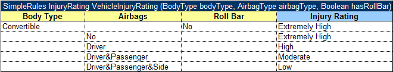

###### Simple Rules Table

A simplified decision table which has simple conditions for each parameter and a simple return can be easily represented as a **simple rules table**.

Unlike smart rules, a simple rule table uses all input parameters to associate them with condition columns in strict order, determined by simple logic, and using no titles. The value of the first column is compared with the value of the first input parameter, and so on. The value of the last column (return column) returns as a result. This means that input parameters must be in the same order as the corresponding condition columns, and the number of inputs must be equal to the number of conditions.

The simple rules table header format is as follows:

`SimpleRules <Return type> RuleName(<Parameter type 1> parameterName1, (<Parameter type 2> parameterName 2….)`

The following is an example of a simple rules table header:

*Simple rules table example*

**Note:** If a string value contains a comma, the value must be delimited with the backslash (\\) separator followed by a comma. Otherwise, it is treated as an array of string elements as described in [Ranges and Arrays in Smart and Simple Decision Tables](12-ranges-and-arrays-in-smart-and-simple-decision-tables.md#ranges-and-arrays-in-smart-and-simple-decision-tables).

Restrictions for a simplified decision table are as follows:

-   Condition values must be of the same type or be an array or range of the same type as corresponding input parameters.
-   Return values must have the type of the return type from the decision table header.

