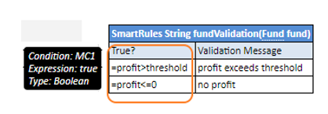

###### Smart Rules Table

A decision table which has simple conditions for input parameters and a direct return (without expression) can be easily represented as a **smart rules table**. Comparing to a simple rules table, a smart rules table type is used more frequently because smart rules are more flexible and cover wider range of business requirements.

The smart rules table header format is as follows:

`SmartRules <Return type> RuleName(<Parameter type 1> parameterName1, (<Parameter type 2> parameterName 2…)`

*Smart rules table with simple return value*

OpenL Tablets identifies which condition сolumns correspond to which input parameters by condition titles and parameter names. First of all, OpenL parses a parameter name and splits it into words, as it interprets a part starting with a capital letter as a separate word. Then it calculates the percentage of matching words in all columns and selects the column with the highest percentage of coincidence. If the analysis returns more than one result, OpenL throws an error and requires a more unique name for the column.

**Note:** OpenL Tablets matches input parameters or its fields to the conditions columns using the score. The score is calculated based on words used in parameter naming. If the particular parameter has the highest score for the particular condition, matching occurs. If several parameters have the same score, the system displays a warning message “Ambiguous matching of column titles to DT columns. Use more appropriate titles.” To overcome this issue and improve matching, use extended names for conditions.

In case of a custom datatype input, OpenL verifies all fields of the input object to match them separately with appropriate conditions using field names, in addition to input names, and column titles.

*Smart rules table with object-input*

OpenL is capable of matching abbreviations as well.

During rules execution, the system checks condition and input values on equality or inclusion and returns the result from the return columns, that is, the last columns identified as the result.

In the example above, the **driverType** value is compared with values from the **Type of Driver** column, the **maritalStatus** value is compared with the **Marital Status** column values, and the value from the **Driver Premium** column is returned as the result.

**Note:** To insure the system checks a condition with an appropriate input parameter, the user can ”hover” with a mouse over the column title and see the hint with this information in OpenL Studio.

If a string value of the condition contains a comma, the value must be delimited with the backslash (\\) separator followed by the comma. Otherwise, it is treated as an array of string elements as described in [Ranges and Arrays in Smart and Simple Decision Tables](12-ranges-and-arrays-in-smart-and-simple-decision-tables.md#ranges-and-arrays-in-smart-and-simple-decision-tables):

*Comma within a string value in a Smart table*

To define a range of values, two columns of the condition can be merged. In this case, the whole condition is interpreted as` min <= input parameter && input parameter < max`.

*Using min and max values for a range in the condition column*

Special conditions not matching any particular input fields can be used in smart rules tables, for example, for validation rules definition. Column header for such condition must contain the word ‘true’. If there are other condition headers containing the word ‘true’, the name must be explicitly declared as “Is True?”. All values in such column are expressions or Boolean values. Such condition can also be used in the smart lookup tables.

*Example of a condition that is a Boolean expression*

If there is a horizontal condition of the Boolean type and the condition title is not a merged cell, it is preferable to use the title **is true?** instead of **true** because the title can be interpreted as a horizontal condition and cause wrong compilation.

A smart rule table can contain multiple and compound returns as described in [Multiple Return Columns in Smart Rules Tables](07-multiple-return-columns-in-smart-rules-tables.md#multiple-return-columns-in-smart-rules-tables) and use external tables as described in [External Tables Usage in Smart Decision Tables](11-external-tables-usage-in-smart-decision-tables.md#external-tables-usage-in-smart-decision-tables).

