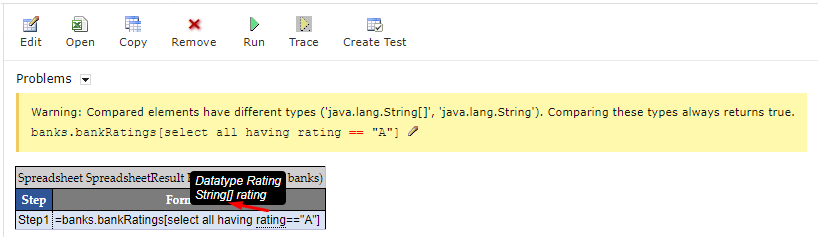
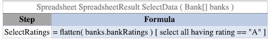

# Operators Used in OpenL Tablets

The full list of OpenL Tablets operators in order of priority is as follows:

| Operator                                      | Description                                                                                                                                                                                                                                                                                                                                                                                                                                                                          |
|-----------------------------------------------|--------------------------------------------------------------------------------------------------------------------------------------------------------------------------------------------------------------------------------------------------------------------------------------------------------------------------------------------------------------------------------------------------------------------------------------------------------------------------------------|
| =                                             | Simple assignment operator. C = A + B will assign value of A + B into C.  Chaining the assignment operator is possible to assign a single value to multiple variables: C = A = B.                                                                                                                                                                                                                                                                                                     |
| +=                                            | Add and assignment operator.  It adds right operand to the left operand and assigns the result to left operand.  C += A is equivalent to C = C + A.                                                                                                                                                                                                                                                                                                                                    |
| -=                                            | Subtract and assignment operator.  It subtracts the right operand from the left operand and assigns the result to left operand.  C -= A is equivalent to C = C – A.                                                                                                                                                                                                                                                                                                                    |
| \*=                                           | Multiply and assignment operator.  It multiplies the right operand with the left operand and assigns the result to left operand.  C \*= A is equivalent to C = C \* A.                                                                                                                                                                                                                                                                                                                 |
| /=                                            | Divide and assignment operator.  It divides the left operand with the right operand and assigns the result to left operand.  C /= A is equivalent to C = C / A.                                                                                                                                                                                                                                                                                                                        |
| %=                                            | Deprecated. Use mod(x, y) math function instead.  Remainder and assignment operator.  It divides and takes the remainder using two operands and assigns the result to left operand.  C %= A is equivalent to C = C % A.                                                                                                                                                                                                                                                                 |
| **Conditional operator**                      |                                                                                                                                                                                                                                                                                                                                                                                                                                                                                      |
| ? : ` condition ? valueIfTrue : valueIfFalse` | Conditional, or ternary, operator that takes three operands and is used as shortcut for if-then-else statement.  If `condition` is true, the operator returns the value of the `valueIfTrue `expression;  otherwise, it returns the value of `valueIfFalse`.                                                                                                                                                                                                                           |
| **Boolean OR**                                |                                                                                                                                                                                                                                                                                                                                                                                                                                                                                      |
| \|\| or "or"                                  | Logical OR operator. If any of the two operands are true, the condition becomes true.                                                                                                                                                                                                                                                                                                                                                                                                |
| **Boolean AND**                               |                                                                                                                                                                                                                                                                                                                                                                                                                                                                                      |
| && or "and"                                   | Logical AND operator. If both the operands are true, the condition becomes true.                                                                                                                                                                                                                                                                                                                                                                                                     |
| **Equality**                                  |                                                                                                                                                                                                                                                                                                                                                                                                                                                                                      |
| ==                                            | Equality operator checks if the values of two operands are equal.                                                                                                                                                                                                                                                                                                                                                                                                                    |
| != or \<\>                                    | Inequality operator checks if the values of two operands are equal.  If values are not equal, the condition becomes true.                                                                                                                                                                                                                                                                                                                                                             |
| ====                                          | Strict equality operator checks if the values of two operands are equal without considering inaccuracy of float point values.  If values are equal strictly, the condition becomes true.                                                                                                                                                                                                                                                                                              |
| !===                                          | Strict inequality operator checks if the values of two operands are equal regardless of inaccuracy of float point values.  If values are not equal strictly, the condition becomes true.                                                                                                                                                                                                                                                                                              |
| string==                                      | String equality operator checks whether values of two operands are equal.  First, letter parts are compared, and if they are equal, numeric parts are compared, as if these are numbers, and not text.                                                                                                                                                                                                                                                                                |
| string\<\> or string!=                        | String inequality operator checks if the values of two operands are equal.  If the values are not equal, the condition becomes true.  First, letter parts are compared, and if they are equal, numeric parts are compared, as if these are numbers, and not text.                                                                                                                                                                                                                      |
| **Relational**                                |                                                                                                                                                                                                                                                                                                                                                                                                                                                                                      |
| \<                                            | Less than operator checks if the value of the left operand is less than the value of the right operand.                                                                                                                                                                                                                                                                                                                                                                              |
| \>                                            | Greater than operator checks if the value of the left operand is greater than the value of right operand.                                                                                                                                                                                                                                                                                                                                                                            |
| \<=                                           | Less than or equal to operator checks if the value of left operand is less than or equal to the value of right operand.                                                                                                                                                                                                                                                                                                                                                              |
| \>=                                           | Greater than or equal to operator checks if the value of the left operand is greater than or equal to the value of right operand.                                                                                                                                                                                                                                                                                                                                                    |
| \<==                                          | Strict less than operator checks if the value of the left operand is less than the value of right operand  without considering inaccuracy of float point values.                                                                                                                                                                                                                                                                                                                      |
| \>==                                          | Strict greater than operator checks if the value of the left operand is greater than the value of right operand  without considering inaccuracy of float point values.                                                                                                                                                                                                                                                                                                                |
| \<===                                         | Strict less than or equal to operator checks if the value of the left operand is less than or equal to the value of right operand  without considering inaccuracy of float point values.                                                                                                                                                                                                                                                                                              |
| \>===                                         | Strict greater than or equal to operator checks if the value of the left operand is greater than or equal to the value  of right operand without considering inaccuracy of float point values.                                                                                                                                                                                                                                                                                        |
| string\<                                      | String less than operator checks if the value of the left operand is less than the value of the right operand.  First, letter parts are compared, and if they are equal, numeric parts are compared, as if these are numbers, and not text.                                                                                                                                                                                                                                           |
| string\>                                      | String greater than operator checks if the value of the left operand is greater than the value of right operand.  First, letter parts are compared, and if they are equal, numeric parts are compared, as if these are numbers, and not text.                                                                                                                                                                                                                                         |
| string\<=                                     | String less than or equal to operator checks if the value of left operand is less than or equal to the value of right operand.  First, letter parts are compared, and if they are equal, numeric parts are compared, as if these are numbers, and not text.                                                                                                                                                                                                                           |
| string\>=                                     | String greater than or equal to operator checks if the value of the left operand is greater than or equal to the value of right operand.  First, letter parts are compared, and if they are equal, numeric parts are compared, as if these are numbers, and not text.                                                                                                                                                                                                                 |
| **Additive**                                  |                                                                                                                                                                                                                                                                                                                                                                                                                                                                                      |
| +                                             | Addition operator adds values on either side of the operator.                                                                                                                                                                                                                                                                                                                                                                                                                        |
| -                                             | Subtraction operator subtracts right-hand operand from left-hand operand.                                                                                                                                                                                                                                                                                                                                                                                                            |
| **Multiplicative**                            |                                                                                                                                                                                                                                                                                                                                                                                                                                                                                      |
| \*                                            | Multiplication operator multiplies values on either side of the operator.                                                                                                                                                                                                                                                                                                                                                                                                            |
| /                                             | Division operator divides left-hand operand by right-hand operand.                                                                                                                                                                                                                                                                                                                                                                                                                   |
| %                                             | Deprecated. Use mod(x, y) math function instead. Remainder operator divides left-hand operand by right-hand operand and returns remainder.                                                                                                                                                                                                                                                                                                                                           |
| **Power**                                     |                                                                                                                                                                                                                                                                                                                                                                                                                                                                                      |
| \*\*                                          | Deprecated. Use pow(x, y) math function instead.  Exponentiation operator returns the result of raising left-hand operand to the power right-hand operand.                                                                                                                                                                                                                                                                                                                            |
| **Unary**                                     |                                                                                                                                                                                                                                                                                                                                                                                                                                                                                      |
| +                                             | Unary plus operator precedes its operand and indicates positive value.                                                                                                                                                                                                                                                                                                                                                                                                               |
| -                                             | Unary negation operator precedes its operand and negates it.                                                                                                                                                                                                                                                                                                                                                                                                                         |
| ++                                            | Deprecated. Use x = x + 1 expression instead.  Increment operator increments its operand (increases the value of operand by 1) and returns a value.  If a postfix with an operator is used after an operand (for example, x++), it returns the value before incrementing.  For instance, x = 3; y = x++; gives y = 3, x = 4.   If a prefix with operator is used before an operand (for example, ++x), it returns the value after incrementing.  For instance, x = 3; y = ++x; gives y = 4, x = 4. |
| --                                            | Deprecated. Use x = x – 1 expression instead.  Decrement operator decrements its operand (decreases the value of operand by 1) and returns a value.  If a postfix with an operator is used after an operand (for example, x--), it returns the value before decrementing.  For instance, x = 3; y = x--; gives y = 3, x = 2.   If a prefix with an operator is used before an operand (for example, ++x), it returns the value after decrementing.  For instance, x = 3; y = --x; gives y = 2, x = 2. |
| ! or not                                      | Logical NOT operator reverses the logical state of its operand.  If a condition is true, then Logical NOT operator will make it false.                                                                                                                                                                                                                                                                                                                                                |
| (Datatype) x                                  | Cast operator converts the operand value `x` to the specified `Datatype` type.                                                                                                                                                                                                                                                                                                                                                                                                       |

When comparing elements of different types, such as an array and an element of the array, or different datatypes, or string and integer, a warning message is displayed. An example is as follows:

`Warning: Compared elements have different types ('java.lang.String[]', 'java.lang.String'). Comparing these types always returns true. banks.bankRatings[select all having rating == "A"]`

Suppose you're working with a list of bank ratings stored in an array and you want to select banks ratings with a value of "A". If you mistakenly compare the whole array to the single string "A", this warning can appear, indicating a mismatch in the types being compared.

*Comparing elements of different types*

To resolve this warning, use elements of the same type for comparison. To compare an array to an element of the array, use the `flatten` function.

