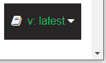
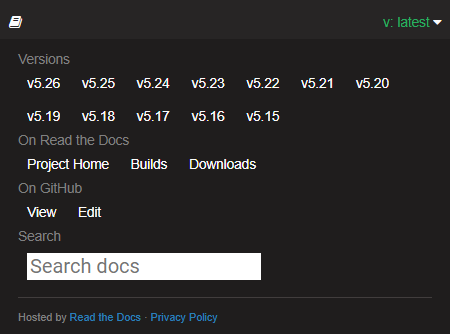

<h3 style="margin-bottom:1.25em;">User Guides for v5.27</h3>

User guides are available via the left navigation.

At the top of each page is a link to the corresponding markdown file in the GitHub source repository, via which visitors can propose documentation updates.

(You can also click the GitHub link in the header bar to open the root of the source repository)

<h3> User Guides for Other Versions</h3>

To access user guides for other versions of the software, click the small flyout menu banner in the bottom right of the website:

Clicking the banner opens a pane with a link to all the other versions.

