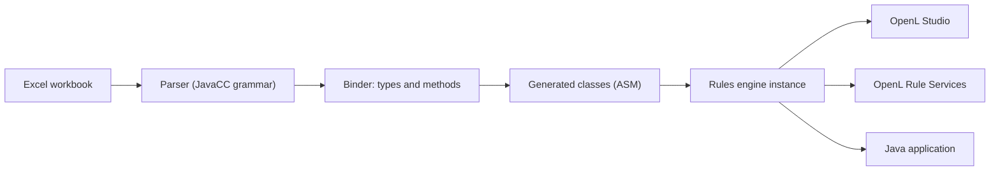

# Codebase Tour

OpenL Tablets compiles Excel workbooks into Java classes at run time and exposes them as services. The repository is a
multi-module Maven project; every module inherits the version of the root `pom.xml`.

## Core Flow



## Repository Layout

```text
openl-tablets/
  DEV/          Rules engine
  STUDIO/       OpenL Studio: Spring backend and React frontend, repositories, workspace
  WSFrontend/   OpenL Rule Services
  Util/         Maven plugin, archetypes, OpenAPI tools, OpenTelemetry extension
  ITEST/        Integration tests
  DEMO/         The demo package
  Docs/         The documentation site and the user guides
  Dockerfile    The image of OpenL Studio and Rule Services
  compose.yaml  Studio, Rule Services, PostgreSQL and a proxy for development
```

A folder-specific `AGENTS.md` describes the conventions of `DEV/`, `STUDIO/`, `STUDIO/org.openl.rules.webstudio/`,
`STUDIO/studio-ui/`, `WSFrontend/` and `ITEST/`; read it before changing a folder.

## DEV — Rules Engine

| Module                       | Content                                                                         |
|------------------------------|---------------------------------------------------------------------------------|
| `org.openl.rules`            | The engine: type system, parser, binder, bytecode generation, runtime, tables   |
| `org.openl.commons`          | Shared utilities (`org.openl.util`, `org.openl.message`)                        |
| `org.openl.rules.project`    | Project model (`rules.xml`, `rules-deploy.xml`), instantiation strategies        |
| `org.openl.rules.util`       | Functions that rules call                                                       |
| `org.openl.rules.annotations`| Annotations for extending rules                                                 |
| `org.openl.rules.gen`        | Code generation for bindings                                                    |
| `org.openl.rules.test`       | Functional tests of the engine                                                  |
| `org.openl.rules.demo`       | The demo projects of OpenL Studio: templates, examples and tutorials, tested in the build |
| `org.openl.spring`           | Spring integration: property sources, conditional beans                         |

Packages of `org.openl.rules` (`DEV/org.openl.rules/src/org/openl/`):

- **`types`** — the type system: `IOpenClass`, `IOpenMethod`, `IOpenField`.
- **`binding`** — binds syntax to types and methods.
- **`rules/lang/xls`** — reads workbooks and binds the tables (`Parser`, `XlsBinder`).
- **`rules/dt`**, **`rules/calc`**, **`rules/data`**, **`rules/tbasic`**, **`rules/testmethod`** — decision tables,
  spreadsheets, data tables, algorithms, tests.
- **`rules/runtime`** — `RulesEngineFactory`, the entry point to compile a workbook.
- **`ie/constrainer`** — the gap and overlap check of decision tables.
- **`conf`** — configuration of the function libraries (`LibrariesRegistry`).

The grammar of the expression language is `DEV/org.openl.rules/grammar/bexgrammar.jj`.

## STUDIO — OpenL Studio

The server renders no page: a Spring backend serves the REST API under `/rest`, a WebSocket under `/ws`, and one
page of the React application for every other address.

| Module                                   | Content                                                              |
|------------------------------------------|----------------------------------------------------------------------|
| `org.openl.rules.webstudio`              | The backend and the WAR; security, ACL, OpenAPI and table packages   |
| `studio-ui`                              | The React and TypeScript frontend                                    |
| `studio-docs`                            | The user guides packed for the viewer at `/docs`                     |
| `org.openl.rules.repository`             | The repository abstraction; JDBC repositories                        |
| `org.openl.rules.repository.git`, `.aws`, `.azure` | Git, AWS S3 and Azure Blob repositories                    |
| `org.openl.rules.workspace`              | Workspaces and project management                                    |
| `org.openl.rules.diff`, `org.openl.rules.xls.merge` | Comparison and merge of workbooks                         |
| `org.openl.rules.jackson`, `.jackson.configuration` | JSON serialization                                        |
| `org.openl.rules.project.openapi`, `.validation.openapi` | OpenAPI generation and validation of projects        |

Packages of `org.openl.rules.webstudio` (`STUDIO/org.openl.rules.webstudio/src/org/openl/`):

- **`studio`** — the REST controllers, services and models by area: `projects`, `repositories`, `deployment`, `users`,
  `tags`, `settings`, `security`, `socket` (WebSocket), `session`, `compare`, `openapi`, `config`, `common`.
- **`rules/webstudio`** — the application core: configuration and services.
- **`rules/rest`** — models and handlers of the REST API.
- **`rules/spring`** — the OpenAPI integration of Spring.
- **`rules/ui`**, **`rules/table`**, **`rules/tableeditor`** — the compile status, the formatting of cell values, and the
  cell editor model that the table REST API reads.
- **`rules/security`**, **`security/acl`** — users and groups, authentication, and access control lists.

The Flyway scripts of the user database are in `STUDIO/org.openl.rules.webstudio/resources/db/flyway/`. The folders of
`STUDIO/studio-ui/src` are `components`, `containers`, `pages`, `layouts`, `routes`, `services`, `store`, `hooks`,
`contexts`, `locales`, `types` and `utils`.

## WSFrontend — Rule Services

| Module                                       | Content                                                     |
|----------------------------------------------|-------------------------------------------------------------|
| `org.openl.rules.ruleservice`                | Loading, compiling and publishing of services               |
| `org.openl.rules.ruleservice.ws`             | REST services (CXF), the admin API, servlets, Spring config |
| `org.openl.rules.ruleservice.ws.all`         | The WAR with the extra repositories and the log storage     |
| `org.openl.rules.ruleservice.deployer`       | Deployment of rule artifacts                                |
| `org.openl.rules.ruleservice.kafka`          | Kafka integration                                           |
| `org.openl.rules.ruleservice.ws.storelogdata`, `.db`, `.db.annotation` | Storage of requests and responses |
| `org.openl.rules.ruleservice.annotation`, `.ws.annotation`, `.common`, `.ws.common` | Annotations and shared types |

`RuleServiceLoader` (`org.openl.rules.ruleservice.loader`) loads the rules from a repository.

## Util

- **`openl-maven-plugin`** — group `org.openl.rules`; the goals are `compile`, `generate`, `test`, `package`, `verify`,
  `deploy`, `migrate`, `pomless`, `prepare-pom`, `prepare-bom`, `sync-versions` and `help`. See
  [OpenL Maven Plugin](../ref/openl-maven-plugin.md).
- **`openl-project-archetype`**, **`openl-simple-project-archetype`** — Maven archetypes of rules projects.
- **`openl-openapi-parser`**, **`openl-openapi-model-scaffolding`**, **`openl-excel-builder`** — read an OpenAPI file and
  scaffold the model and the workbook of a project.
- **`openl-rules-opentelemetry`** — the OpenTelemetry agent extension that traces rules.
- **`openl-yaml`** — YAML data format for rules.

## ITEST

Declarative HTTP suites (`*.req` and `*.resp`) run against a real web application, with TestContainers for the
databases, Keycloak and S3. The suites are the `ITEST/itest.*` modules, and `ITEST/server-core` is the shared test
server. The suites of OpenL Studio are the modules of `ITEST/itest.studio`. See
[`ITEST/AGENTS.md`](https://github.com/openl-tablets/openl-tablets/blob/main/ITEST/AGENTS.md).

## Where to Start Reading

1. `DEV/org.openl.rules/src/org/openl/rules/runtime/RulesEngineFactory.java` — compiles a workbook into an instance.
2. `DEV/org.openl.rules.project/src/org/openl/rules/project/instantiation/SimpleProjectEngineFactory.java` — compiles a
   whole project.
3. `DEV/org.openl.rules/src/org/openl/types/IOpenClass.java` — the type system.
4. `DEV/org.openl.rules/src/org/openl/rules/dt/IDecisionTable.java` — decision tables.
5. `STUDIO/org.openl.rules.webstudio/src/org/openl/rules/webstudio/web/servlet/` — the servlets that answer `/rest`,
   `/ws`, `/docs` and the page of the React application.

## Concepts

### Rules project

A rules project holds Excel workbooks and the optional descriptors `rules.xml` and `rules-deploy.xml`. Without a
`modules` list in `rules.xml`, every `.xlsx` file under `rules/` and `tests/` is a module. See
[Rules Project Structure](../ref/project-structure.md), [rules.xml](../ref/rules.xml.md) and
[rules-deploy.xml](../ref/rules-deploy.xml.md).

### Table types

The table type is the first word of the table header. The keywords are the constants of `IXlsTableNames`: `Rules`,
`SimpleRules`, `SmartRules`, `SimpleLookup`, `SmartLookup`, `Spreadsheet`, `Method`, `TBasic`, `ColumnMatch`, `Data`,
`Datatype`, `Test`, `Run`, `Properties`, `Environment`, `Constants` and others. See [Table Types](../ref/table-types.md).

### Type system

OpenL has its own types parallel to Java: `IOpenClass` for a class, `IOpenMethod` for a method and `IOpenField` for a
field. Types can be built from tables, for example from a Datatype table.

### Runtime context

`IRulesRuntimeContext` (`org.openl.rules.context`) carries the values that select a version of a table, such as the
current date or the region.

## Build Artifacts

| Artifact                | Location                                                      |
|-------------------------|---------------------------------------------------------------|
| OpenL Studio web app    | `STUDIO/org.openl.rules.webstudio/target/webapp`              |
| Rule Services web app   | `WSFrontend/org.openl.rules.ruleservice.ws/target/webapp`     |
| The demo package        | `DEMO/target`                                                 |

Next: [Development Setup](development-setup.md) and [Architecture](../ARCHITECTURE.md).
