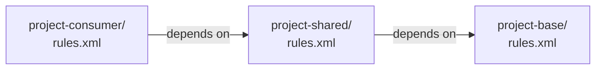

# OpenL Tablets — Rules Project Descriptor (`rules.xml`)

```xml
<!-- All inner tags of rules.xml are optional -->
<project>

    <!-- If <name> is not defined the folder name or zip file name or artifactId is used -->
    <!-- If <name> cannot be determined by some reason, an error will occur -->
    <name>My Rules Project</name>
    <comment>Optional description</comment>

    <!-- If <modules> are not defined then `rules/**/.xlsx` is used by default -->
    <modules>
        <!-- Ant-style Wildcard: match all xlsx in rules/ - it is preferred way -->
        <module>
            <name>AllRules</name>
            <rules-root path="rules/**/.xlsx"/>
        </module>
        <module>
            <!-- The real module name is filename of the matched file if absent-->
            <name>AllTests</name>
            <!-- Ant-style files inclusion -->
            <rules-root path="tests/**/.xlsx"/>
            <!-- Studio only for very rare cases to solve Out of memory errors in huge projects. -->
            <webstudioConfiguration>
                <compileThisModuleOnly>false</compileThisModuleOnly>
            </webstudioConfiguration>
        </module>
        <!-- Explicit module with a single file -->
        <module>
            <name>Main Algorithm</name>
            <rules-root path="rules/SharedRules.xlsx"/>
            <!-- Regexp method filter to include only specific methods from all modules in the generated interface. DEPRECATED -->
            <!-- Matches method signatures in the format "ReturnType methodName(Type1, Type2, ...)". -->
            <method-filter>
                <includes>
                    <value>.+DetermineIndividualPolicyPremium\(.+\)</value>
                </includes>
                <excludes>
                    <value>.+Tests\(.+\)</value>
                </excludes>
            </method-filter>
        </module>
    </modules>

    <!-- JAR and groovy dependencies on the classpath -->
    <!-- Classpath entries are resolved at runtime and can include JAR files, compiled classes, or Groovy scripts. -->
    <!-- If not defined `groovy/` path is used by default -->
    <classpath>
        <!-- Ant-style wildcard for all JARs in lib/. -->
        <!-- It is not recommended to include binary JARs files inside the project as sources. -->
        <!-- They are added automatically on the packaging maven phase. -->
        <entry path="lib/*.jar"/>
        <!-- Groovy scripts are included in the classpath and can be accessed from rule tables. -->
        <entry path="groovy/"/>
        <!-- Compiled Java classes can be included in the classpath for use in rules. -->
        <!-- It is not recommended to include compiled classes inside the project as sources. -->
        <entry path="classes/"/>
    </classpath>

    <!-- Cross-project rule dependencies -->
    <dependencies>
        <dependency>
            <name>SharedDataProject</name>
            <!-- If true - makes all modules of the dependency available without an explicit `Environment` table. -->
            <autoIncluded>false</autoIncluded>
            <!-- Maven coordinates of the dependent project; will be resolved if absent locally. -->
            <mavenArtifact>com.example:shared-data-project:1.0.0</mavenArtifact>
        </dependency>
    </dependencies>

    <!-- Ant-style (* and ?) method filter by names only are exposed in the generated interface -->
    <!-- If absent, all methods are exposed -->
    <exposed-methods>
        <include>get*</include>
        <include>calculate</include>
        <exclude>*Internal</exclude>
        <exclude>get??</exclude>
    </exposed-methods>

    <!-- Business dimension property file resolution -->
    <properties-file-name-pattern>{lob}</properties-file-name-pattern>
    <!-- Custom Java class for advanced property file name resolution logic; must implement a specific interface defined by OpenL. -->
    <properties-file-name-processor>com.example.CustomPropertiesFileNameProcessor</properties-file-name-processor>

    <!-- OpenAPI integration -->
    <!-- If absent, openapi.json in RECONCILIATION mode is defined by default -->
    <openapi>
        <!-- Path to the OpenAPI specification file; supports .json or .yaml formats. -->
        <!-- openapi.json is the default name and location for the spec file, but it can be customized as needed. -->
        <path>openapi.json</path>
        <!-- Mode of operation: GENERATION creates modules with rules from the spec; RECONCILIATION validates rules against the spec. -->
        <mode>GENERATION</mode>
        <!-- generated modules names -->
        <model-module-name>Models</model-module-name>
        <algorithm-module-name>Algorithms</algorithm-module-name>
    </openapi>
</project>
```

## Multi-Module Projects

Multiple projects can depend on one another. Each project has its own `rules.xml`.



> [Note:]
> In OpenL Studio, dependent projects must be deployed to the same repository workspace. In Rule Services, all
> projects are deployed as a deployment unit.
