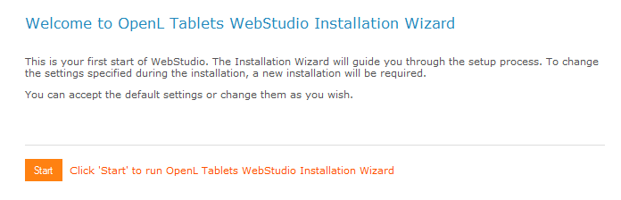
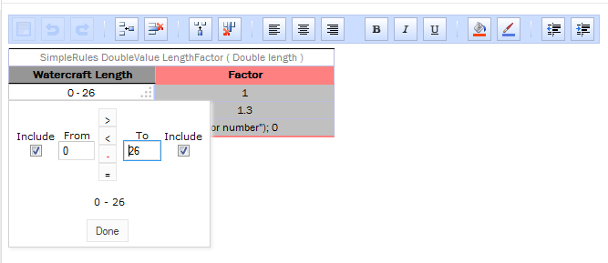
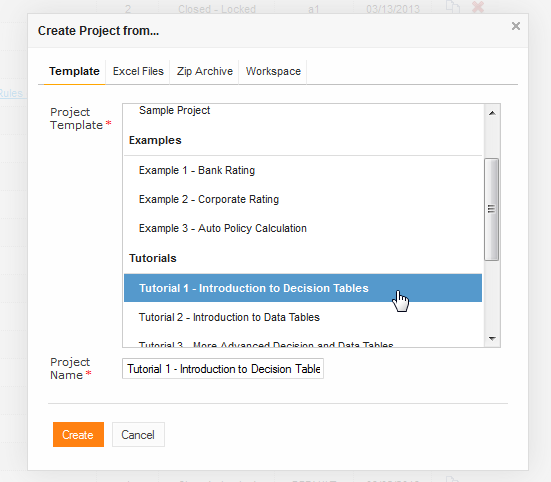
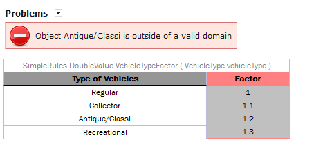

OpenL Tablets **5.10.0** is a major feature release introducing variations, dynamic interfaces, the WebStudio
Installation Wizard, and significant usability improvements.

## New Features

### Variation Functionality

Variation calculations enhance performance in heavily loaded applications. A variation represents an additional
calculation of the same rule with a slight modification in its arguments.

Key capabilities in Rules tables:

* Switch cache on/off during table recalculation.
* Define recalculation strategy explicitly (always, never, or by analyzing table logic).

### Dynamic Interface Support

The Web Services application now generates interfaces at runtime when static interfaces are not predefined. The system
automatically creates methods based on modules or multi-module configurations.

### WebStudio Installation Wizard

A new wizard guides initial setup with options to:

* Define the working directory.
* Select Single-user or Multi-user mode.
* Choose a database for user management.

## Improvements

**Core:**

* New utility functions: `isEmpty`, `removeStart`, `removeEnd`, `subString`, `replace`, `startsWith`, `endsWith`,
  `sort`, `dateToString`.
* Validation for condition values of alias datatypes in Simple Rules.
* Support for `null`/`Empty` as expected results in Test tables.
* Enhanced `SELECT ALL`, `SELECT FIRST` functionality with `ORDER BY`, `SPLIT BY`, and `TRANSFORM TO` operators.
* Explicit collection element definition for arrays.
* New keywords: `Test` and `Run` for the respective table types.

**WebStudio:**

* Simple Rules table creation wizard.

* Embedded Range Editor for Range datatype values.

* Production Repository/ies browsing UI.

* Services deployment configuration interface.
* Project creation from Tutorials and Examples.

* Redesigned Welcome page.
* Improved button titles and property hints.
* Repository Editor project filtering.
* Enhanced user management with admin privileges.
* Performance improvements and additional UI enhancements.

**Web Services:**

* Deployment isolation feature enabling module-scoped dependency definitions.

## Bug Fixes

**Core:**

* Fixed: `FloatValue` round produces incorrect values in specific cases.
* Fixed: Dispatching malfunction with overloaded tables missing business dimension properties.
* Fixed: Project class loader isolation and lazy module loading problems.
* Fixed: Lookup errors with merged condition cells.
* Fixed: Run table errors with `null` collections.
* Fixed: Sum operation producing incorrect results.
* Fixed: Missing setter methods for fields.
* Fixed: Incorrect module loading with malformed included project datatypes.
* Fixed: Test summand reordering producing different results.
* Fixed: Empty run method table test results.

**WebStudio:**

* Fixed: Memory leaks.
* Fixed: Startup failure with workspace paths containing spaces.
* Fixed: Table style corruption after property additions.
* Fixed: Timeout login page centering error.
* Fixed: HTTP 500 error on Explanation screen for `NaN` results.
* Fixed: Dependency manager error message timing issues.
* Fixed: Implicit refresh failures for dependent modules.
* Fixed: File duplication when combining modules with spaces.
* Fixed: Security restriction preventing Deploy Configuration modifications.
* Fixed: Cell style limit exceeded during copying.
* Fixed: Improper `SpreadsheetResult` display after method calls.

## Deprecations

| Deprecated Item                             | Notes |
|:--------------------------------------------|:------|
| Table property `Name` in Core               | —     |
| `format(Date date)` function                | —     |
| `format(Date date, String format)` function | —     |
