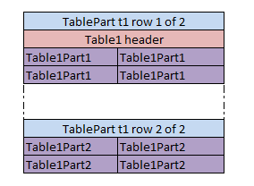
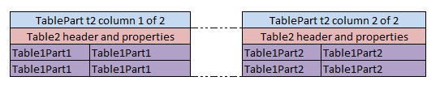
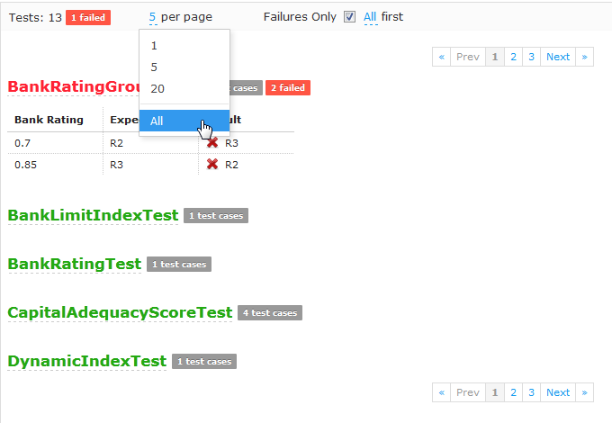
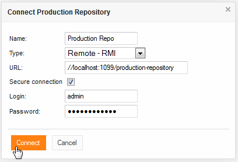

OpenL Tablets **5.11.0** is a feature release with significant additions to testing, table management, and WebStudio
usability. Eclipse plugins are deprecated.

## Contents

* [New Features](#new-features)
* [Improvements](#improvements)
* [Bug Fixes](#bug-fixes)
* [Deprecations](#deprecations)

## New Features

### Table Part

Table Part functionality enables splitting a large table into smaller parts, supporting `.xls` files with tables
exceeding 256 columns or 65,536 rows by decomposing them across multiple worksheets.

### Testing Tool: Precision

A new `Precision` property for `Double` result validation enables approximate comparison of expected versus returned
values, useful for non-terminating rational numbers such as π.

### Testing Tool: Results Paging and Failure Filtering

Users can now display failed test cases only and limit the quantity shown per unit test. Results display across multiple
pages to improve performance with large test datasets.

## Improvements

**Core:**

* Array element attribute specification using `<name>[i].<attribute>` syntax.
* Table relationship specification using `> <referenced table>.<attribute> <column>` syntax.
* Runtime context classes updated to MIT License.

**WebStudio:**

* Secured repository creation/connection option.
* Easy Editing workflow with direct module export from the Rules Editor.
* **Unlock** function for projects locked by other users.
* Internet Explorer 10 support.
* User profile management page.
* Project history file configuration.
* Project/module name validation for forbidden symbols.
* WebStudio System properties applicable without server restart.
* Flyway-based automated database migration.
* Oracle and MS SQL database support.
* Multiple UI enhancements including failed test case count display and property grouping.

**Web Services:**

* Annotation support in Dynamic Interface (variations, dispatcher).

**Other:**

* Custom Spreadsheet Type enabled by default.
* Upgraded Apache Jackrabbit to 2.4.4.
* OpenL Tablets Demo project introduced.
* `openl-simple-project` included in Maven Archetype.

## Bug Fixes

* Fixed: Array Index operators functionality.
* Fixed: Table editor formatting preservation with the Bold option.
* Fixed: Project sorting in the Rules Editor and Repository filters.
* Fixed: "Include" feature bugs.
* Fixed: Custom `SpreadsheetResult` binding errors.
* Fixed: Spreadsheet return type from TBasic table results.
* Fixed: Multiple Explanation-related issues.
* Fixed: Date editor support for non-standard formats.
* Fixed: Repository security permissions.

## Deprecations

| Deprecated Item | Notes                                                               |
|:----------------|:--------------------------------------------------------------------|
| Eclipse plugins | Deprecated starting from 5.11 — will be removed in a future release |
