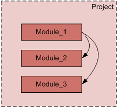
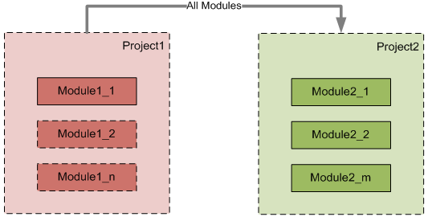
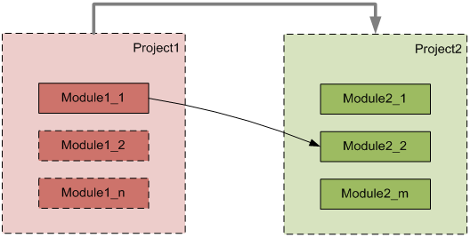
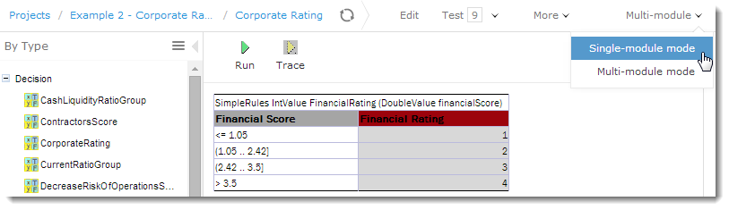
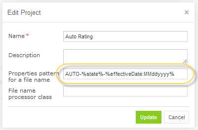
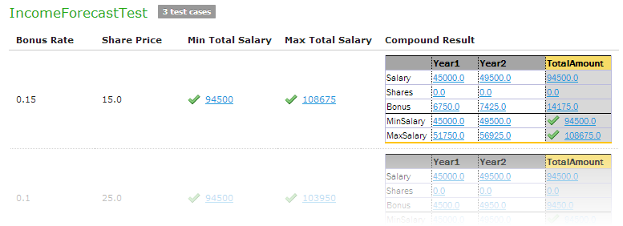
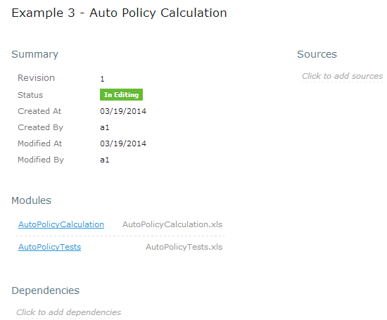

OpenL Tablets **5.12.0** is a major feature release significantly enhancing multi-module project management, testing
capabilities, and WebStudio usability. Eclipse plugins have been discontinued.

## New Features

### Multi-Module Project Dependencies

Dependencies management has been changed to provide a consistent experience across the rules management environment.
Projects now support unified dependency handling where all modules within one project can reference rules in all other
modules of that same project.

### Single-Module and Multi-Module Viewing Modes in WebStudio

Two viewing modes support flexible dependency management:

* **Single-module mode**: Opens the module taking into account only module dependencies defined in the Environment
  table.
* **Multi-module mode**: Opens all modules of the current project with all their dependencies.

### Properties from File Name

Table properties can be configured at module level through file naming patterns, enabling business users to define
properties without creating separate Properties tables.

### Enhanced Testing for Spreadsheet Results

WebStudio provides the ability to test cells of a resulting Spreadsheet that contain values of complex types, including
arrays of values, datatypes with multiple attributes, and nested Spreadsheets.

A **Compound Result** setting lets users display full test results or only tested values.

## Improvements

**Core:**

* All rule calls are dispatched transparently between dependent modules.
* Access to `SpreadsheetResult` cells enabled via column and row names with explicit datatype:
  `(MyDatatype) spreadsheet.$ColumnName$RowName`.

**WebStudio:**

* WebStudio links to projects, modules, and rule tables are now bookmarkable.
* Project and Module Pages for viewing and editing configuration details.
* Breadcrumb navigation.
* Header redesign.
* User Settings page for individual project, table, and testing preferences.
* Auto-addition of new modules via Repository uploads.
* Project name auto-population from descriptors or ZIP filenames.
* Multi-threaded test execution with parallel test case configuration.
* Isolated projects restricting access to project rules and dependencies.
* Comment capability when saving projects.
* Auto-adjusting table widths.
* Context variable columns in test results.
* Auto-scrolling to hidden table entries.
* Empty value displayed as "Empty" label.
* Synchronized page part opening.
* Memory usage and Repository page performance optimization.

**Web Services:**

* Compilation thread limitation and configuration.

**Demo Package:**

* Enhanced UI in the Web Services Example Client.
* Updated WebStudio repository tutorials.

**Default Settings Changed:**

* Rules display mode set to "By Type" by default.
* Table properties update setting turned off by default.
* Multi-module mode enabled by default.

**Infrastructure:**

* Maven Plugin introduced for generating interfaces, validating, and testing rules.

## Bug Fixes

* Fixed: Deleting and closing projects containing JAR files.
* Fixed: Adding properties to large tables via WebStudio.
* Fixed: Using Data tables from dependency modules.
* Fixed: Table Part functionality in Data tables.
* Fixed: Test table transposition.
* Fixed: Explanation functionality from dependency modules.
* Fixed: Maximum cell styles excess.
* Fixed: Empty value handling in Data tables.
* Fixed: Collection validation in Data tables.
* Fixed: Testing separate array elements.
* Fixed: Result calculation and display without rounding.
* Fixed: Dependency functionality in Web Services.

## Deprecations

| Deprecated Item                   | Notes                                                                     |
|:----------------------------------|:--------------------------------------------------------------------------|
| Eclipse plugins                   | Discontinued and deleted — use the OpenL Maven Plugin instead             |
| `id` tag in `rules.xml`           | Deprecated                                                                |
| WebStudio Repository dependencies | Replaced by Project dependencies via the Project page in the Rules Editor |
| Rules Configuration tab           | Replaced by the Project page in the Rules Editor                          |
| Common repository                 | Removed                                                                   |
