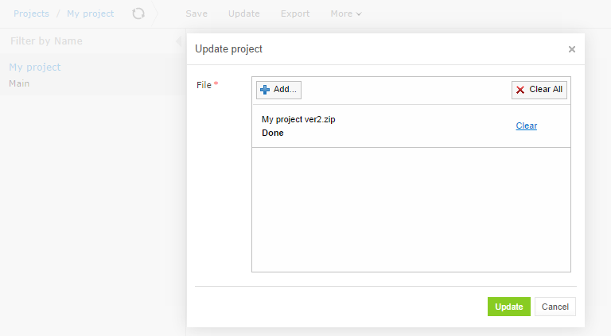
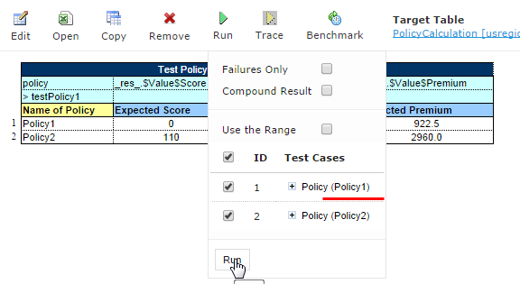

OpenL Tablets **5.13.0** is a feature release with major usability improvements to WebStudio, web services, and the core
engine.

## New Features

### Update Project from ZIP File

Projects can be updated directly in the Editor from ZIP files containing project contents. The "Update" button appears
for projects with "In Editing" status in the WebStudio top menu. A warning message is shown if the existing project
structure differs from the uploaded file.

### Dependency Manager Support for Java Code

The dependency manager now propagates all imported packages from dependency modules, allowing modules to inherit imports
from their dependencies without requiring repeated import instructions.

### Management Page for Web Service Application

The Web Service application now features a custom management page replacing the default CXF interface. It displays all
deployed services and their methods in an improved UI, removes unnecessary technical details, and includes service
startup timestamps.

### Auto Detection of Spreadsheet Cell Types

Spreadsheet tables can now autodetect cell types containing OpenL formulas. Enable autodetection by setting the
`autoType` property to `true`. Future releases will make this the default behavior.

## Improvements

**Core:**

* Performance optimization for dispatching between rule versions overloaded by business dimensions.
* Dispatcher functionality applied to single tables with business dimension properties.
* Enhanced `RuntimeContext` and `RuntimeEnvironment` creation API with factory implementations.
* Lazy loading for test case input parameters in Run and Run All buttons.
* New `getValues()` function retrieves all values for Alias Datatypes.
* New `flatten()` function converts multidimensional arrays to single-dimensional form.
* Default value capability (`_DEFAULT_` keyword) for compound type fields in Datatypes.
* Nested Spreadsheet testing (exceeding 2 nesting levels) now supported.

**WebStudio:**

* Google Analytics integration.
* Module name editing on the Module page.
* Secure URLs across all pages.
* Custom template support in the rules project creation dialog.
* Filter to hide overloaded tables.
* Export of the current version from the Editor and from "Closed" status projects.
* Wildcard display and editing for modules.
* Bookmarkable URLs in the Editor (project/module/table pages, test results, module navigation).
* Test Settings added for the Rules table Test button.
* Test table ID display as a separate column with "Range of IDs" feature for selected test cases.
* Password security improved: salt and stronger hashing.
* Admin UI added for user password resets.
* Post-login redirect to the originally requested page.

**Web Services:**

* Filter to remove default methods from deployed services.
* `SpreadsheetResult` type data return support.
* Support for projects with Cyrillic symbols in names.
* Web services settings simplified.

**Demo Package:**

* Welcome Demo page added.
* Updated for JRE compatibility.

**Library Updates:**

* Spring upgraded to 4.0.5.RELEASE.
* CXF upgraded to 3.0.0.

## Bug Fixes

* Fixed: Error after opening a deployment in the Production repository.
* Fixed: Input parameters for overloaded tables not displaying in the Trace window.
* Fixed: Error after exporting newly uploaded files.
* Fixed: Trace window unable to open the correct table when rules call overloaded rules from other modules with indexed
  conditions.
* Fixed: Multiple project compilations during single-module/multi-module mode switching.
* Fixed: Limitation on Datatype table field definition (256 field maximum).
* Fixed: Error following `.jar` file deletion in the Repository.
* Fixed: Test table input parameters changing on each retest.
* Fixed: Index condition support issues — added argument type support and improved range support.
* Fixed: Explanation table display failure when rules originate from different modules.

## Deprecations

| Deprecated Item                  | Notes                                  |
|:---------------------------------|:---------------------------------------|
| `type` tag in `rules.xml`        | Use alternative descriptor fields      |
| Default `<OPENL_HOME>` directory | Changed to `\Users\<username>\.openl\` |

## Library Updates

| Library | Version       |
|:--------|:--------------|
| Spring  | 4.0.5.RELEASE |
| CXF     | 3.0.0         |
